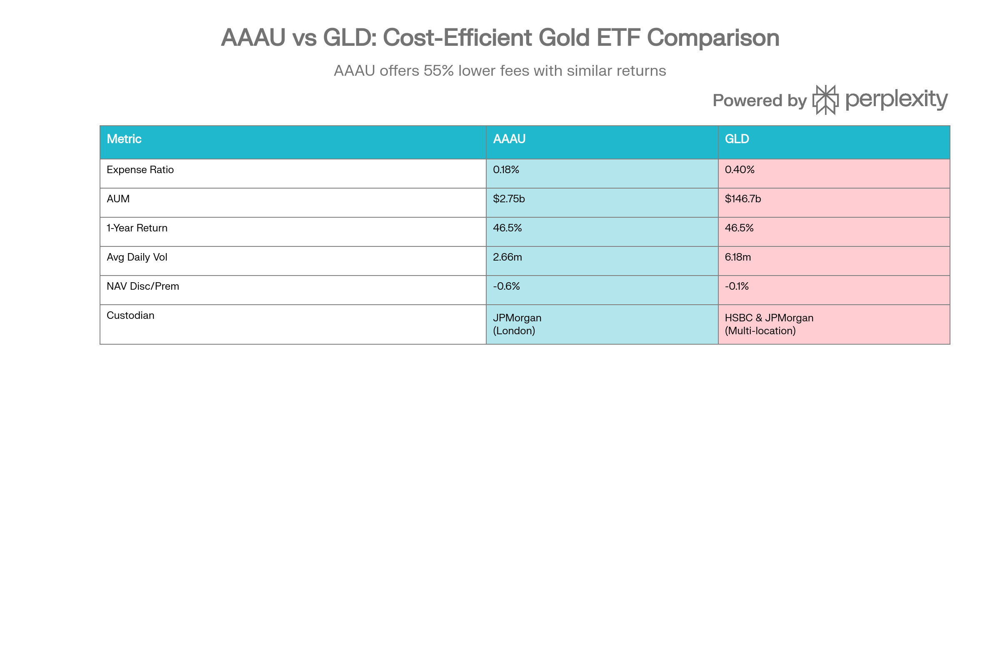

## 분류 근거

AAAU는 파생상품이나 레버리지 없이 100% 실물 금 바를 보유하는 그랜터 신탁 ETF입니다. 실물 보유형과 채굴기업 주식형을 함께 묶은 `ETF/Silver`, `ETF/Copper` 폴더의 선례를 따라, 동일 성격의 BAR/GDX/GDXJ와 함께 신규 `ETF/Gold` 폴더로 분류했습니다.

## AAAU (Goldman Sachs Physical Gold ETF) 종합 분석 보고서

### 개요

AAAU(Goldman Sachs Physical Gold ETF)는 2018년 7월 26일 출범한 금 현물에 대한 직접 노출을 제공하는 교환거래펀드입니다. 골드만삭스 자산관리가 운용하며, 런던 현물 금 가격(LBMA PM Gold Price)을 추적하는 그래인저 신탁(Grantor Trust) 구조로 설계되었습니다. 현재 약 27억 5천만 달러의 운용자산을 보유하고 있으며, 3분의 1 규모인 GLD(SPDR Gold Shares)에 비해 훨씬 낮은 비용 구조를 제공합니다.

### 펀드 구조 및 보관

AAAU의 가장 핵심적인 특징은 100% 실물 금을 보유한다는 점입니다. 펀드는 런던 굿딜리버리(Good Delivery) 규격의 금 현물 바를 보관하며, JP모건 런던 지점에 위탁됩니다. 그래인저 신탁 구조는 투자자 보호를 강화하는데, 이는 신탁이 보유 금을 담보로 제공하거나 대출할 수 없다는 의미입니다. 또한 파생상품이나 레버리지를 사용하지 않으며, 순수 현물 금 노출만을 제공합니다.

현재 펀드는 약 593,000 온스의 금을 보유하고 있으며, 일일 순자산가치(NAV)는 LBMA 금 가격과 극도로 밀접하게 추적됩니다. NAV와 시장가 간 할인/프리미엄은 일반적으로 -0.6%에서 +2.2% 범위로 최소화되어 있어, 펀드가 현물 금 가격을 매우 효율적으로 반영함을 나타냅니다.[^1][^2][^3]

AAAU vs GLD: Physical Gold ETF Comparison

### 비용 구조 및 경쟁력

AAAU의 최대 강점은 경비율(expense ratio)입니다. 0.18%의 경비율은 시장의 주요 경쟁사인 GLD의 0.40%보다 56% 낮습니다. 이는 장기 투자자에게 상당한 차이를 만듭니다. 1,000달러를 투자할 경우, AAAU에서는 연간 1.80달러의 수수료를 지불하는 반면 GLD에서는 4달러를 지불해야 합니다. 20년에 걸쳐 누적되면, AAAU는 GLD에 비해 약 2,000달러의 비용 절감을 가져올 수 있습니다.[^4][^5][^6]

펀드는 배당금이나 수익률을 제공하지 않습니다. 투자자의 수익은 순전히 금 가격의 상승에 의존합니다. 이러한 구조는 순수 가격 변동에 민감한 투자자들을 위해 설계되었습니다.

### 성과 분석

AAAU의 성과는 금 시장의 급격한 상승을 반영합니다. 2025년 한 해 동안 펀드는 약 67% 상승했으며, 이는 1979년 이후 가장 높은 연간 수익률입니다. 2024년 말 기준으로는 1년 수익률이 46.5%에 달했으며, 최근 3년 간 연평균 약 24.80%의 수익을 기록했습니다. 5년 기준으로는 약 12.07%의 연평균 수익률을 보이고 있습니다.[^7][^8]

2026년 초 가격 강세는 계속되고 있습니다. 1월 초 13일 동안 금 가격은 6% 가량 상승했으며, 금은 5개의 신고가를 기록하면서 온스당 4,600달러를 돌파했습니다. 월가 분석가들의 2026년 금 가격 예측은 평균적으로 2025년 말 가격에서 17% 상승을 시사합니다.[^8][^9]

이러한 강한 성과는 지정학적 불확실성, 통화 정책 변화, 그리고 중앙은행의 지속적인 금 매입에 의해 추동되고 있습니다. 2025년 3분기 중앙은행들은 전년 대비 10% 증가한 220톤의 금을 매입했으며, 이는 글로벌 금ETF의 기록적인 유입(2025년 3분기 260억 달러)과 함께 구조적 수요 지지를 형성하고 있습니다.[^10][^11]

### 유동성 및 거래성

AAAU의 유동성은 우수한 수준입니다. 일일 평균 거래량은 266만 주로, 모든 금 ETF 대비 매우 높은 수준입니다. 유동성 등급은 A-로 평가되어 있으며, 이는 투자자들이 충분한 깊이의 거래 시장에 접근할 수 있음을 의미합니다.[^12]

매매호가 스프레드(bid-ask spread)는 매우 좁습니다. 약 27억 달러의 대규모 자산이 뒷받침하기 때문에, 개인 및 기관 투자자 모두 비용 효율적인 거래 집행이 가능합니다. 이는 특히 대규모 거래를 원하는 트레이더들에게 중요한 고려사항입니다.

펀드는 승인된 참여자(Authorized Participants) 메커니즘을 통해 생성과 상환 기능을 유지합니다. 이를 통해 일반 거래 시장에서의 괴리가 생길 경우, AP들이 기초 금을 제공하거나 회수하면서 NAV와 시장가 간의 괴리를 최소화합니다.[^13]

### 조세 함축

AAAU 투자의 세무 처리는 신중한 검토가 필요합니다. 국세청(IRS)은 금 보유를 "수집품(collectible)"으로 분류하며, 이는 장기 보유(1년 초과)에 대한 자본이득에 28%의 최대 연방세율을 적용합니다. 이는 일반적인 장기 자본이득 세율(0%, 15%, 20%)보다 현저히 높습니다.[^14][^15]

실제 영향을 계산하면, 10,000달러 투자로 5,000달러의 이득을 얻은 경우를 살펴봅시다. 주식 투자라면 중산층 투자자는 15% 세율로 750달러를 납부하겠지만, 금 투자는 28% 세율로 1,400달러를 납부해야 합니다. 이는 650달러(약 87%) 더 높은 세금입니다.[^15][^16]

추가적으로, 고소득 투자자(단독 신고자 200,000달러 이상, 부부 합산 250,000달러 이상)는 투자 소득에 대해 추가 3.8%의 순투자소득세(NIIT)를 납부해야 합니다.[^15]

그러나 조세상 한 가지 이점이 있습니다. AAAU를 세금 우대 계좌(IRA, 401(k) 등)에서 보유하면 실현 시까지 세금을 연기할 수 있어, 28% 수집품 세율의 영향을 완전히 피할 수 있습니다. 이는 세금 계획의 중요한 고려 사항입니다.[^14]

### 리스크 요소

AAAU에 내재된 여러 리스크를 이해하는 것이 중요합니다. 첫째, 금 가격 변동성입니다. 펀드의 베타 값은 약 0.48에서 0.14 범위(S&P 500 대비)로, 광범위한 주식시장과는 낮은 상관관계를 유지합니다. 그러나 금 시장 자체는 변동성이 높으며, 통화 정책, 실질 금리, 지정학적 요인에 민감합니다.[^17]

둘째, 보관 위험입니다. AAAU의 금은 모두 런던의 단일 JP모건 지점에 보관됩니다. 이는 보안이 우수한 기관이지만, 집중화된 보관은 상대적으로 한 지점의 시스템 리스크에 노출되는 것을 의미합니다. 흥미롭게도, 대다수의 금 ETF 자산(GLD 포함)도 JP모건과 HSBC 두 기관의 금고에 집중되어 있습니다.[^18]

셋째, 규제 리스크입니다. 향후 IRS가 금의 수집품 분류를 변경하거나 금 ETF에 대한 규제를 강화할 가능성이 있습니다. 이는 투자자의 세무 효율성 또는 접근성에 영향을 미칠 수 있습니다.

넷째, 배당금 부재입니다. 배당금을 지급하지 않기 때문에, AAAU는 순수 가격 상승에만 의존합니다. 금이 횡보하거나 하락하는 환경에서 투자자는 이자나 배당금 형태의 수익을 얻지 못합니다.

마지막으로 통화 위험입니다. AAAU는 미국 달러로 표시되므로, 비달러 투자자는 환율 변동에 노출됩니다. 달러 약세 환경에서는 이익을 보호할 수 있지만, 달러 강세 환경에서는 수익률을 잠식할 수 있습니다.

### 투자 적합성

AAAU는 특정 투자자 프로필에 매우 적합합니다. **최적의 투자자**는 다음과 같은 특성을 가집니다:

1. **장기 투자 관점**: 최소 1년 이상 보유할 계획이 있는 투자자. 단기 거래는 세무 효율성이 매우 떨어집니다.
2. **포트폴리오 다각화 추구**: 인플레이션 헤지, 달러 약세 헤지, 또는 지정학적 위험으로부터의 보호를 원하는 투자자.
3. **비과세 계좌 보유자**: IRA나 401(k)에서 보유할 계획이 있어 28% 세율을 피할 수 있는 투자자.
4. **비용 민감**: GLD보다 56% 낮은 경비율이 중요한 투자자, 특히 장기 보유 시.
5. **저소득 또는 중산층**: 최상위 세금 구간이 아닌 투자자. 고소득 투자자는 28% 수집품 세율이 한계 기여도에 더 큰 영향을 미칩니다.

**적합하지 않은 투자자**는:

1. **단기 트레이더**: 빈번한 거래는 높은 한계 세율과 수집품 세율로 인해 조세 효율성이 매우 낮습니다.
2. **최상위 소득층**: 28% 수집품 세율에 3.8% NIIT이 추가로 누적되며, 더 높은 절대 세액을 납부합니다.
3. **배당금/수익 추구**: AAAU는 인컴 제너레이션을 제공하지 않으므로, 현금 흐름이 필요한 투자자에게 부적절합니다.
4. **빈번한 리밸런싱 필요**: 포트폴리오 역학이 자주 변하는 투자자는 매매 비용과 세금이 누적됩니다.

### 시장 환경 및 전망

2026년 금 시장 환경은 AAAU 투자자들에게 우호적인 구조적 요인들을 제시합니다. 첫째, 중앙은행의 지속적인 매입입니다. 2022년부터 2024년까지 중앙은행의 순 금 매입은 매년 1,000톤을 초과했으며, 이는 글로벌 금융 시스템에서 달러 자산에 대한 신뢰 감소를 반영합니다.[^11]

둘째, 글로벌 금 ETF의 기록적 유입입니다. 2025년 3분기 글로벌 현물 금 ETF는 26억 달러의 순 유입을 기록했으며, 이는 역사상 최대 분기 유입입니다. 이러한 유입은 가격 상승에도 불구하고 계속되고 있으며, 금 할당이 여전히 역사적으로 낮은 수준이라는 점을 시사합니다.[^11]

셋째, 지정학적 불확실성과 정책 리스크입니다. 2025년과 2026년 초 미국의 무역 정책 불확실성, 글로벌 정치적 긴장, 그리고 통화 정책의 진로 불확실성은 전통적인 안전자산으로서의 금의 역할을 강화하고 있습니다.[^8]

월가의 2026년 금 가격 컨센서스 전망은 2025년 말 기준 17% 상승을 시사합니다. 만약 이 전망이 실현된다면, AAAU는 상당한 자본 이득을 제공할 것입니다. 그러나 이는 세금 전 수익이며, 앞서 언급한 28% 수집품 세율을 고려하면 세금 후 수익은 상당히 낮아질 것입니다.[^9]

### 결론

AAAU는 금에 대한 효율적이고 저비용의 현물 노출을 원하는 투자자들을 위한 매력적인 선택지입니다. 0.18%의 경비율은 업계에서 가장 낮은 수준 중 하나이며, 100% 현물 금 보유와 그래인저 신탁 구조는 강력한 투자자 보호를 제공합니다. 2025-2026 금 시장의 강세 환경과 구조적 수요 요인들은 단기적으로 긍정적입니다.

그러나 투자자들은 반드시 장기 보유(1년 이상) 또는 세금 우대 계좌 보유를 고려해야 합니다. 28%의 수집품 자본이득세는 수익성을 크게 잠식할 수 있기 때문입니다. 특히 높은 한계세율의 투자자는 이러한 세무 함축을 신중히 평가한 후 투자 결정을 내려야 합니다.

최종적으로 AAAU는 수십 년에 걸친 장기 포트폴리오 다각화 및 인플레이션 헤지를 추구하는 투자자, 특히 IRA나 401(k) 형태의 세금 우대 계좌에서 이 자산에 배치하려는 투자자에게 가장 적합합니다.[^1][^2][^4][^5][^7][^10][^11][^3]

[^1]: https://kr.investing.com/etfs/perth-mint-physical-gold

[^2]: https://www.investing.com/etfs/perth-mint-physical-gold

[^3]: https://www.tradingview.com/symbols/CBOE-AAAU/

[^4]: https://www.nasdaq.com/articles/gold-etfs-spdr-gold-shares-offers-scale-while-aaau-more-affordable

[^5]: https://stockanalysis.com/etf/aaau/

[^6]: https://www.onegold.com/etfs/aaau

[^7]: https://etfdb.com/etf/AAAU/

[^8]: https://www.gold.org/goldhub/gold-focus/2026/01/india-gold-market-update-enduring-demand-strength

[^9]: https://www.thestreet.com/investing/every-major-analysts-gold-price-forecast-for-2026

[^10]: https://www.kotaksecurities.com/news/market-news/central-banks-gold-buying-q3-2025-analysis/

[^11]: https://research-center.amundi.com/article/gold-beyond-records

[^12]: https://seekingalpha.com/symbol/AAAU/liquidity

[^13]: https://am.gs.com/public-assets/documents/fa6d2435-24e2-11ef-ad18-d98116b442b8?view=true

[^14]: https://www.gsam.com/content/dam/gsam/pdfs/us/en/tax-information/2023/2023_AAAU_Grantor_Trust_Tax_Statement.pdf?sa=n&rd=n

[^15]: https://discoveryalert.com.au/tax-treatment-precious-metals-investments-2025/

[^16]: https://kwr-global.com/the-golden-trap-how-the-28-collectibles-tax-rate-can-undercut-record-gold-profits/

[^17]: https://finance.yahoo.com/news/gold-etfs-boom-gld-larger-144447874.html

[^18]: https://www.etfstrategy.com/goldman-sachs-completes-acquisition-of-physical-gold-etf-aaau-perth-mint-384954/

