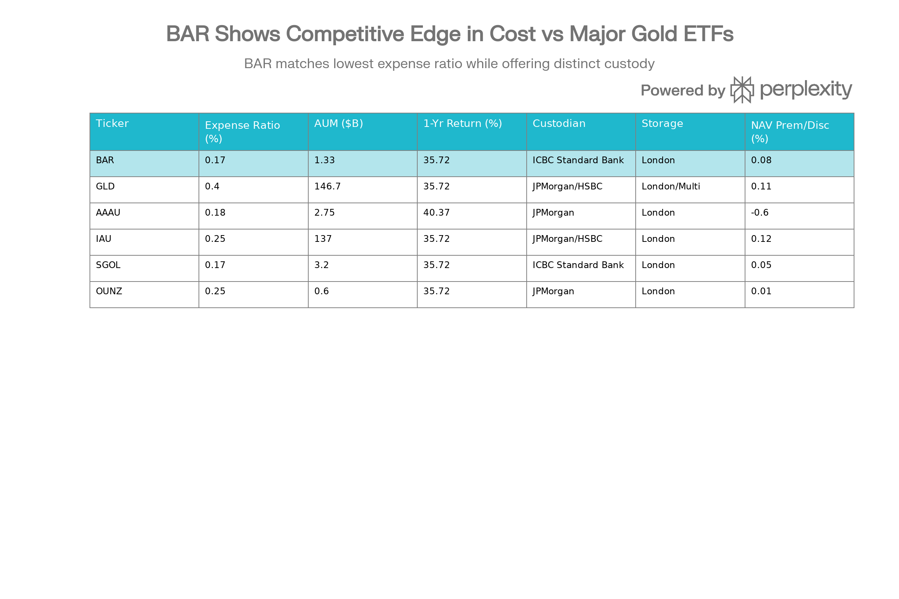

## 분류 근거

BAR 역시 100% 런던 Good Delivery 규격 실물 금을 보유하는 그랜터 신탁 ETF로, AAAU와 동일한 논리로 `ETF/Gold` 폴더로 분류했습니다.

## BAR (GraniteShares Gold Trust) 종합 분석 보고서

### 개요

BAR(GraniteShares Gold Trust)은 2017년 8월 31일 출범한 런던 현물 금에 대한 접근성을 제공하는 교환거래펀드입니다. GraniteShares LLC가 운용하며, ICBC Standard Bank Plc에 의해 보관되는 런던 기반 물리적 금 바에만 투자합니다. 현재 약 13억 3천만 달러의 운용자산을 보유하고 있으며, 업계에서 가장 낮은 비용 구조를 제공하는 금 ETF 중 하나입니다.[^1][^2]

### 펀드 구조 및 보관 메커니즘

BAR의 핵심 특징은 100% 런던 굿딜리버리(Good Delivery) 표준 금 바만을 보유한다는 점입니다. 펀드는 할당된 형태(allocated form)로 금을 보유하며, 이는 각 바의 고유 바 번호, 무게, 순도 등이 기록되고 펀드를 위해 특정 바들이 분리되어 있다는 의미입니다. 이는 금고 안에 있는 지정된 안전 예금함과 같은 구조입니다.[^1][^3]

ICBC Standard Bank Plc는 BAR의 보관자입니다. ICBC는 런던 불렛 시장 협회(LBMA)의 청산 회원 중 하나이며, 2016년 바클레이즈의 금 금고 사업을 인수한 이후 런던 최대 규모의 상업 금고(2,000톤 용량)를 운영합니다. LBMA 청산 회원 중 ICBC를 포함해 3개 기관(ICBC, HSBC, JP모건)만이 자체 금고 시설을 운영합니다.[^4][^5][^6][^7]

ICBC Standard Bank는 25년 이상의 귀금속 사업 경력을 가지고 있으며, 2016년 런던 귀금속 청산 시스템에 공식 승인된 청산 은행입니다. ICBC는 LBMA 시장 조성자(market maker) 지위와 런던 금 가격 결정자(price fixer) 자격을 보유하고 있어, 금 시장 운영에 중요한 역할을 합니다. BAR의 투명성 정책에 따라 펀드가 보유한 금 바 목록은 매일 공개되며, 금고는 연 2회 독립적 감시인(inspectorate)에 의해 감사됩니다.[^8][^1]

그래인저 신탁 구조는 투자자 보호를 강화합니다. 이 구조에서는 펀드가 금을 담보로 제공하거나 대출할 수 없으며, 파생상품도 보유할 수 없습니다.[^9][^3]

### 비용 구조 및 경쟁적 위치

BAR의 가장 주요한 경쟁력은 0.17%의 경비율입니다. 이는 업계에서 가장 낮은 비용 중 하나이며, 같은 수준의 경비율을 제시하는 유일한 경쟁사는 Aberdeen Standard의 SGOL(0.17%)입니다. GLD는 0.40% 경비율을 부과하므로, BAR은 GLD보다 57% 저렴합니다. 1,000달러 투자 시 BAR은 연 1.70달러, GLD는 4달러를 부과합니다.[^1][^10][^11]

BAR vs Competing Gold ETFs: Comprehensive Feature Comparison

AAAU(Goldman Sachs Physical Gold)는 0.18%의 경비율을 제시하며, BAR보다 단 0.01%p 높지만, 실질적 차이는 미미합니다. IAU(iShares Gold Trust)는 0.25% 경비율로, BAR보다 31% 더 비쌉니다.[^12][^10]

BAR는 배당금이나 수익률을 제공하지 않습니다. 투자자의 수익은 순전히 금 가격의 상승에 의존합니다. 이는 순수 가격 변동에 민감한 투자자들을 위해 설계된 구조입니다.[^13]

### 성과 분석 및 시장 환경

BAR의 성과는 금 시장의 강세를 반영합니다. 1년 수익률은 약 35.72%에서 40.37% 범위로 평가되고 있으며, 이는 금 시장 전반의 광범위한 강세를 나타냅니다. 2025년 한 해 동안 금은 67% 상승했으며, 이는 1979년 이후 가장 높은 연간 수익률입니다.[^12][^14][^15][^16]

3년 기준으로 BAR의 누적 수익률은 약 23-24% 선으로, 연평균 약 7-8% 수익률을 시사합니다. 5년 기준으로는 약 10.73% 연평균 수익률을 보이고 있으며, 펀드 출범 이후(2017년 8월-2025년 8월) 약 9.4% 연평균 수익률을 기록했습니다.[^17][^15][^12]

그러나 2026년 초 성과는 약세입니다. 2026년 1월 1일부터 16일까지(현재 기준) YTD 수익률은 6.28%에 불과하며, 1월 말 현재 1개월 성과는 약 -0.12%에서 -0.21% 범위입니다.[^14][^15][^9]

금 시장의 구조적 수요는 강합니다. 중앙은행들은 2025년 3분기에 전년 대비 10% 증가한 220톤의 금을 매입했으며, 글로벌 금 ETF는 2025년 3분기에 기록적인 260억 달러를 순유입했습니다. 월가의 2026년 금 가격 컨센서스는 2025년 말 기준 약 17% 상승을 예측하고 있습니다.[^16][^18][^19]

### 유동성 및 거래 특성

BAR의 유동성은 양호하지만, 업계 최대 규모 펀드들에 비해서는 낮습니다. 일일 평균 거래량은 634,000에서 980,000주 범위로, GLD의 620만 주나 IAU의 대규모 거래량에 비해 상당히 낮습니다. 그러나 대부분의 개인 및 일반 기관 투자자의 거래 규모에는 충분한 유동성입니다.[^12][^20][^9]

매매호가 스프레드(bid-ask spread)는 0.03%로 경쟁력 있는 수준입니다. NAV와 시장가 간의 괴리는 극히 미미하며, 일반적으로 0.08%에서 0.95% 범위의 프리미엄 또는 할인을 기록합니다. 이는 펀드가 현물 금 가격을 매우 효율적으로 추적함을 의미합니다.[^10][^9][^21]

펀드는 승인된 참여자(Authorized Participants) 메커니즘을 통해 생성 및 상환 기능을 유지합니다. 최소 바스켓 요구 사항(일반적으로 50,000주)을 충족하는 AP들이 기초 금을 제공하거나 회수하면서 NAV와 시장가 간의 괴리를 자동으로 조정합니다.[^22]

### 펀드 성장 및 자산 추이

BAR은 출범 이후 꾸준한 성장을 이루었습니다. 2017년 8월 출범 당시의 초기 자산 규모는 소수에 불과했으나, 2020년 COVID-19 팬데믹과 통화 정책 완화 기간에 기록적인 유입을 경험했습니다. 2024년 중반에는 약 9억 달러, 현재(2026년 1월)는 약 13.3-16억 달러의 AUM을 보유하고 있습니다.[^12][^23][^9][^24]

이는 BAR이 성숙한 펀드(8년 반 운영)이지만 여전히 확대 중인 단계임을 시사합니다. 1년 기준 펀드 유입은 약 1,080만 달러에서 1,440만 달러 범위로, 안정적인 수요를 나타냅니다.[^9]

> **AUM 단위 안내**: 원출처에는 BAR의 AUM이 개요("약 13억 3천만 달러")와 이 절("약 1.33\~1.6억 달러") 사이에 10배 차이가 있었다. 개요 및 아래 경쟁 ETF 비교 절의 자릿수와 일관되게 맞추기 위해, 위 수치를 약 13.3\~16억 달러로 정정했다.

### 세무 효율성 및 조세 고려사항

BAR의 조세 처리는 신중한 검토가 필요합니다. 국세청(IRS)은 물리적 금 보유를 "수집품(collectible)"으로 분류하며, 장기 보유(1년 초과)에 대한 자본이득에 최대 28%의 연방 세율을 적용합니다.[^9][^25]

실제 영향 분석을 살펴봅시다. 10,000달러를 투자한 투자자가 5,000달러의 이득을 얻은 경우:

- **주식 투자**: 중산층 투자자(24% 소득세율)는 15% 장기 자본이득세로 750달러 납부
- **BAR 투자**: 동일 투자자는 28% 수집품 세율로 1,400달러 납부
- **세금 차이**: 650달러 (87% 더 높은 세금)[^26][^25]

추가적으로, 고소득 투자자(단독 신고자 200,000달러 이상, 부부 합산 250,000달러 이상)는 투자 소득에 대해 추가 3.8%의 순투자소득세(NIIT)를 납부해야 합니다.[^25]

그러나 중요한 조세 우위가 있습니다. BAR을 세금 우대 계좌(IRA, 401(k) 등)에서 보유하면, 실현 시까지 세금을 완전히 연기할 수 있어 28% 수집품 세율을 완전히 회피할 수 있습니다. 특히 높은 한계세율의 투자자는 이 전략을 강력히 고려해야 합니다.[^9]

세금 양식의 관점에서 BAR은 "자본 환원(return of capital)" 처리를 받으며, K-1 양식을 배분하지 않습니다. 이는 세금 신고를 단순화합니다.[^9]

### 리스크 평가

BAR에 내재된 여러 리스크가 있습니다. 첫째, **금 가격 변동성**입니다. 50일 변동성은 16.80%, 200일 변동성은 20.87%로 높습니다. 금은 통화 정책, 실질 금리, 지정학적 요인에 민감합니다.[^12]

둘째, **보관 집중화 리스크**입니다. BAR의 모든 금은 런던의 단일 ICBC Standard Bank 지점에 보관됩니다. ICBC는 신뢰할 수 있는 LBMA 청산 회원이지만, 물리적으로 한 곳의 금고에 집중화된 보관은 시스템 리스크에 노출됩니다. 흥미롭게도, 대다수의 금 ETF 자산(GLD, IAU 등)도 JP모건과 HSBC 두 기관의 금고에 집중되어 있습니다.[^5][^27]

셋째, **선택지 축소 리스크**입니다. OUNZ(VanEck Merk Gold Trust)와 달리 BAR은 물리적 금으로의 상환(redemption) 옵션을 제공하지 않습니다. 투자자는 2차 시장에서만 매도할 수 있습니다.[^28]

넷째, **규제 리스크**입니다. IRS가 향후 금의 수집품 분류를 변경할 가능성이 있습니다.

다섯째, **유동성 위험**입니다. 매우 큰 규모의 거래나 극도의 시장 스트레스 상황에서는 스프레드가 확대될 가능성이 있습니다.

마지막으로, **통화 위험**입니다. BAR은 미국 달러로 표시되므로, 비달러 투자자는 환율 변동에 노출됩니다.[^9]

### 경쟁 포지셔닝 분석

BAR은 금 ETF 시장에서 고유한 포지셔닝을 유지합니다:

**vs. GLD (시장 리더)**:

- GLD는 146.7억 달러의 거대한 AUM과 매우 깊은 유동성이 특징입니다.
- 그러나 GLD의 0.40% 경비율은 BAR의 0.17%보다 2배 이상 높습니다.
- 20년 투자 기간에 걸쳐, 비용 차이만으로도 약 2,000달러의 성과 차이가 누적될 수 있습니다.
- GLD의 강점은 광범위한 선택지(옵션 메커니즘) 가용성입니다.[^10][^29]

**vs. AAAU (Goldman Sachs)**:

- 비용이 거의 동일합니다(BAR 0.17% vs AAAU 0.18%).
- AAAU는 JPMorgan 보관(잠재적으로 더 유명), BAR은 ICBC 보관입니다.
- AAAU는 약간 더 큰 AUM(27.5억 달러)입니다.
- 선택은 주로 보관자 선호도와 미소한 비용 차이에 기초합니다.[^10]

**vs. SGOL (Aberdeen Standard)**:

- 비용이 동일합니다(모두 0.17%).
- SGOL은 BAR보다 약 2.4배 큽니다(32억 달러 vs 13.3억 달러).
- 둘 다 ICBC Standard Bank 보관입니다.
- 이들은 본질적으로 경쟁 대체재입니다.[^28][^11]

**vs. IAU (iShares)**:

- BAR(0.17%)은 IAU(0.25%)보다 31% 저렴합니다.
- IAU는 137억 달러의 거대한 AUM을 가집니다.
- 비용을 중시하는 투자자는 BAR을 강력히 선호할 이유가 있습니다.[^10]

### 투자자 적합성 분석

**최적의 투자자 프로필:**

1. **비용 민감 투자자**: 경비율이 중요한 개인, 특히 장기 보유 계획자
2. **장기 할당 추구자**: 최소 5-10년 이상 보유할 계획이 있는 투자자
3. **포트폴리오 다각화 원하는 자**: 인플레이션 헤지, 달러 약세 헤지, 지정학적 리스크 회피
4. **세금 우대 계좌 보유자**: IRA나 401(k)에서 보유할 계획(28% 세율 회피)
5. **중산층 투자자**: 최상위 세금 구간이 아닌 개인
6. **ICBC 신뢰 투자자**: LBMA 청산 회원으로서 ICBC를 수용할 수 있는 자

**적합하지 않은 투자자:**

1. **트레이더**: 단기 거래는 높은 한계 세율과 수집품 세율로 인해 조세 효율성이 극히 낮습니다.
2. **최상위 소득층**: 28% 기본 세율에 3.8% NIIT이 누적되며, 절대 세액이 매우 높습니다.
3. **물리적 금 상환 희망자**: OUNZ의 물리적 상환 기능이 필요한 투자자
4. **유동성 최우선 투자자**: 극도로 큰 거래를 자주 수행하는 자는 GLD를 선호해야 합니다.
5. **배당금/인컴 추구자**: BAR는 인컴을 생성하지 않으므로 부적절합니다.
6. **지리적 다각화 추구자**: 런던만 보관이므로, 다중 위치 보관이 필요한 투자자에게 부적절합니다.

### 결론

BAR(GraniteShares Gold Trust)은 물리적 금에 대한 저비용 노출을 추구하는 정교한 투자자들을 위한 매력적인 선택지입니다. 0.17% 경비율은 업계 최저 수준 중 하나이며, ICBC Standard Bank Plc의 LBMA 청산 회원 지위는 강력한 보관 보증을 제공합니다. 100% 할당된 런던 기반 물리적 금 보유와 그래인저 신탁 구조는 투자자 보호를 극대화합니다.

그러나 투자자들은 반드시 장기 보유(1년 이상)를 계획하거나 세금 우대 계좌에서 보유해야 합니다. 28%의 수집품 자본이득세는 수익성을 크게 잠식할 수 있기 때문입니다. GLD의 거대한 유동성이 필요하지 않고 최고 수준의 저비용을 원하는 투자자는 BAR과 SGOL 중 선택하면 됩니다.

최종적으로 BAR은 **장기 포트폴리오 다각화를 추구하는 비용 민감 투자자, 특히 IRA나 401(k) 형태의 세금 우대 계좌에서 이 자산을 배치하려는 투자자에게 가장 적합**합니다.[^1][^10][^9]

[^1]: https://graniteshares.com/institutional/us/en-us/etfs/bar/

[^2]: https://kr.investing.com/etfs/graniteshares-gold-trust-holdings

[^3]: https://graniteshares.com/media/f3rhva1e/prospectus-graniteshares-gold-trust.pdf

[^4]: https://etfgi.com/news/stories/2018/06/icbc-standard-bank-plc-selected-custodian-low-fee-gold-etf

[^5]: https://www.lbma.org.uk/articles/latest-lbma-data-clearing-and-vault-data-january-2021

[^6]: https://www.lbma.org.uk/market-standards/vaulting

[^7]: https://www.lbma.org.uk/market-standards/clearing

[^8]: https://www.icbc.com.cn/icbc/en/newsupdates/icbc news/ICBCBecomesaClearingBankwithinLondonPreciousMetalClearingSystem.htm

[^9]: https://www.tradingview.com/symbols/AMEX-BAR/analysis/

[^10]: https://www.kiplinger.com/investing/commodities/gold/22000/7-gold-etfs-with-low-costs

[^11]: https://discoveryalert.com.au/gold-investment-options-2025-physical-vs-etfs/

[^12]: https://etfdb.com/etf/BAR/

[^13]: https://seekingalpha.com/symbol/BAR

[^14]: https://finance.yahoo.com/quote/BAR/performance/

[^15]: https://www.investing.com/etfs/graniteshares-gold-trust

[^16]: https://www.gold.org/goldhub/gold-focus/2026/01/india-gold-market-update-enduring-demand-strength

[^17]: https://www.myplaniq.com/invest/quote/BAR/

[^18]: https://research-center.amundi.com/article/gold-beyond-records

[^19]: https://www.thestreet.com/investing/every-major-analysts-gold-price-forecast-for-2026

[^20]: https://ycharts.com/companies/BAR

[^21]: https://ycharts.com/companies/BAR/discount_or_premium_to_nav

[^22]: https://www.sec.gov/Archives/edgar/data/1690437/000149315225011793/form10-k.htm

[^23]: https://tykr.com/stocks/bar/amex

[^24]: https://public.com/stocks/bar

[^25]: https://www.cnbc.com/2025/11/16/gold-capital-gains-taxes.html

[^26]: https://greentradertax.com/wp-content/uploads/2021/08/Tax-Treatment-on-Metals-and-Mining-Financial-Products.pdf

[^27]: https://www.coinworld.com/news/precious-metals/how-much-gold-and-silver-is-stored-in-london-vaults.html

[^28]: https://www.onegold.com/education-center/investing-guide/best-gold-etfs

[^29]: https://www.nasdaq.com/articles/gold-etfs-spdr-gold-shares-offers-scale-while-aaau-more-affordable

