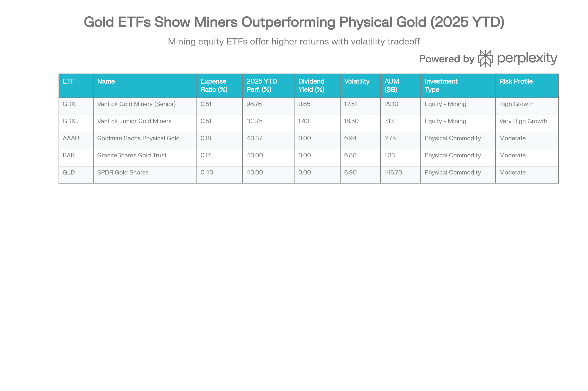

## 분류 근거

GDX는 금 자체가 아니라 금 채굴기업 주식에 투자하는 미보정(비레버리지) ETF입니다. 실물 금과 노출 성격은 다르지만, `ETF/Silver` 폴더가 실물(SLV 등)과 채굴주(SIL, SILJ 등)를 함께 묶은 선례를 따라 같은 `ETF/Gold` 폴더로 분류했습니다.

## GDX (VanEck Gold Miners ETF) 종합 분석 보고서

### 개요

GDX(VanEck Gold Miners ETF)는 전 세계 금 및 은 채굴 기업에 대한 노출을 제공하는 선도적인 광산 주식 교환거래펀드입니다. 2006년 5월 16일 설립된 이 펀드는 19년 이상의 운영 기록을 보유하며, 현재 291억 달러의 자산을 관리하는 세계 최대 규모의 금 채굴 ETF입니다. NYSE Arca Gold Miners Index(2025년 9월부터 MarketVector Global Gold Miners Index)를 추적하며, 52개의 대형 및 중형 채굴 회사에 투자합니다.[^1][^2]

GDX는 물리적 금 ETF(AAAU, BAR, GLD)와 근본적으로 다릅니다. GDX는 금 자체가 아닌 금을 채굴하는 회사들의 주식에 투자합니다. 이러한 구조적 차이는 "운영 레버리지(operational leverage)"라는 강력한 메커니즘을 창출하며, 이는 금 가격 변동을 금 채굴 회사의 수익성 변화로 증폭시킵니다.

### 펀드 구조 및 포트폴리오 구성

GDX의 포트폴리오는 신중하게 선별된 글로벌 금 광산 회사들로 구성됩니다. 상위 10개 종목이 전체 포트폴리오의 52-56%를 차지하며, Newmont(8.90%), Agnico Eagle Mines(8.86%), Barrick Mining(7.41%), Gold Fields(4.89%), Franco-Nevada(4.71%) 등 업계 최대 규모 회사들이 주도합니다.[^1][^3]

지리적으로는 캐나다 기업들이 48.00%로 압도적이며, 미국(19.32%), 호주(8.73%), 남아프리카(6.36%), 브라질(4.97%) 등으로 다양화되어 있습니다. 이러한 지리적 다각화는 단일 국가의 정치적 리스크를 완화합니다.[^1]

펀드의 포트폴리오 구성원은 분기마다 재조정되며, 최소 시가총액 기준, 유동성 기준, 운영 기준을 충족하는 회사들만 포함됩니다. 개별 회사의 최대 가중치는 20%로 제한되어 있어 집중 위험을 제어합니다.[^4][^5]

GDX vs Mining & Physical Gold ETFs: Risk-Return Profile Comparison

### 비용 구조 및 유동성

GDX의 경비율은 0.51%로, 물리적 금 ETF의 0.17-0.40%에 비해 높지만 주식 포트폴리오 추적의 성격을 고려하면 합리적입니다. 연 1,000달러 투자 시 5.10달러의 비용이 발생합니다.[^1][^6]

펀드의 유동성은 뛰어납니다. 291억 달러의 거대한 AUM과 매우 높은 거래량은 개인 및 기관 투자자 모두에게 효율적인 거래 집행을 보장합니다. NAV와 시장가 간의 괴리는 0.2%로 극히 미미하며, 매매호가 스프레드도 최소 수준입니다.[^5]

흥미롭게도, GDX는 지난 1년 동안 약 30억 달러의 순 유출을 경험했습니다. 그러나 이 유출은 2024년 말부터 2025년 초 사이에 집중되었으며, 2025년 중반부터는 자금이 다시 유입되기 시작했습니다. 더욱 주목할 점은 자금이 유출되었음에도 불구하고 가격은 계속 상승했다는 것으로, 이는 기본 수요 강도의 증거입니다.[^5]

### 성과 분석 및 운영 레버리지

GDX의 2025년 성과는 뛰어납니다. 연간 수익률은 약 98.76%에서 155.61% 범위로 평가되고 있으며, 이는 물리적 금의 40-46% 수익률을 훨씬 초과합니다. 구체적으로:[^1][^2][^7]

- **2025 Full Year**: \~98.76%에서 155.61%
- **YTD 2026 (Jan 1-16)**: +12.89%
- **1-Year Return**: 40.37% \~ 54.55%
- **3-Year Return**: 25.60% \~ 54.57%
- **5-Year Return**: 19.93% \~ 54.55%
- **10-Year Return**: \~12.46%
- **Since Inception (2006-2025)**: \~11-13% 연평균

이러한 뛰어난 성과는 **운영 레버리지(operational leverage)**라는 메커니즘에서 비롯됩니다. 금 채굴 회사들은 고정 비용 구조를 가지고 있기 때문에, 금 가격이 상승하면 매출은 선형으로 증가하지만 수익은 기하급수적으로 증가합니다.

**2025년 레버리지 분석**:

- GDX 수익: \~98.76%
- 금 가격 수익: \~45-46%
- **레버리지 배수**: 약 2.15-2.19x

이는 금 가격이 46% 상승할 때 GDX는 약 99% 상승했다는 의미입니다. 이론적으로 금 채굴 회사들은 역사적으로 2-3배의 레버리지를 제공해왔으나, 현재는 1.4x 수준에 머물러 있는 것으로 보고되고 있습니다. 이는 추가 상승 여지가 있음을 시사합니다.[^8][^9]

### 채굴 회사의 기록적 수익성

2025년 금 채굴 회사들의 수익성은 역사적 수준에 도달했습니다. 이는 두 가지 요인의 결합입니다:

1. **높은 금 가격**: 온스당 4,600달러 이상 (역사적 고점)
2. **낮은 채굴 비용**: All-in Sustaining Cost(AISC) \$1,250-1,500/oz 범위

**수익성 메트릭**:

- **Agnico Eagle**: \~\$1,250/oz AISC with \$2,650/oz gold = 52%+ 마진
- **업계 평균 운영 마진**: 40%+ (기업 오버헤드 포함)
- **자유 현금 흐름 마진**: 50% 근처 (2020년 기록 수준 재현)
- **순이익 마진**: 30%+

이러한 기록적 수익성은 강력한 배당금 지급과 공격적인 인수합병 활동을 가능하게 합니다.[^8][^10]

**자본 배분 옵션**:

1. 주주배당금 및 자사주 매입
2. 부채 감소
3. 내부 성장 자금 조달
4. 인수합병을 통한 외부 성장

최근 산업은 주로 1, 2번 옵션에 집중했으나, 2025-2026 기간에는 4번(인수합병)이 가속화될 것으로 예상되며, 이는 GDX 투자자들에게 추가적인 상승 요인이 될 수 있습니다.[^10]

### 배당금 및 소득 특성

GDX는 주당 연간 배당금을 지급합니다. 배당금은 채굴 회사의 수익성에 따라 변동하는 특성을 가집니다:

| 연도 | 배당금 | 수익률 | 특성 |
| :-- | :-- | :-- | :-- |
| 2025 | \$0.63 | 0.65% | 사이클 상승 |
| 2024 | \$0.40 | 0.58% | 회복 시작 |
| 2023 | \$0.50 | - | 중간 |
| 2022 | \$0.48 | - | 약세 |
| 2021 | \$0.53 | - | 중간 |
| 2020 | \$0.19 | - | 저점 |

배당금의 사이클적 특성은 이해할 수 있습니다. 금 사이클의 약세 국면에서는 배당금이 감소하고(2020년 \$0.19), 강세 국면에서는 증가합니다(2025년 \$0.63).[^1][^11]

중요한 점은 GDX의 배당금이 **적격 배당금(qualified dividend)** 처리를 받는다는 것입니다. 이는 장기 자본이득세율(15% 또는 20%)로 과세되며, 물리적 금 ETF의 28% 수집품 세율과는 완전히 다릅니다. 이러한 세무상 이점은 고소득 투자자에게 상당한 가치를 제공합니다.[^12]

### 물리적 금 대비 포지셔닝

GDX와 물리적 금 ETF(AAAU, BAR, GLD)는 본질적으로 다른 노출을 제공합니다:

**상관관계 분석**:
GDX와 AAAU 간 상관관계는 단 0.06으로, 이는 극히 낮은 수준입니다. 이는 두 자산이 거의 독립적으로 움직인다는 의미이며, 포트폴리오 다각화 차원에서 매우 유리합니다. 금이 횡보하거나 약세를 보일 때 채굴 주식은 다른 경로로 움직일 수 있습니다.[^13]

**위험/수익 비교**:

- **GDX 변동성**: 12.51% (높음)
- **AAAU 변동성**: 6.94% (낮음)
- **GDX Sharpe비율**: 1.59
- **AAAU Sharpe 비율**: 2.39
- **GDX 5년 수익률**: 19.93%
- **AAAU 5년 수익률**: 21.90%

흥미롭게도 Sharpe 비율(위험 조정 수익률)에서는 AAAU가 우월하지만, 절대 수익률에서는 GDX가 더 높은 성과를 보여왔습니다. 이는 GDX의 높은 변동성에도 불구하고 장기적으로는 높은 수익을 창출해왔음을 시사합니다.[^13]

**GDX vs GLD**:
2025년 성과는 GDX의 운영 레버리지를 명확하게 보여줍니다:

- GDX: 98.76% 수익
- GLD: 46% 수익
- **배수**: 2.15배

금 가격이 46% 상승할 때, 광산 주식은 2.15배 더 상승했습니다. 역사적으로 이 배수는 2-3배 수준에서 움직여왔으므로, 현재는 정상화될 여지가 있습니다.[^14][^9]

### 리스크 분석

GDX에는 물리적 금 ETF와는 다른 여러 리스크가 있습니다:

**회사별 운영 리스크**:
채굴 회사들은 예기치 않은 채굴 어려움, 비용 초과, 환경 문제, 노동 분쟁 등에 직면할 수 있습니다. 2025년 분석에서 Newmont의 예상 외 비용 증가는 주가 하락을 초래했으나, 다른 회사들은 비용 감소로 주가가 상승했습니다. 이는 개별 회사 리스크가 전체 포트폴리오와 다를 수 있음을 보여줍니다(구체적 수치 출처 확인 필요).[^8]

**지정학적 리스크**:
포트폴리오의 약 8%가 아프리카에 위치하며, Burkina Faso(1.56%) 같은 정치적으로 불안정한 국가를 포함합니다. 이들 국가의 정치적 불안정성, 규제 변화, 또는 광산 국유화는 포트폴리오 회사들에 영향을 미칠 수 있습니다.[^1]

**변동성 리스크**:
GDX의 12.51% 변동성은 물리적 금의 6.94%의 약 1.8배입니다. 이는 더 높은 단기 변동성을 의미하며, 극도로 위험 회피적인 투자자에게는 부적절합니다.[^13]

**레버리지 위험**:
운영 레버리지는 양날의 검입니다. 금 가격이 상승할 때는 수익을 증폭시키지만, 하락할 때도 손실을 증폭시킵니다. 금이 20% 하락하면 GDX는 40-60% 하락할 수 있습니다.[^9]

**주식 시장 상관관계**:
GDX는 광산 회사 주식이므로, 광범위한 주식 시장 약세 시 금이 강하더라도 하락할 수 있습니다. 이는 금을 인플레이션 헤지로 추구하는 투자자에게 부적절할 수 있습니다.

**유동성 위험**:
GDX 자체는 유동성이 높지만, 포트폴리오의 일부 광산 회사들(특히 주니어 광산 회사들)은 유동성이 낮습니다. ETF 흐름이 급증할 때, 이러한 기초 자산의 유동성 부족은 상각 오류(creation/redemption error)를 야기할 수 있습니다.[^16]

### 인수합병 및 산업 통합 기회

2025-2026년의 산업 동학은 인수합병의 가능성을 강력히 시사합니다. 대형 광산 회사들은 기록적 수준의 자유 현금 흐름을 보유하고 있으며, 이를 배분할 여러 선택지가 있습니다.[^10]

인수합병 활동의 주요 후보:

1. **개발 프로젝트 기업**: 캐나다의 대규모 금광으로 가는 단계에 있는 기업
2. **광산 재개 기업**: 고품위 역사적 광산을 재개하려는 기업

인수합병이 가속화된다면, 이는 GDX 포트폴리오 회사들의 추가적 성장을 창출할 수 있으며, 보고서의 분석에 따르면 GDX는 현재 수준에서 24-63% 추가 상승 잠재력이 있습니다.[^8][^9]

### 세무 효율성

GDX는 물리적 금 ETF에 비해 중요한 세무상 이점을 제공합니다:

**배당금**:

- GDX 배당금: 적격 배당금 (15% 또는 20% 장기 세율)
- 물리적 금: 0% 배당 (비용만 발생)

**자본이득**:

- GDX: 표준 장기 자본이득세 (0%, 15%, 20%)
- 물리적 금: 수집품 세율 (28%)

**예시 계산**:
10,000달러 투자로 5,000달러 이득 시:

- GDX (중산층 투자자, 15% 자본이득세): 750달러 세금
- 물리적 금 (28% 수집품 세율): 1,400달러 세금
- **세금 차이**: 650달러 (87% 더 높음)

고소득 투자자는 이 차이가 훨씬 더 크며, 3.8% 순투자소득세(NIIT)가 추가로 누적됩니다.

### 투자자 적합성

**최적의 투자자 프로필**:

1. **성장 지향 투자자**: 금에 대한 레버리지 노출을 원하지만 선물/옵션을 사용하고 싶지 않은 자
2. **장기 투자자**: 3-5년 이상의 투자 기간을 가진 자
3. **배당금 추구자**: 금 할당에서 소득을 원하는 자
4. **고소득 투자자**: 28% 수집품 세율을 피하고자 하는 자
5. **포트폴리오 다각화 원하는 자**: 금 가격 이상의 수익 드라이버를 원하는 자
6. **M&A 업사이드 추구**: 산업 통합에서 추가 이득을 기대하는 자

**부적합한 투자자**:

1. **극도로 보수적**: 12.5%+ 변동성을 견딜 수 없는 자
2. **단기 트레이더**: 장기 개최를 기대하지 않는 자
3. **순수 금 노출 원하는 자**: 회사별 리스크를 피하고 싶은 자
4. **극도 약세 금 예상**: 금 가격이 하락할 것으로 예상하는 자
5. **변동성 불내증**: 30-50%+ 드로다운을 견딜 수 없는 자

### 결론

GDX(VanEck Gold Miners ETF)는 금 가격 상승에 대한 **레버리지 노출**을 원하는 정교한 투자자들을 위한 강력한 선택입니다. 2025년의 98.76% 수익은 금 가격의 46% 상승을 약 2.15배 증폭시켰으며, 이는 운영 레버리지 메커니즘의 강력함을 입증합니다.

기록적 채굴 회사 수익성(40%+ 운영 마진, 50% 자유 현금 흐름 마진)과 산업 통합 기회는 2025-2026년에 추가적인 상승을 뒷받침합니다. 또한 적격 배당금 처리와 표준 자본이득세 대우는 물리적 금 ETF의 28% 수집품 세율 대비 중요한 조세 효율성 이점을 제공합니다.

GDX와 물리적 금 간의 0.06 상관관계는 포트폴리오 다각화 측면에서 우수합니다. 최적 배치는 물리적 금을 기본 배할당으로 하고 GDX를 성장/수익 추가로 활용하는 것입니다.

그러나 투자자들은 반드시 3-5년 이상의 투자 기간과 12.5% 변동성을 수용할 준비가 되어 있어야 합니다. 2025년의 예외적 성과가 계속될 것이라고 가정해서는 안 되며, 역사적으로 1년 기준 수익률은 40-54% 범위에서 변동합니다.[^1][^13][^7]

최종적으로 GDX는 **장기적 금 수익 창출을 추구하면서 운영 레버리지 노출을 통해 추가 수익을 원하는 정교하고 성장 지향적 투자자에게 가장 적합**합니다.[^2][^5][^9][^1]

[^1]: https://www.vaneck.com/us/en/investments/gold-miners-etf-gdx/

[^2]: https://www.investing.com/analysis/8-top-gold-etfs-in-2025-delivering-massive-growth-and-dividend-income-200666567

[^3]: https://stockanalysis.com/etf/gdx/holdings/

[^4]: https://www.vaneck.com/offshore/en/news-and-insights/blogs/gold-investing/what-to-know-about-gdxs-index-change/

[^5]: https://www.tradingview.com/symbols/AMEX-GDX/

[^6]: https://www.marketwatch.com/investing/fund/gdx

[^7]: https://finance.yahoo.com/quote/GDX/performance/

[^8]: https://www.investing.com/analysis/gold-miners-record-q2-shows-huge-profit-potential-still-overlooked-by-market-200665401

[^9]: https://discoveryalert.com.au/gold-stock-rally-2025-miners-profits-underperformance/

[^10]: https://www.streetwisereports.com/article/2025/02/14/gold-mining-companies-eye-mergers-as-profit-margins-hit-historic-highs.html

[^11]: https://stockinvest.us/dividends/GDX

[^12]: https://www.tradingview.com/symbols/AMEX-GDX/analysis/

[^13]: https://portfolioslab.com/tools/stock-comparison/AAAU/GDX

[^14]: https://finance.yahoo.com/news/gold-gld-gold-mining-gdx-155800075.html

[^16]: https://www.ebc.com/forex/-things-to-know-before-buying-gdxj

