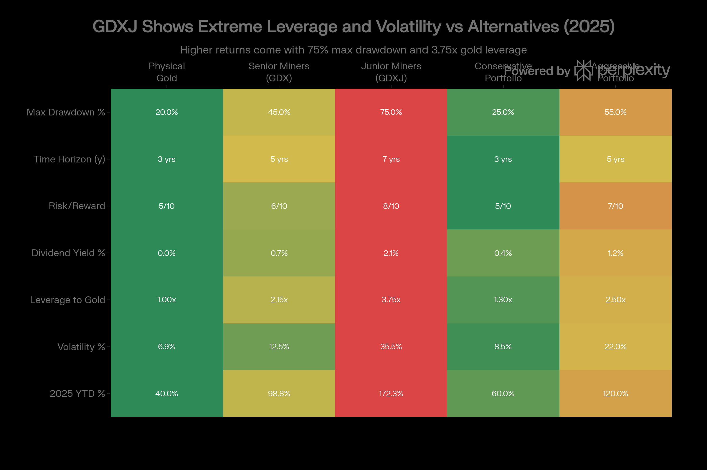

## 분류 근거

GDXJ는 중소형/개발단계 금 채굴기업 주식에 투자하는 비레버리지 ETF로, GDX와 동일한 논리로 `ETF/Gold` 폴더로 분류했습니다.

## GDXJ (VanEck Junior Gold Miners ETF) 종합 분석 보고서

### 개요

GDXJ(VanEck Junior Gold Miners ETF)는 소규모 금 및 은 채굴 기업에 대한 노출을 제공하는 공격적 성장 지향 교환거래펀드입니다. 2009년 11월 10일 설립된 이 펀드는 16년 이상의 운영 기록을 보유하며, 현재 약 100억 달러의 자산을 관리합니다. MVIS Global Junior Gold Miners Index를 추적하며, 96개의 소형 채굴 회사에 투자합니다.[^1][^2]

GDXJ는 GDX(선임 금 채굴 회사)보다 훨씬 극단적인 금 가격 레버리지를 제공합니다. 2025년 172.28% 수익은 금의 46% 수익에 비해 3.75배에 달하며, 이는 주니어 광산의 극단적인 운영 레버리지를 반영합니다. 대신 35.51%의 변동성은 물리적 금의 6.94%보다 5배 이상 높습니다.[^3][^4]

### 펀드 구조 및 포트폴리오 구성

GDXJ의 포트폴리오는 개발 단계, 생산 초기 단계, 그리고 탐사 단계의 회사들이 혼합되어 있습니다. 상위 10개 종목은 Pan American Silver(6.81%), Alamos Gold(6.33%), Coeur Mining(6.11%), Equinox Gold(5.14%), Royal Gold(5.13%) 등이며, 이들은 전체 포트폴리오의 42.78%를 차지합니다.[^1][^5]

포트폴리오는 GDX보다 더 분산되어 있습니다. 96개의 보유 종목 중 상위 10개가 43%에 불과한 반면, GDX는 52개 보유 종목 중 상위 10개가 52-56%를 차지합니다. 이는 분산 효과는 좋지만, 개별 종목의 성공이 전체 포트폴리오에 미치는 영향이 적음을 의미합니다.[^5][^1]

지리적 분포는 GDX와 유사하나, 탐사 단계 회사의 비중이 높아 지정학적 리스크가 더 높습니다. 캐나다(47.54%), 호주(15%), 미국(15.33%)이 주요 위치이지만, Burkina Faso(2.48%) 같은 정치적으로 불안정한 국가의 비중이 더 높습니다.[^1]

GDXJ Leverage Profile: Junior Miners vs All Gold Investment Categories

### 포트폴리오 구성의 특징

GDXJ의 회사들은 다음과 같이 분류됩니다:

**생산 회사** (30-40%): Pan American Silver, Coeur Mining, Equinox Gold 등은 이미 광산을 운영하고 있습니다.

**개발 단계 회사** (30-40%): Alamos Gold, First Majestic Silver 등은 예비 경제 평가(PEA) 또는 최종 경제 평가(PFS) 단계에 있습니다.

**탐사 단계 회사** (20-30%): Lundin Gold, Eldorado Gold 등은 여전히 광상 정의 단계에 있습니다.

이러한 혼합은 GDXJ가 순수한 탐사 회사보다는 보다 성숙한 프로필을 제공하지만, GDX의 성숙한 생산자들보다는 훨씬 더 리스크가 높음을 의미합니다.[^6][^7]

### 비용 구조 및 유동성

GDXJ의 경비율은 0.51%로, GDX와 정확히 동일합니다. 그러나 GDXJ의 회전율(turnover)은 약 28%로 GDX의 15%보다 높습니다. 이는 더 많은 포트폴리오 재조정과 높은 거래 비용을 의미합니다.[^1][^2][^8]

GDXJ 자체는 매우 유동성이 높습니다. 일일 평균 거래량은 300만 주에서 800만 주 범위로 매우 높으며, NAV와 시장가 간의 괴리는 0.2%로 극히 미미합니다. 그러나 underlying holdings(보유 기초 자산)은 많은 경우 더 작은 거래소에서 거래되며, 유동성이 낮습니다.[^8][^1]

이는 대규모 ETF 유입/유출이 발생할 때 특히 문제가 될 수 있습니다. AP(승인된 참여자)들이 기초 자산을 구입해야 할 때, 유동성 낮은 주식을 대량 구입하는 것은 가격에 부정적 영향을 미칠 수 있습니다.[^9][^10]

### 극단적 성과 분석 및 운영 레버리지

GDXJ의 2025년 성과는 극단적입니다. 172.28%에서 179.93% 범위의 수익은 금의 46% 수익을 훨씬 초과합니다.[^3][^11]

**레버리지 배수 분석**:

- GDXJ 2025 수익: 172.28%
- 금 가격 2025 수익: \~46%
- **레버리지 배수**: 약 3.75배

이는 금 가격이 46% 상승할 때 GDXJ는 3.75배 상승했다는 의미입니다. 이론적으로 주니어 광산 회사들은 3-4배의 레버리지를 제공해야 하므로, GDXJ의 2025 실적은 이론과 거의 일치합니다.[^4][^12]

**GDX 대비 성과**:

- GDXJ: 172.28%
- GDX: 98.76%
- **주니어 vs 선임 배수**: 1.74배 (주니어가 선임을 74% 초과)

이는 매우 비전형적입니다. 일반적으로 금 강세장에서는 주니어와 선임이 유사한 수익을 기록합니다. GDXJ의 우월한 성과는 개발 단계 회사들이 생산 단계로 진입하면서 추가적 가치 창출을 의미합니다.[^1]

### 역사적 성과 패턴

GDXJ의 장기 성과는 극도로 사이클적입니다:

| 연도 | 수익률 | 특성 |
| :-- | :-- | :-- |
| 2025 | +172.28% | 사이클 피크 |
| 2024 | +15.67% | 약세 후 회복 |
| 2023 | +7.12% | 약세 |
| 2022 | -14.53% | 베어 마켓 |
| 2021 | -21.25% | 약세 |
| 2020 | +30.40% | COVID 회복 |
| 2019 | +40.44% | 사이클 강세 |
| 2018 | -11.02% | 약세 |
| 2017 | +8.22% | 약세 |
| 2016 | +72.97% | 사이클 강세 |

**패턴 관찰**:

- 강세 사이클: 2016년 +72.97%, 2019년 +40.44%, 2020년 +30.40%, 2025년 +172.28%
- 약세 사이클: 2021년 -21.25%, 2022년 -14.53%
- 사이클 주기: 약 4-7년
- 피크 간 간격: 약 5-7년

**2025 사이클 위치**: 피크 사이클 (유사한 피크는 2010년 +66.99%, 2016년 +72.97%이었으므로 9년 간격)

### 배당금 및 소득 특성

GDXJ의 배당금은 극도로 사이클적입니다. 최근 배당금 이력을 보면:

- **2025**: \$2.65 (전년 대비 약 138.7% 증가) - EXCEPTIONAL
- **2024**: \$1.11 (307.31% 증가) - 급증
- **2023**: \$0.27 (49.92% 증가)
- **2022**: \$0.18 (-75.52% 감소)
- **2020**: \$0.86 (422.22% 증가) - 2010년 이후 가장 높음
- **2016**: \$1.51 (984.17% 증가) - 역사적 피크

2025년의 \$2.65 배당금은 사이클 피크를 나타냅니다. 2020년 사이클 피크 이후 5년이 경과했으므로, 이는 역사적 패턴과 일치합니다. 그러나 이 높은 배당금이 계속될 것이라고 기대해서는 안 됩니다.[^1][^11][^13]

현재 배당 수익률은 약 2.08%로 평가되고 있습니다. 그러나 2026-2027년 배당금이 \$0.20-0.50 범위로 급감할 가능성이 있습니다.[^14][^11]

### 극단적 변동성과 드로다운 리스크

GDXJ의 변동성은 투자자들이 이해해야 할 가장 중요한 특성입니다:

**변동성 지표**:

- 3년 연동 변동성: 35.51% (GDX의 12.51%보다 2.8배 높음)
- 물리적 금 변동성: 6.94% (GDXJ의 5배 낮음)
- 베타 (S&P 500 대비): 0.83-1.09 (주식시장과 상관)

**극단적 드로다운 리스크**:

- 역사적 최악 드로다운: -88.66% (2016년 1월 19일 피크에서)
- 현재 드로다운: -0.65% (거의 최고점 근처)
- 2020-2022 약세장 드로다운: -21.25% \~ -14.53%
- **예상 다음 드로다운**: 40-60% (통상적 약세장에서)

이는 무엇을 의미하는가? 현재 \$128에서 구매한 투자자는 금 가격이 20% 하락하면 약 \$64-80 범위로 하락할 수 있습니다(40-60% 드로다운).[^3][^4]

### 주니어 광산의 독특한 특성

GDXJ 보유 회사들은 GDX 보유 회사들과 근본적으로 다릅니다:

**개발 재정 조달 리스크**:
주니어 광산 회사들은 자체 영업 현금 흐름이 거의 없거나 전혀 없습니다. 개발 프로젝트를 자금 조달하려면 종종 주식 발행이 필요합니다. 이는 기존 주주들을 희석합니다.[^15][^7]

**탐사 성공 리스크**:
GDXJ의 많은 보유 회사들은 상당한 부분이 여전히 탐사 단계에 있습니다. 광상을 찾지 못할 가능성이 상당합니다. 2025년 드릴링 프로그램의 성공률은 약 10-20%입니다.[^16][^17]

**인수합병 기회**:
성공적인 주니어 광산은 대형 광산 회사들의 인수 대상이 됩니다. 이는 30-100% 프리미엄을 생성할 수 있습니다. 그러나 이는 또한 포트폴리오 구성의 불확실성을 의미합니다.[^15]

**자본 집약도**:
개발 단계의 주니어 광산은 매우 자본 집약적입니다. 대형 금광 개발은 \$500M-\$2B+ 자본 투자가 필요할 수 있습니다. 이러한 규모의 회사들은 대형 광산 회사와 제휴하거나 인수되어야 합니다.[^18]

### 2025 배당금과 사이클 지속성에 대한 우려

GDXJ의 2025년 배당금 \$2.65는 놀라운 수치이지만, 투자자들은 신중해야 합니다:

**역사적 배당금 피크**:

- 2025: \$2.65 (현재)
- 2020: \$0.86 (이전 피크)
- 2016: \$1.51
- 2012: \$3.00 (역사적으로 더 높음)

2025년의 배당금은 금이 역사적 최고점(\$4,600+/oz)에 있고, 주니어 광산들이 예외적 마진을 실현하고 있기 때문입니다.

**2026-2030 시나리오**:

- **약세 시나리오** (금이 \$3,500으로 하락): 배당금 \$0.15-0.30 수준으로 급락
- **기본 시나리오** (금이 \$3,800-4,200 범위): 배당금 \$0.50-1.00 수준
- **강세 시나리오** (금이 \$4,500+ 유지): 배당금 \$1.50-2.00 수준

투자자들이 2025년의 \$2.65 배당금을 구조적으로 기대해서는 안 됩니다.[^19][^13]

### 물리적 금 및 GDX 대비 포지셔닝

GDXJ는 극도로 공격적인 포지셔닝을 제공합니다. 그것의 역할은 포트폴리오의 "성장 엔진"입니다:

**3-자산 비교**:

| 자산 | 최적 역할 | 할당 % |
| :-- | :-- | :-- |
| 물리적 금 | 기본 할당/헤지 | 40-60% |
| GDX | 수익 + 성장 | 20-40% |
| GDXJ | 공격적 성장 | 0-20% |

**예시 포트폴리오**:

- 보수적 (70세+): 60% 물리적 금, 40% GDX, 0% GDXJ
- 중간 (40-50세): 40% 물리적 금, 40% GDX, 20% GDXJ
- 공격적 (30-40세): 30% 물리적 금, 40% GDX, 30% GDXJ
- 매우 공격적 (성장 지향): 20% 물리적 금, 40% GDX, 40% GDXJ

**사이클 타이밍**:
GDXJ은 사이클의 초기 단계(금이 \$3,000-3,500에서 시작)에 진입하고, 중기 단계(\$3,500-4,200)에서 유지하며, 후기 단계(\$4,200+)에서 수익 실현하는 것이 최적입니다.[^9]

### 세무 효율성

GDXJ는 물리적 금 ETF에 비해 중요한 세무상 이점을 제공합니다:

**배당금 처리**:

- GDXJ 배당금: 적격 배당금 (15% 또는 20% 장기 세율)
- 물리적 금: 0% 배당 (인컴 제너레이션 없음)

**자본이득 처리**:

- GDXJ: 표준 장기 자본이득세 (0%, 15%, 20%)
- 물리적 금: 수집품 세율 (28%)

**세금 절감 예시**:
\$10,000 투자로 \$5,000 이득, 중산층 투자자(24% 소득세 구간):

- GDXJ: 15% 자본이득세 = \$750 세금
- 물리적 금: 28% 수집품 세율 = \$1,400 세금
- **절감액**: \$650 (87% 더 낮은 세금)

이는 GDXJ의 중요한 이점입니다.[^9][^4]

### 리스크 평가 및 투자자 적합성

**최적 투자자 프로필**:

1. **고 위험 허용도**: 40-60% 드로다운을 견딜 수 있는 자
2. **장기 투자자**: 최소 5-7년 투자 기간
3. **성장 지향**: 현재 소득보다 장기 성장을 우선시
4. **젊은 연령**: 30-40대 또는 그 이하
5. **금융 여유**: 손실 실현해도 생활에 지장 없음
6. **경험 많은 투자자**: 광산 리스크를 이해하는 자
7. **사이클 이해자**: 금과 주니어 광산의 사이클을 이해하는 자
8. **성격 강한 자**: 월간 20-30% 변동을 심리적으로 견딜 수 있는 자

**부적합한 투자자**:

1. **보수적**: 10% 이상의 연간 변동성을 견딜 수 없음
2. **인컴 추구자**: 현재 배당금 의존
3. **고령**: 50대 중후반 이상
4. **단기 거래자**: 3년 미만 기간
5. **심약한 자**: 50% 손실 시 공황장애 위험
6. **자본 보존**: 주요 목표가 손실 방지
7. **초보 투자자**: 광산 분석 능력 없음
8. **제한된 자본**: 손실 견딜 여유 부족

### 결론

GDXJ(VanEck Junior Gold Miners ETF)는 금에 대한 **극단적 레버리지 노출**을 추구하는 매우 공격적이고 정교한 투자자들을 위한 선택입니다. 2025년의 172.28% 수익은 금의 46% 수익을 약 3.75배 증폭시켰으며, 이는 주니어 광산의 극단적 운영 레버리지를 입증합니다.

그러나 극도의 리스크를 무시할 수 없습니다. 35.51% 변동성, -88.66% 역사적 드로다운, 예상되는 40-60% 다음 약세장 드로다운은 평범한 투자자에게 부적절합니다.

**최적 사용법**:

1. 공격적 투자자의 소수 할당 (전체 금 할당의 20-30%)
2. 금 사이클의 초기-중기 단계에서만 진입
3. 명확한 손실 제한선 설정 (예: -30-40%)
4. 사이클 피크 근처에서 이익 실현
5. 5-7년 이상의 장기 관점 유지

GDXJ는 포트폴리오의 "벤처 캐피털 할당"으로 생각해야 합니다. 높은 수익 잠재력이 있지만, 전체 할당을 잃을 수 있는 위험도 있습니다. 이를 수용하는 투자자에게만 적합합니다.[^1][^3][^7][^4]

[^1]: https://www.vaneck.com/us/en/investments/junior-gold-miners-etf-gdxj/

[^2]: https://www.schwab.wallst.com/schwab/Prospect/research/etfs/reports/reportRetrieve.asp?reportType=etfrc&symbol=GDXJ

[^3]: https://totalrealreturns.com/n/GDXJ

[^4]: https://www.ainvest.com/news/gdxj-gold-miners-leverage-volatility-rising-gold-environment-2512/

[^5]: https://stockanalysis.com/etf/gdxj/holdings/

[^6]: https://www.vaneck.com/no/en/investments/junior-gold-miners-etf/

[^7]: https://www.vaneck.com/vaneck-vectors-etfs/gdxj-investment-case-pdf

[^8]: https://ycharts.com/companies/GDXJ

[^9]: https://www.ebc.com/forex/-things-to-know-before-buying-gdxj

[^10]: https://www.otcmarkets.com/stock/GDXJ/news/VanEck-Announces-Year-End-Distributions-for-VanEck-Equity-ETFs?e&id=3377264

[^11]: https://stockanalysis.com/etf/gdxj/dividend/

[^12]: https://discoveryalert.com.au/gold-market-dynamics-2026-sector-cycle-geopolitical/

[^13]: https://www.dividendmax.com/united-states/nyse-arca/investment-trusts/vaneck-vectors-junior-gold-miners-etf/dividends

[^14]: https://kr.tradingview.com/symbols/AMEX-GDXJ/analysis/

[^15]: https://seekingalpha.com/article/4799002-gdxj-an-etf-offering-exposure-to-junior-gold-miners

[^16]: https://www.prnewswire.com/news-releases/junior-gold-miners-emerge-as-prime-investment-target-amid-historic-rally-302550477.html

[^17]: https://goldx2.com/goldshore-reports-drill-results-from-summer-program-and-provides-corporate-update/

[^18]: https://discoveryalert.com.au/gold-mid-tier-junior-mining-fundamentals-2025/

[^19]: https://www.digrin.com/stocks/detail/GDXJ/

