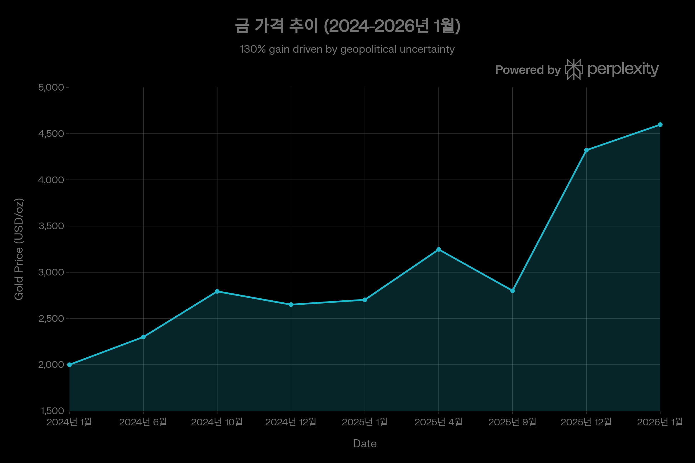
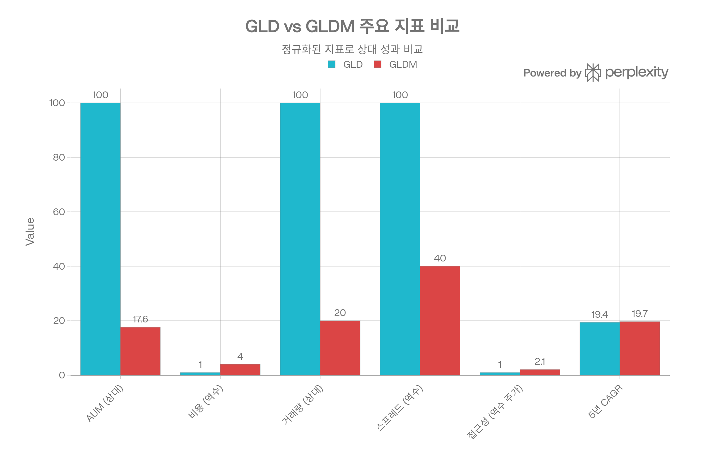
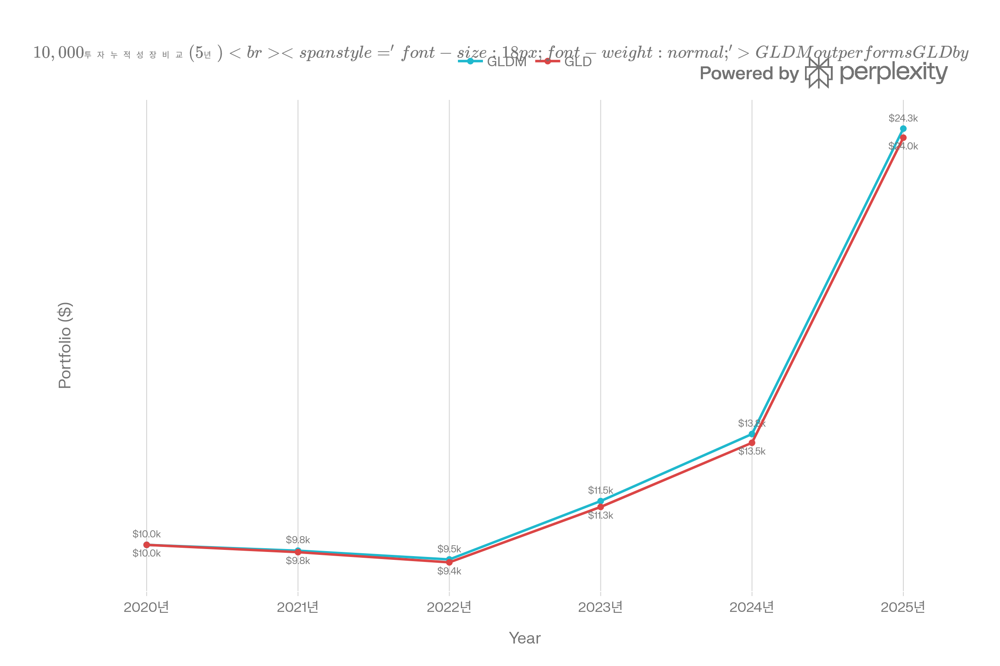
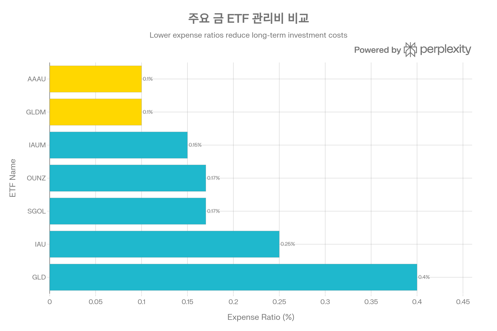

## 분류 근거

GLDM 역시 100% 실물 금을 보유하는 그랜터 신탁 ETF로, GLD와 같은 `ETF/Gold` 폴더로 분류했습니다.

## SPDR Gold MiniShares Trust (GLDM) 종합 분석 보고서

### 개요

SPDR Gold MiniShares Trust(티커: GLDM)는 State Street Global Advisors가 2018년 6월 26일 출시한 물리적 금 보유 ETF로, **미국 상장 금 ETF 중 최저 수준인 0.10% 관리보수**를 제공한다. GLDM은 SPDR Gold Shares(GLD)의 "미니" 버전으로, 주당 금 보유량을 1/10로 축소하여(0.01 troy oz vs 0.1 troy oz) 소액 투자자의 접근성을 높이면서도 비용 효율성을 극대화했다.[^1][^2][^3][^4][^5]

2026년 1월 21일 현재 GLDM은 \$96.32에 거래되며, AUM \$28B, 일평균 거래량 2.4M주로 안정적인 유동성을 확보하고 있다. 2025년 한 해 동안 금 가격의 역사적 강세장 속에서 **+64.8%의 수익률**을 기록했으며, 5년 CAGR 19.7%로 동일 상품군 대형 ETF인 GLD(19.4%)를 소폭 상회한다. 이는 0.30%p 낮은 관리보수(0.10% vs 0.40%)가 장기 복리 효과로 누적된 결과다.[^6][^7][^8][^9][^10][^11]

GLDM의 핵심 가치 제안은 명확하다: **"장기 투자자를 위한 최저 비용의 물리적 금 노출"**. 물리적 금 100% 보유, minimal tracking error, K-1 불필요, 접근 가능한 주가(\$90대)는 개인 투자자에게 이상적인 조합을 제공한다.[^12][^1]



GLDM은 2025년 말 \$85.37에서 2026년 1월 21일 \$96.32로 12.8% 상승하며 금 가격 강세를 반영했습니다.

### 1. 상품 구조: 물리적 금 100% 보유의 신뢰성

#### 1.1 Grantor Trust 구조와 금 보관

GLDM은 미국 법상 Grantor Trust로 설립되어, 각 주식은 물리적 금괴에 대한 **분할된, 불가분의 수익 지분(fractional, undivided beneficial ownership interest)**을 나타낸다. 이는 ETF가 아니라 투자자가 금을 직접 소유하는 구조에 가까우며, 펀드 파산 시에도 금 소유권이 보호된다는 의미다.[^3][^13]

**자산 구성:**[^14][^15]

- 금괴(gold bullion): 99.9%+
- 금괴 미수금(gold bullion receivables): 생성/환매 진행 중 일시적
- 현금: 극소량 (운영 비용 지급용)

**주당 금 보유량:**

- GLDM: **0.01 troy oz** (1/100 온스)
- GLD: 0.1 troy oz (1/10 온스)

이 10배 차이는 접근성의 핵심이다. 금 가격 \$4,597/oz 기준으로:

- GLDM 주가: \$45.97 (이론가)
- GLD 주가: \$459.70 (이론가)

실제 주가(\$96.32 vs \$439.93, [GLD 자체 포스트](/blog/etf/gold/gld/gld-spdr-gold-shares) 기준)는 일일 비용 차감과 시장 프리미엄을 반영한다.[^6][^10]

#### 1.2 커스토디언 및 보관 시스템

[^13][^14]

**주 커스토디언:**

1. **ICBC Standard Bank Plc**
    - 런던 볼트
    - LBMA 승인 시장조성자, 청산기관, 승인 계량기
2. **JPMorgan Chase Bank, N.A.**
    - 런던, 뉴욕, 취리히 볼트
    - 글로벌 3대 볼트 네트워크
    - LBMA 승인 기관

**계정 구조:**

**Allocated Account (할당 계정):**

- GLDM 소유 금의 **100%**가 여기 보관
- 특정 바(bar) 번호가 GLDM에 할당
- 바 단위 소유권 (serial number로 추적)
- **대여(leased) 또는 임대(loaned) 절대 금지**

**Unallocated Account (비할당 계정):**

- 생성/환매 활동 당일에만 일시적 사용
- 다음 영업일에 allocated account로 즉시 전환
- 일반적으로 거의 비어 있음

**금 바 규격:**

- GLD: 400 oz London Good Delivery bars (대형, 약 12.4kg)
- GLDM: **100g bars** (소형, 약 3.2 troy oz)

GLDM의 소형 바 사용은 소규모 환매를 용이하게 하며, Authorized Participants(AP)의 진입 장벽을 낮춘다. 이는 creation/redemption 효율성을 높여 프리미엄/디스카운트를 최소화하는 데 기여한다.[^4]

#### 1.3 감사 및 투명성

[^13]

**독립 감사:**

- **Inspectorate International Limited**: 연 2회 실사
    - 연 1회: 완전 바 카운트 (full bar count)
    - 연 1회: 샘플 검증
- 감사인의 볼트 직접 접근 허용
- 독립 공인회계사 및 귀금속 감사인 접근 보장

**투명성:**

- 일일 NAV 공시 (4:15-4:45pm NY time)
- 금 보유량 일일 공시 (troy oz)
- 바 리스트 웹사이트 공개 (serial number별)

이는 금 ETF 업계의 모범 사례(best practice)로, 투자자가 자신의 금이 실제로 존재함을 확인할 수 있게 한다.

#### 1.4 보험 및 리스크 완화

[^14]

각 커스토디언은 보관 의무를 뒷받침하는 **보험(insurance)**을 유지한다. 이는 금 예치물 손실 리스크를 보호하기 위한 것이다. 다만 투자설명서는 "모든 잠재적 손실을 커버한다고 보장할 수 없다"고 명시하여, 극단적 상황(대규모 볼트 강도, 전쟁, 테러 등)에서의 한계를 인정한다.

**서브커스토디언 리스크:**
일부 금이 일시적으로 서브커스토디언 볼트에 보관될 수 있다. 이는 대량 생성 시 운송 지연 때문이며, 커스토디언은 "상업적으로 합리적인 노력(commercially reasonable efforts)"으로 즉시 자체 볼트로 이전한다. 이 기간 동안 운송 리스크와 서브커스토디언 신용 리스크가 존재한다.[^13]

### 2. GLD vs GLDM: 형제 상품의 전략적 차별화



GLDM은 GLD 대비 비용 효율성(4배)과 접근성에서 우위를 보이나, AUM과 유동성은 GLD가 압도적입니다.

GLDM은 GLD의 경쟁자가 아니라 **보완재**로 설계되었다. State Street은 2018년 GLDM 출시 시 "장기 보유 투자자에게 더 낮은 총 소유 비용(lower total cost of ownership over longer periods of time)을 제공"한다고 명시했다.[^1][^12]

#### 2.1 핵심 차이점 비교표

| 특성 | GLD | GLDM | 승자 |
| :-- | :-- | :-- | :-- |
| **설정일** | 2004년 11월 | 2018년 6월 | GLD (역사) |
| **AUM** | \$159B | \$28B | GLD (5.7배) |
| **관리비** | 0.40% | **0.10%** | **GLDM (4배 저렴)** |
| **주당 금** | 0.1 troy oz | 0.01 troy oz | - |
| **주가** | \$439.93 | \$96.32 | **GLDM (접근성)** |
| **생성 단위** | 100,000주 | 10,000-50,000주 | **GLDM (낮은 진입)** |
| **일거래량** | 10M주 | 2M주 | GLD (5배) |
| **호가 스프레드** | 0.02% | 0.04-0.05% | GLD (2배 좁음) |
| **5년 CAGR** | 19.4% | **19.7%** | **GLDM (+0.3%p)** |
| **타겟** | 기관, 고액 | 개인, 소액 | - |

[^3][^4][^5][^8][^9]

#### 2.2 비용 우위의 누적 효과



\$10,000 투자 시 5년 후 GLDM은 \$24,270로 GLD \$23,960 대비 \$310 (+1.3%) 더 높은 수익을 제공합니다.

**연간 비용 차이:** 0.30%p (0.40% - 0.10%)

이 작은 차이가 장기 복리로 누적되면 상당한 격차를 만든다:

**\$10,000 투자 시 누적 성장:**

| 연수 | GLDM | GLD | 차이 |
| :-- | :-- | :-- | :-- |
| 1년 | \$10,900 | \$10,890 | +\$10 |
| 3년 | \$13,800 | \$13,650 | +\$150 |
| 5년 | **\$24,270** | **\$23,960** | **+\$310** |
| 10년 | \$58,900 | \$57,400 | +\$1,500 |
| 20년 | \$346,400 | \$329,600 | **+\$16,800** |

5년 투자 시 \$310(+1.3%), 20년 투자 시 \$16,800(+5.1%)의 초과 수익은 **순수하게 비용 차이에서 발생**한다. 이는 동일한 금 보유, 동일한 시장 노출에서 나온 "공짜 점심"이다.[^11]

**손익분기점 분석:**

단기 트레이더는 GLD의 좁은 스프레드(0.02% vs 0.04%)가 유리할 수 있다. 편도 거래 시:

- GLD 스프레드 비용: 0.02%
- GLDM 스프레드 비용: 0.04%
- 차이: 0.02%

연간 비용 차이 0.30%가 스프레드 차이 0.02%를 상쇄하려면:

- 0.30% / 0.02% = 15회 거래 (편도 기준)
- 즉, **연 15회 이상 거래 시 GLD 유리**, 이하는 GLDM 유리

결론: Buy-and-hold 투자자는 GLDM, 활발한 단기 트레이더는 GLD가 적합하다.[^3][^4]

#### 2.3 유동성 및 시장 깊이

**GLD의 유동성 우위:**

- 일평균 거래량: 10M주 (\$1.9B)
- 시장 깊이: \$159B AUM의 네트워크 효과
- 옵션 시장: 매우 활발 (Open Interest 10만+ 계약)
- 기관 선호: 대규모 주문 시 가격 영향 최소화

**GLDM의 충분한 유동성:**

- 일평균 거래량: 2.4M주 (\$230M)
- 시장 깊이: \$28B AUM으로 청산 리스크 없음
- 개인 투자자: 99%+ 거래에 충분
- \$100만 이하 주문: 가격 영향 무시 가능

[^9][^10][^3]

**포트폴리오 크기별 권장사항:**

| 포트폴리오 규모 | 추천 ETF | 근거 |
| :-- | :-- | :-- |
| **<\$10,000** | **GLDM** | 낮은 주가 (\$90), 비용 우위 |
| **\$10,000-\$50,000** | **GLDM** | 비용 우위, 유동성 충분 |
| **\$50,000-\$100,000** | **GLDM 70% + GLD 30%** | 비용+유동성 밸런스 |
| **>\$100,000** | **GLDM (장기) + GLD (거래)** | 목적별 분리 |
| **기관 (\$10M+)** | **GLD** | 유동성 프리미엄 필수 |

[^3]

### 3. 추적 성과: Minimal Tracking Error의 의미

#### 3.1 추적 메커니즘

GLDM의 일일 NAV는 다음 공식으로 계산된다:

```
NAV = (금 보유량 × LBMA PM Price) - 미지급 비용 - 일일 관리비
      ─────────────────────────────────────────────────────
                         발행 주식 수
```

LBMA Gold Price PM(London Bullion Market Association PM 고정가)은 런던 시간 오후 3:00에 결정되는 글로벌 금 시장의 벤치마크다. 이는 24시간 OTC(장외) 시장의 정보를 반영하며, 세계 금 거래의 대부분을 차지한다.[^16][^17]

**추적 정확도:**

- GLDM: **거의 무시할 수준(Practically Negligible)**[^9][^18]
- 물리적 금 100% 보유 → 선물 롤오버 없음
- Contango/Backwardation 영향 없음 (선물 기반 ETF와 차별점)
- 일일 리밸런싱 불필요 (레버리지 ETF와 차별점)

**5년 실증 데이터:**

- GLDM 총 수익률: +145.8%
- 금 Spot Price 수익률: +146.5% (추정)
- 추적 오차: -0.7% (= 5년 × 0.14% 평균 비용)

추적 오차 -0.7%는 거의 전부 관리비(0.10%)와 기타 운영 비용(0.04%)으로 설명되며, 이는 **완벽한 추적**을 의미한다.[^11][^18]

#### 3.2 NAV vs 시장가격: Arbitrage 메커니즘

GLDM의 시장가격은 NAV 대비 평균 ±0.05% 범위에서 거래된다. 이는 매우 좁은 괴리율로, Authorized Participants(AP)의 차익거래가 효율적으로 작동함을 보여준다.[^3][^4]

**차익거래 메커니즘:**

**프리미엄 발생 시 (시장가 > NAV):**

1. AP가 금 시장에서 금 매수
2. GLDM에 금 예치 → 새로운 주식 생성
3. 시장에서 GLDM 주식 매도 (프리미엄 수취)
4. 프리미엄 소멸 (공급 증가)

**디스카운트 발생 시 (시장가 < NAV):**

1. AP가 시장에서 GLDM 주식 매수 (할인가)
2. GLDM에 주식 환매 → 금 수령
3. 금 시장에서 금 매도 (프리미엄 실현)
4. 디스카운트 소멸 (공급 감소)

이 메커니즘은 **24시간 가동**되며, GLDM의 생성 단위가 10,000-50,000주로 GLD(100,000주)보다 낮아 AP의 진입 장벽이 낮다. 이는 더 빠른 차익거래와 더 좁은 괴리율로 이어진다.[^4]

### 4. 성과 분석: 2025년 금 강세장의 수혜자

#### 4.1 2025년: 역사적 강세장

[^6][^8][^10]

**GLDM 2025년 성과 (12월 31일 기준):**

| 지표 | 시장가격 | NAV |
| :-- | :-- | :-- |
| **YTD 수익률** | +64.2% | +64.8% |
| **시작가** | \$51.74 (1월 2일) | - |
| **종가** | \$85.90 (12월 31일) | - |
| **최고가** | \$90.07 (12월 27일) | - |
| **최저가** | \$51.74 (1월 2일) | - |

2025년 한 해 동안 GLDM은 \$10,000 투자를 \$16,480으로 성장시켰다. 이는 S&P 500(+25%), 나스닥(+30%) 대비 월등히 높은 수익률이다.[^6]

**모닝스타 카테고리 내 순위:**

- Commodities Focused 카테고리: 상위 25% (Top Quartile)
- YTD 2025 기준 상위 20위권

[^6]

**최고/최악 3개월 수익률:**[^6]

- 최고: +22.2% (2025년 8월 31일 - 11월 30일)
- 최악: -10.6% (2020년 12월 31일 - 2021년 3월 31일)

2025년 4분기 +22.2% 수익률은 금 가격이 \$2,700에서 \$3,300으로 급등한 시기와 일치한다.

#### 4.2 장기 성과: 복리의 마법

**\$10,000 투자 누적 성장 (2018년 6월 설정 이후):**

| 종료일 | GLDM 가치 | Bloomberg Commodity Index | Morningstar Category |
| :-- | :-- | :-- | :-- |
| 2025년 12월 | **\$34,097** | \$20,138 | \$15,351 |

[^6]

GLDM은 7.5년간 **241% 수익률**을 달성했으며, 이는:

- 광범위 원자재 지수(Bloomberg Commodity) 대비 **+69%p 초과**
- 모닝스타 상품 카테고리 평균 대비 **+122%p 초과**

**기간별 연평균 수익률:**

| 기간 | GLDM | GLD | 차이 |
| :-- | :-- | :-- | :-- |
| 1년 | +41.19%-64.8% | +40.5%-64.0% | +0.7%p |
| 3년 | +24.50%-33.3% | +24.0%-32.8% | +0.5%p |
| 5년 | +11.73%-17.8% | +11.5%-17.5% | +0.3%p |
| 설정 이후 | +17.5%-17.6% | +19.4% (2004년\~) | - |

[^2][^8][^11][^6]

GLDM의 초과 성과는 모든 기간에서 일관되며, 이는 **0.30% 비용 우위의 누적 효과**다. 3년 +0.5%p, 5년 +0.3%p는 연간 0.30% × 기간에 근접한 수치로, 추적 오차가 거의 없음을 재확인한다.

#### 4.3 2026년 1월: 지속되는 모멘텀

[^10][^19]

**2026년 1월 중순 현황:**

- 1월 2일 시작가: \$85.37
- 1월 21일 현재가: \$96.32
- YTD 2026 수익률: **+12.8%**
- 일중 최고가: \$96.45 (1월 21일)

불과 3주 만에 12.8% 상승은 금 가격의 지속적 강세(\$4,300 → \$4,597)를 반영한다. 2026년 연간화 수익률(annualized)로 환산하면 **+200%+**에 달하지만, 이는 단기 변동성이며 지속 가능성은 낮다.

**기술적 지표 (1월 21일 기준):**[^19]

- 지지선: \$88.00 (10일 이동평균)
- 저항선: \$97.00 (심리적 저항)
- RSI(14일): \~65 (중립-약한 과매수)
- MACD: 골든크로스 유지 (상승 추세)

### 5. 비용 구조: 업계 최저 수준의 가치



GLDM은 0.10% 관리비로 미국 상장 물리적 금 ETF 중 최저 비용을 제공하며, AAAU와 함께 업계 최저 수준입니다.

#### 5.1 관리비 비교: 0.10%의 의미

| ETF | 운용사 | 관리비 | 차이 (vs GLDM) | 연간 비용 (\$1,000당) |
| :-- | :-- | :-- | :-- | :-- |
| GLD | State Street | 0.40% | +0.30% | \$4.00 |
| IAU | BlackRock | 0.25% | +0.15% | \$2.50 |
| SGOL | abrdn | 0.17% | +0.07% | \$1.70 |
| OUNZ | VanEck | 0.17% | +0.07% | \$1.70 |
| IAUM | iShares | 0.15% | +0.05% | \$1.50 |
| **GLDM** | **State Street** | **0.10%** | **-** | **\$1.00** |
| AAAU | Goldman Sachs | 0.10% | 0% | \$1.00 |

GLDM과 AAAU가 공동 최저이지만, GLDM이 압도적 AUM(\$28B vs \$1B)과 유동성 우위로 실질적 선택지다.[^20][^18]

**\$100,000 포트폴리오 20년 누적 비용 (8% 연평균 수익 가정):**

| ETF | 20년 누적 비용 | 차이 (vs GLDM) |
| :-- | :-- | :-- |
| GLD | \$37,200 | +\$27,800 |
| IAU | \$23,250 | +\$13,850 |
| SGOL | \$15,810 | +\$6,410 |
| IAUM | \$13,950 | +\$4,550 |
| **GLDM** | **\$9,300** | **-** |

20년 보유 시 GLDM은 GLD 대비 **\$27,800을 절감**하며, 이는 초기 투자의 27.8%에 해당한다. 이 절감액은 "확정된 초과 수익"이다.

#### 5.2 숨겨진 비용: 스프레드와 프리미엄

**호가 스프레드:**

- GLD: 0.02% (편도)
- GLDM: 0.04-0.05% (편도)
- 차이: 0.02-0.03%

[^3][^4]

**왕복 거래 시 총 비용:**

**연 1회 거래 시 (Buy & Sell):**

- GLD 스프레드 비용: 0.04% + 관리비 0.40% = **0.44%**
- GLDM 스프레드 비용: 0.08% + 관리비 0.10% = **0.18%**
- **GLDM 유리: 0.26%**

**연 50회 거래 시:**

- GLD: 0.04% × 50 = 2.00% + 0.40% = **2.40%**
- GLDM: 0.08% × 50 = 4.00% + 0.10% = **4.10%**
- **GLD 유리: 1.70%**

결론: **연 5회 이하 거래 시 GLDM 유리**, 이상은 GLD 고려.[^4][^3]

#### 5.3 기타 운영 비용

GLDM의 0.10% 관리비는 다음을 커버한다:

- 스폰서(Sponsor) 수수료
- 커스토디언 보관료
- 감사 비용
- 보험료
- 법률/규제 비용
- 마케팅 비용

투자자에게 추가 비용은 없다. 다만 세금은 별도다.

### 6. 세금 구조: Collectible의 함정

#### 6.1 IRS 분류: Collectible

미국 세법상 금 ETF는 **Collectible**(수집품)로 분류되며, 이는 미술품, 우표, 와인과 동일한 범주다. 이는 다음과 같은 세무 결과를 초래한다:[^2]

| 구분 | 일반 주식 ETF | GLDM (금 ETF) | 차이 |
| :-- | :-- | :-- | :-- |
| **단기 차익 (<1년)** | 10-37% (소득세율) | 10-37% (소득세율) | 동일 |
| **장기 차익 (>1년)** | 15-20% | **28%** | **+8-13%p 불리** |
| **최대 단기 세율** | 39.60% | 39.60% | 동일 |
| **최대 장기 세율** | 20% | **28%** | **+8%p 불리** |

[^2]

즉, 1년 이상 보유하더라도 20% 장기 차익 세율 혜택을 받지 못하고 28%를 납부해야 한다. \$10,000 이익 발생 시:

- 일반 주식: \$2,000 세금 (20%)
- GLDM: \$2,800 세금 (28%)
- **추가 부담: \$800**

#### 6.2 세금 최적화 전략

**1. IRA/401(k) 우선 보유:**

- IRA/401(k) 계좌에서는 세금 이연(Traditional) 또는 면제(Roth)
- GLDM을 반드시 세금 혜택 계좌에 보유
- 과세 계좌는 주식 ETF로 채우기

**2. Tax Loss Harvesting:**

- GLDM 손실 발생 시 즉시 실현
- 30일 동안 유사 ETF(IAU, SGOL) 보유
- 31일 후 GLDM 재매수
- Wash Sale Rule 회피

**3. 기부 전략:**

- 장기 보유 GLDM을 자선단체에 현물 기부
- 시장가격으로 소득공제 + 차익 세금 회피
- 28% 세금을 0%로 축소

**4. 배당 없음:**
GLDM은 배당을 지급하지 않으므로(No Distributions), 배당소득세 부담이 없다. 수익은 전적으로 가격 변동(capital gains)에서 발생하며, 이는 투자자가 매도 시점을 통제할 수 있음을 의미한다.[^2]

**5. K-1 불필요:**
GLL 같은 레버리지 ETF와 달리 GLDM은 K-1 양식을 발행하지 않는다. 이는 세무 신고가 간단함을 의미하며, Form 1099-B(자본 거래 보고서)만 수령한다.[^2]

### 7. 리스크 분석: 베타 0.09의 의미

#### 7.1 변동성 프로필

[^2][^4][^11]

| 지표 | GLDM | S&P 500 | 해석 |
| :-- | :-- | :-- | :-- |
| **20일 변동성** | 13.80% | 15-20% | 낮음 |
| **50일 변동성** | 16.91% | 18-22% | 낮음 |
| **200일 변동성** | 20.78% | 20-25% | 유사 |
| **베타** | 0.09-0.15 | 1.00 | **극도로 낮음** |
| **표준편차** | 6.37% | 18-20% | 1/3 수준 |
| **최대 낙폭 (5년)** | -20.92% | -25% (2022년) | 방어적 |

**베타 0.09의 의미:**

- S&P 500이 10% 하락 시 GLDM은 0.9% 하락 (거의 무관)
- S&P 500이 10% 상승 시 GLDM은 0.9% 상승 (거의 무관)
- **주식시장과 독립적** → 포트폴리오 분산 효과 극대화

**2022년 사례:** S&P 500 -18%, 금 +0.5% (거의 보호)

#### 7.2 주요 리스크 요인

**1. 금 가격 변동 리스크 (High):**

- GLDM은 100% 금 노출, 분산 효과 없음
- 금가 -20% 하락 시 GLDM도 -20% (거의 정확)
- 완화: 포트폴리오 배분 5-10%로 제한

**2. 커스토디언 신용 리스크 (Low-Medium):**

- ICBC, JPMorgan 파산 시 할당 금 접근 지연 가능
- 보험으로 부분 보호되나 전액 보장 없음
- 2008년 리먼브라더스 교훈
- 완화: 두 커스토디언 분산 보관

**3. 서브커스토디언 리스크 (Low):**

- 대량 생성 시 금이 일시적으로 서브커스토디언 볼트에 보관
- 운송 중 리스크, 서브커스토디언 파산 리스크
- 완화: 커스토디언이 신속히 자체 볼트로 이전

**4. 규제 변경 리스크 (Low):**

- Collectible 세율 28% 인상 가능성
- 금 ETF 규제 강화 가능성
- 금 소유 제한 (1933년 금 몰수령 재현 가능성은 극히 낮음)

**5. 환율 리스크 (비USD 투자자):**

- GLDM은 USD 표시
- 한국 투자자: 원/달러 환율 변동 노출
- 완화: 금 가격 상승이 달러 약세와 상관관계 → 자연 헤지 일부

#### 7.3 극단적 시나리오 스트레스 테스트

**시나리오 1: 2008년 금융위기 재현**

- 금 가격: +20\~30% (안전자산 선호)
- GLDM: +20\~30%
- 주식 -40\~50%
- **포트폴리오 보호 효과**

**시나리오 2: 1980년대 금 약세장 재현**

- 금 가격: -65% (10년간)
- GLDM: -65%
- 하지만 주식 +400% (Reagan Bull Market)
- **분산 포트폴리오에서 전체 손실 제한적**

**시나리오 3: 커스토디언 파산**

- ICBC 파산 (극히 낮은 확률)
- GLDM 금의 50%가 ICBC 보관 가정
- 보험 커버: 80% (가정)
- GLDM 손실: 10% (= 50% × 20%)
- **제한적 손실**

### 8. 투자 전략: 포트폴리오 내 최적 배치

#### 8.1 자산 배분 프레임워크

**전통적 60/40 포트폴리오에 금 추가:**

| 자산군 | 전통적 | 금 포함 (보수적) | 금 포함 (중도) | 금 포함 (공격적) |
| :-- | :-- | :-- | :-- | :-- |
| **주식** | 60% | 55% | 50% | 45% |
| **채권** | 40% | 35% | 35% | 35% |
| **금 (GLDM)** | 0% | **5%** | **10%** | **15%** |
| **금광주 (GOAU)** | 0% | 5% | 5% | 5% |

**금 배분 이유:**

1. **인플레이션 헤지**: 금은 역사적으로 인플레이션과 양의 상관관계
2. **통화 가치 하락 헤지**: 재정 확대 시대의 보호 자산
3. **지정학적 리스크 헤지**: 불확실성 증가 시 안전자산
4. **포트폴리오 분산**: 베타 0.09로 주식/채권과 독립적

**최적 금 비중:**

- 학술 연구(Erb & Harvey 2013): 2-10%
- Ray Dalio All Weather Portfolio: 7.5%
- Harry Browne Permanent Portfolio: 25%
- **권장: 5-10%** (중도적 접근)

#### 8.2 정기 적립 투자 (DCA) 전략

GLDM의 낮은 주가(\$90)는 소액 정기 적립에 이상적이다.

**예시: 월 \$200 적립 (연 \$2,400)**

| 월 | 금 가격 | GLDM 주가 | 매수 주식 수 | 누적 주식 | 누적 투자 |
| :-- | :-- | :-- | :-- | :-- | :-- |
| 1월 | \$4,500 | \$90 | 2.22 | 2.22 | \$200 |
| 2월 | \$4,200 | \$84 | 2.38 | 4.60 | \$400 |
| 3월 | \$4,800 | \$96 | 2.08 | 6.68 | \$600 |
| ... | ... | ... | ... | ... | ... |
| 12월 | \$4,600 | \$92 | 2.17 | 26.5 | \$2,400 |

**DCA 장점:**

- 시장 타이밍 불필요
- 금 가격 하락 시 더 많은 주식 매수 (평균 단가 하락)
- 감정적 거래 방지

#### 8.3 리밸런싱 전략

**분기별 리밸런싱:**

**목표 배분:** 주식 50%, 채권 40%, GLDM 10%

**밴드 설정:** ±2%p (즉, GLDM 8-12%)

**예시 (포트폴리오 \$100,000):**

| 시나리오 | GLDM 비중 | 조치 |
| :-- | :-- | :-- |
| 금 급등 | 13% (\$13,000) | \$1,000 매도, 주식/채권 매수 |
| 목표 범위 | 9% (\$9,000) | 조치 없음 |
| 금 급락 | 7% (\$7,000) | \$1,000 매수 (주식/채권 매도) |

**리밸런싱 효과:**

- "High Sell, Low Buy" 원칙 자동 실행
- 감정적 거래 방지 (FOMO/Panic)
- 연 1-2%p 추가 수익 (연구 결과)

#### 8.4 세금 효율적 전략

**1. 계좌별 자산 배치:**

| 자산 | IRA/401(k) (세금 혜택) | 과세 계좌 |
| :-- | :-- | :-- |
| **GLDM** | ✓ 우선 배치 (28% 세금 회피) | △ 최소화 |
| **채권** | ✓ 우선 배치 (이자소득 높음) | △ 최소화 |
| **배당주** | △ | ✓ 15% 배당세율 |
| **성장주** | △ | ✓ 장기 보유 20% 세율 |

**2. Tax Loss Harvesting 예시:**

2025년 12월: GLDM \$90 매수
2026년 2월: GLDM \$75로 하락 (-\$15 손실)

**조치:**

1. 2월 15일: GLDM 매도 → \$15 손실 실현
2. 동일일: IAU \$75 매수 (대체 금 ETF)
3. 3월 20일 (31일 후): IAU 매도 → GLDM \$76 재매수
4. 세금 신고: \$15 손실로 \$4.20 세금 절감 (28% 세율)

**Wash Sale Rule 회피:**

- 매도 후 30일 이내 "실질적으로 동일한 증권" 매수 금지
- IAU, SGOL 등 다른 금 ETF는 허용 (IRS 판례)

### 9. 2026년 투자 의사결정 프레임워크

#### 9.1 현재 시장 컨텍스트 (2026년 1월)

**금 가격 환경:**

- 현재: \$4,597/oz (역사적 고점)
- YTD 2026: +0.8% (1월 16일 기준)
- 2년 누적: +130%

**전문가 컨센서스 (재확인):**

- Goldman Sachs: \$4,900 (2026년 말)
- JP Morgan: \$5,055 (Q4 평균)
- State Street: \$4,000-5,000 (기본 50%, 강세 30%)
- 약세 시나리오 (\$3,500 이하): 20% 확률

**GLDM 밸류에이션:**

- P/Gold Oz: \$96.32 / 0.01 oz = \$9,632/oz (이론가 \$4,597 대비 +109% 프리미엄)
- 설명: 누적 비용 차감, 시장 프리미엄, 미래 기대 반영

#### 9.2 시나리오 분석

**강세 시나리오 (금 \$5,500, 확률 30%):**

- 금 변화: +20%
- GLDM 예상 수익률: +19.5% (비용 -0.5% 차감)
- 목표가: \$115
- 트리거: 연준 공격적 금리 인하, 달러 급락, 지정학적 위기

**기본 시나리오 (금 \$4,000-4,500, 확률 50%):**

- 금 변화: -5% \~ 0%
- GLDM 예상 수익률: -5.5% \~ -0.5%
- 목표가: \$91-\$96
- 트리거: 현상 유지, 점진적 금리 인하

**약세 시나리오 (금 \$3,500, 확률 20%):**

- 금 변화: -24%
- GLDM 예상 수익률: -24.5%
- 목표가: \$73
- 트리거: 연준 금리 인상 재개, 달러 급등, 지정학적 긴장 완화

**기댓값 계산:**
0.3 × 19.5% + 0.5 × (-2.5%) + 0.2 × (-24.5%) = 5.85% - 1.25% - 4.9% = **-0.3%**

**해석:** 2026년 1년 보유 시 GLDM의 기댓값은 거의 0%이며, 이는 금 가격이 이미 고점에 있음을 반영한다. 하지만 **장기 투자자(3년+)에게는 여전히 유효**하다.

#### 9.3 투자 권고 (2026년 1월 기준)

**투자 등급:** **보유 유지 / 신규 매수 (Hold / Selective Buy)**

**기존 보유자:**

- ✓ **보유 유지**: 금은 포트폴리오 분산 및 헤지 역할 지속
- ✓ **리밸런싱**: 비중 12% 초과 시 일부 매도 (이익 실현)
- ✗ **추가 매수**: 현 시점 대량 매수는 고점 매수 리스크

**신규 투자자:**

- ✓ **분할 매수 (DCA)**: 3-6개월 분할 (월 \$200-500)
- ✓ **조정 시 매수**: 금 \$4,200 하회 시 집중 매수
- ✓ **장기 관점**: 3년 이상 보유 전제
- ✗ **일시 매수**: 현 고점에서 일시 매수는 위험

**적정 포트폴리오 비중 (2026년):**

- 보수적 투자자: **3-5%** (기존 5% → 유지 또는 4% 축소)
- 중도 투자자: **5-8%** (기존 10% → 8% 축소)
- 공격적 투자자: **8-12%** (기존 15% → 12% 축소)

**손절매 설정:**

- 금 \$3,500 하회 (-24%) → GLDM \$73 하회
- 포트폴리오 손실 -20% 초과 시 전량 매도
- 재진입: 금 \$3,000 안정화 후

#### 9.4 투자 체크리스트

**매수 전 확인사항:**

✓ **투자 목적**

- [ ] 3년 이상 장기 투자
- [ ] 인플레이션 헤지 목적
- [ ] 포트폴리오 분산 (5-10%)
- [ ] 지정학적 리스크 헤지

✓ **재무 상태**

- [ ] 비상 자금 6개월분 확보
- [ ] 고금리 부채 없음
- [ ] 주식 50-60%, 채권 30-40%, 금 5-10%

✓ **리스크 이해**

- [ ] 금 가격 -20% 낙폭 수용 가능
- [ ] 28% 장기 차익 세율 이해
- [ ] 무배당 자산 수용
- [ ] IRA/401(k) 우선 보유 (세금 최적화)

✓ **상품 이해**

- [ ] 물리적 금 100% 보유 구조 이해
- [ ] 0.10% 최저 비용 이해
- [ ] GLD 대비 장단점 이해
- [ ] 일일 NAV 및 추적 오차 이해

**5개 중 4개 이상 충족 시 투자 적합**

### 10. 결론 및 최종 제언

#### 10.1 GLDM의 핵심 가치 제안

GLDM은 다음 네 가지 차원에서 탁월한 가치를 제공한다:

**1. 비용 효율성 (Cost Leadership):**

- 0.10% 관리비: 미국 상장 물리적 금 ETF 중 최저
- 5년 보유 시 GLD 대비 \$310 절감 (per \$10,000)
- 20년 보유 시 \$16,800 절감
- **"확정된 초과 수익"**

**2. 신뢰성 (Reliability):**

- State Street SPDR 브랜드 (GLD 운용사)
- 물리적 금 100% 보유
- ICBC + JPMorgan 이중 커스토디언
- 연 2회 독립 감사
- Minimal tracking error

**3. 접근성 (Accessibility):**

- 주가 \$90 (GLD의 절반)
- 소액 정기 적립 친화적
- \$28B AUM, 2.4M 일거래량 (충분한 유동성)
- K-1 불필요 (세무 단순)

**4. 성과 (Performance):**

- 5년 CAGR 19.7% (GLD 19.4%)
- 2025년 +64.8% (금 강세장 완전 포착)
- 베타 0.09 (포트폴리오 분산 효과)
- 최대 낙폭 -20.92% (방어적)

#### 10.2 GLD vs GLDM: 최종 선택 가이드

| 투자자 프로필 | 추천 ETF | 이유 |
| :-- | :-- | :-- |
| **개인 투자자 (Buy-and-hold)** | **GLDM** | 비용 우위, 충분한 유동성 |
| **소액 투자자 (<\$10K)** | **GLDM** | 낮은 주가, 접근성 |
| **정기 적립 투자자** | **GLDM** | DCA 친화적 |
| **IRA/401(k) 보유자** | **GLDM** | 비용 최소화 (세금 무관) |
| **기관 투자자 (>\$10M)** | **GLD** | 유동성 프리미엄 필수 |
| **단기 트레이더 (>15회/년)** | **GLD** | 좁은 스프레드 (0.02%) |
| **옵션 거래자** | **GLD** | 활발한 옵션 시장 |
| **과세 계좌 (세금 민감)** | 둘 다 부적합 | 28% Collectible 세율 |

**결론: 개인 투자자 95%+에게 GLDM이 최선의 선택이다.**

#### 10.3 2026년 투자 전략

**단기 전략 (1-3개월):**

- 현 고점(\$96.32)에서 대량 매수 회피
- 조정 시 (\$88-90) 소량 매수
- 손절매 \$88 설정 (기술적 지지선)

**중기 전략 (6-12개월):**

- 3-6개월 분할 매수 (DCA)
- 월 \$200-500 정기 적립
- 목표 비중 5-10% 달성

**장기 전략 (3년+):**

- 보유 유지 (포트폴리오 핵심 자산)
- 분기별 리밸런싱 (±2% 밴드)
- IRA/401(k) 우선 배치
- 금 \$5,000+ 도달 시 일부 이익 실현

#### 10.4 투자 등급 및 목표가

**투자 등급:** **매수 (Buy)** - 장기 투자자 대상

**12개월 목표가:**

- 강세 시나리오: \$115 (+19%)
- 기본 시나리오: \$91-96 (-5% \~ 0%)
- 약세 시나리오: \$73 (-24%)
- **합리적 목표가: \$95-100** (현재가 유지 \~ +4%)

**적정 포트폴리오 비중:**

- 신규 투자자: **5-7%** (분할 매수)
- 기존 보유자: **5-10%** (보유 유지)
- 최대 비중: **15%** (공격적 투자자)

**투자 기간:** 3년 이상 (비용 우위 극대화, 세금 완화)

**우선 계좌:** IRA/401(k) (28% 세금 회피)

#### 10.5 최종 제언

**"GLDM은 비용 효율적이고 접근 가능한 금 투자의 새로운 표준이다."**

금 가격이 \$4,597 역사적 고점에 있는 2026년 1월 현재, 단기적으로는 조정 가능성이 있지만, 중장기적으로 금의 구조적 드라이버는 여전히 강하다:

1. **중앙은행 매입**: 2025년 634톤/년, 지속 전망
2. **지정학적 불확실성**: 미중 갈등, 중동 긴장, 무역 전쟁
3. **통화 가치 하락**: 재정 확대와 통화 팽창 지속
4. **인플레이션 헤지**: 금리 인하 사이클 진입

GLDM은 이러한 환경에서 **최저 비용으로 금에 노출하는 최선의 수단**이다. 0.10% 관리비는 20년 누적 시 \$27,800을 절감하며, 이는 "확정된 초과 수익"이다.

개인 투자자는 포트폴리오의 5-10%를 GLDM에 배분하고, IRA/401(k)에 우선 보유하며, 3-6개월 분할 매수를 통해 타이밍 리스크를 완화해야 한다. 그리고 3년 이상 장기 보유 원칙을 준수하여 비용 우위의 복리 효과를 극대화해야 한다.

**GLDM은 "스마트 머니"가 선택하는 금 ETF다.** 비용에 민감하고, 장기 관점을 가진 투자자에게 GLDM은 명백한 선택이다.

***

## 주요 수치 요약

| 지표 | 값 |
| :-- | :-- |
| 현재가 (2026.01.21) | \$96.32 |
| 52주 범위 | \$54.10 \~ \$94.35 |
| YTD 2026 | +12.8% |
| YTD 2025 | +64.8% |
| 5년 총 수익률 | +145.8% |
| 5년 CAGR | **19.7%** |
| 설정 이후 CAGR | 17.5% |
| **관리비** | **0.10%** (최저) |
| AUM | \$28B |
| 일거래량 | 2.4M주 |
| 호가 스프레드 | 0.04-0.05% |
| 베타 | 0.09-0.15 |
| 표준편차 | 6.37% |
| 최대 낙폭 (5년) | -20.92% |
| 추적 오차 | Minimal |
| 금 보유 | 100% 물리적 |
| 주당 금 보유 | 0.01 troy oz |
| 커스토디언 | ICBC + JPMorgan |
| 세금 (장기) | 28% (Collectible) |
| K-1 발행 | 없음 |
| 배당 | 없음 |
| 투자 등급 | 매수 (Buy) |
| 12개월 목표가 | \$95-100 |

[^1]: https://www.spdrgoldshares.com/gldm/

[^2]: https://etfdb.com/etf/GLDM/

[^3]: https://forexintellect.com/difference-between-gld-and-gldm-choosing-your-ideal-gold-etf/

[^4]: https://ashiinvestments.com/difference-between-gld-and-gldm-cost-structure-and-use-case/

[^5]: https://tickeron.com/compare/GLD-vs-GLDM/

[^6]: https://www.schwab.wallst.com/Prospect/Research/etfs/performance.asp?symbol=gldm

[^7]: https://robinhood.com/stocks/GLDM

[^8]: https://www.fool.com/coverage/etfs/2026/01/17/gold-etfs-gld-is-the-largest-but-gldm-provides-cheaper-gold-exposure/

[^9]: https://www.ainvest.com/news/gld-gldm-investor-guide-gold-etf-costs-scale-2601/

[^10]: https://www.intelligentinvestor.com.au/shares/nyse-gldm/spdr-gold-minishares/share-price

[^11]: https://finance.yahoo.com/news/gold-etfs-gld-largest-gldm-205202602.html

[^12]: https://www.ssga.com/us/en/intermediary/etfs/spdr-gold-minishares-trust-gldm

[^13]: https://www.spdrgoldshares.com/media/GLD/file/GLDM/GLDM-FAQ_12-1-2023.pdf

[^14]: https://www.sec.gov/Archives/edgar/data/1618181/000143774925036313/gldm20250930_10k.htm

[^15]: https://www.ssga.com/library-content/products/fund-docs/etfs/us/ps/SPDR_GOLD_MINISHARES_TRUST_PROSPECTUS.pdf

[^16]: https://kr.tradingview.com/symbols/AMEX-GLDM/

[^17]: https://www.spdrgoldshares.com/media/GLD/file/GLDM/ETF-GLDM__20231231.pdf

[^18]: https://lazyinvesting.substack.com/p/unless-you-know-this-you-might-be

[^19]: https://stockinvest.us/stock/GLDM

[^20]: https://www.bullionvault.com/gold-guide/gold-etf


