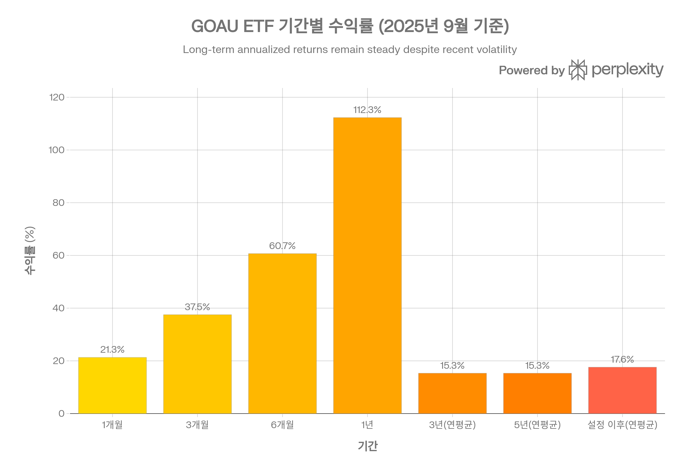
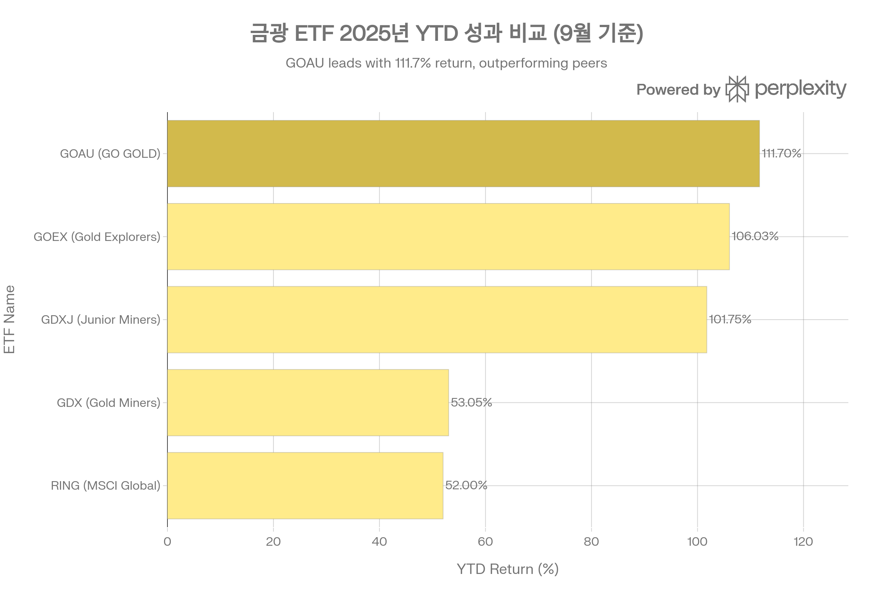
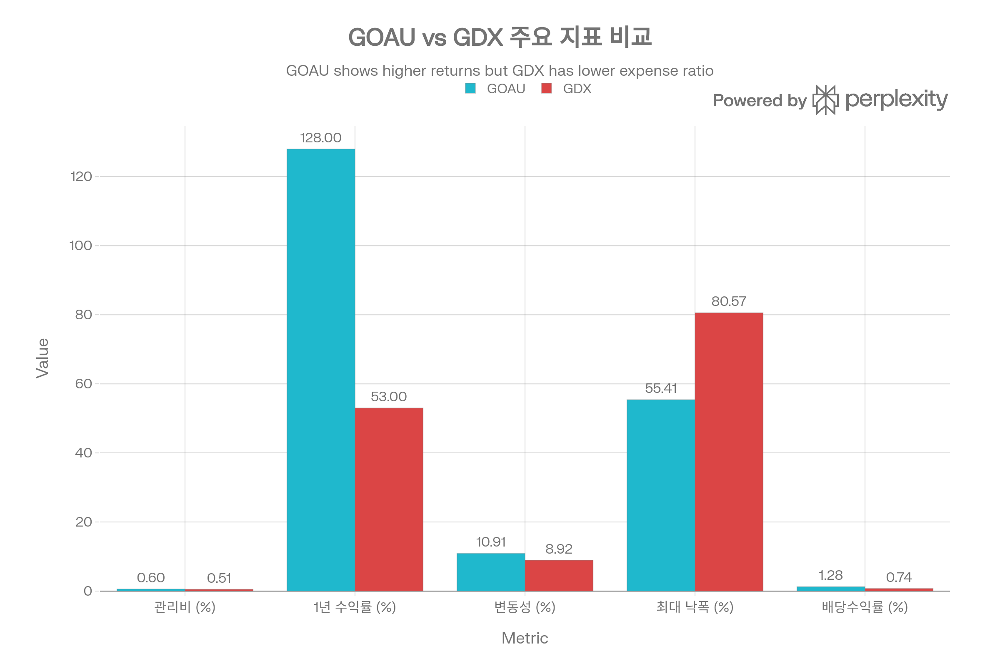
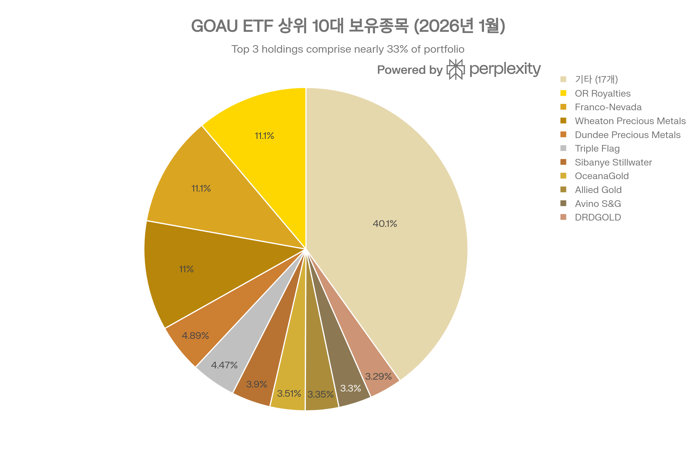
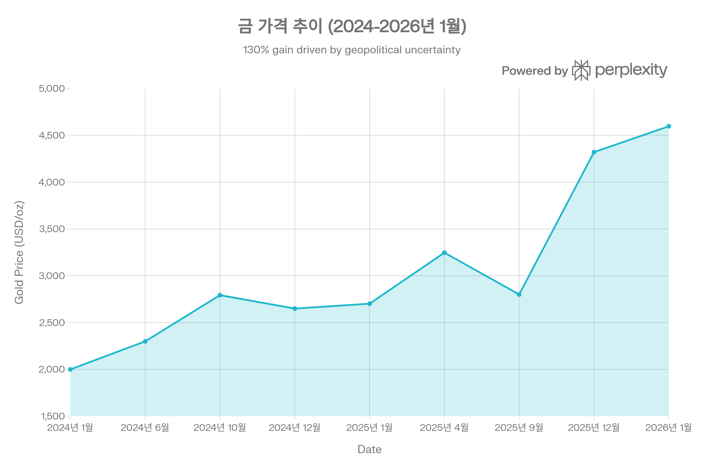

## 분류 근거

GOAU는 금이 아니라 금·귀금속 채굴 및 로열티/스트리밍 기업 주식에 투자하는 비레버리지 ETF입니다. 실물과 채굴주를 함께 묶은 `ETF/Gold` 폴더의 기존 방식(GDX, GDXJ)을 따라 같은 폴더로 분류했습니다.

## U.S. Global GO GOLD and Precious Metal Miners ETF (GOAU) 종합 분석 보고서

### 개요

U.S. Global GO GOLD and Precious Metal Miners ETF(티커: GOAU)는 금 및 귀금속 채굴 기업에 투자하는 액티브 운용 상장지수펀드로, 2017년 6월 설정 이후 2026년 1월 현재까지 탁월한 성과를 기록하고 있다. GOAU는 2025년 12월 말 패시브 인덱스 추종에서 액티브 운용으로 전환하며 "Smart Beta 2.0" 방법론을 유지하는 동시에 보다 선별적인 종목 선택을 통해 투자자에게 차별화된 가치를 제공하고자 한다.[^1][^2][^3][^4][^5]

2026년 1월 현재 금 가격이 온스당 \$4,597로 역사적 고점을 경신하면서, GOAU는 1년 수익률 114.87%, YTD 12.44%를 달성하며 귀금속 섹터의 강력한 모멘텀을 포착하고 있다. 운용자산(AUM) \$207백만, 관리보수 0.60%, 27개 종목으로 구성된 이 ETF는 로열티·스트리밍 기업 30%를 포함한 고품질 포트폴리오 전략으로 경쟁 ETF 대비 우수한 위험조정수익률을 제공한다.[^6][^7][^8][^9][^10][^1]

GOAU ETF는 2025년 강력한 성과를 보이며 1년 수익률 112%, YTD 수익률 111%를 달성했습니다.

### 1. 기본 정보 및 전략적 포지셔닝

#### 1.1 펀드 구조

GOAU는 U.S. Global Investors가 운용하는 귀금속 광산 ETF로, CEO이자 CIO인 Frank Holmes의 수십 년간의 금 투자 전문성을 기반으로 한다. Holmes는 1989년 U.S. Global Investors의 경영권을 인수한 이후 1999년 CIO를 겸임하며, 2015년 첫 ETF인 U.S. Global Jets ETF(JETS)를 출시한 데 이어 2017년 GOAU를 출시했다.[^1][^11][^12][^13]

| 항목 | 내용 |
| :-- | :-- |
| **티커** | GOAU (NYSE Arca) |
| **설정일** | 2017년 6월 27일 |
| **운용사** | U.S. Global Investors |
| **운용전략** | 액티브 운용 (2025년 12월 전환) |
| **AUM** | \$207.39M (2026년 1월) |
| **관리보수** | 0.60% |
| **보유종목** | 27개 |
| **시가총액** | \$207.39M |
| **평균 거래량** | 27,237\~49,990주/일 |

#### 1.2 액티브 전환의 전략적 의미

2025년 12월 말, GOAU는 패시브 인덱스 추종에서 액티브 운용으로 전환했다. 이는 귀금속 사이클의 새로운 국면에서 "broad exposure보다 security selection이 중요하다"는 Frank Holmes의 판단에 기반한다. 중요한 점은 이 전환이 티커, 관리보수(0.60%), Smart Beta 2.0 방법론을 모두 유지하면서 이루어졌다는 것이다.[^3][^4][^5][^14]

액티브 전환은 다음과 같은 전략적 이점을 제공한다:

1. **유연한 종목 선택**: 금 가격이 \$4,000 이상 고공행진하는 환경에서 밸류에이션과 펀더멘털 기반의 선별적 투자 가능[^15][^3]
2. **리스크 관리 강화**: 지정학적 리스크, 자원 민족주의, 광석 등급 하락 등 섹터 리스크에 대한 능동적 대응[^16][^17]
3. **M&A 기회 포착**: 금광주의 기록적 FCF 창출과 M&A 활성화 환경에서 인수 타겟 조기 발굴[^18][^15]

### 2. 성과 분석: 경쟁 ETF 대비 우위

#### 2.1 장기 성과 추이

GOAU는 설정 이후 연평균 13.55\~19.44%의 수익률을 기록하며, 5년 연평균 15.3%, 3년 연평균 15.3%로 안정적인 장기 성과를 보여왔다. 특히 2024\~2025년 금 강세장에서 ETF의 진가가 발휘되었다.[^6][^19][^20][^21]

**2024\~2025년 성과 하이라이트:**

| 기간 | GOAU 수익률 | 금 가격 변화 |
| :-- | :-- | :-- |
| **1년** | 91.4\~142.83% | +70.13% (YoY) |
| **YTD 2025 (9월)** | 111.7% | \$2,702 → \$2,800+ |
| **6개월** | 60.7% | - |
| **3개월** | 37.5% | - |
| **1개월** | 21.3% | - |

[^19][^22][^9][^10][^21]

2025년 9월 19일 GOAU는 \$37.75의 신기록을 달성했으며, 이는 2025년 초 대비 87% 상승한 수치다. 2026년 1월 현재 \$48.01\~\$48.23에 거래되며, 52주 최고가 \$48.48에 근접해 있다.[^20][^8][^23][^24]

#### 2.2 경쟁 ETF 비교: GOAU의 독보적 위치

GOAU는 2025년 주요 금광 ETF 중 최상위 성과를 기록했다.[^7][^25]

GOAU는 2025년 주요 금광 ETF들 중 최상위 성과를 기록하며 111.7%의 YTD 수익률을 달성했습니다.

**주요 금광 ETF 2025년 성과 비교 (9월 기준):**

| ETF | YTD 수익률 | 특징 | 관리보수 |
| :-- | :-- | :-- | :-- |
| **GOAU** | 111.7% | 로열티 30% + Smart Beta 2.0 | 0.60% |
| **GOEX** | 106.03% | 초기단계 탐사 기업 | - |
| **GDXJ** | 101.75% | 중소형 주니어 광산 | 0.51% |
| **GDX** | 53.05% | 대형 금광주 | 0.51% |
| **RING** | \~52% | MSCI 글로벌 금광주 | - |

[^26][^7][^25][^27]

GOAU가 GDXJ(주니어 광산) 대비 약 10%p, GDX(대형 광산) 대비 약 58%p 초과 성과를 달성한 것은 Smart Beta 2.0 방법론과 로열티 기업 편입의 효과를 입증한다.[^7][^26]

> **수치 안내**: 위 표의 GDX 53.05%는 원출처가 2025년 9월 시점에 집계한 수치다. [GDX 자체 포스트](/blog/etf/gold/gdx/gdx-vaneck-gold-miners-etf)는 이후 더 늦은 시점 기준으로 2025년 성과를 98.76\~155.61%(1년 수익률 40.37\~54.55%)로 보고하고 있어, 집계 시점 차이로 두 수치가 다르다. 따라서 위 "58%p", "75%p" 초과 성과 폭은 2025년 9월 시점의 스냅샷이며, 현재 시점 기준으로는 격차가 이보다 작을 수 있다.

**GOAU vs GDX 심층 비교:**

GOAU는 GDX 대비 높은 수익률과 배당을 제공하지만, 약간 높은 관리비와 변동성을 보입니다.

| 지표 | GOAU | GDX | GOAU 우위 |
| :-- | :-- | :-- | :-- |
| **1년 수익률** | 128.14% | 53.05% | ✓ 75%p 우위 |
| **YTD 2025** | 53.55% | 53.05% | 거의 동등 |
| **관리보수** | 0.60% | 0.51\~0.53% | GDX 유리 |
| **변동성** | 9.39\~10.91% | 8.92\~9.97% | GDX 유리 |
| **최대 낙폭** | -55.41% | -80.57% | ✓ GOAU 우위 |
| **배당수익률** | 1.28\~1.41% | 0.74% | ✓ GOAU 우위 |
| **AUM** | \$208M | \$29.1B | GDX 유리 (유동성) |

[^22][^26][^28][^29]

주목할 점은 GOAU의 최대 낙폭이 GDX 대비 25%p 낮다는 것이다(-55.41% vs -80.57%). 이는 로열티 기업의 방어적 특성과 분산 포트폴리오의 효과를 보여준다.[^26]

### 3. Smart Beta 2.0 방법론: 8,000시간의 백테스트

#### 3.1 방법론 개발 과정

GOAU 출시 전, U.S. Global Investors는 8,000시간 이상을 투입해 100개 이상의 팩터를 분석했다. 이 백테스트 결과, GOAU의 방법론은 rolling 12개월 기준으로 GDXJ(주니어 금광 ETF) 대비 92%의 승률을 기록했다.[^7]

#### 3.2 핵심 스크리닝 팩터

Frank Holmes는 GOAU의 핵심 스크리닝 기준으로 다음 5가지를 강조한다:[^30][^7]

1. **Free Cash Flow (FCF) Yield**: 가장 중요한 지표로, 회계 조작이 어려운 실질적 수익성 측정[^30]
2. **Revenue Momentum**: 최근 분기 매출이 4분기 평균을 상회하는 기업 선호[^7]
3. **EBITDA Momentum**: 최근 분기 EBITDA가 4분기 평균을 상회하는 기업 선호[^7]
4. **부채 비중**: 부채로 주로 자금을 조달하는 기업 배제[^31]
5. **Revenue per Employee**: 운영 효율성 지표[^31]

Holmes는 "금광주의 최고 FCF yield를 창출하는 기업, 그리고 최근 분기 매출과 EBITDA가 4분기 평균을 상회하는 모멘텀을 가진 기업을 찾는다"고 설명한다.[^7]

#### 3.3 포트폴리오 구조: 4-Tier 시스템

GOAU는 독특한 4-tier 가중치 구조를 채택한다:[^31]

- **Tier 1**: 3개 최우선 기업에 높은 가중치 배분
- **Tier 2\~3**: 중간 규모 기업
- **Tier 4**: 소형 기업 + 광범위한 지역 노출

이 구조는 분기별 리밸런싱을 통해 유지되며, 로열티/스트리밍 기업이 포트폴리오의 약 30%를 차지한다. 이는 GOAU의 차별화 전략의 핵심이다.[^31][^7]

### 4. 포트폴리오 구성: 로열티 기업 중심의 고품질 전략

#### 4.1 2026년 1월 현재 상위 보유종목

GOAU의 포트폴리오는 상위 3개 로열티 기업이 33%를 차지하며 고도로 분산되어 있습니다 (27개 종목).

| 순위 | 종목명 | 비중 | 유형 |
| :-- | :-- | :-- | :-- |
| 1 | OR Royalties | 11.13% | 로열티 |
| 2 | Franco-Nevada | 11.05% | 로열티 |
| 3 | Wheaton Precious Metals | 10.98% | 스트리밍 |
| 4 | Dundee Precious Metals | 4.89% | 광산 |
| 5 | Triple Flag Precious Metals | 4.47% | 로열티 |
| 6 | Sibanye Stillwater | 3.90% | 광산 |
| 7 | OceanaGold | 3.51% | 광산 |
| 8 | Allied Gold | 3.35% | 광산 |
| 9 | Avino Silver & Gold | 3.30% | 광산 |
| 10 | DRDGOLD | 3.29% | 광산 |
| - | **상위 10개 합계** | **59.87%** | - |
| - | **기타 17개** | **40.13%** | - |

[^32]

주목할 점은 상위 3개 종목(OR Royalties, Franco-Nevada, Wheaton Precious Metals)이 모두 로열티/스트리밍 기업으로 총 33.16%를 차지한다는 것이다. 이는 GOAU의 전략적 차별화 요소다.[^32]

#### 4.2 섹터 및 지역 배분

**섹터 배분:**

- Basic Materials: 99.86\~99.94%
- 기타: 0.14%

[^33][^34]

GOAU는 귀금속 섹터에 거의 100% 집중되어 있어, 분산 투자 효과는 제한적이다. 이는 섹터 집중 리스크를 의미하지만, 동시에 금 가격 상승기에 최대 레버리지를 제공한다.

**지역 배분:**

| 지역 | 비중 | 주요 국가 |
| :-- | :-- | :-- |
| **캐나다** | 59.24% | 안정적 광업 관할구역 |
| **아프리카** | 18.21% | 남아공, 서아프리카 |
| **오세아니아** | 14.59% | 호주 |
| **아시아** | 4.83% | - |
| **미국** | 3.06% | - |

[^33]

캐나다 편중(59%)은 정치적 안정성과 광업 친화적 규제 환경을 반영한다. 반면 아프리카 18% 노출은 높은 수익 잠재력과 함께 지정학적 리스크(자원 민족주의, 정치 불안)를 수반한다.[^16][^17]

### 5. 로열티·스트리밍 비즈니스 모델: GOAU의 핵심 경쟁력

#### 5.1 로열티·스트리밍 모델의 작동 원리

로열티·스트리밍 기업은 광산 개발 자금을 선지급하고, 광산이 생산을 시작하면 미래 생산량의 일정 비율을 수취하는 비즈니스 모델이다. Wheaton Precious Metals의 사례를 보면:[^35][^36][^37]

1. **선지급**: 광산 개발사에 초기 자금 제공
2. **Delivery Payment**: 생산 시점에 spot price보다 낮은 고정 가격으로 금속 구매
3. **Spot 판매**: 구매한 금속을 spot price에 판매하여 높은 마진 실현

[^37][^35]

#### 5.2 전통 광산 대비 구조적 우위

로열티 모델은 전통 광산 대비 다음과 같은 압도적 우위를 갖는다:[^36][^37]

| 우위 요소 | 로열티 모델 | 전통 광산 |
| :-- | :-- | :-- |
| **자본 효율** | 로열티 확보 후 추가 투입 불필요 | 지속적 Capex 필요 |
| **운영 리스크** | 없음 (운영 주체 아님) | 비용 초과, 생산 부족, 사고 등 |
| **마진** | 60\~80% (고정 비용 낮음) | 30\~50% (변동 비용 높음) |
| **비용 인플레이션** | 영향 없음 | 직접 타격 |
| **광산 수명 연장** | 추가 이익 (추가 투자 없이) | 추가 Capex 필요 |
| **배당 안정성** | 금 하락기에도 유지 | 금 하락기 배당 중단 |
| **포트폴리오 분산** | 수십\~수백 개 광산 | 소수 광산 |

[^35][^36][^37]

Frank Holmes는 로열티 모델을 "superior business model"이라 평가하며, 이것이 GOAU가 로열티 기업에 30%를 배분하는 이유다.[^7]

#### 5.3 주요 로열티 기업 실적 (2025년)

**Franco-Nevada (FNV):**

- 432개 광산 투자, 116개 생산자산
- Q2 2025: 매출 \$369.4M (+42% YoY), 영업현금흐름 \$430.3M (+121% YoY)
- 주요 지역: 캐나다, 미국, 호주 (정치적 안정)

**Wheaton Precious Metals (WPM):**

- 18개 운영 광산, 27개 개발 프로젝트
- 거의 100% 귀금속 노출
- 2024 Q1: 160,000 GEO 생산 (+19% YoY)
- 2024년 예상: 550,000\~620,000 GEO
- Q2 2025 매출: \$503M (역대 최고)

**Royal Gold (RGLD):**

- 3위 로열티/스트리밍 기업
- 금 광산 로열티 집중

[^38][^35]

이들 3개 기업이 GOAU 포트폴리오의 33%를 차지하며, 2025년 Q2 모두 기록적 실적을 달성했다.[^32][^38][^35]

### 6. 금 가격 환경: 역사적 강세장과 2026년 전망

#### 6.1 2024\~2026년 금 가격 추이

금 가격은 2024년 1월 \$2,000에서 2026년 1월 \$4,597로 130% 상승하며 역사적 고점을 경신했습니다.

| 시점 | 금 가격 (USD/oz) | 변화 |
| :-- | :-- | :-- |
| 2024년 1월 | \$2,000 | 기준 |
| 2024년 10월 | \$2,793 | +39.7% |
| 2025년 1월 | \$2,702 | - |
| 2025년 4월 | \$3,247 | 사상 최고가 |
| 2025년 12월 | \$4,321 | +116% (vs 2024년 1월) |
| **2026년 1월** | **\$4,597** | **+130%** |

[^39][^40][^41][^9][^42]

금 가격은 2024년 1월 \$2,000에서 2026년 1월 \$4,597로 2년간 130% 상승했다. 특히 2025년 4월 트럼프 관세 정책 불확실성 속에서 \$3,247의 사상 최고가를 경신했다.[^40][^41][^9]

#### 6.2 금 가격 상승 드라이버

**단기 드라이버 (2025\~2026):**

1. **지정학적 불확실성**: 미중 무역 긴장, 트럼프 관세 정책[^40]
2. **연준 금리 인하**: 2024년 말부터 인하 사이클 진입[^20][^39]
3. **중앙은행 매입**: 특히 중국, 인도 중앙은행의 지속적 금 매입[^43][^39]
4. **달러 약세**: 금리 인하에 따른 달러 약세[^39]
5. **인플레이션 우려**: 관세 정책의 인플레이션 효과[^40]

**장기 구조적 드라이버:**

1. **안전자산 선호**: 글로벌 불확실성 환경[^16]
2. **통화 가치 하락(Monetary Debasement)**: 지속적 재정 확대[^18]
3. **중국·인도 소비자 수요**: 아시아 중산층 성장[^39]

[^43][^18][^16][^39][^40]

#### 6.3 2025\~2030년 금 가격 전망

주요 투자은행과 리서치 기관의 금 가격 전망은 다음과 같다:

| 기관 | 2025년 평균 전망 | 최고 전망 |
| :-- | :-- | :-- |
| **Citi** | \$2,900/oz | - |
| **JP Morgan** | \$2,175/oz (Q4 2024) | \$2,300+ |
| **Goldman Sachs** | \$2,050/oz | - |
| **ING** | \$2,031/oz (연평균) | \$2,100/oz (Q4) |
| **Bloomberg Intelligence** | - | \$7,000 (2025년까지) |
| **평균** | \$2,498.72/oz | \$3,000+ |

[^43][^39][^40]

주목할 점은 이들 전망이 대부분 2024년 말 발표된 것으로, 실제 2025\~2026년 금 가격(\$3,247\~\$4,597)이 전망치를 크게 상회했다는 것이다. 이는 금 강세장의 모멘텀이 전문가 예상을 초과하고 있음을 시사한다.[^39][^40]

### 7. 금광 섹터 펀더멘털: 기록적 FCF와 M&A 활성화

#### 7.1 주요 생산자의 기록적 수익성 (2025년 Q3)

금 가격 \$3,400\~\$4,000 환경에서 주요 금광 기업은 역사상 최고 수준의 수익성을 달성했다:[^18][^15]

**Agnico Eagle Mines:**

- 매출: \$3B
- EBITDA: \$2B (66% 마진)
- All-in Sustaining Cost (AISC): \$1,400/oz
- Free Cash Flow: \$1.2B/분기 = 일 \$13M
- 금가 \$4,000 시 일 FCF: \$17\~18M

**Newmont Corporation:**

- 매출: \$7.96B
- EBITDA: \$3.3B
- 생산량: 1.4M oz
- Free Cash Flow: \$1.6B/분기 = 일 \$17M
- 금가 \$500 상승 시 일 FCF \$7M 추가

[^15][^18]

Agnico의 66% EBITDA 마진은 역사적으로 최고 수준이다. 금가 \$4,000에서 대형 생산자들은 일 \$10\~20M의 FCF를 창출하고 있다.[^18][^15]

**섹터 전체 FCF 급증:**
Philadelphia Gold and Silver Index의 집계 FCF는 11배 급증했으며, 이는 주가 상승률을 훨씬 상회한다. 즉, 금광주는 펀더멘털 개선에 비해 여전히 저평가 상태다.[^44]

#### 7.2 M&A 활동 활성화

기록적 FCF는 M&A 활동을 촉진하고 있다:[^15][^18]

**주요 M&A 사례 (2025년):**

- **Fresnillo → Probe Gold**: \$780M 현금 인수
- **Coeur → New Gold**: 인수
- **Agnico → Perpetua Resources**: \$180M 투자 (FCF 10일치)
- **Gold Fields → Founders Metals**: \$50M 투자
- **B2Gold → Prospector Metals**: \$10M 투자

[^18]

주목할 점은 대형 생산자들이 **현금 거래**를 선호한다는 것이다. Agnico의 \$180M Perpetua 투자는 일 FCF \$13M의 단 10일치에 불과하며, 이는 현재 생산자들이 얼마나 강력한 재무 여력을 갖고 있는지 보여준다.[^18]

#### 7.3 금광주 밸류에이션: 여전히 저평가

**GOAU 밸류에이션 지표:**

| 지표 | 현재 값 | 10년 범위 | 10년 중앙값 |
| :-- | :-- | :-- | :-- |
| **P/E Ratio** | 20.34\~31.27 | 7.6\~59.73 | 17.1\~19.9 |
| **P/B Ratio** | 2.25\~3.93 | 0.86\~2.42 | 1.33 |

[^1][^22][^45]

GOAU의 P/E 20\~31은 10년 중앙값 17\~20과 유사한 수준으로, 100%+ 수익률에도 불구하고 밸류에이션 버블은 제한적이다. 이는 금광주 수익성(EPS) 증가가 주가 상승을 뒷받침하고 있음을 의미한다.[^45]

**주요 생산자 밸류에이션 (2025년):**

| 세그먼트 | P/NAV | EV/EBITDA | FCF Yield |
| :-- | :-- | :-- | :-- |
| **대형 생산자** | 1.2\~1.8x | 4\~7x | 8\~15% |
| **중형 생산자** | 0.8\~1.4x | 6\~12x | 12\~22% |

[^15]

중형 생산자의 FCF yield 12\~22%는 매우 매력적인 수준이다. EY(Ernst & Young) 보고서는 "금광주 밸류에이션이 금 가격 상승을 반영하지 못하고 있다"고 지적하며, 비용 관리가 밸류에이션 개선의 관건이라 강조한다.[^16]

### 8. 리스크 분석: 변동성과 섹터 집중도

#### 8.1 정량적 리스크 지표

**위험조정수익률 지표:**

| 지표 | 값 | 해석 |
| :-- | :-- | :-- |
| **Sharpe Ratio** | 1.07\~3.78 | 양호\~우수 (1 이상이 양호) |
| **Sortino Ratio** | - | 하락 위험 조정 수익률 |
| **Treynor Ratio** | 42.85\~45.7 | 우수 |
| **표준편차** | 26.52\~35.05% | 높음 (기술주 ETF의 1.3\~1.5배) |
| **변동성 (월간)** | 9.57% | GLDM(금 현물 ETF) 4.30%의 2배 |
| **베타** | 0.46\~1.05 | 시장과 유사하거나 낮음 |
| **R-squared** | 8.4\~9.54 | 시장 독립적 (낮음) |
| **최대 낙폭** | -55.41% | GDX(-80.57%) 대비 양호 |

[^22][^46][^26][^47][^48][^49]

GOAU의 Sharpe Ratio 1.07\~3.78은 위험 대비 수익이 우수함을 의미한다. 특히 최근 12개월 Sharpe 3.78은 매우 높은 수준이다. 반면 표준편차 26\~35%는 금 현물 ETF(GLDM) 대비 2배 이상 높아, 금광주의 높은 변동성을 반영한다.[^47][^48]

#### 8.2 섹터별 리스크 요인

**운영 리스크:**

1. **광석 등급 하락**: 주요 광산의 광석 등급 지속 하락으로 생산량 유지를 위해 더 많은 광석 처리 필요[^16][^17]
2. **비용 인플레이션**: 에너지, 노동, 장비 비용 상승[^16]
3. **기술적 위험**: 비용 초과, 생산 부족, 설비 고장[^17]
4. **노동 분쟁**: 파업, 임금 협상[^17]

**지정학적 리스크:**

1. **자원 민족주의**: 말리, 부르키나파소 등 현지 지분 요구 증가, 세금 강화[^16]
2. **정치적 불안**: 아프리카 18% 노출의 리스크[^33][^16]
3. **관할구역 리스크**: 캐나다·미국·호주 vs 아프리카·라틴아메리카 프리미엄 격차 확대[^17]

**환경·사회 리스크:**

1. **ESG 압력 증가**: 탄소 배출, 물 사용, 폐기물 관리[^50][^51]
2. **커뮤니티 갈등**: 물 사용권, 토지 사용권 분쟁[^50]
3. **허가 지연**: ESG 기준 미달 시 프로젝트 지연·중단[^51]

[^51][^50][^16][^17]

#### 8.3 ESG 리스크: 금광 산업의 아킬레스건

2024년 Metals Focus의 Gold ESG Focus 보고서는 금광 산업의 ESG 후퇴를 경고한다:[^50]

**주요 ESG 지표 (2024년):**

- **탄소 배출**: Scope 1+2 총량 2% 감소, 하지만 **배출 집약도 3% 증가** (광석 등급 하락)
- **재생에너지**: 전력의 단 10% (철강·전력 산업 대비 크게 낮음)
- **물 재활용**: 72% → 70% 하락
- **폐기물**: 역대 최고 수준, 집약도 급증

[^50]

Zijin Mining(중국)은 단일 기업 최대 배출원이며, 폐기물 10억 톤으로 Barrick의 2배 규모다. ESG 성과는 이제 자금 조달, 허가, 사회적 신뢰의 결정 요인이 되고 있다.[^51][^50]

### 9. 배당 정책: 137% 증가의 의미

#### 9.1 배당 이력

| 연도 | 배당액 | 전년 대비 증가율 |
| :-- | :-- | :-- |
| 2020 | \$0.1470 | - |
| 2021 | \$0.2283 | +55.3% |
| 2022 | \$0.2401 | +5.1% |
| 2023 | \$0.1681 | -30.0% |
| **2024** | **\$0.40** | **+137.9%** |

[^29][^52]

2024년 배당 \$0.40은 전년 대비 137.9% 급증했다. 이는 2024\~2025년 금 가격 급등과 포트폴리오 기업들의 배당 증가를 반영한다.[^29]

#### 9.2 배당 특성

| 지표 | 값 |
| :-- | :-- |
| **배당수익률** | 0.84\~1.41% |
| **지급주기** | 연 1회 |
| **최근 배당일** | 2024년 12월 26일 |
| **Payout Ratio** | 24.56\~26.01% |

[^2][^6][^53][^29]

배당수익률 1.28\~1.41%는 GDX(0.74%)의 거의 2배다. Payout Ratio 24\~26%는 보수적 수준으로, 향후 배당 증가 여력이 충분하다.[^6][^26][^29]

### 10. 비용 구조 및 유동성

#### 10.1 비용 분석

| 비용 항목 | GOAU | GDX | 업계 평균 |
| :-- | :-- | :-- | :-- |
| **총 관리비** | 0.60% | 0.51\~0.53% | 0.50\~0.80% |
| **Turnover** | 116% | 15% | 20\~50% |
| **호가 스프레드** | - | - | - |

[^1][^6][^22][^26][^28]

GOAU의 0.60% 관리비는 GDX의 0.51\~0.53% 대비 약간 높지만, 로열티 기업 포함과 Smart Beta 2.0 방법론의 부가가치를 고려하면 합리적이다. 반면 Turnover 116%는 GDX 15% 대비 매우 높아, 액티브 운용 전환 초기의 리밸런싱을 반영하는 것으로 보인다.[^22][^26][^28][^1]

#### 10.2 유동성 및 NAV 괴리율

| 지표 | 값 |
| :-- | :-- |
| **평균 일거래량** | 27,237\~49,990주 |
| **AUM** | \$207.39M |
| **NAV 프리미엄/디스카운트** | +0.17\~0.54% |
| **베타** | 0.46\~1.05 |

[^6][^46][^23][^54]

GOAU는 NAV 대비 +0.17\~0.54% 프리미엄에 거래되고 있으며, 이는 시장 가격이 공정가치를 약간 상회함을 의미한다. 프리미엄 폭이 1% 미만으로 작아 거래 비용 측면에서 불리함은 제한적이다.[^54][^24]

AUM \$207M은 GDX \$29B의 0.7%에 불과해, 대규모 기관 투자자에게는 유동성이 제약 요인이 될 수 있다. 그러나 일평균 거래량 27,237\~49,990주는 개인 및 중소 기관 투자자에게는 충분하다.[^46][^28][^23][^6]

### 11. 투자 의사결정 프레임워크

#### 11.1 GOAU의 강점

1. **차별화된 전략**: 로열티 기업 30% + Smart Beta 2.0로 경쟁 ETF 대비 우수한 성과[^7][^35]
2. **검증된 방법론**: 8,000시간 백테스트, GDXJ 대비 92% 승률[^7]
3. **전문 운용팀**: Frank Holmes의 30년+ 금 투자 전문성[^11][^12]
4. **방어적 포트폴리오**: 로열티 모델의 낮은 운영 리스크, 최대 낙폭 -55% (vs GDX -80%)[^26][^36]
5. **높은 배당**: 1.28\~1.41% (GDX 0.74%의 2배)[^29][^26]
6. **밸류에이션**: P/E 20\~31로 역사적 중앙값 수준, 버블 아님[^45]
7. **액티브 전환**: 섹터 변화에 능동 대응 가능[^3][^4]

#### 11.2 GOAU의 약점 및 리스크

1. **높은 변동성**: 표준편차 26\~35%, 금 현물 ETF의 2배[^47]
2. **섹터 집중**: Basic Materials 99.9%, 분산 효과 제한[^33][^34]
3. **작은 AUM**: \$207M으로 유동성 제약[^28][^23]
4. **높은 Turnover**: 116%로 거래비용 증가 가능[^28]
5. **지정학적 리스크**: 아프리카 18% 노출[^16][^33]
6. **ESG 압력**: 금광 산업의 구조적 ESG 과제[^50][^51]
7. **금가 의존**: 금 가격 조정 시 큰 폭 하락 가능[^26]

#### 11.3 투자 적합성

**GOAU가 적합한 투자자:**

1. **금 강세장 확신**: 금 가격 장기 상승 트렌드 지속 예상
2. **높은 위험 감수력**: 26\~35% 변동성 수용 가능
3. **중장기 투자자**: 3\~5년 이상 보유 계획
4. **섹터 배분**: 포트폴리오의 5\~15%를 귀금속 섹터에 배분 희망
5. **액티브 프리미엄**: 0.60% 관리비 대비 알파 창출 기대
6. **배당 선호**: GDX 대비 2배 높은 배당 선호

**GOAU가 부적합한 투자자:**

1. **보수적 투자자**: 낮은 변동성 선호
2. **단기 트레이더**: 높은 Turnover와 액티브 전환 불확실성
3. **대형 기관**: 유동성 제약 (\$200M AUM)
4. **분산 추구**: 99.9% 단일 섹터 집중 부담
5. **ESG 엄격 기준**: 금광 산업의 ESG 과제 우려

#### 11.4 포트폴리오 내 역할

GOAU는 다음과 같은 포트폴리오 역할을 수행할 수 있다:

1. **인플레이션 헤지**: 금의 전통적 역할[^39][^43]
2. **지정학적 리스크 헤지**: 불확실성 증가 시 안전자산 선호[^40][^16]
3. **통화 가치 하락 헤지**: 재정 확대와 통화 팽창 환경[^18]
4. **포트폴리오 분산**: R-squared 8\~9로 주식시장과 독립적[^49]
5. **성장 노출**: 금광주의 금가 레버리지 효과[^27][^55]

전문가들은 금을 포트폴리오의 5\~10%로 제한할 것을 권장한다. GOAU는 이 배분 내에서 금 현물 ETF(GLDM 등)와 조합하여 사용할 수 있다:[^4][^56]

- **금 현물 ETF (GLDM)**: 3\~5% (낮은 변동성, 순수 금가 노출)
- **GOAU**: 2\~5% (높은 레버리지, 배당 수익)

### 12. 2026년 전망 및 시나리오 분석

#### 12.1 기본 시나리오 (확률 50%): 금 \$4,000\~\$5,000 유지

**가정:**

- 연준 금리 2\~3회 추가 인하 (2026년)
- 지정학적 긴장 지속 (미중, 중동)
- 중앙은행 금 매입 계속

**GOAU 영향:**

- 예상 수익률: +15\~25%
- 배당: \$0.40\~\$0.50 (배당수익률 1\~1.5%)
- 리스크: 변동성 25\~30% 지속

**투자 전략**: 유지 또는 추가 매수

#### 12.2 강세 시나리오 (확률 25%): 금 \$5,000\~\$7,000

**가정:**

- 연준 공격적 금리 인하 (경기 침체 우려)
- 달러 급락
- 지정학적 위기 심화 (전쟁, 무역 전쟁)

**GOAU 영향:**

- 예상 수익률: +50\~100%+
- 배당: \$0.60+ (배당수익률 1.5\~2%)
- 리스크: 변동성 35\~45%

**투자 전략**: 공격적 매수, 포트폴리오 배분 10\~15% 확대

#### 12.3 약세 시나리오 (확률 25%): 금 \$3,000\~\$4,000

**가정:**

- 연준 금리 인하 중단 (인플레이션 재상승)
- 달러 강세
- 경기 회복으로 안전자산 선호 약화

**GOAU 영향:**

- 예상 수익률: -20\~-40%
- 배당: \$0.20\~\$0.30 (배당수익률 1\~1.5%)
- 리스크: 최대 낙폭 -50% 재현 가능

**투자 전략**: 비중 축소 또는 금 현물 ETF로 전환

### 13. 결론 및 투자 권고

#### 13.1 종합 평가

GOAU는 2024\~2026년 금 강세장에서 경쟁 ETF 대비 탁월한 성과를 입증했다. 1년 수익률 114.87%, YTD 111.7%는 로열티 기업 30% 포함과 Smart Beta 2.0 방법론의 효과를 명확히 보여준다. Frank Holmes의 8,000시간 백테스트와 30년+ 금 투자 전문성은 방법론의 신뢰성을 뒷받침한다.[^19][^7][^10][^11]

2025년 12월 액티브 전환은 금 \$4,000+ 고가 환경에서 선별적 투자를 통한 추가 알파 창출 가능성을 열었다. 로열티 모델의 구조적 우위(운영 리스크 없음, 높은 마진, 광산 수명 연장 혜택)는 전통 금광 ETF 대비 방어력을 제공한다.[^3][^4][^35][^36][^37]

**핵심 투자 논리:**

1. **금 강세장 지속**: \$4,597 수준에서 구조적 드라이버(중앙은행 매입, 지정학적 불확실성, 통화 가치 하락) 건재[^39][^40][^18]
2. **금광주 저평가**: 기록적 FCF 창출(11배 급증)에도 밸류에이션 합리적(P/E 20\~31)[^44][^45]
3. **로열티 우위**: 운영 리스크 없이 금가 상승 혜택, 배당 안정성[^35][^36][^37]
4. **검증된 전략**: GDXJ 대비 92% 승률, 2025년 111.7% 수익률[^7][^10]

#### 13.2 투자 등급 및 목표가

**투자 등급**: **매수 (Buy)**

**12개월 목표가**: **\$55\~\$65** (현재가 \$48 대비 +15\~35%)

**근거:**

- 기본 시나리오(금 \$4,000\~\$5,000) 하 GOAU +15\~25% 예상
- 강세 시나리오(금 \$5,000+) 가능성 25% 반영
- P/E 20\~31은 역사적 중앙값 수준으로 추가 상승 여력

**적정 포트폴리오 비중**: **5\~10%** (위험 감수력에 따라)

#### 13.3 투자 시 체크리스트

**매수 전 확인사항:**

1. ✓ 금 가격 \$4,000 이상 유지 여부
2. ✓ 포트폴리오 귀금속 섹터 비중 10% 미만 여부
3. ✓ 3년 이상 장기 투자 가능 여부
4. ✓ 25\~35% 변동성 수용 가능 여부
5. ✓ 액티브 전환 초기 불확실성 수용 여부

**매도 신호:**

1. ✗ 금 가격 \$3,500 하회
2. ✗ 연준 금리 인상 재개
3. ✗ 지정학적 긴장 완화 (안전자산 선호 약화)
4. ✗ GOAU Turnover 150% 초과 (과도한 리밸런싱)
5. ✗ 경쟁 ETF 대비 3개월 연속 저성과

#### 13.4 최종 제언

GOAU는 금 강세장에서 레버리지를 극대화하려는 적극적 투자자에게 매력적인 선택지다. 로열티 기업 중심의 차별화 전략과 Frank Holmes의 검증된 운용 역량은 경쟁 우위를 제공한다. 그러나 높은 변동성, 섹터 집중, 작은 AUM은 리스크 요인이다.

금 가격이 \$4,597 역사적 고점을 경신한 현 시점에서, GOAU는 단기 조정 가능성에도 불구하고 중장기적으로 구조적 드라이버(중앙은행 매입, 지정학적 불확실성, 통화 가치 하락)가 지속될 것으로 판단된다. 따라서 **포트폴리오의 5\~10% 배분을 통한 매수 전략**을 권고한다.

투자자는 금 현물 ETF와 GOAU를 조합하여 변동성을 관리하고, 정기적 리밸런싱을 통해 위험을 통제해야 한다. 2026년은 금광 산업에 있어 "금 선택(security selection)의 시대"가 될 것이며, GOAU의 액티브 전환은 이 환경에 최적화된 전략적 선택으로 평가된다.

***

**주요 수치 요약**

| 지표 | 값 |
| :-- | :-- |
| 현재가 (2026.01) | \$48.01\~\$48.23 |
| 1년 수익률 | +114.87% |
| YTD 2026 | +12.44% |
| 금 가격 | \$4,597/oz |
| AUM | \$207.39M |
| 관리보수 | 0.60% |
| 배당수익률 | 1.28\~1.41% |
| P/E Ratio | 20.34\~31.27 |
| 변동성 | 26.52\~35.05% |
| Sharpe Ratio | 1.07\~3.78 |
| 최대 낙폭 | -55.41% |
| 상위 10개 비중 | 59.87% |

[^1]: https://usglobaletfs.com/fund/u-s-global-go-gold-and-precious-metal-miners-etf/

[^2]: https://www.stash.com/investments/etfs/us-global-go-gold-and-precious-metal-miners-etf-goau

[^3]: https://www.stocktitan.net/news/GROW/u-s-global-investors-advances-smart-beta-2-0-strategy-as-goau-etf-v0tnagvz5wzt.html

[^4]: https://investingnews.com/u-s-global-investors-advances-smart-beta-2-0-strategy-as-goau-etf-transitions-to-active-management-and-war-etf-marks-one-year-milestone/

[^5]: https://www.usfunds.com/resource/u-s-global-investors-fund-to-pay-year-end-distributions-2025/

[^6]: https://stockanalysis.com/etf/goau/

[^7]: https://www.etftrends.com/alternatives-channel/gold-mining-etf-goau-surges-ahead/

[^8]: https://stockinvest.us/stock/GOAU

[^9]: https://fortune.com/article/current-price-of-gold-01-16-2026/

[^10]: https://markets.ft.com/data/etfs/tearsheet/historical?s=GOAU%3APCQ%3AUSD

[^11]: https://www.usfunds.com/about/

[^12]: https://www.linkedin.com/in/frank-holmes-0a941b16

[^13]: https://irei.com/publications/article/profile-frank-holmes-ceo-u-s-global-investors/

[^14]: https://www.ainvest.com/news/global-investors-transition-goau-active-management-war-celebrates-1-year-anniversary-2512/

[^15]: https://discoveryalert.com.au/gold-miners-record-cash-flow-2025/

[^16]: https://www.ey.com/en_au/insights/mining-metals/the-2025-risks-and-opportunities-for-the-gold-mining-sector

[^17]: https://www.cruxinvestor.com/posts/gold-stocks-the-2025-portfolio-game-changer

[^18]: https://www.cruxinvestor.com/posts/gold-miners-record-cash-flow-fuels-capital-migration-down-market-cap-ladder

[^19]: https://www.schwab.wallst.com/schwab/Prospect/research/etfs/reports/reportRetrieve.asp?reportType=etfrc&symbol=GOAU

[^20]: https://investingnews.com/u-s-global-investors-maintains-monthly-dividends-as-its-goau-gold-mining-etf-hits-a-new-record-high/

[^21]: https://usglobaletfs.com/app/uploads/2021/02/GOAU-Factsheet.pdf

[^22]: https://www.barchart.com/etfs-funds/quotes/GOAU/profile

[^23]: https://robinhood.com/us/en/stocks/GOAU/

[^24]: https://www.usfunds.com/resource/u-s-global-investors-maintains-monthly-dividends-as-its-goau-gold-mining-etf-hits-a-new-record-high/

[^25]: https://www.investing.com/analysis/8-top-gold-etfs-in-2025-delivering-massive-growth-and-dividend-income-200666567

[^26]: https://portfolioslab.com/tools/stock-comparison/GOAU/GDX

[^27]: https://www.etftrends.com/gold-mining-etfs-shine-early-2025/

[^28]: https://tickeron.com/compare/GDX-vs-GOAU/

[^29]: https://stockanalysis.com/etf/goau/dividend/

[^30]: https://usglobaletfs.com/insights/top-10-gold-and-precious-metal-mining-stocks-ranked-by-free-cash-flow-yield/

[^31]: https://www.onegold.com/etfs/goau

[^32]: https://stockanalysis.com/etf/goau/holdings/

[^33]: https://markets.ft.com/data/etfs/tearsheet/summary?s=GOAU%3APCQ%3AUSD

[^34]: https://markets.ft.com/data/etfs/tearsheet/holdings?s=GOAU%3APCQ%3AUSD

[^35]: https://usglobaletfs.com/app/uploads/2025/06/GOAU-WP-DL.pdf

[^36]: https://www.bnnbloomberg.ca/investment-trends/2026/01/06/summit-royalties-outlines-the-royalty-models-advantage-for-risk-adjusted-returns-in-mining/

[^37]: https://www.visualcapitalist.com/sp/how-precious-metals-royalty-and-streaming-companies-create-value/

[^38]: https://discoveryalert.com.au/gold-streaming-royalty-investments-2025-opportunities/

[^39]: https://www.axi.com/int/blog/education/commodities/gold-price-forecasts

[^40]: https://www.bullionbypost.co.uk/info/gold-price-forecast-2025/

[^41]: https://pricegold.net/2026/january/11/

[^42]: https://goldprice.org/pt/node/45605

[^43]: https://fbs.com/fbs-academy/traders-blog/gold-price-forecast-for-2024-2025

[^44]: https://www.linkedin.com/posts/israeldaniel_miningstocks-gold-finance-activity-7385313116093308928-FVtI

[^45]: https://www.gurufocus.com/etf/GOAU/summary

[^46]: https://public.com/stocks/goau

[^47]: https://portfolioslab.com/tools/stock-comparison/GOAU/GLDM

[^48]: https://markets.ft.com/data/etfs/tearsheet/risk?s=GOAU%3APCQ%3AUSD

[^49]: https://finance.yahoo.com/quote/GOAU/risk/

[^50]: https://investingnews.com/gold-industry-faces-esg-setbacks/

[^51]: https://www.jhetf.com/news/investors-expect-esg-improvements-from-gold-mining-sector/

[^52]: https://www.digrin.com/stocks/detail/GOAU/

[^53]: https://www.tipranks.com/etf/goau/dividends

[^54]: https://www.tradingview.com/symbols/AMEX-GOAU/

[^55]: https://www.vaneck.com/us/en/investments/junior-gold-miners-etf-gdxj/

[^56]: https://ecrresearch.com/sites/default/files/research_downloads/Methodology%20SAA%20model_0.pdf

