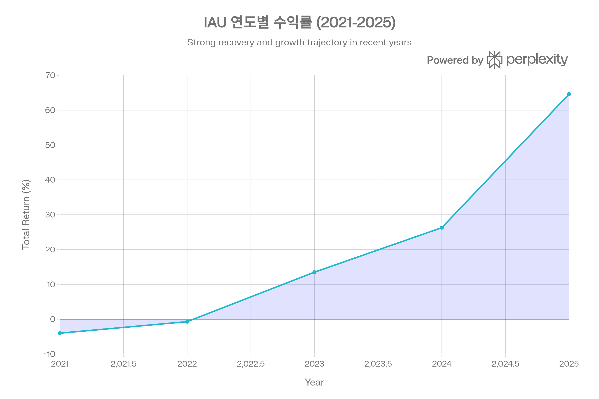
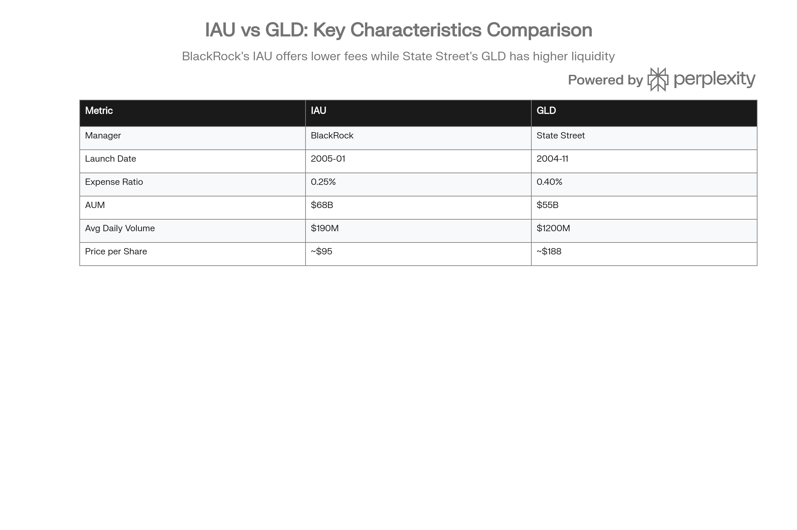

## 분류 근거

IAU 역시 100% 실물 금을 보유하는 그랜터 신탁 ETF로, GLD/GLDM과 같은 `ETF/Gold` 폴더로 분류했습니다.

## 개요

IAU (iShares Gold Trust)는 세계 최대 자산운용사 BlackRock이 운용하는 금 실물 기반 ETF로, 2005년 1월 21일 설정 이후 금 투자의 대표적인 수단으로 자리매김했다. 런던·뉴욕·토론토의 안전한 금고에 실제 금괴를 보관하며, 투자자는 물리적 금을 직접 소유하는 복잡함과 비용 없이 금 가격 변동에 노출될 수 있다. 2025년 64.60%라는 역대급 수익률을 기록하며 금 시장의 강세를 그대로 반영했고, 2026년 1월 현재 운용자산 규모(AUM)는 683억 달러에 달한다.[^1][^2][^3][^4][^5]

IAU는 경쟁 ETF인 GLD(SPDR Gold Shares) 대비 0.15%포인트 낮은 0.25%의 운용보수로 비용 효율성을 제공하며, 중장기 투자자와 소액 투자자에게 특히 적합한 선택지로 평가받는다. 금은 전통적으로 인플레이션 헤지, 안전자산, 포트폴리오 다각화 수단으로 기능하며, IAU는 이러한 금의 특성을 주식처럼 간편하게 거래할 수 있도록 설계되었다.[^2][^6][^7][^8][^9][^1]

***

## IAU (iShares Gold Trust) 기본 정보

| 항목 | 내용 |
| :-- | :-- |
| **티커** | IAU |
| **운용사** | BlackRock, Inc. |
| **설정일** | 2005년 1월 21일 |
| **상장 거래소** | NYSE Arca |
| **추종 지표** | LBMA Gold Price PM (\$/ozt) |
| **운용자산(AUM)** | \$68.38B (2025년 12월 기준) |
| **현재가** | \~\$95.18 (2026년 1월) |
| **운용보수(Expense Ratio)** | 0.25% |
| **보유 금** | 15,875,516.02 온스 (493.78톤) |
| **발행 주식수** | 842,850,000주 |
| **배당 정책** | 무배당 |

IAU는 런던 금 시장 협회(LBMA)가 매일 결정하는 금 현물 가격을 추종한다. 실제 보유 금괴는 런던 Good Delivery 기준을 충족하며, JP Morgan Chase Bank(런던·뉴욕)와 Scotia Mocatta(토론토)의 금고에 할당(allocated) 방식으로 보관된다. 할당 방식은 투자자가 특정 금괴에 대한 소유권을 갖는다는 의미로, 비할당(unallocated) 방식보다 안전성이 높다.[^1][^10][^4][^11][^5][^12]

***

## IAU (iShares Gold Trust) 성과 분석

### 수익률 실적 (2025년 12월 31일 기준)

2025년 IAU는 금 가격의 역사적 강세장을 그대로 반영하며 연간 64.60%의 수익률을 기록했다. 이는 2011년 설정 이후 최고 수익률이며, 2024년 26.28%, 2023년 13.52%에 이어 3년 연속 상승세를 이어갔다. 반면 2021년(-3.99%)과 2022년(-0.69%)에는 연준의 금리 인상과 달러 강세로 부진했다.[^2][^3]

| 기간 | Total Return (%) | Market Price Return (%) | Reference Benchmark (%) |
| :-- | :-- | :-- | :-- |
| **2025년 (YTD)** | 64.60 | 63.95 | 67.29 |
| **1개월** | 2.77 | 2.22 | 5.15 |
| **3개월** | 12.55 | 11.54 | 14.18 |
| **6개월** | 30.88 | 30.16 | 32.86 |
| **1년** | 64.60 | 63.95 | 67.29 |
| **3년 (연환산)** | 33.13 | 32.89 | 34.07 |
| **5년 (연환산)** | 17.61 | 17.49 | 18.23 |
| **10년 (연환산)** | 14.75 | 14.78 | 15.19 |
| **설정 후 (연환산)** | 11.35 | 11.35 | 11.75 |

출처: iShares, BlackRock[^3][^2]

### 연도별 수익률 추이

IAU ETF의 2021년부터 2025년까지 연도별 수익률 추이. 2025년 금 가격 급등으로 64.60%의 역대급 수익률 기록.

2021년부터 2025년까지의 연도별 수익률을 살펴보면, 금 시장은 거시경제 환경에 따라 변동성을 보였다. 2021-2022년 연준의 공격적 긴축으로 마이너스 수익률을 기록했으나, 2023년부터 금리 인상 속도 둔화와 함께 회복세를 보였다. 2025년에는 중앙은행의 지속적인 금 매입, ETF 자금 유입 가속화, 지정학적 리스크 고조, 미국 재정 악화 우려 등이 복합적으로 작용하며 금값이 온스당 2,600달러 초반에서 3,700달러 수준까지 급등했다.[^2][^13][^14][^15]

### 추종 오차 및 프리미엄/할인

IAU의 3년 추종 오차(Tracking Error)는 13.80%로, 이는 ETF 수익률이 벤치마크 대비 얼마나 변동하는지를 나타낸다. 추종 차이(Tracking Difference)는 실제 성과와 벤치마크의 차이를 의미하며, IAU는 0.25% 운용보수로 인해 연간 약 0.25%의 추종 차이가 예상된다. 이는 GLD(0.40%)보다 우수한 수준이다.[^1][^16]

2026년 1월 기준 IAU는 순자산가치(NAV) 대비 0.3\~0.7%의 프리미엄으로 거래되고 있다. 이는 시장 가격이 실제 금 가치보다 소폭 높다는 의미로, 정상적인 범위 내의 변동으로 평가된다.[^17][^18][^19]

***

## IAU (iShares Gold Trust) 비용 및 효율성

### 운용보수 비교

IAU의 가장 큰 경쟁력은 0.25%의 낮은 운용보수다. 이는 금 ETF 시장에서 가장 큰 규모를 자랑하는 GLD의 0.40%보다 0.15%포인트 낮으며, 장기 투자 시 수익률 차이를 만드는 핵심 요인이다. 예를 들어, 1,000만 원을 10년간 투자할 경우, 연간 0.15%의 비용 절감은 복리 효과로 수십만 원의 차이를 만들 수 있다.[^1][^2][^8][^20][^21]

더 낮은 수수료를 원하는 투자자를 위해 BlackRock은 2018년 IAUM(iShares Gold Trust Micro)을 출시했으며, 이는 0.09%의 운용보수로 업계 최저 수준을 제공한다. 그러나 IAU는 규모(AUM \$68B)와 유동성 측면에서 IAUM(AUM \~\$6B)을 압도하며, 대부분의 투자자에게 가장 균형잡힌 선택지로 평가받는다.[^6][^22][^23]

| ETF | 운용보수 | AUM | 일평균 거래량 | 특징 |
| :-- | :-- | :-- | :-- | :-- |
| **IAU** | 0.25% | \$68B | \$1.9억 | 균형잡힌 선택 |
| **GLD** | 0.40% | \$159B | \$12억 | 최고 유동성 |
| **IAUM** | 0.09% | \~\$6B | 낮음 | 최저 비용 |
| **GLDM** | \~0.10% | \~\$27B | 중간 | 비용 효율 |

출처: 각 운용사, 투자 분석 자료[^8][^22][^23][^6]

### 유동성

IAU의 평균 일거래량은 9.79\~14.95백만 주 수준으로, 거래금액으로는 약 1.9억 달러에 해당한다. 이는 GLD의 12억 달러에는 미치지 못하지만, 일반 투자자가 매매하기에는 충분히 높은 유동성이다. 2026년 1월 26일 기준 거래량은 23.8백만 주로, 평균을 상회하며 활발한 거래가 이루어지고 있다.[^24][^25][^26]

시가총액은 683억 달러 수준으로 대형주(Large Cap)에 해당하며, 이는 매수·매도 시 슬리피지(가격 미끄러짐)가 최소화됨을 의미한다. 비드-애스크 스프레드(매수·매도 호가 차이)도 낮아 거래 비용이 절감된다.[^25]

***

## IAU (iShares Gold Trust) 포트폴리오 구성

### 자산 구성

IAU는 포트폴리오의 100%를 실물 금괴로 구성한다. 보유 금괴는 런던 금 시장 협회(LBMA)의 Good Delivery 기준을 충족하는 400온스(약 12.4kg) 금괴로, 순도 99.5% 이상을 보장한다. 2025년 12월 말 기준 IAU는 15,875,516.02온스(493.78톤)의 금을 보유하고 있다.[^1][^7][^4]

### 보관 및 관리

IAU의 금괴는 JP Morgan Chase Bank의 런던·뉴욕 금고와 Scotia Mocatta의 토론토 금고에 분산 보관된다. 특히 JP Morgan 런던 금고는 시티 오브 런던의 John Carpenter Street에 위치한 지하 금고로, 템즈강 인근의 고도 보안 시설이다.[^4][^11][^5]

보관 방식은 '할당(allocated)' 방식으로, 투자자는 특정 금괴에 대한 법적 소유권을 갖는다. 이는 '비할당(unallocated)' 방식과 달리 보관 기관의 파산 시에도 투자자 자산이 보호되는 장점이 있다. 금괴 목록은 iShares 웹사이트에서 일일 단위로 공개되며, 각 금괴의 일련번호·무게·순도 정보를 투명하게 제공한다.[^11][^12]

### 지역 및 섹터 배분

IAU는 금 현물 100%로 구성되어 별도의 지역 배분이나 섹터 배분이 없다. 금 가격은 글로벌 단일 시장에서 결정되므로, 특정 국가나 지역의 경제 상황보다는 전 세계 금 수요·공급, 달러 강약, 실질금리, 지정학적 리스크 등 거시경제 변수에 영향을 받는다.[^7][^14]

IAU와 GLD 주요 특성 비교. IAU는 낮은 수수료와 접근성, GLD는 높은 유동성이 강점.

---

## IAU (iShares Gold Trust) 리스크 분석

### 변동성 및 베타

IAU의 3년 표준편차는 13.80%로, 금 가격의 변동성을 반영한다. 이는 S&P 500 지수(연 변동성 약 15-20%)와 유사한 수준이지만, 금은 주식과 낮은 상관관계 또는 음의 상관관계를 보여 포트폴리오 전체 변동성을 낮추는 효과가 있다.[^1][^27][^28]

베타(Beta)는 S&P 500 대비 -0.03으로, 주식 시장과 거의 무관하게 움직인다. 이는 금이 주식·채권과 독립적인 움직임을 보이며, 시장 폭락 시 안전자산으로 기능할 수 있음을 의미한다. 다른 자료에서는 베타를 0.51로 측정하기도 하는데, 이는 측정 기간과 방법론에 따른 차이다. 중요한 점은 금이 주식 시장의 하락 위험(systemic risk)을 상쇄하는 역할을 한다는 것이다.[^29][^1]

### 샤프비율 및 리스크 조정 수익률

샤프비율(Sharpe Ratio)은 위험 대비 수익을 측정하는 지표로, IAU는 0.6\~0.74 수준을 기록한다. 이는 주식 시장 대비 낮은 수준이지만, 금의 역할은 절대 수익 추구가 아닌 포트폴리오 안정성과 인플레이션 헤지에 있으므로 직접 비교는 적절하지 않다. 금은 주식·채권이 동반 하락하는 시기에 오히려 상승하는 경향이 있어, 전체 포트폴리오의 위험 조정 수익률을 개선한다.[^29][^30][^27][^28]

### 최대낙폭(MDD)

IAU의 역사적 최대낙폭(Maximum Drawdown)은 -45.1%로, 2011년 금값 고점(온스당 \$1,900) 이후 2015년 저점(\$1,050)까지 하락했던 시기를 반영한다. 이는 금도 장기 조정기를 겪을 수 있음을 보여주며, 투자자는 5\~10년 이상의 장기 관점에서 접근해야 한다. 최근 2020년 코로나 팬데믹 초기에도 일시적으로 약 15\~20% 하락을 경험했으나, 이후 빠르게 회복했다.[^31][^30][^27]

### 주요 리스크 요인

IAU 투자 시 고려해야 할 주요 리스크는 다음과 같다:

**1. 금리 리스크:** 실질금리(명목금리 - 인플레이션) 상승 시 금은 무이자 자산이므로 매력도가 감소한다. 2022년 연준의 공격적 금리 인상 시 금값이 부진했던 것이 대표적 사례다.[^32]

**2. 달러 강세 리스크:** 금은 달러로 표시되므로, 달러 강세 시 비달러권 투자자에게는 구매력이 감소하고 금 수요가 위축된다.[^33][^34]

**3. 보관 리스크:** IAU는 JP Morgan에 금 보관을 의탁하므로, 극단적인 경우 보관 기관의 사고나 파산 시 리스크가 존재한다. 그러나 할당(allocated) 방식으로 보관되어 이 리스크는 제한적이다.[^12]

**4. 행정 오류 리스크:** 2016년 BlackRock은 IAU의 '행정 실수'로 2.96억 달러 규모의 미등록 주식을 발행한 사실을 공개했다. 이는 일시적으로 금 가격 추종에 오차를 발생시켰으며, 운용사의 관리 능력에 대한 의문을 제기했다.[^35]

**5. 세금 리스크:** 미국에서 금 ETF는 수집품(collectible)으로 분류되어, 1년 이상 보유 후 매도 시 최대 28%의 장기 자본이득세가 부과된다. 이는 일반 주식의 장기 자본이득세(0\~20%)보다 불리하다.[^36][^37][^38]

**6. 물리적 금 교환 불가:** IAU 주식은 실물 금으로 교환할 수 없다. 대형 인가 참가자(Authorized Participant)만이 대량(40,000주 단위) 창설·환매를 통해 실물 금을 주고받을 수 있으며, 일반 투자자는 시장에서 주식을 매도하여 현금으로만 청산할 수 있다.[^1][^39]

**7. 금 대여 불가:** IAU는 보유 금을 대여하지 않으므로 증권 대여 수익이 없다. 이는 투명성과 안전성 측면에서는 긍정적이지만, 일부 ETF가 제공하는 추가 수익원이 없다는 의미이기도 하다.[^40]

***

## IAU (iShares Gold Trust) 투자 전망 및 시장 환경

### 2025년 금 시장 회고

2025년 금 시장은 여러 구조적 요인이 결합되며 역사적 강세장을 형성했다. 연초 온스당 2,600달러 수준이던 금값은 연말 3,700달러를 넘어서며 약 70% 상승했다. 이는 1970년대 이후 가장 강력한 연간 상승률 중 하나로 기록된다.[^14][^33][^41]

주요 상승 동력은 다음과 같다:

1. **중앙은행 금 매입 지속:** 2025년 중앙은행의 금 매입은 약 634톤으로, 2022\~2024년의 1,000톤 이상에는 미치지 못했으나 역사적 평균(473톤)을 크게 웃돌았다. 폴란드는 67톤을 매입하며 연간 최대 매입국이 되었고, 중국·브라질·카자흐스탄도 지속적으로 금 보유량을 늘렸다.[^42][^43]
2. **금 ETF 자금 유입 급증:** 2025년 미국 금 ETF로 279톤에 해당하는 자금이 유입되며, 2년 만에 자산이 두 배로 증가했다. IAU와 GLD는 각각 약 57\~64%의 연간 수익률을 기록하며 투자자들을 끌어들였다.[^2][^13][^14]
3. **지정학적 리스크 고조:** 러시아-우크라이나 전쟁 장기화, 중동 불안정, 미·중 긴장 지속 등이 안전자산 수요를 자극했다.[^33][^14]
4. **미국 재정 악화 우려:** 미국 연방 부채는 GDP 대비 120%를 초과하며 지속 가능성에 대한 의문이 제기되었고, 이는 달러 대안으로서 금의 매력을 높였다.[^44][^42]
5. **연준 금리 인하 사이클:** 2025년 9월 연준은 2년여 만에 첫 금리 인하를 단행했고, 실질금리 하락은 무이자 자산인 금에 유리하게 작용했다.[^14]

### 2026년 금 가격 전망

주요 투자은행과 분석 기관들은 2026년 금 가격에 대해 낙관적 전망을 유지한다. 골드만삭스는 2026년 말 금 가격 목표를 기존 4,900달러에서 5,400달러로 상향 조정했다. 이는 민간 부문의 분산 투자 수요와 신흥시장 중앙은행의 지속적인 금 매입을 근거로 한다.[^15][^45][^46]

| 기관 | 2026년 말 금 가격 전망 | 근거 |
| :-- | :-- | :-- |
| **Goldman Sachs** | \$5,400/oz | 민간·중앙은행 금 매입 지속, 연준 금리 50bp 추가 인하 예상 |
| **JP Morgan** | \$5,055/oz | ETF 수요 회복, 실질금리 하락 |
| **Bank of America** | \$5,000/oz | 지정학적 리스크, 달러 약세 |
| **UBP** | \$5,200/oz (4분기) | 중앙은행 연 800톤 매입, 소매 수요 증가 |
| **State Street** | \$4,000\~4,500/oz (기본), \$5,000/oz (강세 시나리오) | 지정학적 긴장, 재정 우려 |
| **World Gold Council** | \$4,000\~5,000/oz | 4가지 시나리오 중 3가지에서 유지 또는 상승 |

출처: 각 기관 리서치 보고서[^45][^33][^44][^34][^15]

골드만삭스는 향후 조정 시 4,400달러 수준까지 하락 가능성을 제시하지만, 이후 1,000달러 추가 상승하여 5,400달러에 도달할 것으로 전망한다. 이는 과거 상승 패턴(임펄스 1,000달러 상승 → 500달러 조정)이 반복될 경우의 시나리오다.[^34]

### 2026년 주요 상승 동력

**1. 중앙은행 금 매입 지속:** 골드만삭스는 2026년 중앙은행이 평균 월 60톤, 연간 약 720톤의 금을 매입할 것으로 예상한다. 이는 '탈달러화(de-dollarization)' 트렌드의 일환으로, 신흥시장 중앙은행들이 외환보유액 다변화를 추구하기 때문이다. 폴란드는 금 보유 비중 목표를 30%로 상향했고, 중국은 공식 발표량(2,300톤)보다 실제로는 5,000톤 이상을 보유한 것으로 추정된다.[^15][^42]

**2. 금 ETF 자금 유입 가속:** 2025년 279톤의 ETF 유입은 2026년에도 이어질 전망이다. 연준의 추가 금리 인하(50bp 예상)와 실질금리 하락은 금 ETF의 매력을 높인다.[^14][^15]

**3. 지정학적 불확실성:** 트럼프 2기 행정부의 관세 정책, 중동 긴장, 우크라이나 전쟁, 미·중 갈등 등은 2026년에도 지속될 것으로 보이며, 안전자산 수요를 지지한다.[^33][^41][^14]

**4. 미국 재정 지속 가능성 우려:** 미국 연방정부의 지속적인 적자 지출과 부채 증가는 장기적으로 달러 약세 압력을 가하며, 금의 대체 통화로서의 역할을 강화한다.[^42][^41]

**5. 인플레이션 헤지 수요:** 관세로 인한 소비자 물가 상승 압력은 인플레이션 헤지 수단으로서 금의 수요를 높인다.[^47][^14]

### 하방 리스크 및 약세 시나리오

금 가격 하락을 초래할 수 있는 주요 시나리오는 다음과 같다:

**1. 연준의 매파적 전환:** 현재 제롬 파월 연준 의장이 유임되고, 인플레이션 재가속 시 금리 인상을 재개할 경우 실질금리 상승으로 금 가격이 하락할 수 있다.[^34]

**2. 지정학적 긴장 완화:** 우크라이나 전쟁 종전, 중동 평화 협상 진전 등으로 안전자산 수요가 감소할 경우 금 가격 약세 전환 가능하다.[^33][^48]

**3. 달러 강세:** 미국 경제의 강한 성장과 다른 주요국 대비 높은 금리가 유지될 경우 달러 강세로 금값이 조정받을 수 있다.[^48][^34]

**4. 투기적 과매수 청산:** 현재 금 선물 시장의 비상업적 포지션(투기적 매수)이 높은 수준이므로, 차익 실현 매물이 출회될 경우 단기 급락 가능성이 있다.[^14]

World Gold Council은 4가지 시나리오 중 1가지(경제 성장 가속 → 인플레이션 상승 → 연준 금리 인상)에서만 금 가격 하락을 전망하며, 나머지 3가지 시나리오에서는 유지 또는 상승을 예상한다. 이는 금 시장의 하방 리스크보다 상방 잠재력이 큰 비대칭 구조를 시사한다.[^33]

***

## IAU vs GLD: 상세 비교 분석

IAU와 GLD는 금 실물 ETF 시장의 양대 산맥으로, 투자자들은 종종 둘 중 하나를 선택해야 한다. 두 ETF는 모두 런던 Good Delivery 금괴를 실물로 보유하며 금 현물 가격을 추종한다는 공통점이 있지만, 몇 가지 중요한 차이점이 존재한다.[^6][^8][^26][^20]

### 비용 효율성

IAU의 가장 큰 장점은 0.25%의 낮은 운용보수로, GLD의 0.40%보다 0.15%포인트 저렴하다. 장기 투자자에게 이 차이는 복리로 누적되어 상당한 수익률 격차를 만든다. 예를 들어, 10년간 1억 원을 투자하고 금 가격이 연 5% 상승한다고 가정할 때, 0.15%의 비용 절감은 약 250만 원의 추가 수익으로 귀결된다.[^20][^21]

### 규모 및 유동성

GLD는 2004년 11월 출시되어 최초의 금 ETF라는 선점 효과를 바탕으로 AUM \$159B(약 22조 원)를 유지하며 여전히 세계 최대 금 ETF 지위를 지키고 있다([GLD 자체 포스트](/blog/etf/gold/gld/gld-spdr-gold-shares) 기준). IAU는 AUM \$68B로 2위 규모이지만, 낮은 보수 덕분에 GLD와의 격차를 꾸준히 좁혀왔다.[^49][^26]

그러나 일평균 거래량은 GLD가 12억 달러로 IAU의 1.9억 달러를 크게 앞선다. 이는 GLD가 초단기 트레이더, 옵션 투자자, 대형 기관투자자에게 여전히 선호됨을 의미한다. 비드-애스크 스프레드도 GLD가 더 좁아 대량 거래 시 거래 비용이 절감된다.[^26][^50]

### 주가 및 접근성

IAU의 주당 가격은 약 95달러로, GLD의 약 440달러보다 낮아 소액 투자자의 접근성이 높다. 예를 들어, 월 100달러를 적립식으로 투자하려는 투자자는 IAU를 1주씩 매수할 수 있지만, GLD는 매달 매수하기 어렵다. 단, 미국 증권사 대부분이 단주(fractional share) 거래를 지원하므로 이 차이는 상대적으로 덜 중요해지고 있다.[^26][^20]

### 수익률 비교

IAU와 GLD의 실제 수익률은 거의 동일하다. 2024년 1월 30일 기준 1년 수익률은 IAU 5.23%, GLD 5.08%로 IAU가 소폭 앞섰으나, 이는 오차 범위 내의 차이다. 장기(3년, 5년, 10년) 수익률도 두 ETF 간 차이는 0.2%포인트 이내로, 사실상 동일하다고 볼 수 있다.[^26][^20]

### 투자자 유형별 권장 사항

| 투자자 유형 | 추천 ETF | 이유 |
| :-- | :-- | :-- |
| **중장기 일반 투자자** | **IAU** | 낮은 운용보수로 장기 수익률 극대화, 충분한 유동성 |
| **초단기 트레이더** | **GLD** | 최고 유동성, 좁은 스프레드로 거래 비용 최소화 |
| **대형 기관투자자** | **GLD** | 대량 거래에 최적화된 유동성 |
| **소액 투자자** | **IAU** | 낮은 주가로 매수 접근성 우수 |
| **옵션 트레이더** | **GLD** | 옵션 시장 유동성 우수 |
| **비용 최우선 투자자** | **IAUM** | 0.09% 최저 운용보수 (단, 유동성 낮음) |

출처: 투자 분석 및 비교 자료[^6][^8][^21][^51]

결론적으로, 대부분의 일반 투자자에게는 IAU가 가장 무난하고 합리적인 선택이다. GLD는 역사와 규모 측면에서 안정적이지만, 비용 효율성에서 IAU에 밀린다. 초단기 매매나 대량 거래를 하지 않는 한, IAU의 유동성은 충분하다.[^6]

***

## IAU (iShares Gold Trust) 배당 및 세금

### 배당 정책

IAU는 배당을 지급하지 않는다. 금은 무이자 자산(non-yielding asset)으로, 예금이나 채권처럼 이자를 발생시키지 않기 때문이다. IAU의 수익은 전적으로 금 가격의 상승 또는 하락에서 발생하며, 투자자는 매도 시점에 시세차익(capital gain) 또는 손실(capital loss)을 실현한다.[^7][^52][^53][^54][^55][^9]

일부 금 ETF(예: 커버드콜 전략 활용 ETF)는 옵션 프리미엄 수익을 배당으로 분배하기도 하지만, IAU는 순수 금 현물 보유 전략으로 그러한 수익원이 없다.

### 미국 세금 처리

미국 세법은 금을 수집품(collectible)으로 분류하며, IAU를 포함한 금 ETF도 동일하게 취급된다. 이는 투자자에게 불리한 세금 구조를 초래한다.[^36][^37][^38]

**1. 장기 자본이득세 (1년 이상 보유):** 일반 주식의 경우 장기 자본이득세는 소득 구간에 따라 0%, 15%, 20%가 적용되지만, 금 ETF는 수집품으로서 **최대 28%**의 세율이 적용된다. 고소득자(35\~37% 한계세율 구간)의 경우, 일반 주식은 20%만 내면 되지만 금 ETF는 28%를 내야 한다.[^38][^36]

**2. 단기 자본이득세 (1년 미만 보유):** 일반 소득세율(10\~37%)이 적용되며, 이는 주식과 동일하다.[^38]

**3. 대체 최소세(AMT) 영향:** AMT 면제 구간에 있는 고소득자의 경우, 수집품 이득으로 인해 면제액이 축소되며, 실질 세율이 35%까지 상승할 수 있다.[^36]

**4. K-1 발행 여부:** IAU는 grantor trust 구조로, 투자자가 금을 직접 소유한 것처럼 세금을 처리한다. 다만 IAU는 K-1(파트너십 과세 보고서)을 발행하지 않으며, 일반 1099-B 양식으로 거래를 보고하므로 세금 신고가 비교적 간단하다.[^56][^57][^58]

### 한국 투자자 세금 처리

한국 거주 투자자가 미국 상장 IAU에 투자할 경우, 해외 주식 양도소득세가 적용된다.[^59][^60][^61]

**1. 양도소득세:** 연간 해외 주식 양도차익 250만 원까지는 비과세이며, 초과분에 대해 22%(지방소득세 포함)의 세율이 적용된다. 예를 들어, 연간 500만 원의 차익이 발생하면 (500만 원 - 250만 원) × 22% = 55만 원의 세금을 다음해 5월 종합소득세 신고 시 납부해야 한다.[^60][^59]

**2. 배당소득세:** IAU는 무배당이므로 해당사항 없다.

**3. 국내 ETF 대비 세금 비교:** 국내 상장 금 ETF(예: KODEX 골드선물)는 매매차익에 15.4%의 배당소득세가 부과된다. 따라서 연간 수익이 250만 원 이하라면 미국 ETF(IAU)가 세금 측면에서 유리하고, 250만 원 초과 시에는 15.4% vs 22%로 국내 ETF가 유리하다. 단, 국내 ETF는 선물 기반이 많아 추종오차와 롤오버 비용이 발생할 수 있으므로, 단순 세율 비교만으로는 판단하기 어렵다.[^61][^59][^60]

**4. 절세 계좌 활용:** IRP(개인형 퇴직연금), 연금저축펀드 등 절세 계좌에서 해외 ETF를 매수하면 운용 기간 중 세금이 과세되지 않으며, 연금 수령 시 3.3\~5.5%의 낮은 세율로 과세된다. 따라서 장기 투자 시 절세 계좌 활용이 권장된다.[^62][^59]

***

## IAU (iShares Gold Trust) 투자 고려사항

### 강점

**1. 비용 효율성:** 0.25%의 낮은 운용보수는 장기 투자자에게 핵심 경쟁력이다. 경쟁 ETF인 GLD 대비 연간 0.15%포인트 절감은 20\~30년 장기 투자 시 수백만 원의 차이를 만든다.[^8][^20][^21][^9]

**2. 충분한 규모와 유동성:** AUM 683억 달러, 일평균 거래량 1.9억 달러는 매수·매도 시 슬리피지를 최소화하며, 청산 리스크가 전무하다.[^24][^25]

**3. 투명성:** 보유 금괴 목록이 일일 공개되며, 각 금괴의 일련번호·무게·순도를 확인할 수 있다. 이는 투자자 신뢰를 높인다.[^11][^12]

**4. 물리적 금 보관의 복잡성 제거:** 금을 직접 소유하면 보관·보험·운송·순도 검증 등의 번거로움과 비용이 발생하지만, IAU는 이를 모두 해결한다.[^63][^4][^9]

**5. 실시간 거래 가능:** 주식시장 거래시간 내 언제든지 매수·매도가 가능하며, 금 현물 시장(런던 시장)의 유동성보다 접근성이 높다.[^7]

**6. 포트폴리오 다각화 및 위험 헤지:** 금은 주식·채권과 낮은 상관관계를 보이며, 시장 급락 시 안전자산으로 기능하여 전체 포트폴리오 변동성을 낮춘다.[^28][^51]

**7. 인플레이션 헤지:** 역사적으로 금은 장기적으로 인플레이션을 상회하는 수익률을 제공하며, 구매력 보존 수단으로 기능한다.[^32][^7]

### 약점

**1. 무배당:** IAU는 배당을 지급하지 않으므로, 현금흐름이 필요한 투자자(은퇴자 등)에게는 부적합하다.[^53][^54][^39]

**2. 높은 세율 (미국 투자자):** 수집품 과세로 장기 자본이득세가 최대 28%로 높아, 주식(최대 20%)보다 불리하다. 한국 투자자는 250만 원 초과분에 22%가 적용되어 국내 ETF(15.4%)보다 불리하다.[^36][^38][^59][^60]

**3. 실물 금 교환 불가:** 일반 투자자는 IAU 주식을 실물 금으로 교환할 수 없으며, 시장에서 매도하여 현금으로만 청산할 수 있다. 금융 위기 시 물리적 금을 원하는 투자자에게는 한계다.[^39]

**4. 금리 리스크:** 실질금리 상승 시 무이자 자산인 금은 매력도가 감소하며 가격 하락 위험이 있다.[^32][^34]

**5. 변동성:** 금 가격은 단기적으로 20\~30% 변동할 수 있으며, 장기 조정기(2011\~2015년)에는 -45% 하락을 경험했다.[^31][^27]

**6. 보관 리스크:** JP Morgan의 금고에 의존하므로, 극단적 상황(보관 기관 파산, 금 분실 등)에서 리스크가 존재한다. 할당 방식으로 보관되어 이 리스크는 제한적이지만 완전히 배제할 수는 없다.[^12][^35]

**7. 추종오차:** 운용보수와 거래비용으로 인해 IAU는 금 현물 가격 대비 연간 약 0.25\~0.3% 추종오차가 발생한다.[^16]

### 리스크

**1. 시장 리스크:** 금 가격 하락 시 IAU도 동반 하락한다. 2022년처럼 금리 인상 국면에서는 부진할 수 있다.[^2]

**2. 환율 리스크:** 한국 투자자의 경우, 달러-원 환율 변동이 수익률에 영향을 미친다. 금값이 상승해도 원화 강세 시 원화 기준 수익률은 감소한다.[^64][^65]

**3. 유동성 리스크 (극단 상황):** 시장 패닉 상황에서는 IAU도 일시적으로 NAV 대비 큰 할인으로 거래될 수 있다. 2020년 3월 코로나 초기에 일부 ETF가 이러한 현상을 겪었다.[^35]

**4. 규제 리스크:** 세법 변경(예: 수집품 과세 강화), ETF 규제 변경 등이 IAU의 매력도를 낮출 수 있다.

**5. 기회비용:** 금은 장기적으로 주식보다 낮은 수익률을 제공해왔다. IAU의 설정 이후 연환산 수익률은 11.35%이지만, 같은 기간 S&P 500은 연 10\~12%를 기록했으며 배당 재투자 시 더 높은 수익을 제공했다.[^3]

### 투자자 적합성

**적합한 투자자:**

- 중장기 투자자 (5년 이상)로 포트폴리오 다각화 목적
- 인플레이션 헤지 수요가 있는 투자자
- 주식·채권 시장의 하락 리스크를 상쇄하고자 하는 투자자
- 비용 효율적인 금 투자를 원하는 일반 투자자
- 소액 투자자 (낮은 주가로 접근 용이)
- IRP·연금계좌를 통해 절세하며 장기 투자하는 한국 투자자

**부적합한 투자자:**

- 배당 수익을 추구하는 투자자
- 초단기 트레이더 (GLD가 더 유리)
- 세금 최적화를 최우선하는 투자자 (28% collectible tax 부담)
- 실물 금 소유를 원하는 투자자 (실물 교환 불가)
- 높은 절대 수익률을 추구하는 공격적 투자자 (주식이 더 적합)

***

## IAU (iShares Gold Trust) 투자 전략 및 권장사항

### 포트폴리오 내 적정 비중

자산배분 전략에서 금은 일반적으로 포트폴리오의 5\~10%를 차지하는 것이 권장된다. 보수적 투자자나 은퇴 임박 투자자는 10\~15%까지 비중을 높일 수 있으며, 공격적 투자자는 5% 이하로 유지할 수 있다. 레이 달리오(Ray Dalio)의 올웨더(All Weather) 포트폴리오는 금을 7.5% 비중으로 포함하며, 해리 브라운(Harry Browne)의 퍼머넌트 포트폴리오는 25%를 금에 할당한다.[^9]

과도한 금 비중은 기회비용(주식 대비 낮은 장기 수익률)을 초래하므로 권장되지 않는다. 반면, 금을 전혀 보유하지 않으면 인플레이션과 시장 급락 시 포트폴리오가 취약해진다.

### 매수 시점 및 전략

**1. 적립식 투자 (Dollar-Cost Averaging):** 금 가격은 단기 변동성이 크므로, 매달 일정 금액을 적립식으로 투자하면 평균 매수단가를 낮추고 시장 타이밍 리스크를 줄일 수 있다. 한국 투자자는 ISA 계좌나 IRP 계좌에서 매달 일정 금액을 IAU에 투자하는 전략이 효과적이다.[^59][^62]

**2. 리밸런싱:** 1년에 1\~2회 포트폴리오를 리밸런싱하여 금의 비중을 목표 비중(예: 10%)으로 조정한다. 금 가격이 급등하여 비중이 15%로 늘어나면 일부를 매도하고, 금 가격 하락으로 5%로 줄어들면 추가 매수하는 방식이다. 이는 '저점 매수, 고점 매도'를 자동화하는 효과가 있다.

**3. 역발상 투자:** 금 가격이 2\~3년 연속 하락하거나 투자 심리가 극도로 약화되었을 때(예: 2015년 저점) 비중을 늘리고, 금값이 연일 최고치를 경신하며 투자자 관심이 과열되었을 때(예: 2026년 1월 현재?) 비중을 줄이는 전략도 고려할 수 있다. 단, 이는 시장 타이밍이 필요하므로 일반 투자자에게는 어렵다.

**4. 거시경제 신호 활용:** 실질금리 하락 국면, 달러 약세 국면, 지정학적 리스크 고조 시점에 금 비중을 늘린다. 예를 들어, 연준이 금리 인하 사이클에 진입하면 금 투자 비중을 확대하는 전략이다.[^14][^28]

### 2026년 투자 권장사항

2026년 1월 현재 금값은 온스당 5,000달러를 돌파하며 역사적 고점을 경신하고 있다. 주요 투자은행들은 연말 5,400달러까지 추가 상승 여력이 있다고 전망하지만, 단기 조정 가능성도 제기된다.[^15][^45][^34][^66]

**보수적 접근 (추천):** 현재 고점 수준이므로, 일시에 대량 매수하기보다는 3\~6개월에 걸쳐 분할 매수하는 전략이 안전하다. 예를 들어, 투자 예정액의 1/3을 즉시 매수하고, 금값이 4,400\~4,600달러로 조정되면 추가 1/3을 매수하며, 나머지는 시장 상황을 보고 결정하는 방식이다. 기존 금 보유자는 일부 차익 실현을 고려할 수 있으나, 장기 투자자라면 목표 비중을 유지하는 것이 바람직하다.

**공격적 접근:** 2026년 상반기 중 금값이 추가 상승할 것으로 확신한다면, 현재 수준에서 목표 비중까지 즉시 매수할 수 있다. 골드만삭스의 5,400달러 목표가 실현되면 약 8\~10%의 추가 상승 여력이 있다. 단, 조정 시 -10\~15% 하락을 감내해야 한다.

**장기 투자자:** 금 가격의 단기 변동에 일희일비하지 말고, 포트폴리오 내 5\~10% 비중을 꾸준히 유지한다. 2026년 중 조정이 발생하면 리밸런싱을 통해 비중을 회복하고, 급등 시에는 일부 차익 실현으로 비중을 조정한다. 금의 역할은 절대 수익 추구가 아닌 포트폴리오 안정성 제고와 인플레이션 헤지임을 명심한다.[^28]

### 대안 투자 수단

IAU 외에 금 투자를 위한 대안은 다음과 같다:

**1. GLD:** 초단기 매매나 대량 거래 시 유동성이 중요하다면 GLD가 적합하다.[^6][^8]

**2. IAUM / GLDM:** 비용을 최소화하고 싶다면 운용보수 0.09\~0.10%의 마이크로 ETF를 고려할 수 있다. 단, 유동성이 낮아 일반 투자자에게는 IAU가 더 나을 수 있다.[^22]

**3. 국내 금 ETF (ACE KRX 금현물 등):** 해외 투자가 부담스럽거나, 연간 수익이 250만 원을 초과할 것으로 예상되면 국내 ETF(15.4% 세율)가 유리할 수 있다. 단, 추종 지표와 추종오차를 확인해야 한다.[^59][^62]

**4. 금 선물 ETF:** 레버리지 효과를 원한다면 금 선물 기반 ETF(예: UGL 2배, SHNY 3배)를 고려할 수 있으나, 변동성이 크고 장기 보유 시 롤오버 비용으로 손실이 발생할 수 있어 권장되지 않는다.[^7]

**5. 금광주 ETF (GDX 등):** 금 가격 상승 시 레버리지 효과를 누릴 수 있으나, 기업 특유 리스크(경영진, 광산 사고, 생산 비용 등)가 추가되므로 금 현물 ETF와는 다른 투자다.[^67]

**6. 실물 금:** 금융시스템 붕괴에 대비하려면 소량의 실물 금(금화, 소형 금괴)을 물리적으로 소유하는 것도 의미가 있다. 단, 보관·보험 비용과 10% 부가가치세(한국)가 발생한다.[^68]

***

## 결론

IAU (iShares Gold Trust)는 BlackRock이 운용하는 세계적 수준의 금 실물 ETF로, 2025년 64.60%의 역대급 수익률을 기록하며 금 투자 수단으로서의 효용성을 입증했다. 0.25%의 낮은 운용보수, 683억 달러의 안정적인 규모, 충분한 유동성은 중장기 일반 투자자에게 가장 균형잡힌 금 투자 수단으로 자리매김하게 했다.[^2][^6][^8][^3][^9]

2026년 금 시장은 중앙은행의 지속적인 금 매입(연 700\~800톤 예상), 금 ETF 자금 유입 가속화, 지정학적 리스크 고조, 미국 재정 지속 가능성 우려, 연준 금리 인하 사이클 등 구조적 상승 동력이 강력하다. 골드만삭스는 연말 5,400달러, 다른 주요 기관들도 4,000\~5,400달러 범위를 전망하며 낙관적 시각을 유지한다.[^15][^42][^45][^33][^44][^34]

그러나 단기적으로는 5,000달러를 돌파한 현 시점에서 조정 가능성도 상존한다. 차익 실현 매물, 투기적 포지션 청산, 연준의 매파적 전환 가능성, 지정학적 긴장 완화 등은 하방 리스크 요인이다. 따라서 투자자는 일시 대량 매수보다는 분할 매수 전략을 고려하고, 포트폴리오 내 5\~10% 목표 비중을 설정하여 리밸런싱하는 것이 바람직하다.[^14][^9][^28][^34]

IAU는 배당이 없고, 미국에서는 28% 수집품 세율이 적용되며, 실물 금 교환이 불가능하다는 한계가 있다. 그러나 물리적 금 보관의 복잡함을 제거하고, 주식처럼 간편하게 거래할 수 있으며, 포트폴리오 다각화와 인플레이션 헤지 기능을 제공한다는 점에서 현대 투자자에게 필수적인 자산배분 도구다.[^7][^36][^38][^9][^28][^39]

**투자 권장 요약:**

- **즉시 매수 (단기 조정 감수):** 공격적 투자자, 금 가격 추가 상승 확신
- **분할 매수 (3\~6개월):** 보수적 투자자, 현 고점에서 리스크 관리 우선
- **보유 지속 (리밸런싱):** 기존 금 보유자, 목표 비중 유지
- **차익 일부 실현:** 금 비중이 15% 이상으로 과도하게 늘어난 투자자
- **신규 진입 대기:** 극도로 보수적 투자자, 4,400\~4,600달러 조정 대기

**핵심 투자 포인트:**

1. **비용 효율성:** IAU는 GLD 대비 연 0.15%포인트 낮은 비용으로 장기 투자자에게 유리하다.
2. **충분한 규모와 유동성:** AUM \$68B, 일평균 거래량 \$1.9억은 안정성과 거래 편의성을 보장한다.
3. **2026년 상승 잠재력:** 주요 기관들은 5,400달러 목표를 제시하며, 중앙은행 매입과 ETF 유입이 지지한다.
4. **단기 조정 가능성:** 현 고점(5,000달러+)에서 일시 조정(4,400\~4,600달러) 가능성을 염두에 둔다.
5. **장기 관점 필수:** 금은 단기 변동성이 크므로 5년 이상 장기 투자 관점에서 접근한다.
6. **포트폴리오 역할:** 금은 절대 수익보다는 다각화·인플레이션 헤지·위험 완충 역할을 한다.
7. **세금 고려:** 한국 투자자는 250만 원 비과세 한도와 IRP·연금계좌 활용으로 세금을 최적화한다.

IAU는 2026년 혼돈의 시장 환경에서 포트폴리오의 방어막 역할을 수행할 것으로 기대되며, 중장기 자산배분 전략의 핵심 구성 요소로서 그 가치를 유지할 것이다.[^69][^28][^66]

***

**주요 출처**

1. iShares / BlackRock 공식 펙트시트 및 웹사이트[^1][^3][^2]
2. Goldman Sachs, JP Morgan, Bank of America 리서치 보고서[^45][^44][^15]
3. World Gold Council 금 시장 전망[^42][^33][^48]
4. 투자 분석 플랫폼 (ETFdb, PortfoliosLab, Seeking Alpha 등)[^70][^27][^20]
5. 국내 금융 매체 및 투자 블로그[^63][^6][^8][^71][^59]

**면책 조항**

본 보고서는 정보 제공 목적으로 작성되었으며, 투자 권유나 매매 추천이 아닙니다. 투자 결정은 투자자 본인의 판단과 책임 하에 이루어져야 하며, 투자 손실 발생 시 작성자는 책임을 지지 않습니다. 금 가격은 변동성이 크며, 과거 성과가 미래 수익을 보장하지 않습니다. 투자 전 전문가와 상담하시기 바랍니다.

[^1]: https://www.ishares.com/us/literature/fact-sheet/iau-ishares-gold-trust-fund-fact-sheet-en-us.pdf

[^2]: https://www.ishares.com/us/products/239561/ishares-gold-trust-fund

[^3]: https://www.blackrock.com/us/individual/products/239561/ishares-gold-trust-fund

[^4]: https://etfinsider.co/blog/where-does-iau-store-its-gold

[^5]: https://www.veri-global.com/post/ishares-gold-trust-iau

[^6]: https://my-devblog.tistory.com/61

[^7]: https://paper-castle.tistory.com/entry/IAU-ETF에-대한-설명-대표적인-안전자산-금-실물에-투자하는-ETF에-대한-모든-것IAU-vs-UGL-vs-SHNY

[^8]: https://tenbagger-stock.tistory.com/60

[^9]: https://www.beechhurstcapital.com/blog/the-ishares-gold-etf-iau-explained

[^10]: https://kr.tradingview.com/symbols/BOATS-IAU/analysis/

[^11]: https://www.goldandinvestments.com/location-of-jp-morgan-gold-vault-in-london-discovered/

[^12]: https://seekingalpha.com/article/4799679-iau-understanding-the-structure-and-suitability-of-this-gold-etf

[^13]: https://finance.yahoo.com/news/3-blackrock-etfs-buy-2026-180228855.html

[^14]: https://deriv.com/ko/blog/posts/gold-prices-sept-2025-fed-rate-cuts-etf-demand

[^15]: https://www.reuters.com/world/india/goldman-sachs-raises-2026-end-gold-price-forecast-by-500-5400oz-2026-01-22/

[^16]: https://www.mezzi.com/blog/gld-vs-iau-total-return-tracking-difference-expense-ratio

[^17]: https://www.tradingview.com/symbols/AMEX-IAU/

[^18]: https://companiesmarketcap.com/ishares-gold-trust/premium-discount/

[^19]: https://ycharts.com/companies/IAU/discount_or_premium_to_nav

[^20]: https://portfolioslab.com/tools/stock-comparison/GLD/iau

[^21]: https://totalwealthresearch.com/gld-iau-better-gold-etf-all-time-highs-btnt/

[^22]: https://www.nasdaq.com/articles/3-best-gold-etf-picks-2026

[^23]: https://finance.yahoo.com/news/gold-etfs-gldm-offers-lower-181702534.html

[^24]: https://robinhood.com/stocks/IAU

[^25]: https://marketchameleon.com/Overview/IAU/Summary/

[^26]: https://seethroughworld.tistory.com/140

[^27]: https://www.composer.trade/etf/IAU

[^28]: https://www.linkedin.com/pulse/ishares-gold-trust-iau-veritasgrouplimited-qvs8f

[^29]: https://finance.yahoo.com/quote/IAU/risk/

[^30]: https://researchwise.dbsvresearch.com/ResearchManager/DownloadResearch.aspx?E=ggbhgkhfj

[^31]: http://www.lazyportfolioetf.com/etf/ishares-gold-trust-iau/

[^32]: https://forwe.tistory.com/114

[^33]: https://www.investopedia.com/gold-prices-record-highs-2026-outlook-11871125

[^34]: https://www.xtb.com/int/market-analysis/news-and-research/gold-correction-risk-rising-goldman-lifts-2026-target

[^35]: https://goldsilver.com/industry-news/article/gold-etf-physical-gold-hidden-risks-most-investors-miss/

[^36]: https://www.thetaxadviser.com/issues/2019/nov/taxation-collectibles/

[^37]: https://www.bajajfinserv.in/investments/gold-etf

[^38]: https://www.cnbc.com/2025/12/03/gold-etf-taxes.html

[^39]: https://noblegoldinvestments.com/learn/blog/gold-etf-advantages-disadvantages/

[^40]: https://www.gold.org/goldhub/gold-focus/2025/02/physically-backed-gold-etfs-do-not-lend-their-gold

[^41]: https://www.ubp.com/en/news-insights/newsroom/gold-s-bull-market-is-set-to-continue-into-2026-investment-outlook-2026

[^42]: https://discoveryalert.com.au/gold-accumulation-2025-central-bank-strategies/

[^43]: https://www.gold.org/goldhub/gold-focus/2026/01/central-bank-gold-statistics-buying-momentum-continues-november

[^44]: https://www.physicalgold.com/insights/gold-price-predictions-for-2026/

[^45]: https://www.reuters.com/business/finance/goldman-sachs-raises-2026-end-gold-price-forecast-5400oz-2026-01-22/

[^46]: https://www.facebook.com/cnbctv18india/posts/goldman-sachs-has-raised-its-gold-price-forecast-for-end-2026-to-5400-per-ounce-/1369956128498482/

[^47]: https://www.ebc.com/kr/forex/271788.html

[^48]: https://www.gold.org/goldhub/research/gold-outlook-2026

[^49]: https://www.nasdaq.com/articles/iau-vs-pplt-gold-or-platinum-record-breaking-rally

[^50]: https://mattsinsight.tistory.com/186

[^51]: https://finance.yahoo.com/news/top-gold-etfs-explained-gld-021534784.html

[^52]: https://www.ishares.com/ch/professionals/en/products/239561/ishares-gold-trust-fund

[^53]: https://seekingalpha.com/symbol/IAU/dividends/scorecard

[^54]: https://www.etfreplay.com/etf/iau

[^55]: https://finbox.com/ARCA:IAU/explorer/div_yield/

[^56]: https://ttlc.intuit.com/community/investments-and-rental-properties/discussion/how-to-enter-an-iau-etf-gold-collectible-transaction/00/2993649

[^57]: https://www.reddit.com/r/tax/comments/1oddo8a/spot_gold_etf_iau/

[^58]: https://ttlc.intuit.com/community/taxes/discussion/how-to-enter-iau-gold-trust-etn-transaction-reported-on-1099-b-as-collectible/00/3557563

[^59]: https://blog.naver.com/wonjae9/223031942823

[^60]: https://blog.naver.com/kimwh253967/224046667719?fromRss=true&trackingCode=rss

[^61]: https://story.pay.naver.com/content/1694

[^62]: https://brunch.co.kr/@yesini/169

[^63]: https://happyyield.tistory.com/entry/🟡-IAUiShares-Gold-Trust-금-투자에-가장-효율적인-선택

[^64]: https://www.a-ha.io/questions/49dd5bd2b6694a718709b436986af0d8

[^65]: https://www.stashaway.sg/r/how-to-buy-gold-etfs-in-singapore

[^66]: https://www.cnbc.com/2026/01/26/gold-record-surges-past-new-5000-record.html

[^67]: https://in.naver.com/dorunja/contents/internal/904653652565312

[^68]: https://v.daum.net/v/20251006090324601

[^69]: https://www.youtube.com/watch?v=Ds1A0wOMUPU

[^70]: https://etfdb.com/etf/IAU/

[^71]: https://blog.naver.com/robot_a/223078399122

