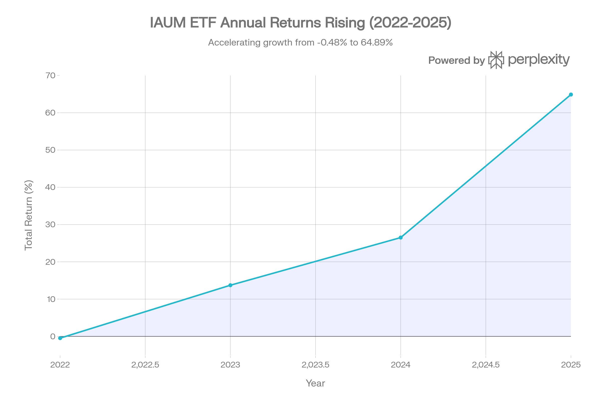
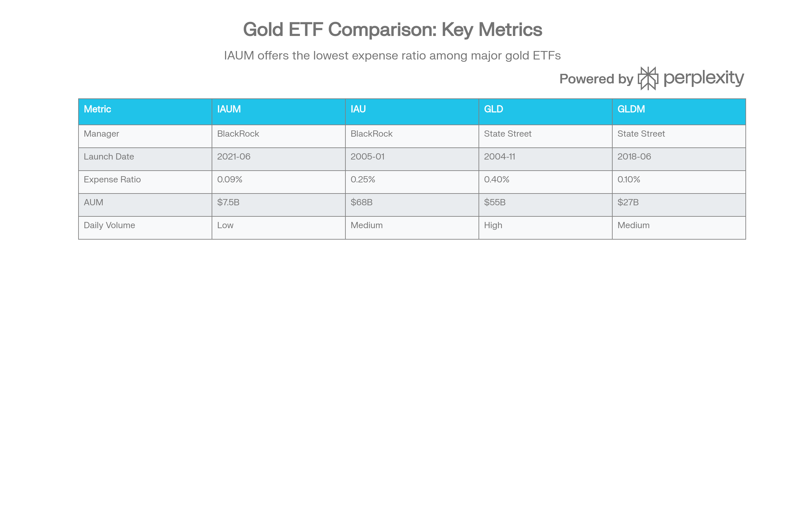

## 분류 근거

IAUM은 실물 금을 보유하는 그랜터 신탁 ETF로, 기존 `ETF/Gold` 폴더(GLD, GLDM, IAU)에 함께 분류했습니다.

## 개요

IAUM (iShares Gold Trust Micro)은 세계 최대 자산운용사 BlackRock이 2021년 6월 15일 출시한 금 실물 기반 ETF로, 기존 IAU의 저비용 버전이자 소액 투자자 친화형 대안으로 설계되었다. 업계 최저 수준인 0.09%의 운용보수를 무기로 비용에 민감한 장기 투자자들에게 최적화된 선택지로 부상했으며, 2025년 64.89%의 수익률을 기록하며 금 시장의 역사적 강세를 그대로 반영했다.[^1][^2][^3][^4][^5]

IAUM의 가장 큰 특징은 IAU 대비 0.16%포인트, GLD 대비 0.31%포인트 낮은 운용보수로, 장기 투자 시 복리 효과로 상당한 비용 절감을 제공한다는 점이다. 주당 가격도 약 50달러 수준으로 IAU(95달러)나 GLD(약 440달러)보다 낮아 소액 투자자의 접근성이 뛰어나다. 그러나 설정 3.5년이라는 짧은 운용 역사와 75억 달러 규모의 상대적으로 작은 AUM은 유동성 측면에서 일부 제약을 가져올 수 있다.[^6][^7][^8][^9][^10][^11]

금은 2026년에도 중앙은행의 지속적인 매입, 지정학적 리스크, 연준의 금리 인하 기조 등으로 온스당 5,400달러까지 상승할 가능성이 있으며, IAUM은 이러한 금 가격 상승을 최소 비용으로 추종하려는 장기 투자자에게 가장 효율적인 도구로 평가받는다.[^11][^12][^13][^14]

***

## IAUM (iShares Gold Trust Micro) 기본 정보

| 항목 | 내용 |
| :-- | :-- |
| **티커** | IAUM |
| **운용사** | BlackRock, Inc. (iShares) |
| **설정일** | 2021년 6월 15일 |
| **상장 거래소** | NYSE Arca |
| **추종 지표** | LBMA Gold Price PM (\$/ozt) |
| **운용자산(AUM)** | \$5.33B \~ \$7.59B (2026년 1월) |
| **현재가** | \~\$49.66-50.39 (2026년 1월) |
| **운용보수(Expense Ratio)** | 0.09% (업계 최저) |
| **발행 주식수** | 134.75M |
| **배당 정책** | 무배당 |
| **금 보관 방식** | Allocated (JP Morgan 뉴욕·런던 금고) |

IAUM은 런던 금 시장 협회(LBMA)가 매일 결정하는 금 현물 가격(LBMA Gold Price PM)을 추종한다. IAU와 동일한 grantor trust 구조를 사용하며, JP Morgan Chase Bank의 뉴욕과 런던 금고에 실물 금괴를 할당(allocated) 방식으로 보관한다. 할당 방식은 투자자가 특정 금괴에 대한 법적 소유권을 갖는다는 의미로, 보관 기관 파산 시에도 자산이 보호되는 안전장치다.[^1][^2][^11][^15]

IAUM의 탄생 배경은 소액 투자자와 장기 투자자의 니즈에 대응하기 위함이다. 주당 가격을 IAU의 절반 수준으로 설정하여 접근성을 높이고, 운용보수를 0.09%로 낮춰 장기 보유 시 비용 부담을 최소화했다. 이는 금 ETF 시장의 '가격 전쟁'에서 BlackRock이 State Street(GLD의 0.40%)를 압도하기 위한 전략적 상품이기도 하다.[^3][^9][^11][^16]

***

## IAUM (iShares Gold Trust Micro) 성과 분석

### 수익률 실적 (2025년 12월 31일 기준)

2025년 IAUM은 금 가격의 역사적 강세장을 반영하며 Total Return 기준 64.89%, Market Price 기준 64.27%의 수익률을 기록했다. 이는 2021년 6월 설정 이후 최고 수익률이며, 벤치마크(LBMA Gold Price PM)의 67.29% 대비 2.40%포인트 낮은 수준으로 추종오차가 발생했다.[^1]

| 기간 | Total Return (%) | Market Price (%) | Reference Benchmark (%) | Tracking Difference |
| :-- | :-- | :-- | :-- | :-- |
| **2025년 (YTD)** | 64.89 | 64.27 | 67.29 | -2.40%p |
| **1개월** | 2.78 | 2.28 | 5.15 | -2.37%p |
| **3개월** | 12.60 | 11.66 | 14.18 | -1.58%p |
| **6개월** | 31.00 | 30.31 | 32.86 | -1.86%p |
| **1년** | 64.89 | 64.27 | 67.29 | -2.40%p |
| **3년 (연환산)** | 33.37 | 33.15 | 34.07 | -0.70%p |
| **설정 후 (연환산)** | 20.14 | 20.16 | 20.61 | -0.47%p |

출처: iShares, BlackRock[^4][^1]

추종오차는 주로 0.09%의 운용보수와 금괴 보관·거래 비용에서 발생하며, IAU(0.25%)나 GLD(0.40%)보다 훨씬 작은 수준이다. 3년 연환산 기준 -0.70%포인트의 추종 차이는 매우 양호한 수준으로, 설정 후 연환산 -0.47%포인트는 운용보수 0.09%를 감안하면 효율적인 추종이라 평가할 수 있다.[^17][^18]

### 연도별 수익률 추이

IAUM ETF의 2022년부터 2025년까지 연도별 수익률 추이. 2021년 6월 설정 이후 2025년 금 가격 급등으로 64.89%의 최고 수익률 기록.

IAUM은 2021년 6월 설정 이후 금 시장의 변동성을 그대로 반영했다. 2022년 연준의 공격적 금리 인상 국면에서 -0.48%의 소폭 마이너스를 기록했으나, 2023년부터 금리 인상 속도 둔화와 함께 13.72%로 회복했다. 2024년에는 중앙은행의 금 매입 가속화와 지정학적 리스크 고조로 26.51%로 상승세가 강화되었고, 2025년에는 금값이 온스당 2,600달러에서 3,700달러 수준으로 급등하며 64.89%의 역대급 수익률을 달성했다.[^1][^5]

IAUM의 수익률은 동일 기간 경쟁 ETF들과 거의 동일하다. 2025년 기준 FGDL(Franklin Responsible Gold ETF) 44.02%, IAUM 43.89%, AAAU(Goldman Sachs Physical Gold ETF) 43.88%로 상위권을 형성했으며, IAU(43.69%)나 GLD(43.64%)보다 소폭 우수한 성과를 보였다. 이는 낮은 운용보수가 장기 누적 수익률에서 우위를 가져옴을 입증한다.[^5][^19][^18]

### 추종 효율성

IAUM의 1년 추종 오차(Tracking Error)는 13.46%로, IAU(13.80%)와 유사한 수준이다. 이는 금 가격 자체의 변동성을 반영한 수치로, ETF가 벤치마크를 정확히 추종하고 있음을 의미한다. NAV 대비 프리미엄/할인은 2026년 1월 기준 0.3%(프리미엄) 수준으로, -0.05%에서 0.3% 범위 내에서 거래되고 있어 NAV 추종이 양호하다.[^6][^2][^20]

After Tax Post-Liq. 수익률은 38.41%(1년 기준)로, Pre-Tax 64.89% 대비 약 40.7% 수준이다. 이는 미국에서 금 ETF가 수집품(collectible)으로 분류되어 장기 자본이득세 최대 28%가 부과되기 때문이다.[^1][^21][^22][^23]

***

## IAUM (iShares Gold Trust Micro) 비용 및 효율성

### 운용보수: 업계 최저 0.09%

IAUM의 가장 큰 경쟁력은 0.09%의 압도적으로 낮은 운용보수다. 이는 금 ETF 시장에서 최저 수준이며, 주요 경쟁 ETF와 비교하면 다음과 같다:[^1][^3][^5]

| ETF | 운용보수 | IAUM 대비 차이 | 연간 1,000만 원 투자 시 10년 비용 차이 |
| :-- | :-- | :-- | :-- |
| **IAUM** | 0.09% | - | - |
| **GLDM** | 0.10% | +0.01%p | 약 1만 원 |
| **IAU** | 0.25% | +0.16%p | 약 16만 원 |
| **GLD** | 0.40% | +0.31%p | 약 31만 원 |

출처: 각 운용사, 투자 분석 자료[^24][^18][^11]

장기 투자 시 이 비용 차이는 복리로 누적되어 수익률에 상당한 영향을 미친다. 예를 들어, 1억 원을 20년간 투자하고 금 가격이 연 5% 상승한다고 가정할 때, 0.16%의 비용 절감(IAU 대비)은 약 350만 원의 추가 수익으로 귀결된다. 0.31%의 절감(GLD 대비)은 약 680만 원의 차이를 만든다.

### 비용 효율성의 트레이드오프

IAUM의 낮은 운용보수는 상대적으로 작은 AUM과 낮은 유동성이라는 트레이드오프를 수반한다. AUM 75억 달러는 IAU(683억 달러)의 약 11% 수준이며, 일평균 거래량도 245만 주로 IAU(979만 주)의 25% 수준에 불과하다. 이는 대량 거래 시 비드-애스크 스프레드가 넓어지거나 슬리피지가 발생할 가능성을 높인다.[^25][^6][^7][^10][^26]

그러나 일반 개인 투자자가 수백만\~수천만 원 규모로 매매하는 경우, IAUM의 유동성은 충분하다. 2026년 1월 26일 기준 일거래량은 946만 주로, 평균을 크게 상회하며 활발한 거래가 이루어지고 있다. 시가총액 74.8억 달러는 중형주(Mid Cap) 수준으로, 청산 리스크는 전무하다.[^12][^27][^28]

### 자금 유입 동향

IAUM은 2025년 동안 폭발적인 자금 유입을 경험했다. 1년 기준 펀드 플로우는 27.9억 달러로, AUM이 2024년 말 약 45억 달러에서 2026년 1월 76억 달러로 약 69% 증가했다. 이는 투자자들이 IAUM의 비용 효율성을 인식하고 장기 투자 수단으로 선택하고 있음을 의미한다.[^6][^2][^5][^17]

***

## IAUM (iShares Gold Trust Micro) 포트폴리오 구성

### 자산 구성

IAUM은 포트폴리오의 100%를 실물 금괴로 구성한다. 보유 금괴는 런던 금 시장 협회(LBMA)의 Good Delivery 기준을 충족하는 400온스(약 12.4kg) 금괴로, 순도 99.5% 이상을 보장한다. IAU와 동일한 금괴를 보유하며, 주당 금 보유량만 IAU의 절반 수준으로 설정되었다.[^1][^2][^9][^29]

### 보관 및 관리

IAUM의 금괴는 JP Morgan Chase Bank의 뉴욕과 런던 금고에 분산 보관된다. IAU와 동일한 신탁(trust) 구조를 사용하므로, 두 ETF의 금괴는 같은 금고에 함께 보관되며 회계상으로만 구분된다. 보관 방식은 할당(allocated)으로, 각 금괴의 일련번호·무게·순도가 특정되며 iShares 웹사이트에서 일일 단위로 공개된다.[^9][^11][^15]

금괴 목록의 투명한 공개는 투자자 신뢰를 높이며, 일부 금 ETF에서 제기되는 '실제로 금을 보유하고 있는가?'라는 의구심을 불식시킨다. IAUM은 IAU와 함께 물리적 금을 대여(gold lending)하지 않으므로, 증권 대여 수익은 없지만 리스크도 최소화된다.[^30]

### 보유 종목 수

IAUM의 보유 종목은 공식적으로 2개로 표시되는데, 이는 실물 금괴와 소량의 현금성 자산(운영비 충당)을 의미한다. 실질적으로는 금 100% 단일 자산 ETF로 이해할 수 있다.[^31]

주요 금 ETF 비교. IAUM은 최저 비용(0.09%), GLD는 최고 유동성, IAU는 균형잡힌 선택.

---

## IAUM (iShares Gold Trust Micro) 리스크 분석

### 변동성 및 베타

IAUM의 연환산 표준편차(Standard Deviation)는 17.754%로, 금 가격의 변동성을 반영한다. 이는 S&P 500 지수(연 변동성 약 15-18%)와 유사한 수준이지만, 금은 주식과 낮은 상관관계를 보여 포트폴리오 전체 변동성을 낮추는 효과가 있다.[^32][^33]

베타(Beta)는 S&P 500 대비 -0.03으로, 주식 시장과 거의 무관하게 움직인다. 상관계수(Correlation)도 0.00으로, 금이 주식·채권과 독립적인 자산군임을 확인시킨다. 이는 IAUM이 포트폴리오의 체계적 위험(systemic risk)을 상쇄하는 역할을 수행함을 의미한다.[^25][^27][^34]

### 샤프비율: 위험 조정 수익률

샤프비율(Sharpe Ratio)은 자료마다 차이가 있지만, 대체로 양호한 수준을 보인다:

- **1년 기준:** 3.80, 3.43, 1.31[^32][^33][^35]
- **All Time 기준:** 1.56, 1.13, 0.94[^33][^32]

측정 방법과 기간에 따라 차이가 있지만, 1년 샤프비율이 3.43(S&P 500 대비 +2.68)이라는 것은 2025년 금 시장의 강세로 위험 대비 수익이 매우 높았음을 의미한다. All Time 기준 1.13\~1.56은 장기적으로도 위험 대비 수익이 양호함을 보여준다.[^35][^33]

샤프비율은 금의 역할이 절대 수익 추구가 아닌 포트폴리오 안정성과 인플레이션 헤지에 있으므로, 주식 시장과 직접 비교하기보다는 금이 주식·채권 하락 시 방어 역할을 수행하는지를 평가하는 것이 더 중요하다.[^34]

### 최대낙폭(MDD)

IAUM의 최대낙폭(Maximum Drawdown)은 -20.87%로, 2022년 3월 9일 시작하여 2022년 9월 26일 저점을 찍고 2023년 12월 1일 회복하기까지 437일이 소요되었다. 이는 2022년 연준의 공격적 금리 인상 국면에서 금 가격이 온스당 2,000달러에서 1,600달러까지 하락했던 시기를 반영한다.[^32][^33]

IAU의 역사적 최대낙폭 -45.1%과 비교하면, IAUM의 짧은 운용 기간은 2011\~2015년의 대규모 금 약세장을 경험하지 못했기 때문에 MDD가 상대적으로 작다. 장기 투자자는 금 가격이 30\~50% 조정받을 가능성을 염두에 두어야 한다.[^36][^37]

### 주요 리스크 요인

IAUM 투자 시 고려해야 할 주요 리스크는 다음과 같다:

**1. 유동성 리스크:** IAUM의 가장 큰 약점은 상대적으로 낮은 유동성이다. 일평균 거래량이 IAU의 25%, GLD의 5% 수준에 불과하므로, 시장 급변 시 원하는 가격에 즉각 매도하기 어려울 수 있다. 특히 수억 원 이상의 대량 거래 시 슬리피지가 발생할 가능성이 있다.[^10][^26]

**2. 짧은 운용 역사:** 설정 3.5년으로 장기 성과 검증이 부족하다. 금융위기나 대규모 금 약세장을 경험하지 못했으므로, 극단적 상황에서의 대응 능력은 미지수다.[^38][^26]

**3. 금리 리스크:** 실질금리 상승 시 무이자 자산인 금은 매력도가 감소한다. 2022년처럼 연준이 매파적으로 전환하면 금 가격과 IAUM은 하락 압력을 받는다.[^39]

**4. 달러 강세 리스크:** 금은 달러로 표시되므로, 달러 강세 시 비달러권 수요가 위축되고 금값이 하락한다.[^40][^41]

**5. 세금 리스크:** 미국에서 수집품 과세(장기 자본이득세 28%)가 적용되어 일반 주식보다 불리하다. 한국 투자자는 250만 원 초과분에 22%가 적용된다.[^21][^22][^23]

**6. 물리적 금 교환 불가:** 일반 투자자는 IAUM 주식을 실물 금으로 교환할 수 없다. 금융위기 시 물리적 금을 원하는 투자자에게는 한계다.[^42]

**7. 무배당:** 배당이 없으므로 현금흐름이 필요한 투자자에게는 부적합하다.[^43][^38]

***

## IAUM vs IAU vs GLD: 선택 가이드

금 ETF 시장에서 IAUM, IAU, GLD는 각기 다른 투자자 유형에 최적화되어 있다. 세 ETF는 모두 실물 금을 보유하며 LBMA Gold Price PM을 추종하지만, 비용·규모·유동성 측면에서 차별화된다.[^11]

### 핵심 비교

| 항목 | IAUM | IAU | GLD |
| :-- | :-- | :-- | :-- |
| **운용사** | BlackRock | BlackRock | State Street |
| **설정일** | 2021년 6월 | 2005년 1월 | 2004년 11월 |
| **운용보수** | 0.09% | 0.25% | 0.40% |
| **AUM** | \$7.5B | \$68B | \$159B |
| **일평균 거래량** | 낮음 (\~\$100-200M) | 중간 (\~\$1.9억) | 높음 (\~\$12억) |
| **주당 가격** | \~\$50 | \~\$95 | \~\$440 |
| **금 단위** | 1/200 온스 | 1/100 온스 | 1/10 온스 |
| **2025 수익률** | 64.89% | 64.60% | 64.30% (추정) |

출처: 각 운용사, 투자 분석 자료[^9][^18][^11][^44][^45]

### 비용 효율성

**IAUM > IAU > GLD** 순으로 비용 효율적이다. IAUM은 IAU 대비 연간 0.16%포인트, GLD 대비 0.31%포인트 저렴하며, 장기 투자 시 이 차이는 복리로 누적되어 수익률 격차를 만든다. 2021년 6월 이후 동일 기간 백테스팅 결과, IAUM이 가장 높은 수익률을 기록했다.[^24][^18]

### 유동성 및 규모

**GLD > IAU > IAUM** 순으로 유동성이 높다. GLD는 일평균 거래량 12억 달러로 초단기 트레이더와 대형 기관투자자에게 최적이다. IAU는 1.9억 달러로 일반 투자자에게 충분한 유동성을 제공하며, IAUM은 1\~2억 달러 수준으로 소액\~중액 투자자에게는 문제없지만 대량 거래 시에는 제약이 있다.[^10][^44]

### 주가 접근성

**IAUM > IAU > GLD** 순으로 주가가 낮아 소액 투자자의 접근성이 높다. IAUM은 50달러 수준으로 월 적립식 투자 시 1주씩 매수하기 용이하다. 단, 대부분의 미국 증권사가 단주(fractional share) 거래를 지원하므로 이 차이는 상대적으로 덜 중요해지고 있다.[^9][^26]

### 투자자 유형별 권장

| 투자자 유형 | 추천 ETF | 이유 |
| :-- | :-- | :-- |
| **장기 투자자 (5년+)** | **IAUM** | 최저 비용으로 장기 누적 수익 극대화 |
| **소액 투자자** | **IAUM** | 낮은 주가로 매수 접근성 우수 |
| **적립식 투자자** | **IAUM** | 매달 일정 금액 투자 시 효율적 |
| **일반 중장기 투자자** | **IAU** | 비용 효율성과 유동성의 균형 |
| **초단기 트레이더** | **GLD** | 최고 유동성, 좁은 스프레드 |
| **대형 기관투자자** | **GLD** | 대량 거래에 최적화 |
| **옵션 트레이더** | **GLD** | 옵션 시장 유동성 우수 |

출처: 투자 분석 및 비교 자료[^24][^11][^12][^28]

### 결론

비용에 민감한 장기 투자자(5년 이상 보유)에게는 IAUM이 최선의 선택이다. 유동성 리스크를 감수하고 연 0.16\~0.31%포인트의 비용 절감을 취하는 방식이며, 수천만 원 이하 규모의 일반 투자자에게는 IAUM의 유동성으로도 충분하다. 반면, 초단기 매매나 대량 거래를 하는 투자자는 GLD를, 중간 지점을 원하는 투자자는 IAU를 선택하는 것이 합리적이다.[^24][^10][^11][^12][^28]

***

## IAUM (iShares Gold Trust Micro) 배당 및 세금

### 배당 정책

IAUM은 배당을 지급하지 않는다. 금은 무이자 자산으로 예금이나 채권처럼 이자를 발생시키지 않으며, IAUM의 수익은 전적으로 금 가격의 상승 또는 하락에서 발생한다. 투자자는 매도 시점에 시세차익(capital gain) 또는 손실(capital loss)을 실현한다.[^6][^2][^38][^46][^47]

배당 처리 방식은 'Capitalizes'로 표시되며, 이는 수익이 배당으로 분배되지 않고 자본화(capitalized)되어 주가에 반영됨을 의미한다. 분배금 과세 처리는 'Return of Capital'로, 실제로는 분배금이 없으므로 해당사항이 없다.[^2][^21][^48][^6]

### 미국 세금 처리

미국 세법은 금을 수집품(collectible)으로 분류하며, IAUM도 IAU·GLD와 동일하게 취급된다. 이는 투자자에게 불리한 세금 구조를 초래한다.[^6][^2][^21][^48]

**1. 장기 자본이득세 (1년 이상 보유):** 일반 주식은 0\~20%의 세율이 적용되지만, IAUM은 최대 **28%**가 적용된다. 고소득자(37% 한계세율)도 주식은 20%만 내지만 IAUM은 28%를 낸다.[^21][^48]

**2. 단기 자본이득세 (1년 미만 보유):** 일반 소득세율(10\~39.60%)이 적용되며, 이는 주식과 동일하다.[^21]

**3. K-1 발행:** IAUM은 grantor trust 구조지만 K-1(파트너십 과세 보고서)을 발행하지 않으므로, 일반 1099-B 양식으로 세금 신고가 간편하다.[^21]

After Tax Post-Liq. 수익률이 Pre-Tax 대비 약 59%(1년 기준: 38.41% / 64.89%)로 낮은 것은 이러한 높은 세율 때문이다.[^1]

### 한국 투자자 세금 처리

한국 거주 투자자가 IAUM에 투자할 경우, 해외 주식 양도소득세가 적용된다.[^49][^50]

**1. 양도소득세:** 연간 해외 주식 양도차익 250만 원까지는 비과세이며, 초과분에 대해 22%(지방소득세 포함)의 세율이 적용된다. 예를 들어, IAUM 매도로 연간 1,000만 원의 차익이 발생하면 (1,000만 원 - 250만 원) × 22% = 165만 원의 세금을 다음해 5월 종합소득세 신고 시 납부한다.[^51][^49]

**2. 국내 ETF 대비 세금 비교:** 국내 상장 금 ETF는 매매차익에 15.4%의 배당소득세가 부과된다. 따라서 연간 수익 250만 원 이하는 미국 ETF(IAUM)가 유리하고, 250만 원 초과 시에는 15.4% vs 22%로 국내 ETF가 세금 측면에서 유리하다.[^52][^49]

**3. 절세 계좌 활용:** IRP(개인형 퇴직연금), 연금저축펀드에서 IAUM을 매수하면 운용 기간 중 세금이 과세되지 않으며, 연금 수령 시 3.3\~5.5%의 낮은 세율로 과세된다. 장기 투자 시 절세 계좌 활용이 가장 효율적이다.[^51][^49]

**4. ISA 계좌:** ISA(개인종합자산관리계좌)에서 해외 주식(IAUM 포함)을 거래할 수 있으며, 연 200만 원(서민형 400만 원)까지 비과세 혜택을 받는다. ISA는 절세 측면에서 가장 우선적으로 활용해야 할 계좌다.[^53][^51]

***

## IAUM (iShares Gold Trust Micro) 투자 전망

### 2026년 금 시장 전망

IAUM의 수익률은 금 가격에 직결되므로, 2026년 금 시장 전망이 핵심이다. 주요 투자은행과 분석 기관들은 2026년 금 가격에 대해 낙관적 전망을 유지한다.[^13][^14][^40][^54]

골드만삭스는 2026년 말 금 가격 목표를 5,400달러로 상향 조정했으며, 이는 현재 수준(5,000달러) 대비 약 8% 추가 상승 여력을 시사한다. JP Morgan은 5,055달러, Bank of America는 5,000달러, UBP는 4분기 5,200달러를 전망하며, 대부분 기관이 4,000\~5,400달러 범위를 제시한다.[^14][^54][^55][^13]

### 상승 동력

**1. 중앙은행 금 매입 지속:** 골드만삭스는 2026년 중앙은행이 월 60톤, 연 720톤의 금을 매입할 것으로 예상한다. 이는 '탈달러화' 트렌드의 일환으로, 신흥시장 중앙은행들이 외환보유액 다변화를 추구하기 때문이다.[^13][^56]

**2. 금 ETF 자금 유입 가속:** 2025년 279톤의 ETF 유입은 2026년에도 이어질 전망이다. 연준의 추가 금리 인하(50bp 예상)와 실질금리 하락은 금 ETF의 매력을 높인다.[^57][^13]

**3. 지정학적 불확실성:** 트럼프 2기 행정부의 관세 정책, 중동 긴장, 우크라이나 전쟁 등은 2026년에도 지속될 것으로 보이며, 안전자산 수요를 지지한다.[^55][^57]

**4. 미국 재정 지속 가능성 우려:** 연방 부채 증가는 장기적으로 달러 약세 압력을 가하며, 금의 대체 통화 역할을 강화한다.[^56][^55]

### 하방 리스크

금 가격 하락을 초래할 수 있는 주요 시나리오는 다음과 같다:

**1. 연준의 매파적 전환:** 인플레이션 재가속 시 금리 인상 재개 가능성.[^41]

**2. 지정학적 긴장 완화:** 우크라이나 전쟁 종전, 중동 평화 협상 진전 시 안전자산 수요 감소.[^40][^58]

**3. 달러 강세:** 미국 경제 강한 성장과 높은 금리 유지 시.[^58][^41]

**4. 투기적 과매수 청산:** 금 선물 시장의 비상업적 포지션이 높아 차익 실현 매물 출회 가능성.[^57]

### IAUM 전망

IAUM은 금 가격을 0.09%의 최소 비용으로 추종하므로, 금값이 5,400달러까지 상승하면 IAUM은 현재 대비 약 8% 추가 상승할 가능성이 있다. Financhill의 AI 모델은 향후 52주간 IAUM이 평균 31.1% 상승할 것으로 예측하며(과거 4년 평균 기준), 역사적 정확도 100%를 기록했다고 주장한다.[^59]

기술적 분석 측면에서 IAUM은 2026년 1월 현재 '적극 매수(Strong Buy)' 신호를 보인다. 이동평균선 14개 중 14개가 매수, 오실레이터 11개 중 3개가 매수·7개가 중립·1개가 매도 신호를 나타내며, 전체 요약은 Strong Buy다. RSI(86.67)는 과열 구간이지만 중립으로 판단되며, Momentum과 MACD는 매수 신호를 유지한다.[^60]

StockTraders Daily의 AI 모델은 IAUM에 대해 "강한 심리가 모든 기간에서 과체중(Overweight) 편향을 지지"하지만, "명확한 가격 포지셔닝 신호 없음" 및 "장기 지지선 부재로 하방 리스크 증가"를 경고한다. 이는 단기적으로 조정 가능성을 시사한다.[^61]

***

## IAUM (iShares Gold Trust Micro) 투자 고려사항

### 강점

**1. 업계 최저 운용보수 (0.09%):** IAUM의 가장 큰 경쟁력은 압도적으로 낮은 비용이다. 장기 투자 시 복리 효과로 IAU·GLD 대비 상당한 추가 수익을 제공한다.[^24][^18][^11][^12]

**2. 소액 투자자 친화적:** 주당 약 50달러로 IAU(95달러)·GLD(약 440달러)보다 낮아 접근성이 뛰어나다. 월 적립식 투자 시 효율적이다.[^9][^26]

**3. BlackRock의 신뢰성:** 세계 최대 자산운용사 BlackRock이 운용하며, IAU와 동일한 금고·관리 체계를 사용한다.[^1][^2][^9]

**4. 투명한 금괴 보관:** 할당(allocated) 방식으로 보관되며, 금괴 목록이 일일 공개된다. 금 대여를 하지 않아 리스크가 최소화된다.[^15][^30]

**5. 급격한 자금 유입:** 2025년 27.9억 달러의 자금 유입은 투자자들의 신뢰를 반영한다.[^6][^2]

**6. 포트폴리오 다각화:** 베타 -0.03, 상관계수 0.00으로 주식·채권과 독립적으로 움직여 위험 분산 효과가 있다.[^27]

**7. 인플레이션 헤지:** 금은 장기적으로 인플레이션을 상회하는 수익률을 제공하며 구매력 보존 수단이다.[^39][^46]

### 약점

**1. 낮은 유동성:** IAUM의 가장 큰 단점은 상대적으로 작은 거래량이다. 일평균 245만 주는 IAU의 25%, GLD의 5% 수준에 불과하며, 대량 거래 시 슬리피지 발생 가능성이 있다. 급변하는 시장에서 즉각 청산하기 어려울 수 있다.[^10][^26]

**2. 짧은 운용 역사 (3.5년):** 금융위기나 대규모 금 약세장을 경험하지 못해 극단적 상황에서의 대응 능력이 검증되지 않았다.[^38][^26]

**3. 작은 AUM (\$7.5B):** IAU(\$68B)나 GLD(\$159B) 대비 규모가 작아 유동성과 안정성 측면에서 열위다.[^6][^10]

**4. 무배당:** 배당을 지급하지 않으므로 현금흐름이 필요한 투자자에게는 부적합하다.[^43][^38]

**5. 높은 세율:** 미국에서 수집품 과세(장기 자본이득세 28%), 한국에서는 250만 원 초과 시 22%가 적용되어 일반 주식보다 불리하다.[^22][^23][^49]

**6. 실물 금 교환 불가:** 일반 투자자는 IAUM 주식을 실물 금으로 교환할 수 없다.[^42]

**7. 금리 리스크:** 실질금리 상승 시 금 가격 하락 위험이 있다.[^39][^41]

### 리스크

**1. 시장 리스크:** 금 가격 하락 시 IAUM도 동반 하락한다. 최대낙폭 -20.87%를 경험했으며, 장기적으로는 -30\~50% 조정 가능성을 염두에 두어야 한다.[^32][^33]

**2. 유동성 리스크:** 시장 패닉 시 원하는 가격에 매도하지 못할 가능성이 있다. 특히 수억 원 이상 대량 거래 시 제약이 크다.[^10][^26]

**3. 환율 리스크:** 한국 투자자는 달러-원 환율 변동이 수익률에 영향을 미친다. 금값 상승해도 원화 강세 시 원화 기준 수익률은 감소한다.[^62][^63]

**4. 보관 리스크:** JP Morgan 금고에 의존하므로 극단적 상황(금고 사고, 보관 기관 파산)에서 리스크가 존재한다. 할당 방식으로 제한적이지만 완전히 배제할 수는 없다.[^15][^64]

**5. 규제 리스크:** 세법 변경(수집품 과세 강화), ETF 규제 변경 등이 IAUM의 매력도를 낮출 수 있다.

**6. 기회비용:** 금은 장기적으로 주식보다 낮은 수익률을 제공해왔다. IAUM 설정 후 연환산 수익률 20.14%는 양호하지만, S&P 500은 같은 기간 더 높은 수익을 제공했을 가능성이 있다.[^1]

### 투자자 적합성

**적합한 투자자:**

- 장기 투자자 (5년 이상)로 비용 최소화 우선
- 소액 투자자 (수백만\~수천만 원 규모)
- 적립식 투자자 (매달 일정 금액 투자)
- 포트폴리오 다각화 및 인플레이션 헤지 목적
- IRP·ISA 계좌를 통해 절세하며 투자하는 한국 투자자
- Buy & Hold 전략 추구자

**부적합한 투자자:**

- 초단기 트레이더 (유동성 필요 → GLD 선택)
- 대형 기관투자자 (대량 거래 필요 → GLD 선택)
- 배당 수익 추구자
- 즉각적 유동성이 중요한 투자자
- 세금 최적화를 최우선하는 투자자
- 실물 금 소유를 원하는 투자자

***

## IAUM (iShares Gold Trust Micro) 투자 전략 및 권장사항

### 포트폴리오 내 적정 비중

IAUM을 포함한 금 자산은 일반적으로 포트폴리오의 5\~10%를 차지하는 것이 권장된다. 보수적 투자자나 은퇴 임박 투자자는 10\~15%까지 비중을 높일 수 있으며, 공격적 투자자는 5% 이하로 유지할 수 있다. 레이 달리오의 올웨더 포트폴리오는 금을 7.5% 비중으로 포함한다.[^65][^47]

과도한 금 비중은 기회비용(주식 대비 낮은 장기 수익률)을 초래하므로 권장되지 않는다. 반면, 금을 전혀 보유하지 않으면 인플레이션과 시장 급락 시 포트폴리오가 취약해진다.

### 매수 시점 및 전략

**1. 적립식 투자 (Dollar-Cost Averaging):** IAUM의 낮은 주가(50달러)는 적립식 투자에 최적화되어 있다. 매달 일정 금액(예: 50만 원)을 투자하면 평균 매수단가를 낮추고 시장 타이밍 리스크를 줄일 수 있다. ISA·IRP 계좌에서 매달 IAUM을 매수하는 전략이 효과적이다.[^9][^51][^26][^49]

**2. 리밸런싱:** 1년에 1\~2회 포트폴리오를 리밸런싱하여 금의 비중을 목표 비중(예: 10%)으로 조정한다. 2025년처럼 금 가격이 급등하여 비중이 15%로 늘어나면 일부를 매도하고, 금 가격 하락으로 5%로 줄어들면 추가 매수하는 방식이다.

**3. 거시경제 신호 활용:** 실질금리 하락 국면, 달러 약세 국면, 지정학적 리스크 고조 시점에 금 비중을 늘린다. 연준이 금리 인하 사이클에 진입하면 금 투자 비중을 확대하는 전략이다.[^34][^57]

**4. 세금 최적화:** 한국 투자자는 ISA 계좌(연 200-400만 원 비과세)를 최우선 활용하고, IRP·연금저축(연금 수령 시 3.3\~5.5% 과세)을 다음으로 활용한다. 일반 계좌는 연간 양도차익 250만 원 이하로 관리하여 비과세 혜택을 극대화한다.[^51][^49][^53]

### 2026년 투자 권장사항

2026년 1월 현재 금값은 온스당 5,000달러를 돌파하며 역사적 고점을 경신하고 있다. 주요 투자은행들은 연말 5,400달러까지 추가 상승 여력이 있다고 전망하지만, 단기 조정 가능성도 제기된다.[^61][^13][^14][^41][^66]

**보수적 접근 (추천):**

현재 고점 수준이므로, 일시에 대량 매수하기보다는 3\~6개월에 걸쳐 분할 매수하는 전략이 안전하다. 예를 들어, 투자 예정액의 1/3을 즉시 매수하고, 금값이 4,400\~4,600달러로 조정되면 추가 1/3을 매수하며, 나머지는 시장 상황을 보고 결정하는 방식이다. 기존 IAUM 보유자는 일부 차익 실현을 고려할 수 있으나, 장기 투자자라면 목표 비중을 유지하는 것이 바람직하다.

**공격적 접근:**

2026년 상반기 중 금값이 추가 상승할 것으로 확신한다면, 현재 수준에서 목표 비중까지 즉시 매수할 수 있다. 골드만삭스의 5,400달러 목표가 실현되면 약 8\~10%의 추가 상승 여력이 있다. 단, 조정 시 -10\~15% 하락을 감내해야 한다.

**장기 투자자:**

금 가격의 단기 변동에 일희일비하지 말고, 포트폴리오 내 5\~10% 비중을 꾸준히 유지한다. 2026년 중 조정이 발생하면 리밸런싱을 통해 비중을 회복하고, 급등 시에는 일부 차익 실현으로 비중을 조정한다. 금의 역할은 절대 수익 추구가 아닌 포트폴리오 안정성 제고와 인플레이션 헤지임을 명심한다.[^34]

### IAUM vs IAU: 어떤 것을 선택할 것인가?

**IAUM을 선택해야 하는 경우:**

- 5년 이상 장기 보유 예정 (비용 효율성 극대화)
- 투자 금액 수천만 원 이하 (유동성 충분)
- 적립식 투자 (낮은 주가로 매달 매수 용이)
- 비용 최소화가 최우선 목표

**IAU를 선택해야 하는 경우:**

- 투자 금액 수억 원 이상 (높은 유동성 필요)
- 유동성 리스크를 최소화하고 싶음
- 보다 긴 운용 역사(20년)를 선호
- IAUM과 IAU 사이에서 고민된다면 → 균형잡힌 IAU 선택

**결론:**

대부분의 일반 개인 투자자(투자 금액 수천만 원 이하, 5년 이상 장기 보유)에게는 IAUM이 최선의 선택이다. 유동성 리스크를 감수하고 연 0.16%포인트의 비용 절감을 취하는 것이 장기적으로 유리하다. 단, 수억 원 이상의 대량 거래를 계획하거나 즉각적 유동성이 중요하다면 IAU 또는 GLD를 선택하는 것이 합리적이다.[^24][^11][^12][^26][^28]

***

## 결론

IAUM (iShares Gold Trust Micro)은 BlackRock이 2021년 출시한 금 실물 ETF로, 업계 최저 운용보수 0.09%와 소액 투자자 친화적인 낮은 주가를 무기로 장기 투자자에게 최적화된 선택지로 부상했다. 2025년 64.89%의 수익률을 기록하며 금 시장의 역사적 강세를 그대로 반영했고, 27.9억 달러의 자금 유입은 투자자들의 신뢰를 입증한다.[^1][^6][^2][^3][^5]

IAUM의 가장 큰 강점은 비용 효율성이다. IAU 대비 연 0.16%포인트, GLD 대비 0.31%포인트 저렴한 운용보수는 장기 투자 시 복리 효과로 상당한 추가 수익을 제공한다. 2021년 6월 이후 동일 기간 백테스팅에서 IAUM이 가장 높은 수익률을 기록한 것이 이를 증명한다.[^24][^18][^11]

그러나 3.5년의 짧은 운용 역사와 75억 달러의 상대적으로 작은 AUM은 유동성 리스크를 수반한다. 일평균 거래량이 IAU의 25% 수준에 불과하므로, 수억 원 이상의 대량 거래나 초단기 매매를 계획하는 투자자에게는 부적합하다. 그러나 수천만 원 이하 규모의 일반 투자자에게는 IAUM의 유동성으로도 충분하며, 비용 절감 효과가 유동성 리스크를 상회한다.[^10][^12][^26][^28]

2026년 금 시장은 중앙은행의 지속적인 금 매입(연 720톤 예상), 금 ETF 자금 유입 가속화, 지정학적 리스크 고조, 연준 금리 인하 기조 등으로 온스당 5,400달러까지 상승할 가능성이 있다. IAUM은 이러한 금 가격 상승을 최소 비용(0.09%)으로 추종하려는 장기 투자자에게 가장 효율적인 도구다.[^11][^12][^13][^14][^54]

**투자 권장 요약:**

- **즉시 매수 (공격적):** 금 가격 추가 상승 확신, 단기 조정 감수 가능
- **분할 매수 (보수적, 추천):** 3\~6개월에 걸쳐 분할 매수, 현 고점에서 리스크 관리
- **보유 지속 (장기):** 기존 보유자는 목표 비중 유지, 리밸런싱 활용
- **적립식 투자 (최적):** ISA·IRP 계좌에서 매달 일정 금액 투자, 세금 최적화

**핵심 투자 포인트:**

1. **업계 최저 비용 (0.09%):** 장기 투자 시 IAU·GLD 대비 상당한 추가 수익 제공
2. **소액 투자자 최적:** 주당 50달러로 적립식 투자에 이상적
3. **유동성 리스크 vs 비용 절감:** 수천만 원 이하 투자자는 비용 절감 효과가 유동성 리스크 상회
4. **2026년 상승 잠재력:** 골드만삭스 5,400달러 목표, 약 8\~10% 추가 상승 여력
5. **단기 조정 가능성:** 현 고점(5,000달러+)에서 4,400\~4,600달러로 조정 가능성 염두
6. **장기 관점 필수:** 금은 단기 변동성이 크므로 5년 이상 장기 투자 관점 필요
7. **세금 최적화:** ISA(비과세) → IRP(3.3\~5.5%) → 일반 계좌(250만 원 이하 비과세) 순으로 활용

IAUM은 2026년 혼돈의 시장 환경에서 포트폴리오의 방어막 역할을 수행할 것으로 기대되며, 비용에 민감한 장기 투자자의 자산배분 전략에서 핵심 구성 요소로 자리매김할 것이다. IAU와의 선택에서 고민된다면, 투자 금액이 수천만 원 이하이고 5년 이상 보유할 계획이라면 IAUM을, 수억 원 이상이거나 유동성을 우선한다면 IAU를 선택하는 것이 합리적이다.[^12][^26][^28][^24][^11]

***

**주요 출처**

1. iShares / BlackRock 공식 펙트시트 및 웹사이트[^2][^4][^67][^1]
2. 금 ETF 비교 분석 (포트폴리오 분석 사이트)[^9][^18][^24][^11]
3. Goldman Sachs, JP Morgan 금 시장 전망[^13][^14][^54]
4. 투자 분석 플랫폼 (ETFdb, PortfoliosLab, Seeking Alpha, Financhill)[^21][^20][^33][^59]
5. 국내 금융 매체 및 투자 블로그[^5][^52][^26][^28][^49][^10]

**면책 조항**

본 보고서는 정보 제공 목적으로 작성되었으며, 투자 권유나 매매 추천이 아닙니다. 투자 결정은 투자자 본인의 판단과 책임 하에 이루어져야 하며, 투자 손실 발생 시 작성자는 책임을 지지 않습니다. IAUM은 설정 3.5년의 짧은 역사를 가지며, 유동성 리스크가 존재합니다. 금 가격은 변동성이 크며, 과거 성과가 미래 수익을 보장하지 않습니다. 투자 전 전문가와 상담하시기 바랍니다.

[^1]: https://www.ishares.com/us/products/306979/ishares-gold-trust-micro

[^2]: https://www.tradingview.com/symbols/AMEX-IAUM/

[^3]: https://www.nasdaq.com/articles/3-best-gold-etf-picks-2026

[^4]: https://www.blackrock.com/us/individual/products/306979/ishares-gold-trust-micro

[^5]: https://www.ebc.com/kr/forex/184205.html

[^6]: https://kr.tradingview.com/symbols/AMEX-IAUM/analysis/

[^7]: https://robinhood.com/stocks/IAUM

[^8]: https://www.poems.com.sg/etf-screener/NYSE-IAUM/

[^9]: https://www.a-ha.io/questions/4db90d6059f58002b9077d0d33c59123

[^10]: https://moneyproblem.tistory.com/19

[^11]: https://www.oreateai.com/blog/navigating-the-gold-etf-landscape-a-closer-look-at-iau-iaum-gld-and-gldm/9f2b796d16ba5f09e3880f5ac3db8363

[^12]: https://www.reddit.com/r/SwissPersonalFinance/comments/1o1617z/opinion_on_iaum_gold_etf/

[^13]: https://www.reuters.com/world/india/goldman-sachs-raises-2026-end-gold-price-forecast-by-500-5400oz-2026-01-22/

[^14]: https://www.reuters.com/business/finance/goldman-sachs-raises-2026-end-gold-price-forecast-5400oz-2026-01-22/

[^15]: https://seekingalpha.com/article/4799679-iau-understanding-the-structure-and-suitability-of-this-gold-etf

[^16]: https://totalwealthresearch.com/gld-iau-better-gold-etf-all-time-highs-btnt/

[^17]: https://file.alphasquare.co.kr/media/pdfs/market-report/_ETF20251212%EC%9C%A0%EC%95%88%ED%83%80%EC%A6%9D%EA%B6%8C.

[^18]: https://blog.naver.com/robot_a/223078399122

[^19]: https://community.rememberapp.co.kr/post/176532

[^20]: https://seekingalpha.com/symbol/IAUM/risk

[^21]: https://etfdb.com/etf/IAUM/

[^22]: https://www.thetaxadviser.com/issues/2019/nov/taxation-collectibles/

[^23]: https://www.cnbc.com/2025/12/03/gold-etf-taxes.html

[^24]: https://blog.naver.com/lkll1026/222454819359

[^25]: https://kr.investing.com/etfs/iaum

[^26]: https://dnublog.co.kr/2025/10/18/미국-금-etf-종목-gld-iau-gldm-iaum-비교·추천-2025/

[^27]: https://marketchameleon.com/Overview/IAUM/Summary/

[^28]: https://steer.tistory.com/350

[^29]: https://etfinsider.co/blog/where-does-iau-store-its-gold

[^30]: https://www.gold.org/goldhub/gold-focus/2025/02/physically-backed-gold-etfs-do-not-lend-their-gold

[^31]: https://finominal.com/fund-analyzer-analyze/1/US/IAUM

[^32]: https://www.myplaniq.com/invest/quote/IAUM/

[^33]: https://portfolioslab.com/symbol/IAUM

[^34]: https://www.linkedin.com/pulse/ishares-gold-trust-iau-veritasgrouplimited-qvs8f

[^35]: https://unusualwhales.com/stock/IAUM/risk

[^36]: https://www.composer.trade/etf/IAU

[^37]: http://www.lazyportfolioetf.com/etf/ishares-gold-trust-iau/

[^38]: https://ourfreedom.tistory.com/entry/IAUM-알아보기미국금ETF미국금투자금투자

[^39]: https://forwe.tistory.com/114

[^40]: https://www.investopedia.com/gold-prices-record-highs-2026-outlook-11871125

[^41]: https://www.xtb.com/int/market-analysis/news-and-research/gold-correction-risk-rising-goldman-lifts-2026-target

[^42]: https://noblegoldinvestments.com/learn/blog/gold-etf-advantages-disadvantages/

[^43]: https://kin.naver.com/qna/dirs/40102/docs/490979798?qb=6riI7Yis7J6Q&enc=utf8

[^44]: https://seethroughworld.tistory.com/140

[^45]: https://portfolioslab.com/tools/stock-comparison/GLD/iau

[^46]: https://paper-castle.tistory.com/entry/IAU-ETF에-대한-설명-대표적인-안전자산-금-실물에-투자하는-ETF에-대한-모든-것IAU-vs-UGL-vs-SHNY

[^47]: https://www.beechhurstcapital.com/blog/the-ishares-gold-etf-iau-explained

[^48]: https://www.ainvest.com/etfs/ARCA-IAUM/analysis/

[^49]: https://blog.naver.com/wonjae9/223031942823

[^50]: https://blog.naver.com/kimwh253967/224046667719?fromRss=true&trackingCode=rss

[^51]: https://gentle-lee.tistory.com/entry/미국-금-ETF-종목-추천-세금-절세-팁

[^52]: https://blog.naver.com/ksi0428/223926363390?fromRss=true&trackingCode=rss

[^53]: https://story.pay.naver.com/content/1694

[^54]: https://www.physicalgold.com/insights/gold-price-predictions-for-2026/

[^55]: https://www.ubp.com/en/news-insights/newsroom/gold-s-bull-market-is-set-to-continue-into-2026-investment-outlook-2026

[^56]: https://discoveryalert.com.au/gold-accumulation-2025-central-bank-strategies/

[^57]: https://deriv.com/ko/blog/posts/gold-prices-sept-2025-fed-rate-cuts-etf-demand

[^58]: https://www.gold.org/goldhub/research/gold-outlook-2026

[^59]: https://financhill.com/stock-forecast/iaum-stock-prediction

[^60]: https://www.tradingview.com/symbols/AMEX-IAUM/technicals/

[^61]: https://news.stocktradersdaily.com/news_release/81/Understanding_the_Setup:_IAUM_and_Scalable_Risk_012326063001_1769167801.html

[^62]: https://www.a-ha.io/questions/49dd5bd2b6694a718709b436986af0d8

[^63]: https://www.stashaway.sg/r/how-to-buy-gold-etfs-in-singapore

[^64]: https://goldsilver.com/industry-news/article/gold-etf-physical-gold-hidden-risks-most-investors-miss/

[^65]: https://redwolfsion.com/entry/ULTY-ETF에-투자하지-않는-이유-89-배당률의-숨겨진-함정과-대안

[^66]: https://www.cnbc.com/2026/01/26/gold-record-surges-past-new-5000-record.html

[^67]: https://www.ishares.com/us/literature/fact-sheet/iaum-ishares-gold-trust-micro-fund-fact-sheet-en-us.pdf

