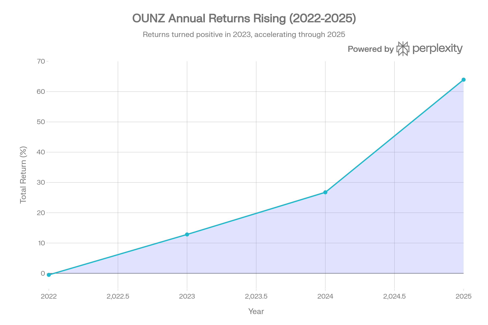
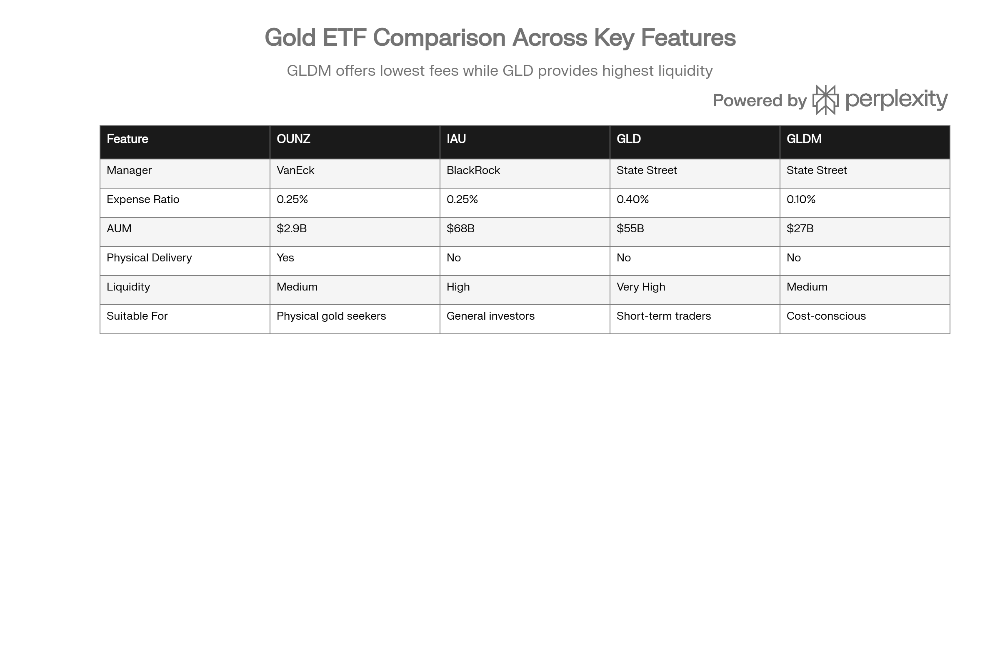

## 분류 근거

OUNZ 역시 실물 금을 보유하는 신탁 ETF(실물 인출 옵션 추가)로, 같은 `ETF/Gold` 폴더로 분류했습니다.

## 개요

OUNZ (VanEck Merk Gold Trust)는 VanEck과 Merk Investments가 2014년 5월 16일 출시한 금 실물 기반 ETF로, 금 투자 시장에서 독보적인 특징을 가진다. 바로 **개인 투자자가 ETF 주식을 실물 금으로 교환할 수 있는 유일한 상품**이라는 점이다. 이는 일반적인 금 ETF가 제공하지 않는 '실물 인출(physical delivery)' 옵션을 특허받은 프로세스로 구현한 것으로, 금융 위기나 시스템 리스크 상황에서 물리적 금을 보유하고자 하는 투자자에게 강력한 안전장치를 제공한다.[^1][^2][^3][^4]

OUNZ의 운용보수는 0.25%로 IAU와 동일하며, GLD(0.40%)보다 0.15%포인트 저렴하지만 IAUM(0.09%)보다는 0.16%포인트 비싸다. 그러나 실물 금 인출이라는 독특한 기능을 감안하면, 이 추가 비용은 '금융 시스템 외부로 자산을 이전할 수 있는 옵션 프리미엄'으로 해석할 수 있다. 2025년 OUNZ는 금 가격의 역사적 강세를 그대로 반영하며 63.95%의 수익률을 기록했으며, 2026년에도 금 시장의 낙관적 전망과 함께 추가 상승 잠재력을 보유하고 있다.[^2][^5][^1]

OUNZ의 철학은 명확하다. 신탁(Trust)이 London Good Delivery Bars를 할당(allocated) 방식으로 100% 보유하고, 파생상품을 일절 사용하지 않으며, 현금 보유를 최소화하여 신용 리스크를 제거한다. 투자자는 신탁의 지분을 pro-rata로 소유하므로, 본질적으로 금괴의 일부를 직접 소유하는 구조다. 이러한 투명하고 단순한 구조는 금융 위기 시 counterparty risk를 우려하는 보수적 투자자에게 이상적이다.[^3]

***

## OUNZ (VanEck Merk Gold Trust) 기본 정보

| 항목 | 내용 |
| :-- | :-- |
| **티커** | OUNZ |
| **운용사** | VanEck (Van Eck Associates Corporation) |
| **원 개발자** | Merk Investments |
| **설정일** | 2014년 5월 16일 |
| **상장 거래소** | NYSE Arca |
| **추종 지표** | LBMA Gold Price PM (\$/ozt) |
| **운용자산(AUM)** | \$2.91B (2026년 1월 23일) |
| **현재가** | \~\$48.65 (2026년 1월 26일) |
| **NAV** | \$48.59 (2026년 1월 26일) |
| **운용보수(Expense Ratio)** | 0.25% |
| **발행 주식수** | 61,198,927 주 |
| **보유 금** | 588,934.410 온스 |
| **주당 금 보유량** | 0.010 온스 (약 0.311g) |
| **배당 정책** | 무배당 |
| **실물 금 인출** | 가능 (최소 1온스) |

출처: VanEck, merkgold.com[^1][^2][^3]

OUNZ는 런던 금 시장 협회(LBMA)가 매일 오후 결정하는 금 현물 가격(LBMA Gold Price PM)을 추종한다. 주당 금 보유량은 0.010 온스로 IAU, GLDM과 동일하며, GLD(0.100 온스)의 10분의 1 수준이다. 이는 소액 투자자의 접근성을 높이는 동시에, 실물 금 인출 시 필요한 주식 수를 줄여 유연성을 제공한다.[^6][^1]

OUNZ의 가장 큰 차별점은 **실물 금 인출(physical delivery) 옵션**이다. 일반적인 금 ETF(IAU, GLD, GLDM)는 기관 투자자(Authorized Participants)만 대량으로 금괴를 교환할 수 있지만, OUNZ는 개인 투자자도 최소 1온스 금화부터 시작하여 원하는 형태의 금으로 교환할 수 있다. 이는 금융 시스템 리스크를 우려하는 투자자에게 궁극적인 안전장치(ultimate safety net)를 제공한다.[^2][^3][^7][^8][^1]

***

## OUNZ (VanEck Merk Gold Trust) 성과 분석

### 수익률 실적 (2026년 1월 23일 기준)

2025년 OUNZ는 금 가격의 역사적 강세를 그대로 반영하며 63.95%의 수익률을 기록했다. 이는 IAU의 64.60%, GLD의 약 64%와 거의 동일한 수준으로, LBMA Gold Price를 정확히 추종했음을 입증한다. 2026년에도 금값이 5,000달러를 돌파하며 YTD 15.51%의 강력한 성과를 이어가고 있다.[^1][^2][^5][^9]

| 기간 | Total Return (%) | 비고 |
| :-- | :-- | :-- |
| **YTD (2026년 1월 23일)** | 15.51 | 금값 \$5,000 돌파 |
| **1개월** | 0.41 | 단기 조정 |
| **3개월** | -0.22 | 변동성 |
| **1년** | 41.01 | 강력한 상승 |
| **3년 (누적)** | 24.30 | 연평균 약 7.5% |
| **5년 (누적)** | 11.61 | 연평균 약 2.2% |

출처: ETFdb, VanEck[^10][^1]

3개월 수익률이 -0.22%로 마이너스를 기록한 것은 2025년 10월\~12월 금값이 단기 조정을 받은 시기를 반영한다. 그러나 1년 기준 41.01%, YTD 15.51%는 중장기 추세가 여전히 강력한 상승세임을 보여준다. 5년 누적 11.61%는 2020\~2023년 금값이 횡보했던 시기가 포함되어 상대적으로 낮지만, 2024\~2025년 금값 급등으로 장기 투자자도 양호한 수익을 실현하고 있다.[^10]

### 연도별 수익률 추이

OUNZ의 2022년부터 2025년까지 연도별 수익률. 금 가격 상승세를 반영하며 2025년 63.95%의 강력한 수익률 기록.

OUNZ의 연도별 수익률은 금 가격의 거시경제 환경 의존성을 명확히 보여준다. 2022년 -0.51%는 연준의 공격적 금리 인상으로 인한 금값 조정을 반영하며, 실질 금리 상승이 무이자 자산인 금의 매력을 감소시켰다. 2023년에는 금리 인상 속도 둔화와 함께 12.83%로 회복했고, 2024년에는 중앙은행의 금 매입 가속화와 지정학적 리스크 고조로 26.75%의 강력한 상승을 기록했다.[^5]

2025년 63.95%는 OUNZ 설정 이후 최고 수익률이다. 금값이 온스당 2,600달러에서 3,700달러 수준으로 급등하는 동안, OUNZ는 0.25%의 낮은 운용보수 덕분에 추종오차를 최소화하며 금 가격 상승을 거의 완벽하게 반영했다. 이는 IAU(64.60%)와 거의 동일한 수준으로, 동일한 운용보수(0.25%)를 가진 두 ETF의 추종 효율성이 유사함을 입증한다.[^5]

### 추종 효율성

OUNZ의 NAV는 LBMA Gold Price PM을 기준으로 산정되며, 프리미엄/할인은 2026년 1월 26일 기준 -0.90%로 NAV 대비 약간 할인된 상태로 거래되고 있다. 이는 시장 수요와 공급의 일시적 불균형을 반영하지만, 장기적으로는 Authorized Participants의 차익거래로 NAV에 수렴한다.[^3]

OUNZ의 추종오차는 주로 0.25%의 운용보수와 금괴 보관·거래 비용에서 발생한다. 5년 누적 수익률 11.61%는 금 가격 상승률에서 연평균 약 0.25\~0.30%를 차감한 수준으로, 추종 효율이 양호하다고 평가할 수 있다. IAU와 동일한 운용보수를 가지므로, 장기 성과도 IAU와 거의 일치할 것으로 예상된다.

***

## OUNZ (VanEck Merk Gold Trust) 실물 금 인출의 독보적 장점

### 실물 금 인출 프로세스: 7단계

OUNZ의 가장 큰 차별화 요소는 개인 투자자가 ETF 주식을 실물 금으로 교환할 수 있다는 점이다. 이는 Merk Investments가 특허받은 프로세스로, 간단한 신청서만으로 여권이나 은행 명세서 없이도 금을 인출할 수 있다.[^1][^2][^3][^7][^4]

**인출 절차 (7단계):**

**1단계: OUNZ 주식 보유**
인출하려는 금에 해당하는 OUNZ 주식을 보유해야 한다. 최소 인출 단위는 1 트로이 온스 금화이며, 이는 약 100\~110주에 해당한다(금값에 따라 변동).[^7]

**2단계: 인출 가능 금량 계산**
merkgold.com의 계산기를 사용하여 보유 주식으로 인출할 수 있는 금량을 계산한다. 예를 들어, 1,000주를 보유하고 있다면 약 9.623 온스의 금을 인출할 수 있다.[^3][^8][^7]

**3단계: 인출 신청서 작성**
온라인 신청서를 작성하며, 금의 형태(금화, 금괴, London Bars)를 선택한다. 선택 가능한 금 형태는 다음과 같다:[^8][^7]

- 1온스 금화: American Gold Eagle, Canadian Gold Maple Leaf, Austrian Philharmonic 등
- 소형 금괴: 10온스, 100그램 등
- London Good Delivery Bars: 350\~430온스 (약 11\~13kg)

부분 주식이 발생할 경우 현금으로 정산된다. 예를 들어, 1온스 금화 인출에 100.5주가 필요하면 101주를 제출하고 0.5주는 현금으로 받는다.[^7]

**4단계: 처리 수수료 송금**
Exchange Fee(교환 수수료)를 선불로 송금한다. 수수료는 금의 형태에 따라 다르며, London Bars는 낮고 금화·소형 금괴는 변환 비용이 포함되어 높다. 미국 본토 48개 주로의 배송비(Delivery Fee)는 무료다.[^11][^8][^7]

**5단계: 신청서 제출**
온라인, 팩스, 또는 우편으로 신청서를 제출하여 사전 승인을 받는다. 승인 후 Delivery Applicant Share Submission Form을 받게 된다.[^7]

**6단계: Share Submission Day (주식 제출일)**
증권사를 통해 OUNZ 주식을 제출하고, Delivery Applicant Share Submission Form을 Trustee에게 팩스로 전송한다. Trustee가 주식을 수령하면 당일 늦게 Merk에 통보된다.[^8][^7]

**7단계: 금 수령 (4영업일 후)**
Merk은 다음날 귀금속 딜러와 장외 거래(OTC)로 신탁의 London Bars를 투자자가 요청한 금화·금괴로 교환한다. 교환 완료(통상 2영업일)后 UPS 등 택배사가 다음날 배송(Next-day delivery)하여, 투자자는 주식 제출 후 **4영업일째 금을 수령**한다.[^11][^8]

배송은 USPS, FedEx, UPS 등 일반 택배(주거지 배송 가능) 또는 장갑차 운송(비주거지만 가능)으로 이루어지며, 전액 보험이 적용된다.[^8][^11]

### 인출 가능 금 형태

OUNZ에서 인출할 수 있는 금은 다음 세 가지 범주로 나뉜다:[^3][^8]

**1. London Good Delivery Bars (400온스 금괴):**

- 무게: 350\~430 온스 (약 11\~13kg)
- 순도: 99.5% 이상
- LBMA Good Delivery 기준 충족
- 신탁이 보유한 원래 형태
- Exchange Fee가 가장 낮음

**2. 1온스 금화:**

- American Gold Eagle (순도 91.67%, 미국 조폐국)
- Canadian Gold Maple Leaf (순도 99.99%, 캐나다 조폐국)
- Austrian Philharmonic (순도 99.99%, 오스트리아 조폐국)
- 기타 주요 국가 공식 금화
- 개인 투자자에게 가장 인기 있는 형태
- Exchange Fee 중간

**3. 소형 금괴:**

- 10온스, 5온스, 1온스 금괴
- 100그램, 50그램 등
- 순도 99.5% 이상
- Exchange Fee 상대적으로 높음 (변환 비용 포함)

신탁은 London Bars를 금화·소형 금괴로 변환하기 위해 귀금속 딜러와 장외 거래를 수행하며, 이 과정에서 발생하는 비용이 Exchange Fee에 반영된다. 투자자는 항상 London Bars를 요청할 수 있지만, 시장 상황에 따라 Merk이 다른 형태의 금 공급을 제한할 수 있다.[^8][^11]

### 세금 효율성: 인출은 과세 대상 아님

OUNZ 실물 금 인출의 가장 큰 장점 중 하나는 **인출 자체가 과세 대상이 아니라는 점**이다. 이는 투자자가 이미 OUNZ 주식을 통해 금을 소유하고 있으며, 단지 소유물을 물리적으로 수령하는 것일 뿐이므로 '매매'나 '교환'으로 간주되지 않기 때문이다.[^1][^2]

**일반 금 구매 vs OUNZ 인출 세금 비교:**

| 항목 | 일반 금 딜러 구매 | OUNZ 인출 |
| :-- | :-- | :-- |
| **구매 시 판매세** | 주정부에 따라 부과 (0\~10%) | 없음 (이미 소유) |
| **인출/배송 시 과세** | N/A | 없음 |
| **매도 시 자본이득세** | 적용 (최대 28%) | 적용 (최대 28%) |

출처: VanEck, IRS[^2][^10][^1]

예를 들어, 캘리포니아 주민이 금 딜러에서 1온스 금화를 \$5,000에 구매하면 약 7.25%의 판매세(\$362.50)가 부과될 수 있다. 그러나 OUNZ에서 인출하면 판매세가 없으므로, 즉시 7.25%의 비용을 절감한다. 이는 큰 금액일수록 절약 효과가 커지며, 10온스 인출 시 \$3,625, 100온스 인출 시 \$36,250의 절감이 가능하다.

다만, OUNZ 주식의 시세차익에 대해서는 여전히 자본이득세가 부과된다. 미국 세법은 금을 수집품(collectible)으로 분류하므로, 장기 자본이득세(1년 이상 보유)는 최대 28%, 단기 자본이득세(1년 미만)는 최대 39.60%가 적용된다. 인출 후 금을 매도할 때도 동일한 세율이 적용되지만, 인출 자체는 과세 대상이 아니므로 세금 납부를 미래로 연기할 수 있다.[^10]

### 실물 금 인출의 전략적 가치

OUNZ의 실물 금 인출 옵션은 다음과 같은 상황에서 전략적 가치를 발휘한다:

**1. 금융 위기 대비:**
금융 시스템 붕괴나 은행 파산 시, ETF 주식은 거래소가 폐쇄되면 청산이 불가능할 수 있다. 그러나 OUNZ를 미리 실물 금으로 전환해두면, 금융 시스템 외부에서 자산을 안전하게 보호할 수 있다.[^1][^3]

**2. 은퇴 자금 인출:**
IRA(개인 은퇴 계좌)에서 OUNZ를 보유하다가 은퇴 시 실물 금으로 인출하면, 은퇴 후 현금 흐름 없이도 자산을 물리적으로 보유할 수 있다. 특히 인플레이션 우려가 클 때 유용하다.[^1]

**3. 선물·증여:**
금화는 결혼 선물, 자녀 증여 등에 활용하기 좋다. OUNZ에서 American Gold Eagle 금화를 인출하여 선물하면, 실물 금의 상징성과 함께 세금 효율성을 누릴 수 있다.

**4. 지정학적 리스크 대비:**
전쟁, 정치적 혼란 등으로 자산을 물리적으로 이동해야 할 때, 실물 금은 현금이나 증권보다 휴대성과 보편적 가치 인정이 뛰어나다.

**5. 실물 금 수집:**
금 수집가나 보석 제조업자는 OUNZ를 통해 판매세 없이 금을 확보할 수 있으며, 이는 비용 절감 측면에서 유리하다.

***

## OUNZ (VanEck Merk Gold Trust) 비용 및 효율성

### 운용보수: IAU와 동일한 0.25%

OUNZ의 운용보수는 0.25%로, IAU와 동일하며 금 ETF 시장에서 중간 수준이다. GLD(0.40%)보다 0.15%포인트 저렴하지만, 업계 최저인 IAUM(0.09%)보다는 0.16%포인트 비싸다.[^1][^2][^12]

| ETF | 운용보수 | OUNZ 대비 차이 | 1,000만 원 투자 시 연간 비용 |
| :-- | :-- | :-- | :-- |
| **OUNZ** | 0.25% | - | 2.5만 원 |
| **IAU** | 0.25% | 0.00%p | 2.5만 원 (동일) |
| **IAUM** | 0.09% | -0.16%p | 0.9만 원 (1.6만 원 절감) |
| **GLDM** | 0.10% | -0.15%p | 1.0만 원 (1.5만 원 절감) |
| **GLD** | 0.40% | +0.15%p | 4.0만 원 (1.5만 원 추가) |

출처: 각 운용사[^13][^9][^14][^1]

장기 투자 시 IAUM이나 GLDM의 낮은 운용보수는 복리로 누적되어 상당한 비용 절감을 가져온다. 예를 들어, 1억 원을 20년간 투자하고 금 가격이 연 5% 상승한다고 가정할 때, OUNZ(0.25%) 대비 IAUM(0.09%)의 0.16%포인트 절감은 약 350만 원의 추가 수익으로 귀결된다.

그러나 OUNZ는 실물 금 인출이라는 독특한 기능을 제공하므로, 0.16%포인트의 추가 비용은 '금융 시스템 외부로 자산을 이전할 수 있는 옵션 프리미엄'으로 합리화할 수 있다. 투자자가 실물 금 인출을 고려하지 않는다면 IAUM이나 IAU가 더 나은 선택이지만, 금융 위기 대비나 실물 금 소유를 원한다면 OUNZ의 추가 비용은 충분히 가치가 있다.

### 유동성: 중간 수준

OUNZ의 일평균 거래량은 약 678,000\~2,144,300주로, 일거래금액은 약 \$30M\~100M 수준이다. 이는 GLD(\$2B+), IAU(약 \$190M, [IAU 자체 포스트](/blog/etf/gold/iau/iau-ishares-gold-trust) 기준)보다 현저히 낮지만, 일반 개인 투자자가 수백만\~수천만 원 규모로 매매하기에는 충분하다.[^10][^15]

| ETF | 일평균 거래량 (주) | 일거래금액 (USD) | 유동성 등급 |
| :-- | :-- | :-- | :-- |
| **GLD** | 6,000,000+ | \$2B+ | 매우 높음 |
| **IAU** | 15,000,000+ | \$190M (IAU 자체 포스트 기준) | 높음 |
| **GLDM** | 2,000,000+ | \$100M+ | 중간 |
| **OUNZ** | 1,500,000 (추정) | \$70M (추정) | 중간 |
| **IAUM** | 2,500,000+ | \$100M+ | 중간 |

출처: 각 ETF 거래 데이터[^15][^16][^17][^10]

OUNZ의 상대적으로 낮은 유동성은 비드-애스크 스프레드가 GLD보다 약간 넓을 수 있음을 의미한다. 그러나 NAV 대비 프리미엄/할인이 -0.90%로 합리적 범위 내에 있으며, Authorized Participants의 차익거래가 작동하고 있음을 보여준다. 대형 기관 투자자가 수억\~수십억 원 규모로 거래할 때는 GLD나 IAU가 더 유리하지만, 개인 투자자에게는 OUNZ의 유동성이 문제되지 않는다.[^3]

***

## OUNZ (VanEck Merk Gold Trust) 포트폴리오 구성

### 자산 배분: 금 100%

OUNZ는 포트폴리오의 99.9%+를 실물 금괴로 구성한다. 신탁은 London Good Delivery Bars를 할당(allocated) 방식으로 보관하며, 최대 430 Fine Ounces(London Bar 최대 무게)만 비할당(unallocated) 형태로 보유할 수 있다. 비할당 금은 실물 금 인출 신청 처리, Authorized Participants와의 거래, 신탁 운용 비용 지불 등에 사용된다.[^3][^8][^18]

**OUNZ 자산 구성 (2026년 1월 26일):**

| 자산 유형 | 비중 | 수량 | 설명 |
| :-- | :-- | :-- | :-- |
| **London Good Delivery Bars (할당)** | \~99.9% | 588,934 온스 | 개별 식별 금괴 |
| **비할당 금** | <0.1% | 최대 430 온스 | 거래·인출·비용 지불용 |
| **현금** | 거의 0% | 최소 | 임시 보유만 |
| **파생상품** | 0% | 없음 | 신용 리스크 제거 |

출처: VanEck, merkgold.com[^8][^3]

OUNZ의 현금 보유를 최소화하는 전략은 독특하다. 일반적으로 ETF는 운용 비용을 현금으로 지불하지만, OUNZ는 운용사(Merk/VanEck)가 비용을 선지급한 후 신탁이 주식을 발행하여 보상하는 구조를 사용한다. 이는 신탁 자산의 거의 100%를 금으로 유지하여 투자자가 순수하게 금에만 노출되도록 보장한다.[^3]

### 보관 방식: 할당 금(Allocated Gold)

OUNZ의 금괴는 할당(allocated) 방식으로 보관되며, 이는 금 ETF 업계 최고 수준의 안전성을 제공한다. 할당 방식은 다음과 같은 특징을 갖는다:[^3]

**1. 개별 식별 가능:**
신탁이 보유한 각 금괴는 고유 번호, 총 무게, 순도(fineness), Fine 무게(순금 무게)로 식별된다. 이 정보는 merkgold.com에 일일 공개되어 투자자가 신탁이 정확히 어떤 금괴를 보유하는지 확인할 수 있다.[^3]

**2. 신탁 명의 보관:**
금괴는 신탁의 이름으로 Trust Allocated Account에 보관되며, 보관 기관(Custodian)의 다른 자산과 분리(segregated)된다. 이는 보관 기관이 파산하더라도 신탁의 금괴는 보호되며, 채권자가 압류할 수 없음을 의미한다.[^3]

**3. Pro-rata 소유권:**
투자자는 OUNZ 주식을 통해 신탁의 지분을 pro-rata로 소유하며, 이는 곧 금괴의 일부를 직접 소유하는 것과 동일하다. 예를 들어, 전체 발행 주식의 0.01%를 보유하면 신탁이 보유한 금의 0.01%를 소유하는 셈이다.[^3]

**4. 실물 이동으로만 입출고:**
금괴의 입출고는 반드시 실물 이동(physical movement)으로 이루어진다. 장부상 기재만으로는 불가능하며, 이는 금의 실재성(physicality)을 보장한다.[^3]

**5. 정기 감사:**
신탁의 금 보유량은 독립 감사기관의 정기 감사를 받으며, 이는 투명성과 신뢰성을 높인다.[^3]

### 비할당 금 최소화 원칙

OUNZ는 비할당(unallocated) 금을 최대 430 Fine Ounces로 제한한다. 비할당 금은 보관 기관의 금고에 있지만 개별 식별되지 않은 금으로, 신용 리스크(보관 기관 파산 시 손실 가능)가 존재한다. OUNZ는 이 리스크를 최소화하기 위해 비할당 금을 다음 용도로만 사용하며, 매일 영업 종료 시 430온스 이하를 유지한다:[^3][^8]

- 실물 금 인출 신청 처리
- Authorized Participants와의 바스켓 거래
- London Bars를 금화·소형 금괴로 변환
- 신탁 운용 비용 지불 (운용사가 선지급하지 않은 경우)

이는 대부분의 금 ETF가 비할당 금을 더 많이 보유할 수 있는 것과 대조적이며, OUNZ의 보수적이고 투자자 친화적 설계를 보여준다.

***

## OUNZ (VanEck Merk Gold Trust) vs 주요 금 ETF 비교

주요 금 ETF 비교. OUNZ는 유일하게 실물 금 인출 가능한 ETF로 차별화.

OUNZ를 IAU, GLD, GLDM과 비교하면 각 ETF의 강점과 타겟 투자자가 명확해진다.

### OUNZ vs IAU: 동일한 비용, 실물 인출 옵션 추가

IAU와 OUNZ는 운용보수 0.25%로 동일하지만, OUNZ는 실물 금 인출 옵션을 제공한다는 점에서 차별화된다. 두 ETF 모두 주당 0.010 온스의 금을 보유하며, 할당 방식으로 금괴를 보관한다.[^1][^9]

**OUNZ vs IAU 선택 기준:**

- **IAU 선택:** 실물 금 인출 불필요, 최고 유동성 선호, BlackRock 선호
- **OUNZ 선택:** 실물 금 인출 가능성 있음, 금융 위기 대비, VanEck/Merk 선호

IAU는 AUM \$68B로 OUNZ(\$2.9B)의 23배 이상 크며, 거래량도 훨씬 많아 비드-애스크 스프레드가 좁다. 그러나 일반 개인 투자자에게는 OUNZ의 유동성도 충분하므로, 실물 금 인출을 고려한다면 OUNZ가 우월하다.[^9][^1]

### OUNZ vs GLD: 낮은 비용, 실물 인출 가능

GLD는 세계 최대 금 ETF로 압도적인 유동성(일거래금액 \$2B+)을 자랑하지만, 운용보수 0.40%는 OUNZ(0.25%)보다 0.15%포인트 비싸다. 장기 투자 시 이 비용 차이는 누적되어 상당한 수익 차이를 만든다.[^13][^19]

**OUNZ vs GLD 선택 기준:**

- **GLD 선택:** 초단기 트레이딩(일일\~주간), 대량 거래(\$수백만 이상), 최소 스프레드 필요
- **OUNZ 선택:** 중장기 투자(수개월\~수년), 비용 절감, 실물 금 인출

GLD는 단기 트레이더나 기관 투자자에게 적합하지만, 개인 투자자가 장기 보유한다면 OUNZ의 낮은 운용보수와 실물 인출 옵션이 더 유리하다.

### OUNZ vs GLDM: 높은 비용, 실물 인출 옵션

GLDM은 State Street가 2018년 출시한 저비용 금 ETF로, 운용보수 0.10%는 OUNZ(0.25%)보다 0.15%포인트 저렴하다. 주당 금 보유량도 0.010 온스로 OUNZ와 동일하며, 소액 투자자 친화적이다.[^13][^19]

**OUNZ vs GLDM 선택 기준:**

- **GLDM 선택:** 비용 최우선, 장기 적립식 투자, 실물 금 불필요
- **OUNZ 선택:** 실물 금 인출 가능성, 금융 위기 대비

GLDM의 0.15%포인트 낮은 비용은 20년 장기 투자 시 약 3% 이상의 추가 수익으로 이어진다. 따라서 실물 금 인출을 전혀 고려하지 않는다면 GLDM이 더 합리적이다. 그러나 실물 금 인출 가능성이 조금이라도 있다면, OUNZ의 추가 0.15% 비용은 충분히 지불할 가치가 있는 '옵션 프리미엄'이다.

### OUNZ vs IAUM: 높은 비용, 실물 인출 옵션

IAUM은 2021년 출시된 업계 최저 비용 금 ETF로, 운용보수 0.09%는 OUNZ(0.25%)의 3분의 1 수준이다. 비용 측면에서는 IAUM이 압도적으로 유리하지만, 실물 금 인출 옵션이 없다.[^14][^20]

**OUNZ vs IAUM 선택 기준:**

- **IAUM 선택:** 비용 절대 우선, 장기 투자(10년+), 실물 금 완전 불필요
- **OUNZ 선택:** 실물 금 인출 가능성, 금융 시스템 리스크 우려

IAUM의 0.16%포인트 낮은 비용은 30년 장기 투자 시 약 5% 이상의 추가 수익을 가져온다. 비용에 극도로 민감한 장기 투자자는 IAUM을 선택해야 하지만, 금융 위기나 시스템 리스크에 대비하고자 한다면 OUNZ의 실물 인출 옵션은 대체 불가능한 가치다.

***

## OUNZ (VanEck Merk Gold Trust) 배당 및 세금

### 배당 정책: 무배당

OUNZ는 배당을 지급하지 않는다. 금은 본질적으로 무이자 자산이므로, 금 ETF는 이자 수익이나 배당을 창출할 수 없다. 일부 금 ETF(IAU, GLDM)가 소액의 배당을 지급하는 것처럼 보이지만, 이는 실제로는 Return of Capital(자본 반환)으로 투자자의 원금 일부를 돌려주는 것이며 진정한 배당이 아니다.[^10][^12]

OUNZ의 수익은 전적으로 금 가격 시세차익에서 발생하므로, 현금 흐름을 필요로 하는 투자자(은퇴자, 배당 투자자)에게는 부적합하다. 금 투자는 안전자산·인플레이션 헤지·포트폴리오 분산화를 목적으로 하며, 배당 수익을 기대해서는 안 된다.

### 미국 세금 처리: 수집품으로 분류

미국 세법은 금(실물 금, 금 ETF)을 수집품(collectible)으로 분류하므로, OUNZ의 시세차익에 대해 일반 주식보다 불리한 세율이 적용된다.[^10][^19]

**OUNZ 세금 구조:**

| 보유 기간 | 세율 | 비고 |
| :-- | :-- | :-- |
| **1년 이상 (장기)** | 최대 28% | 일반 주식(20%)보다 높음 |
| **1년 미만 (단기)** | 최대 39.60% | 일반 소득세율 37% + 추가 세금 |
| **분배금** | Return of Capital | 실제로는 분배금 없음 |
| **K-1 발행** | No | 세금 신고 간편 |

출처: ETFdb, IRS[^19][^10]

장기 자본이득세 28%는 일반 주식의 20%보다 8%포인트 높으며, 이는 고소득자에게 상당한 세금 부담이다. 예를 들어, OUNZ를 1년 이상 보유하여 \$100,000의 시세차익을 실현하면 \$28,000의 세금을 납부해야 하지만, 일반 주식이라면 \$20,000로 \$8,000을 절감할 수 있다.

단기 자본이득세 39.60%는 더욱 가혹하다. 1년 미만 보유 시 \$100,000 차익에 대해 \$39,600의 세금을 납부해야 하므로, 실질 수익은 \$60,400로 줄어든다. 이는 OUNZ를 단기 트레이딩 목적으로 사용하는 것이 세금 측면에서 매우 불리함을 의미한다.

### 실물 금 인출의 세금 효율성

OUNZ의 가장 큰 세금 혜택은 **실물 금 인출이 과세 대상이 아니라는 점**이다. 투자자가 OUNZ 주식을 실물 금으로 교환할 때, IRS는 이를 '매매'나 '교환'으로 보지 않고 단순히 '이미 소유한 자산의 물리적 수령'으로 간주한다. 따라서 인출 시점에는 자본이득세가 발생하지 않으며, 실물 금을 나중에 매도할 때까지 세금 납부를 연기할 수 있다.[^1][^2]

**세금 효율성 예시:**

투자자가 OUNZ를 \$30,000에 매수하여 \$50,000로 상승했다고 가정하자. 시세차익은 \$20,000이다.

**시나리오 1: OUNZ 주식을 매도 (일반적 방법)**

- 매도 금액: \$50,000
- 자본이득: \$20,000
- 세금 (28%, 장기): \$5,600
- 세후 수령액: \$44,400

**시나리오 2: OUNZ를 실물 금으로 인출**

- 인출 시 과세: \$0 (과세 대상 아님)
- 보유 금: \$50,000 상당 실물 금
- 세금 납부: 나중에 금 매도 시까지 연기

시나리오 2는 세금 납부를 미래로 연기하므로, 그 동안 \$5,600을 투자하거나 사용할 수 있다. 금을 영구 보유하거나 상속한다면 사실상 자본이득세를 회피할 수 있다(미국 세법의 Step-up Basis 규정 적용 가능).

### 한국 투자자 세금 처리

한국 거주 투자자가 OUNZ에 투자할 경우, 해외 주식 양도소득세가 적용된다. 연간 250만 원까지는 비과세이며, 초과분에 대해 22%(지방소득세 포함)의 세율이 적용된다.[^21][^22]

실물 금 인출 시 한국 세법에서도 인출 자체는 과세 대상이 아니지만, 금을 한국으로 반입할 때 관세청 신고가 필요하며 일정 금액 이상 시 관세가 부과될 수 있다. 또한 실물 금을 나중에 국내에서 매도할 때는 부가가치세(10%)가 부과될 수 있으므로, 세무 전문가와 상담이 필요하다.

***

## OUNZ (VanEck Merk Gold Trust) 투자 전략 및 활용

### 장기 투자 전략: Buy & Hold

OUNZ는 금 가격의 장기 상승을 추종하는 Buy & Hold 전략에 가장 적합하다. 금은 역사적으로 인플레이션 헤지, 통화 가치 하락 방어, 지정학적 리스크 대비 자산으로 기능해왔으며, 장기적으로 구매력을 유지하는 특성이 있다.

**장기 투자 시나리오:**

**1. 인플레이션 헤지:**
2020년대 들어 전 세계 정부의 재정 지출 확대와 중앙은행의 통화 공급 증가로 인플레이션 우려가 고조되고 있다. 금은 명목 화폐 가치 하락 시 구매력을 유지하므로, OUNZ를 포트폴리오의 5\~15% 배분하여 인플레이션 리스크를 헤지할 수 있다.

**2. 포트폴리오 분산:**
금은 주식·채권과 낮은 상관관계를 갖는다. 주식 시장이 폭락할 때 금은 안전자산으로 급등하는 경향이 있으며(예: 2008년 금융위기, 2020년 코로나), OUNZ를 보유하면 포트폴리오 변동성을 낮출 수 있다.

**3. 은퇴 자금:**
IRA, 401(k) 등 은퇴 계좌에서 OUNZ를 보유하면, 은퇴 시 실물 금으로 인출하여 물리적 자산을 확보할 수 있다. 이는 은퇴 후 금융 시스템 리스크를 우려하는 투자자에게 심리적 안정감을 제공한다.

### 실물 금 인출 전략: 금융 위기 대비

OUNZ의 가장 독특한 활용법은 금융 위기 대비용 실물 금 확보다. 투자자는 OUNZ를 평시에 보유하다가, 다음과 같은 상황에서 실물 금으로 전환할 수 있다:

**실물 금 인출 타이밍:**

**1. 금융 시스템 불안:**
은행 파산, 금융 위기, 국가 채무 위기 등으로 금융 시스템이 불안정할 때, OUNZ를 실물 금으로 전환하여 시스템 외부에 자산을 보호한다.

**2. 거래소 폐쇄 우려:**
전쟁, 테러, 자연재해 등으로 증권거래소가 폐쇄될 가능성이 있을 때, 미리 실물 금을 확보하여 거래 불능 리스크를 회피한다.

**3. 통화 가치 급락:**
초인플레이션, 정부의 통화 개혁 등으로 법정 화폐 가치가 급락할 때, 실물 금은 보편적 가치를 유지하므로 자산을 보호할 수 있다.

**4. 은퇴 시점:**
은퇴하여 더 이상 주식 시장에 노출되고 싶지 않을 때, OUNZ를 실물 금으로 전환하여 물리적 자산으로 보유한다.

### 포트폴리오 배분 전략

OUNZ는 포트폴리오의 5\~15% 배분이 적절하다. 이는 금이 안전자산이지만 무이자 자산이므로, 과도한 배분은 장기 수익률을 저하시킬 수 있기 때문이다.

**보수적 포트폴리오 (60세 이상, 은퇴자):**

- 주식: 30%
- 채권: 40%
- **금(OUNZ)**: 15%
- 현금: 15%

**균형 포트폴리오 (40\~60세, 직장인):**

- 주식: 50%
- 채권: 30%
- **금(OUNZ)**: 10%
- 현금: 10%

**공격적 포트폴리오 (20\~40세, 젊은 투자자):**

- 주식: 70%
- 채권: 15%
- **금(OUNZ)**: 5%
- 현금: 10%

OUNZ의 배분 비율은 투자자의 나이, 위험 감내력, 금융 위기 우려 정도에 따라 조정한다. 일반적으로 나이가 많을수록, 보수적일수록, 금융 시스템을 불신할수록 금 배분 비율을 높인다.

### 리밸런싱 전략

OUNZ를 포함한 포트폴리오는 연 1\~2회 리밸런싱하여 목표 배분 비율을 유지해야 한다. 금 가격이 급등하여 OUNZ 비중이 15%에서 25%로 증가했다면, 일부를 매도하여 주식·채권에 재배분한다. 반대로 금 가격이 하락하여 5%로 줄어들었다면, 주식·채권 일부를 매도하여 OUNZ를 매수한다.

리밸런싱은 '저가 매수, 고가 매도(Buy Low, Sell High)' 원칙을 자동으로 구현하며, 장기 수익률을 향상시킨다.

***

## OUNZ (VanEck Merk Gold Trust) 2026년 투자 전망

### 금 시장 전망: 낙관론 우세

2026년 금 시장은 주요 투자은행들의 낙관적 전망이 우세하다. 골드만삭스는 금 가격 목표를 5,400달러로 상향 조정했으며, JP Morgan은 5,055달러(2026년 Q4), Bank of America는 상단 5,000달러를 전망한다. 이는 현재 금값(5,000달러 수준) 대비 약 0\~8% 추가 상승 여력을 시사한다.[^23][^24][^25]

**금 가격 상승 동력:**

**1. 중앙은행 금 매입 지속:**
골드만삭스는 2026년 중앙은행이 월 60\~70톤, 연 720\~840톤의 금을 매입할 것으로 예상한다. 이는 탈달러화 트렌드의 일환으로, 중국·러시아·인도·터키 등 신흥시장 중앙은행들이 외환보유액을 다변화하기 위해 금을 선호하기 때문이다.[^23]

**2. 연준 금리 인하:**
골드만삭스는 2026년 연준이 50bp 추가 금리 인하를 단행할 것으로 전망한다. 금리 인하는 실질 금리(명목 금리 - 인플레이션)를 낮추어 무이자 자산인 금의 상대적 매력을 높인다.[^23]

**3. 지정학적 리스크:**
우크라이나 전쟁, 중동 분쟁, 미중 갈등 등 지정학적 리스크는 안전자산 수요를 지속시킨다. 투자자들은 불확실성이 클 때 금으로 자산을 이동하는 경향이 있다.[^24][^25]

**4. 달러 약세:**
연준의 금리 인하와 미국 재정적자 확대는 달러 약세를 초래할 수 있으며, 달러 표시 자산인 금은 달러 약세 시 가격이 상승하는 역관계를 갖는다.[^25][^23]

**5. 인플레이션 우려:**
2026년에도 인플레이션 우려가 완전히 해소되지 않을 것으로 예상되며, 금은 인플레이션 헤지 수단으로 수요가 지속될 것이다.[^24][^25]

### OUNZ 전망: 금 가격 추종

OUNZ는 금 가격을 정확히 추종하므로, 금값이 5,400달러에 도달하면 OUNZ도 현재 수준(\$48.65) 대비 약 8% 상승하여 \$52\~53 수준에 도달할 것으로 예상된다. 반대로 금값이 4,000달러로 조정받으면 OUNZ는 약 20% 하락하여 \$38\~39 수준으로 하락할 수 있다.

**OUNZ 2026년 시나리오:**

| 시나리오 | 금 가격 | OUNZ 예상가 | 현재 대비 | 확률 |
| :-- | :-- | :-- | :-- | :-- |
| **낙관** | \$5,400 | \$52\~53 | +8% | 40% |
| **기본** | \$4,800\~5,200 | \$47\~51 | -3\~+5% | 50% |
| **비관** | \$4,000\~4,500 | \$39\~44 | -10\~-20% | 10% |

출처: 주요 투자은행 전망 종합[^23][^24][^25]

기본 시나리오는 금값이 \$4,800\~5,200 범위에서 박스권 등락하는 것으로, OUNZ는 현재 수준에서 ±5% 범위로 변동할 것으로 예상된다. 이는 2026년이 '금 가격 공고화(consolidation)' 시기가 될 가능성을 시사한다.

### 투자 권장사항

**2026년 OUNZ 투자 전략:**

**1. 장기 보유 지속 (추천, 보수적):**
OUNZ를 이미 보유한 투자자는 장기 보유를 지속하되, 포트폴리오 비중이 15%를 초과하면 일부 익절하여 리밸런싱한다. 금 시장의 구조적 상승 트렌드는 여전히 유효하므로, 단기 조정에 흔들리지 말고 보유한다.

**2. 단기 조정 시 매수 (추천, 공격적):**
금값이 \$4,400\~4,600으로 조정받으면 OUNZ를 추가 매수하여 평균 단가를 낮춘다. 이는 장기 투자자에게 저가 매수 기회를 제공한다.

**3. 실물 금 인출 검토:**
금융 시스템 불안이나 지정학적 리스크가 고조될 경우, OUNZ의 일부를 실물 금으로 전환하여 시스템 외부에 자산을 확보한다. 특히 은퇴를 앞둔 투자자는 실물 금 보유를 검토할 시점이다.

**4. 포트폴리오 리밸런싱:**
금 가격 급등으로 OUNZ 비중이 과도하게 증가했다면, 일부를 매도하여 주식·채권에 재배분한다. 목표 배분 비율(5\~15%)을 유지하는 것이 중요하다.

**5. 단기 트레이딩 지양:**
OUNZ는 장기 자본이득세 28%로 불리하므로, 1년 미만 단기 트레이딩은 세금 측면에서 비효율적이다. 최소 1년 이상 보유하여 장기 세율을 적용받는 것이 유리하다.

***

## OUNZ (VanEck Merk Gold Trust) 투자 고려사항

### 강점

**1. 유일한 실물 금 인출 ETF:**
OUNZ는 개인 투자자가 ETF 주식을 실물 금으로 교환할 수 있는 유일한 상품이다. 이는 금융 위기나 시스템 리스크 상황에서 대체 불가능한 안전장치를 제공한다.[^1][^2][^3][^7]

**2. 특허받은 간편한 인출 프로세스:**
여권이나 은행 명세서 없이 간단한 신청서만으로 금을 인출할 수 있으며, 주식 제출 후 4영업일 만에 수령한다. 이는 경쟁 제품 대비 월등한 편의성이다.[^8][^11][^4]

**3. 세금 효율적 인출:**
인출 자체는 과세 대상이 아니므로, 자본이득세 납부를 미래로 연기할 수 있다. 이는 판매세를 절감하고 세금 계획의 유연성을 높인다.[^2][^1]

**4. IAU와 동일한 낮은 운용보수:**
0.25%는 IAU와 동일하며 GLD(0.40%)보다 저렴하다. 실물 인출 옵션을 감안하면 매우 합리적인 비용이다.[^1][^2]

**5. 할당 금 100% 보유:**
최대 430온스를 제외하고 모든 금을 할당 방식으로 보관하여 신용 리스크를 최소화한다. 보관 기관 파산 시에도 금괴는 보호된다.[^3]

**6. 파생상품 없음:**
선물, 스왑, 옵션 등을 일절 사용하지 않아 counterparty risk가 없다. 이는 금융 위기 시 안전성을 높인다.[^3]

**7. 투명성:**
일일 금괴 목록(고유 번호, 무게, 순도)을 merkgold.com에 공개하여 투자자가 신탁의 보유 금을 정확히 확인할 수 있다.[^3]

**8. 은퇴 계좌 적격:**
IRA, 401(k) 등 은퇴 계좌에서 보유 가능하며, 은퇴 시 실물 금으로 인출하여 물리적 자산을 확보할 수 있다.[^1]

### 약점

**1. 낮은 유동성:**
일거래량이 IAU, GLD보다 현저히 낮아, 대량 거래 시 비드-애스크 스프레드가 넓어질 수 있다. 기관 투자자에게는 불리하다.[^10][^15]

**2. 작은 AUM:**
\$2.9B는 IAU(\$68B), GLD(\$159B) 대비 작으며, 규모의 경제 측면에서 불리하다. 청산 리스크는 없지만, 성장 여력이 제한적이다.[^1][^13][^9]

**3. 높은 비용 vs IAUM/GLDM:**
IAUM(0.09%), GLDM(0.10%) 대비 0.15\~0.16%포인트 비싸, 장기 투자 시 비용 차이가 누적된다. 실물 인출을 고려하지 않는다면 비용 측면에서 불리하다.[^13][^14][^1]

**4. 실물 인출의 복잡성:**
대부분의 일반 투자자는 실물 금 인출을 필요로 하지 않으며, 인출 프로세스가 생소하고 번거로울 수 있다. Exchange Fee도 추가 비용이다.[^8]

**5. 1940 Act 미등록:**
OUNZ는 Investment Company Act of 1940에 등록되지 않아, 뮤추얼펀드나 일반 ETF에 적용되는 규제 보호를 받지 못한다. 이는 법적 리스크가 소폭 높음을 의미한다.[^2][^1]

**6. 무배당:**
금은 무이자 자산이므로 배당이 없으며, 현금 흐름을 필요로 하는 투자자에게 부적합하다.[^12][^10]

### 리스크

**1. 금 가격 하락 리스크:**
금값이 하락하면 OUNZ도 동일하게 하락한다. 연준의 매파적 전환(금리 인상 재개)은 금에 가장 불리한 시나리오다.

**2. 실물 인출 수요 급증 리스크:**
금융 위기 시 대량의 투자자가 동시에 실물 금 인출을 신청하면, 처리 지연이나 일시적 중단이 발생할 수 있다. 신탁은 최대 430온스까지만 비할당 금을 보유하므로, 대규모 인출 요청 시 London Bars를 금화로 변환하는 데 시간이 소요된다.

**3. 보관 기관 리스크:**
OUNZ는 할당 방식으로 금을 보관하지만, 보관 기관(Custodian)의 관리 부실이나 사기로 금괴 일부가 손실될 가능성은 배제할 수 없다. 다만 정기 감사로 이 리스크를 최소화한다.[^3]

**4. 유동성 리스크:**
시장 패닉 시 OUNZ의 거래량이 급감하여 NAV 대비 큰 할인으로 거래되거나, 매도 자체가 어려울 수 있다. 이는 소형 ETF의 공통적 리스크다.

**5. 세금 리스크:**
금 ETF는 수집품으로 과세되어 장기 자본이득세 28%로 불리하다. 일반 주식(20%)보다 8%포인트 높은 세율은 세후 수익률을 저하시킨다.[^10][^19]

**6. 인출 비용 리스크:**
Exchange Fee와 배송비는 인출 금액에 따라 달라지며, 소액 인출 시 비용 비율이 높아질 수 있다. 1온스 금화 인출보다 100온스 금괴 인출이 비용 효율적이다.[^8]

### 투자자 적합성

**적합한 투자자:**

- 실물 금 소유를 원하거나 미래에 필요할 가능성이 있는 투자자
- 금융 위기나 시스템 리스크를 우려하는 보수적 투자자
- 은퇴 계좌(IRA)에서 금 투자 후 향후 실물 금 인출을 계획하는 은퇴 예정자
- IAU의 대안으로 실물 인출 옵션을 원하는 투자자
- 중장기 투자자 (수개월\~수년 이상)
- 포트폴리오 분산화 및 인플레이션 헤지 목적 투자자

**부적합한 투자자:**

- 실물 금 인출이 전혀 불필요 → IAU, IAUM, GLDM 선택
- 비용 최우선 → IAUM(0.09%) 또는 GLDM(0.10%) 선택
- 초단기 트레이더 (일일\~주간) → GLD 선택 (최고 유동성)
- 대량 거래 기관 투자자 → GLD 또는 IAU 선택
- 배당 수익 필요 → 배당주나 채권 선택
- 초보 투자자로 실물 금 인출 프로세스가 부담스러움 → IAU 선택

***

## 결론

OUNZ (VanEck Merk Gold Trust)는 금 투자 시장에서 독보적인 위치를 차지하는 ETF로, 개인 투자자가 ETF 주식을 실물 금으로 교환할 수 있는 유일한 상품이다. 이는 Merk Investments와 VanEck이 특허받은 프로세스로 구현한 혁신적 기능이며, 금융 위기나 시스템 리스크를 우려하는 투자자에게 궁극적인 안전장치(ultimate safety net)를 제공한다.[^1][^2][^3][^7][^4]

OUNZ의 운용보수 0.25%는 IAU와 동일하며, GLD(0.40%)보다 0.15%포인트 저렴하다. 실물 금 인출 옵션을 감안하면 이는 매우 합리적인 비용이며, 0.16%포인트의 추가 비용(vs IAUM)은 '금융 시스템 외부로 자산을 이전할 수 있는 옵션 프리미엄'으로 정당화된다. 2025년 OUNZ는 금 가격의 역사적 강세를 그대로 반영하며 63.95%의 수익률을 기록했으며, 2026년에도 금 시장의 구조적 상승 트렌드가 지속될 것으로 예상된다.[^5][^9][^1]

OUNZ의 철학은 명확하다. 할당(allocated) 방식으로 금괴를 100% 보유하고, 파생상품을 일절 사용하지 않으며, 현금 보유를 최소화하여 신용 리스크를 제거한다. 투자자는 신탁의 지분을 pro-rata로 소유하므로, 본질적으로 금괴의 일부를 직접 소유하는 구조다. 이러한 투명하고 단순한 설계는 금융 위기 시 counterparty risk를 우려하는 보수적 투자자에게 이상적이다.[^3]

**투자 권장 요약:**

- **장기 보유 지속:** OUNZ를 포트폴리오의 5\~15% 배분하여 장기 보유, 단기 조정에 흔들리지 말 것
- **실물 금 인출 옵션 활용:** 금융 위기나 은퇴 시 실물 금으로 전환하여 시스템 외부에 자산 확보
- **IAU와 비교 검토:** 실물 금 불필요 시 IAU, 비용 최우선 시 IAUM/GLDM 선택
- **세금 계획:** 1년 이상 보유하여 장기 세율(28%) 적용, 인출로 세금 납부 연기
- **포트폴리오 리밸런싱:** 금 가격 급등 시 일부 익절하여 목표 배분 비율 유지

**핵심 투자 포인트:**

1. **실물 금 인출 가능:** 개인 투자자 대상 유일, 주식 제출 후 4영업일 수령
2. **세금 효율적:** 인출 시 과세 없음, 판매세 절감, 세금 납부 연기 가능
3. **합리적 비용:** 0.25%는 IAU 동일, 실물 인출 옵션 감안 시 가치 충분
4. **안전한 구조:** 할당 금 100%, 파생상품 없음, 신용 리스크 최소화
5. **2026년 전망:** 금값 \$5,400 목표, OUNZ +8% 추가 상승 잠재력
6. **적합 투자자:** 실물 금 보유 희망, 금융 위기 대비, 중장기 투자자
7. **부적합 투자자:** 실물 금 불필요, 비용 최우선, 초단기 트레이더

OUNZ는 2026년 금 시장의 구조적 강세 속에서 안전자산·인플레이션 헤지·포트폴리오 분산화를 동시에 추구하는 보수적 투자자에게 최적의 선택이다. 특히 금융 시스템 리스크를 우려하거나 언젠가 실물 금을 보유하고 싶은 투자자라면, OUNZ의 실물 인출 옵션은 IAU나 다른 금 ETF가 제공할 수 없는 대체 불가능한 가치다. 투자자는 OUNZ를 단순한 금 ETF가 아닌 '언제든 실물 금으로 전환할 수 있는 금융 자산'으로 인식해야 하며, 이것이 바로 OUNZ가 존재하는 이유다.[^2][^1][^3]

***

**주요 출처**

1. VanEck 공식 웹사이트 및 펙트시트[^1][^2]
2. merkgold.com (OUNZ 공식 사이트)[^8][^3]
3. ETFdb, Morningstar 금 ETF 데이터[^10][^18]
4. 실물 금 인출 프로세스 가이드[^7][^11][^8]
5. 금 시장 전망 및 투자 전략[^23][^24][^25]

**면책 조항**

본 보고서는 정보 제공 목적으로 작성되었으며, 투자 권유나 매매 추천이 아닙니다. OUNZ는 금 가격 변동에 따라 원금 손실이 발생할 수 있으며, 투자 결정은 투자자 본인의 판단과 책임 하에 이루어져야 합니다. 실물 금 인출은 추가 비용(Exchange Fee, 배송비)이 발생하며, 인출 프로세스의 복잡성을 충분히 이해한 후 진행해야 합니다. 세금 처리는 개인의 상황에 따라 다르므로, 투자 전 세무 전문가와 상담하시기 바랍니다. 투자 손실 발생 시 작성자는 책임을 지지 않습니다.

[^1]: https://www.vaneck.com/us/en/investments/merk-gold-etf-ounz/

[^2]: https://www.vaneck.com/offshore/en/investments/merk-gold-trust-etf-ounz/

[^3]: https://www.merkgold.com

[^4]: https://www.merkgold.com/storage/86/9ONgSWOxnIHNiMsroY7bZrSYf9rgAUITtfd6aZpd.pdf

[^5]: https://finance.yahoo.com/quote/OUNZ/performance/

[^6]: https://kr.tradingview.com/symbols/BOATS-OUNZ/analysis/

[^7]: https://etfdb.com/precious-metal-etfs/how-to-get-physical-gold-delivered-with-ounz/

[^8]: https://merkgold.com/taking-delivery

[^9]: https://www.ishares.com/us/products/239561/ishares-gold-trust-fund

[^10]: https://etfdb.com/etf/OUNZ/

[^11]: https://www.nasdaq.com/articles/ounz-etf:-question-and-answer

[^12]: https://cbonds.com/etf/2773/

[^13]: https://my-devblog.tistory.com/61

[^14]: https://www.nasdaq.com/articles/3-best-gold-etf-picks-2026

[^15]: https://robinhood.com/stocks/OUNZ

[^16]: https://kr.investing.com/etfs/iaum

[^17]: https://blog.naver.com/PostView.naver?blogId=cswcul&logNo=222169694336&categoryNo=0&proxyReferer=

[^18]: https://global.morningstar.com/en-ca/investments/etfs/0P000133JC/portfolio

[^19]: https://blog.naver.com/flora_peony/222038574678

[^20]: https://www.ishares.com/us/products/306979/ishares-gold-trust-micro

[^21]: https://blog.naver.com/wonjae9/223031942823

[^22]: https://blog.naver.com/kimwh253967/224046667719?fromRss=true&trackingCode=rss

[^23]: https://www.canadianminingreport.com/blog/gold-is-over-5-000-is-this-the-start-of-a-new-era-for-gold-stocks

[^24]: https://global.morningstar.com/en-gb/funds/gold-rally-continue-2026-top-performing-fund-manager-says

[^25]: https://blog.naver.com/m_invest/224145904260?fromRss=true&trackingCode=rss

