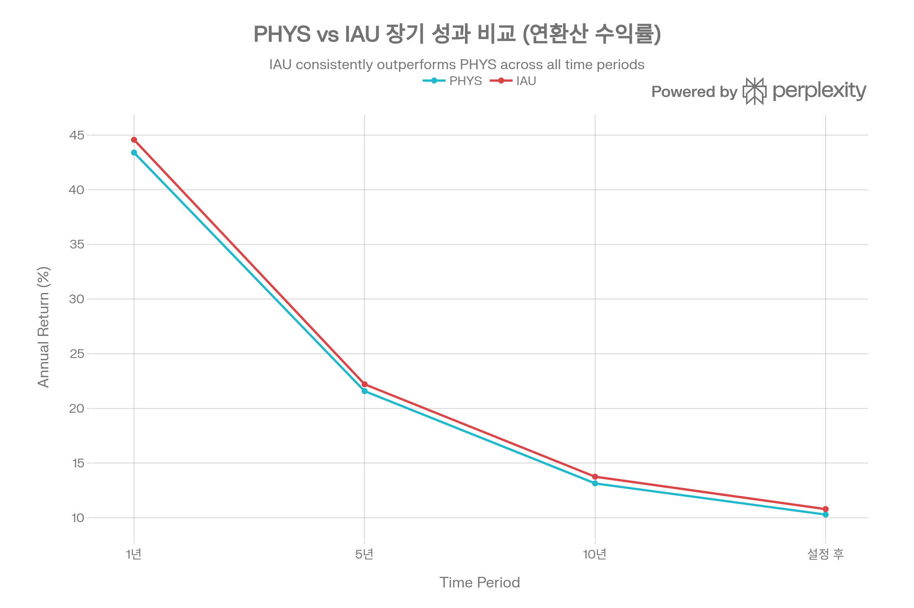
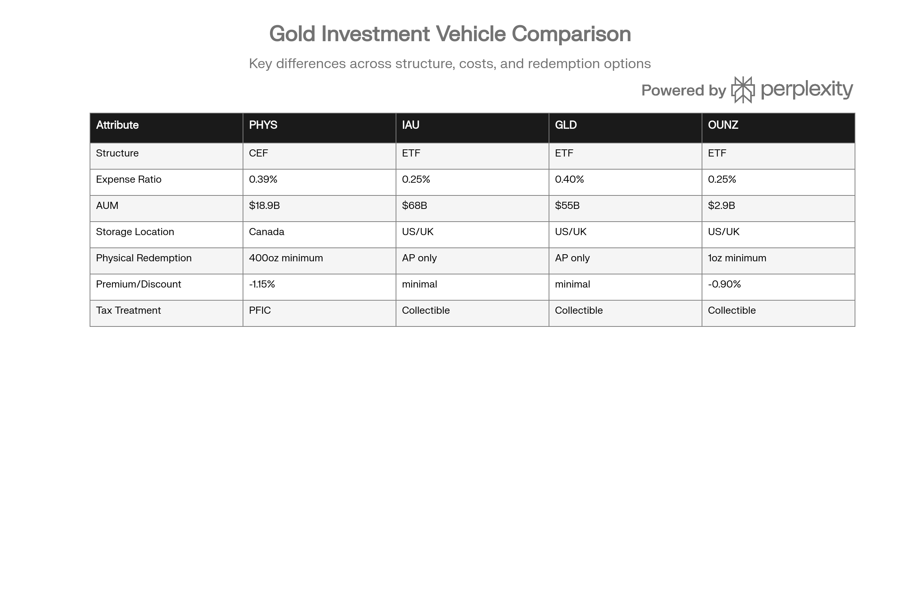

## 분류 근거

PHYS는 CEF(폐쇄형 신탁) 구조이지만 100% 실물 금 보유라는 본질은 동일하여, 같은 `ETF/Gold` 폴더로 분류했습니다.

## 개요

PHYS (Sprott Physical Gold Trust)는 Sprott Asset Management가 2009년 8월 28일 출시한 폐쇄형 신탁(Closed-End Trust)으로, 금 투자 시장에서 독특한 위치를 차지한다. 일반적인 ETF 구조가 아닌 CEF(Closed-End Fund) 구조를 채택하여 NAV 대비 프리미엄 또는 할인으로 거래되는 특성을 갖지만, 그 대신 개인 투자자가 최소 400온스(약 \$200만, ₩26억 원) 이상 보유 시 실물 금으로 인출할 수 있는 독보적 기능을 제공한다.[^1][^2][^3][^4][^5][^6]

PHYS의 가장 큰 차별점은 세 가지다. 첫째, 캐나다 Royal Canadian Mint에 금괴를 완전 할당(Fully Allocated) 방식으로 보관하여 미국 외 지역 분산과 정치적 안정성을 확보한다. 둘째, 파생상품을 일절 사용하지 않고 100% 실물 금괴만 보유하여 counterparty risk를 제거한다. 셋째, 월 1회 실물 금 인출이 가능하며 NAV의 100%에서 인출·배송 비용만 차감한 가격으로 London Good Delivery Bars를 수령할 수 있다.[^2][^7][^3][^4][^6][^8]

그러나 PHYS는 CEF 구조로 인해 NAV 대비 -1.15% 할인으로 거래되고 있으며(2026년 1월 26일 기준), 운용보수 0.39%는 IAU(0.25%)보다 0.14%포인트 높다. 또한 미국 투자자에게는 PFIC(Passive Foreign Investment Company)로 분류되어 복잡한 세무 처리와 불리한 과세가 적용된다. 이러한 단점에도 불구하고, PHYS는 대량의 실물 금을 확보하고자 하는 기관 투자자나 초고액 자산가, 그리고 캐나다 보관을 선호하는 투자자에게 강력한 선택지다.[^9][^1]

2025년 PHYS는 금 가격의 역사적 강세를 반영하며 NAV 기준 63.20%의 수익률을 기록했으며, 2026년에도 YTD +15.83%(1월 26일 기준)로 강력한 모멘텀을 이어가고 있다. 골드만삭스의 금 가격 5,400달러 전망이 실현되면 PHYS도 추가 상승이 예상되지만, CEF 구조로 인한 프리미엄/할인 변동성은 투자자가 감수해야 할 리스크다.[^1]

***

## PHYS (Sprott Physical Gold Trust) 기본 정보

| 항목 | 내용 |
| :-- | :-- |
| **티커** | PHYS (NYSE Arca), PHYS.U (TSX USD), PHYS (TSX CAD) |
| **운용사** | Sprott Asset Management LP |
| **설정일** | 2009년 8월 28일 (NYSE 상장: 2010년 2월 25일) |
| **구조** | Closed-End Trust (폐쇄형 신탁) |
| **국적** | 캐나다 (온타리오주) |
| **운용자산(AUM)** | \$18.87B (2026년 1월 26일) |
| **NAV** | \$38.92 (2026년 1월 26일) |
| **시장가** | \$38.47 (2026년 1월 26일) |
| **Premium/Discount** | -1.15% (할인) |
| **운용보수(MER)** | 0.39% |
| **발행 유닛수** | 484,834,380 |
| **보유 금** | 3,744,694 온스 (약 116.5톤) |
| **보관지** | Royal Canadian Mint (캐나다 온타리오주 오타와) |
| **실물 인출** | 가능 (최소 400온스) |

출처: Sprott Asset Management[^1][^2][^3]

PHYS는 일반적인 ETF가 아닌 Closed-End Trust 구조를 채택했다. 이는 주식 발행과 소각이 제한적이며, Authorized Participants(AP)의 차익거래가 작동하지 않아 시장 수요와 공급에 따라 NAV 대비 프리미엄 또는 할인으로 거래된다는 의미다. 2026년 1월 26일 기준 PHYS는 NAV \$38.92에 대해 시장가 \$38.47로 -1.15% 할인 거래되고 있으며, 역사적으로는 +23.88%의 프리미엄부터 -3.58%의 할인까지 폭넓게 변동했다.[^2][^3][^10][^1]

PHYS의 금괴는 캐나다 Royal Canadian Mint의 오타와 본사에 완전 할당(Fully Allocated) 방식으로 보관된다. 할당 방식은 각 금괴가 개별 식별 번호, 무게, 순도로 구분되어 신탁 명의로 보관되며, Royal Canadian Mint이 파산하더라도 PHYS의 금괴는 채권자로부터 보호된다는 의미다. 보험은 Lloyd's of London이 전액 제공하여 최고 수준의 안전성을 보장한다.[^7][^11][^12][^2]

***

## PHYS (Sprott Physical Gold Trust) 성과 분석

### 수익률 실적 (2025년 12월 31일 기준)

2025년 PHYS는 금 가격의 역사적 강세를 반영하며 NAV 기준 63.20%의 수익률을 기록했다. 이는 IAU(64.60%)보다 1.4%포인트 낮은 수준으로, 0.14%포인트 높은 운용보수 차이가 장기 누적되어 성과 차이를 만든 것으로 분석된다.[^1]

| 기간 | PHYS NAV Return (%) | IAU Return (%) 추정 | 차이 |
| :-- | :-- | :-- | :-- |
| **1개월** | 1.84 | \~2.3 | -0.5%p |
| **YTD (2025)** | 63.20 | 64.60 | -1.4%p |
| **1년** | 63.20 | 64.60 | -1.4%p |
| **3년 (연환산)** | 32.45 | 33.37 | -0.9%p |
| **5년 (연환산)** | 17.17 | 18.75 (IAU 추정) | -1.6%p |
| **10년 (연환산)** | 14.38 | 15.11 | -0.7%p |
| **15년 (연환산)** | 7.06 | \~8.0 (추정) | -0.9%p |
| **설정 후 (연환산)** | 8.34 | 11.57 | -3.2%p |

출처: Sprott, iShares[^13][^14][^1]

PHYS의 설정 후 연환산 수익률 8.34%는 IAU(11.57%)보다 3.2%포인트 낮다. 이는 PHYS가 2009년 8월 설정된 반면 IAU는 2005년 1월 설정되어, PHYS 초기 몇 년간 금 가격이 상대적으로 부진했던 시기가 포함되었기 때문이다. 동일 기간 비교 시(2010년 이후) 차이는 연환산 약 0.5\~0.6%포인트로 축소되며, 이는 운용보수 차이(0.14%포인트)와 CEF 구조의 할인 누적 효과로 설명된다.[^9][^13]

### 2026년 성과: 강력한 모멘텀 지속

2026년에도 PHYS는 금값이 5,000달러를 돌파하며 YTD +15.83%(1월 26일 기준)의 강력한 수익률을 기록하고 있다. NAV는 \$38.92로 역대 최고치를 경신했으며, 고점 \$30.07(2025년 12월 이전)을 29% 초과하는 수준이다. 이는 2025년 하반기부터 2026년 초까지 금값이 급등하며 PHYS가 이를 충실히 추종했음을 보여준다.[^1]

시장가는 \$38.47로 NAV 대비 -1.15% 할인되어 있으며, 이는 투자자가 NAV보다 1.15% 저렴하게 PHYS를 매수할 수 있음을 의미한다. 역사적으로 PHYS는 평균적으로 NAV 근처 또는 소폭 할인으로 거래되지만, 금융 위기나 금 가격 급등 시 프리미엄으로 전환될 수 있다.[^3][^1]

### 장기 성과: IAU 대비 소폭 저조

PHYS vs IAU 장기 성과. PHYS는 IAU 대비 연 0.5\~0.6%p 낮은 수익률 (0.14%p 높은 운용보수 반영).

PHYS는 IAU 대비 장기 성과가 연 0.5\~0.6%포인트 낮다. 이는 주로 세 가지 요인에서 기인한다:[^9][^13]

**1. 운용보수 차이 (0.14%포인트):** PHYS 0.39% vs IAU 0.25%[^1][^9]

**2. CEF 할인 누적 효과:** PHYS가 평균 -1\~2% 할인으로 거래되므로, 장기 보유 시 할인폭 확대는 추가 손실을, 할인폭 축소는 추가 이익을 가져온다. 평균적으로는 NAV 추종에 약간 못 미친다.

**3. 유동성 프리미엄:** IAU는 훨씬 높은 유동성(일거래금액 약 \$190M, [IAU 자체 포스트](/blog/etf/gold/iau/iau-ishares-gold-trust) 기준)으로 비드-애스크 스프레드가 좁지만, PHYS는 상대적으로 넓어 거래 비용이 높다.

그러나 0.5\~0.6%포인트의 성과 차이는 PHYS가 제공하는 고유한 가치(캐나다 보관, 실물 인출 가능, 완전 할당)를 감안하면 일부 투자자에게는 수용 가능한 수준이다. 특히 대량의 실물 금(400온스 이상)을 확보하려는 초고액 자산가나 기관 투자자에게 PHYS의 실물 인출 옵션은 IAU가 제공할 수 없는 대체 불가능한 기능이다.[^4][^5]

***

## PHYS (Sprott Physical Gold Trust) 실물 금 인출의 독특한 구조

### 실물 금 인출 프로세스: 400온스 이상

PHYS의 가장 큰 차별점은 개인 투자자도 실물 금을 인출할 수 있다는 점이다. 그러나 최소 인출 단위가 1 London Good Delivery Bar(약 400온스, 12.4kg)로 설정되어 있어, 현재 금값 기준 약 \$2,000,000(₩26억 원)의 자산을 보유한 투자자만 인출이 가능하다.[^4][^5][^6][^8]

**실물 금 인출 조건:**

| 항목 | 내용 |
| :-- | :-- |
| **최소 인출 단위** | 1 London Good Delivery Bar (약 400 온스) |
| **현재 금값 기준 금액** | \~\$2,000,000 (₩26억 원) |
| **인출 빈도** | 월 1회 |
| **신청 마감** | 매월 15일 오후 4시 (토론토 시간) |
| **인출가** | NAV의 100% - 인출·배송·보관 수수료 |
| **인출 형태** | London Good Delivery Bars (400온스 금괴) |

출처: Sprott, SEC[^6][^8][^4]

OUNZ가 최소 1온스부터 인출 가능한 것과 대조적으로, PHYS는 400온스라는 높은 진입장벽으로 일반 개인 투자자의 접근을 제한한다. 이는 PHYS가 초고액 자산가와 기관 투자자를 주요 타겟으로 설계되었음을 의미한다. Reddit 커뮤니티에서는 "PHYS는 약 \$712,000(400온스 기준, 2021년 금값)이 필요하지만, GLD는 Authorized Participants만 100,000주(약 \$1,660만) 단위로 인출 가능하므로 PHYS가 상대적으로 접근성이 높다"는 의견이 있다.[^5][^15][^16][^4]

### 인출 절차 (6단계)

**1단계: 유닛 보유 확인**
투자자는 최소 400온스에 해당하는 PHYS 유닛을 보유해야 한다. 2026년 1월 기준 NAV \$38.92로, 400온스를 인출하려면 약 \$2,000,000 / \$38.92 ≈ 51,400 유닛이 필요하다.[^1][^4]

**2단계: 유닛 증서 발급**
유닛을 DRS(Direct Registration System)로 보유하고 있다면, 먼저 증서(certificate)를 요청하여 발급받아야 한다. 이는 실물 인출 신청 시 증서를 제출해야 하기 때문이다.[^4][^17]

**3단계: 인출 신청서 작성 (Redemption Notice)**
Sprott이 제공하는 Redemption Notice를 작성한다. 신청서에는 인출할 유닛 수, 금 수령 주소, 연락처 등이 포함된다.[^4]

**4단계: 서명 보증 (Signature Guarantee)**
신청서에 유효한 서명 보증(Signature Guarantee)을 받아야 한다. 이는 은행이나 증권사에서 제공하는 공증 서비스로, 신청자의 신원을 확인하고 사기를 방지하기 위함이다.[^4]

**5단계: 신청서 제출**
완성된 Redemption Notice를 TSX Trust Company에 매월 15일 오후 4시(토론토 시간)까지 제출한다. 15일 이후 제출된 신청은 다음 달로 이월된다. 신청서는 우편, 팩스, 또는 전자 제출이 가능하다.[^6][^4]

**6단계: 금 수령**
TSX Trust Company가 신청을 처리하고, Royal Canadian Mint에서 금괴를 인출하여 투자자가 지정한 주소로 배송한다. 배송은 장갑차 운송 또는 전문 귀금속 운송사가 담당하며, Lloyd's of London 보험이 전액 적용된다. 처리 기간은 명시되지 않았으나, 통상 신청 후 2\~4주 소요될 것으로 추정된다.[^4]

### 인출가 및 비용

PHYS의 인출가는 NAV의 100%이지만, 다음 비용이 차감된다:[^6][^8]

- **인출 처리 수수료 (Redemption handling fee):** 신청서 처리 및 행정 비용
- **배송 비용 (Delivery expenses):** 장갑차 운송 또는 전문 운송 비용
- **금 보관 입출고 수수료 (Storage in-and-out fees):** Royal Canadian Mint의 금괴 입출고 비용

구체적인 금액은 공개되지 않았으나, 400온스 금괴 인출 시 총 비용은 \$5,000\~10,000(추정)으로 예상된다. 이는 인출 금액(\$2,000,000)의 0.25\~0.50% 수준으로, OUNZ의 Exchange Fee와 유사하다.[^16]

### 현금 청산 옵션

PHYS는 실물 금 인출 외에 현금 청산(Cash Redemption)도 가능하지만, 특정 제한과 요구사항이 있다. Prospectus에 명시된 조건을 충족해야 하며, 일반적으로 현금 청산은 실물 금 인출보다 불리한 조건으로 제공된다. 대부분의 투자자는 시장에서 PHYS 주식을 매도하는 것이 현금 청산보다 유리하다.[^4]

### OUNZ와 인출 조건 비교

| 항목 | PHYS | OUNZ |
| :-- | :-- | :-- |
| **최소 인출 단위** | 400 온스 (1 London Bar) | 1 온스 (금화) |
| **인출 금액 (현재 금값)** | \~\$2,000,000 (₩26억) | \~\$5,000 (₩650만) |
| **인출 빈도** | 월 1회 | 수시 |
| **인출 형태** | London Good Delivery Bars만 | 금화, 소형 금괴, London Bars |
| **처리 기간** | 2\~4주 (추정) | 4영업일 |
| **타겟 투자자** | 초고액 자산가, 기관 | 일반 투자자 |

출처: Sprott, merkgold.com[^4][^15][^16]

OUNZ는 1온스 금화부터 인출 가능하여 일반 투자자도 접근할 수 있지만, PHYS는 400온스라는 높은 장벽으로 초고액 자산가와 기관 투자자만 인출이 현실적이다. 반대로 PHYS의 400온스 금괴는 대형 금 거래 시 유동성과 가격 효율성이 뛰어나므로, 대량 거래자에게는 PHYS가 더 유리할 수 있다.[^5][^15][^16][^4]

***

## PHYS (Sprott Physical Gold Trust) 비용 및 효율성

### 운용보수: 0.39%의 프리미엄

PHYS의 Management Expense Ratio(MER)는 0.39%로, 금 ETF 시장에서 중간\~높은 수준이다. IAU(0.25%)보다 0.14%포인트, IAUM(0.09%)보다 0.30%포인트 높지만, GLD(0.40%)보다는 0.01%포인트 저렴하다.[^1][^9]

| ETF | 운용보수 | PHYS 대비 차이 | 1억 원 투자 시 연간 비용 차이 |
| :-- | :-- | :-- | :-- |
| **PHYS** | 0.39% | - | 39만 원 |
| **IAU** | 0.25% | -0.14%p | 25만 원 (14만 원 절감) |
| **IAUM** | 0.09% | -0.30%p | 9만 원 (30만 원 절감) |
| **GLDM** | 0.10% | -0.29%p | 10만 원 (29만 원 절감) |
| **GLD** | 0.40% | +0.01%p | 40만 원 (1만 원 추가) |
| **OUNZ** | 0.25% | -0.14%p | 25만 원 (14만 원 절감) |

출처: 각 운용사[^14][^18][^19][^20][^1]

장기 투자 시 이 비용 차이는 복리로 누적되어 상당한 수익 차이를 만든다. 예를 들어, 1억 원을 20년간 투자하고 금 가격이 연 5% 상승한다고 가정할 때, PHYS(0.39%) 대비 IAU(0.25%)의 0.14%포인트 절감은 약 350만 원, IAUM(0.09%)의 0.30%포인트 절감은 약 750만 원의 추가 수익으로 귀결된다.

그러나 PHYS는 IAU나 IAUM이 제공하지 못하는 고유한 가치를 제공한다:

**1. 캐나다 보관:** 미국 외 지역 분산, 정치적 안정성, Royal Canadian Mint의 신뢰도[^2][^7][^11]

**2. 실물 금 인출:** 400온스 이상 보유 시 NAV 가격으로 실물 금 확보 가능[^4][^5]

**3. 완전 할당(Fully Allocated):** 100% 실물 금괴, 파생상품 없음, counterparty risk 제로[^3][^2]

이러한 차별화 요소를 감안하면, 0.14\~0.30%포인트의 추가 비용은 일부 투자자에게는 합리적인 프리미엄이다. 특히 대량의 실물 금(400온스 이상)을 확보하려는 투자자나 캐나다 보관을 선호하는 투자자에게 PHYS의 추가 비용은 충분히 지불할 가치가 있다.

### CEF 구조의 프리미엄/할인

PHYS는 Closed-End Fund 구조로, NAV 대비 프리미엄 또는 할인으로 거래된다. 2026년 1월 26일 기준 PHYS는 NAV \$38.92에 대해 시장가 \$38.47로 -1.15% 할인 거래되고 있다.[^1][^3][^10]

**PHYS 프리미엄/할인 역사 (설정 이후):**

- **최고 프리미엄:** +23.88% (금융 위기 또는 금 급등 시기 추정)[^3][^1]
- **최저 할인:** -3.58%[^1][^3]
- **평균:** NAV 근처 또는 -1\~2% 소폭 할인
- **현재 (2026년 1월):** -1.15% 할인[^1]

CEF 할인은 투자자에게 양날의 검이다:

**할인의 장점:**

- NAV보다 저렴하게 금 노출 확보 가능
- 할인폭이 축소되면 NAV 상승 + 할인 축소의 이중 이익

**할인의 단점:**

- 할인폭이 확대되면 NAV 상승에도 손실 가능
- 유동성 부족 시 원하는 가격에 매도 어려움

역사적으로 PHYS는 금융 위기나 금 급등 시 프리미엄으로 전환되는 경향이 있다. 이는 투자자들이 실물 금 인출 옵션의 가치를 높게 평가하기 때문이다. 반대로 금 시장이 부진하거나 투자 심리가 약화되면 할인폭이 확대된다.[^3][^1]

### 유동성: 중간 수준

PHYS의 AUM은 \$18.87B로 상당한 규모지만, 일평균 거래량은 GLD(\$2B+)나 IAU(약 \$190M)보다 현저히 낮다. CEF 구조로 인해 Authorized Participants의 차익거래가 작동하지 않으므로, 유동성이 ETF보다 제한적이다.[^1][^10]

| ETF | AUM | 일평균 거래금액 (추정) | 유동성 등급 |
| :-- | :-- | :-- | :-- |
| **GLD** | \$159B | \$2B+ | 최고 |
| **IAU** | \$68B | \$190M (IAU 자체 포스트 기준) | 매우 높음 |
| **PHYS** | \$18.9B | \$50M\~ \$150M (추정) | 중간 |
| **OUNZ** | \$2.9B | \$70M (추정) | 중간 |
| **GLDM** | \$27B | \$100M+ | 중간 |

출처: 각 운용사[^14][^19][^20][^1]

PHYS의 유동성은 일반 개인 투자자가 수백만\~수천만 원 규모로 매매하기에는 충분하지만, 대형 기관 투자자가 수억\~수십억 원 규모로 거래하기에는 제약이 있다. 비드-애스크 스프레드도 GLD, IAU보다 넓어 거래 비용이 높을 수 있다.

***

## PHYS (Sprott Physical Gold Trust) 포트폴리오 구성

### 자산 배분: 금 100%

PHYS는 포트폴리오의 실질적으로 100%를 실물 금괴로 구성한다. 신탁이 보유한 3,744,694 온스의 금 시장가치는 \$18,756,049,980이며, 신탁의 총 NAV는 \$18,868,985,140로 현금 및 기타 자산은 약 \$112,935,160(약 0.6%)에 불과하다.[^1][^2][^3]

**PHYS 자산 구성 (2026년 1월 26일):**

| 자산 유형 | 시장가치 (USD) | 비중 (%) | 설명 |
| :-- | :-- | :-- | :-- |
| **금괴 (Gold Bullion)** | \$18,756,049,980 | 99.4% | London Good Delivery Bars |
| **현금 및 기타** | \$112,935,160 | 0.6% | 운용 비용, 인출 처리 등 |
| **파생상품** | \$0 | 0.0% | 없음 (완전 할당) |
| **총 NAV** | \$18,868,985,140 | 100.0% | - |

출처: Sprott[^1]

PHYS는 파생상품을 일절 사용하지 않으며, 선물·스왑·옵션 등을 통한 레버리지나 헤징을 하지 않는다. 이는 counterparty risk를 완전히 제거하고, 금융 위기 시에도 신탁의 자산이 온전히 보호됨을 의미한다. 현금 보유도 최소화하여 신탁 자산의 거의 100%를 금으로 유지한다.[^2][^3]

### 보관 방식: Royal Canadian Mint의 완전 할당

PHYS의 금괴는 캐나다 Royal Canadian Mint의 오타와 본사에 할당(Allocated) 방식으로 보관된다. Royal Canadian Mint은 1908년 설립된 캐나다 정부 소유 기관(Crown Corporation)으로, 100년 이상의 역사와 세계적 신뢰도를 자랑한다.[^2][^7][^11][^12]

**Royal Canadian Mint 보관의 특징:**

**1. 완전 할당(Fully Allocated):**
각 금괴는 고유 번호(serial number), 무게, 순도로 개별 식별되며, 신탁 명의로 분리 보관(segregated)된다. 이는 Royal Canadian Mint의 다른 자산과 섞이지 않으며, Mint이 파산하더라도 PHYS의 금괴는 채권자로부터 보호된다.[^11][^2]

**2. London Good Delivery Bars:**
PHYS가 보유한 금괴는 모두 London Good Delivery 기준을 충족하는 400온스급 금괴로, 순도 99.5% 이상이 보장된다.[^3][^2]

**3. Lloyd's of London 보험:**
모든 금괴는 Lloyd's of London의 전액 보험으로 보호되어, 도난·화재·자연재해 등으로 인한 손실을 커버한다.[^11]

**4. 정기 감사:**
독립 감사기관이 정기적으로 금 보유량을 검증하며, 결과는 투자자에게 공개된다.[^2][^11]

**5. 투명성:**
Sprott은 일일 금 보유량을 웹사이트에 공개하며, 투자자는 신탁이 정확히 몇 온스의 금을 보유하는지 실시간으로 확인할 수 있다.[^1]

### 캐나다 보관의 전략적 가치

PHYS의 캐나다 보관은 미국 중심의 금 ETF 시장에서 독특한 지역 분산 효과를 제공한다. IAU, GLD, OUNZ 등은 모두 미국(뉴욕) 또는 영국(런던)에 금괴를 보관하지만, PHYS는 캐나다 오타와에 보관하여 다음과 같은 이점을 제공한다:[^2][^7][^11]

**1. 정치적 안정성:**
캐나다는 정치적으로 안정적이며, 자산 몰수(asset confiscation)나 금 거래 제한 이력이 없다. 미국은 1933년 루스벨트 대통령 시절 Executive Order 6102로 개인의 금 소유를 금지한 전례가 있어, 일부 투자자는 미국 보관을 우려한다.[^11][^21]

**2. 통화 분산:**
캐나다 달러는 미국 달러와 독립적으로 움직이므로, 미국 달러 약세 시 캐나다 보관 금은 환율 효과로 추가 이익을 얻을 수 있다(TSX 캐나다 달러 표시 PHYS 매수 시).

**3. 전쟁·테러 리스크:**
미국 동부(뉴욕) 또는 유럽(런던)이 전쟁·테러의 타겟이 될 가능성에 대비하여, 캐나다 오타와는 상대적으로 안전한 위치다.[^11]

**4. 금 채굴 국가:**
캐나다는 세계 5위권 금 생산국으로, 금 산업에 대한 이해도와 인프라가 발달해 있다.[^11]

***

## PHYS (Sprott Physical Gold Trust) vs 주요 금 ETF 비교

PHYS vs 주요 금 ETF 비교. PHYS는 CEF 구조와 캐나다 보관으로 차별화되나 PFIC 세금 복잡성 존재.

PHYS를 IAU, GLD, OUNZ와 비교하면 각 상품의 강점과 타겟 투자자가 명확해진다.

### PHYS vs IAU: CEF vs ETF

IAU는 세계 2위 금 ETF로 AUM \$68B, 운용보수 0.25%를 자랑하며, 압도적인 유동성과 NAV 추종 효율성을 제공한다. PHYS는 IAU 대비 다음과 같은 장단점을 갖는다:[^14]

**PHYS 장점 vs IAU:**

- 실물 금 인출 가능 (400온스 이상) → IAU는 AP만 가능
- 캐나다 보관 (미국 외 분산)
- 완전 할당(Fully Allocated) 명시적 보장

**PHYS 단점 vs IAU:**

- 높은 운용보수 (0.14%p 차이)
- CEF 구조로 할인 거래 (-1.15%)
- 낮은 유동성
- PFIC 세금 복잡성
- 장기 성과 0.5\~0.6%p 저조

**선택 기준:**

- **IAU 선택:** 실물 금 불필요, 비용 중시, 높은 유동성, 세금 단순성, 일반 투자자
- **PHYS 선택:** 대량 실물 금 확보(400oz+), 캐나다 보관 선호, 초고액 자산가·기관 투자자

### PHYS vs GLD: 비슷한 비용, 다른 구조

GLD는 세계 최대 금 ETF로 AUM \$159B, 운용보수 0.40%를 가지며, 최고 수준의 유동성(일거래금액 \$2B+)을 자랑한다. PHYS는 GLD보다 0.01%포인트 저렴하지만, CEF 구조와 유동성 차이로 인해 타겟 투자자가 다르다.[^19]

**PHYS 장점 vs GLD:**

- 낮은 운용보수 (0.01%p 차이, 미미함)
- 실물 금 인출 가능 (400온스 vs AP만 100,000주)
- 캐나다 보관

**PHYS 단점 vs GLD:**

- 훨씬 낮은 유동성
- CEF 할인 (-1.15%)
- 브랜드 인지도 낮음

**선택 기준:**

- **GLD 선택:** 초단기 트레이딩, 최고 유동성, 브랜드 인지도, 대형 기관 투자자
- **PHYS 선택:** 대량 실물 금 확보, 캐나다 보관, 약간 낮은 비용

### PHYS vs OUNZ: 인출 장벽의 차이

OUNZ와 PHYS는 모두 실물 금 인출이 가능하지만, 최소 인출 단위에서 극명한 차이를 보인다.[^4][^15][^20][^22]

| 항목 | PHYS | OUNZ |
| :-- | :-- | :-- |
| **최소 인출** | 400 온스 (\~\$2M, ₩26억) | 1 온스 (\~\$5K, ₩650만) |
| **타겟 투자자** | 초고액 자산가, 기관 | 일반 투자자 |
| **인출 형태** | London Bars만 | 금화, 소형 금괴, London Bars |
| **운용보수** | 0.39% | 0.25% |
| **보관지** | 캐나다 | 미국/영국 |
| **세금** | PFIC (미국 투자자) | Collectible (미국 투자자) |

출처: Sprott, VanEck[^1][^16][^20][^4]

**선택 기준:**

- **OUNZ 선택:** 소액 실물 금 인출(1oz부터), 낮은 비용, 세금 단순성, 일반 투자자
- **PHYS 선택:** 대량 실물 금 확보(400oz), 캐나다 보관, 대형 금괴 효율성, 초고액 자산가

OUNZ는 일반 투자자도 ₩650만 원부터 실물 금화를 인출할 수 있어 접근성이 뛰어나지만, PHYS는 ₩26억 원이라는 높은 장벽으로 초고액 자산가와 기관 투자자만 인출이 현실적이다. 반대로 PHYS의 400온스 London Good Delivery Bars는 대형 금 딜러나 중앙은행 등과 거래 시 유동성과 가격 효율성이 가장 뛰어나므로, 대량 거래자에게는 PHYS가 더 유리할 수 있다.[^5][^15][^16][^4]

***

## PHYS (Sprott Physical Gold Trust) 배당 및 세금

### 배당 정책: 무배당

PHYS는 배당을 지급하지 않는다. 신탁의 정책은 "정기 현금 분배 계획 없음(does not anticipate making regular cash distributions)"이며, 금은 무이자 자산이므로 이자 수익이나 배당을 창출할 수 없다.[^9][^10][^13]

일부 Closed-End Fund는 Return of Capital(자본 반환) 방식으로 소액의 분배금을 지급하지만, PHYS는 이마저도 하지 않는다. 투자자의 수익은 전적으로 금 가격 시세차익과 CEF 할인 축소에서 발생한다.

### 미국 투자자: PFIC의 복잡성과 불리함

PHYS는 캐나다 법인으로 미국 세법상 PFIC(Passive Foreign Investment Company)로 분류된다. PFIC는 다음 두 조건 중 하나를 충족하는 외국 법인이다:[^1]

**(a) 수입의 75% 이상이 passive income (이자, 배당, 임대료, 자본이득 등)**
**(b) 자산의 50% 이상이 passive income 창출 자산**

PHYS는 자산의 99.4%가 금괴로 passive income 창출 자산이므로 (b) 조건을 충족하여 PFIC로 분류된다.[^1]

**PFIC 세무 처리의 복잡성:**

**1. Form 8621 제출 의무:**
PHYS를 보유한 미국 투자자는 매년 IRS Form 8621(Information Return by a Shareholder of a Passive Foreign Investment Company)을 제출해야 한다. 이는 일반 주식의 1099 보고보다 훨씬 복잡하며, 세무 전문가의 도움이 필요할 수 있다.[^1]

**2. Excess Distribution 과세:**
PHYS 매도 시 이익은 "Excess Distribution"으로 간주되어, 보유 기간 전체에 걸쳐 발생한 것으로 가정하고 각 연도별로 일반 소득세율을 적용한 후, 과거 연도분에는 추가 이자(interest charge)를 부과한다. 이는 일반 자본이득세(장기 20%, 단기 39.60%)보다 불리할 수 있다.

**3. QEF 또는 MTM 선택 가능:**
투자자는 QEF(Qualified Electing Fund) 또는 MTM(Mark-to-Market) 방식을 선택하여 Excess Distribution 과세를 피할 수 있지만, 각각 복잡한 요구사항과 연간 신고 의무가 따른다.

**PFIC의 실질 세율:**

- Excess Distribution 방식: 일반 소득세율 37% + 이자 charge → 실질 40\~45%
- QEF 방식: 일반 소득세율 37% (이자 charge 없음)
- MTM 방식: 일반 소득세율 37% (미실현 이익도 과세)

출처: IRS, Sprott[^1]

결론적으로 미국 투자자에게 PHYS는 세무 처리가 복잡하고 불리하다. IAU, GLD, OUNZ는 모두 미국 또는 영국 법인으로 Collectible 과세(장기 28%)가 적용되어 PHYS보다 유리하다. 미국 투자자가 PHYS를 선택하려면 캐나다 보관이나 실물 금 인출의 가치가 PFIC의 세무 불편과 추가 비용을 상쇄할 만큼 커야 한다.[^23][^24]

### 캐나다 투자자: 상대적으로 유리

PHYS는 캐나다 신탁이므로, 캐나다 투자자에게는 PFIC 문제가 없다. 일반적인 캐나다 자본이득세(Capital Gains Tax)가 적용되며, 자본이득의 50%만 과세 대상이다. 캐나다 최고 소득세율이 약 53%라고 가정하면, 자본이득 실효 세율은 약 26.5%로 미국의 Collectible 세율(28%)보다 약간 낮다.

캐나다 투자자는 TSX에서 캐나다 달러 표시 PHYS를 거래할 수 있어, 환율 리스크 없이 금에 투자할 수 있다. 이는 PHYS가 캐나다 투자자에게 최적화된 상품임을 시사한다.[^1]

### 한국 투자자: 해외 주식 양도소득세

한국 거주 투자자가 PHYS에 투자할 경우, 해외 주식 양도소득세가 적용된다. 연간 250만 원까지는 비과세이며, 초과분에 대해 22%(지방소득세 포함)의 세율이 적용된다.[^25][^26]

PFIC 보고 의무는 미국 투자자에게만 해당하므로, 한국 투자자는 Form 8621 제출이 불필요하다. 그러나 PHYS를 한국에서 거래 가능한 증권사가 제한적일 수 있으므로, 투자 전 확인이 필요하다.

***

## PHYS (Sprott Physical Gold Trust) 투자 전략 및 활용

### 장기 보유 전략: Buy & Hold

PHYS는 금 가격의 장기 상승을 추종하는 Buy & Hold 전략에 적합하다. 금은 역사적으로 인플레이션 헤지, 통화 가치 하락 방어, 포트폴리오 분산화 수단으로 기능해왔으며, PHYS는 이러한 금의 특성을 캐나다 보관이라는 추가 안전장치와 함께 제공한다.

**장기 투자 시나리오:**

**1. 포트폴리오 분산 (5\~15% 배분):**
PHYS를 포트폴리오의 5\~15% 배분하여 주식·채권과의 낮은 상관관계를 활용한다. 주식 시장 폭락 시 금은 안전자산으로 급등하는 경향이 있어, PHYS는 포트폴리오 변동성을 낮추는 역할을 한다.

**2. 지역 분산 (미국 외 금 보관):**
IAU, GLD, OUNZ 등 미국 보관 금 ETF와 함께 PHYS를 보유하여 지역 분산 효과를 얻는다. 미국의 자산 몰수 리스크나 정치적 불안을 우려하는 투자자는 PHYS의 캐나다 보관을 선호할 수 있다.[^11][^21]

**3. 실물 금 전환 대비 (400온스 이상):**
PHYS를 장기 보유하며 400온스 이상 누적 시, 금융 위기나 은퇴 시점에 실물 금으로 전환하여 금융 시스템 외부에 자산을 확보한다.[^4][^5]

### 프리미엄/할인 활용 전략

PHYS는 CEF 구조로 NAV 대비 프리미엄/할인으로 거래되므로, 할인 시 매수하고 프리미엄 시 매도하는 전략이 유효하다.[^1][^3][^10]

**전략:**

**1. -2% 이상 할인 시 매수:**
PHYS가 NAV 대비 -2% 이상 할인으로 거래될 때 매수한다. 역사적으로 할인폭은 -3.58%가 최대였으므로, -2% 할인은 저가 매수 기회다. 할인폭이 축소되면 NAV 상승 + 할인 축소의 이중 이익을 얻는다.[^3][^1]

**2. +5% 이상 프리미엄 시 매도:**
PHYS가 NAV 대비 +5% 이상 프리미엄으로 거래될 때 일부 익절한다. 역사적으로 최대 프리미엄은 +23.88%였으나, 평균적으로는 NAV 근처로 회귀하므로 과도한 프리미엄은 지속 불가능하다.[^1][^3]

**3. NAV 추적:**
Sprott 웹사이트에서 일일 NAV를 확인하고, 현재 프리미엄/할인을 모니터링한다. -1\~2% 할인은 정상 범위이지만, -3% 이상 할인이나 +10% 이상 프리미엄은 비정상적 신호다.[^1]

### 실물 금 전환 전략 (초고액 자산가)

PHYS의 가장 독특한 활용법은 대량의 실물 금(400온스 이상) 확보다. 초고액 자산가나 기관 투자자는 다음 상황에서 PHYS를 실물 금으로 전환할 수 있다:[^4][^5][^6]

**실물 금 전환 타이밍:**

**1. 금융 위기:**
은행 파산, 금융 시스템 붕괴 우려 시 PHYS를 실물 금으로 전환하여 시스템 외부에 자산을 보호한다.

**2. 대량 금 거래:**
금 딜러, 중앙은행, 펀드 등 대형 금 거래자는 PHYS를 400온스 London Bars로 인출하여 유동성과 가격 효율성을 확보한다.

**3. 세금 계획:**
PHYS를 실물 금으로 전환한 후, 상속 또는 증여 시 물리적 자산으로 이전하여 세금 계획을 최적화한다.

**4. 장기 보관:**
은퇴 후 금융 시장 노출을 줄이고, 물리적 금을 개인 금고나 은행 안전 금고에 보관하고자 할 때.

### 포트폴리오 배분 전략

PHYS는 포트폴리오의 5\~15% 배분이 적절하다. 금은 안전자산이지만 무이자 자산이므로, 과도한 배분은 장기 수익률을 저하시킬 수 있다.

**보수적 포트폴리오 (60세 이상, 은퇴자):**

- 주식: 30%
- 채권: 40%
- **금 (PHYS + IAU 분산)**: 15% (PHYS 10%, IAU 5%)
- 현금: 15%

**균형 포트폴리오 (40\~60세, 직장인):**

- 주식: 50%
- 채권: 30%
- **금 (PHYS + IAU 분산)**: 10% (PHYS 5%, IAU 5%)
- 현금: 10%

**공격적 포트폴리오 (20\~40세, 젊은 투자자):**

- 주식: 70%
- 채권: 15%
- **금 (IAU 또는 IAUM)**: 5%
- 현금: 10%

보수적 투자자일수록, 그리고 캐나다 보관이나 실물 금 인출을 중시할수록 PHYS 비중을 높인다. 젊은 공격적 투자자는 PHYS보다 비용이 저렴한 IAU나 IAUM을 선택하는 것이 합리적이다.

***

## PHYS (Sprott Physical Gold Trust) 2026년 투자 전망

### 금 시장 전망: 구조적 강세 지속

2026년 금 시장은 골드만삭스의 5,400달러 목표가, JP Morgan의 5,055달러 전망과 같이 주요 투자은행들의 낙관론이 우세하다. PHYS는 금 가격을 정확히 추종하므로, 금값이 5,400달러에 도달하면 PHYS NAV도 현재 수준(\$38.92) 대비 약 8% 상승하여 \$42\~43 수준에 도달할 것으로 예상된다.[^1][^27]

**금 가격 상승 동력 (2026년):**

**1. 중앙은행 금 매입:**
골드만삭스는 2026년 중앙은행이 월 60\~70톤, 연 720\~840톤의 금을 매입할 것으로 예상한다. 탈달러화 트렌드로 신흥시장 중앙은행들이 금을 선호한다.[^27]

**2. 연준 금리 인하:**
50bp 추가 금리 인하 전망은 실질 금리를 낮춰 금의 상대적 매력을 높인다.[^27]

**3. 지정학적 리스크:**
우크라이나 전쟁, 중동 분쟁, 미중 갈등 등은 안전자산 수요를 지속시킨다.[^28][^29]

**4. 달러 약세:**
미국 재정적자 확대와 금리 인하는 달러 약세를 초래하며, 달러 표시 자산인 금은 가격 상승 압력을 받는다.[^29][^27]

### PHYS 전망: 금 가격 추종 + 할인 축소 기회

PHYS는 2026년에도 금 가격을 충실히 추종할 것으로 예상되며, 추가로 CEF 할인 축소 시 추가 이익을 얻을 수 있다.[^1][^3][^10]

**PHYS 2026년 시나리오:**

| 시나리오 | 금 가격 | PHYS NAV | 할인/프리미엄 | PHYS 시장가 | 현재 대비 |
| :-- | :-- | :-- | :-- | :-- | :-- |
| **낙관** | \$5,400 | \$42\~43 | -0.5% (할인 축소) | \$42 | +9% |
| **기본** | \$4,800\~5,200 | \$37\~40 | -1\~2% | \$37\~39 | -3\~+1% |
| **비관** | \$4,000\~4,500 | \$31\~35 | -2\~3% (할인 확대) | \$30\~34 | -20\~-12% |

출처: 주요 투자은행 전망, Sprott[^27][^28][^1]

낙관 시나리오는 금값 5,400달러 달성과 함께 실물 금 인출 수요 증가로 PHYS 할인폭이 -0.5%로 축소되는 경우다. 이는 NAV 상승 +8% + 할인 축소 +0.65% = 약 +9%의 시장가 상승을 의미한다.

기본 시나리오는 금값이 \$4,800\~5,200 범위에서 박스권 등락하며, PHYS는 현재 수준 ±5% 범위로 변동하는 것이다. 할인폭은 -1\~2%로 정상 범위를 유지한다.

비관 시나리오는 연준의 매파적 전환(금리 인상 재개)으로 금값이 \$4,000 이하로 급락하는 경우다. 이 경우 투자 심리 약화로 PHYS 할인폭도 -2\~3%로 확대되어, 시장가는 -20%까지 하락할 수 있다.

### 투자 권장사항

**2026년 PHYS 투자 전략:**

**1. 장기 보유 지속 (추천, 보수적):**
PHYS를 이미 보유한 투자자는 장기 보유를 지속하되, 프리미엄이 +5% 이상 발생 시 일부 익절을 고려한다. 금 시장의 구조적 상승 트렌드는 여전히 유효하다.

**2. -2% 이상 할인 시 매수 (추천, 공격적):**
PHYS가 NAV 대비 -2% 이상 할인으로 거래될 때 추가 매수하여 평균 단가를 낮춘다. 현재 -1.15% 할인은 중립\~약간 유리한 수준이다.[^1]

**3. 캐나다 보관 분산:**
미국 보관 금 ETF(IAU, GLD, OUNZ)와 함께 PHYS를 보유하여 지역 분산 효과를 얻는다. 포트폴리오의 5\~10%를 PHYS에 배분한다.

**4. 실물 금 전환 계획 (초고액 자산가):**
400온스 이상 보유 시, 금융 위기나 은퇴 시점에 실물 금으로 전환할 계획을 세운다. 인출 절차를 미리 확인한다.[^4][^5]

**5. PFIC 세무 관리 (미국 투자자):**
미국 투자자는 세무 전문가와 상담하여 PFIC 보고 의무를 이행하고, QEF 또는 MTM 선택을 검토한다. PFIC 복잡성이 부담스럽다면 IAU를 선택하는 것이 합리적이다.[^1]

***

## PHYS (Sprott Physical Gold Trust) 투자 고려사항

### 강점

**1. 대량 실물 금 인출 가능:**
개인 투자자도 400온스 이상 보유 시 NAV 가격으로 London Good Delivery Bars를 인출할 수 있다. 이는 IAU, GLD가 제공하지 못하는 기능이다.[^4][^5][^6]

**2. 캐나다 보관의 안전성:**
Royal Canadian Mint은 100년 이상의 역사와 캐나다 정부 소유로 신뢰도가 높으며, 미국 외 지역 분산 효과를 제공한다.[^2][^11][^12][^21]

**3. 완전 할당(Fully Allocated):**
100% 실물 금괴, 파생상품 없음으로 counterparty risk를 제거한다. 금융 위기 시에도 자산이 온전히 보호된다.[^3][^2]

**4. GLD보다 낮은 비용:**
0.39%는 GLD(0.40%)보다 0.01%포인트 저렴하다. 비용 차이는 미미하지만, 실물 인출 옵션을 감안하면 유리하다.[^1][^9]

**5. 대형 AUM:**
\$18.9B는 안정적인 운용을 보장하며, 청산 리스크가 전무하다.[^1]

**6. Lloyd's of London 보험:**
전액 보험으로 도난·화재·자연재해 등의 리스크를 커버한다.[^11]

**7. 투명성:**
일일 금 보유량을 웹사이트에 공개하여 투자자가 신탁의 자산을 실시간 확인할 수 있다.[^1]

### 약점

**1. 높은 운용보수:**
0.39%는 IAU(0.25%) 대비 0.14%포인트, IAUM(0.09%) 대비 0.30%포인트 높다. 장기 보유 시 비용 차이가 누적된다.[^1][^9]

**2. CEF 구조의 할인:**
NAV 대비 -1.15% 할인으로 거래되어, 투자자는 NAV보다 불리한 가격에 매수/매도할 수 있다. 할인폭 확대 시 추가 손실 발생 가능하다.[^10][^1]

**3. PFIC 세금 복잡성:**
미국 투자자에게 Form 8621 제출 의무와 불리한 과세가 적용된다. 이는 IAU, GLD, OUNZ 대비 큰 단점이다.[^1]

**4. 높은 인출 장벽:**
최소 400온스(약 \$2M, ₩26억)는 일반 투자자에게 비현실적이다. OUNZ(1온스)와 대조적이다.[^4][^5]

**5. 낮은 유동성:**
GLD, IAU 대비 거래량이 적어 비드-애스크 스프레드가 넓고, 대량 거래 시 가격 영향이 크다.[^10]

**6. 장기 성과 저조:**
IAU 대비 연 0.5\~0.6%p 낮은 수익률로, 장기 투자 시 비용 차이가 성과 차이를 만든다.[^9][^13]

**7. 배당 없음:**
현금 흐름을 필요로 하는 투자자에게 부적합하다.[^13][^9][^10]

### 리스크

**1. 금 가격 하락 리스크:**
금값 급락 시 PHYS도 동일하게 하락한다. 연준의 금리 인상 재개는 최악의 시나리오다.

**2. CEF 할인 확대 리스크:**
투자 심리 악화 시 할인폭이 -3% 이상으로 확대되어, 금값이 상승해도 시장가는 하락할 수 있다.[^1][^3][^10]

**3. PFIC 세무 리스크:**
미국 투자자가 PFIC 보고를 누락하면 IRS 벌금과 추가 과세가 부과될 수 있다.[^1]

**4. 유동성 리스크:**
시장 패닉 시 PHYS 거래량이 급감하여 원하는 가격에 매도하기 어려울 수 있다.

**5. 캐나다 정치·규제 리스크:**
캐나다 정부가 금 거래를 제한하거나 세금을 인상할 가능성은 낮지만 배제할 수 없다.

**6. 인출 처리 지연 리스크:**
금융 위기 시 대량의 투자자가 동시에 실물 금 인출을 신청하면, Royal Canadian Mint의 처리 능력이 한계에 도달하여 지연이 발생할 수 있다.[^4]

**7. 환율 리스크 (캐나다 달러 표시 투자 시):**
TSX에서 캐나다 달러로 PHYS를 매수한 투자자는 캐나다 달러 약세 시 환율 손실을 입을 수 있다.

### 투자자 적합성

**적합한 투자자:**

- 대량 실물 금 보유 희망 (400온스 이상, ₩26억 원 이상)
- 캐나다 보관 선호 (미국 외 지역 분산)
- 완전 할당(Fully Allocated) 금 중시
- 초고액 자산가 또는 기관 투자자
- 캐나다 투자자 (PFIC 문제 없음)
- Royal Canadian Mint 신뢰
- 중장기 투자자 (5년 이상)
- 금융 위기 대비

**부적합한 투자자:**

- 실물 금 인출 불필요 → IAU, IAUM 선택
- 비용 최우선 → IAUM(0.09%), IAU(0.25%) 선택
- 소액 투자자 → OUNZ(1oz 인출), IAU 선택
- 초단기 트레이더 → GLD 선택 (최고 유동성)
- 미국 투자자 (PFIC 복잡성 회피) → IAU, GLD, OUNZ 선택
- ETF 구조 선호 (NAV 정확 추종) → IAU, GLD 선택
- 배당 수익 필요 → 배당주, 채권 선택

***

## 결론

PHYS (Sprott Physical Gold Trust)는 금 투자 시장에서 독특한 위치를 차지하는 Closed-End Trust로, 캐나다 Royal Canadian Mint에 금괴를 완전 할당(Fully Allocated) 방식으로 보관하며, 개인 투자자도 400온스 이상 보유 시 실물 금으로 인출할 수 있는 독보적 기능을 제공한다. 이는 IAU, GLD, GLDM 등 일반적인 금 ETF가 제공하지 못하는 대체 불가능한 가치다.[^1][^2][^4][^5]

PHYS의 핵심 차별점은 세 가지다. 첫째, 캐나다 보관으로 미국 외 지역 분산과 정치적 안정성을 확보한다. 둘째, 파생상품을 일절 사용하지 않고 100% 실물 금괴만 보유하여 counterparty risk를 제거한다. 셋째, 월 1회 실물 금 인출이 가능하며 NAV의 100%에서 인출·배송 비용만 차감한 가격으로 London Good Delivery Bars를 수령할 수 있다.[^2][^3][^11][^4][^6][^8][^21]

그러나 PHYS는 CEF 구조로 인해 NAV 대비 -1.15% 할인으로 거래되고, 운용보수 0.39%는 IAU(0.25%)보다 0.14%포인트 높으며, 미국 투자자에게는 PFIC로 분류되어 복잡한 세무 처리가 요구된다. 최소 인출 단위 400온스(약 \$2M, ₩26억)는 일반 투자자에게 비현실적 장벽이다. 이러한 단점에도 불구하고, PHYS는 대량의 실물 금을 확보하고자 하는 초고액 자산가나 기관 투자자, 그리고 캐나다 보관을 선호하는 투자자에게 강력한 선택지다.[^4][^5][^9][^1]

**투자 권장 요약:**

- **장기 보유 지속:** 포트폴리오의 5\~10% 배분, 금 시장 구조적 강세 지속
- **-2% 이상 할인 시 매수:** NAV 대비 할인 확대 시 저가 매수 기회
- **캐나다 보관 분산:** IAU 등 미국 보관 금 ETF와 함께 지역 분산
- **실물 금 전환 계획:** 400온스 이상 보유 시 금융 위기·은퇴 시점에 인출
- **PFIC 세무 관리:** 미국 투자자는 세무 전문가 상담 필수

**핵심 투자 포인트:**

1. **대량 실물 금 인출:** 400온스 이상 보유 시 NAV 가격으로 London Bars 인출 가능
2. **캐나다 보관의 안전성:** Royal Canadian Mint, Lloyd's 보험, 미국 외 분산
3. **완전 할당:** 100% 실물 금괴, 파생상품 없음, counterparty risk 제로
4. **CEF 구조:** NAV 대비 -1.15% 할인, 프리미엄/할인 변동성
5. **2026년 전망:** 금값 5,400달러 목표, PHYS +9% 잠재력 (할인 축소 포함)
6. **적합 투자자:** 초고액 자산가, 기관 투자자, 캐나다 보관 선호자
7. **부적합 투자자:** 미국 투자자(PFIC 복잡성), 소액 투자자, 비용 최우선자

PHYS는 2026년 금 시장의 구조적 강세 속에서 캐나다 보관과 대량 실물 금 인출 옵션을 중시하는 보수적·초고액 투자자에게 최적의 선택이다. 특히 금융 시스템 리스크를 우려하거나 미국 보관에 대한 불신이 있는 투자자라면, PHYS의 캐나다 보관과 완전 할당 구조는 IAU, GLD가 제공할 수 없는 대체 불가능한 안전장치다. 그러나 미국 투자자는 PFIC 세무 복잡성을 신중히 고려해야 하며, 이 부담이 크다면 IAU나 OUNZ가 더 합리적 선택이다.[^11][^21][^1][^2]

***

**주요 출처**

1. Sprott Asset Management 공식 웹사이트 및 펙트시트[^1]
2. SEC 등록 문서 및 Prospectus[^3][^30][^6][^8]
3. 실물 금 인출 프로세스 가이드[^4]
4. PHYS vs IAU, GLD, OUNZ 비교 분석[^9][^13][^21]
5. 금 시장 전망 및 투자 전략[^31][^32][^27][^28]

**면책 조항**

본 보고서는 정보 제공 목적으로 작성되었으며, 투자 권유나 매매 추천이 아닙니다. PHYS는 CEF 구조로 NAV 대비 할인으로 거래되며, 금 가격 하락 시 원금 손실이 발생할 수 있습니다. 실물 금 인출은 최소 400온스(약 \$2M, ₩26억)로 일반 투자자에게 비현실적이며, 미국 투자자는 PFIC로 인한 복잡한 세무 처리와 불리한 과세를 감수해야 합니다. 투자 결정은 투자자 본인의 판단과 책임 하에 이루어져야 하며, 투자 손실 발생 시 작성자는 책임을 지지 않습니다. 투자 전 반드시 세무 전문가 및 재무 자문가와 상담하시기 바랍니다.

[^1]: https://sprott.com/investment-strategies/exchange-listed-products/physical-bullion-funds/gold/

[^2]: https://alphasquare.co.kr/home/stock-summary?code=PHYS

[^3]: https://bossa.pl/sites/b30/files/kids/abroad/2020-10/CA85207H1047.pdf

[^4]: https://sprott.com/investment-strategies/exchange-listed-products/physical-bullion-funds/how-to-redeem/

[^5]: https://www.reddit.com/r/Gold/comments/ret8k6/what_are_the_prospects_of_redeeming_gold_etfs/

[^6]: https://www.sec.gov/Archives/edgar/data/1477049/000104746909010637/a2195768zf-1.htm

[^7]: https://stockevents.app/kr/stock/PHYS

[^8]: https://www.nasdaqtrader.com/content/newsalerts/2010/psxinfocirculars/PHYScircular.pdf

[^9]: https://stockanalysis.com/etf/compare/phys-vs-iau-vs-sgol-vs-gldm-vs-bar-vs-pslv-vs-slv/

[^10]: https://www.cefconnect.com/fund/PHYS

[^11]: https://swpcayman.com/storage/canada-toronto

[^12]: https://www.reserves.mint.ca/tsx_gold/about/

[^13]: https://portfolioslab.com/tools/stock-comparison/PHYS/IAU

[^14]: https://www.ishares.com/us/products/239561/ishares-gold-trust-fund

[^15]: https://etfdb.com/precious-metal-etfs/how-to-get-physical-gold-delivered-with-ounz/

[^16]: https://merkgold.com/taking-delivery

[^17]: https://www.sprottusa.com/api-update/investment-strategies/physical-bullion-trusts/silver/press-releases/sprott-physical-bullion-trusts-give-unitholders-access-to-direct-registration-system/

[^18]: https://www.nasdaq.com/articles/3-best-gold-etf-picks-2026

[^19]: https://my-devblog.tistory.com/61

[^20]: https://www.vaneck.com/us/en/investments/merk-gold-etf-ounz/

[^21]: https://www.nasdaq.com/articles/investing-in-gold-forget-gld-buy-phys-instead

[^22]: https://www.vaneck.com/offshore/en/investments/merk-gold-trust-etf-ounz/

[^23]: https://etfdb.com/etf/OUNZ/

[^24]: https://blog.naver.com/flora_peony/222038574678

[^25]: https://blog.naver.com/wonjae9/223031942823

[^26]: https://blog.naver.com/kimwh253967/224046667719?fromRss=true&trackingCode=rss

[^27]: https://www.canadianminingreport.com/blog/gold-is-over-5-000-is-this-the-start-of-a-new-era-for-gold-stocks

[^28]: https://global.morningstar.com/en-gb/funds/gold-rally-continue-2026-top-performing-fund-manager-says

[^29]: https://blog.naver.com/m_invest/224145904260?fromRss=true&trackingCode=rss

[^30]: https://sprott.com/media/1bhoasnr/phys-prospectus-en.pdf

[^31]: https://rockflow.ai/stocks/phys/

[^32]: https://seekingalpha.com/article/4855916-the-sprott-physical-gold-trust-in-2025-and-the-outlook-for-2026

