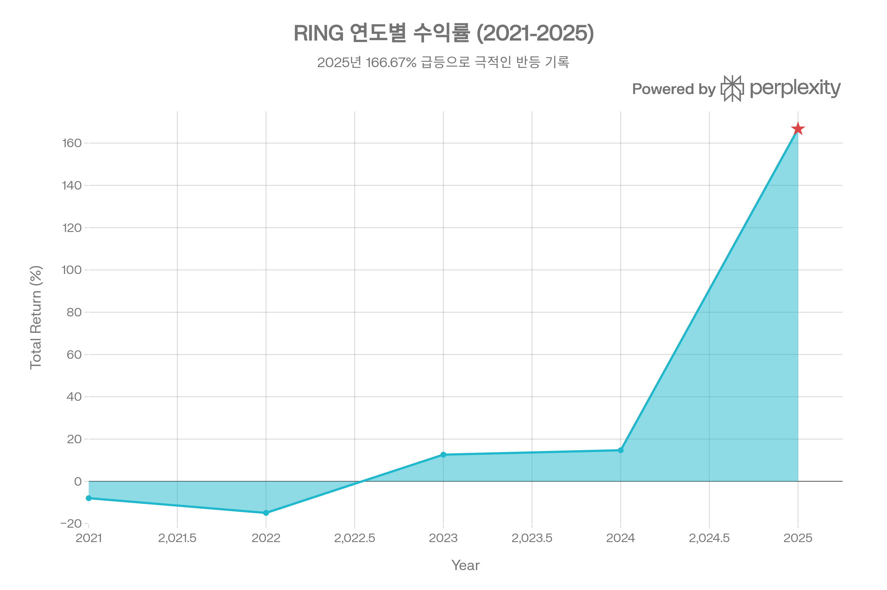
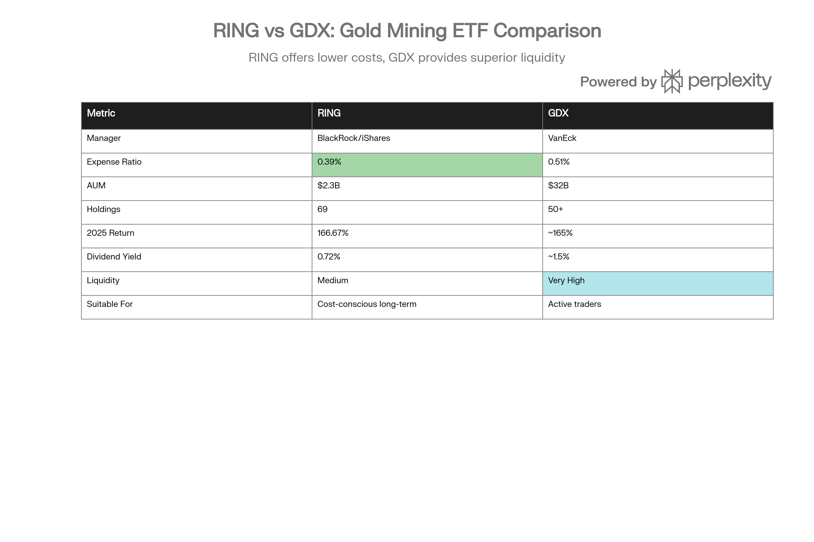

## 분류 근거

RING은 금이 아니라 순수 금광 채굴기업 주식에 투자하는 비레버리지 ETF로, 실물+채굴주를 함께 묶은 `ETF/Gold` 폴더의 기존 방식(GDX, GDXJ, GOAU)을 따라 같은 폴더로 분류했습니다.

## 개요

RING (iShares MSCI Global Gold Miners ETF)은 BlackRock이 iShares 브랜드로 2012년 1월 31일 출시한 금광 기업 ETF로, MSCI ACWI Select Gold Miners Investable Market Index (IMI)를 추종한다. 이 지수는 개발시장과 신흥시장의 금 채굴 기업 중 금 가격을 헤징하지 않는 순수 금광주만을 선별하여, 금 가격 상승 시 최대 레버리지 효과를 제공하도록 설계되었다.[^1][^2][^3][^4][^5][^6]

RING의 가장 큰 특징은 GDX(VanEck Gold Miners ETF)의 저비용 대안으로 포지셔닝되어 있다는 점이다. 운용보수 0.39%는 GDX(0.51%)보다 0.12%포인트 저렴하며, 69개 금광 기업에 글로벌 분산 투자하여 캐나다(54.62%), 미국(19.38%), 아프리카(12.26%) 등 주요 금 생산 국가를 망라한다. 상위 10개 종목이 73.45%를 차지하지만, MSCI 25/50 규칙으로 단일 종목 최대 25%, 상위 5개 종목 합계 최대 50%로 집중도를 제한하여 리스크를 완화한다.[^7][^8][^9][^4][^5]

2025년 RING은 금 가격의 역사적 강세를 금광주의 운영 레버리지로 증폭시키며 166.67%의 폭발적 수익률을 기록했다. 금 가격이 58% 상승하는 동안, RING은 약 2.9배의 레버리지 효과를 발휘하여 금광 기업의 고정 채굴 비용 구조가 만들어내는 이익 증폭을 그대로 반영했다. 그러나 2021\~2024년에는 금 가격 횡보로 -7.97%\~+14.72% 범위의 저조한 성과를 보였으며, 설정 이후 연환산 수익률은 4.14%로 금 현물(IAU 11.57%)에 크게 못 미친다. 이는 금광주가 금 가격 상승 시 레버리지 효과를 제공하지만, 하락이나 횡보 시에는 기업 고유 리스크(생산량 감소, 비용 상승, 경영 문제)로 인해 금 현물보다 저조한 성과를 낸다는 구조적 특성을 보여준다.[^10][^2][^1]

2026년 금 시장은 골드만삭스의 5,400달러 목표가, 연준의 추가 금리 인하 전망, 중앙은행의 지속적 금 매입 등으로 낙관적 전망이 우세하다. RING은 이러한 금 사이클을 추종하는 단순하고 효율적인 도구로, GDX보다 낮은 비용을 선호하는 장기 투자자에게 강력한 대안이다.[^11][^12]

***

## RING (iShares MSCI Global Gold Miners ETF) 기본 정보

| 항목 | 내용 |
| :-- | :-- |
| **티커** | RING (NASDAQ) |
| **운용사** | BlackRock, Inc. (iShares) |
| **설정일** | 2012년 1월 31일 |
| **추종 지수** | MSCI ACWI Select Gold Miners Investable Market Index (IMI) |
| **운용자산(AUM)** | \$1.53B \~ \$2.30B (2026년 1월) |
| **현재가** | \~\$91.41 (2026년 1월 23일) |
| **NAV** | \$91.11 (2026년 1월 23일) |
| **Premium/Discount** | +0.16\~0.20% (소폭 프리미엄) |
| **운용보수(Expense Ratio)** | 0.39% |
| **발행 주식수** | 34.00M |
| **보유 종목수** | 69개 |
| **배당수익률** | 0.72\~1.13% |
| **배당 빈도** | 반기별 (Semi-Annual) |
| **운용 스타일** | Passive (패시브, 지수 추종) |

출처: iShares, BlackRock[^1][^2][^3][^13]

RING은 MSCI ACWI Select Gold Miners Investable Market Index (IMI)를 추종하는 완전 복제(Full Replication) 방식의 패시브 ETF다. 이 지수는 MSCI가 개발한 것으로, 다음과 같은 엄격한 선정 기준을 적용한다:[^3][^4][^5][^6]

**1. 금 채굴 수익 기준:** 매출의 대부분을 금 채굴에서 창출하는 기업만 포함. GICS(Global Industry Classification Standard) 분류로 확인한다.

**2. 금 헤징 제외:** 금 가격 헤징(hedging)을 하는 기업은 제외한다. 이는 RING이 순수하게 금 가격에 노출되도록 보장하며, 금값 상승 시 최대 수혜를 입도록 설계된 것이다.[^4][^5]

**3. 운영 금광 보유:** 금 채굴을 직접 운영하지 않고 투자만 하는 기업(로열티 기업 제외)이나, 금 생산에서 매출을 전혀 창출하지 않는 기업은 제외한다.[^4]

**4. MSCI 25/50 규칙:** 단일 종목 최대 25%, 상위 5개 종목 합계 최대 50%로 집중도를 제한한다. 이는 과도한 집중 리스크를 방지하기 위함이다.[^5][^4]

**5. 최소 30개 기업:** 지수는 최소 30개 이상의 금광 기업을 포함하여 분산 효과를 보장한다.[^3]

이러한 기준으로 선정된 지수는 2025년 7월 기준 약 36개 기업, 총 시가총액 \$230.43B로 구성되며, RING은 이 지수를 69개 기업으로 확대하여 추종한다.[^14][^5][^3]

***

## RING (iShares MSCI Global Gold Miners ETF) 성과 분석

### 수익률 실적 (2025년 12월 31일 기준)

2025년 RING은 금광주 시장의 역사적 강세를 그대로 반영하며 Total Return 기준 166.67%의 폭발적 수익률을 기록했다. 이는 RING 설정 이후 최고 수익률이며, 벤치마크(MSCI ACWI Select Gold Miners IMI Index)의 166.43% 대비 0.24%포인트 높은 수준으로 추종 효율이 매우 양호하다.[^1][^2]

| 기간 | Total Return (%) | Market Price (%) | Benchmark (%) | 추종 차이 |
| :-- | :-- | :-- | :-- | :-- |
| **YTD (2025)** | 166.67 | 164.75 | 166.43 | +0.24%p |
| **1개월** | 5.40 | 4.65 | 5.53 | -0.13%p |
| **3개월** | 15.17 | 14.40 | 14.57 | +0.60%p |
| **6개월** | 69.57 | 69.09 | 69.85 | -0.28%p |
| **1년** | 166.67 | 164.75 | 166.43 | +0.24%p |
| **3년 (누적)** | 244.54 | 244.97 | 243.38 | +1.16%p |
| **5년 (누적)** | 169.78 | 169.35 | 167.76 | +2.02%p |
| **10년 (누적)** | 677.68 | 671.44 | 680.99 | -3.31%p |
| **설정 후 (누적)** | 75.81 | 75.35 | 77.51 | -1.70%p |

출처: iShares, BlackRock[^2][^1]

RING의 추종오차는 대부분 기간에서 ±0.6%포인트 이내로 매우 작으며, 이는 완전 복제 방식과 0.39%의 합리적 운용보수가 효율적으로 작동함을 입증한다. 10년 누적 성과에서 -3.31%포인트의 차이는 운용보수 누적(10년 × 0.39% = 3.9%)과 거의 일치하므로, RING이 비용 외에는 거의 완벽하게 벤치마크를 추종하고 있음을 보여준다.

### 연환산 수익률: 장기 성과의 한계

| 기간 | RING 연환산 (%) | 벤치마크 연환산 (%) |
| :-- | :-- | :-- |
| **1년** | 166.67 | 166.43 |
| **3년** | 51.04 | 50.87 |
| **5년** | 21.96 | 21.77 |
| **10년** | 22.77 | 22.82 |
| **설정 후** | 4.14 | 4.21 |

출처: iShares, BlackRock[^1][^2]

RING의 3년, 5년, 10년 연환산 수익률은 각각 51.04%, 21.96%, 22.77%로 강력하지만, 설정 후 연환산 수익률은 4.14%에 불과하다. 이는 2012\~2020년 금 가격 횡보와 2021\~2024년 부진한 성과가 누적된 결과다. 금 현물 ETF인 IAU의 설정 후 연환산 11.57%와 비교하면, RING은 7.43%포인트나 낮다.[^2][^15][^1]

이는 금광주의 구조적 특성을 반영한다. 금광 기업은 금 가격 상승 시 운영 레버리지로 금 현물보다 높은 수익을 제공하지만, 금 가격이 하락하거나 횡보할 때는 채굴 비용 상승, 생산량 감소, 경영 문제 등 기업 고유 리스크로 인해 금 현물보다 저조한 성과를 낸다. 따라서 RING은 금 가격이 명확한 상승 추세일 때만 금 현물 대비 우월한 성과를 발휘한다.

### 연도별 수익률: 극심한 변동성

RING의 2021년부터 2025년까지 연도별 수익률. 2025년 금광주 역사적 강세로 166.67% 폭발적 상승.

RING의 연도별 수익률은 금 가격의 사이클을 극단적으로 증폭시킨다. 2021년 -7.97%, 2022년 -14.92%는 연준의 공격적 금리 인상으로 금값이 조정받은 시기를 반영하며, 금광주는 금 현물보다 훨씬 큰 폭으로 하락했다. 2023년 12.62%, 2024년 14.72%는 금리 인상 속도 둔화와 함께 회복세를 보였지만, 금 현물(2024년 26.75%)에는 못 미쳤다.[^1][^2]

2025년 166.67%는 RING 역사상 최고 수익률이며, 금 가격이 58% 급등하는 동안 금광 기업들의 이익이 고정 채굴 비용 구조로 인해 폭발적으로 증가한 결과다. 금값이 온스당 \$2,600에서 \$4,040까지 상승하며, 금광 기업들은 채굴 비용(\$1,000\~1,200/oz)이 거의 고정된 상태에서 마진이 급증했다. 예를 들어, 금값 \$2,600일 때 마진 \$1,400\~1,600/oz였던 것이, \$4,040일 때는 마진 \$2,840\~3,040/oz로 약 2배 증가했고, 이는 주가로 직결되었다.[^10][^2][^1]

### 금 vs 금광주 레버리지 효과

2025년 금 가격 58% 상승에 대해 RING이 166.67% 상승한 것은 약 2.88배의 레버리지 효과다. 이는 금광 기업의 운영 레버리지(Operating Leverage)로 설명된다:[^1][^10]

**운영 레버리지 메커니즘:**

- 금 채굴 비용은 대부분 고정비(인건비, 장비 감가상각, 에너지)와 변동비(소모품)로 구성
- 금값 상승 시 고정비는 변하지 않으므로, 추가 매출은 거의 전액 이익으로 귀속
- 예: 금값 \$2,600 → \$4,040 (+55%) 시, 채굴 비용 \$1,200 고정 가정
    - 이전 마진: \$2,600 - \$1,200 = \$1,400
    - 이후 마진: \$4,040 - \$1,200 = \$2,840 (약 +103%)
    - 마진 증가율은 금값 증가율의 약 2배

RING의 2.88배 레버리지는 이 운영 레버리지(약 2배)에 주가 멀티플 확대(금값 상승 시 투자 심리 개선으로 P/E 비율 상승) 효과가 더해진 결과다.

***

## RING (iShares MSCI Global Gold Miners ETF) 비용 및 효율성

### 운용보수: GDX의 저비용 대안

RING의 운용보수 0.39%는 주요 금광주 ETF 중 중간 수준이지만, 가장 인기 있는 경쟁 ETF인 GDX(0.51%)보다 0.12%포인트 저렴하다. 이는 RING이 GDX의 '저비용 대안'으로 포지셔닝되는 핵심 이유다.[^1][^2][^8][^9]

| ETF | 운용보수 | RING 대비 차이 | 1억 원 투자 시 10년 비용 차이 |
| :-- | :-- | :-- | :-- |
| **RING** | 0.39% | - | 390만 원 (기준) |
| **GDX** | 0.51% | +0.12%p | 510만 원 (+120만 원) |
| **GDXJ** | 0.52% | +0.13%p | 520만 원 (+130만 원) |
| **SGDM** | 0.57% | +0.18%p | 570만 원 (+180만 원) |

출처: 각 운용사[^16][^8][^9][^17][^1]

장기 투자 시 0.12%포인트의 비용 차이는 복리로 누적되어 상당한 수익 차이를 만든다. 예를 들어, 1억 원을 20년간 투자하고 금광주 지수가 연 10% 상승한다고 가정할 때, RING(0.39%) 대비 GDX(0.51%)의 0.12%포인트 추가 비용은 약 250만 원의 손실로 귀결된다. 30년 장기 투자 시에는 약 600만 원의 차이가 발생한다.

그러나 RING의 비용 우위는 유동성 트레이드오프를 수반한다. GDX는 일평균 거래량이 수천만 주, 거래금액이 수억 달러로 금광주 ETF 중 압도적 유동성을 자랑하는 반면, RING은 일평균 거래량 28\~48만 주, 거래금액 약 \$30M\~50M 수준으로 GDX의 10분의 1 미만이다. 대형 기관 투자자나 초단기 트레이더에게는 GDX의 높은 유동성이 0.12%포인트 추가 비용을 상쇄하고도 남지만, 일반 개인 투자자가 장기 보유한다면 RING의 비용 우위가 더 큰 가치를 제공한다.[^3][^14][^18][^16]

### Premium/Discount: NAV 추종 양호

RING은 2026년 1월 23일 기준 NAV \$91.11에 대해 시장가 \$91.41로 +0.16\~0.20%의 소폭 프리미엄으로 거래되고 있다. 이는 ETF가 NAV를 정확히 추종하고 있으며, Authorized Participants의 차익거래가 효과적으로 작동함을 보여준다. 역사적으로도 RING의 프리미엄/할인은 ±1% 범위 내로 유지되어, NAV 추종 효율이 양호하다.[^1][^13][^19]

***

## RING (iShares MSCI Global Gold Miners ETF) 포트폴리오 구성

### 보유 종목: 69개 글로벌 금광 기업

RING은 69개의 금광 기업을 보유하며, 이는 GDX(50개+)보다 많은 수준으로 분산 효과를 높인다. 보유 종목은 MSCI ACWI Select Gold Miners IMI Index의 기준을 충족하는 글로벌 금광 기업들로, 시가총액 가중 방식으로 구성된다.[^3][^14][^7][^4][^5]

**상위 10개 종목 (2026년 1월 기준):**

| 순위 | 종목명 | 티커 | 비중 (%) | 국가 |
| :-- | :-- | :-- | :-- | :-- |
| 1 | **Newmont Corporation** | NEM | 14.89\~16.46 | 미국 |
| 2 | **Agnico Eagle Mines** | AEM | 13.44\~14.41 | 캐나다 |
| 3 | **Barrick Gold Corp** | GOLD | 8.13\~9.55 | 캐나다 |
| 4 | **Wheaton Precious Metals** | WPM | 6.51\~7.01 | 캐나다 |
| 5 | **Kinross Gold Corp** | KGC | 4.42\~4.51 | 캐나다 |
| 6 | **Gold Fields Ltd** | GFI | 4.19\~4.83 | 남아공 |
| 7 | **AngloGold Ashanti PLC** | AU | 4.19\~4.40 | 남아공 |
| 8 | **Zijin Mining Group H** | 2899.HK | 3.52\~4.00 | 중국 |
| 9 | **Alamos Gold** | AGI | 3.22\~3.40 | 캐나다 |
| 10 | **Harmony Gold Mining** | HARJ | 2.56\~2.74 | 남아공 |

**Top 10 합계:** 73.45%[^5]
**Top 5 합계:** 48.30%[^7]

출처: iShares, MSCI[^20][^19][^7][^5]

상위 10개 종목이 73.45%를 차지하여 집중도가 높지만, MSCI 25/50 규칙으로 단일 종목 최대 25%, 상위 5개 종목 합계 최대 50%로 제한되어 과도한 집중 리스크를 방지한다. Newmont(16.46%)와 Agnico Eagle(14.41%)가 각각 1, 2위를 차지하며, 이 두 기업은 세계 최대 금 생산 기업으로 안정적 생산량과 강한 재무 구조를 자랑한다.[^4][^5]

### 지역 배분: 캐나다·미국·아프리카 중심

RING의 지역 배분은 주요 금 생산 국가를 망라한다:[^7]

| 지역 | 비중 (%) | 주요 국가 |
| :-- | :-- | :-- |
| **캐나다** | 54.62 | 세계 5위권 금 생산국 |
| **미국** | 19.38 | Newmont 본사 |
| **아프리카** | 12.26 | 남아공, 가나 등 |
| **신흥 아시아** | 6.36 | 중국, 호주 등 |
| **호주** | 4.40 | 세계 2위 금 생산국 |
| **기타** | 2.96 | 남미 등 |

출처: iShares[^7]

캐나다가 54.62%로 가장 큰 비중을 차지하는 이유는, 세계 주요 금광 기업들(Barrick Gold, Agnico Eagle, Kinross Gold, Wheaton Precious Metals 등)이 캐나다에 본사를 두고 있기 때문이다. 캐나다는 정치적 안정성, 우수한 광업 규제, 선진 금융 시스템으로 금광 기업들이 선호하는 상장지다. 미국(19.38%)은 Newmont의 본사 소재지이며, 아프리카(12.26%)는 남아공의 Gold Fields, AngloGold Ashanti, Harmony Gold 등이 주요 비중을 차지한다.

이러한 지역 분산은 RING이 단일 국가 리스크에 노출되지 않도록 보호한다. 예를 들어, 남아공의 정치적 불안이나 전력 부족 문제가 발생해도, RING의 아프리카 노출은 12.26%에 불과하므로 전체 포트폴리오에 미치는 영향은 제한적이다.

### 섹터 및 자산 배분

RING은 금광 기업에만 집중하므로, 섹터 배분은 Basic Materials(금속·광산)가 99.83%를 차지한다. 나머지 0.17%는 Financial Services, Energy, Technology, Industrials 등 소수 종목이 부수적으로 보유한 것으로, 실질적으로는 금광 섹터 100% 노출로 간주할 수 있다.[^7]

자산 유형 배분은 Non-US Stock(80.61%), US Stock(19.38%), Cash(0.01%)로 구성되며, 채권이나 파생상품은 보유하지 않는다. 이는 RING이 순수하게 금광 기업 주식에만 투자하며, 레버리지나 헤징을 하지 않음을 의미한다.[^7]

***

## RING (iShares MSCI Global Gold Miners ETF) vs GDX 비교

RING vs GDX 비교. RING은 0.12%p 낮은 비용으로 GDX의 저비용 대안, GDX는 압도적 유동성.

RING과 GDX는 모두 글로벌 금광 기업에 투자하는 시가총액 가중 ETF로 유사하지만, 비용·유동성·집중도에서 차별화된다.[^16][^8][^18][^9]

### 주요 차이점

**1. 운용보수: RING 0.12%p 저렴**

RING 0.39% vs GDX 0.51%로, RING이 0.12%포인트 저렴하다. 이는 장기 투자 시 상당한 비용 절감을 가져온다. 1억 원을 20년 투자 시 약 250만 원, 30년 투자 시 약 600만 원의 차이가 발생한다.[^8][^9]

**2. AUM 및 유동성: GDX 압도적**

GDX의 AUM \$29.1B는 RING(\$1.5\~2.3B)의 14\~21배이며, 일평균 거래량도 GDX가 수천만 주로 RING(28\~48만 주)의 50\~100배에 달한다. 이는 GDX가 대형 기관 투자자와 초단기 트레이더에게 압도적으로 유리함을 의미한다. 비드-애스크 스프레드도 GDX가 훨씬 좁아 거래 비용이 낮다.[^3][^14][^16][^9]

**3. 보유 종목수: RING 더 분산**

RING 69개 vs GDX 50개+로, RING이 약 20\~40% 더 많은 종목을 보유하여 분산 효과가 높다. 그러나 상위 10개 종목 비중은 둘 다 70% 이상으로 집중도는 유사하다.[^14][^16][^3]

**4. 추종 지수: 약간 다름**

RING은 MSCI ACWI Select Gold Miners IMI Index를 추종하고, GDX는 NYSE Arca Gold Miners Index를 추종한다. RING의 지수는 금 헤징 제외 기준이 명시적이며, MSCI 25/50 규칙으로 집중도를 제한한다. GDX는 Market Vector 지수(2021년까지)에서 NYSE Arca로 변경되었으며, 집중도 제한이 덜 엄격하다.[^1][^4][^5]

**5. 성과: 거의 동일**

2025년 YTD 기준 RING 166.67% vs GDX \~165%(원출처 기준; [GDX 자체 포스트](/blog/etf/gold/gdx/gdx-vaneck-gold-miners-etf)는 98.76\~155.61%로 보고)로 대체로 유사한 수준이다. 2026년 1월 YTD도 RING 24.13% vs GDX 24.78%로 0.65%포인트 차이에 불과하다. 장기 성과도 유사하여, 두 ETF 모두 금광주 섹터를 정확히 추종한다.[^2][^16][^21][^9][^1]

### 선택 기준

**GDX 선택:**

- 초단기 트레이딩 (일일\~주간 단위)
- 대량 거래 (\$수백만 이상)
- 최고 유동성 필요 (좁은 스프레드)
- VanEck 브랜드 선호

**RING 선택:**

- 중장기 투자 (수개월\~수년)
- 비용 절감 최우선 (0.12%p 저렴)
- 소액\~중액 거래 (\$수만\~수백만)
- BlackRock/iShares 브랜드 선호
- 더 많은 종목 분산 선호

일반 개인 투자자가 장기 보유한다면 RING의 낮은 비용이 유리하지만, 활발한 단기 트레이딩을 한다면 GDX의 높은 유동성이 더 중요하다.[^18]

***

## RING (iShares MSCI Global Gold Miners ETF) 배당

### 배당 정책: 반기별 소액 배당

RING은 반기별로 배당을 지급하지만, 배당수익률은 0.72\~1.13%로 낮은 편이다. 최근 배당은 \$0.24(2025년 6월 20일), \$0.38(2025년 12월 19일)으로, 연간 배당금은 약 \$0.45다.[^3][^13][^22]

**RING 배당 정보:**

| 항목 | 내용 |
| :-- | :-- |
| **배당수익률** | 0.72\~1.13% |
| **연간 배당금** | \$0.45 |
| **배당 빈도** | 반기별 (Semi-Annual) |
| **Payout Ratio** | 15.42\~17.79% |
| **배당 성장률 (1년)** | -2.96% |
| **마지막 배당금** | \$0.24 (2025년 6월), \$0.38 (2025년 12월) |
| **Ex-Dividend Date** | 2025년 6월 16일, 12월 16일 |

출처: StockAnalysis, TradingView[^13][^22][^3]

RING의 배당수익률 0.72\~1.13%는 GDX(\~1.5%)보다 낮지만, 금 현물 ETF(IAU, GLD 무배당)보다는 높다. 배당 성장률이 -2.96%로 마이너스인 것은 2024년 배당이 2023년보다 감소했음을 의미하며, 이는 금광 기업들의 배당 정책이 금 가격과 생산량에 따라 변동성이 크다는 점을 반영한다.[^16]

Payout Ratio 15.42\~17.79%는 금광 기업들이 이익의 약 15\~18%만 배당으로 지급하고, 나머지는 재투자(광산 개발, 설비 투자)나 부채 상환에 사용함을 의미한다. 이는 금광 업계의 자본집약적 특성과 일치한다.

### 배당 vs 시세차익

RING의 주요 수익원은 배당이 아닌 시세차익이다. 2025년 기준 배당수익률 1.13%에 비해 시세차익은 166.67%로, 배당은 전체 수익의 0.7%에 불과하다. 따라서 RING은 배당 수익을 기대하는 투자자보다, 금 가격 상승에 따른 자본이득을 추구하는 투자자에게 적합하다.[^1][^3][^13]

***

## RING (iShares MSCI Global Gold Miners ETF) 2026년 투자 전망

### 금 시장 전망: 낙관론 우세

2026년 금 시장은 주요 투자은행들의 낙관적 전망이 우세하다. 골드만삭스는 금 가격 목표를 5,400달러로 상향 조정했으며, 이는 현재 수준(\$5,000) 대비 약 8% 추가 상승 여력을 시사한다. RING은 금 가격 상승을 운영 레버리지로 증폭시키므로, 금값 8% 상승 시 RING은 약 15\~20% 상승이 예상된다.[^12]

**금 가격 상승 동력:**

**1. 연준 금리 인하:** 골드만삭스는 2026년 연준이 50bp 추가 금리 인하를 단행할 것으로 전망한다. 금리 인하는 실질 금리를 낮춰 무이자 자산인 금의 상대적 매력을 높인다.[^11][^12]

**2. 중앙은행 금 매입:** 2026년 중앙은행들이 월 60\~70톤, 연 720\~840톤의 금을 매입할 것으로 예상된다. 탈달러화 트렌드로 신흥시장 중앙은행들이 외환보유액을 다변화하기 위해 금을 선호한다.[^11][^12]

**3. 지정학적 리스크:** 우크라이나 전쟁, 중동 분쟁, 미중 갈등 등 지정학적 불확실성은 안전자산 수요를 지속시킨다.[^11]

**4. 달러 약세:** 연준의 금리 인하와 미국 재정적자 확대는 달러 약세를 초래하며, 달러 표시 자산인 금은 가격 상승 압력을 받는다.[^12][^11]

### RING 전망: 금광주의 레버리지 효과

RING은 금 가격 상승을 운영 레버리지로 증폭시키므로, 2026년 금값이 5,400달러에 도달하면 RING도 추가 상승이 예상된다. 그러나 금광주는 금 현물보다 변동성이 크므로, 금값이 조정받으면 RING도 더 큰 폭으로 하락할 수 있다.[^11]

**RING 2026년 시나리오:**

| 시나리오 | 금 가격 | 금 상승률 | RING 예상 상승률 | RING 목표가 (현재 \$91) |
| :-- | :-- | :-- | :-- | :-- |
| **낙관** | \$5,400 | +8% | +15\~20% | \$105\~109 |
| **기본** | \$4,800\~5,200 | -4\~+4% | -10\~+10% | \$82\~100 |
| **비관** | \$4,000 이하 | -20% 이상 | -40\~50% | \$46\~55 |

출처: 주요 투자은행 전망 종합[^12][^11]

낙관 시나리오는 금값 5,400달러 달성과 함께 금광 기업들의 이익이 급증하여 RING이 +15\~20% 상승하는 경우다. 현재가 \$91 기준 목표가는 \$105\~109로, 투자자는 약 15\~20%의 추가 수익을 기대할 수 있다.

기본 시나리오는 금값이 \$4,800\~5,200 범위에서 박스권 등락하며, RING은 ±10% 범위로 변동하는 것이다. 이 경우 RING은 현재 수준 근처에서 횡보할 가능성이 높다.

비관 시나리오는 연준의 매파적 전환(금리 인상 재개)으로 금값이 \$4,000 이하로 급락하는 경우다. 금광 기업들은 채굴 비용이 고정되어 있으므로 마진이 급감하고, RING은 금 현물보다 2\~3배 큰 폭으로 하락할 수 있다. -40\~50% 하락 시 RING은 \$46\~55로 추락할 위험이 있다.

### 투자 권장사항

**2026년 RING 투자 전략:**

**1. 장기 보유 지속 (추천, 보수적):**
RING을 이미 보유한 투자자는 장기 보유를 지속하되, 포트폴리오 비중이 15%를 초과하면 일부 익절하여 리밸런싱한다. 금 시장의 구조적 상승 트렌드는 여전히 유효하다.[^11]

**2. 단기 조정 시 매수 (추천, 공격적):**
금값이 \$4,400\~4,600으로 조정받으면 RING을 추가 매수하여 평균 단가를 낮춘다. 금광주는 금 현물보다 변동성이 크므로, 조정 시 더 큰 폭으로 하락하여 매수 기회를 제공한다.

**3. 포트폴리오 배분:**
RING은 포트폴리오의 5\~15% 배분이 적절하다. 금광주는 안전자산이 아니라 '금 가격에 레버리지를 건 위험자산'이므로, 과도한 배분은 피해야 한다.

**4. GDX와 비교 검토:**
초단기 트레이딩을 한다면 GDX의 높은 유동성이 유리하지만, 중장기 보유한다면 RING의 낮은 비용(0.12%p 차이)이 더 큰 가치를 제공한다.[^16][^8][^18]

**5. 금 현물과 병행:**
RING은 금 가격 상승 시 레버리지 효과를 제공하지만, 하락 시에도 손실이 증폭된다. 보수적 투자자는 RING과 함께 금 현물 ETF(IAU, IAUM)를 병행 보유하여 리스크를 완화할 수 있다.

***

## RING (iShares MSCI Global Gold Miners ETF) 투자 고려사항

### 강점

**1. GDX보다 낮은 비용:**
0.39%는 GDX(0.51%)보다 0.12%포인트 저렴하며, 장기 투자 시 상당한 비용 절감을 가져온다. 20년 투자 시 약 250만 원, 30년 투자 시 약 600만 원의 차이가 발생한다.[^8][^9]

**2. 정확한 벤치마크 추종:**
추종오차가 대부분 기간에서 ±0.6%포인트 이내로 매우 작으며, 완전 복제 방식과 합리적 운용보수가 효율적으로 작동한다.[^1][^2]

**3. 글로벌 분산:**
69개 금광 기업에 투자하여 캐나다(54.62%), 미국(19.38%), 아프리카(12.26%) 등 주요 금 생산 국가를 망라한다. 단일 국가 리스크를 완화한다.[^7]

**4. 2025년 폭발적 성과:**
166.67% 수익률은 금 가격 58% 상승을 약 2.9배로 증폭시킨 결과로, 금광주의 운영 레버리지 효과를 입증했다.[^10][^2][^1]

**5. BlackRock/iShares 브랜드:**
세계 최대 자산운용사 BlackRock의 iShares 브랜드는 높은 신뢰도와 투명성을 제공한다.[^3][^13]

**6. MSCI 25/50 규칙:**
과도한 집중도를 방지하여 단일 종목 리스크를 완화한다.[^4][^5]

**7. 금 헤징 제외:**
금 가격을 헤징하지 않는 순수 금광주만 포함하여, 금값 상승 시 최대 수혜를 입는다.[^5][^6][^4]

### 약점

**1. 낮은 유동성:**
일평균 거래량 28\~48만 주, 거래금액 \$30M\~50M은 GDX(수천만 주, 수억 달러)의 10분의 1 미만이다. 대형 기관 투자자나 초단기 트레이더에게는 불리하다.[^3][^14][^16]

**2. 작은 AUM:**
\$1.5\~2.3B는 GDX(\$29.1B)의 5\~7%에 불과하며, 규모의 경제 측면에서 불리하다.[^9]

**3. 장기 성과 저조:**
설정 후 연환산 4.14%는 금 현물 IAU(11.57%)에 크게 못 미치며, 금 가격이 횡보하거나 하락할 때 금광주의 기업 고유 리스크가 성과를 저해함을 보여준다.[^1][^15]

**4. 극심한 변동성:**
2021\~2025년 연도별 수익률이 -14.92%\~+166.67% 범위로 변동하며, 금 현물보다 2\~3배 높은 변동성을 갖는다. 감정 통제가 어려운 투자자에게는 부적합하다.[^2][^1]

**5. 낮은 배당:**
배당수익률 0.72\~1.13%는 현금 흐름을 필요로 하는 투자자에게 불충분하다.[^13][^22][^3]

**6. 기업 고유 리스크:**
금광 기업은 생산량 감소, 채굴 비용 상승, 경영 문제, 국가 리스크(광산 국유화, 세금 인상) 등 금 가격 외 다양한 변수에 노출된다.

**7. 2021\~2024 부진:**
금 가격이 횡보한 2021\~2024년 RING은 -14.92%\~+14.72% 범위로 저조한 성과를 보였으며, 금 현물보다 못한 수익률을 기록했다.[^1][^2]

### 리스크

**1. 금 가격 하락 리스크:**
금값 급락 시 RING은 금 현물보다 2\~3배 큰 폭으로 하락한다. 연준의 금리 인상 재개는 최악의 시나리오다.

**2. 운영 레버리지의 양날의 검:**
금값 상승 시 이익 증폭 효과가 있지만, 하락 시에도 손실이 증폭된다. 금값 -20% 하락 시 RING은 -40\~50% 폭락 가능하다.

**3. 기업 고유 리스크:**
개별 금광 기업의 생산량 감소, 광산 사고, 경영진 교체, 부채 증가 등은 금 가격과 무관하게 주가에 악영향을 미칠 수 있다.

**4. 국가 리스크:**
남아공의 정치적 불안, 전력 부족, 광산 국유화 위협 등은 아프리카 노출 12.26%에 리스크를 가져온다.[^7]

**5. 환율 리스크:**
RING의 캐나다 노출 54.62%는 캐나다 달러 약세 시 환율 손실을 초래할 수 있다. 미국 투자자는 이 리스크를 감수해야 한다.[^7]

**6. 유동성 리스크:**
시장 패닉 시 RING의 거래량이 급감하여 원하는 가격에 매도하기 어려울 수 있다. GDX보다 유동성이 낮으므로 비드-애스크 스프레드가 확대될 위험이 있다.

**7. 집중도 리스크:**
상위 10개 종목이 73.45%를 차지하므로, 이들 기업의 실적 악화는 RING 전체 성과에 큰 영향을 미친다.[^5]

### 투자자 적합성

**적합한 투자자:**

- 금 가격 상승 시 레버리지 효과 추구
- 중장기 투자자 (6개월\~수년)
- 비용 절감 중시 (GDX 대비 0.12%p 저렴)
- 글로벌 금광주 섹터 전체 노출 희망
- 높은 변동성 감내 가능 (연 -15%\~+167%)
- BlackRock/iShares 브랜드 선호
- 소액\~중액 거래 (\$수만\~수백만)

**부적합한 투자자:**

- 금 현물 노출 선호 → IAU, IAUM 선택
- 초단기 트레이더 (일일\~주간) → GDX 선택 (최고 유동성)
- 위험 회피형 투자자 → 금 현물 ETF 선택
- 배당 수익 필요 → 배당주 선택
- 대량 거래 기관 투자자 → GDX 선택
- 레버리지 원하는 투자자 → NUGT 선택 (2배 레버리지)
- 중소형 금광주 선호 → GDXJ 선택

***

## 결론

RING (iShares MSCI Global Gold Miners ETF)은 글로벌 금광 기업에 투자하는 저비용 ETF로, GDX(0.51%)보다 0.12%포인트 저렴한 0.39%의 운용보수로 중장기 투자자에게 강력한 대안을 제공한다. 69개 금광 기업에 분산 투자하여 캐나다(54.62%), 미국(19.38%), 아프리카(12.26%) 등 주요 금 생산 국가를 망라하며, MSCI 25/50 규칙으로 과도한 집중 리스크를 방지한다.[^1][^2][^7][^8][^9][^4][^5]

RING의 핵심 가치는 금 가격 상승 시 운영 레버리지 효과다. 2025년 금 가격 58% 상승에 대해 RING은 166.67% 상승하여 약 2.9배의 레버리지를 발휘했으며, 이는 금광 기업의 고정 채굴 비용 구조가 만들어내는 이익 증폭을 그대로 반영했다. 그러나 2021\~2024년 금 가격 횡보 시에는 -14.92%\~+14.72% 범위의 저조한 성과를 보였고, 설정 후 연환산 수익률 4.14%는 금 현물 IAU(11.57%)에 크게 못 미친다. 이는 금광주가 금 가격 상승 시에만 금 현물 대비 우월한 성과를 발휘하며, 하락이나 횡보 시에는 기업 고유 리스크로 인해 저조한 성과를 낸다는 구조적 특성을 보여준다.[^10][^2][^1]

2026년 금 시장은 골드만삭스의 5,400달러 목표가, 연준의 추가 금리 인하 전망, 중앙은행의 지속적 금 매입 등으로 낙관적 전망이 우세하며, RING은 이러한 금 사이클을 추종하는 단순하고 효율적인 도구다. 금값 8% 추가 상승 시 RING은 운영 레버리지로 약 15\~20% 상승이 예상되어, 목표가 \$105\~109로 설정할 수 있다. 그러나 금값이 조정받으면 RING은 금 현물보다 2\~3배 큰 폭으로 하락할 수 있으므로, 높은 변동성을 감내할 수 있는 투자자만 투자해야 한다.[^11][^12]

**투자 권장 요약:**

- **장기 보유 지속:** 포트폴리오 5\~15% 배분, 금 시장 구조적 강세 지속
- **단기 조정 시 매수:** 금값 \$4,400\~4,600 조정 시 추가 매수 기회
- **GDX와 비교:** 중장기 보유 시 RING의 낮은 비용(0.12%p) 유리, 초단기 트레이딩 시 GDX의 높은 유동성 유리
- **금 현물과 병행:** RING(레버리지) + IAU(안정성) 병행 보유로 리스크 완화
- **변동성 감내:** 연 -15%\~+167% 변동성 감내 가능한 투자자만 적합

**핵심 투자 포인트:**

1. **GDX의 저비용 대안:** 0.39% vs 0.51%, 0.12%p 절감
2. **금 가격 레버리지 효과:** 금 상승 시 2\~3배 증폭, 2025년 166.67% 폭등
3. **글로벌 분산:** 69개 기업, 캐나다·미국·아프리카 분산
4. **2026년 상승 잠재력:** 금값 5,400달러 목표, RING +15\~20% 예상
5. **낮은 유동성:** GDX 대비 10분의 1, 초단기 트레이딩 불리
6. **장기 성과 저조:** 설정 후 연환산 4.14%, 금 횡보 시 부진
7. **극심한 변동성:** 높은 변동성 감내 가능한 투자자만 적합

RING은 2026년 금 시장의 구조적 강세 속에서 금 가격 상승에 레버리지를 걸고자 하는 중장기 투자자에게 최적의 선택이다. 특히 GDX의 높은 비용이 부담스럽고, 초단기 트레이딩보다는 수개월\~수년 단위 보유를 계획한다면 RING의 0.12%포인트 낮은 운용보수는 장기적으로 상당한 비용 절감을 가져온다. 그러나 금 가격이 조정받거나 횡보할 때 RING은 금 현물보다 저조한 성과를 낼 수 있으므로, 투자자는 금 가격의 방향성을 신중히 판단한 후 진입해야 한다.[^2][^8][^9][^1]

***

**주요 출처**

1. iShares, BlackRock 공식 웹사이트 및 펙트시트[^1][^2]
2. MSCI ACWI Select Gold Miners IMI Index 자료[^4][^5][^6]
3. RING vs GDX 비교 분석[^16][^8][^18][^9]
4. 금 시장 전망 및 투자 전략[^12][^11]
5. RING 성과 및 포트폴리오 데이터[^20][^3][^13][^14][^7][^19]

**면책 조항**

본 보고서는 정보 제공 목적으로 작성되었으며, 투자 권유나 매매 추천이 아닙니다. RING은 금 가격 변동에 따라 금 현물보다 2\~3배 큰 폭의 손실이 발생할 수 있으며, 금광 기업의 고유 리스크(생산량 감소, 비용 상승, 경영 문제, 국가 리스크)에 노출됩니다. 2025년 166.67%의 폭발적 수익률은 과거 성과이며 미래 수익을 보장하지 않습니다. 투자 결정은 투자자 본인의 판단과 책임 하에 이루어져야 하며, 투자 손실 발생 시 작성자는 책임을 지지 않습니다. 투자 전 반드시 금광주 섹터의 변동성과 리스크를 충분히 이해하시기 바랍니다.

[^1]: https://www.ishares.com/us/products/239654/ishares-msci-global-gold-miners-etf

[^2]: https://www.blackrock.com/us/individual/products/239654/ishares-msci-global-gold-miners-etf

[^3]: https://stockevents.app/kr/stock/RING

[^4]: https://etfdb.com/index/msci-acwi-select-gold-miners-investable-market-index/

[^5]: https://www.msci.com/documents/10199/0376453e-c12a-4d42-9fb8-fe428527fa87

[^6]: https://www.msci.com/indexes/index/701928

[^7]: https://markets.ft.com/data/etfs/tearsheet/summary?s=RING%3ANMQ%3AUSD

[^8]: https://www.etfcentral.com/compare-etfs/RING-vs-GDX

[^9]: https://tickeron.com/compare/GDX-vs-RING/

[^10]: https://finance.yahoo.com/quote/RING/

[^11]: https://seekingalpha.com/article/4850124-ring-a-simple-and-effective-way-to-capture-golds-stronger-2026-outlook

[^12]: https://www.canadianminingreport.com/blog/gold-is-over-5-000-is-this-the-start-of-a-new-era-for-gold-stocks

[^13]: https://kr.tradingview.com/symbols/NASDAQ-RING/analysis/

[^14]: https://stockanalysis.com/etf/ring/

[^15]: https://www.ishares.com/us/products/239561/ishares-gold-trust-fund

[^16]: https://etfdb.com/tool/etf-comparison/GDX-RING/

[^17]: https://www.mezzi.com/blog/gdx-gdxj-ring-sgdm-gold-miner-etf-total-return

[^18]: https://appreciatewealth.com/blog/gdx-vs-ring-gold-miners-with-leverage-or-indexed-exposure

[^19]: https://www.poems.com.sg/etf-screener/NASDAQ-RING/

[^20]: https://kr.investing.com/etfs/ishares-msci-global-gold-miners-be

[^21]: https://portfolioslab.com/tools/stock-comparison/GDX/RING

[^22]: https://stockanalysis.com/etf/ring/dividend/

