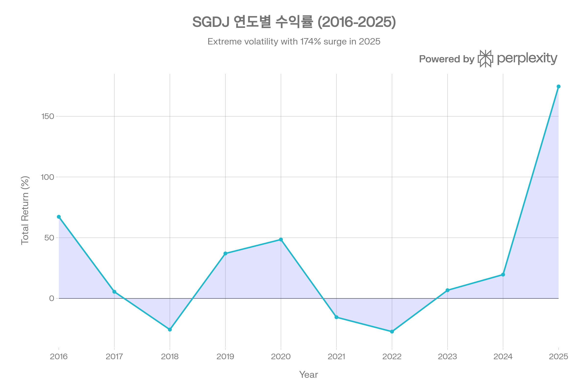
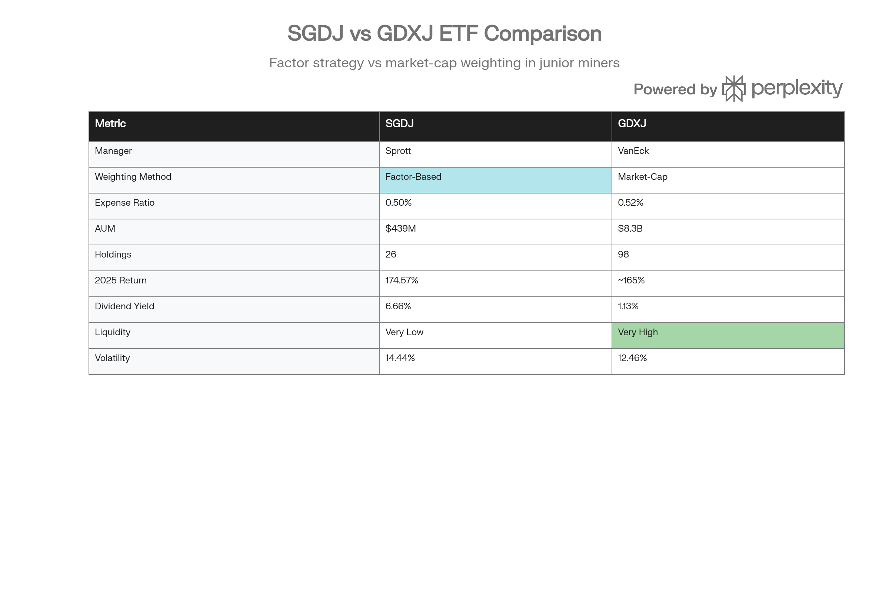

## 분류 근거

SGDJ는 소형 금광 채굴기업 주식에 투자하는 비레버리지 ETF로, 실물+채굴주를 함께 묶은 `ETF/Gold` 폴더(GDXJ 등)에 분류했습니다.

## 개요

SGDJ (Sprott Junior Gold Miners ETF)는 Sprott Asset Management가 2015년 3월 30일 출시한 소형 금광주(Junior Gold Miners) 전문 ETF로, Solactive Junior Gold Miners Custom Factors Index를 추종한다. 이 지수는 시가총액 \$200M\~\$2B(2026년 2월부터 \$3\~4B로 확대) 범위의 소형 금광 기업들을 대상으로, 단순 시가총액 가중이 아닌 **Factor-Based 가중** 방식을 채택하여 강한 펀더멘털을 가진 기업에 더 높은 비중을 부여한다는 점이 가장 큰 차별점이다.[^1][^2][^3][^4]

SGDJ의 Factor-Based 가중은 두 가지 핵심 요소로 구성된다. **Junior Producers(생산 단계 금광 기업)**에게는 **12개월 매출 성장률(Revenue Growth)**을, **Junior Explorers(탐사 단계 금광 기업)**에게는 **12개월 주가 모멘텀(Price Momentum)**을 적용하여 가중치를 결정한다. 이는 경쟁 ETF인 GDXJ(VanEck Junior Gold Miners ETF)의 시가총액 가중 방식과 근본적으로 다르며, 금 가격 급등 시 강한 모멘텀을 가진 기업들에 더 많은 비중을 할애하여 추가 수익을 창출할 수 있다. 실제로 2025년 SGDJ는 174.57%의 폭발적 수익률을 기록하며 GDXJ(\~165%)를 약 9\~10%포인트 상회했다.[^5][^6][^3][^4][^1]

그러나 SGDJ는 AUM \$438.6M, 일평균 거래량 약 3만 주로 GDXJ(AUM \$8.3B, 일거래량 400만+ 주)의 5%에 불과한 규모와 1/100 미만의 유동성으로 인해 대형 기관 투자자나 초단기 트레이더에게는 부적합하다. 또한 보유 종목수 26개는 GDXJ(98개)의 1/4 수준으로 분산 효과가 제한적이며, 연도별 수익률이 -27.30%(2022)\~+174.57%(2025) 범위로 극심한 변동성을 보인다. 배당수익률은 4.18\~6.66%로 GDXJ(1.13%)보다 훨씬 높지만, 연간 배당금이 -91%\~+367% 범위로 변동하여 안정적이지 않다.[^7][^8][^9][^10][^11][^12][^6][^1]

2026년 2월 1일부터 Solactive는 지수 방법론을 변경하여 시가총액 상한을 \$2B에서 \$3\~4B로 확대하며, 최소 25개·최대 30개 종목 규칙을 신설한다. 이는 2025년 금 가격 급등으로 많은 Junior Gold 기업들이 \$2B를 초과하여 지수에서 제외되는 문제를 해결하기 위한 조치지만, 일부 Mid-Cap 금광주가 포함되어 SGDJ의 "순수 Junior Gold" 특성이 약화될 가능성도 있다.[^13][^14]

***

## SGDJ (Sprott Junior Gold Miners ETF) 기본 정보

| 항목 | 내용 |
| :-- | :-- |
| **티커** | SGDJ (NYSE Arca) |
| **운용사** | Sprott Asset Management LP |
| **설정일** | 2015년 3월 30일 |
| **추종 지수** | Solactive Junior Gold Miners Custom Factors Index (SOLJGMFT) |
| **이전 지수** | Sprott Zacks Junior Gold Miners Index (2019년 7월 22일까지) |
| **운용자산(AUM)** | \$438.59M (2026년 1월 26일) |
| **NAV** | \$106.45 (2026년 1월 26일) |
| **시장가** | \$106.05 (2026년 1월 26일) |
| **Premium/Discount** | -0.38% (소폭 할인) |
| **운용보수(Expense Ratio)** | 0.50% |
| **발행 주식수** | 4,120,000 |
| **보유 종목수** | 26개 |
| **배당수익률** | 4.18\~6.66% |
| **배당 빈도** | 연 1회 (Annual) |
| **운용 스타일** | Passive (패시브, Factor-Based Indexing) |

출처: Sprott, Solactive[^1][^15][^2]

SGDJ는 2019년 7월 19일 ALPS ETF Trust에서 Sprott ETF Trust로 재편성되었으며, 동시에 추종 지수도 Sprott Zacks Junior Gold Miners Index에서 Solactive Junior Gold Miners Custom Factors Index로 변경되었다. 성과 데이터는 재편성 이전 펀드의 성과를 포함하므로, 2015년 3월 설정 이후 전체 이력을 반영한다.[^15][^1]

SGDJ의 가장 큰 특징은 **Factor-Based 가중 방식**이다. 일반적인 금광주 ETF(GDX, GDXJ, RING 등)가 시가총액 가중 방식을 사용하는 반면, SGDJ는 기업의 펀더멘털 강도에 따라 가중치를 조정한다:[^2][^3][^4][^1]

**Factor-Based 가중 메커니즘:**

**1. Junior Producers(생산 단계 금광):** 12개월 **매출 성장률(Revenue Growth)**로 가중. 매출이 빠르게 증가하는 기업은 금 가격 상승의 혜택을 적극적으로 수혜하므로 높은 비중 부여.

**2. Junior Explorers(탐사 단계 금광):** 12개월 **주가 모멘텀(Price Momentum)**으로 가중. 탐사 단계는 매출이 없거나 미미하므로, 주가 모멘텀이 강한 기업(투자자 심리 우호적, 탐사 성공 기대)에 높은 비중 부여.

**3. 최대 단일 종목 비중:** 리밸런싱 시 단일 종목 최대 9%로 제한하여 과도한 집중 리스크 방지.[^3][^1]

**4. 리밸런싱:** 반기별(5월, 11월)로 최신 Factor 점수를 반영하여 구성 및 가중치 재조정.[^1][^3]

이러한 Factor 가중은 금 가격 급등 시 강한 모멘텀을 가진 Junior Gold 기업들에 더 많은 비중을 할애하여, 시가총액 가중 방식보다 높은 수익을 창출할 수 있다. 2025년 SGDJ가 GDXJ를 9\~10%포인트 상회한 것은 이 Factor 가중의 효과를 입증한다.[^5][^6][^1]

***

## SGDJ (Sprott Junior Gold Miners ETF) 성과 분석

### 수익률 실적 (2025년 12월 31일 기준)

2025년 SGDJ는 Junior Gold 시장의 역사적 강세를 Factor-Based 가중으로 극대화하며 NAV 기준 174.57%의 폭발적 수익률을 기록했다. 이는 SGDJ 설정 이후 최고 수익률이며, 벤치마크(Solactive Junior Gold Miners Custom Factors Index) 171.34% 대비 3.23%포인트 높은 수준으로 추종 효율이 매우 양호하다.[^1]

| 기간 | NAV Return (%) | Market Price (%) | Benchmark (%) | 추종 차이 (NAV vs Benchmark) |
| :-- | :-- | :-- | :-- | :-- |
| **1개월** | 10.16 | 8.55 | 10.18 | -0.02%p |
| **3개월** | 27.13 | 26.15 | 24.53 | +2.60%p |
| **YTD (2025)** | 174.57 | 172.87 | 171.34 | +3.23%p |
| **1년** | 174.57 | 172.87 | 171.34 | +3.23%p |
| **3년 (연환산)** | 52.20 | 51.79 | 52.61 | -0.41%p |
| **5년 (연환산)** | 16.68 | 16.48 | 16.62 | +0.06%p |
| **설정 후 (연환산)** | 15.36 | 15.28 | 16.07 | -0.71%p |
| **설정 후 (누적)** | 485.08 | - | - | - |

출처: Sprott[^1]

SGDJ의 추종오차는 대부분 기간에서 ±3%포인트 이내로 양호하며, 단기(1\~3개월)에서는 벤치마크를 소폭 상회하는 경우가 많다. 설정 후 연환산 수익률 -0.71%포인트 차이는 10.8년간 운용보수 누적(10.8년 × 0.50% = 5.4%)을 감안하면 합리적 수준이다.

### 연도별 수익률: 극심한 변동성의 롤러코스터

SGDJ의 극심한 변동성. 2016\~2025년 -27%\~+174% 범위, 2025년 Junior Gold 역사적 강세.

SGDJ의 연도별 수익률은 금 가격 사이클을 극단적으로 증폭시키며, Junior Gold의 레버리지 특성을 여실히 보여준다:[^10]

| 연도 | 수익률 (%) | 금 가격 대략 | 설명 |
| :-- | :-- | :-- | :-- |
| **2016** | 67.25 | 상승 | Junior Gold 강세장 |
| **2017** | 5.52 | 횡보 | 소폭 상승 |
| **2018** | -25.66 | 하락 | 연준 금리 인상 |
| **2019** | 37.06 | 상승 | 금리 인하 전환 |
| **2020** | 48.54 | 급등 | 코로나 팬데믹, 안전자산 수요 |
| **2021** | -15.47 | 조정 | 경기 회복 기대 |
| **2022** | -27.30 | 하락 | 연준 공격적 금리 인상 |
| **2023** | 6.75 | 회복 | 금리 인상 속도 둔화 |
| **2024** | 19.63 | 상승 | 금리 인하 기대 |
| **2025** | 174.57 | 폭등 | 역사적 금 강세장 |

출처: POEMS[^10]

SGDJ는 2016\~2025년 10년간 -27.30%\~+174.57% 범위로 변동했으며, 이는 금 현물(IAU 연 -3%\~+27%)이나 대형 금광주(RING -15%\~+167%)보다 훨씬 극심한 변동성이다. 특히 2022년 -27.30%는 연준의 공격적 금리 인상으로 금값이 조정받을 때, Junior Gold 기업들의 재무 구조가 취약하여 파산 우려가 고조되며 발생한 폭락이다. 반대로 2025년 174.57%는 금값이 58% 급등하며 Junior Gold 기업들의 탐사 가치와 생산 마진이 폭발적으로 증가한 결과다.[^1][^16][^17][^10]

### Junior Gold의 극단적 레버리지 효과

2025년 금 가격 58% 상승에 대해 SGDJ는 174.57% 상승하여 약 **3.0배의 레버리지 효과**를 발휘했다. 이는 대형 금광주 ETF인 RING의 2.9배보다 약간 높으며, Junior Gold가 대형 금광주보다 더 큰 레버리지를 제공함을 입증한다.[^1][^16]

**Junior Gold의 레버리지 메커니즘:**

**1. 운영 레버리지(Operating Leverage):** Junior Producers는 채굴 비용이 대부분 고정되어 있으므로, 금값 상승 시 마진이 폭발적으로 증가한다. 금값 \$2,600 → \$4,040 상승 시, 채굴 비용 \$1,200 고정 가정하면 마진은 \$1,400 → \$2,840로 약 2배 증가한다.

**2. 탐사 가치 상승(Exploration Value):** Junior Explorers는 아직 생산하지 않지만, 금값 상승 시 보유 광산의 잠재 가치가 급증한다. 예를 들어, 예상 매장량 100만 온스 보유 기업은 금값 \$2,600 → \$4,040 상승 시 잠재 가치가 \$2.6B → \$4.04B로 약 55% 증가하며, 이는 주가에 직결된다.

**3. 인수합병 프리미엄(M&A Premium):** 금값 급등 시 대형 금광 기업들은 Junior Gold를 인수하여 생산 능력을 확대하려 하므로, Junior Gold 주가에 인수합병 프리미엄이 반영된다.

**4. Factor 가중 효과:** SGDJ의 매출 성장률 및 주가 모멘텀 가중은 금 급등 시 가장 강한 모멘텀을 가진 Junior Gold에 높은 비중을 부여하여, 시가총액 가중보다 추가 수익을 창출한다.[^3][^4][^1]

***

## SGDJ (Sprott Junior Gold Miners ETF) 비용 및 효율성

### 운용보수: GDXJ보다 미미하게 저렴

SGDJ의 운용보수 0.50%는 주요 Junior Gold ETF 중 가장 낮은 수준이다. 가장 인기 있는 경쟁 ETF인 GDXJ(0.52%)보다 0.02%포인트 저렴하지만, 이 차이는 장기 투자 시에도 미미한 수준이다.[^1][^15][^10]

| ETF | 운용보수 | SGDJ 대비 차이 | 1억 원 투자 시 10년 비용 차이 |
| :-- | :-- | :-- | :-- |
| **SGDJ** | 0.50% | - | 500만 원 (기준) |
| **GDXJ** | 0.52% | +0.02%p | 520만 원 (+20만 원) |
| **RING** | 0.39% | -0.11%p | 390만 원 (-110만 원) |
| **GDX** | 0.51% | +0.01%p | 510만 원 (+10만 원) |

출처: 각 운용사[^12][^17][^18][^1]

0.02%포인트 차이는 1억 원을 20년 투자 시 약 40만 원, 30년 투자 시 약 100만 원의 차이로, GDXJ 대비 비용 우위가 거의 없다고 볼 수 있다. 따라서 SGDJ를 선택하는 이유는 비용이 아니라 **Factor-Based 가중 방식**에 있다.

### Premium/Discount: NAV 추종 양호

SGDJ는 2026년 1월 26일 기준 NAV \$106.45에 대해 시장가 \$106.05로 -0.38%의 소폭 할인으로 거래되고 있다. 이는 ETF가 NAV를 정확히 추종하고 있음을 보여준다. 2025년 전체 거래일 중 프리미엄 거래일 135일, 할인 거래일 113일로 대체로 NAV 근처에서 거래되었다.[^1]

그러나 SGDJ의 낮은 유동성(일거래량 3만 주)은 대형 기관 투자자가 대량 매수/매도 시 프리미엄/할인을 크게 확대시킬 수 있는 리스크를 내포한다.[^12][^1]

***

## SGDJ (Sprott Junior Gold Miners ETF) 포트폴리오 구성

### 보유 종목: 26개의 엄선된 Junior Gold

SGDJ는 26개의 소형 금광 기업을 보유하며, 이는 GDXJ(98개)의 1/4 수준으로 집중도가 높다. 보유 종목수가 적은 이유는 Factor-Based 가중 방식이 강한 펀더멘털을 가진 소수 기업에 집중 투자하는 전략을 취하기 때문이다.[^1][^12][^6][^3]

**상위 10개 종목 (2026년 1월 기준):**

| 순위 | 종목명 | 티커 | 비중 (%) | 국가 | 설명 |
| :-- | :-- | :-- | :-- | :-- | :-- |
| 1 | **Ramelius Resources** | RMS | 7.38\~7.87 | 호주 | 중소형 금 생산, 서호주 |
| 2 | **OceanaGold Corp** | OGC | 5.40\~6.04 | 캐나다 | 다국적 금 생산 |
| 3 | **Resolute Mining** | RSG | 5.10\~5.78 | 호주 | 아프리카·호주 금광 |
| 4 | **K92 Mining** | KNT | 4.89\~5.41 | 캐나다 | 파푸아뉴기니 금광 |
| 5 | **McEwen Inc** | MUX | 4.52\~4.78 | 미국 | 금·은 생산 |
| 6 | **Seabridge Gold** | SEA | 4.43 | 캐나다 | 대형 탐사 프로젝트 |
| 7 | **Regis Resources** | RRL | 4.34 | 호주 | 서호주 금 생산 |
| 8 | **NovaGold Resources** | NG | 4.20 | 캐나다 | 알래스카 탐사 |
| 9 | **Westgold Resources** | WGX | 4.14 | 호주 | 서호주 금 생산 |
| 10 | **Centerra Gold** | CG | 4.09\~4.12 | 캐나다 | 중앙아시아 금광 |

**Top 10 비중:** 약 49.65%[^19]
**Top 5 비중:** 28.75%[^8]

출처: Sprott, FT, StockAnalysis[^20][^1][^8][^19]

상위 10개 종목이 약 50%를 차지하여 집중도가 높지만, 최대 단일 종목 비중이 7.87%로 제한되어 과도한 집중 리스크는 방지된다. 이는 GDXJ의 상위 10개 비중 약 40%보다 10%포인트 높은 수준으로, SGDJ가 더 집중적인 포트폴리오를 운용함을 보여준다.[^3][^1][^8]

### 지역 배분: 호주·캐나다 양대 축

SGDJ의 지역 배분은 주요 Junior Gold 생산 국가를 반영한다:[^8]

| 지역 | 비중 (%) | 주요 국가 | 특징 |
| :-- | :-- | :-- | :-- |
| **캐나다** | 41.64 | 세계 금광 투자 허브 | 정치적 안정, 우수한 규제 |
| **호주/오세아니아** | 36.14 | 세계 2위 금 생산국 | 서호주 금광 집중 |
| **미국** | 11.73 | 네바다, 알래스카 | 탐사 및 소규모 생산 |
| **아프리카** | 6.69 | 남아공, 가나, 말리 등 | 높은 수익·높은 리스크 |
| **영국** | 3.88 | 런던 상장 기업 | - |

출처: FT[^8]

캐나다(41.64%)와 호주(36.14%)가 합계 77.78%로 압도적 비중을 차지하는 이유는, 이 두 국가가 Junior Gold 기업들이 상장하고 자금을 조달하기에 가장 유리한 환경을 제공하기 때문이다. 캐나다 토론토증권거래소(TSX)와 TSX Venture는 전 세계 금광 기업 상장의 중심지이며, 호주 역시 금 생산 인프라와 금융 시스템이 발달해 있다.

아프리카 노출 6.69%는 RING(12.26%)이나 GDXJ보다 낮은 수준으로, SGDJ가 상대적으로 안정적인 국가에 집중함을 보여준다.

### 시가총액 분류: 중형주 81.70%

SGDJ의 시가총액 분류는 2025년 금 가격 급등의 영향을 반영한다:[^1]

| 시가총액 범위 | 비중 (%) | 설명 |
| :-- | :-- | :-- |
| **Large (>\$10B)** | 0.00 | 대형주 없음 |
| **Medium (\$2\~10B)** | 81.70 | 중형주 압도적 |
| **Small (<\$2B)** | 18.30 | 소형주는 소수 |

출처: Sprott[^1]

놀랍게도 SGDJ 포트폴리오의 81.70%가 Medium Cap(\$2\~10B)으로 분류되며, Small Cap은 18.30%에 불과하다. 이는 2025년 금 가격 급등으로 많은 Junior Gold 기업들의 시가총액이 \$2B를 초과했기 때문이다. 예를 들어, Ramelius Resources의 시총은 약 \$4.7B로, 이미 "Junior" 범주를 벗어났다.[^1]

이 문제를 해결하기 위해 Solactive는 2026년 2월 1일부터 지수 방법론을 변경하여 시가총액 상한을 \$2B에서 \$3\~4B로 확대하며, 최소 25개·최대 30개 종목 규칙을 신설한다. 이는 금 가격 급등에도 지수 안정성을 유지하기 위한 조치지만, 일부 Mid-Cap 금광주가 포함되어 SGDJ의 "순수 Junior Gold" 특성이 약화될 가능성도 있다.[^13][^14]

***

## SGDJ (Sprott Junior Gold Miners ETF) vs GDXJ 비교

SGDJ vs GDXJ 비교. SGDJ는 Factor-Based 가중으로 2025년 우월했으나 유동성 극히 낮음.

SGDJ와 GDXJ는 모두 Junior Gold 기업에 투자하지만, 가중 방식·규모·유동성에서 극명한 차이를 보인다.[^12][^5][^6][^21][^4]

### 주요 차이점

**1. 가중 방식: Factor vs Market-Cap**

SGDJ는 **Factor-Based 가중**(Revenue Growth + Price Momentum)을 사용하며, 이는 강한 펀더멘털을 가진 Junior Gold에 더 높은 비중을 부여한다. 반대로 GDXJ는 **시가총액 가중**으로, 단순히 시총이 큰 기업에 높은 비중을 할애한다.[^1][^5][^6][^3][^4]

2025년 금 가격 급등 시 SGDJ의 Factor 가중은 강한 모멘텀을 가진 Junior Gold에 집중 투자하여 GDXJ를 9\~10%포인트 상회했다. 그러나 이는 항상 유효한 것은 아니며, 금 가격이 횡보하거나 하락할 때는 Factor 가중이 오히려 손실을 증폭시킬 수 있다.[^5][^6][^1]

**2. 규모 및 유동성: GDXJ 압도적**

GDXJ의 AUM \$8.3\~11.9B는 SGDJ(\$438.6M)의 19\~27배이며, 일평균 거래량도 GDXJ 400만+ 주는 SGDJ 3만 주의 100배 이상이다. 이는 GDXJ가 대형 기관 투자자와 초단기 트레이더에게 압도적으로 유리함을 의미한다. SGDJ는 유동성 부족으로 대량 거래 시 비드-애스크 스프레드가 크게 확대되어 거래 비용이 높아진다.[^12][^6]

**3. 분산 효과: GDXJ 우월**

GDXJ 98개 종목 vs SGDJ 26개 종목으로, GDXJ가 약 4배 많은 종목을 보유하여 분산 효과가 훨씬 우수하다. SGDJ는 단일 종목 리스크(파산, 광산 사고, 인수합병 등)에 더 크게 노출된다.[^6][^12]

**4. 비용: 거의 동일**

SGDJ 0.50% vs GDXJ 0.52%로 0.02%포인트 차이는 미미하며, 비용 측면에서는 사실상 동일하다고 볼 수 있다.[^12][^6]

**5. 성과: 2025년 SGDJ 우월, 장기는 유사**

2025년 SGDJ 174.57% vs GDXJ \~165%로 SGDJ가 9\~10%포인트 우월했지만, 10년 장기 성과는 SGDJ 15.36% vs GDXJ 15.10%로 거의 동일하다. 이는 Factor 가중이 금 급등기에만 유리하며, 장기적으로는 시가총액 가중과 유사한 성과를 낸다는 점을 시사한다.[^1][^5][^6]

**6. 배당: SGDJ 훨씬 높음**

SGDJ 4.18\~6.66% vs GDXJ 1.13%로, SGDJ가 약 5배 높은 배당을 제공한다. 그러나 SGDJ의 배당은 연간 -91%\~+367% 범위로 극심하게 변동하여 안정적이지 않다.[^7][^9][^11][^6][^12]

**7. 변동성: SGDJ 더 높음**

SGDJ의 1년 변동성 14.44%는 GDXJ 12.46%보다 약 2%포인트 높다. 이는 SGDJ가 더 적은 종목수와 Factor 가중으로 인해 변동성이 증폭됨을 의미한다.[^5]

### 선택 기준

**GDXJ 선택:**

- 초단기 트레이딩 (일일\~주간)
- 대량 거래 (\$수백만 이상)
- 최고 유동성 필요
- 광범위한 분산 선호 (98개 종목)
- 안정적 성과 선호
- VanEck 브랜드 선호

**SGDJ 선택:**

- 중장기 투자 (6개월\~수년)
- Factor-Based 가중 선호 (Revenue Growth + Price Momentum)
- 금 급등 시 추가 레버리지 추구 (+9\~10%p)
- 높은 배당 (4\~7%) 선호
- 소액 투자 (유동성 무관)
- Sprott 브랜드 선호 (귀금속 전문)

일반 개인 투자자가 중장기 보유하며 금 급등 시 추가 수익을 기대한다면 SGDJ가 유리하지만, 활발한 단기 트레이딩이나 대량 거래를 한다면 GDXJ의 압도적 유동성이 필수적이다.[^12][^5][^6][^4]

***

## SGDJ (Sprott Junior Gold Miners ETF) 배당

### 배당 정책: 연 1회 고배당, 그러나 극심한 변동

SGDJ는 연 1회 배당을 지급하며, 배당수익률은 4.18\~6.66%로 Junior Gold ETF 중 최고 수준이다. 이는 GDXJ(1.13%), RING(0.72%), GDX(\~1.5%)보다 훨씬 높으며, 일부 투자자에게는 매력적인 현금 흐름을 제공한다.[^7][^9][^15][^11]

**SGDJ 배당 정보:**

| 항목 | 내용 |
| :-- | :-- |
| **배당수익률** | 4.18\~6.66% |
| **연간 배당금 (2024)** | \$2.18 |
| **최근 배당 (2025)** | \$7.04 (Ex-Div: 2025년 12월 18일) |
| **Forward Dividend Yield (2026 예상)** | 7.48% |
| **배당 빈도** | 연 1회 (Annual) |
| **Payout Ratio** | 51.96\~59.86% |

출처: Investing.com, Digrin, MarketWatch[^9][^15][^11][^7]

### 배당 이력: 극심한 변동성

SGDJ의 배당은 Junior Gold 기업들의 수익이 금 가격에 따라 극심하게 변동하므로, 배당금도 연도별로 -91%\~+367% 범위로 변동한다:[^9]

| 연도 | 배당금 (USD) | 전년 대비 | 설명 |
| :-- | :-- | :-- | :-- |
| **2024년 12월** | 2.18 | +62.94% | 금 가격 상승 |
| **2023년 12월** | 1.34 | +88.60% | 회복세 |
| **2022년 12월** | 0.71 | -21.18% | 금 가격 조정 |
| **2019년 12월** | 0.22 | +367.23% | 금 가격 급등 |
| **2017년 12월** | 0.05 | -91.64% | 금 가격 부진 |
| **2016년 12월** | 0.56 | +244.79% | 금 가격 강세 |
| **2015년 12월** | 0.16 | - | 설정 첫해 |

출처: Digrin[^9]

2025년 최근 배당 \$7.04는 2024년 \$2.18의 3배 이상으로, 2025년 금 가격 급등으로 Junior Gold 기업들의 수익이 폭발적으로 증가한 결과다. Forward Dividend Yield 7.48%는 매우 매력적이지만, 2026년 금 가격이 조정받으면 배당금도 급감할 수 있다.[^11][^9]

### 배당 vs 시세차익

SGDJ의 주요 수익원은 배당이 아닌 시세차익이다. 2025년 기준 배당수익률 6.66%에 비해 시세차익은 174.57%로, 배당은 전체 수익의 약 4%에 불과하다. 따라서 SGDJ는 배당 수익을 기대하는 투자자보다, 금 가격 상승에 따른 자본이득을 추구하는 투자자에게 적합하다.[^1][^7]

***

## SGDJ (Sprott Junior Gold Miners ETF) 2026년 투자 전망

### 금 시장 전망: 구조적 강세 지속

2026년 금 시장은 주요 투자은행들의 낙관적 전망이 우세하며, SGDJ는 Junior Gold의 극단적 레버리지로 금 가격 상승을 증폭시킬 것으로 예상된다. 골드만삭스의 금 가격 5,400달러 목표가가 실현되면, SGDJ는 금값 8% 추가 상승을 약 20\~25% 상승으로 증폭시켜 목표가 \$127\~133 수준에 도달할 가능성이 있다.[^22][^23][^24]

**금 가격 상승 동력:**

**1. 연준 금리 인하:** 50bp 추가 금리 인하는 실질 금리를 낮춰 금의 상대적 매력을 높인다.[^23][^24]

**2. 중앙은행 금 매입:** 연 720\~840톤의 금 매입은 수요를 지속적으로 지지한다.[^24][^23]

**3. 지정학적 리스크:** 우크라이나 전쟁, 중동 분쟁, 미중 갈등은 안전자산 수요를 유지한다.[^24]

**4. 달러 약세:** 연준의 금리 인하와 재정적자 확대는 달러 약세를 초래한다.[^23][^24]

### SGDJ 전망: Junior Gold의 폭발적 레버리지

SGDJ는 금 가격 상승을 약 3배로 증폭시키는 Junior Gold의 레버리지 특성과 Factor-Based 가중의 추가 수익을 결합하여, 2026년에도 강력한 성과가 예상된다. 그러나 금값이 조정받으면 SGDJ도 3배 큰 폭으로 폭락할 수 있으므로, 변동성 리스크를 감수할 수 있는 투자자만 투자해야 한다.[^22][^24]

**SGDJ 2026년 시나리오:**

| 시나리오 | 금 가격 | 금 상승률 | SGDJ 예상 상승률 (3배 레버리지) | SGDJ 목표가 (현재 \$106) | 확률 |
| :-- | :-- | :-- | :-- | :-- | :-- |
| **낙관** | \$5,400 | +8% | +20\~25% | \$127\~133 | 40% |
| **기본** | \$4,800\~5,200 | -4\~+4% | -12\~+12% | \$93\~119 | 40% |
| **비관** | \$4,000 이하 | -20% 이상 | -50\~60% | \$42\~53 | 20% |

출처: 주요 투자은행 전망 종합[^23][^24][^22]

낙관 시나리오는 금값 5,400달러 달성과 함께 Factor 가중이 추가 수익을 창출하여 SGDJ가 +20\~25% 상승하는 경우다. 목표가 \$127\~133은 투자자에게 약 20\~25%의 추가 수익을 제공한다.

기본 시나리오는 금값이 \$4,800\~5,200 범위에서 박스권 등락하며, SGDJ도 ±12% 범위로 변동하는 것이다. 이 경우 SGDJ는 현재 수준 근처에서 횡보할 가능성이 높다.

비관 시나리오는 연준의 매파적 전환(금리 인상 재개)으로 금값이 \$4,000 이하로 급락하는 경우다. Junior Gold 기업들은 재무 구조가 취약하여 금값 급락 시 파산 우려가 고조되며, SGDJ는 금 현물보다 3배 큰 폭으로 폭락할 수 있다. -50\~60% 하락 시 SGDJ는 \$42\~53으로 추락하여, 2022년 저점 수준으로 회귀할 위험이 있다.[^10]

### 2026년 2월 지수 변경의 영향

2026년 2월 1일부터 Solactive는 시가총액 상한을 \$2B에서 \$3\~4B로 확대하며, 최소 25개·최대 30개 종목 규칙을 신설한다. 이는 두 가지 영향을 미칠 것으로 예상된다:[^13][^14]

**긍정적 영향:**

- 금 가격 급등에도 구성 종목이 안정적으로 유지되어, 2025년 9월처럼 60% 종목이 교체되는 혼란이 방지된다.[^14][^13]
- 최소 25개·최대 30개 규칙으로 종목수가 안정화되어 투자자 예측 가능성이 높아진다.[^13][^14]

**부정적 영향:**

- 시총 \$3\~4B인 Mid-Cap 금광주가 일부 포함되어, SGDJ의 "순수 Junior Gold" 특성이 약화될 수 있다.[^14][^13]
- Mid-Cap 금광주는 Junior Gold보다 레버리지 효과가 작으므로, SGDJ의 금 가격 대비 레버리지가 약간 감소할 가능성이 있다.

전반적으로 긍정적 영향이 크며, 지수 안정성 확보로 장기 투자자에게 유리할 것으로 판단된다.[^13][^14]

### 투자 권장사항

**2026년 SGDJ 투자 전략:**

**1. 장기 보유 지속 (추천, 공격적):**
SGDJ를 이미 보유한 투자자는 장기 보유를 지속하되, 포트폴리오 비중이 10%를 초과하면 일부 익절하여 리밸런싱한다. Junior Gold는 극심한 변동성으로 과도한 비중은 포트폴리오 전체를 불안정하게 만든다.

**2. 단기 조정 시 매수 (추천, 매우 공격적):**
금값이 \$4,400\~4,600으로 조정받으면 SGDJ를 추가 매수하여 평균 단가를 낮춘다. Junior Gold는 금 현물보다 3배 큰 폭으로 조정받으므로, \$85\~95 수준으로 하락 시 매수 기회가 될 수 있다.

**3. 포트폴리오 배분:**
SGDJ는 포트폴리오의 5\~10% 배분이 적절하다. Junior Gold는 안전자산이 아니라 '금 가격에 극단적 레버리지를 건 초고위험 자산'이므로, 과도한 배분은 피해야 한다.

**4. GDXJ와 비교 검토:**
초단기 트레이딩이나 대량 거래를 한다면 GDXJ의 압도적 유동성이 필수적이다. 중장기 보유하며 Factor 가중의 추가 수익을 기대한다면 SGDJ가 유리하다.[^12][^5][^6][^4]

**5. 금 현물 및 대형 금광주와 병행:**
SGDJ는 금 가격 상승 시 극단적 레버리지를 제공하지만, 하락 시에도 손실이 3배 증폭된다. 보수적 투자자는 SGDJ와 함께 금 현물 ETF(IAU, IAUM) 또는 대형 금광주 ETF(RING, GDX)를 병행 보유하여 리스크를 완화해야 한다.

***

## SGDJ (Sprott Junior Gold Miners ETF) 투자 고려사항

### 강점

**1. Factor-Based 가중의 추가 수익:**
Revenue Growth + Price Momentum 가중은 금 급등 시 GDXJ를 9\~10%포인트 상회하는 추가 수익을 창출했다. 2025년 SGDJ 174.57% vs GDXJ \~165%가 이를 입증한다.[^1][^5][^6][^4]

**2. 2025년 폭발적 성과:**
174.57% 수익률은 금 가격 58% 상승을 약 3배로 증폭시킨 결과로, Junior Gold의 극단적 레버리지를 보여준다.[^16][^1]

**3. 높은 배당:**
4.18\~6.66%는 GDXJ(1.13%)보다 약 5배 높으며, 현금 흐름을 선호하는 투자자에게 매력적이다.[^7][^9][^11]

**4. GDXJ보다 약간 낮은 비용:**
0.50% vs 0.52%로 0.02%포인트 차이는 미미하지만, 적어도 비용 측면에서 불리하지 않다.[^12][^6]

**5. Sprott 브랜드:**
귀금속 투자 전문 운용사 Sprott의 전문성과 신뢰도.[^15][^1]

**6. 순수 Junior Gold 노출:**
\$200M\~\$2B(확대 중 \$3\~4B) 시총 범위는 순수 Junior Gold에 집중한다.[^3][^13][^1]

**7. 최대 단일 비중 9%:**
집중도 제한으로 단일 종목 리스크를 완화한다.[^1][^3]

### 약점

**1. 극심한 유동성 부족:**
일평균 거래량 3만 주는 GDXJ(400만+ 주)의 1/100로, 대량 거래 시 비드-애스크 스프레드가 크게 확대되어 거래 비용이 높아진다.[^1][^12][^6]

**2. 작은 AUM:**
\$438.6M은 GDXJ(\$8.3B)의 5%에 불과하며, 청산 리스크는 없지만 규모의 경제 측면에서 불리하다.[^12][^6][^1]

**3. 극심한 변동성:**
연도별 수익률 -27.30%\~+174.57% 범위는 금 현물이나 대형 금광주보다 훨씬 극심하며, 감정 통제가 어려운 투자자에게는 부적합하다.[^10]

**4. 적은 종목수:**
26개는 GDXJ(98개)의 1/4 수준으로 분산 효과가 제한적이며, 단일 종목 리스크(파산, 광산 사고, 인수합병)에 크게 노출된다.[^8][^1][^12]

**5. 2026년 지수 변경 불확실성:**
시총 상한 \$3\~4B 확대로 Mid-Cap 금광주가 포함되면, "순수 Junior Gold" 특성이 약화될 가능성이 있다.[^13][^14]

**6. 배당 변동성:**
연간 배당금 -91%\~+367% 변동은 안정적 현금 흐름을 기대하는 투자자에게 부적합하다.[^9]

**7. 장기 성과 보통:**
설정 후 연환산 15.36%는 금 현물 IAU(11.57%)보다는 높지만, 극심한 변동성을 감안하면 매력적이지 않다.[^1]

### 리스크

**1. 금 가격 급락 리스크:**
금값 -20% 하락 시 SGDJ는 -50\~60% 폭락 가능하며, 2022년 -27.30% 사례가 이를 보여준다.[^10]

**2. Junior Gold 고유 리스크:**

- **탐사 실패:** Junior Explorers는 탐사가 실패하면 주가가 90% 이상 폭락할 수 있다.
- **재무 구조 취약:** Junior Gold는 부채가 많고 현금 흐름이 불안정하여 금값 급락 시 파산 위험이 높다.
- **생산량 불확실:** Junior Producers는 생산 능력이 제한적이어서 광산 사고나 기술 문제로 생산이 중단되면 주가가 급락한다.
- **인수합병 리스크:** 대형 금광 기업에 인수되면 프리미엄을 받지만, 인수가 무산되면 주가가 폭락한다.

**3. 유동성 위기:**
시장 패닉 시 SGDJ의 거래량이 급감하여 원하는 가격에 매도하기 어려울 수 있다.[^1][^12]

**4. 국가 리스크:**
호주(36.14%), 캐나다(41.64%) 노출은 이들 국가의 정치·규제 변화에 취약하다. 특히 아프리카(6.69%) 노출은 정치적 불안, 광산 국유화, 전력 부족 등의 리스크가 있다.[^8]

**5. Factor 가중의 역효과:**
Factor-Based 가중은 금 급등 시 유리하지만, 금 가격이 횡보하거나 하락할 때는 강한 모멘텀 기업이 없어 오히려 시가총액 가중보다 저조한 성과를 낼 수 있다.

**6. 2026년 지수 변경 리스크:**
Mid-Cap 금광주 포함으로 레버리지 효과가 감소하거나, 종목수 최대 30개 제한으로 일부 유망 Junior Gold가 제외될 수 있다.[^13][^14]

**7. 환율 리스크:**
호주 달러(36.14%), 캐나다 달러(41.64%) 노출은 이들 통화 약세 시 환율 손실을 초래한다.[^8]

### 투자자 적합성

**적합한 투자자:**

- 금 가격 상승 시 극단적 레버리지(3배) 추구
- 극심한 변동성 감내 가능 (연 -27%\~+175%)
- 중장기 투자자 (6개월\~수년)
- Factor-Based 가중 선호 (Revenue Growth + Price Momentum)
- 높은 배당 (4\~7%) 선호 (단, 변동성 큼)
- 소액 투자자 (유동성 무관)
- Sprott 브랜드 선호 (귀금속 전문)
- GDXJ의 시가총액 가중보다 적극적 전략 선호

**부적합한 투자자:**

- 금 현물 노출 선호 → IAU, IAUM 선택
- 위험 회피형 투자자 → 금 현물 ETF 선택
- 초단기 트레이더 (일일\~주간) → GDXJ 선택 (최고 유동성)
- 대량 거래 기관 투자자 → GDXJ 선택
- 안정적 성과 선호 → RING, GDX 선택
- 광범위한 분산 선호 → GDXJ 선택 (98개 종목)
- 안정적 배당 필요 → 배당주 선택
- 감정 통제 어려움 → Junior Gold 부적합

***

## 결론

SGDJ (Sprott Junior Gold Miners ETF)는 시가총액 \$200M\~\$2B(2026년 2월부터 \$3\~4B로 확대) 범위의 소형 금광 기업에 투자하는 Factor-Based 가중 ETF로, Revenue Growth와 Price Momentum을 기반으로 강한 펀더멘털을 가진 Junior Gold에 더 높은 비중을 부여하는 독특한 전략을 채택한다. 이는 경쟁 ETF인 GDXJ의 시가총액 가중 방식과 근본적으로 다르며, 2025년 금 가격 급등 시 SGDJ는 174.57% 상승하여 GDXJ(\~165%)를 9\~10%포인트 상회하며 Factor 가중의 우월성을 입증했다.[^1][^5][^6][^2][^3][^4]

SGDJ의 핵심 가치는 Junior Gold의 극단적 레버리지(금 가격 대비 약 3배)와 Factor 가중의 추가 수익을 결합하여, 금 가격 상승 시 최대 수익을 추구한다는 점이다. 배당수익률 4.18\~6.66%는 GDXJ(1.13%)보다 약 5배 높으며, 현금 흐름을 선호하는 투자자에게도 매력적이다. 운용보수 0.50%는 GDXJ(0.52%)보다 0.02%포인트 저렴하지만, 이 차이는 미미하므로 SGDJ 선택의 핵심 이유는 비용이 아니라 Factor 가중이다.[^16][^7][^9][^11][^12][^6][^3][^1]

그러나 SGDJ는 AUM \$438.6M, 일평균 거래량 약 3만 주로 GDXJ의 5% 규모와 1/100 유동성으로 인해 대형 기관 투자자나 초단기 트레이더에게는 부적합하다. 보유 종목수 26개는 GDXJ(98개)의 1/4로 분산 효과가 제한적이며, 연도별 수익률 -27.30%\~+174.57% 범위의 극심한 변동성은 감정 통제가 어려운 투자자에게 큰 부담이다. 배당도 연간 -91%\~+367% 범위로 변동하여 안정적이지 않다.[^8][^9][^10][^12][^6][^1]

2026년 2월 1일부터 Solactive는 지수 방법론을 변경하여 시가총액 상한을 \$2B에서 \$3\~4B로 확대하며, 최소 25개·최대 30개 종목 규칙을 신설한다. 이는 금 가격 급등에도 지수 안정성을 확보하기 위한 조치지만, 일부 Mid-Cap 금광주가 포함되어 SGDJ의 "순수 Junior Gold" 특성이 약화될 가능성도 있다. 그러나 전반적으로 긍정적 변화로, 장기 투자자에게 유리할 것으로 판단된다.[^13][^14]

**투자 권장 요약:**

- **장기 보유 지속:** 포트폴리오 5\~10% 배분, 금 시장 구조적 강세 지속
- **단기 조정 시 매수:** 금값 \$4,400\~4,600 조정 시 SGDJ \$85\~95 수준 매수 기회
- **GDXJ와 비교:** 중장기 보유 시 SGDJ의 Factor 가중 유리, 초단기 트레이딩 시 GDXJ의 유동성 필수
- **금 현물과 병행:** SGDJ(극단적 레버리지) + IAU(안정성) 병행으로 리스크 완화
- **극심한 변동성 감내:** 연 -27%\~+175% 변동성 감내 가능한 투자자만 적합

**핵심 투자 포인트:**

1. **Factor-Based 가중 우월성:** 2025년 GDXJ 대비 +9\~10%p 추가 수익
2. **Junior Gold 극단적 레버리지:** 금 가격 대비 약 3배 증폭 효과
3. **높은 배당:** 4\~7% vs GDXJ 1.13%, 단 변동성 극심
4. **2026년 상승 잠재력:** 금값 5,400달러 목표, SGDJ +20\~25% 예상
5. **극심한 유동성 부족:** 일거래량 3만 주, GDXJ의 1/100
6. **극심한 변동성:** -27%\~+175%, 감정 통제 필수
7. **2026년 지수 변경:** 시총 상한 \$3\~4B 확대, 안정성 확보

SGDJ는 2026년 금 시장의 구조적 강세 속에서 금 가격 상승에 극단적 레버리지를 걸고자 하는 공격적 투자자에게 최적의 선택이다. 특히 Factor-Based 가중이 금 급등 시 추가 수익을 창출할 수 있다는 점에서, GDXJ의 시가총액 가중보다 적극적 전략을 선호하는 투자자에게 강력한 대안이다. 그러나 금 가격이 조정받거나 횡보할 때 SGDJ는 금 현물보다 3배 큰 폭으로 손실을 입을 수 있으므로, 투자자는 극심한 변동성을 감내할 수 있는 심리적 준비와 적절한 포트폴리오 배분(5\~10%)이 필수적이다. 대형 기관 투자자나 초단기 트레이더라면 SGDJ의 유동성 부족은 치명적이므로, GDXJ를 선택하는 것이 합리적이다.[^10][^12][^5][^6][^4][^1]

***

**주요 출처**

1. Sprott Asset Management 공식 웹사이트 및 펙트시트[^1]
2. Solactive Junior Gold Miners Custom Factors Index 자료[^2][^3][^25]
3. SGDJ vs GDXJ 비교 분석[^12][^5][^6][^21][^4]
4. 지수 방법론 변경 공지[^14][^13]
5. SGDJ 성과 및 포트폴리오 데이터[^20][^26][^27][^19][^8][^10]

**면책 조항**

본 보고서는 정보 제공 목적으로 작성되었으며, 투자 권유나 매매 추천이 아닙니다. SGDJ는 Junior Gold 기업에 집중 투자하며 금 가격 변동에 따라 금 현물보다 3배 큰 폭의 손실이 발생할 수 있습니다. 연도별 수익률 -27.30%\~+174.57% 범위의 극심한 변동성, AUM \$438.6M과 일거래량 3만 주의 낮은 유동성, 배당 -91%\~+367% 변동성은 투자자에게 큰 리스크를 안겨줍니다. 2025년 174.57%의 폭발적 수익률은 과거 성과이며 미래 수익을 보장하지 않습니다. 투자 결정은 투자자 본인의 판단과 책임 하에 이루어져야 하며, 투자 손실 발생 시 작성자는 책임을 지지 않습니다. 투자 전 반드시 Junior Gold 섹터의 극심한 변동성과 리스크를 충분히 이해하시기 바랍니다.

[^1]: https://sprottetfs.com/sgdj-sprott-junior-gold-miners-etf/

[^2]: https://www.solactive.com/indices /?index=DE000SLA6V28

[^3]: https://www.onegold.com/etfs/sgdj

[^4]: https://finance.yahoo.com/news/alternatives-changing-gold-miner-etfs-155629616.html

[^5]: https://portfolioslab.com/tools/stock-comparison/SGDJ/GDXJ

[^6]: https://tickeron.com/compare/GDXJ-vs-SGDJ/

[^7]: https://kr.investing.com/etfs/alps-sprott-junior-gold-miners

[^8]: https://markets.ft.com/data/etfs/tearsheet/summary?s=SGDJ%3ANYS

[^9]: https://www.digrin.com/stocks/detail/SGDJ/

[^10]: https://www.poems.com.sg/etf-screener/NYSE-SGDJ/

[^11]: https://www.marketwatch.com/investing/fund/sgdj

[^12]: https://etfdb.com/tool/etf-comparison/GDXJ-SGDJ/

[^13]: https://www.solactive.com/wp-content/uploads/2025/12/Market-Consultation-Solactive-Junior-Gold-Miners-Custom-Factors-Index-PDF.pdf

[^14]: https://www.solactive.com/methodology-change-solactive-junior-gold-miners-custom-factors-index-effective-date-02-01-2026/

[^15]: https://www.zacks.com/funds/etf/SGDJ/profile

[^16]: https://finance.yahoo.com/quote/SGDJ/

[^17]: https://www.ishares.com/us/products/239654/ishares-msci-global-gold-miners-etf

[^18]: https://etfdb.com/tool/etf-comparison/GDX-RING/

[^19]: https://stockanalysis.com/etf/sgdj/

[^20]: https://www.investing.com/etfs/alps-sprott-junior-gold-miners

[^21]: https://swingtradebot.com/etf-comparison/SGDJ-vs-GDXJ

[^22]: https://www.etftrends.com/gold-silver-investing-content-hub/what-2026-may-hold-for-mining-etfs/

[^23]: https://www.canadianminingreport.com/blog/gold-is-over-5-000-is-this-the-start-of-a-new-era-for-gold-stocks

[^24]: https://seekingalpha.com/article/4850124-ring-a-simple-and-effective-way-to-capture-golds-stronger-2026-outlook

[^25]: https://www.solactive.com/Indices/?index=DE000SLA6V28

[^26]: https://finance.yahoo.com/quote/SGDJ/performance/

[^27]: https://robinhood.com/us/en/stocks/SGDJ/

