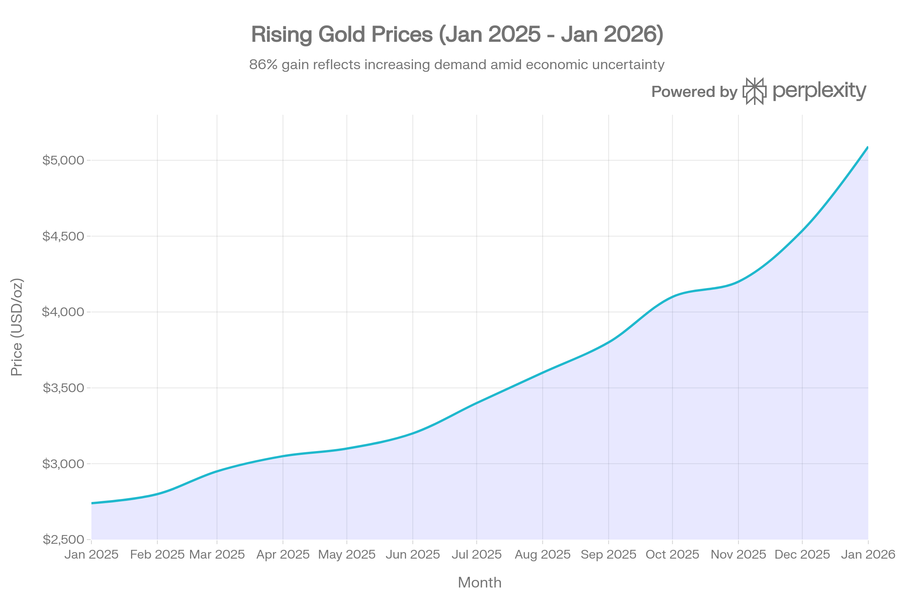
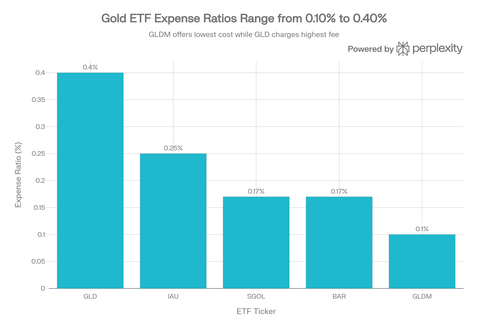
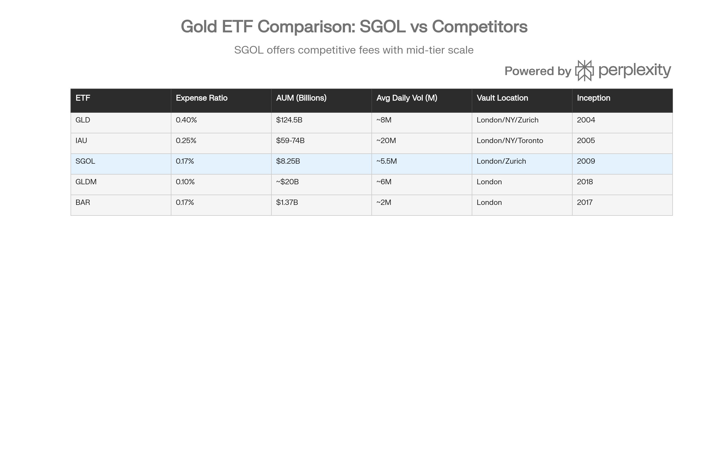

## 분류 근거

SGOL은 실물 금을 보유하는 그랜터 신탁 ETF로, 기존 `ETF/Gold` 폴더(GLD, GLDM, IAU 등)에 분류했습니다.

## 개요

abrdn Physical Gold Shares ETF(이하 SGOL)는 투자자들에게 물리적 금괴에 대한 직접적이고 비용 효율적인 노출을 제공하는 상장지수펀드입니다. 2009년 9월 설립된 SGOL은 금 현물 가격을 추종하며, 런던과 취리히의 보안 금고에 보관된 실물 금괴로 완전히 뒷받침됩니다. 2026년 1월 현재 약 82억 5천만 달러의 운용자산(AUM)을 보유하고 있으며, 금 투자에 관심 있는 투자자들에게 투명성과 보안을 중시하는 선택지로 자리매김하고 있습니다.[^1][^2][^3][^4]

금 가격이 2025년 1월 온스당 2,740달러에서 2026년 1월 27일 5,090달러로 약 86% 상승하는 역사적 강세장을 경험하는 가운데, SGOL은 2025년 한 해 동안 61-64%의 수익률을 기록하며 투자자들에게 상당한 수익을 제공했습니다.[^5][^6][^7][^8][^9]

금 가격은 2025년 1월 온스당 \$2,740에서 2026년 1월 \$5,090으로 약 86% 상승하며 역사적 강세장을 기록했습니다.

## 펀드 구조 및 특징

### 기본 정보

SGOL은 Grantor Trust 구조로 설계되어 있으며, 이는 수탁자가 기초 금괴를 대여할 수 없도록 하여 투자자 보호를 강화합니다. 펀드의 핵심 특징은 다음과 같습니다:[^4][^10]

**운용 데이터:**

- **총보수비율:** 0.17% (연간)[^1][^2][^11]
- **상장거래소:** NYSE Arca
- **설정일:** 2009년 9월 9일[^10]
- **운용사:** abrdn (구 Aberdeen Standard Investments)
- **발행주식수:** 약 1억 7,600만-1억 7,720만 주[^4][^10]

**투자 목적:**
SGOL의 투자 목적은 명확합니다. 펀드 비용을 차감한 금괴 현물 가격의 성과를 반영하는 것입니다. 이를 위해 펀드는 100% 물리적 금괴로만 구성된 단일 보유 자산 구조를 유지합니다.[^12][^2][^13]

### 금괴 보관 및 보안

SGOL의 차별화된 특징 중 하나는 투명성과 보안에 대한 강력한 약속입니다. 펀드는 다음과 같은 보안 메커니즘을 운영합니다:

**보관 체계:**

- **보관기관:** JPMorgan Chase[^4][^10][^14]
- **금고 위치:** 런던(영국)과 취리히(스위스)[^2][^15][^16][^10][^4]
- **감사 주기:** 연 2회 독립 감사 실시[^17]
- **투명성:** 보관 금괴의 일련번호를 공개하여 투자자에게 추가적인 보안 제공[^1][^2]

특히 SGOL은 2012년 이후 정제된 London Good Delivery 금괴만을 보유하는 정책을 시행합니다. 이는 런던귀금속시장협회(LBMA)의 책임 있는 금 가이드라인(Responsible Gold Guidance)에 따라 정제된 금만을 취급함을 의미하며, 환경 보호, 자금 세탁 방지, 테러 자금 조달 및 인권 침해 근절을 위한 정제업체의 노력을 보장합니다.[^2]

### 역사적 변천

SGOL의 발전 과정은 펀드의 안정성과 지속적인 개선을 보여줍니다:

- **2009년 9월:** ETF Securities에 의해 최초 설립
- **2018년 4월 27일:** Aberdeen(현 abrdn)이 펀드 인수[^10][^14]
- **2019년 6월 21일:** "Aberdeen Standard Physical Swiss Gold Shares ETF"에서 "Aberdeen Standard Physical Gold Shares"로 명칭 변경[^10]
- **2019년 11월 4일:** 10대1 주식분할 실시, 주당 가격을 금 현물가의 1/100 수준으로 조정하여 소액 투자자의 접근성 향상[^18][^19][^10]

인수 이후 Aberdeen은 보관 체계를 확대하여 JPMorgan을 보관기관으로 추가하고 런던과 취리히에 금고를 분산 배치했습니다.[^14][^10]

## 비용 구조 및 경쟁력

### 비용 비교 분석

SGOL의 0.17% 총보수비율은 주요 물리적 금 ETF 시장에서 경쟁력 있는 위치를 차지합니다. 경쟁사 대비 비용 구조는 다음과 같습니다:[^1][^2][^11][^20]

SGOL의 0.17% 비용비율은 주요 경쟁 ETF 대비 경쟁력 있는 수준으로, GLD(0.40%)와 IAU(0.25%)보다 낮지만 GLDM(0.10%)보다는 높습니다.

**비용 효율성 분석:**

SGOL은 업계 최대 규모인 GLD의 0.40%나 두 번째로 큰 IAU의 0.25%보다 현저히 낮은 비용을 제공합니다. 동시에 최저 비용인 GLDM(0.10%)과 비교하면 0.07%포인트 높지만, BAR과 동일한 0.17%의 비용 수준을 유지합니다.[^21][^20][^22]

장기 투자자에게 비용 차이는 상당한 영향을 미칩니다. 예를 들어 1만 달러를 20년간 투자하고 연 8%의 수익을 가정할 때, SGOL의 0.17% 비용으로 인한 누적 수수료는 약 919달러로, GLD의 0.40%로 인한 수수료보다 훨씬 낮습니다. 그러나 더 저렴한 대안인 OneGold와 같은 직접 보관 서비스(0.12%)와 비교하면 여전히 약간 높은 수준입니다.[^11]

### 세금 고려사항

모든 물리적 금 ETF 투자자가 반드시 인지해야 할 중요한 사항은 세금 처리 방식입니다. 미국 국세청(IRS)은 금과 금으로 직접 뒷받침되는 ETF를 수집품(collectibles)으로 분류합니다.[^23][^24]

**세금 영향:**

- **장기 자본이득세:** 최고 28% (일반 주식의 20%보다 높음)[^24]
- **단기 자본이득세:** 일반 소득세율(10-37%) 적용[^24]
- **배당금:** 배당 미지급[^12][^25][^26]

이는 GLD, IAU, SGOL 등 모든 물리적 금 ETF에 동일하게 적용되며, 투자자들은 세후 수익률을 계산할 때 이러한 높은 세율을 반드시 고려해야 합니다. 한국 투자자의 경우 한미 조세조약 및 국내 세법에 따른 추가적인 세금 고려사항이 발생할 수 있습니다.[^27][^24]

## 성과 분석

### 역사적 수익률

SGOL은 금 현물 가격을 밀접하게 추종하며 인상적인 장기 수익률을 제공했습니다:[^1]

**기간별 수익률:**

| 기간 | SGOL 수익률 | 카테고리 평균 | 시장 평균 |
| :-- | :-- | :-- | :-- |
| 1개월 | 0.44% | 2.97% | 0.29% |
| 3개월 | -0.16% | 8.63% | -0.01% |
| 연초 대비(YTD) | 27.11% | 25.75% | 15.26% |
| 1년 | 41.20% | 32.59% | 20.59% |
| 3년 (연환산) | 24.45% | 17.47% | 12.37% |
| 5년 (연환산) | 11.71% | 6.07% | 3.65% |

출처:[^1]

2025년은 SGOL에게 특히 강력한 해였으며, 연간 수익률은 61-64%에 달했습니다. 이는 금 가격이 2025년 동안 50회 이상의 사상 최고가를 경신하며 70% 이상 상승한 것을 반영합니다.[^5][^6][^28]

### 추적 오차 및 NAV 프리미엄/디스카운트

SGOL은 순자산가치(NAV)에 매우 근접하게 거래되며, 일반적으로 -0.05%에서 -0.61% 범위의 소폭 디스카운트를 보입니다. 2026년 1월 현재 약 0.05%의 프리미엄으로 거래되고 있어, 펀드의 창출/환매 메커니즘이 효과적으로 작동하고 있음을 보여줍니다.[^26][^29]

물리적 금 ETF의 추적 오차는 일반적으로 매우 낮으며, SGOL도 예외가 아닙니다. 펀드는 기초자산인 금 현물 가격을 정확하게 반영하지만, 소액의 비용과 거래 마찰로 인해 미세한 차이가 발생할 수 있습니다.[^30]

## 시장 환경 및 금 전망

### 2025-2026 금 시장 동향

금 시장은 2025년 역사적인 강세장을 경험했으며, 이러한 추세는 2026년에도 지속될 것으로 예상됩니다. 2025년 1월 온스당 2,740달러에서 시작한 금 가격은 2026년 1월 27일 5,090달러에 도달하며 약 86% 상승했습니다.[^7][^8][^9]

**주요 상승 동인:**

1. **중앙은행 수요:** 2025년 중앙은행의 금 순매입량은 900-1,000톤에 달할 것으로 추정되며, 이는 2022-2024년 연간 1,000톤 이상 매입 이후 네 번째로 강력한 수준입니다. 특히 아시아 중앙은행들(중국, 인도, 일본)이 달러 표시 준비자산에서 다각화하면서 금 보유를 늘리고 있습니다.[^31][^32][^33]
2. **ETF 유입:** 4년간의 유출 이후 2025년 금 ETF는 712.6톤 이상(770억 달러 이상)의 강력한 유입을 기록했습니다. 북미 지역이 유동성 138% 증가를 주도했으며, 아시아 지역도 견조한 수요를 보였습니다.[^34][^35][^36][^28][^31]
3. **지정학적 불확실성 및 탈달러화:** 무역 긴장, 미국의 재정 정책 불확실성, 그리고 다극화되는 국제 통화 시스템으로의 점진적 전환이 금에 대한 구조적 수요를 뒷받침하고 있습니다.[^32][^33][^31]
4. **연준 금리 인하 및 실질 금리 하락:** 연방준비제도의 완화적 통화정책 기대와 낮은 실질 금리는 무수익 자산인 금의 매력을 높였습니다.[^37][^31]
5. **민간 부문 다각화:** 글로벌 정책 리스크를 완화하기 위해 민간 투자자들의 금 투자 다각화가 증가하고 있으며, 미국 민간 금융 포트폴리오에서 금 ETF는 여전히 0.17%에 불과해 추가 성장 여지가 있습니다.[^38][^39]

### 2026년 금 가격 전망

주요 투자은행들은 2026년 금 가격에 대해 낙관적인 전망을 제시하고 있습니다:

**주요 기관 전망:**

- **Goldman Sachs:** 2026년 말 온스당 5,400달러 (기존 4,900달러에서 상향)[^38][^40]
- **JPMorgan:** 2026년 4분기 평균 5,055달러, 2027년 말 5,400달러[^37]
- **TD Securities:** 2026년 연평균 4,831달러, 상반기 일시적으로 5,400달러 도달 가능[^41]
- **State Street:** 2026년 4,000-4,500달러 범위에서 횡보 예상[^35]
- **World Gold Council:** 현재 조건 지속 시 범위 제한적, 경제 성장 둔화 및 금리 추가 하락 시 중간 수준 상승, 심각한 경기 침체 시 강력한 상승 가능[^42]

이러한 전망은 금 가격이 단기 변동성에도 불구하고 구조적으로 강력한 펀더멘털에 의해 지지받고 있음을 시사합니다.[^31][^32][^33]

## 경쟁 환경 분석

### 주요 경쟁사 비교

SGOL은 물리적 금 ETF 시장에서 중간 규모의 경쟁력 있는 위치를 차지하고 있습니다:[^3]

주요 물리적 금 ETF 비교: SGOL은 중간 규모의 자산과 경쟁력 있는 비용 구조로 GLD/IAU와 소형 ETF 사이에 위치합니다.

**시장 포지셔닝:**

**대형 ETF (GLD, IAU):**

- **SPDR Gold Shares (GLD):** [GLD 자체 포스트](/blog/etf/gold/gld/gld-spdr-gold-shares) 기준 \$159B의 AUM으로 시장 지배력을 보유하며, 가장 높은 유동성(일평균 거래량 약 800만 주)을 제공하지만 0.40%의 높은 비용이 단점입니다.[^3][^43]
- **iShares Gold Trust (IAU):** 590-740억 달러의 AUM과 0.25%의 비용으로 두 번째로 큰 펀드이며, 일평균 거래량 약 2,000만 주로 매우 높은 유동성을 제공합니다.[^22][^3]

**중형 ETF (SGOL):**

- SGOL은 82억 5천만 달러의 AUM과 0.17%의 경쟁력 있는 비용으로 중간 시장을 표적으로 합니다.[^4][^3]
- 일평균 거래량 약 550만 주로 GLD/IAU보다 낮지만 여전히 합리적인 유동성을 제공합니다.[^44]
- 런던과 취리히의 이중 금고 시스템, 연 2회 감사, 금괴 일련번호 공개 등 강화된 투명성이 차별화 요소입니다.[^1][^2][^17]

**저비용 소형 ETF (GLDM, BAR):**

- **SPDR Gold MiniShares Trust (GLDM):** 약 200억 달러의 AUM과 0.10%의 최저 비용으로 비용 민감 투자자에게 인기가 있습니다.[^43][^22]
- **GraniteShares Gold Trust (BAR):** 13억 7천만 달러의 AUM과 0.17%의 비용(SGOL과 동일)으로 더 좁은 스프레드(0.06% vs GLDM의 0.08%)를 제공합니다.[^45][^22]

### SGOL의 경쟁 우위

**강점:**

1. **비용 경쟁력:** GLD보다 57% 저렴, IAU보다 32% 저렴[^21][^20]
2. **투명성:** 금괴 일련번호 공개, 연 2회 독립 감사, 2012년 이후 정제 금만 보유[^1][^2][^17]
3. **지리적 다각화:** 런던과 취리히 금고를 통한 보관 리스크 분산[^2][^16]
4. **Grantor Trust 구조:** 금괴 대여 금지로 투자자 보호 강화[^4]
5. **합리적 규모:** 82억 5천만 달러의 AUM은 펀드 안정성과 존속 가능성을 보장[^3][^4]

**약점:**

1. **유동성:** GLD/IAU 대비 낮은 거래량으로 더 넓은 매수-매도 스프레드 발생 가능[^45][^46]
2. **규모:** 대형 ETF 대비 작은 AUM으로 기관투자자 선호도 제한적[^3]
3. **비용:** GLDM의 0.10%보다 70% 높은 비용[^22]
4. **인지도:** GLD/IAU 대비 낮은 시장 인지도

### 물리적 금 ETF vs 금 채굴주

투자자들은 금 노출을 얻기 위해 물리적 금 ETF와 금 채굴주 ETF(예: GDX, GDXJ) 중 선택할 수 있습니다. 각각의 특성은 다음과 같습니다:[^47][^48][^49]

**물리적 금 ETF (SGOL 포함):**

- 금 현물 가격에 직접 연동
- 낮은 변동성 (베타 0.15)[^50]
- 채굴 운영 리스크 없음
- 수익 창출 없음 (배당 미지급)
- 포트폴리오 다각화 및 헤지 목적에 적합

**금 채굴주 ETF (GDX, GDXJ):**

- 금 가격 상승 시 레버리지 효과 (금 가격 10% 상승 시 채굴주 20-30% 수익 가능)[^51][^47]
- 높은 변동성 (GDX 최대 낙폭 -80.57%, GDXJ -88.66%)[^52]
- 운영 리스크, 규제 리스크, 지정학적 리스크 노출[^49][^47]
- 일부 기업의 경우 배당 지급[^53]
- 성장 지향 투자자에게 적합하지만 높은 리스크 감수 필요

2026년 1월 현재 GDX는 연초 대비 24.78%, GDXJ는 27.47% 상승하며 금 가격 상승을 증폭시켰습니다. 그러나 VanEck의 분석에 따르면 금 채굴주는 여전히 저평가 상태이며, 강력한 마진과 개선된 자본 규율로 추가 상승 여력이 있습니다.[^33][^54][^52]

## 리스크 요인 및 고려사항

### 투자 리스크

SGOL 투자 시 고려해야 할 주요 리스크는 다음과 같습니다:

**시장 리스크:**

- **금 가격 변동성:** 금 가격은 단기적으로 상당한 변동성을 보일 수 있으며, 2025-2026년에도 10% 이상의 조정이 여러 차례 발생했습니다[^55]
- **통화 리스크:** 달러 강세 시 달러 표시 금 가격이 하락할 수 있습니다
- **금리 상승 리스크:** 실질 금리 상승 시 무수익 자산인 금의 매력도가 감소합니다

**구조적 리스크:**

- **추적 오차:** 비용과 거래 마찰로 인한 미세한 성과 차이[^30]
- **유동성 리스크:** 극심한 시장 변동성 시 ETF 가격이 NAV에서 일시적으로 이탈할 수 있습니다[^47]
- **보관 리스크:** 물리적 금괴 보관과 관련된 극히 낮은 확률의 리스크 (도난, 손실 등) - 다만 보험과 감사로 완화됨

**세금 리스크:**

- 수집품 세율(28%) 적용으로 인한 세후 수익률 감소[^23][^24]
- 한국 투자자의 경우 이중 과세 및 환차손익 관련 복잡한 세무 처리 가능성

### 물리적 금 vs ETF vs 채굴주 비교

[^56][^57][^58][^47]

| 측면 | 물리적 금괴 | 금 ETF (SGOL) | 금 채굴주 |
| :-- | :-- | :-- | :-- |
| **유동성** | 낮음 (매각 시간 소요) | 높음 (즉시 거래 가능) | 높음 (주식 거래) |
| **보관** | 금고 비용 또는 도난 리스크 | 불필요 (ETF가 관리) | 불필요 |
| **순도** | 검증 필요 | 99.9% 보장 | 해당 없음 |
| **비용** | 제작비용, GST | 연 0.17% | 거래 수수료 |
| **투명성** | 물리적 검증 가능 | 일련번호 공개, 감사 | 기업 재무제표 의존 |
| **레버리지** | 1:1 금 가격 추종 | 1:1 금 가격 추종 | 금 가격의 2-3배 변동 가능 |
| **배당/수익** | 없음 | 없음 | 일부 기업 배당 지급 |
| **리스크** | 도난, 손실 | 추적오차, 시장 리스크 | 운영 리스크, 높은 변동성 |

## 포트폴리오 활용 전략

### 최적 포트폴리오 배분

학술 연구와 기관 분석에 따르면 금의 최적 포트폴리오 배분은 투자자의 리스크 선호도와 투자 목표에 따라 다릅니다:[^59][^60]

**일반적 권장사항:**

- **보수적 투자자:** 포트폴리오의 5-10%[^59]
- **균형 투자자:** 포트폴리오의 10-15%[^59]
- **적극적 분산화:** 최대 15-18%[^60]

Flexible Plan Investments의 50년간(1973-2024) 데이터 분석에 따르면, 전통적인 60/40 주식/채권 포트폴리오에 금을 추가할 경우 역사적 "최적" 배분은 주식 49%, 채권 33%, 금 18%였으며, 이는 전통적 균형 포트폴리오보다 우수한 위험 조정 수익률(샤프 비율 0.97 vs 더 높은 값)을 제공했습니다.[^60]

**배분 접근법:**

1. **현재 포트폴리오 리스크 노출 평가**
2. **리스크 허용도 기반 목표 배분 비율 결정**
3. **적절한 투자 수단 선택** (SGOL은 중간 규모 투자자에게 적합)
4. **3-6개월에 걸친 분할 매수로 초기 포지션 구축**
5. **리밸런싱 트리거 설정** (예: 목표 배분에서 ±2% 이탈 시)
6. **상관관계 변화 모니터링 및 배분 조정**

### 인플레이션 헤지로서의 금

금은 전통적으로 인플레이션 헤지 자산으로 인정받아 왔으며, 최근 연구들도 이를 뒷받침합니다:[^61][^62][^63]

**헤지 메커니즘:**

- 달러 가치 하락 시 달러 표시 금 가격 상승
- 구매력 보존 기능
- 1970-1980년 영국의 경우 금 가격이 파운드 기준 온스당 14.50파운드에서 300파운드 이상으로 상승하며 인플레이션 보호 제공[^63]

**효과성 조건:**

- **고인플레이션 기간:** 금은 강력하고 지속적인 반응을 보임[^61]
- **저인플레이션 기간:** 금의 헤지 효과는 감소하지만, 은(silver)이 추가 보호 제공[^61]
- **장기 관점:** 금은 장단기 모두에서 인플레이션에 대한 신뢰할 수 있는 헤지 제공[^61]

2025-2026년 글로벌 인플레이션 압력과 경제 불확실성이 지속되는 상황에서 SGOL과 같은 금 ETF는 포트폴리오의 구매력 보존 수단으로서 중요한 역할을 수행할 수 있습니다.[^28][^55]

### 투자자 적합성

**SGOL이 적합한 투자자:**

1. **중간 규모 투자자:** 수천 달러에서 수십만 달러 규모의 금 투자를 원하는 개인 및 소규모 기관
2. **투명성 중시:** 금괴 보관 위치와 일련번호 확인을 원하는 투자자
3. **비용 의식적:** GLD/IAU보다 낮은 비용을 원하지만 GLDM만큼 유동성이 제한적이지 않은 투자를 선호
4. **지리적 다각화:** 런던과 취리히의 이중 금고 시스템을 통한 보관 리스크 분산을 원하는 투자자
5. **장기 보유:** 물리적 금에 대한 장기적 노출을 원하며 단기 트레이딩보다 자산 배분에 초점을 맞춘 투자자

**대안 고려 대상:**

- **대규모 기관투자자:** GLD의 높은 유동성이 더 적합
- **극도의 비용 민감 투자자:** GLDM의 0.10% 비용이 더 유리
- **고빈도 트레이더:** GLD/IAU의 더 좁은 스프레드와 높은 유동성 필요
- **레버리지 추구 투자자:** 금 채굴주 ETF(GDX, GDXJ) 고려
- **직접 소유 선호:** OneGold 등 물리적 금괴 직접 보관 플랫폼 검토

## 한국 투자자를 위한 특별 고려사항

### 접근성 및 규제

한국 투자자들은 국제 증권사 계좌를 통해 SGOL에 접근할 수 있습니다. 주요 글로벌 브로커리지 플랫폼(Interactive Brokers, Charles Schwab 등)을 통해 미국 상장 ETF를 거래할 수 있으며, 일부 국내 증권사도 해외주식 거래 서비스를 제공합니다.[^64]

**한국 금 투자 규제 환경:**
한국은 금 거래에 대해 엄격한 규제 체계를 운영하고 있습니다:[^65][^66]

- **금융위원회(FSC):** 금 거래자에 대한 자금세탁방지(AML) 및 고객확인제도(KYC) 규정 시행
- **귀금속관리법(PMCA):** 금의 수입, 수출, 거래 규제
- **산업통상자원부(MOTIE):** 금 거래 라이선스 발급 (최소 자본금 5억 원, 3년 유효)

다만 SGOL과 같은 해외 상장 ETF를 통한 간접 투자는 직접적인 금 거래 라이선스를 필요로 하지 않으며, 일반 해외주식 투자 절차를 따릅니다.

### 세금 고려사항

한국 투자자가 SGOL에 투자할 경우 다음과 같은 세금 이슈를 고려해야 합니다:

**한국 세법상 처리:**

- **양도소득세:** 해외 상장 주식(ETF 포함) 양도 시 연간 250만 원 기본공제 후 22% (지방세 포함)[^27]
- **배당소득세:** SGOL은 배당 미지급으로 해당 없음
- **금융투자소득세:** 2025년 도입 논란이 있었으나, 금융투자소득세 시행 시 연간 5,000만 원(해외 250만 원) 초과 수익에 대해 20-25% 과세 가능성[^27]

**미국 세법상 처리:**

- 한미 조세조약에 따라 미국에서는 양도차익에 대한 원천징수 없음 (배당과 달리)
- 다만 미국 내 collectible 분류는 한국 투자자에게 직접적 영향 없음 (양도소득은 한국에서 신고)

**환율 고려:**

- 달러 표시 투자로 환율 변동에 따른 환차손익 발생
- 원화 약세 시 금 가격 상승 효과 증폭, 원화 강세 시 상쇄 효과 발생
- 2025년 루피화 약세로 인도 금 가격이 더욱 상승한 사례처럼, 한국 투자자도 통화 효과를 고려해야 함[^28]

### 실행 전략

한국 투자자를 위한 SGOL 투자 실행 전략:

1. **계좌 개설:** 해외주식 거래 가능한 국내 증권사 또는 글로벌 브로커리지 계좌 개설
2. **환전 전략:**
    - 달러 환전 타이밍을 분산하여 환율 리스크 완화
    - 일부 증권사의 경우 환전 우대 서비스 활용
3. **매수 전략:**
    - 분할 매수(Dollar-Cost Averaging)로 가격 변동성 완화
    - 금 가격 조정기 활용하여 진입 가격 최적화
4. **포트폴리오 통합:**
    - 전체 자산의 5-10% 수준으로 시작
    - 기존 국내 주식/채권 포트폴리오와의 상관관계 고려
5. **리밸런싱:**
    - 연 1-2회 목표 배분 비율로 리밸런싱
    - 세금 효율성을 고려한 리밸런싱 타이밍 결정

## 결론 및 투자 권고

### 종합 평가

SGOL (abrdn Physical Gold Shares ETF)는 금 현물 가격에 대한 직접적이고 투명한 노출을 제공하는 경쟁력 있는 물리적 금 ETF입니다. 2026년 1월 현재 금이 역사적 강세장을 경험하고 있는 가운데, SGOL은 다음과 같은 특징으로 중간 규모 투자자들에게 매력적인 선택지를 제공합니다:

**핵심 강점:**

1. **경쟁력 있는 비용 구조** - 0.17%의 총보수비율은 주요 대형 ETF(GLD 0.40%, IAU 0.25%)보다 현저히 낮음
2. **강화된 투명성** - 금괴 일련번호 공개, 연 2회 독립 감사, 2012년 이후 정제 금만 보유
3. **지리적 분산** - 런던과 취리히 이중 금고 시스템으로 보관 리스크 완화
4. **입증된 추적 성과** - NAV 대비 매우 근접한 거래 (±1% 이내)
5. **충분한 규모** - 82억 5천만 달러의 AUM으로 펀드 안정성 확보

**주요 제약:**

1. **유동성** - GLD/IAU 대비 낮은 거래량으로 더 넓은 스프레드 가능
2. **세금 부담** - 미국에서 수집품 과세(최대 28%), 한국 투자자의 경우 해외 양도소득세 적용
3. **비용** - 최저비용 옵션(GLDM 0.10%)보다 70% 높은 수준

### 투자 적합성

**추천 대상:**

- 금에 대한 중장기 전략적 배분을 원하는 투자자
- 투명성과 보안을 중시하며 합리적 비용을 원하는 투자자
- 수천 달러에서 수십만 달러 규모의 금 투자를 계획하는 개인 및 소규모 기관
- 인플레이션 헤지 및 포트폴리오 다각화를 추구하는 투자자
- 물리적 금괴의 복잡함(보관, 보험, 보안) 없이 금 노출을 원하는 투자자

**대안 검토 권장:**

- 초대형 포지션 또는 고빈도 거래자 → GLD 고려
- 극도의 비용 민감 장기 투자자 → GLDM 고려
- 금 가격 상승에 대한 레버리지 추구 → GDX/GDXJ 고려
- 직접 소유 선호 또는 장기 현물 보유 → 물리적 금괴 구매 고려

### 2026년 전망 및 전략

2026년 금 시장은 구조적으로 강력한 펀더멘털에 의해 지지받고 있습니다. 주요 투자은행들이 온스당 5,000-5,400달러의 목표가를 제시하는 가운데, SGOL 투자자들은 다음 전략을 고려할 수 있습니다:[^38][^41][^40][^37]

**시나리오별 접근:**

1. **기본 시나리오 (확률 50-60%):** 금 가격이 4,500-5,000달러 범위에서 횡보하며 간헐적 조정 발생
    - **전략:** 목표 배분 유지, 조정기에 추가 매수, 정기 리밸런싱
2. **강세 시나리오 (확률 30%):** 지정학적 긴장 고조, 달러 약세, ETF 유입 가속화로 5,400달러 이상 상승
    - **전략:** 목표 배분 상한까지 확대, 수익 일부 실현을 통한 리스크 관리
3. **약세 시나리오 (확률 10-20%):** 트럼프 행정부 정책 성공, 경제 성장 가속, 금리 상승으로 4,000달러 이하 하락
    - **전략:** 장기 관점 유지, 추가 하락 시 분할 매수 기회 활용

### 실행 권고사항

한국 투자자를 위한 단계별 실행 가이드:

**1단계: 준비 (1-2주)**

- 해외주식 거래 가능한 증권사 계좌 개설 및 인증
- 전체 포트폴리오 분석 및 금 목표 배분 비율 결정 (5-15%)
- 세금 영향 계산 및 연간 투자 한도 설정

**2단계: 진입 (2-6개월)**

- 목표 금액의 30-50%를 초기 진입
- 월 1-2회 분할 매수로 평균 단가 최적화
- 시장 조정(금 가격 5% 이상 하락) 시 추가 매수 고려

**3단계: 모니터링 (지속적)**

- 월 1회 포트폴리오 비중 확인
- 분기 1회 금 시장 동향 및 펀더멘털 검토
- NAV 대비 프리미엄/디스카운트 모니터링

**4단계: 리밸런싱 (연 1-2회)**

- 목표 배분에서 ±2-3% 이탈 시 리밸런싱
- 세금 효율성 고려 (한국: 250만 원 기본공제 활용)
- 금 가격 급등 시 일부 이익 실현 고려

### 최종 결론

SGOL은 물리적 금 투자에 대한 접근을 원하지만 직접 보유의 복잡함을 피하고자 하는 투자자들에게 균형 잡힌 선택지를 제공합니다. 2026년 금 시장이 구조적 강세를 이어갈 것으로 예상되는 가운데, SGOL은 경쟁력 있는 비용, 강화된 투명성, 그리고 충분한 규모의 결합을 통해 중간 시장 투자자들에게 매력적인 옵션으로 자리잡고 있습니다.

한국 투자자들은 해외 증권사를 통해 SGOL에 접근할 수 있으며, 적절한 포트폴리오 배분(5-15%)과 분할 매수 전략을 통해 인플레이션 헤지 및 포트폴리오 다각화 효과를 얻을 수 있습니다. 다만 환율 변동성, 미국 collectible 세제, 그리고 한국 양도소득세 등 세금 영향을 반드시 고려해야 하며, 장기적 관점에서 접근하는 것이 바람직합니다.

금 가격이 사상 최고치를 경신하고 있는 현 시점에서, SGOL은 단순히 투기적 수단이 아닌 포트폴리오의 전략적 다각화 도구로 활용될 때 가장 큰 가치를 발휘할 것입니다.

***

**면책조항:** 본 보고서는 정보 제공 목적으로 작성되었으며 투자 권유를 구성하지 않습니다. 모든 투자 결정은 개인의 재무 상황, 투자 목표, 리스크 허용도를 고려하여 이루어져야 하며, 필요시 전문 재무 자문가와 상담하시기 바랍니다.

[^1]: https://etfdb.com/etf/SGOL/

[^2]: https://www.aberdeeninvestments.com/docs?editionid=609cef3b-2b69-4887-b672-3d8fa93b28bd

[^3]: https://ycharts.com/companies/SGOL/total_assets_under_management

[^4]: https://www.tradingview.com/symbols/AMEX-SGOL/analysis/

[^5]: https://www.nasdaq.com/articles/gold-etfs-spotlight-2025-draws-close

[^6]: https://finance.yahoo.com/quote/SGOL/performance/

[^7]: https://www.150currency.com

[^8]: https://fortune.com/article/current-price-of-gold-01-26-2026/

[^9]: https://tradingeconomics.com/commodity/gold

[^10]: https://www.tradingview.com/symbols/BIVA-SGOL/

[^11]: https://www.onegold.com/etfs/sgol

[^12]: https://www.morningstar.com/etfs/arcx/sgol/quote

[^13]: https://www.schwab.wallst.com/schwab/Prospect/research/etfs/reports/reportRetrieve.asp?reportType=etfrc&symbol=SGOL

[^14]: https://www.tradingview.com/symbols/BOATS-SGOL/analysis/

[^15]: https://www.reddit.com/r/ETFs/comments/1nhn9v9/gold_etf_that_dont_store_gold_in_bank_of_london/

[^16]: https://www.etftrends.com/2012/09/swiss-gold-does-it-matter-where-etfs-store-their-bullion/

[^17]: https://www.simtrade.fr/blog_simtrade/etfs-on-gold/

[^18]: https://www.splithistory.com/sgol/

[^19]: https://www.itiger.com/stock/SGOL

[^20]: https://portfolioslab.com/tools/stock-comparison/IAU/sgol

[^21]: https://drwealth.com/best-gold-etfs/

[^22]: https://stockanalysis.com/etf/compare/gldm-vs-iau-vs-sgol-vs-phys-vs-bar/

[^23]: https://www.reddit.com/r/tax/comments/1pq7no5/gains_on_gld_options_taxed_as_collectibles_or/

[^24]: https://www.cnbc.com/2025/05/01/gold-etf-investors-may-be-surprised-by-their-tax-bill-on-profits.html

[^25]: https://robinhood.com/stocks/SGOL

[^26]: https://www.tradingview.com/symbols/AMEX-SGOL/

[^27]: https://www.mk.co.kr/en/economy/11013457

[^28]: https://www.quantumamc.com/article/gold-monthly-for-january-2026

[^29]: https://ycharts.com/companies/SGOL/discount_or_premium_to_nav

[^30]: https://sharpely.in/knowledge-base/etf-masterclass/etf-pricing-and-performance/tracking-error-vs-tracking-difference-in-etf

[^31]: https://www.ssga.com/ch/it/intermediary/insights/gold-2025-midyear-outlook-a-higher-for-longer-gold-price-regime

[^32]: https://research-center.amundi.com/article/gold-beyond-records

[^33]: https://www.vaneck.com/us/en/blogs/gold-investing/gold-in-2025-a-new-era-of-structural-strength-and-enduring-appeal/

[^34]: https://www.gold.org/goldhub/research/gold-etfs-holdings-and-flows/2026/01

[^35]: https://www.ssga.com/ch/fr/intermediary/insights/gold-2026-outlook-can-the-structural-bull-cycle-continue-to-5000

[^36]: https://www.equiti.com/sc-en/news/global-macro-analysis/gold-consolidation-paves-the-way-for-new-highs-in-2026/

[^37]: https://www.jpmorgan.com/insights/global-research/commodities/gold-prices

[^38]: https://www.reuters.com/business/finance/goldman-sachs-raises-2026-end-gold-price-forecast-5400oz-2026-01-22/

[^39]: https://www.goldmansachs.com/pdfs/insights/goldman-sachs-research/2026-outlooks/CommoditiesOutlook2026.pdf

[^40]: https://www.facebook.com/cnbctv18india/posts/goldman-sachs-has-raised-its-gold-price-forecast-for-end-2026-to-5400-per-ounce-/1369956128498482/

[^41]: https://www.fxstreet.com/news/gold-bullish-outlook-for-2026-td-securities-202601271355

[^42]: https://www.gold.org/goldhub/research/gold-outlook-2026

[^43]: https://finance.yahoo.com/news/zacks-analyst-blog-highlights-gld-124900750.html

[^44]: https://www.nasdaq.com/market-activity/etf/sgol

[^45]: https://www.wealthprofessional.ca/investments/alternative-investments/the-cheapest-takes-it-all-not-always/256865

[^46]: https://www.mezzi.com/blog/gld-vs-iau-vs-sgol-vs-bar-best-gold-etf-long-term-holding

[^47]: https://www.onegold.com/education-center/investing-guide/gold-etfs-vs-gold-mining-stocks

[^48]: https://heygotrade.com/en/blog/gold-etfs-explained

[^49]: https://finance.yahoo.com/news/gdx-versus-gdxj-2-key-130001546.html

[^50]: https://stockanalysis.com/etf/sgol/

[^51]: https://finance.yahoo.com/news/best-way-buy-gold-2026-163000277.html

[^52]: https://portfolioslab.com/tools/stock-comparison/GDX/GDXJ

[^53]: https://money.com/gold-prices-today-january-27-2026/

[^54]: https://tickeron.com/compare/GDX-vs-GDXJ/

[^55]: https://www.oanda.com/eu-en/blog/january-2026-gold-market-overview-precious-metals-soar-amid-global-uncertainty

[^56]: https://paytm.com/blog/digital-gold/physical-gold-vs-gold-etf/

[^57]: https://www.kotakmf.com/Information/blogs/gold-etf-vs-physical-gold_

[^58]: https://www.plindia.com/blogs/how-to-invest-in-gold-etfs/

[^59]: https://discoveryalert.com.au/gold-investment-strategy-institutional-demand-2025/

[^60]: https://proactiveadvisormagazine.com/the-evidence-based-case-for-an-optimal-gold-portfolio-allocation/

[^61]: https://www.sciencedirect.com/science/article/abs/pii/S1059056024007330

[^62]: https://www.investopedia.com/terms/i/inflation-hedge.asp

[^63]: https://www.bullionvault.co.uk/gold-guide/gold-inflation-hedge

[^64]: https://datongminingrefinery.com/location/kr/ulsan/physical-gold-etf-korea-south-2026/

[^65]: https://foundico.com/blog/what-is-the-regulatory-framework-for-gold-in-south-korea-.html

[^66]: https://www.counos.io/what-laws-pertain-to-gold-in-south-korea-

