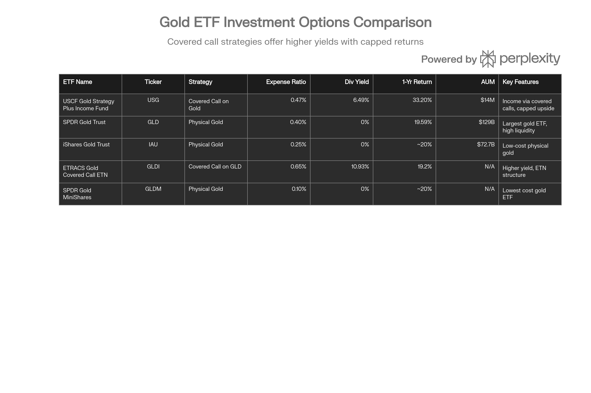
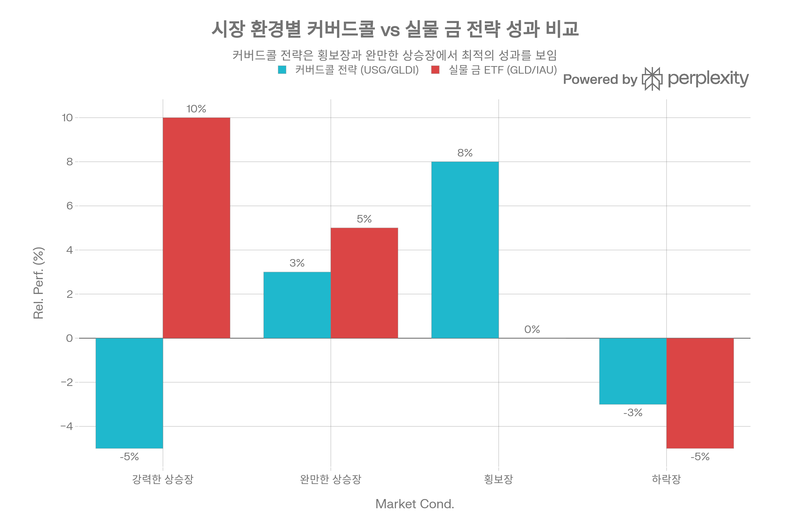

## 분류 근거

USG는 COMEX 금 워런트·선물 보유에 커버드콜 매도를 결합한 상품입니다. 분류 우선순위상 자산군(commodity)이 인컴 구조(covered call)보다 우선하므로(`docs/etf/etf-content-guide.md`), 옵션 인컴 폴더가 아니라 금이라는 원자산을 기준으로 기존 `ETF/Gold` 폴더(GLD, IAU 등)에 분류했습니다.

## 개요

USCF Gold Strategy Plus Income Fund(티커: USG)는 금 가격 추종과 함께 커버드콜 옵션 전략을 통해 정기적인 배당소득을 창출하는 독특한 구조의 금 ETF이다. 2021년 11월 출시된 이 펀드는 COMEX 금 워런트 및 금 선물 계약을 통해 실물 금에 대한 경제적 노출을 유지하면서, 동시에 콜옵션 매도를 통해 프리미엄 수익을 획득한다. 본 보고서는 USG의 투자 전략, 성과, 리스크 요인, 그리고 2026년 투자 적합성을 종합적으로 분석한다.[^1][^2][^3][^4]

## 펀드 기본 정보

USG는 USCF Investments가 운용하는 적극적 관리형(actively managed) ETF로, 기존 티커인 GLDX에서 2024년 3월 4일 USG로 변경되었다. 펀드의 총 운용자산(AUM)은 약 1,400만\~1,600만 달러 수준으로 소규모이며, 운용보수는 0.45\~0.47%로 중간 수준이다. 일평균 거래량은 2,000\~3,800주에 불과해 유동성이 제한적이라는 점이 특징이다.[^1][^5][^6][^7][^8][^9][^10][^11][^12][^13]

펀드는 케이맨 제도에 설립된 완전 자회사를 통해 주로 투자를 진행하며, 자회사에 대한 투자는 총 자산의 25%로 제한된다. 이러한 구조는 상품 선물 투자에 대한 미국 세법 규제를 충족하기 위한 것이다. ALPS Distributors, Inc.가 유통을 담당하고 있으며, SummerHaven Investment Management가 서브어드바이저로 참여한다.[^11][^14][^1]

## 투자 전략 심층 분석

### 금 노출 메커니즘

USG는 두 가지 주요 수단을 통해 금 시장에 대한 노출을 확보한다. 첫째, COMEX 금 워런트(Gold Warrants)는 뉴욕시 인근의 인가된 보관소에 보관된 특정 금괴의 소유권을 입증하는 유통가능한 창고증권이다. 각 워런트는 거래소에 등록되며 고유한 일련번호로 추적 가능한 특정 금괴와 연결되어 있다. 둘째, 완전히 증거금이 납입되고 담보가 제공된 금 선물 계약을 활용한다. 펀드는 금 워런트와 선물 간의 기대수익률과 총비용을 평가하여 최적의 포트폴리오 균형을 결정한다.[^1][^3][^4][^11]

현재 포트폴리오는 단 2개의 보유자산으로 구성되어 있으며, 주로 자회사인 "USCF Cayman Commodity 4"에 대한 투자가 26.1%의 비중을 차지한다. 이는 펀드가 집중된 전략을 사용하며 광범위한 분산투자보다는 특정 금 노출 메커니즘에 집중함을 의미한다.[^5][^6][^15]

### 커버드콜 전략의 작동 원리

USG의 핵심 차별화 요소는 금 콜옵션 매도를 통한 소득 창출이다. 커버드콜 전략은 기초자산(이 경우 금)을 보유하면서 해당 자산에 대한 콜옵션을 매도하는 것이다. 옵션 매수자는 특정 가격(행사가격)에 자산을 매수할 권리를 얻고, 매도자(USG)는 이에 대한 대가로 프리미엄을 받는다.[^1][^2][^16][^17][^18]

이 전략의 경제학은 명확하다. 옵션 프리미엄은 즉각적인 현금흐름을 제공하지만, 금 가격이 행사가격을 초과하여 상승하면 추가 상승분에 대한 참여가 제한된다. 예를 들어, 금이 온스당 2,000달러에 거래되고 있고 USG가 행사가격 2,050달러에 옵션을 50달러 프리미엄에 매도했다면, 금 가격이 2,100달러 이상으로 상승해야 손익분기점을 넘어선다. 그러나 금 가격이 2,200달러로 급등하더라도 USG는 2,050달러에 매도해야 하므로 추가 상승분을 포기하게 된다.[^18][^19][^20][^21]

시장 변동성이 높을수록 옵션 프리미엄이 상승하는 경향이 있어, 변동성이 큰 시장에서는 더 높은 소득을 창출할 수 있다. 2024년 금 옵션의 내재변동성은 금 가격이 사상 최고치를 경신했음에도 중간 수준을 유지했으며, 선거 후 가격 조정 시기에 급격히 하락했다.[^16][^19][^22][^23]

USG와 주요 금 ETF 비교표: 투자 전략, 비용, 수익률 및 특징

## 성과 분석

### 수익률 실적

USG는 2025년 중반 기준 1년 수익률 33.20%를 기록하며 금 가격 강세장에서 우수한 성과를 보였다. 3년 연평균 수익률은 21.23%로 장기적으로도 견고한 성과를 유지했다. 2025년 연초 이후(YTD) 수익률은 22.83%에 달했으며, 순자산가치(NAV) 기준으로는 1년간 32.44% 상승했다.[^6][^24][^11]

이러한 성과는 2025년 금 가격이 64% 급등하고 3,000달러 이상을 기록한 강세장 배경에서 달성되었다. USG의 베타는 0.11로 매우 낮아, 일반 주식시장과의 상관관계가 거의 없고 독립적인 움직임을 보임을 의미한다. 52주 가격 범위는 28.68\~38.57달러였으며, 2026년 1월 현재 35\~40달러 범위에서 거래되고 있다.[^5][^24][^7][^25][^26][^27]

그러나 이는 순수 실물 금 ETF인 GLD의 1년 수익률 19.59%와 비교할 때 아웃퍼폼이지만, 2025년과 같은 강력한 금 가격 상승장에서는 커버드콜 전략의 상승 제한이 일부 초과 수익을 제약했을 가능성이 있다. GLDI(GLD에 대한 커버드콜 ETN)는 같은 기간 19.2%의 수익률을 기록하여 GLD와 거의 유사한 성과를 보였다.[^28][^21]

### 배당 수익 특성

USG는 분기별로 배당금을 지급하며, 배당수익률은 출처에 따라 6.12%에서 25.79%까지 큰 차이를 보인다. 가장 신뢰할 수 있는 최근 지표는 약 6.46\~6.49%의 배당수익률을 제시한다. 연간 배당금은 2.17\~2.29달러 수준이다.[^29][^5][^6][^24][^30][^8][^31][^32]

배당금의 변동성이 큰 것이 특징인데, 2025년 3월에는 주당 0.16355달러, 2024년 12월에는 0.33068달러가 지급되는 등 금액이 크게 달라진다. 이는 옵션 프리미엄 수입이 시장 변동성과 금 가격 움직임에 따라 변동하기 때문이다. 일부 출처에서 25%를 초과하는 높은 수익률을 보고한 것은 특정 기간의 높은 옵션 프리미엄 수입을 반영한 것으로 보인다.[^31][^32][^33][^29]

## 세금 처리 및 비용

### 수집품 과세 규정

USG 투자자들이 반드시 알아야 할 중요한 사항은 세금 처리 방식이다. 미국 국세청(IRS)은 금과 금 ETF를 수집품(collectibles)으로 분류하며, 이는 실물 금이나 금 워런트에 기반한 ETF에 적용된다. 이로 인해 USG의 장기 자본이득(1년 이상 보유)에 대해서는 최대 28%의 세율이 적용되며, 이는 일반 주식의 최대 20% 세율보다 상당히 높다.[^6][^34][^35][^36]

단기 자본이득(1년 미만 보유)은 일반 소득으로 과세되어 10\~37%의 세율이 적용된다. 배당소득 역시 일반 소득으로 과세된다. 다만 K-1 양식을 발행하지 않아 세금 신고가 상대적으로 간단하다는 장점은 있다.[^34][^6]

이러한 세금 구조는 장기 투자자에게 불리하게 작용할 수 있다. 예를 들어, 소득 구간이 37%에 해당하는 투자자의 경우 수집품 과세로 인해 자본이득의 28%를 세금으로 납부해야 하며, 대체최저세(AMT) 적용 시에는 실효세율이 35%까지 상승할 수 있다. 이는 세후 수익률을 크게 감소시키는 요인이다.[^35][^36][^34]

### 비용 구조 비교

USG의 0.47% 운용보수는 순수 실물 금 ETF들과 비교할 때 중간\~높은 수준이다. GLD는 0.40%, IAU는 0.25%, 가장 저렴한 GLDM은 0.10%의 운용보수를 부과한다. 커버드콜 전략을 사용하는 경쟁 상품인 GLDI는 0.65%로 USG보다 높다.[^5][^9][^28][^37][^38][^39][^40][^41]

추가적으로 고려해야 할 숨겨진 비용으로는 금 선물 롤오버 비용이 있다. 금 선물 시장이 콘탱고(선물 가격이 현물 가격보다 높은 상태) 상태일 때, 만기가 도래하는 선물을 더 높은 가격의 장기 선물로 롤오버하면서 부정적인 롤 수익률이 발생할 수 있다. 이는 명시적 비용은 아니지만 장기적으로 펀드 성과를 저해하는 요인이다.[^42][^43][^44]

시장 환경별 커버드콜 전략과 실물 금 전략의 상대적 성과 비교 (개념도)

## 리스크 요인 분석

### 커버드콜 전략의 구조적 한계

커버드콜 전략의 가장 큰 리스크는 강력한 상승장에서의 성과 제한이다. 금 가격이 행사가격을 크게 초과하여 급등하면, 투자자는 그 초과 상승분을 포기하게 된다. 예를 들어, 2025년과 같이 금이 64% 상승한 강세장에서는 커버드콜 전략이 순수 금 ETF 대비 언더퍼폼할 가능성이 높다.[^16][^18][^19][^45][^46][^21][^47]

이 전략은 횡보장이나 완만한 상승장에서 최적의 성과를 보인다. 금 가격이 정체되거나 소폭 상승할 때 옵션 프리미엄이 추가 수익원이 되어 순수 금 투자를 능가할 수 있다. 반면 급격한 하락장에서는 옵션 프리미엄이 제공하는 제한적인 하방 보호만 제공하며, 금 가격 하락분의 대부분을 그대로 감수해야 한다.[^18][^19][^45][^46][^48]

Goldman Sachs의 분석에 따르면, 커버드콜 전략은 강세장에서 기회비용이 상당할 수 있다. 포트폴리오의 100% 커버를 하는 전통적 커버드콜 전략은 시장 회복 시 상승분의 일부만 포착하며, 장기적으로 총수익률이 크게 희생될 수 있다. 이는 USG와 같은 펀드가 "소득 창출"과 "장기 자본 성장" 사이에서 전자를 선택했음을 의미한다.[^48][^47][^49][^50]

### 유동성 및 규모 리스크

USG의 AUM이 약 1,400만\~1,600만 달러에 불과하다는 점은 심각한 유동성 리스크를 내포한다. 일평균 거래량이 2,000\~3,800주 수준으로 매우 낮아, 대량 매매 시 매수-매도 호가 스프레드가 크게 벌어질 수 있다. 기관투자자 보유 주식은 268,284주로 전체 발행 주식의 약 63%를 차지하지만, 최근 분기 기준으로 기관 보유분이 28.83% 감소한 것으로 나타났다.[^5][^51][^7][^10]

소규모 AUM은 펀드의 존속 가능성에도 의문을 제기한다. ETF 산업에서 AUM이 5,000만 달러 미만인 펀드는 수익성 확보가 어려워 청산 위험이 높다. 비록 USCF가 USO(United States Oil Fund)를 2006년 출시하며 상품 ETF 분야의 선구자 역할을 했지만, USG의 저조한 자산 유입은 장기적 지속가능성에 대한 우려를 낳는다.[^52][^53][^54]

### 시장 및 구조적 리스크

금 가격 변동성은 USG의 핵심 리스크 요인이다. 200일 변동성이 18.32%에 달하며, 금 가격이 급락할 경우 옵션 프리미엄이 제공하는 제한적인 완충효과만으로는 손실을 막기 어렵다. 또한 금 선물 시장이 장기간 콘탱고 상태를 유지하면 롤 비용이 누적되어 성과가 저하될 수 있다.[^6][^18][^19][^42][^44]

복잡성 역시 리스크 요소다. 적극적 관리형 펀드이며 파생상품을 활용하므로, 일반 투자자가 전략을 완전히 이해하고 모니터링하기 어렵다. 행사가격 설정, 만기일 선택, 옵션 롤오버 타이밍 등 운용사의 의사결정이 성과에 큰 영향을 미치지만, 투자자는 이러한 결정 과정을 실시간으로 파악하기 힘들다.[^19][^20][^6]

## 경쟁 환경 및 대안 상품

### 실물 금 ETF와의 비교

금 투자 시장에서 지배적인 상품은 실물 금을 보관하는 ETF들이다. SPDR Gold Shares(GLD)는 1,290억 달러의 AUM으로 세계 최대 금 ETF이며, 0.40%의 운용보수와 매우 높은 유동성을 자랑한다. iShares Gold Trust(IAU)는 727억 달러 규모로 0.25%의 낮은 비용이 장점이다. SPDR Gold MiniShares(GLDM)는 0.10%로 가장 저렴한 옵션을 제공한다.[^28][^37][^38]

이들 실물 금 ETF는 금 가격을 있는 그대로 추종하므로, 금 가격이 상승하면 전체 상승분을 포착한다. 배당금은 없지만 장기 자본 성장을 추구하는 투자자에게 적합하다. USG와 달리 세금 구조가 동일하게 수집품으로 분류되지만, 커버드콜 전략의 복잡성이 없어 이해하기 쉽고 예측 가능한 성과를 제공한다.[^37][^34][^36][^28]

### 커버드콜 대안 상품

USG와 가장 유사한 경쟁 상품은 ETRACS Gold Shares Covered Call ETN(티커: GLDI)이다. GLDI는 GLD 주식에 대해 월간 커버드콜을 작성하는 구조로, 행사가격은 GLD 가격의 103%에 설정된다. 즉, 3% 정도의 상승 여력을 허용하는 OTM(out-of-the-money) 옵션을 매도한다.[^55][^39][^56][^57][^40]

GLDI의 운용보수는 0.65%로 USG의 0.47%보다 높지만, 배당수익률은 10.93%로 USG의 6.49%를 크게 상회한다. 다만 GLDI는 ETN(Exchange Traded Note) 구조로, 발행사인 UBS의 신용 리스크를 부담해야 한다는 차이가 있다. 2024\~2025년 금 강세장에서 GLDI의 총수익률은 19.2%로 GLD의 19.59%와 거의 동일했으며, 이는 커버드콜 전략이 강세장에서 순수 금 투자를 따라잡기 어렵다는 점을 보여준다.[^39][^21][^56][^40][^41][^55]

USG의 차별화 요소는 GLD 주식이 아닌 COMEX 워런트와 금 선물을 직접 보유한다는 점이다. 이는 실물 금에 더 가까운 노출을 제공할 수 있지만, 선물 롤오버 비용과 콘탱고 리스크를 수반한다.[^1][^3][^42][^44][^55]

## 2026년 금 시장 전망

### 가격 예측 및 촉진 요인

2026년 금 시장 전망은 대체로 긍정적이다. Goldman Sachs는 2026년 말 금 가격 전망치를 기존 4,900달러에서 5,400달러로 상향 조정했으며, 민간 부문 투자자와 신흥시장 중앙은행의 지속적인 금 매입을 주요 근거로 제시했다. JP Morgan은 2026년 2분기까지 4,000달러를 예상하고, UBS는 3,500달러, Deutsche Bank는 3,700달러로 전망한다. 평균적으로 분석가들은 3,500\~5,400달러 범위를 제시하며, 이는 현재 수준에서 상당한 추가 상승 가능성을 시사한다.[^58][^59][^60][^61]

금 가격 상승을 견인하는 구조적 요인들은 다음과 같다. 첫째, 중앙은행의 지속적인 금 매입이다. 2025년 전 세계 중앙은행은 약 1,000톤 이상의 금을 매입했으며, 2026년에도 월평균 60\~80톤 수준의 매입이 예상된다. Goldman Sachs는 신흥시장 중앙은행이 선진국 대비 금 보유 비중이 현저히 낮아 향후 3년간 지속적으로 비중을 늘릴 것으로 전망한다. 예를 들어 중국은 외환보유고의 10% 미만을 금으로 보유하는 반면, 미국, 독일, 프랑스, 이탈리아는 약 70%를 금으로 보유하고 있다.[^62][^63][^64][^65][^66][^58]

둘째, 연방준비제도(Fed)의 금리 인하 사이클이다. Fed는 2025년 금리 인하를 시작했으며, 2026년에도 약 75bp의 추가 인하가 예상된다. 금리 인하는 실질금리를 낮춰 무이자 자산인 금의 기회비용을 감소시킨다. 또한 달러 약세를 유발해 금 가격에 이중 호재로 작용한다. 머니마켓 펀드에 묶여 있는 7.5조 달러의 자금 중 일부가 금으로 재배치될 가능성도 있다.[^67][^66][^62]

셋째, 지정학적 불확실성과 안전자산 수요 증가다. 무역 긴장, 정치적 불확실성, 글로벌 부채 우려 등이 지속되면서 금의 안전자산 지위가 부각되고 있다. 2025년 금 ETF로의 자금 유입은 7개월 연속 증가했으며, 12월에만 107억 달러가 유입되었다. 소매 투자자의 금 ETF 매수도 2025년 4분기에만 280톤 이상으로 중앙은행 수요를 초과했다.[^25][^27][^61][^58][^62]

### 금리 환경과 금 성과의 상관관계

역사적으로 금은 실질금리와 역의 상관관계를 보인다. 실질금리가 하락하면 금의 상대적 매력도가 상승하며, 이는 2026년 금 가격 상승의 핵심 드라이버가 될 것이다. Fed의 비둘기파적 통화정책 기조와 낮은 중립금리 전망은 이러한 환경을 지속시킬 것으로 예상된다.[^62][^67][^66]

그러나 리스크 요인도 존재한다. 만약 트럼프 행정부의 정책이 성공적으로 경제 성장을 가속화하고 지정학적 리스크를 완화한다면, 금리 상승과 달러 강세로 이어져 금 가격에 하방 압력을 가할 수 있다. Citi의 2,500\~2,700달러 전망은 이러한 시나리오를 반영한 것이다. 또한 선거 이후 금 옵션의 내재변동성이 급락한 것처럼, 시장 안정화 시 옵션 프리미엄 수입이 감소할 수 있다는 점도 USG에는 부정적 요인이다.[^27][^60][^22][^23]

## 투자자 적합성 및 포트폴리오 배분 전략

### 목표 투자자 프로필

USG는 특정 투자 목표와 위험 감수 능력을 가진 투자자에게 적합하다. 첫째, 정기적인 현금흐름을 필요로 하는 소득 중심 투자자다. 6\~7%의 배당수익률은 채권보다 높은 수익을 제공하면서도 주식보다 낮은 변동성을 추구하는 은퇴자나 보수적 투자자에게 매력적일 수 있다. 다만 배당금이 분기마다 크게 변동하므로, 안정적인 현금흐름이 필수적인 투자자에게는 적합하지 않을 수 있다.[^2][^68][^31][^32][^17][^49]

둘째, 횡보장이나 완만한 상승장을 예상하는 전술적 투자자다. 금 가격이 현재 수준에서 크게 변동하지 않거나 소폭 상승할 것으로 전망하는 투자자에게 USG는 옵션 프리미엄을 통한 추가 수익을 제공할 수 있다. 반면 2026년 금 가격이 5,000달러를 향해 급등할 것으로 확신하는 투자자라면 순수 금 ETF인 GLD나 IAU가 더 나은 선택이다.[^28][^19][^46][^48][^21]

셋째, 포트폴리오 다각화를 추구하는 투자자다. 금은 주식 및 채권과 낮은 상관관계를 보이며, USG의 베타 0.11은 이를 잘 보여준다. 특히 인플레이션 헤지 수단으로서 금은 스태그플레이션 시기에 평균 22%의 실질 연수익률을 기록한 반면, 미국 주식은 -1.5%를 기록했다.[^5][^69][^70]

### 포트폴리오 배분 가이드라인

전문가들은 일반적으로 균형 잡힌 포트폴리오에서 금 및 귀금속 배분 비중을 5\~15%로 권장한다. 학술 연구에 따르면 5\~15%의 금 배분은 위험 조정 수익률을 개선하고 시장 스트레스 시기에 손실을 완화하는 효과가 있다. Standard Chartered는 균형 배분 전략에서 금 비중을 7%로 설정하고 있으며, 일부 전략가들은 2026년 전망에서 금 비중을 10%에서 15%로 상향 조정했다.[^71][^69][^72][^70][^73][^74]

Morgan Stanley의 최고투자책임자는 2025년 9월 60/20/20 포트폴리오 전략(주식 60%, 채권 20%, 금 20%)을 공개적으로 지지하며, 금을 주변적 분산투자 수단이 아닌 핵심 인플레이션 헤지 수단으로 포지셔닝했다. 이는 전통적인 60/40 주식/채권 배분에서 벗어나 금의 역할을 크게 확대한 것이다.[^72]

USG를 포트폴리오에 편입할 때는 다음을 고려해야 한다. 첫째, 금 배분의 일부만 USG에 할당하고 나머지는 순수 금 ETF로 분산하는 것이 바람직하다. 예를 들어, 금 배분이 10%라면 그중 3\~4%를 USG에, 나머지 6\~7%를 GLD나 IAU에 투자하는 방식이다. 이는 커버드콜 전략의 상승 제한 리스크를 완화하면서도 소득 창출 혜택을 누릴 수 있게 한다.

둘째, USG는 "코어" 보유자산보다는 "위성" 전략으로 활용하는 것이 적절하다. 포트폴리오의 핵심 금 노출은 GLD나 IAU 같은 대형 유동성 높은 ETF로 확보하고, USG는 소득 증대를 위한 보완적 수단으로 소규모 배분하는 것이다.[^16][^28]

셋째, 투자자의 연령과 위험 감수 능력을 반영해야 한다. 변동성에 민감하거나 시장 하락 시 패닉 매도할 가능성이 있는 투자자는 소규모 배분이 바람직하다. 반면 모기지를 완납한 주택 소유자로 온건한 주식 포트폴리오를 보유한 경우 금 배분이 필요하지 않을 수도 있다.[^71]

## 장기 전망 및 전략적 고려사항

### USCF의 운용 역량 평가

USCF Investments는 2005년 설립 이후 상품 ETF 분야의 선구자로 자리매김했다. 2006년 최초의 원유 ETP인 USO를 출시하며 혁신을 주도했고, 이후 16개의 전문 상품 및 대체자산 ETF를 발행했다. Andrew F. Ngim이 공동 창립자이자 경영이사로 20년 이상 포트폴리오 관리를 담당하고 있다.[^75][^14][^76][^77][^52][^53][^54]

그러나 USO의 역사는 상품 선물 기반 펀드의 어려움을 보여준다. 2020년 봄 원유 시장의 극심한 변동성 시기에 USO는 벤치마크 선물 계약에 상당 부분 투자하는 능력이 심각하게 제약되었으며, 포트폴리오 재조정을 과거보다 훨씬 빈번하게 수행해야 했다. 이는 상품 선물 전략이 극단적 시장 상황에서 직면할 수 있는 구조적 취약성을 보여준다.[^78]

USG의 경우 금 선물 시장이 원유보다 안정적이고 성숙했지만, 동일한 롤오버 리스크와 콘탱고 비용이 존재한다. 펀드의 소규모 AUM은 USCF가 이 전략에 대한 시장 수용도를 높이는 데 어려움을 겪고 있음을 시사한다. 기관 투자자 보유분이 최근 분기에 29% 감소한 것도 우려스러운 신호다.[^5][^51][^10][^42][^44]

### 커버드콜 전략의 장기적 한계

장기 투자 관점에서 커버드콜 전략의 가장 큰 문제는 복리 수익률 감소다. 시장이 상승할 때마다 상승분의 일부를 포기하면, 장기적으로 누적 수익률이 크게 낮아질 수 있다. 한 투자자는 이를 "동전 던지기에서 1달러를 걸지만, 질 때마다 다음 판에는 95%만 걸 수 있는 게임"에 비유했다. 장기적으로는 항상 손해를 보게 되는 구조라는 것이다.[^47][^50]

Interactive Brokers의 분석은 더욱 비판적이다. 전통적인 월간 커버드콜 전략은 시장 회복 시 상승분의 일부만 포착하며, 하락장에서는 제한적인 하방 보호만 제공하여 장기 총수익률을 크게 희생시킨다고 지적한다. 역사적으로 채권이 하방 보호와 주식 분산에서 훨씬 우수한 성과를 보였다는 것이 그들의 결론이다.[^50]

다만 최근 일일 커버드콜 전략을 채택한 일부 펀드들은 개선된 성과를 보이고 있다. Goldman Sachs의 커버드콜 ETF는 포트폴리오의 75%만 커버하고 매주 옵션을 작성하는 방식으로, 전통적 월간 100% 커버 전략보다 더 많은 상승 참여를 허용하며 2024\~2025년 강세장에서 우수한 성과를 거두었다. 이는 커버드콜 전략 설계의 중요성을 보여주지만, USG가 이러한 혁신적 접근법을 채택하고 있다는 증거는 없다.[^48][^50]

## 투자 의사결정 프레임워크

### USG 투자가 적절한 경우

다음 조건을 충족하는 투자자에게 USG는 고려할 만한 선택지다. 첫째, 금 가격이 현재 수준에서 크게 벗어나지 않고 3,500\~4,500달러 범위에서 횡보할 것으로 예상하는 경우다. 이 시나리오에서 커버드콜 전략은 정체된 가격에서도 옵션 프리미엄을 통해 수익을 창출할 수 있다.[^19][^46]

둘째, 포트폴리오에서 소득 창출이 우선순위이고 자본 성장은 부차적인 목표인 경우다. 은퇴자나 배당소득에 의존하는 투자자가 여기에 해당한다. 다만 배당금 변동성을 감수할 수 있어야 한다.[^2][^68][^31][^32][^49]

셋째, 이미 충분한 금 노출을 보유하고 있으며 일부를 소득 창출 전략으로 전환하고자 하는 경우다. GLD나 IAU로 코어 금 포지션을 유지하면서, 포트폴리오의 소규모 부분(예: 전체 금 배분의 30\~40%)을 USG로 배분하여 소득을 증대시키는 방식이다.[^16][^28]

넷째, 수집품 과세의 불리함을 상쇄할 수 있는 세금 효율적 계좌(IRA, 401k 등)에서 투자하는 경우다. 세금 유예 계좌에서는 28% 수집품 세율이 적용되지 않아 세후 수익률 차이가 줄어든다.[^34][^35]

### USG 투자를 피해야 하는 경우

반대로 다음 상황에서는 USG를 피하는 것이 현명하다. 첫째, 2026년 금 가격이 5,000달러 이상으로 급등할 것으로 확신하는 경우다. 강력한 상승장에서는 커버드콜 전략이 순수 금 ETF를 크게 언더퍼폼할 가능성이 높다. Goldman Sachs의 5,400달러 전망이 실현된다면, GLD나 IAU가 훨씬 나은 선택이 될 것이다.[^58][^59][^60][^21][^47][^50]

둘째, 유동성이 중요한 대규모 투자자의 경우다. 1,400만 달러의 AUM과 낮은 일일 거래량은 대형 포지션의 진입과 청산을 어렵게 만들며, 높은 거래비용을 초래할 수 있다. 수십만 달러 이상을 투자하려는 경우 GLD나 IAU의 유동성이 필수적이다.[^5][^51][^7][^10][^28][^37]

셋째, 장기 자본 성장이 주요 목표이고 세금 계좌에서 투자하는 경우다. 28% 수집품 세율과 상승 제한이 결합되면 세후 장기 수익률이 크게 저하될 수 있다. 20\~30년 투자 기간을 가진 젊은 투자자에게는 부적절하다.[^34][^35][^47]

넷째, 복잡한 투자 전략을 이해하고 모니터링할 시간과 전문성이 부족한 경우다. 커버드콜, 행사가격, 옵션 만기, 롤오버 등의 개념을 이해하지 못한다면, 예상치 못한 성과 변동에 당황하여 비합리적 의사결정을 할 위험이 있다.[^6][^19][^20]

## 결론 및 투자 권고

### 종합 평가

USG는 틈새 시장을 겨냥한 전문화된 금 투자 상품이다. 커버드콜 전략을 통해 정기적인 소득을 제공하고 횡보장에서 순수 금 ETF를 능가할 수 있다는 장점이 있다. 2025년 33.20%의 우수한 수익률은 금 강세장에서도 경쟁력을 입증했다. USCF의 20년 상품 ETF 운용 경험과 혁신적 상품 개발 역량은 신뢰를 더한다.[^2][^6][^19][^46][^75][^14][^52]

그러나 여러 구조적 약점이 장기 투자 매력을 저해한다. 첫째, 매우 제한된 유동성과 소규모 AUM은 실행 리스크와 존속 불확실성을 야기한다. 둘째, 강세장에서의 상승 제한은 2026년 금 가격 전망이 낙관적인 상황에서 기회비용을 증가시킨다. 셋째, 28% 수집품 세율은 세후 수익률을 크게 낮춘다. 넷째, 0.47% 운용보수는 저비용 경쟁 상품 대비 높은 편이다.[^5][^51][^10][^28][^37][^34][^35][^58][^59][^21][^47]

경쟁 구도에서도 USG의 위치는 애매하다. 순수 금 노출을 원한다면 GLD나 IAU가 저렴하고 유동성이 높으며, 더 높은 배당수익률을 추구한다면 GLDI가 10.93%로 USG의 6.49%를 크게 상회한다. USG의 차별화 요소인 COMEX 워런트 활용은 일반 투자자에게 명확한 가치를 제공하지 못하며, 오히려 선물 롤오버 복잡성을 추가한다.[^28][^37][^42][^44][^21][^56]

### 투자 등급 및 권고사항

**투자 등급: 조건부 보유 / 선택적 매수**

USG는 일반적인 금 투자자에게 "최선의 선택(Best Choice)"이 아니며, 특정 조건과 투자 목표를 가진 투자자에게만 적합한 "전문화된 도구(Specialized Tool)"로 평가한다.

**매수 권장 시나리오:**

- 금 배분의 소규모 부분(전체 금 배분의 25\~40%)을 소득 창출 전략으로 전환하려는 투자자
- 금 가격이 향후 12\~18개월간 3,500\~4,500달러 범위에서 횡보할 것으로 예상하는 전술적 투자자[^19][^46]
- 세금 유예 계좌(IRA, 401k)에서 투자하여 수집품 과세를 피할 수 있는 투자자[^34][^35]
- 분기 배당 변동성을 감수할 수 있으며 현금흐름 중심 전략을 추구하는 투자자[^31][^32]

**매수 비권장 시나리오:**

- 금 가격 급등을 예상하는 강세 전망 투자자(GLD/IAU 선호)[^28][^58][^59][^60]
- 대규모 포지션이 필요한 기관투자자(유동성 부족)[^5][^51]
- 장기 자본 성장이 주요 목표인 젊은 투자자(상승 제한 및 높은 세율)[^47][^34]
- 10만 달러 이상의 대규모 투자를 계획하는 투자자(매수-매도 스프레드 비용)[^7][^5]

**대안 상품 권고:**

- **순수 금 노출**: iShares Gold Trust(IAU, 0.25% ER) - 비용 효율성과 유동성의 최적 균형[^37][^28]
- **고배당 전략**: ETRACS Gold Covered Call ETN(GLDI, 10.93% yield) - 더 높은 소득을 추구하는 경우[^21][^56]
- **최저 비용**: SPDR Gold MiniShares(GLDM, 0.10% ER) - 장기 보유 시 비용 최소화[^28][^37]
- **최대 유동성**: SPDR Gold Shares(GLD, 0.40% ER) - 대규모 거래가 필요한 경우[^37][^28]

### 2026년 전망 및 모니터링 포인트

2026년 금 시장 환경은 USG에 복합적 영향을 미칠 것으로 예상된다. 긍정적 요인으로는 지속적인 중앙은행 매입(월 60\~80톤), Fed 금리 인하(75bp 예상), 지정학적 불확실성, 그리고 소매 ETF 유입 가속화가 있다. 이들은 모두 금 가격을 지지하며, USG의 기초자산 성과를 뒷받침할 것이다.[^25][^58][^27][^62][^64][^65][^67][^66]

그러나 부정적 요인도 만만치 않다. Goldman Sachs의 5,400달러 전망이 실현되면 약 55%의 상승이 발생하는데, 이 경우 커버드콜 전략의 상승 제한으로 USG는 순수 금 ETF 대비 크게 언더퍼폼할 가능성이 높다. 또한 시장 안정화 시 옵션 내재변동성 하락으로 프리미엄 수입이 감소할 수 있다.[^58][^59][^22][^23][^20][^21][^47]

**2026년 모니터링해야 할 핵심 지표:**

1. **금 가격 추세**: 4,500달러 이상 상승 시 순수 금 ETF로 전환 고려[^59][^60][^58]
2. **옵션 내재변동성**: 급격한 하락 시 배당 수익 감소 예상[^22][^23][^20]
3. **AUM 추이**: 1,000만 달러 이하 하락 시 청산 리스크 상승[^5][^10]
4. **기관 보유분 변화**: 지속적 감소는 전문가들의 부정적 시각 반영[^51]
5. **NAV 대비 프리미엄/디스카운트**: 지속적 디스카운트는 시장 회의론 신호[^26][^79]

궁극적으로 USG는 "완벽한 상품"이 아니라 "특정 상황에 적합한 도구"다. 금 투자 포트폴리오의 다각화 수단으로 소규모 배분(전체 금 배분의 25\~40%)을 고려할 수 있으나, 코어 포지션으로는 유동성이 높고 비용이 낮으며 세금 구조가 동일한 IAU나 GLD가 더 적절하다. 2026년 금 시장의 강세 전망을 감안할 때, 상승 제한 없는 순수 금 ETF가 대부분의 투자자에게 더 나은 위험-수익 프로필을 제공할 것으로 판단된다.[^28][^37][^60][^61][^58][^59]

[^1]: https://www.uscfinvestments.com/usg

[^2]: https://robinhood.com/us/en/stocks/USG/

[^3]: https://www.onegold.com/etfs/usg

[^4]: https://www.cmegroup.com/trading/metals/files/comex-gold-warrants-faq.pdf

[^5]: https://stockanalysis.com/etf/usg/

[^6]: https://etfdb.com/etf/USG/

[^7]: https://www.barchart.com/stocks/quotes/USG

[^8]: https://www.morningstar.com/etfs/arcx/usg/quote

[^9]: https://www.marketbeat.com/stocks/NYSEARCA/USG/

[^10]: https://seekingalpha.com/symbol/USG

[^11]: https://www.tradingview.com/symbols/AMEX-USG/

[^12]: https://www.moomoo.com/hans/news/post/34147767/uscf-announces-a-new-ticker-for-the-uscf-gold-strategy

[^13]: https://www.nasdaq.com/articles/this-week-in-etfs:-7-new-etfs-dwarfed-by-11-closures

[^14]: https://www.uscfinvestments.com

[^15]: https://www.poems.com.sg/etf-screener/NYSE-USG/

[^16]: https://globalxetfs.eu/how-to-enhance-income-potential-with-covered-call-etfs/

[^17]: https://www.etfguide.com/get-more-from-gold-usgs-covered-call-advantage/

[^18]: https://www.wallstreetzen.com/blog/covered-call-option-strategy/

[^19]: https://www.tastylive.com/concepts-strategies/covered-call

[^20]: https://www.nasdaq.com/articles/gold-soaring-how-use-options-maximize-gains

[^21]: https://incomeshares.com/en-eu/insights/gldi-vs-gld-performance-since-launch

[^22]: https://www.cmegroup.com/insights/economic-research/2024/gold-silver-major-factors-that-could-impact-implied-volatility-and-skew-in-2025.html

[^23]: https://www.pennmutualam.com/market-insights-news/blogs/chart-of-the-week/2025-11-20-inside-gold-retreat-what-the-options-market-revealed

[^24]: https://www.tradingview.com/symbols/AMEX-USG/analysis/

[^25]: https://www.fxstreet.com/analysis/2025-was-a-record-year-for-gold-etfs-202601112248

[^26]: https://www.bloomberg.com/quote/USG:US

[^27]: https://www.gold.org/goldhub/research/gold-outlook-2026

[^28]: https://mineralfunds.com/gld-vs-iau-which-gold-etf-belongs-in-your-portfolio/

[^29]: https://kr.investing.com/etfs/gldx-nyse

[^30]: https://www.zacks.com/funds/etf/USG/profile

[^31]: https://www.tipranks.com/etf/usg/dividends

[^32]: https://stockanalysis.com/etf/usg/dividend/

[^33]: https://www.intelligentinvestor.com.au/shares/nyse-usg/usg-corporation/dividends

[^34]: https://www.cnbc.com/2025/05/01/gold-etf-investors-may-be-surprised-by-their-tax-bill-on-profits.html

[^35]: https://www.thetaxadviser.com/issues/2019/nov/taxation-collectibles/

[^36]: https://sprott.com/media/3433/phys-keep-more-of-what-you-earn-vs-gold-etfs.pdf

[^37]: https://www.onegold.com/etfs

[^38]: https://carboncredits.com/top-gold-etfs-to-watch-now-as-gold-prices-break-4000-iau-gld-and-gdx-lead-the-pack/

[^39]: https://portfoliometrics.net/etf-comparison/USOI-GLDI

[^40]: https://etfdb.com/etf/GLDI/

[^41]: https://portfolioslab.com/tools/stock-comparison/GLDI/GLD

[^42]: https://highstrike.com/contango-vs-backwardation/

[^43]: https://www.cmcmarkets.com/en-nz/cfd/learn/trading-guides/contango-and-backwardation-in-trading

[^44]: https://www.britannica.com/money/contango-vs-backwardation-differences

[^45]: https://ca.finance.yahoo.com/news/covered-call-etfs-why-investors-should-tread-carefully-before-buying-into-the-hype-144301947.html

[^46]: https://www.investmentexecutive.com/soundbites/equities/covered-call-etfs-can-offer-enhanced-yields-but-theres-a-catch/

[^47]: https://www.reddit.com/r/dividends/comments/1lycb6u/whats_the_dark_side_of_covered_call_etfs_that/

[^48]: https://www.morningstar.com/news/marketwatch/20251106214/this-income-investing-approach-from-goldman-sachs-has-been-paying-off

[^49]: https://www.sofi.com/learn/content/covered-call-etf/

[^50]: https://www.interactivebrokers.com/campus/traders-insight/securities/options/covered-call-etfs-the-myth-of-downside-protection/

[^51]: https://fintel.io/so/us/usg

[^52]: https://www.etfaction.com/author/uscf/

[^53]: https://www.barchart.com/stocks/quotes/USO/profile

[^54]: https://www.uscfinvestments.com/uso

[^55]: https://etracs.ubs.com/product/detail/index/ussymbol/GLDI

[^56]: https://stockanalysis.com/etf/gldi/

[^57]: https://www.projectfinance.com/covered-call-etf-list/

[^58]: https://www.reuters.com/business/finance/goldman-sachs-raises-2026-end-gold-price-forecast-5400oz-2026-01-22/

[^59]: https://www.facebook.com/cnbctv18india/posts/goldman-sachs-has-raised-its-gold-price-forecast-for-end-2026-to-5400-per-ounce-/1369956128498482/

[^60]: https://www.bullionbypost.co.uk/info/gold-price-forecast-2026/

[^61]: https://www.investopedia.com/gold-prices-record-highs-2026-outlook-11871125

[^62]: https://www.ubp.com/en/news-insights/newsroom/gold-s-bull-market-is-set-to-continue-into-2026-investment-outlook-2026

[^63]: https://www.goldmansachs.com/insights/articles/gold-forecast-to-rise-by-the-middle-of-2026

[^64]: https://www.reuters.com/world/india/gold-has-more-room-run-geopolitics-cenbank-buying-fuel-gains-analysts-say-2026-01-26/

[^65]: https://www.jpmorgan.com/insights/global-research/commodities/gold-prices

[^66]: https://www.investing.com/analysis/gold-outlook-fed-rate-cuts-central-bank-demand-and-key-levels-into-2026-200671390

[^67]: https://www.ssga.com/us/en/intermediary/insights/gold-2026-outlook-can-the-structural-bull-cycle-continue-to-5000

[^68]: https://www.sofi.com/invest/stock/USG/

[^69]: https://www.sc.com/sg/wealth/insights/why-gold-remains-our-top-conviction-for-2026/

[^70]: https://www.investmentmarkets.com.au/articles/commodities/commodity-etfs-an-ideal-portfolio-diversifier-148

[^71]: https://www.cbsnews.com/news/gold-investment-types-to-consider-for-2026-according-to-experts/

[^72]: https://goldsilver.com/industry-news/article/buy-precious-metals-in-2026/

[^73]: https://www.linkedin.com/posts/clive-thompson-661997251_asset-allocation-table-2026-once-again-activity-7406093742543147008-q3Wk

[^74]: https://discoveryalert.com.au/invest-gold-silver-precious-metals-strategies-2026/

[^75]: https://www.uscfinvestments.com/team

[^76]: https://www.sec.gov/Archives/edgar/data/1597389/000117120023000307/i23275_etfalum-485apos.htm

[^77]: https://csimarket.com/stocks/USO-Officers-Directors.html

[^78]: https://www.sec.gov/Archives/edgar/data/1327068/000141057825000228/uso-20241231x10k.htm

[^79]: https://www.tradingview.com/symbols/NZX-USG/analysis/

