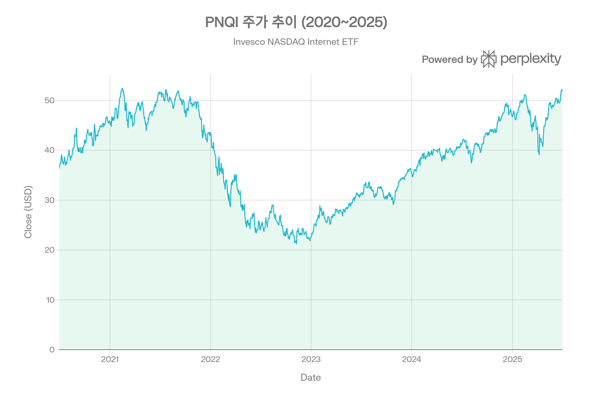
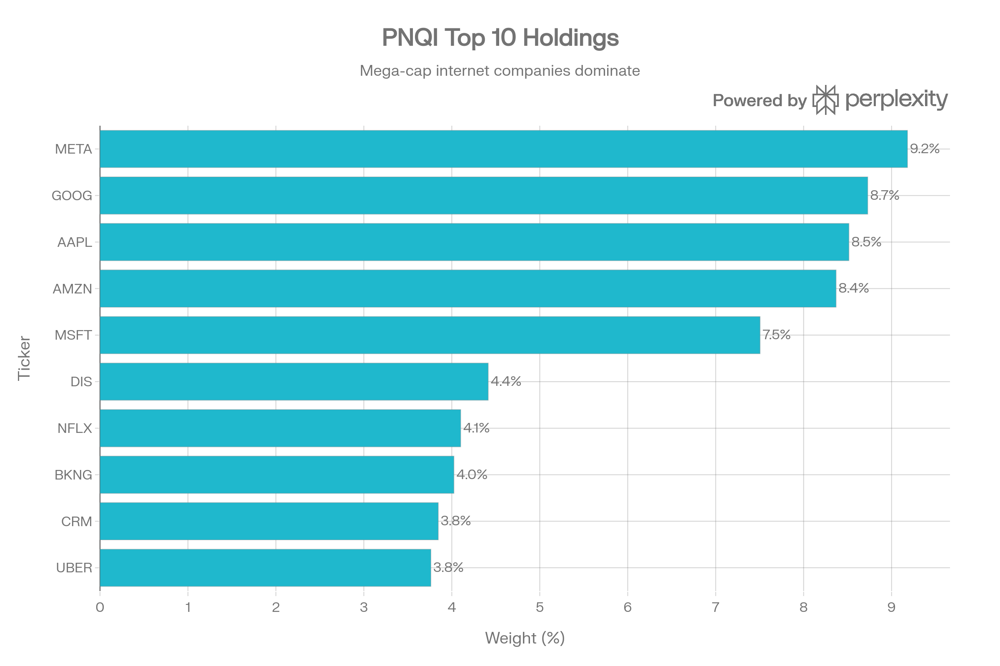
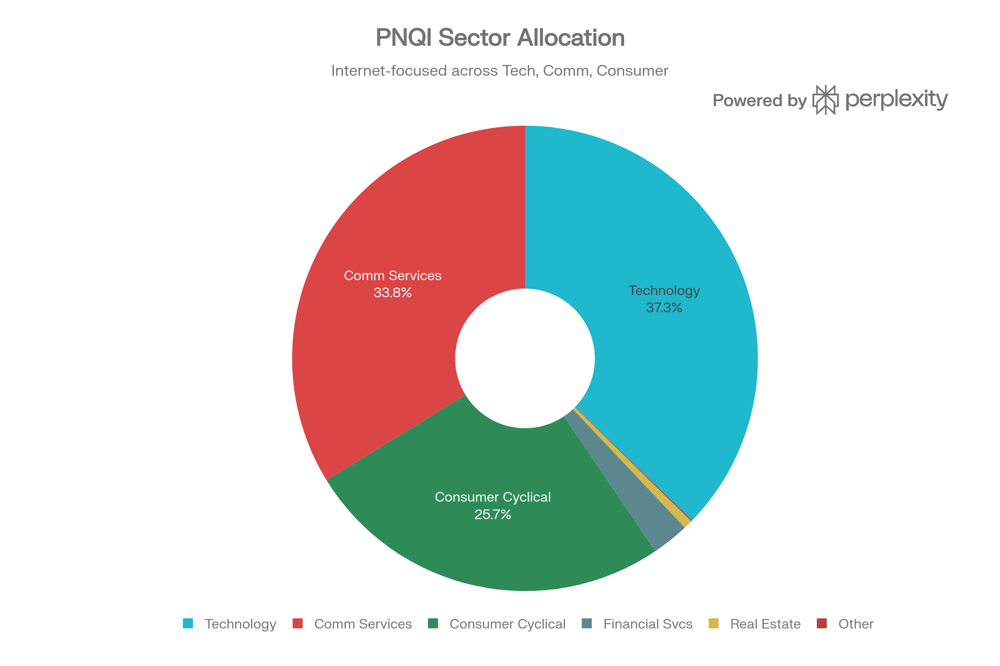
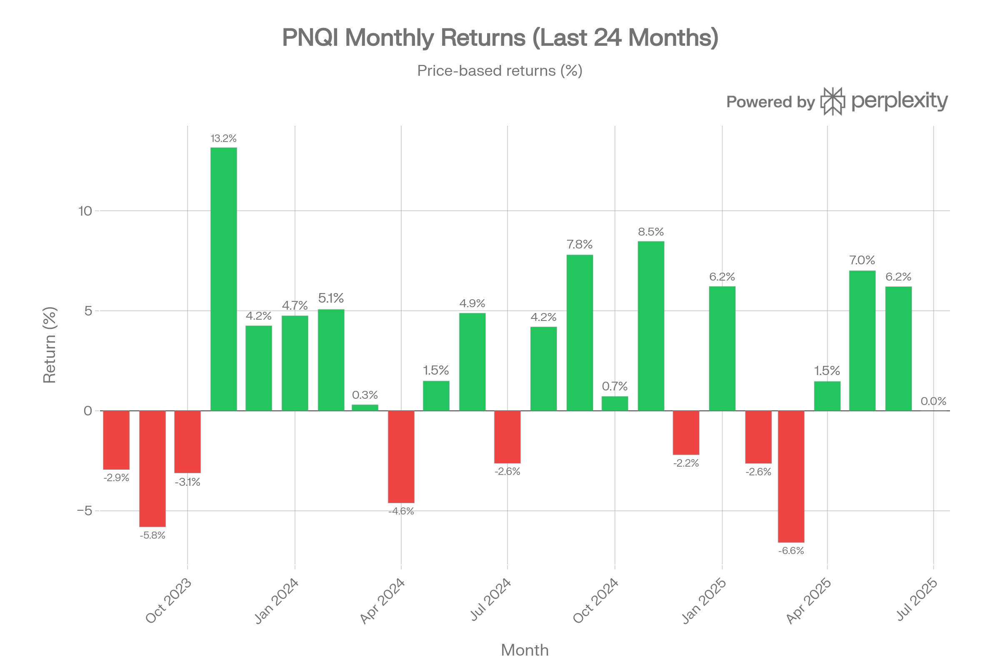
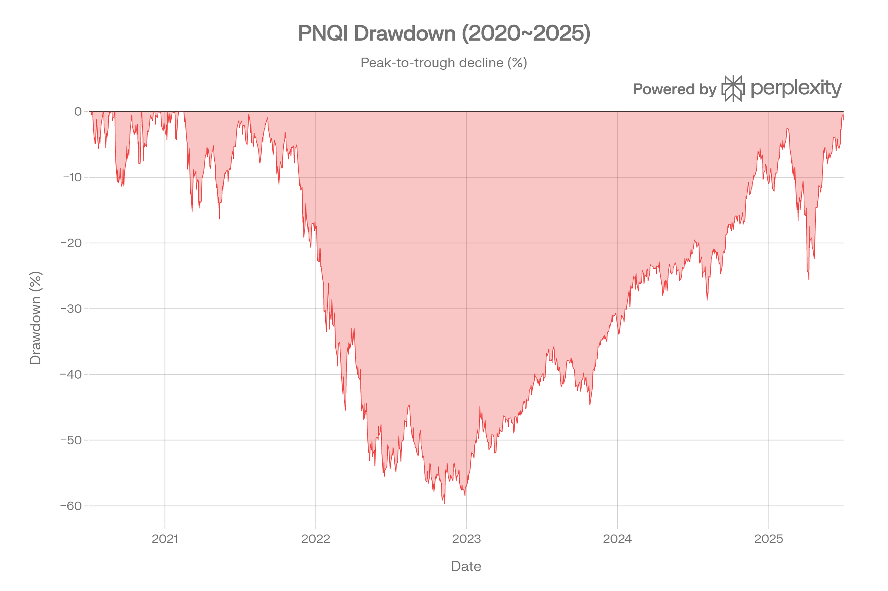

# PNQI (Invesco NASDAQ Internet ETF) 종합 분석 보고서
## 개요
PNQI는 나스닥에 상장된 인터넷 관련 기업에 집중 투자하는 ETF로, Nasdaq CTA Internet Index를 추종한다. 검색 엔진, 인터넷 소매상거래, 소셜 미디어, 클라우드, 스트리밍 등 인터넷 비즈니스에 관여하는 미국 상장 기업들로 구성되며, Meta, Alphabet, Apple, Amazon, Microsoft 등 메가캡 인터넷 기업이 포트폴리오의 핵심을 이룬다. Morningstar는 이 펀드를 <strong>Large Growth</strong> 카테고리로 분류하며, 비용비율 0.60%에 AUM 약 $562M\~$802M 수준의 중형 규모 ETF이다.[1][2][3][4][5]

***
## ETF 분류

| 항목 | 내용 |
|------|------|
| <strong>최종 폴더</strong> | `ETF/Internet/PNQI` |
| <strong>대분류</strong> | 테마 |
| <strong>하위 분류</strong> | 인터넷 |
| <strong>핵심 전략</strong> | Nasdaq CTA Internet Index를 추종하며 인터넷 비즈니스 관련 기업에 투자 |
| <strong>레버리지·인버스</strong> | 아니오 |
| <strong>옵션 인컴 전략</strong> | 아니오 |
| <strong>분류 판단</strong> | 이름에 Nasdaq이 포함되어 있지만 Nasdaq-100 대표지수 ETF가 아니라 인터넷 관련 기업에 투자하는 테마형 ETF로 분류하는 것이 적절하다. |

***
## 1. 기본 정보
| 항목 | 내용 |
|------|------|
| <strong>정식 명칭</strong> | Invesco NASDAQ Internet ETF |
| <strong>티커</strong> | PNQI (NASDAQ 상장) |
| <strong>설정일</strong> | 2008년 6월 12일[1][2] |
| <strong>운용 기간</strong> | 약 17년 10개월 |
| <strong>운용사</strong> | Invesco Ltd / Invesco Capital Management LLC[2] |
| <strong>상장 거래소</strong> | NASDAQ[6] |
| <strong>추종 지수</strong> | Nasdaq CTA Internet Index[2][7] |
| <strong>지수 가중 방식</strong> | Modified Market-Cap Weighted (수정 시가총액 가중)[8] |
| <strong>순자산 규모(AUM)</strong> | 약 $561.75M (2026.03 기준)[1] |
| <strong>시가총액</strong> | $674M |
| <strong>현재가</strong> | $47.26 (2026.03.11 기준) |
| <strong>52주 범위</strong> | $37.75 \~ $57.22 |
| <strong>총 보유 종목 수</strong> | 77개 |
| <strong>P/E 비율</strong> | 28.99 |
| <strong>EPS</strong> | $1.63 |
| <strong>펀드 구조</strong> | Open-Ended Fund[2] |
| <strong>운용 방식</strong> | 패시브 (인덱스 추종)[2] |
| <strong>복제 방식</strong> | 실물 복제 (Physical Replication)[2] |

PNQI는 Consumer Technology Association(CTA)이 결정하는 인터넷 관련 기업에 투자하며, 소프트웨어 기업, 검색 엔진, 웹 호스팅/디자인 업체, 인터넷 소매상거래 기업 등이 포함된다. 비분산(Non-Diversified) 펀드로 분류되어, 특정 섹터나 종목에 대한 집중 투자가 가능하다.[2][4][9]

***
## 2. 추종 성과 지표
### 추종 지수 특성
Nasdaq CTA Internet Index는 수정 시가총액 가중(Modified Market-Cap Weighted) 방식을 채택한다. 핵심 규칙은 다음과 같다:[8]

- 상위 5개 종목의 최대 비중: 각 <strong>8%</strong> 캡[8]
- 나머지 종목의 최대 비중: 각 <strong>4%</strong> 캡[8]
- 캡 초과분은 나머지 종목에 비례 배분[8]
- 분기별 리밸런싱: 3월, 6월, 9월, 12월 셋째 금요일 이후 적용[8]

이 가중치 제한 메커니즘은 메가캡 기업의 과도한 집중을 완화하되, 시가총액 기반의 자연스러운 비중 배분을 유지한다.
### NAV 대비 괴리율
PNQI의 NAV 대비 프리미엄/할인율은 현재 약 <strong>-0.01%\~0.01%</strong> 수준으로 극히 낮다. 2024년 전체 252 거래일 중 NAV 대비 프리미엄이 발생한 날은 121일, 할인이 발생한 날은 131일로, 대체로 NAV 근방에서 안정적으로 거래되었다. 괴리율이 0.25% 이상 벌어진 경우는 거의 없어 차익거래 메커니즘이 효과적으로 작동하고 있다.[2][10]
### 추적 성과
2025년 8월 기준 PNQI의 시장가격 기준 수익률(+15.8%)과 NAV 기준 수익률(+16.0%)은 약 0.2%p 차이를 보이며, 이는 비용비율(0.60%)과 리밸런싱 비용 등에 기인한 추적 차이로 볼 수 있다. FT.com 기준 1년 알파는 +3.94%로 벤치마크(NASDAQ Composite) 대비 초과 수익을 기록했다.[11][12]

***
## 3. 비용 구조
| 항목 | 내용 |
|------|------|
| <strong>총 보수율 (Total Expense Ratio)</strong> | 0.60%[1][2][3] |
| <strong>순 보수율 (Net Expense Ratio)</strong> | 0.60%[1] |
| <strong>포트폴리오 회전율 (Turnover)</strong> | 29%[13][9] |
| <strong>수정 시가총액 가중 + 분기 리밸런싱</strong> | 거래 비용 발생 요인[8] |
### 경쟁 ETF 대비 비용 비교
인터넷/테크 테마 ETF 중 PNQI의 0.60% 비용비율은 상대적으로 높은 수준이다. 주요 경쟁 ETF와의 비교는 다음과 같다:[14][15]

| ETF | 추종 지수 | 비용비율 | AUM |
|-----|-----------|----------|-----|
| <strong>PNQI</strong> | Nasdaq CTA Internet Index | 0.60%[1] | \~$562M[1] |
| <strong>FDN</strong> | Dow Jones Internet Composite Index | 0.52%[14] | \~$7.4B[16] |
| <strong>ARKW</strong> | ARK Next Gen Internet (Active) | 0.88%[16] | — |
| <strong>QQQ</strong> | Nasdaq-100 Index | 0.20% | \~$391B |

FDN은 PNQI와 가장 직접적인 경쟁 상대로, 비용비율(0.52%)과 AUM($7.4B) 모두에서 PNQI를 상회한다. 다만, PNQI는 FDN보다 더 많은 종목(77개 vs \~40개)을 보유하며 비미국 인터넷 기업(알리바바 등)도 포함하는 차별점이 있다.[15][14]

29%의 포트폴리오 회전율은 분기별 리밸런싱에 따른 것으로, 인덱스 펀드 치고는 중간 수준이다.[13][9]

***
## 4. 유동성 평가

| 항목 | 수치 |
|------|------|
| <strong>일평균 거래량 (최근 3개월)</strong> | 55,921주 |
| <strong>평균 거래량 (장기)</strong> | 103,377주 |
| <strong>일평균 거래대금 (최근 3개월)</strong> | $2,520,146 |
| <strong>30일 평균 거래량 (YCharts)</strong> | 30,295주[13] |
| <strong>NAV 대비 할인/프리미엄</strong> | -0.01% \~ -0.04%[2][13] |

PNQI의 유동성은 대형 ETF(QQQ, FDN 등)에 비해 상당히 낮은 편이다. FDN의 AUM이 $7.4B인 반면 PNQI는 $562M 수준으로, 약 13배 차이가 난다. 일평균 거래량 역시 수만 주 수준에 그쳐 대규모 거래 시 슬리피지 리스크가 존재한다.[1][16]

다만, 최근 1년간 펀드 유출(outflow)이 -$189.72M으로 보고되어, 자금 이탈이 유동성에 부정적 영향을 미치고 있는 점도 주목할 필요가 있다. Invesco가 Authorized Participant(AP)를 통해 시장 조성 기능을 유지하고 있어 NAV 괴리는 최소한으로 관리되고 있다.[10][13]
---
## 5. 포트폴리오 구성
### 상위 10대 보유 종목

| 순위 | 종목명 | 티커 | 비중 |
|------|--------|------|------|
| 1 | Meta Platforms | META | 9.18% |
| 2 | Alphabet | GOOG | 8.73% |
| 3 | Apple | AAPL | 8.52% |
| 4 | Amazon.com | AMZN | 8.37% |
| 5 | Microsoft | MSFT | 7.50% |
| 6 | Walt Disney | DIS | 4.41% |
| 7 | Netflix | NFLX | 4.10% |
| 8 | Booking Holdings | BKNG | 4.02% |
| 9 | Salesforce | CRM | 3.85% |
| 10 | Uber Technologies | UBER | 3.76% |

상위 10종목 합산 비중은 <strong>62.45%</strong>로, 메가캡 인터넷 기업에 대한 집중도가 높다. 특히 상위 5개 종목(META, GOOG, AAPL, AMZN, MSFT)만으로 약 42.3%를 차지하며, 지수의 8% 캡 규칙이 적용된 결과이다.[8]
### 섹터별 배분 현황

| 섹터 | 비중 |
|------|------|
| Technology (기술) | 37.26%[17] |
| Communication Services (커뮤니케이션) | 33.77%[17] |
| Consumer Cyclical (경기소비재) | 25.68%[17] |
| Financial Services (금융) | 2.59%[17] |
| Real Estate (부동산) | 0.62%[17] |
| 기타 (산업재, 헬스케어) | 0.08%[17] |
PNQI의 섹터 구성은 인터넷 관련 비즈니스 특성상 기술(37.3%), 커뮤니케이션 서비스(33.8%), 경기소비재(25.7%)의 3개 섹터가 전체의 96.7%를 차지한다. 이는 산업별 다각화가 극히 제한적이라는 것을 의미하며, 인터넷/디지털 경제 전반에 대한 집중 베팅이라 할 수 있다.[18][17]

산업(Industry) 기준으로는 미디어(23.4%), 소프트웨어(22.1%), 전문 소매(14.5%), 엔터테인먼트(9.1%), 통신장비(7.9%), IT 서비스(6.0%) 등으로 세분화된다.[19]
### 국가/지역별 분산
PNQI는 미국 상장 기업 중심이나, Alibaba(중국, ADR), MercadoLibre(아르헨티나), Sea Ltd(싱가포르), Shopify(캐나다) 등 비미국 인터넷 기업의 ADR도 포함한다. 이로 인해 FDN(미국만) 대비 지역적 다변화가 다소 이루어져 있으며, 특히 아시아 인터넷 기업에 대한 노출이 차별화 요소이다.[20][15]
### 리밸런싱 주기
펀드와 지수 모두 <strong>분기별(Quarterly)</strong> 리밸런싱 및 재구성을 실시한다. 리밸런싱은 매년 2월, 5월, 8월, 11월 말일의 종가와 총 발행주식수를 기준으로 계산하며, 3월, 6월, 9월, 12월 셋째 금요일 이후 장 개시 시점에 적용된다.[7][8]

***
## 6. 성과 분석
### 기간별 수익률

| 기간 | PNQI 수익률 |
|------|-------------|
| 1개월 | 5.25% |
| 3개월 | 16.48% |
| 6개월 | 8.86% |
| 1년 | 26.01% |
| 1년 (Schwab, 8월 기준) | +31.1%[12] |
| 3년 (누적) | 102.98% |
| 3년 (연환산, Schwab) | +28.2%\~28.3%[12] |
| 5년 (연환산) | +4.8%[12] |
| 설정 이래 (연환산) | +15.0%\~15.1%[12] |

※ 가격 데이터 기준 수익률은 2025년 7월 1일 기준이며, Schwab 데이터는 2025년 8월 기준이다.
### 연도별 수익률
| 연도 | 수익률 |
|------|--------|
| 2024 | +29.44%[21][13] |
| 2023 | +60.69%[21][13] |
| 2022 | -47.92%[21][13] |
| 2021 | -5.57%[21][13] |
| 2020 | +61.36%[13] |
| 2019 | +28.76%[13] |
| 2018 | -5.08%[13] |

2022년 -47.92%의 대폭락과 2023년 +60.69%의 급반등이 특징적이며, 인터넷 성장주 특유의 극심한 변동성을 보여준다. 5년 연환산 수익률(+4.8%)이 낮은 이유는 2022년의 대폭 하락이 아직 완전히 회복되지 않았기 때문이다.[21][13][12]
### 벤치마크 대비 성과
Schwab 데이터 기준 PNQI의 1년 수익률(+31.1%)은 Morningstar Technology 카테고리 평균(+24.8%)을 상회했다. 3년 연환산(+28.3%)도 카테고리 평균(+21.5%)을 크게 초과한다. 다만, 5년 연환산(+4.8%)은 카테고리 평균(+11.3%)에 크게 미달하여, 2022년 하락의 영향이 장기 성과에 큰 부담으로 작용하고 있다.[12]
### 리스크 지표

| 지표 | 수치 |
|------|------|
| <strong>표준편차 (1년 연환산)</strong> | 24.49% |
| <strong>표준편차 (3년 연환산)</strong> | 25.49% |
| <strong>표준편차 (FT.com, 1년)</strong> | 18.59%[11] |
| <strong>샤프 비율 (1년)</strong> | 0.84 |
| <strong>샤프 비율 (3년)</strong> | 0.86 |
| <strong>샤프 비율 (FT.com, 1년)</strong> | 1.15[11] |
| <strong>최대 낙폭 (2020\~)</strong> | -59.69% |
| <strong>최대 낙폭 (설정 이래)</strong> | -59.70%[22][14] |
| <strong>베타 (5년)</strong> | 1.15[23] |
| <strong>베타 (1년, FT.com)</strong> | 1.59[11] |
| <strong>베타 (StockAnalysis)</strong> | 1.21[6] |
| <strong>알파 (1년, FT.com)</strong> | +3.94%[11] |
| <strong>SPY 대비 상관계수</strong> | 0.86[24] |
최대 낙폭 <strong>-59.69%</strong>는 2022년 11월(금리 인상 + 인터넷 성장주 매도) 시점에 기록되었으며, 이는 FDN의 -61.55%와 유사한 수준이다. 베타가 1.15\~1.59 범위로, S&P 500 대비 1.15\~1.59배 높은 시장 민감도를 보인다.[6][11][14][23]

***
## 7. 배당 정보
| 항목 | 내용 |
|------|------|
| <strong>배당 수익률 (TTM)</strong> | 0.02%[6][25] |
| <strong>연간 배당금</strong> | $0.009 \~ $0.01[6][25] |
| <strong>배당 지급 주기</strong> | 비정기적 (거의 없음)[25] |
| <strong>배당성향 (Payout Ratio)</strong> | 0.49%[6] |
### 배당 이력
PNQI는 사실상 <strong>무배당</strong> ETF에 가깝다. 최근 배당 기록은 다음과 같다:[4][25]

| 배당락일 | 배당금 |
|----------|--------|
| 2025.06.23 | $0.009[6][4] |
| 2017.12.18 | $0.027[26] |
| 2012.12.21 | $0.022[26] |
| 2008.12.19 | $0.013[26] |

17년 운용 기간 중 배당이 단 4회에 불과하며, 금액도 극히 소규모이다. 이는 포트폴리오를 구성하는 인터넷 성장주들이 배당보다 재투자를 선호하는 특성에 기인한다. PNQI는 <strong>자본 이득(Capital Gain) 중심 ETF</strong>로, 배당 소득을 기대하는 투자자에게는 적합하지 않다.[26][25]

***
## 8. 리스크 요소
### 베타 계수 및 시장 민감도
PNQI의 5년 베타는 <strong>1.15</strong>, 1년 베타는 <strong>1.59</strong>, StockAnalysis 기준 베타는 <strong>1.21</strong>로, 시장 대비 높은 변동성을 보인다. 특히 최근 1년 베타(1.59)가 장기 베타(1.15)보다 높아, 최근 시장 변동에 더욱 민감하게 반응하고 있다. SPY 대비 상관계수는 0.86으로 상당히 높은 수준이다.[6][11][24][23]
### 섹터 집중도 리스크
기술(37.3%), 커뮤니케이션(33.8%), 경기소비재(25.7%) 3개 섹터가 전체의 <strong>96.7%</strong>를 차지하는 극단적 집중 구조이다. 이는 다음과 같은 리스크를 초래한다:[17]

- <strong>규제 리스크</strong>: 빅테크 반독점 규제, 데이터 프라이버시 법률 강화가 포트폴리오 전반에 영향
- <strong>금리 민감도</strong>: 성장주 중심이므로 금리 상승 시 밸류에이션 압축이 심각 (2022년 -47.92% 사례)
- <strong>경기 사이클</strong>: 광고, 전자상거래, 구독 서비스 등이 소비 둔화에 민감
### 집중도 및 대형주 편중 리스크
상위 5개 종목(META, GOOG, AAPL, AMZN, MSFT)이 포트폴리오의 약 42.3%를 차지하며, 상위 10종목이 62.45%를 차지한다. 지수의 8%/4% 캡 규칙이 일부 완화 역할을 하지만, 여전히 소수 메가캡 기업의 실적과 주가에 크게 좌우되는 구조이다.[5][8]
### 유동성 리스크
AUM $562M, 일평균 거래량 수만 주 수준으로 중소형 ETF에 해당한다. 최근 1년간 $189.72M의 펀드 유출이 발생했으며, 이는 투자자 이탈과 함께 유동성 축소 가능성을 시사한다. 대규모 매매 시 호가 스프레드 확대 및 시장 충격 리스크가 존재한다.[1][13]
### 다른 자산군과의 상관관계
| 비교 대상 | 상관계수 |
|-----------|----------|
| SPY (S&P 500) | 0.86[24] |
| FDN (경쟁 ETF) | 0.74[14] |

SPY와의 높은 상관계수(0.86)는 포트폴리오 분산 효과가 제한적임을 의미한다. 기술/인터넷 섹터 고유 리스크를 헤지하기 위해서는 채권, 방어주, 비미국 자산 등과의 조합이 필요하다.[24]
### 최대 낙폭의 심각성
설정 이래 최대 낙폭 -59.70%는 2022년 인터넷 성장주 대폭락 시 기록되었다. 이는 투자 원금의 약 60%가 손실될 수 있는 극단적 수준으로, 2020년 고점($51 수준)에서 2022년 저점($21.12)까지 약 2년간 하락이 지속되었다. 경쟁 ETF인 FDN도 -61.55%로 유사한 수준의 낙폭을 경험했다.[27][14][22]

***
## 경쟁 ETF 비교
| 항목 | PNQI | FDN | ARKW |
|------|------|-----|------|
| <strong>추종 전략</strong> | Nasdaq Internet Index (패시브) | Dow Jones Internet Composite (패시브) | 차세대 인터넷 (액티브)[16] |
| <strong>비용비율</strong> | 0.60%[1] | 0.52%[14] | 0.88%[16] |
| <strong>AUM</strong> | \~$562M[1] | \~$7.4B[16] | — |
| <strong>보유 종목 수</strong> | 77개 | \~40개[15] | — |
| <strong>1년 수익률</strong> | +33.83%[14] | +39.08%[14] | — |
| <strong>5년 연환산</strong> | +7.50%[14] | +9.11%[14] | — |
| <strong>10년 연환산</strong> | +13.27%[14] | +14.22%[14] | — |
| <strong>샤프 비율</strong> | 1.47[14] | 1.62[14] | — |
| <strong>최대 낙폭</strong> | -59.70%[14] | -61.55%[14] | — |
| <strong>비미국 종목</strong> | 포함 (BABA, MELI 등)[15] | 미포함[15] | — |

FDN이 장기적으로 더 높은 수익률과 더 낮은 비용비율을 기록하고 있으나, PNQI는 더 많은 종목(77개)과 비미국 인터넷 기업 노출이라는 차별점을 가진다. PNQI의 변동성(2.66%)이 FDN(3.72%)보다 낮아 상대적으로 안정적인 가격 움직임을 보인다.[14][15]

***
## 종합 평가
PNQI는 인터넷 경제 전반에 대한 집중 투자 수단으로, 2023\~2024년 AI 및 디지털 전환 테마에 힘입어 강력한 반등을 보여주었다. 설정 이래 연환산 15%의 수익률은 인터넷 섹터의 장기 성장 잠재력을 반영한다. 다만, 0.60%의 비용비율은 경쟁 ETF(FDN 0.52%, QQQ 0.20%) 대비 높으며, -59.70%에 달하는 최대 낙폭은 극단적 하방 리스크를 보여준다. 배당이 사실상 없고, 3개 섹터에 97% 집중된 포트폴리오 구조는 보수적 투자자보다는 인터넷 성장주의 장기 잠재력에 확신이 있는 공격적 투자자에게 적합하다.[14][22][12]
