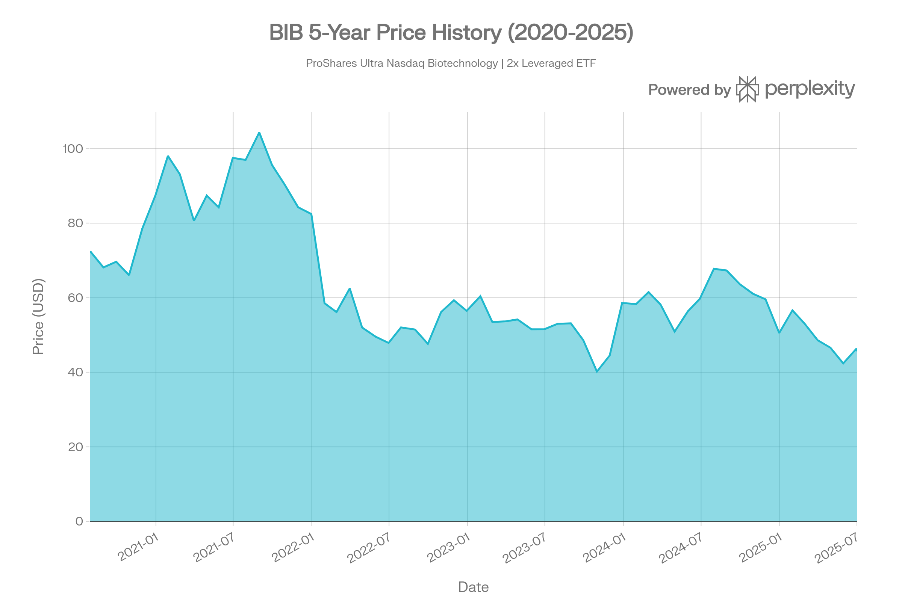
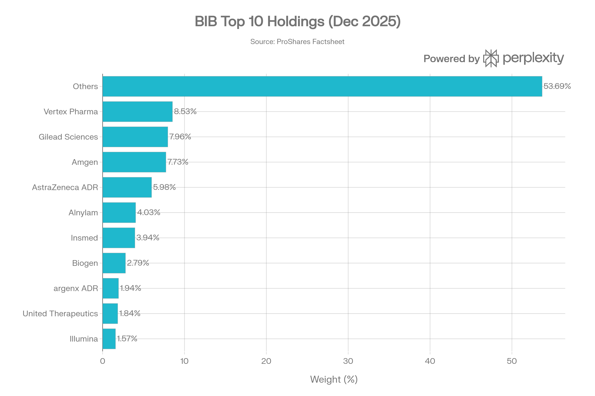
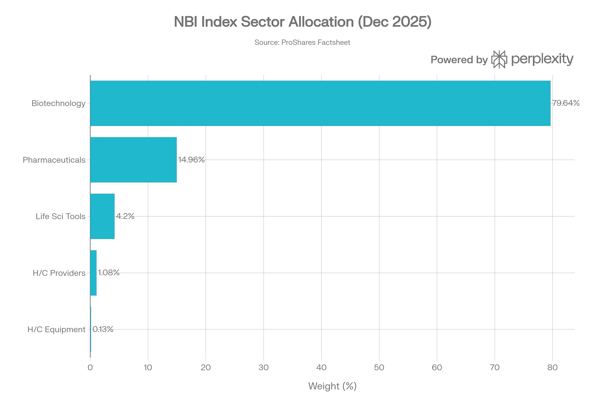
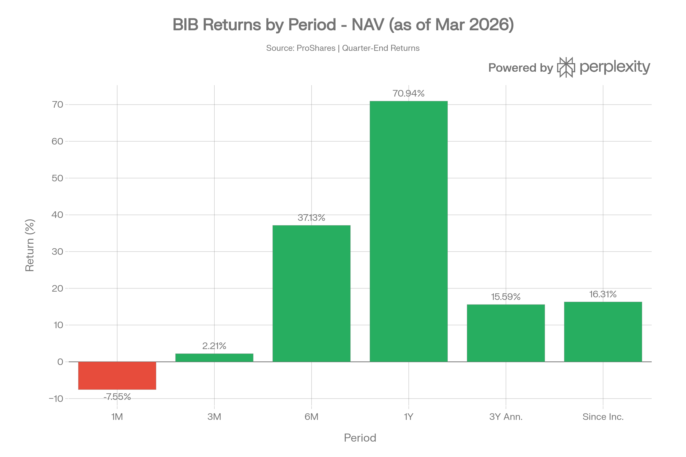

## 요약

> <strong>작성일</strong>: 2026년 5월 25일 기준 데이터 | <strong>운용사</strong>: ProShares (ProShare Advisors LLC)

***
## ETF 분류

| 항목 | 내용 |
|------|------|
| <strong>최종 폴더</strong> | `ETF/Leveraged Inverse/Biotechnology/BIB` |
| <strong>대분류</strong> | 레버리지·인버스 |
| <strong>하위 분류</strong> | 바이오테크 |
| <strong>핵심 전략</strong> | Nasdaq Biotechnology Index 일일 수익률 2배 추구 |
| <strong>레버리지·인버스 여부</strong> | 예, 2x 레버리지 롱 |
| <strong>옵션 인컴 전략 여부</strong> | 아니오 |

BIB는 Nasdaq Biotechnology Index를 기반으로 하지만, 상품의 핵심 구조가 <strong>일일 2배 레버리지</strong>입니다. ETF 분류 기준상 레버리지·인버스 구조는 섹터, 테마, 대표지수보다 우선하므로 일반 바이오테크나 Nasdaq 계열 폴더가 아니라 `Leveraged Inverse/Biotechnology`로 분류합니다.

***
## 1. 기본 정보
BIB는 <strong>Nasdaq Biotechnology Index(NBI)</strong>의 일일 수익률 <strong>2배(2x)</strong> 를 추구하는 레버리지 ETF로, 나스닥에 상장된 바이오테크 및 제약 기업들에 대한 증폭 노출을 단일 티커로 제공한다.[1]

| 항목 | 내용 |
|------|------|
| <strong>정식 명칭</strong> | ProShares Ultra Nasdaq Biotechnology |
| <strong>티커</strong> | BIB (NASDAQ) |
| <strong>설정일</strong> | 2010년 4월 7일 |
| <strong>운용 기간</strong> | 약 16년 (2010년\~현재)[2] |
| <strong>추종 지수</strong> | Nasdaq Biotechnology Index (NBI) |
| <strong>레버리지 배율</strong> | 2배 (200% 일일 수익률 추구) |
| <strong>운용사</strong> | ProShare Advisors LLC |
| <strong>유통사</strong> | SEI Investments Distribution Co. |
| <strong>상장거래소</strong> | NASDAQ |
| <strong>순자산(AUM)</strong> | 약 7,133만 달러 (2026년 5월 22일 기준)[1] |
| <strong>총 보유 종목 수</strong> | 262개[1] |
| <strong>분배 주기</strong> | 분기별(Quarterly)[1] |
| <strong>옵션 거래</strong> | 가능[1] |

BIB는 Nasdaq Biotechnology Index를 추종하는 비레버리지 ETF인 iShares의 <strong>IBB</strong>와 동일한 지수를 기반으로 하되, 일일 수익률을 2배 증폭시키는 구조를 지닌다. 지수는 1993년 11월 기준가 200으로 출발했으며, 현재 262개 바이오테크·제약 기업을 수정 시가총액 가중 방식으로 구성한다.[3][4][5]

***
## 2. 추종 성과 지표
### 추적오차(Tracking Error) 및 추적 차이(Tracking Difference)
BIB는 <strong>합성 복제(Synthetic Replication)</strong> 방식으로 지수를 추적한다. 즉 개별 주식을 직접 매수하는 대신 BNP Paribas, Citibank, Bank of America, Goldman Sachs, Société Générale, UBS 등 6개 금융기관과 체결한 <strong>NBI 스왑 계약</strong>을 통해 레버리지 노출을 확보한다. 이 구조는 일일 목표 수익률(2x) 달성에 최적화되어 있으며, ProShares 팩트시트에 따르면 Q4 2025 기준 지수 대비 상관계수(Correlation) = <strong>1.00</strong>, 베타 = <strong>2.00</strong>을 기록했다. 이는 단기 일일 추적 정확도가 매우 높음을 의미한다.[1][3][6]

그러나 <strong>복리 효과(Compounding Effect)</strong> 로 인해 보유 기간이 길어질수록 2배 레버리지 기대 수익률과 실제 수익률 간 괴리가 발생한다. ProShares는 "일일 투자 목표 이외의 기간에 대한 수익률은 더 높거나 낮을 수 있으며, 그 차이가 유의미할 수 있다"고 명시하고 있다.[3][6]
### NAV 대비 시장가격 괴리율
- <strong>30일 중간 매수·매도 스프레드</strong>: 0.27%[1]
- <strong>시장가격/NAV 괴리율</strong>: 일반적으로 ±0.05\~0.06% 내외로 매우 낮은 수준 유지[3][7]
- TradingView 데이터 기준, BIB는 0.05\~0.06% 프리미엄에서 거래되며, NAV와의 괴리율이 안정적으로 관리되고 있다[7]

***
## 3. 비용 구조
### 보수 및 비용
| 항목 | 수치 |
|------|------|
| <strong>총 보수(Gross Expense Ratio)</strong> | 1.19% (또는 1.14%, 연도별 소폭 차이)[1][6] |
| <strong>순 보수(Net Expense Ratio)</strong> | <strong>0.95%</strong> (계약상 비용 감면 적용)[1][2] |
| <strong>비용 감면 유효 기간</strong> | 2026년 9월 30일까지[1] |
| <strong>30일 SEC 수익률</strong> | -0.22% (2025년 12월 기준)[6] |
| <strong>12개월 수익률(배당 포함)</strong> | 0.77%[6] |

순 보수 0.95%는 스왑 기반 레버리지 구조를 감안하면 경쟁력 있는 수준이다. 비교 상품인 <strong>LABU(Direxion Daily S&P Biotech Bull 3X)</strong>의 보수는 0.93%로 근사하나, LABU는 3배 레버리지로 리스크와 비용 구조가 상이하다.[8]
### 경쟁 ETF 비용 비교
| ETF | 레버리지 | 추종 지수 | 순 보수 | AUM |
|-----|--------|---------|--------|-----|
| <strong>BIB</strong> | 2x | Nasdaq Biotech Index | <strong>0.95%</strong> | \~$71M[1] |
| IBB | 1x | Nasdaq Biotech Index | 0.44% | \~$7.9B[9] |
| LABU | 3x | S&P Biotech Select | 0.93%[8] | \~$798M[8] |

비레버리지 기준 ETF인 IBB 대비 BIB의 보수는 약 2배 수준이나, 이는 스왑 비용, 일일 리밸런싱 운영 비용을 반영한 것이다.
### 포트폴리오 회전율
레버리지 ETF의 특성상 <strong>매일 리밸런싱</strong>이 이루어지며, 이에 따른 포트폴리오 회전율은 매우 높다. LABU의 공시 회전율이 179%에 달하는 점을 고려할 때, BIB도 이와 유사한 수준의 높은 회전율이 예상된다.[3][10]

***
## 4. 유동성 평가
### 거래량 및 거래대금

| 항목 | 수치 |
|------|------|
| <strong>일평균 거래량(30일)</strong> | 약 6,000\~10,400주[11][12] |
| <strong>최근 거래량(2026.5.22)</strong> | 6,034주[1] |
| <strong>30일 중간 호가 스프레드</strong> | 0.27%[1] |
| <strong>내재 변동성(IV)</strong> | 43.81%[13] |
| <strong>역사적 변동성(HV)</strong> | 51.78%[13] |

BIB의 일평균 거래량은 약 6,000\~10,000주로, 소규모 ETF에 해당한다. AUM이 약 7,133만 달러에 불과하고 1년 펀드 플로우는 <strong>-2,183만 달러</strong>를 기록하고 있어 자금 유출이 지속되는 상황이다. 이러한 낮은 유동성은 대규모 포지션 진입·청산 시 <strong>슬리피지(Slippage)</strong> 위험을 증가시킨다.[1][3]
*▲ BIB 5년 가격 추이 (2020\~2025): 2021년 고점($104) 이후 하락 후 회복 흐름*

***
## 5. 포트폴리오 구성
### 레버리지 확보 구조
BIB는 직접 주식 보유 외 <strong>NBI 스왑 계약(총 노셔널 규모 약 7,681만 달러)</strong>을 통해 레버리지 익스포저를 확보한다. 스왑 카운터파티는 BNP Paribas(31.65%), Citibank(29.11%), Bank of America(27.87%), Goldman Sachs(21.80%), Société Générale(20.76%), UBS(5.23%) 등 다수의 금융기관으로 분산되어 있다.[1]
### 상위 10대 보유 종목 (2025년 12월 31일 기준, 지수 구성 기준)

| 순위 | 종목 | 비중 |
|------|------|------|
| 1 | Vertex Pharmaceuticals (VRTX) | 8.53%[6] |
| 2 | Gilead Sciences (GILD) | 7.96%[6] |
| 3 | Amgen (AMGN) | 7.73%[6] |
| 4 | AstraZeneca ADR (AZN) | 5.98%[6] |
| 5 | Alnylam Pharmaceuticals (ALNY) | 4.03%[6] |
| 6 | Insmed (INSM) | 3.94%[6] |
| 7 | Biogen (BIIB) | 2.79%[6] |
| 8 | argenx SE-ADR (ARGX) | 1.94%[6] |
| 9 | United Therapeutics (UTHR) | 1.84%[6] |
| 10 | Illumina (ILMN) | 1.57%[6] |
| <strong>상위 10종목 합계</strong> | | <strong>46.31%</strong>[6] |
*▲ BIB 상위 10대 보유 종목 비중 (지수 기준, 2025.12)*
### 섹터별 배분 현황

| 섹터 | 비중 |
|------|------|
| 바이오테크놀로지 | 79.64%[6] |
| 제약(Pharmaceuticals) | 14.96%[6] |
| 생명과학 도구 및 서비스 | 4.20%[6] |
| 의료 서비스 제공자 | 1.08%[6] |
| 의료 장비 | 0.13%[6] |
*▲ NBI 지수 섹터 배분 (2025.12 기준)*

바이오테크놀로지 섹터가 전체의 <strong>79.64%</strong>를 차지하며 극도로 집중되어 있다. 이는 섹터 집중도 리스크가 매우 높음을 의미하며, 임상시험 실패, FDA 결정, M&A 이벤트 등에 따른 섹터 전반 변동성에 크게 노출된다.[6]
### 국가별/지역별 분산
지수 구성 종목은 <strong>북미 83.92%, 유럽 15.66%, 아시아 0.36%, 오세아니아 0.06%</strong> 순이다. AstraZeneca, argenx, BioNTech 등 유럽계 ADR 종목이 일부 포함되나, 본질적으로 미국 나스닥 상장 기업 중심이다.[7]
### 리밸런싱 주기
<strong>매일(Daily)</strong> 리밸런싱을 통해 2x 레버리지 익스포저를 목표 수준으로 재조정한다. 지수 구성 종목 리밸런싱은 Nasdaq의 별도 기준에 따르며, 수정 시가총액 가중 방식을 적용한다.[3][6][4]

***
## 6. 성과 분석
### 기간별 수익률

아래는 ProShares 공식 사이트의 2026년 3월 31일(분기 말) 기준 NAV 수익률이다.[1]

| 기간 | BIB NAV | BIB 시장가격 |
|------|---------|-----------|
| 1개월 | -7.55% | -7.52% |
| 3개월 | +2.21% | +2.18% |
| 6개월 | +37.13% | +37.06% |
| 1년 | <strong>+70.94%</strong> | +70.63% |
| 3년(연환산) | +15.59% | +15.62% |
| 5년(연환산) | +0.06% | +0.04% |
| 설정 이후(연환산) | +16.31% | +16.31% |
*▲ BIB 기간별 수익률 (NAV 기준, 2026.03.31 기준)*

<strong>주요 특이사항</strong>:
- 1년 수익률이 +70.94%로 매우 높게 나타났는데, 이는 2024년 4월\~2025년 4월의 기저효과와 바이오테크 랠리가 주요 원인이다[14]
- 반면 5년 수익률은 연환산 +0.06%에 불과하여, 장기 보유 시 복리 손실(Volatility Decay) 효과가 명확하게 드러난다[1]
- 52주 가격 범위는 $42.09 \~ $90.91 (약 116% 차이)[11]
### 벤치마크 대비 초과 수익률
Q4 2025 기준 BIB NAV 수익률은 34.17%, 시장가격은 34.14%로, NBI 지수 17.11%의 <strong>약 2배</strong> 수익률을 달성했다. 이는 단기적으로 레버리지 목표가 달성됨을 보여준다.[6]
### 리스크 지표
| 지표 | 수치 |
|------|------|
| <strong>NBI 지수 연간 변동성</strong> | 16.98%[6] |
| <strong>BIB 내재 변동성(IV)</strong> | 43.81%[13] |
| <strong>BIB 역사적 변동성(HV)</strong> | 51.78%[13] |
| <strong>3년 수익률(연환산)</strong> | 15.59%[1] |
| <strong>설정 이후 최대 낙폭(MDD)</strong> | <strong>-67.24%</strong>[15] |
| <strong>60개월 베타</strong> | 1.35 (시장 기준)[13] |

샤프 지수는 단기 기준으로 긍정적이나(90일 기준 -2.4%로 최근 약세), 레버리지 ETF 특성상 변동성 조정 후 장기 성과는 크게 저하된다. 2022년 바이오테크 섹터 급락 시기에는 주가가 $100 이상에서 $47 수준으로 폭락했으며, 설정 이후 최대 낙폭은 <strong>-67.24%</strong>에 달한다.[16][15]

***
## 7. 배당 정보
BIB는 <strong>분기별</strong> 배당을 지급하지만, 배당 규모는 매우 불규칙하다.[1][17]
### 최근 배당 이력
| 배당락일 | 지급일 | 주당 배당금 |
|---------|--------|-----------|
| 2026-03-25 | 2026-03-25 | $0.0071[18] |
| 2025-09-23 | - | $0.1805[19] |
| 2025-06-24 | 2025-07-01 | $0.1706[17] |
| 2025-03-26 | 2025-04-01 | $0.1309[17] |
| 2024-12-23 | 2024-12-31 | $0.3964[17] |
| 2024-09-25 | 2024-10-02 | $0.1529[17] |
| 2024-06-26 | 2024-07-03 | $0.2648[17] |
| 2024-03-20 | 2024-03-27 | $0.0403[17] |
| 2023-12-20 | 2023-12-28 | $0.0384[17] |
| 2022-12-22 | 2022-12-30 | $0.0199[17] |

- <strong>배당 수익률(TTM)</strong>: 약 0.61\~1.69% (시점 및 주가에 따라 변동)[13][17]
- <strong>배당 성장률(1년)</strong>: 147.71%(전년 대비, 2025 기준) — 다만 이는 배당 규모의 극심한 변동성을 반영하며, 안정적 배당 성장으로 해석하기 어렵다[17]
- BIB의 배당은 파생상품(스왑) 기반 운용 특성상 기초 지수의 배당 흐름을 직접 반영하지 않으며, 세금 처리는 통상 소득(Ordinary Income)으로 분류된다[3]

***
## 8. 리스크 요소
### 베타 계수
- 시장(S&P 500) 대비 <strong>60개월 베타 1.35</strong>[13]
- NBI 지수 대비 일일 베타 = <strong>2.00</strong>[6]

베타 2.00은 NBI 지수가 1% 상승 시 BIB가 이론적으로 2% 상승(혹은 하락)하도록 설계되어 있음을 의미한다. 실제로 바이오테크 개별 종목들은 베타가 극히 높을 수 있어(일부 5 이상), 구성 종목 이벤트 하나가 펀드 전체에 미치는 영향이 크다.
### 상관계수
| 자산 | BIB와의 상관성 |
|------|-------------|
| Nasdaq Biotechnology Index (NBI) | ≈ 1.00 (일별, 거의 완벽 추적)[6] |
| S&P 500 | 중간 수준의 양의 상관 (헬스케어 섹터 특성)[16] |
| 금, 채권 | 낮은 상관 (분산 효과 일부 존재) |
### 섹터 집중도 리스크
포트폴리오의 <strong>79.64%가 바이오테크놀로지 단일 섹터</strong>에 집중되어 있다. 이는 다음과 같은 이벤트 리스크에 직접 노출됨을 의미한다:[6]

- <strong>임상시험 실패</strong>: 주요 종목의 Phase 3 데이터 미달 시 섹터 급락
- <strong>FDA 규제 결정</strong>: 승인 거부 혹은 완전답변서(CRL) 발행 시 단기 급락
- <strong>특허 절벽</strong>: 대형 바이오텍 제품의 특허 만료 및 바이오시밀러 경쟁 심화
- <strong>M&A 기대감 붕괴</strong>: 인수합병 협상 결렬 시 관련 종목 주가 급락
- <strong>거시 금리 환경</strong>: 고금리 환경에서 성장주인 바이오테크 밸류에이션 압축

일부 구성 종목들은 매출이 전무한 임상 단계 기업으로, 파이프라인 실패 시 개별 종목 급락 리스크가 존재한다.[8]
### 레버리지 특유의 복리 손실(Volatility Decay)
레버리지 ETF의 가장 큰 구조적 리스크는 <strong>변동성 손실(Volatility Decay 또는 Beta Slippage)</strong>이다. 예를 들어 지수가 하루 10% 하락 후 다음 날 11.11% 상승해 원점 복귀해도, 2x ETF는 원점으로 돌아오지 못한다. LABU(3x) 기준 연평균 드리프트(복리 손실)는 약 -12.26%\~-21.5%로 추정되며, BIB(2x)도 이와 유사한 방향성의 손실이 축적된다. 이는 BIB의 <strong>5년 연환산 수익률이 +0.06%에 그치는</strong> 핵심 원인이다.[1][3][8][6]
### 유동성 리스크
AUM 약 7,133만 달러, 일평균 거래량 6,000\~10,000주 수준은 소규모 ETF에 해당하며, 대규모 자금 집중 시 호가 스프레드 확대 및 슬리피지가 발생할 수 있다. 펀드 1년 자금 유출액이 -2,183만 달러에 달해 청산 리스크도 잠재적으로 고려해야 한다.[1][11][3]

***
## 9. 경쟁 ETF 비교
| 항목 | BIB | IBB | LABU | LABD |
|------|-----|-----|------|------|
| <strong>운용사</strong> | ProShares | iShares(BlackRock) | Direxion | Direxion |
| <strong>레버리지</strong> | 2x Long | 1x | 3x Long | 3x Short |
| <strong>추종 지수</strong> | NBI | NBI | S&P Biotech Select | S&P Biotech Select |
| <strong>보수</strong> | 0.95%[2] | 0.44%[9] | 0.93%[8] | 1.07%[10] |
| <strong>AUM</strong> | \~$71M[1] | \~$7.9B[9] | \~$798M[8] | \~$70M[10] |
| <strong>설정일</strong> | 2010.04.07[2] | - | 2015.05.28[8] | - |
| <strong>리밸런싱</strong> | 일별 | 없음 | 일별 | 일별 |
| <strong>장기 보유 적합성</strong> | ❌ 부적합 | ✅ 적합 | ❌ 부적합 | ❌ 부적합 |

IBB는 비레버리지 기준 ETF로 AUM 기준 동일 지수 추종 ETF 중 가장 유동성이 높다. BIB는 단기 트레이딩 목적의 2x 레버리지 상품으로, IBB 대비 보수가 약 2배이나 일일 단위의 증폭 수익 추구에 특화되어 있다.[3][8]

***
## 10. 투자자 고려사항 및 총평
<strong>BIB는 단기 전술적 트레이딩 목적으로 설계된 고위험 레버리지 ETF다.</strong> ProShares 자체적으로도 "매일 투자 목표를 갖고 있으나, 목표 및 리스크 허용 범위와 일치한다고 판단하는 경우 하루 이상 보유할 수 있다"고 명시하지만, 레버리지 복리 구조상 <strong>장기 보유(Buy & Hold)에는 구조적으로 부적합</strong>하다.[6]
### 투자 적합 프로파일
- <strong>적합</strong>: 단기(1일\~수 주) 바이오테크 강세 베팅, 헤지 전략의 일환
- <strong>부적합</strong>: 장기 포트폴리오 핵심 자산, 저위험 선호 투자자, 바이오테크 섹터 장기 성장 참여 목적
### 핵심 요약
| 항목 | 평가 |
|------|------|
| 단기 추적 정확도 | ⭐⭐⭐⭐⭐ (Beta=2.00, Corr=1.00)[6] |
| 비용 효율성 | ⭐⭐⭐ (0.95%, 레버리지 감안 시 적정) |
| 유동성 | ⭐⭐ (소규모 AUM, 낮은 거래량) |
| 장기 성과 | ⭐ (5년 연환산 +0.06%)[1] |
| 단기 성과(1년) | ⭐⭐⭐⭐ (+70.94% NAV)[1] |
| 섹터 집중 리스크 | 🔴 높음 (바이오테크 79.64%)[6] |
| 복리 손실 리스크 | 🔴 높음 (구조적 취약점) |

> ⚠️ <strong>면책 조항</strong>: 본 보고서는 정보 제공 목적으로 작성된 것이며, 투자 권고나 조언으로 해석되어서는 안 된다. 레버리지 ETF는 원금 전액 손실을 포함한 높은 투자 리스크를 내포한다.
