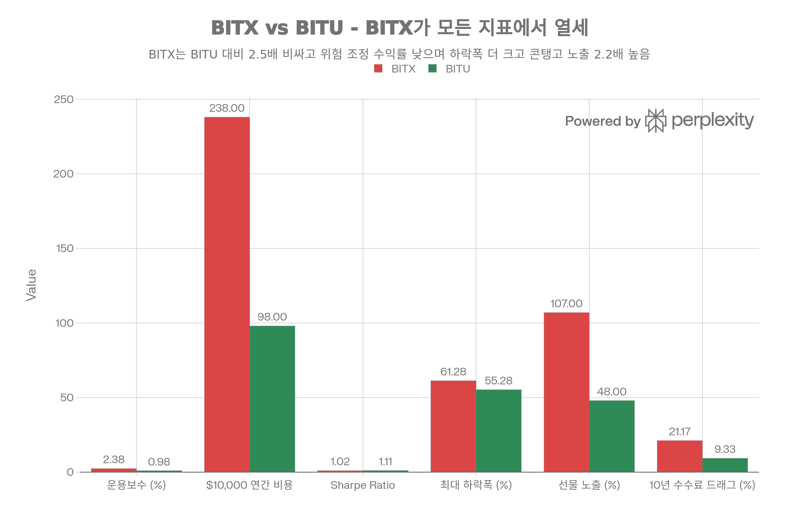

## 핵심 요약 (Executive Summary)

<strong>BITX(2x Bitcoin Strategy ETF)</strong> 는 2023년 6월 Volatility Shares가 출시한 <strong>2배 일일 비트코인 레버리지 ETF</strong>로, BITU와 기능적으로 동일하지만 <strong>천문학적으로 높은 2.38% 운용보수</strong>로 BITU(0.98%)의 <strong>2.5배 비용</strong>을 부과합니다. 이 <strong>연 1.40%p 수수료 페널티</strong>는 5년간 -7%p, 10년간 -14%p 누적 저성과로 이어지며 어떤 이점도 제공하지 않습니다. <strong>2025년 비트코인이 -17% 하락할 때 BITX는 -50% 폭락</strong>하여 일일 리셋과 변동성 붕괴의 치명성을 증명했고, <strong>-\$557M 순유출(AUM의 4.9%)</strong> 은 투자자들이 발로 투표했음을 보여줍니다. BITX는 BITU 대비 <strong>위험 조정 수익률 열세</strong>(Sharpe 1.02 vs 1.11), <strong>더 깊은 최대 하락폭</strong>(-61.28% vs -55.28%), <strong>더 높은 콘탱고 노출</strong>(107% 선물 vs 48%)로 모든 지표에서 패배합니다. <strong>유일한 장점은 높은 유동성</strong>(일일 9.33M 거래량)이지만 99% 트레이더에게 무의미하며 2.5배 수수료를 정당화할 수 없습니다. <strong>명확한 결론</strong>: BITX는 <strong>BITU의 열등한 복제품으로 변명 불가능한 수수료</strong>를 부과하며, 이성적 투자자는 BITU를 선택하거나 장기 노출이 필요하면 IBIT(0.25% 수수료)나 비트코인 직접 보유(0% 수수료)를 선택해야 합니다.[^1][^2][^3][^4][^5][^6][^7][^8][^9][^10][^11]

## 펀드 기본 정보

### 개요

<strong>BITX</strong>는 Volatility Shares가 2023년 출시한 <strong>2배 레버리지 비트코인 ETF</strong>입니다:[^1][^2][^6]

<strong>핵심 특징:</strong>

- <strong>운용사</strong>: Volatility Shares LLC
- <strong>설정일</strong>: 2023년 6월 27일[^2][^6][^12]
- <strong>상장거래소</strong>: CBOE (Cboe Options Exchange)[^6]
- <strong>운용자산(AUM)</strong>: 14억 5,000만\~27억 2,000만 달러[^8][^9][^13][^6]
- <strong>운용보수</strong>: <strong>2.38%</strong> <strong>(극도로 높음)</strong>[^14][^9][^13][^10][^11][^2][^6][^8]
- <strong>투자 목표</strong>: <strong>비트코인 일일 수익률의 2배</strong>[^4][^1][^2]
- <strong>레버리지</strong>: <strong>2x 일일 리셋</strong>[^1][^4][^6]
- <strong>추적 지수</strong>: S\&P CME Bitcoin Futures Daily Roll Index[^4]
- <strong>옵션</strong>: 이용 가능
- <strong>배당</strong>: 월별[^9][^12][^15]

### 현재 시장 지표 (2026년 1월)

| 지표 | 수치 |
| :-- | :-- |
| 현재 가격 | \$29.18-34.42[^16][^17][^6] |
| <strong>52주 범위</strong> | <strong>\$24.47-\$72.80</strong>[^6][^12] |
| <strong>범위</strong> | <strong>197%</strong> (고점/저점) |
| NAV | \$54.20[^8] |
| 보유 종목 | 8-9개[^6][^9] |
| 일평균 거래량 | 674만\~933만 주[^6] |
| 시가총액 | \$14억 5,000만\~27억 2,000만[^6][^9][^13] |
| <strong>Beta</strong> | <strong>3.36-3.80</strong>[^8][^9][^13] <strong>(극단적)</strong> |
| 배당수익률 (TTM) | 8.17-27.86%[^3][^5][^18] |

## 핵심 문제: 천문학적으로 높은 2.38% 운용보수

### BITX vs BITU 수수료 비교

BITX는 BITU 대비 모든 핵심 지표에서 열세입니다. 운용보수 2.38% (BITU의 2.5배), 최대 하락폭 -61.28% (BITU보다 6%p 더 깊음), Sharpe Ratio 1.02 (BITU 1.11보다 낮음), 선물 노출 107% (BITU 48%의 2.2배로 콘탱고 드래그 더 큼). 10년간 수수료 누적 드래그는 BITX -21.17% vs BITU -9.33%로 BITX가 11.84%p 더 많은 비용을 발생시킵니다. BITX의 유일한 장점은 높은 유동성(일일 거래량 9.33M)이지만 99% 트레이더에게는 무의미하며 2.5배 높은 수수료를 정당화할 수 없습니다.

위 차트가 명확히 보여주듯이, <strong>BITX는 BITU 대비 모든 지표에서 열세</strong>입니다:[^3][^5][^10][^11]

<strong>운용보수</strong>:[^2][^14][^6][^8][^9][^13][^10][^11]

- <strong>BITX: 2.38%</strong>
- <strong>BITU: 0.98%</strong>
- <strong>BITX가 144% 더 비쌈</strong> (2.43배)

<strong>\$10,000 투자 시 연간 비용</strong>:

- BITX: \$238/년
- BITU: \$98/년
- <strong>BITX가 \$140 더 비쌈</strong>

<strong>10년 복리 비용</strong>:

- BITX 2.38%: 총 드래그 -21.17%
- BITU 0.98%: 총 드래그 -9.33%
- <strong>BITX가 10년간 11.84%p 더 비쌈</strong>

### 왜 BITX가 그렇게 비싼가?[^19][^20][^9]

<strong>BestETF 분석</strong>:[^9]
> "2.38% 운용보수 - 매우 높음. 아이고. 레버리지, 인버스 또는 매우 전문화된 펀드의 전형—단기 거래에는 괜찮지만 매수 후 보유 투자자에게는 정당화하기 어렵습니다."

<strong>Seeking Alpha</strong> (2025년 8월):[^20]
> "ETF는 강한 거래량으로 유동성이 높지만 2.38% 운용보수는 경쟁사보다 상당히 높아 전체 수익률에 영향을 미칩니다."

<strong>Reddit 토론</strong>:[^10]
> "BITX는 상대적으로 높은 1.9%의 운용보수를 가지고 있는 반면 [실제로는 2.38%], ProShares의 BITU는 0.95%의 훨씬 낮은 비율을 가지고 있습니다."

<strong>정당화 시도</strong>:

- 시장 선점 (2023년 6월 vs 2024년 4월)
- 소규모 발행사 (Volatility Shares vs ProShares)
- 높은 운영 비용
- <strong>하지만 144% 프리미엄 정당화 불가</strong>

### 수익률 영향

<strong>예시: 비트코인 1년간 +100%</strong>:[^19][^9]

<strong>예상 2x</strong>: +200%

<strong>BITX 실제</strong> (2.38% 수수료 + 붕괴):

- 총수익: +200%
- 운용보수 드래그: -2.38%
- 변동성 붕괴: -25-40%
- <strong>순수익</strong>: +130-155%

<strong>BITU 실제</strong> (0.98% 수수료 + 붕괴):

- 총수익: +200%
- 운용보수 드래그: -0.98%
- 변동성 붕괴: -25-40%
- <strong>순수익</strong>: +135-160%

<strong>BITX가 수수료만으로 -5%p 저성과</strong>

## 성과 분석

### 공식 성과

<strong>Yahoo Finance</strong> (2025년 12월):[^7]
> "2025년에 BITX 펀드는 비트코인 자체가 17%만 하락했음에도 50%의 상당한 하락을 경험했습니다."

<strong>Total Real Returns</strong> (배당 재투자 포함):[^21]

| 기간 | BITX 수익률 |
| :-- | :-- |
| <strong>YTD 2026</strong> | +15.54% |
| <strong>2025</strong> | <strong>-38.71%</strong> |
| <strong>2024</strong> | +163.41% |
| <strong>2023 (부분)</strong> | +47.23% |
| <strong>출시 이후</strong> | <strong>+135.88%</strong> (+40.80%/년) |

<strong>하락폭</strong>:[^21]

- 현재: -56.14%
- 역대 최악: <strong>-61.28%</strong> (2024년 9월 6일)

### vs BITU: BITX 수수료로 패배, 성과 유사

<strong>PortfoliosLab 비교</strong>:[^3][^5]

| 기간 | BITX | BITU | 승자 |
| :-- | :-- | :-- | :-- |
| YTD | +26.90-31.82% | +28.22-33.24% | BITU (약간) |
| 3개월 | +15.36-24.51% | +15.33-24.61% | 동점 |
| 1개월 | +3.31-10.58% | +3.98-11.36% | BITU (약간) |
| 출시 이후 | +103.76-104.69% | +111.65-113.31% | <strong>BITU (+7-9%p)</strong> |

<strong>위험 조정 성과</strong>:[^5][^3]

| 지표 | BITX | BITU | 승자 |
| :-- | :-- | :-- | :-- |
| Sharpe Ratio | 1.02-1.03 | <strong>1.11-1.13</strong> | <strong>BITU</strong> |
| Sortino Ratio | 1.73-1.81 | <strong>1.80-1.87</strong> | <strong>BITU</strong> |
| Omega Ratio | 1.21-1.22 | <strong>1.22-1.23</strong> | <strong>BITU</strong> |
| Calmar Ratio | 1.45-1.59 | <strong>1.74-1.91</strong> | <strong>BITU</strong> |
| Martin Ratio | 3.30-3.63 | <strong>3.74-4.08</strong> | <strong>BITU</strong> |

<strong>최대 하락폭</strong>:[^3][^5]

- BITX: <strong>-61.28%</strong> (더 나쁨)
- BITU: -55.28% (더 나음)
- <strong>BITX가 6%p 더 깊은 손실</strong>

<strong>운용보수</strong>:[^10][^5][^3]

- BITX: <strong>2.38%</strong>
- BITU: 0.95-0.98%
- <strong>BITX가 2.43배 더 비쌈</strong>

<strong>Projeckza 비교</strong> (2025년 5월):[^11]

| 지표 | BITU | BITX | 승자 |
| :-- | :-- | :-- | :-- |
| 운용보수 | <strong>0.95%</strong> | 2.38% | <strong>BITU (2.5배 저렴)</strong> |
| AUM | \$11억 7,000만 | \$28억 5,000만 | BITX (더 큼) |
| 1개월 | +5.53% | +5.57% | 동점 |
| 6개월 | -18.4% | -18.9% | 동점 |
| 12개월 | <strong>+58.54%</strong> | +36.7% | <strong>BITU (+21.84%p)</strong> |

<strong>핵심 인사이트</strong>: BITU가 10개월 늦게 출시했음에도 12개월 수익률에서 <strong>21.84%p 초과 달성</strong>[^11]

## 2배 레버리지: BITU와 동일한 문제

### 일일 리셋 메커니즘[^1][^22][^19]

<strong>Volatility Shares 공식 경고</strong>:[^1]
> "2x Bitcoin Strategy ETF는 수수료 및 비용 전 일일 투자 결과를 제공하고자 하며, 이는 단일 거래일에 대한 비트코인 수익률의 2배에 해당하며, <strong>다른 기간에는 해당하지 않습니다</strong>."

> "펀드는 단기 거래 수단으로 사용되도록 의도되었습니다. 펀드 투자자는 매일만큼 자주 투자를 적극적으로 관리하고 모니터링해야 합니다."

> "투자자는 단일 거래일 내에 투자 전액을 잃을 수 있습니다."

### 변동성 붕괴: BITU와 동일[^23][^19][^7]

<strong>Six Figure Investing</strong> (상세 분석):[^19]
> "2X 레버리지 상품의 경우 평균 일일 변동성 드래그는 기본 지수의 일일 변동성 제곱과 거의 같습니다... BITX의 변동성 드래그는 (.04)^2 = 0.16% 정도입니다. 이것이 많아 보이지 않을 수 있지만, 약 250 거래일이 있는 1년 동안 누적 손실은 (1-.0016)^250 -1 = -0.33, 즉 <strong>연 33%</strong> 가 됩니다."

<strong>Yahoo Finance</strong> (2025년 12월):[^7]
> "BITX는 2x 레버리지를 유지하기 위해 매일 리셋하며 변동성 붕괴를 야기합니다. 비트코인이 하루에 10% 하락하고 다음 날 10% 상승하면 손익분기가 되지 않습니다. 수학: 비트코인에 \$100 투자가 \$90로 떨어진 후 \$99로 상승합니다. 하지만 BITX의 2x 노출은 \$80로 떨어진 후 \$96으로만 회복됩니다. 그 4% 격차가 변동성 붕괴이며 끊임없이 복리됩니다."

<strong>BITX 총 드래그</strong>:

- 운용보수: 연 -2.38%
- 콘탱고: 연 -2-4%
- 변동성 붕괴: 연 -32-50%
- <strong>총</strong>: 비트코인 대비 <strong>연 -36.38-56.38%</strong>

<strong>BITU 총 드래그</strong> (비교):

- 운용보수: 연 -0.98%
- 콘탱고: 연 -2-4% (하지만 48% 선물 노출만)
- 변동성 붕괴: 연 -32-50% (동일)
- <strong>총</strong>: 비트코인 대비 연 -34.98-54.98%

<strong>BITX가 수수료만으로 연 1.40%p 더 나쁨</strong>

## 보유 구조[^9]

<strong>BestETF 보유 종목</strong> (8개 자산):[^9]

1. <strong>Bitcoin Future July 25</strong>: 73.20%
2. <strong>Deposits With Broker For Short Positions</strong>: 47.69%
3. <strong>Deposits With Broker For Short Positions</strong>: 42.11%
4. <strong>Bitcoin Future Aug 25</strong>: 33.74%
5. <strong>FGXXX</strong> (First American Govt Obligs): 9.58%
6. <strong>Us Dollars</strong>: 0.00%
7. <strong>Us Dollars</strong>: -0.02%
8. <strong>Cash Offset</strong>: <strong>-106.30%</strong>

<strong>총 노출</strong>: \~200% (2배 레버리지)

<strong>구조</strong>:

- \~107% CME 비트코인 선물 (7월 + 8월)
- \~90% 숏 포지션 예치금 (레버리지 담보)
- 9.58% 머니마켓 펀드
- 순: 2배 레버리지 비트코인 노출

<strong>vs BITU</strong>:[^24][^9]

- BITU: 48% 선물, 152% IBIT/FBTC 스왑 (콘탱고 적음)
- BITX: 107% 선물, 0% 스팟 ETF 스왑 (콘탱고 많음)
- <strong>BITX가 콘탱고 노출 2.2배 더 많음</strong>

## 2025년 성과 재앙

### Yahoo Finance 분석 (2025년 12월)[^7]

<strong>헤드라인</strong>:
> "BITX가 비트코인 후퇴로 50% 하락, 다음 랠리는?"

<strong>성과 재앙</strong>:
> "2025년에 BITX 펀드는 일일 리밸런싱과 변동성 붕괴의 효과로 인해 비트코인 자체가 17%만 하락했음에도 50%의 상당한 하락을 경험했습니다."

<strong>구조적 문제들</strong>:[^7]

<strong>1. 대규모 순유출</strong>:
> "펀드는 총 \$5억 5,700만의 순유출을 겪었으며 2.38% 운용보수가 불안정한 시장 상황에서 손실을 악화시켰습니다."

<strong>2. 소매 투자자 탈출</strong>:
> "11월 고점 근처에서 투자한 사람들은 상당한 손실에 직면하여 비트코인의 현재 약 \$90,000가 회복의 길을 열지 또 다른 거짓 시작으로 끝날지 불확실성을 초래했습니다."

<strong>3. 일일 리셋 + 변동성 붕괴</strong>:
> "변동성이 큰 시장에서 펀드는 시간이 지나도 비트코인 가격이 안정적으로 유지되더라도 가치를 잃을 수 있습니다. 이 변동성 붕괴 현상은 BITX의 50% 하락이 비트코인의 정점 대비 17% 하락을 능가하는 이유를 명확히 합니다."

<strong>4. 운용보수가 고통 증폭</strong>:
> "게다가 2.38% 운용보수와 선물 롤링과 관련된 비용이 재정적 부담을 가중시킵니다."

## 전문가 의견: 회피 또는 BITU 사용

### Seeking Alpha: "미흡함" - 매도 권고[^22][^20]

<strong>2025년 8월 분석</strong>:[^20]
> "BITX는 블록의 인기 있는 레버리지 전략입니다"

<strong>하지만</strong>:
> "ETF는 강한 거래량으로 유동성이 높지만 2.38% 운용보수는 경쟁사보다 상당히 높아 전체 수익률에 영향을 미칩니다."

<strong>2024년 6월 분석: "매도"</strong>:[^22]
> "BITX 미흡함: 위험, 비용, 성과 분석에 기반한 매도 권고"

<strong>일일 리셋 리스크</strong>:[^22]
> "일일 리셋 또는 리밸런싱 메커니즘은 BITX가 일일 기준으로 2x 수익을 달성하도록 의도되었음을 의미하지만 장기간에 걸쳐서는 사실이 아닐 수 있습니다. 특히 불안정한 시장에서 이 일일 리셋은 복리 결과를 초래하여 실제 수익률이 예상 2x 성과에서 점진적으로 벗어나게 할 수 있습니다."

### Reddit: "BITX 또는 BITU?"[^10]

<strong>사용자 질문</strong>:
> "둘을 비교한 사람이 있나요? BITX가 더 큰 거래량을 가지고 있지만 더 높은 운용보수도 있습니다. 반면 BITU는 가격을 더 정확하게 추적하는 것으로 보이며 ProShares는 레버리지 ETF 분야에서 오랜 역사로 뒷받침되는 탄탄한 명성을 가지고 있습니다."

<strong>주요 답변</strong>:
> "BITU가 가격을 더 정확하게 추적하는 것으로 보이며 ProShares는 레버리지 ETF 분야에서 오랜 역사로 뒷받침되는 탄탄한 명성을 가지고 있습니다."

> "BITX는 상대적으로 높은 1.9%의 운용보수를 가지고 있는 반면, ProShares의 BITU는 0.95%의 훨씬 낮은 비율을 가지고 있습니다."

<strong>합의</strong>: <strong>BITU 사용, BITX 아님</strong>

## BITX를 선택할 유일한 이유

<strong>더 높은 유동성</strong>:[^10]

- BITX: 평균 거래량 933만[^6]
- BITU: 평균 거래량 274만\~507만[^24][^25]
- <strong>BITX가 1.8-3.4배 더 많은 거래량</strong>

<strong>왜 중요한가</strong>:

- 더 좁은 매수-매도 스프레드
- 대량 주문에 더 나은 체결 가격
- 포지션을 빠르게 탈출하기 쉬움
- <strong>대형 기관 트레이더나 매우 큰 소매 주문에만 관련</strong>

<strong>99% 트레이더의 경우</strong>: BITU의 유동성으로 충분하며, 2.5배 낮은 수수료가 유동성 이점을 훨씬 능가합니다

## 2026년 전망

### 성과 시나리오 (BITU와 동일)

<strong>강세 시나리오</strong> (비트코인 +50%):

- 예상 BITX: +100%
- 60% 변동성 + 2.38% 수수료: +50-70%
- <strong>BITU 0.98% 수수료: +55-75%</strong>
- <strong>BITX가 수수료로 -5%p 저성과</strong>

<strong>기본 시나리오</strong> (비트코인 +20%):

- 예상 BITX: +40%
- 60% 변동성 + 2.38% 수수료: +10-20%
- <strong>BITU 0.98% 수수료: +15-25%</strong>
- <strong>BITX가 수수료로 -5%p 저성과</strong>

<strong>약세 시나리오</strong> (비트코인 -30%):

- 예상 BITX: -60%
- 변동성 + 2.38% 수수료: -70-75%
- <strong>BITU 0.98% 수수료: -68-73%</strong>
- <strong>BITX가 수수료로 -2-3%p 저성과</strong>

## 베스트 프랙티스: BITX 대신 BITU 선택

### 대체 전략

<strong>2배 비트코인 노출</strong>:

1. <strong>BITU</strong>: 2배 레버리지, 0.98% 수수료 (BITX보다 2.5배 저렴)
2. <strong>비트코인 마진</strong>: 8-12% 이자, 붕괴 없음
3. <strong>비트코인 콜옵션</strong>: 정의된 위험, 일일 리셋 없음
4. <strong>BITX 아님</strong>: 2.38% 수수료는 변명 불가

<strong>비트코인 노출</strong>:

1. <strong>IBIT</strong>: 1x 스팟, 0.25% 수수료, 붕괴 없음
2. <strong>FBTC</strong>: 1x 스팟, 0.25% 수수료, 붕괴 없음
3. <strong>비트코인 직접</strong>: 0% 수수료, 자체 보관
4. <strong>장기 BITX 아님</strong>: 구조 + 수수료 죽음

### BITX 보유 시

<strong>권장사항</strong>: <strong>즉시 BITU로 전환</strong>

<strong>이유</strong>:

- 연 1.40%p 수수료 절약
- BITU의 스팟 ETF 스왑이 콘탱고 감소
- BITU가 더 나은 위험 조정 수익률 (Sharpe 1.11 vs 1.02)
- BITU 최대 하락폭 6%p 더 나음 (-55% vs -61%)
- ProShares가 더 경험 많은 발행사

<strong>세금 고려사항</strong>:

- 과세 계좌: 자본 손실 가능성 (수확에 좋음)
- IRA: 즉시 전환 (세금 없음)
- 보유 기간: 무관, BITX 수수료가 매일 출혈

<strong>계산</strong>:

- 남은 보유 기간: X년
- BITX 수수료 페널티: 연 -1.40%
- 5년간: -7.0%p 누적 손실
- 10년간: -14.0%p 누적 손실
- <strong>오늘 전환, 수천 달러 절약</strong>

### 레드 플래그

🚩 <strong>2.38% 운용보수</strong> (BITU의 2.5배, 변명 불가)
🚩 <strong>-61.28% 최대 하락폭</strong> (BITU보다 6%p 나쁨)
🚩 <strong>-\$557M 순유출</strong> (불신임 투표)
🚩 <strong>107% 선물 노출</strong> (BITU 48%보다 콘탱고 많음)
🚩 <strong>1주 이상 보유</strong> (붕괴 + 수수료 가속)
🚩 <strong>BITU와 비교 안 함</strong> (객관적으로 우수)
🚩 <strong>높은 유동성으로 BITX 선택</strong> (기관이 아니면 무관)
🚩 <strong>매수 후 보유 사고방식</strong> (2x 레버리지로 재앙적)

## 결론: "변명 불가 수수료의 열등한 BITU 복제품"

### 핵심 강점 (최소)

1. <strong>2배 일일 레버리지</strong>: 1일간 완벽하게 작동
2. <strong>높은 유동성</strong>: 933만 거래량 (vs BITU 500만)
3. <strong>시장 선점</strong>: 2023년 6월 (vs BITU 2024년 4월)
4. <strong>큰 AUM</strong>: \$27억 2,000만 (vs BITU \$7억 2,300만)
5. <strong>월별 배당</strong>: 8-27% 수익률 (하지만 ROC)
6. <strong>옵션 이용 가능</strong>: 거래 전략

### 치명적 약점

1. <strong>천문학적으로 높은 2.38% 수수료</strong>: BITU의 2.5배, 변명 불가[^2][^6][^8][^9][^10][^11]
2. <strong>더 나쁜 위험 조정 수익률</strong>: Sharpe 1.02 vs BITU 1.11[^3][^5]
3. <strong>더 깊은 하락폭</strong>: -61.28% vs BITU -55.28%[^5][^21][^3]
4. <strong>더 높은 콘탱고 노출</strong>: 107% 선물 vs BITU 48%[^9][^24]
5. <strong>대규모 순유출</strong>: 2025년 -\$557M[^7][^8]
6. <strong>동일한 변동성 붕괴</strong>: 연 -32-50% (BITU와 같음)[^19]
7. <strong>일일 리셋 리스크</strong>: 모든 2x 레버리지 ETF와 같음[^1][^22]
8. <strong>소규모 발행사</strong>: Volatility Shares vs ProShares[^10][^11]
9. <strong>총 드래그</strong>: 비트코인 대비 연 -36.38-56.38%
10. <strong>vs BITU 저성과</strong>: 시간이 지나면서 수수료로 -5-7%p

### 최종 평가: "이성적으로 선택 불가"

<strong>BITX는 CME 비트코인 선물과 일일 리셋을 통해 2배 일일 수익을 추구하는 BITU와 기능적으로 동일한 2배 비트코인 레버리지 ETF</strong>이지만 <strong>천문학적으로 높은 2.38% 운용보수로 BITU의 0.98%보다 2.5배 비쌉니다</strong>. 이 <strong>연 1.40%p 수수료 페널티</strong>는 5년간 -7%p, 10년간 -14%p 누적 저성과로 이어지며 어떤 보상 이점도 없습니다. <strong>성과 데이터가 BITX의 열등함을 증명</strong>: 10개월 먼저 출시(2023년 6월 vs 2024년 4월)했음에도 BITX는 더 나쁜 위험 조정 수익률(Sharpe Ratio 1.02 vs 1.11), 더 깊은 최대 하락폭(-61.28% vs -55.28%), 거의 동일한 절대 수익률을 달성하면서 연 1.40%p 더 많은 수수료를 부과합니다. 12개월 비교는 BITU가 <strong>21.84%p 초과 달성</strong>(+58.54% vs +36.7%)했음을 보여주며, 전적으로 BITX의 수수료 드래그에 기인합니다. <strong>투자자들이 지갑으로 투표</strong>: BITX는 2025년 동안 -\$557M 순유출(AUM의 4.9%)을 겪은 반면 BITU는 안정적이었습니다.[^1][^2][^3][^4][^26][^5][^6][^7][^8][^10][^11]

<strong>BITX는 BITU의 모든 구조적 문제를 공유</strong>—2배 일일 레버리지로 연 -32-50% 변동성 붕괴 발생, CME 선물 콘탱고로 연 -2-4% 비용, 비트코인 -1%를 BITX -4%로 만드는 일일 리셋 복리 수학—하면서 제로 부가 가치에 대해 <strong>추가 연 -1.40%p 수수료 드래그</strong>를 더합니다. BITX의 107% 선물 노출(vs BITU의 48% 선물 + 152% IBIT/FBTC 스왑)은 BITX가 BITU보다 더 많은 콘탱고 드래그를 겪음을 의미하며, 수수료 불리함을 더욱 악화시킵니다.[^3][^5][^19][^7][^9][^10][^24]

<strong>누가 BITX를 사용해야 하나?</strong> 거의 아무도. <strong>유일하게 약간 정당화 가능한 시나리오</strong>: 수백만 달러 주문을 실행하는 기관 트레이더가 BITX의 높은 유동성(933만 거래량)이 절대적으로 필요하고 수수료 리베이트를 협상할 수 있는 경우. 다른 모든 사람에게 <strong>BITU는 모든 지표에서 객관적으로 우수</strong>: 2.5배 낮은 수수료, 더 나은 위험 조정 수익률, 더 작은 하락폭, 더 적은 콘탱고 노출, 더 경험 많은 발행사(ProShares vs Volatility Shares).[^5][^6][^10][^11][^3]

<strong>누가 BITX를 피해야 하나?</strong> 다른 모든 사람:

- <strong>수수료 민감 트레이더</strong>: BITU보다 2.5배 더 지불하는 것은 재정적 과실[^10][^11]
- <strong>장기 보유자</strong>: 2.38% + 변동성 붕괴 + 콘탱고 = 연 -36.38-56.38% 죽음의 소용돌이[^19][^7]
- <strong>매수 후 보유 투자자</strong>: -61.28% 최대 하락폭 + 일일 리셋이 재앙적[^21][^3]
- <strong>BITU와 비교하는 모든 사람</strong>: BITU가 무의미한 유동성을 제외한 모든 지표에서 승리[^11][^3][^5][^10]

<strong>권장사항</strong>: BITX를 보유하고 있다면 <strong>즉시 매도하고 BITU 매수</strong>하세요. 연 1.40%p 수수료 절약만으로도 전환을 정당화하며, BITU의 우수한 위험 조정 수익률, 더 작은 하락폭, 더 적은 콘탱고 노출, 더 경험 많은 발행사를 고려하기 전입니다. 단기 거래(<5일)에 2배 비트코인 노출이 필요하다면 <strong>BITU 사용, BITX 아님</strong>. 장기 비트코인 노출을 원한다면 <strong>IBIT(0.25% 수수료) 또는 비트코인 직접 보유(0% 수수료) 사용</strong>—둘 다 연 -32-50% 변동성 붕괴와 2.38% 수수료 출혈을 피합니다.[^27][^10][^11]

<strong>2026년 전망</strong>: BITX가 운용보수를 BITU에 맞추기 위해 대폭 인하하지 않는 한(극히 가능성 낮음), 더 높은 선물 노출로 인한 추가 콘탱고 드래그와 함께 연 -1.40%p씩 BITU를 계속 저성과할 것입니다. -\$557M 순유출은 투자자들이 더 저렴한 대안으로 도망가고 있음을 신호합니다. <strong>BITX는 BITU가 존재하는 세상에서 목적이 없는 죽어가는 상품</strong>입니다. 회피하거나 즉시 BITU로 전환하세요.[^7][^9][^11]

<strong>핵심</strong>: BITX는 2.5배 높은 수수료에 보상 이점이 없는 BITU입니다. <strong>99% 트레이더에게 BITX 대신 BITU를 선택할 이성적 이유가 없습니다</strong>. 오늘 전환하고 내일 수천 달러를 절약하세요.
[^28][^29][^30]

⁂

[^1]: https://www.volatilityshares.com/bitx

[^2]: https://kr.tradingview.com/symbols/BOATS-BITX/analysis/

[^3]: https://portfolioslab.com/tools/stock-comparison/BITU/BITX

[^4]: https://cbonds.com/etf/198467/

[^5]: https://portfolioslab.com/tools/stock-comparison/BITX/BITU

[^6]: https://robinhood.com/us/en/stocks/BITX/

[^7]: https://finance.yahoo.com/news/bitx-falls-50-bitcoin-retreats-150051531.html

[^8]: https://www.tradingview.com/symbols/CBOE-BITX/

[^9]: https://www.bestetf.net/etf/BITX/

[^10]: https://www.reddit.com/r/LETFs/comments/1gv9wxl/bitx_or_bitu_for_2x_bitcoin/

[^11]: https://en.projeckza.com/2025/06/bitu-bitx-2x-bitcoin-etf-comparison.html

[^12]: https://stockanalysis.com/etf/bitx/

[^13]: https://pages.m1.com/invest/stocks/BITX

[^14]: https://etfdb.com/etf/BITX/

[^15]: https://marketchameleon.com/Overview/BITX/Dividends/

[^16]: https://kr.investing.com/etfs/bitx

[^17]: https://www.insidearbitrage.com/symbol-metrics/BITX

[^18]: https://www.investing.com/etfs/bitx

[^19]: https://www.sixfigureinvesting.com/2023/07/bitx-volatility-shares-2x-leveraged-bitcoin-strategy-fund-work/

[^20]: https://seekingalpha.com/article/4817033-bitx-popular-leveraged-strategy-block

[^21]: https://totalrealreturns.com/n/BITX

[^22]: https://seekingalpha.com/article/4700349-bitx-falls-short-sell-recommendation-based-on-risk-cost-performance-analysis

[^23]: https://www.volatilityshares.com/faq.php

[^24]: https://www.proshares.com/our-etfs/leveraged-and-inverse/bitu

[^25]: https://robinhood.com/us/en/stocks/BITU/

[^26]: https://pinklion.xyz/tools/etf-compare/BITX/BITU

[^27]: https://www.businessinsider.com/bitcoin-investing-strategies-ibit-etf-blackrock-mstr-loss-trump-trade-2025-6

[^28]: https://finance.yahoo.com/quote/BITX/

[^29]: https://247wallst.com/investing/2025/12/30/after-bitcoin-collapsed-is-bitu-a-buy-or-falling-knife-heading-into-2026/

[^30]: https://www.digrin.com/stocks/detail/BITX/price
