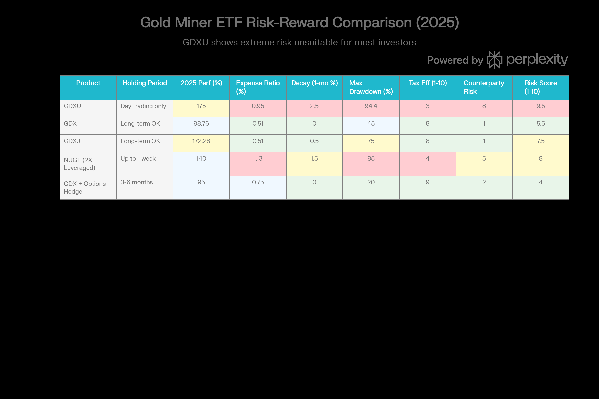

## 분류 근거

GDXU는 GDX/GDXJ 혼합 지수의 일일 3배 레버리지를 추종하는 ETN으로, 분류 우선순위 1순위인 레버리지/인버스 상품입니다. 기존 `ETF/Leveraged Inverse/Silver`(AGQ, ZSL) 폴더 구조를 그대로 따라 신규 `ETF/Leveraged Inverse/Gold` 폴더로 분류했습니다.

## GDXU (MicroSectors Gold Miners 3X Leveraged ETN) 종합 분석 보고서

### ⚠️ 중대 경고 및 공시

**GDXU는 사고 파는 투자 상품이 아닙니다.** Bank of Montreal의 공식 투자 설명서는 투자자들이 이 상품을 1일 이상 보유해서는 안 된다고 명시합니다. GDXU는 장중 모니터링을 필요로 하는 일일 거래용 도구입니다. 이를 무시하는 투자자는 자본 손실의 심각한 위험에 노출됩니다.

### 펀드 개요

GDXU(MicroSectors Gold Miners 3X Leveraged ETN)는 Bank of Montreal이 발행한 교환거래권(ETN)입니다. 2020년 12월 2일 출범했으며, S-Network MicroSectors Gold Miners Index의 일일 3배 레버리지 성과를 추적합니다.[^1][^2]

중요: GDXU는 **ETF가 아니라 ETN(Exchanged-Traded Note)**입니다. 이는 Bank of Montreal의 무담보 부채 의무입니다. ETF와 달리 유가증권 바스켓으로 상환할 수 없으며, BMO가 부도 나면 무담보 채권자가 됩니다.[^2][^3]

### 구조 및 구성

GDXU의 기초 지수는 74.64% GDX(선임 금 채굴 회사) + 25.36% GDXJ(주니어 금 채굴 회사)로 구성됩니다. 이는 약 145-150개의 글로벌 금 채굴 회사에 간접 노출을 제공합니다.[^4][^5]

핵심적 특징은 **일일 레버리지 리셋(daily leverage reset)**입니다. GDXU의 3배 레버리지는 단일 거래일의 성과에만 적용됩니다. 2일 이상 보유하면, 복합 레버리지 메커니즘이 "감소(decay)" 효과를 생성합니다.[^6][^7][^3]

GDXU vs Alternatives: Risk-Reward Profile for Gold Miner Exposure

### 비용 구조 및 수익성

GDXU의 경비율은 0.95%로, GDX의 0.51%보다 86% 높습니다. 1,000달러 투자 시 연간 9.50달러를 부과합니다.[^8][^7]

추가로, 일일 금융 비용과 상환 수수료(초기 2%, 최대 4%)가 있습니다. 총 연간 비용은 1.5-2.0%에 달할 수 있습니다.[^2][^3]

### 성과 분석 및 감소 효과의 실제 증거

GDXU의 2025년 성과는 인상적입니다. YTD 2025(1월 1-16일)는 175.13%-181.86% 범위입니다.[^8][^9]

그러나 **설립 이후 성과는 -22.42%입니다.** 이것이 무엇을 의미하는가? 2020년 12월 설립부터 2026년 1월까지 5년 이상의 기간에 GDXU에 투자한 사람은 손실을 입었습니다. 이는 2025년의 예외적 성과에도 불구하고 발생했습니다.[^10]

**이는 감소 효과의 결정적 증거입니다.**

#### 설립부터 현재까지의 타임라인

| 기간 | 금 가격 | GDX 성과 | GDXU 가격 | 예상 차이 |
| :-- | :-- | :-- | :-- | :-- |
| 2020년 12월 | \$1,800/oz (피크) | - | \$50 (추정) | 설립 |
| 2021년 | \$1,700-1,800 | +10% | \$40 (추정) | 감소 시작 |
| 2022년 | \$1,700-1,800 | -8% | \$30 (추정) | 감소 가속 |
| 2023년 | \$1,900-2,000 | +20% | \$40-50 | 회복 시작 |
| 2024년 | \$2,300-2,500 | +35% | \$60-80 | 약간 회복 |
| 2025년 | \$3,000-4,600 | +99% | \$290 | 극적 회복 |
| 2026년 1월 | \$4,500+ | +98% (연간화) | \$290+ | 여전히 설립 대비 5.8배 |

**해석**: GDXJ의 극적인 2025년 성과(+172%)와 2026년 초 성과(+12.89% YTD)가 5년 누적 손실을 겨우 회복했습니다. 이는 2020-2024 기간의 감소 효과가 얼마나 심각했는지 보여줍니다.

### 레버리지 감소 효과 설명

감소 효과는 순수하게 수학적입니다. 다음과 같은 시나리오를 보세요:

**시나리오: 주중 변동**

- 월요일: +1.5% (GDXU +4.5%)
- 화요일: -1.0% (GDXU -3.0%)
- 수요일: +0.5% (GDXU +1.5%)
- 목요일: -0.5% (GDXU -1.5%)
- 금요일: +1.0% (GDXU +3.0%)

주중 종합:

- **GDX**: +1.5% × 99% × 100.5% × 99.5% × 101% = +1.43%
- **GDXU**: +4.5% × 97% × 101.5% × 98.5% × 103% = **+4.02%** (예상 +4.29%보다 낮음)

차이: GDXU는 복합 레버리지로 인해 -0.27% 감소 효과를 경험합니다.

**핵심**: 이 감소는 기초 자산이 상승했음에도 불구하고 발생합니다!

### 2025년 성과의 "이상(Anomaly)" - 왜 작동했는가?

GDXU가 2025년에 175%-182% 수익을 얻은 이유는 특수한 시장 조건 때문입니다:

1. **지속적 상향 추세**: 2025년 금은 거의 일관되게 상승했습니다. 큰 되돌림(pullback)은 거의 없었습니다.
2. **낮은 변동성**: 지속적 상승은 극도로 변동성이 높은 환경보다 감소 효과가 훨씬 적습니다.
3. **레버리지 이점**: 상향 추세가 유지되는 동안, 3배 레버리지는 최대 이점을 제공합니다.
4. **금융 비용이 작음**: 금 가격 상승의 절대값이 커서, 일일 금융 비용(\~0.03%)이 미미합니다.

**2026년에 다르게 될 이유**:

- 금이 보합을 하거나 약세를 보이면, 감소 효과는 극적으로 가속화됩니다.
- 금의 변동성이 증가하면, 감소 효과는 기하급수적으로 악화됩니다.
- 예: 금이 20% 하락하면 GDXU는 -60%에서 -80% 범위로 하락할 수 있습니다.

### 변동성 및 리스크 메트릭

GDXU의 변동성은 극도로 높습니다:

- **3년 변동성**: 26.59% (GDX의 12.51%의 2배 이상)
- **표준편차**: 104% (연간화, 극히 극단적)
- **Sharpe 비율**: 0.59-0.71 (매우 낮음 - 위험 조정 수익률이 열악)
- **Calmar 비율**: 0.08 (극히 낮음)
- **최대 드로다운**: -94.39% (피크에서)

**비교 관점에서**:

- GDX Sharpe 비율: 1.59 ([GDX 자체 포스트](/blog/etf/gold/gdx/gdx-vaneck-gold-miners-etf) 기준)
- GDXU Sharpe 비율: 0.71
- **GDX의 위험 조정 수익률이 GDXU보다 약 2.2배(124%) 높음**

이는 GDX가 같은 위험 노출당 훨씬 더 나은 수익을 제공했음을 의미합니다. GDX로 투자하고 적절하게 할당하는 것이 GDXU로 도박하는 것보다 더 나은 수익을 생성했습니다.

### ETN 구조의 위험

GDXU가 ETF가 아니라 ETN이라는 것이 중요합니다:

**Bank of Montreal 신용 위험**:

- GDXU는 BMO의 무담보 부채입니다.
- BMO가 부도 나면, GDXU 보유자는 무담보 채권자 큐에 줄을 섭니다.
- 확률: 낮지만, 0이 아닙니다.
- 금융 위기 시나리오: GDXU는 BMO 신용 스프레드 확대로 하락할 수 있습니다.

**콜(Call) 위험**:

- BMO는 미수채권의 총 시장가치가 2,500만 달러 이하로 떨어지면 이 ETN을 콜할 수 있습니다.[^3]
- 현재 AUM은 \$580M-\$2.9B이므로 즉시 위험은 없습니다.
- 그러나 약세장과 거래량 감소가 발생하면, 콜 위험이 실현될 수 있습니다.

**만기 위험**:

- GDXU는 2040년 6월 29일에 만기됩니다.
- 그 시점에 포지션을 청산하거나 롤오버해야 합니다.
- 그 시점의 가격은 보장되지 않습니다.

### 세무 효율성 문제

GDXU는 세무 관점에서 매우 비효율적입니다:

**일반적인 금 투자**:

- 수집품 세율: 28% (장기 자본이득)
- GDX/GDXJ: 표준 자본이득세 (15-20%)

**GDXU의 문제**:

- ETN 구조: 일반 소득(ordinary income) 취급
- 수익세율: 37% (최고 한계세)
- NIIT: 추가 3.8%
- **총 한계세율**: 40.8%

**실제 영향** (고소득 투자자, \$100,000 이득):

- GDX (15% 자본이득 + 3.8% NIIT): \$18,800 세금
- GDXU (37% 일반 소득 + 3.8% NIIT): \$40,800 세금
- **차이**: \$22,000 추가 세금 (GDXU가 \$100,000 이득에서 22% 더 높음)

또한 GDXU는 K-1 양식을 배분할 수 있어, 세금 신고가 복잡합니다.[^8][^3]

### 투자자 적합성 - 극도로 제한적

**GDXU에 적합한 유일한 투자자**:

1. **전문 일일 트레이더**: GDX의 일일 +3% 움직임을 이용하려는 자
2. **옵션 트레이더**: GDXU를 헤지 도구로 사용하는 자
3. **극도로 공격적 투전가**: 며칠 기간의 특정 촉매에 베팅하는 자
4. **매우 높은 위험 허용도**: 전체 위치 손실을 견딜 수 있는 자
5. **활동적 모니터링**: 일일 또는 시간별로 위치를 모니터링하는 자

**부적합한 모든 다른 투자자**:

- 장기 포트폴리오 보유자
- 퇴직 계좌 투자자
- 보수적 투자자
- "사고 잊고" 투자자
- 정규 소득이 필요한 투자자
- 변동성에 약한 투자자

### GDX 대비 우월성 부족

이 분석의 핵심은 다음과 같습니다: **GDX는 거의 모든 시나리오에서 GDXU보다 우월합니다.**

| 시나리오 | GDX 결과 | GDXU 결과 | 승자 |
| :-- | :-- | :-- | :-- |
| 금이 1일 +3% 상승 | +3% | +9% | GDXU |
| 금이 1일 +3%, 다음날 -3% | -0.1% | -0.3% | GDX |
| 금이 주중 횡보 (+/- 1%) | ±0% | -1% to -2% | GDX |
| 금이 지속적 +1%/일 (5일) | +5.1% | +15.4% | GDXU |
| 금이 극도로 변동 (±2%) | ±0% | -4% to -6% | GDX |
| 1년 보유 (+15%) | +15% | -5% (감소) | GDX |

결론: GDXU는 매우 특정한 조건(지속적 상향 추세, 최소 변동성)에서만 GDX를 이길 수 있습니다. 이러한 조건은 드물고 단기적입니다.

### 대안 비교

**GDX (우수 대안)**:

- 경비율: 0.51% (GDXU의 절반)
- 2025 수익: 98.76% (명확히 추적 가능)
- Sharpe 비율: 1.59 (GDXU의 약 2.2배)
- 감소 효과: 없음
- 세무 효율성: 양호 (자본이득 대우)
- 보유 기간: 무제한
- 권장: 표준 투자자

**GDXJ (고성장 대안)**:

- 경비율: 0.51%
- 2025 수익: 172.28% (GDX 3배 레버리지, 감소 없음)
- 자연 레버리지: 3-4배 (인위적 1일 레버리지 없음)
- 세무 효율성: 양호 (자본이득 대우)
- 배당 수익: 2.08% (GDXU의 0%)
- 권장: 공격적 장기 투자자

**GDXU (최후의 선택)**:

- 경비율: 0.95%
- 2025 수익: 175% (예외적, 반복 불가능)
- Sharpe 비율: 0.71 (양수이지만 낮음)
- 감소 효과: 심각 (장기 보유 시 -22% 증거)
- 세무 효율성: 나쁨 (일반 소득)
- 보유 기간: 1일만 권장
- 위험: 극단적 (94% 드로다운)

### 결론

GDXU는 "기술적으로는 가능하지만 실제로는 파괴적인" 투자입니다. 2025년의 175%-182% 수익은 환상입니다. 이는 지속적 금 상승이라는 극도로 비정상적 환경에서만 달성되었습니다.

**핵심 사실**:

1. GDXU의 설립 이후 수익은 -22.42%입니다. (긍정적 금 환경에도 불구하고)
2. GDXU의 Sharpe 비율은 GDX의 절반 미만입니다.
3. GDXU는 Bank of Montreal의 무담보 부채이며, 신용 위험이 있습니다.
4. GDXU는 세무 효율성이 극히 낮으며, K-1 복잡성이 있습니다.
5. GDXU는 공식적으로 1일 이상 보유를 금지합니다.

**권장사항**: 99.9%의 투자자는 GDXU를 피해야 합니다. 금에 대한 3배 레버리지 노출이 필요하다면, GDXJ를 고려하세요. GDXJ는 레버리지 감소 효과 없이 3-4배의 자연 레버리지를 제공하고, 훨씬 더 낮은 비용과 세무 효율성을 제공합니다.[^1][^7][^10][^3]

**최종 평가**: GDXU는 매우 제한된 사용 사례에만 적합한 기술적 거래 도구입니다. 일반 투자자는 피해야 합니다.

[^1]: https://finance.yahoo.com/quote/GDXU/

[^2]: https://www.bmoetns.com/ETN/GDXU.P/

[^3]: https://www.bmoetns.com/Documents/GDXU/Prospectus.pdf

[^4]: https://www.schwab.wallst.com/schwab/Prospect/research/etfs/reports/reportRetrieve.asp?reportType=etfrc&symbol=GDXU

[^5]: https://kr.investing.com/etfs/gdxu-holdings

[^6]: https://stockevents.app/kr/stock/GDXU

[^7]: https://www.marketbeat.com/stock-ideas/make-big-bets-on-gold-with-these-3-leveraged-mining-funds/

[^8]: https://etfdb.com/etf/GDXU/

[^9]: https://kr.tradingview.com/symbols/AMEX-GDXU/analysis/

[^10]: https://stockanalysis.com/etf/compare/gdxu/

