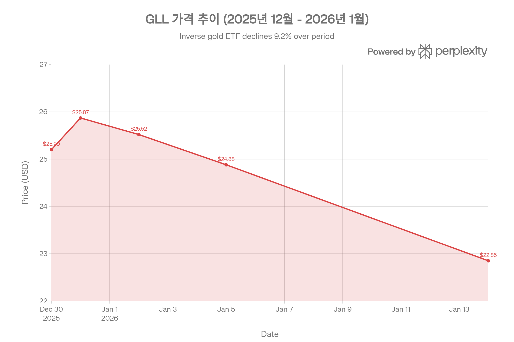
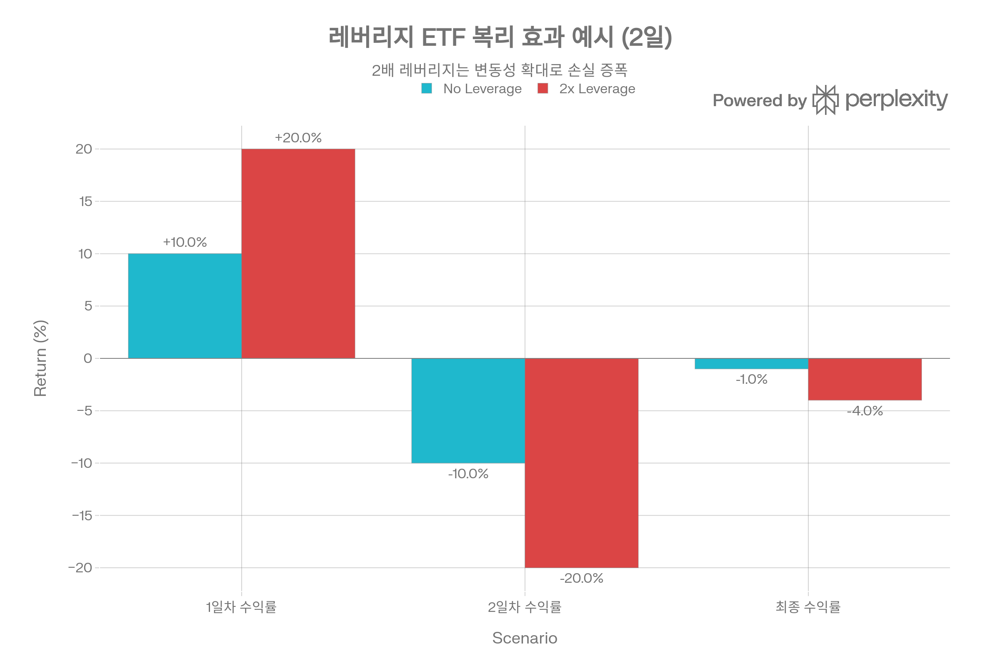
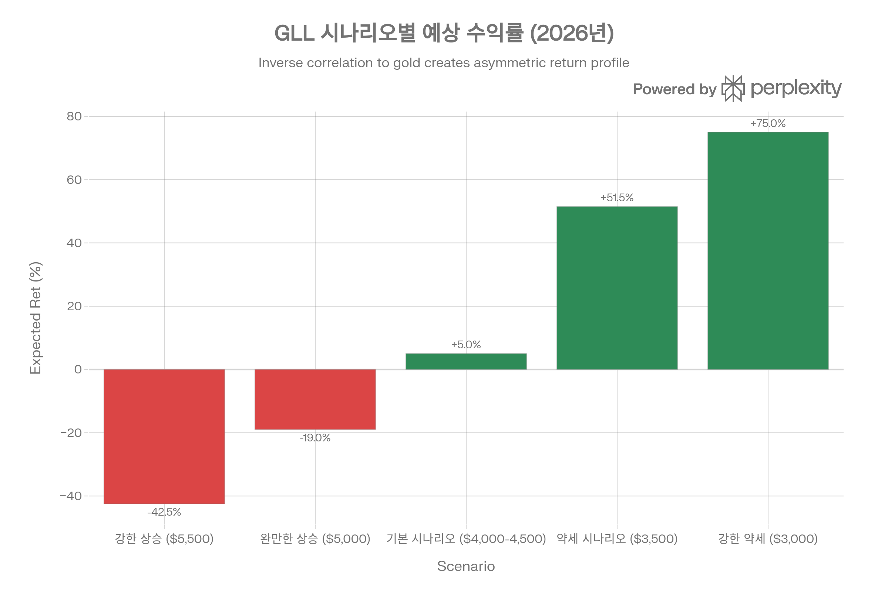
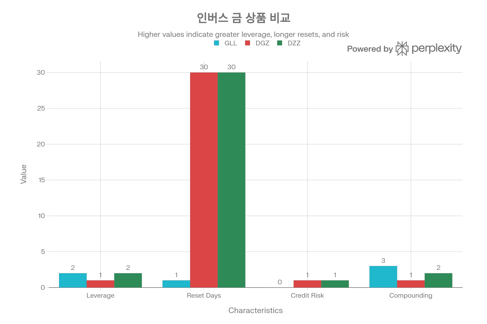

## 분류 근거

GLL은 금 선물/스왑을 통해 -2x 일일 레버리지를 구현하는 인버스 ETF로, 분류 우선순위 1순위인 레버리지/인버스 상품입니다. 기존 `ETF/Leveraged Inverse/Gold`(GDXU) 폴더에 함께 분류했습니다.

## ProShares UltraShort Gold (GLL) 종합 분석 보고서

### 경고 (Executive Warning)

**GLL은 극도로 고위험 단기 거래 상품으로, 2026년 1월 현재 대부분의 투자자에게 부적합합니다.** 금 가격이 역사적 고점(\$4,597/oz)에서 구조적 상승 드라이버가 여전히 강한 환경에서, -2x 일일 역방향 레버리지 구조는 금 강세 지속 시 급격한 자산 손실을 초래합니다. 일일 리셋 메커니즘으로 인한 복리 효과와 변동성 드래그는 보유 기간이 길어질수록 목표 수익률(-2x)에서 크게 이탈하며, 이는 수학적으로 불가피합니다.[^1][^2][^3][^4]

**본 보고서는 교육 목적이며, GLL 매수를 권장하지 않습니다.** 투자 시에는 반드시 전문 금융 자문을 구하시기 바랍니다.

***

### 개요

ProShares UltraShort Gold(티커: GLL)는 2008년 12월 1일 설정된 인버스 레버리지 ETF로, Bloomberg Gold Subindex의 **일일 수익률 -2배**를 추구한다. 금 가격이 1% 하락하면 GLL은 약 2% 상승하고, 금 가격이 1% 상승하면 GLL은 약 2% 하락하는 구조다. 2026년 1월 현재 AUM \$75.89M, 관리보수 0.95%, 일평균 거래량 2.11M주로 소규모 ETF이지만 유동성은 양호하다.[^5][^1][^6][^7]

GLL은 금 선물 및 스왑을 통해 -200% 노출을 구현하며, 물리적 금은 보유하지 않는다. 포트폴리오는 현금담보(BNY Mellon Cash Reserve \$72M), 금 스왑 계약(Citibank, UBS, Goldman Sachs), 그리고 금 선물 공매도(-\$47M Feb 26 계약)로 구성된다.[^8][^5]

**2025\~2026년 성과:**

- YTD 2025: -38.85% (금가 \$2,702→\$4,321 상승)
- YTD 2026 (1월 16일): +11.51% (금가 소폭 조정)
- 52주 범위: \$22.60\~\$68.43 (-67% 낙폭)



GLL은 금 가격 상승에 따라 2025년 12월 말 \$25.87에서 2026년 1월 중순 \$22.85로 11.7% 하락했습니다.

### 1. 상품 구조: -2x 일일 역방향 레버리지의 메커니즘

#### 1.1 Bloomberg Gold Subindex 추종

GLL이 추종하는 Bloomberg Gold Subindex는 COMEX 금 선물 기반의 "롤링 인덱스"다. 이는 물리적 금을 보유하지 않으며, 선물 계약을 매월 롤오버한다. 롤링은 매월 6\~10 영업일에 걸쳐 진행되며, 각 일자에 만기 도래 계약의 20%씩 차기 계약으로 교체한다(5일간 0→20%→40%→60%→80%→100%).[^5][^2]

이 롤링 프로세스는 컨탱고/백워데이션 환경에 따라 **롤 수익률(roll yield)**을 발생시킨다:

**컨탱고(Contango):** 선물가 > 현물가

- 롤링 시 비싼 계약 매수 → 음의 롤 수익률 (손실)
- 일반 금 ETF에 불리, 인버스 ETF에 유리

**백워데이션(Backwardation):** 선물가 < 현물가

- 롤링 시 싼 계약 매수 → 양의 롤 수익률 (이익)
- 일반 금 ETF에 유리, 인버스 ETF에 불리

[^9][^10][^11][^12]

2020년 팬데믹 당시 원유 시장은 극심한 컨탱고를 경험했으며, 이는 원유 ETF의 성과를 크게 저해했다. 금 시장은 역사적으로 컨탱고와 백워데이션을 반복하며, 현재(2026년 1월) 환경에서 롤 수익률의 방향은 GLL 성과에 영향을 미친다.[^10]

#### 1.2 일일 리셋과 레버리지 구현

GLL은 **매일 종가 기준으로 포트폴리오를 리밸런싱**하여 -2x 노출을 유지한다. 예를 들어:[^1][^2][^13]

- Day 1: 금 +1% → GLL -2% → 포트폴리오 가치 하락
- Day 2 시작: 하락한 NAV 기준으로 -2x 재설정
- Day 2: 금 -1% → GLL +2% → 새로운 NAV 기준 +2%

이 일일 리셋 메커니즘은 다음과 같은 구조적 결과를 초래한다:

1. **1일 보유**: 목표 -2x에 가장 근접
2. **복수일 보유**: 복리 효과로 -2x에서 이탈
3. **변동성 높을수록**: 목표 이탈 폭 증가



2x 레버리지 ETF는 변동성이 높은 시장에서 일일 리셋으로 인해 복리 효과가 누적되어 목표 수익률에서 크게 벗어납니다.

**복리 효과 예시:**

| 일자 | 금 수익률 | 금 가격 | GLL 목표(-2x) | GLL 실제 가격 |
| :-- | :-- | :-- | :-- | :-- |
| 시작 | - | \$100 | - | \$100 |
| Day 1 | +10% | \$110 | -20% | \$80 |
| Day 2 | -10% | \$99 | +20% | \$96 |
| **최종** | **-1%** | **\$99** | **+2% (이론)** | **-4% (실제)** |

금 가격은 -1% 하락했지만, GLL은 이론적 +2%(=2×1%) 대신 **-4% 손실**을 기록한다. 이는 Day 2 시작 시 NAV가 \$80으로 하락했기 때문에, +20% 상승해도 \$96(=\$80×1.2)에 불과하기 때문이다.[^14][^15]

#### 1.3 포트폴리오 구성: 파생상품 중심

GLL의 포트폴리오는 9개 항목으로 구성되며, 상위 10개 비중 합계가 -7,628.2%에 달한다. 이는 레버리지 구조를 반영한 수치다.[^1][^8]

**Long Positions (담보 및 스왑):**

1. BNY Mellon Cash Reserve: 6,669.64% (\$72M)
2. Bloomberg Gold Subindex Swap - Citibank: 5,612.55% (\$60M)
3. Bloomberg Gold Subindex Swap - UBS: 1,290.37% (\$14M)
4. Cash: 1,058.55% (\$11M)
5. Bloomberg Gold Subindex Swap - Goldman: 834.26% (\$9M)

**Short Positions (선물 및 스왑 공매도):**

1. Gold Future Feb 26: -4,379.45% (-\$47M)
2. Gold Future Dec 25: -2,817.19% (-\$30M)
3. Bloomberg Gold Subindex Swap - Citibank: -5,925.60% (-\$64M)
4. Bloomberg Gold Subindex Swap - UBS: -1,362.34% (-\$15M)
5. Bloomberg Gold Subindex Swap - Goldman: -880.79% (-\$9M)

[^5][^8]

이 구조에서 주목할 점:

- **담보 자산(\$72M 현금)**: 레버리지 유지를 위한 증거금
- **스왑 계약**: Citibank, UBS, Goldman Sachs와 체결 (거래상대방 리스크 존재)
- **선물 공매도**: 2026년 2월 만기 \$47M, 2025년 12월 만기 \$30M

### 2. 레버리지 ETF의 구조적 함정: 변동성 드래그

#### 2.1 변동성 드래그의 이론

레버리지 ETF의 장기 성과를 결정하는 핵심 요인은 **변동성 드래그(volatility drag)**다. 기하평균 수익률은 항상 산술평균보다 낮으며, 이 차이가 변동성의 제곱에 비례한다:[^3][^16][^17]

**공식:**

```
기하평균 = 산술평균 - (σ²/2)
```

레버리지 β를 적용하면:

```
레버리지 기하평균 = β × 산술평균 - (β² × σ²/2)
```

GLL의 경우 β=2이므로:

```
GLL 기하평균 = 2 × 산술평균 - (4 × σ²/2) = 2 × 산술평균 - 2σ²
```

**예시: 금 변동성 50% 가정**

| 시나리오 | 드래그 계산 | 연간 드래그 |
| :-- | :-- | :-- |
| 비레버리지 | 50%²/2 | 12.5% |
| 2x 레버리지 | (50%×2)²/2 | **50%** |

즉, 2x 레버리지는 변동성 드래그를 **4배** 증폭시킨다. 금 변동성이 50%일 때, GLL은 연간 50%의 구조적 드래그를 감수해야 한다.[^16]

#### 2.2 실증 연구: 변동성 드래그 vs 수익률 자기상관

최근 학술 연구는 변동성 드래그만으로 LETF 성과를 설명할 수 없음을 밝혔다. **수익률 자기상관(return autocorrelation)**과 **변동성 클러스터링(volatility clustering)**이 더 중요한 역할을 한다:[^4]

**독립적 수익률 시장:**

- LETF가 목표 대비 오히려 **초과 성과** (기존 통념 반박)
- 변동성 드래그 효과가 기하평균 상승 효과로 상쇄

**트렌드 시장 (양의 자기상관, φ>0):**

- 성과 **개선** (momentum 강화)
- 리밸런싱이 수익 방향으로 작용

**평균회귀 시장 (음의 자기상관, φ<0):**

- 성과 **악화** (mean reversion 패널티)
- 리밸런싱이 손실 방향으로 작용

**변동성 클러스터링:**

- GARCH 효과(α+β 높을수록)가 자기상관보다 더 큰 영향
- SPY 기반 LETF보다 QQQ 기반 LETF의 복리 효과가 크게 나타남 (QQQ의 높은 변동성)

[^4]

**실증 데이터: SSO (2x S&P 500) 사례**[^18]

| 연도 | S&P 500 | 이론적 드래그 | 실제 드래그 | 차이 |
| :-- | :-- | :-- | :-- | :-- |
| 2025 | 17.88% | 1.15% | 9.57% | +8.42% |
| 2018 | -4.38% | 12.82% | 5.86% | -6.96% |
| 평균 | 12.35% | 2.51% | 3.43% | +0.92% |

2025년 S&P 500 변동성은 10.7%로 낮았지만, 실제 드래그는 9.57%로 이론치 1.15%를 크게 초과했다. 반대로 2018년 변동성은 35.8%로 높았지만, 실제 드래그는 5.86%로 이론치 12.82%에 미달했다. 이는 **단순 변동성만으로 LETF 성과를 예측할 수 없음**을 시사한다.[^18]

#### 2.3 GLL에 대한 함의

금 시장의 특성을 고려하면:

1. **높은 변동성**: 금은 50%+ 변동성 가능 → 50% 드래그
2. **트렌드 vs 평균회귀**:
    - 2024\~2026년: 강한 상승 트렌드 (+130%) → GLL에 극도로 불리
    - 금 조정 국면: 평균회귀 가능 → GLL에 여전히 불리
3. **변동성 클러스터링**: 금은 위기 시 변동성 급증 → 드래그 증폭

**결론:** GLL은 금 강세장과 높은 변동성 환경에서 **이중 패널티**를 받는다. -2x 목표는 단기(1\~3일) 거래에서만 의미가 있다.

### 3. 2026년 금 시장 환경: GLL에 최악의 시나리오

#### 3.1 금 가격 역사적 고점


금 가격은 2024년 1월 \$2,000에서 2026년 1월 \$4,597로 130% 상승하며 역사적 고점을 경신했습니다.

2026년 1월 16일 현재 금 가격은 \$4,597/oz로 역사적 고점을 경신했다. 이는 2024년 1월 \$2,000에서 2년간 **130% 상승**한 수치다. 금 강세장의 주요 드라이버는 다음과 같다:[^19][^20][^21]

**단기 드라이버 (2025\~2026):**

1. **연준 금리 인하**: 2024년 말부터 인하 사이클 진입, 금 보유 기회비용 감소[^22][^23]
2. **지정학적 불확실성**: 미중 무역 긴장, 트럼프 관세 정책, 중동 분쟁[^24][^23][^22]
3. **달러 약세**: 금리 인하에 따른 달러 약세, 금 가격 상승[^22]
4. **중앙은행 매입**: 2025년 3분기 220톤 순매입, 연간 634톤 (역사적 고수준)[^23][^22]
5. **ETF 유입**: 2025년 금 ETF 순유입 급증, 공급/수요 타이트닝[^22]

**장기 구조적 드라이버:**

1. **안전자산 선호**: 글로벌 불확실성 환경[^24]
2. **통화 가치 하락(Monetary Debasement)**: 재정 확대 지속[^22]
3. **중국·인도 수요**: 아시아 중산층 성장, 소매 수요 강세[^22]

[^25][^26][^23][^24][^22]

#### 3.2 전문가 전망: \$5,000\~\$5,000+ 컨센서스

주요 투자은행과 리서치 기관의 2026년 금 가격 전망:

| 기관 | 2026년 전망 | 확률/시나리오 |
| :-- | :-- | :-- |
| **Goldman Sachs** | \$4,900 (연말) | 기본 시나리오 |
| **JP Morgan** | \$5,055 (Q4 평균), \$5,200\~\$5,300 (피크) | "highest conviction long" |
| **State Street (SSGA)** | \$4,000\~\$4,500 (기본), \$4,500\~\$5,000 (강세) | 50% vs 30% 확률 |
| **World Gold Council** | +5\~15% from \$4,300 | 경제 둔화 시 중간 상승 |
| **Silver Analyst** | \$5,000\~\$6,000 | 공급 부족 심화 |

[^27][^23][^24][^22]

**State Street 시나리오 분석 (2026년):**

**기본 시나리오 (50% 확률): \$4,000\~\$4,500**

- 연준 금리 2\~3회 추가 인하
- 지정학적 긴장 지속
- 중앙은행 매입 유지
- ETF 유입 2025년 대비 50\~75%

**강세 시나리오 (30% 확률): \$4,500\~\$5,000+**

- 연준 공격적 금리 인하 (경기 침체 우려)
- 달러 급락
- 지정학적 위기 심화
- ETF 유입 2025년 대비 75\~100%

**약세 시나리오 (20% 확률): \$3,500\~\$4,000**

- 연준 금리 인하 중단 (인플레이션 재상승)
- 달러 강세
- 경기 회복, 안전자산 선호 약화

[^22]

#### 3.3 GLL에 대한 함의



GLL은 금 가격 하락 시에만 수익을 내며, 현재 금 강세장 환경(\$4,597)에서는 약세 시나리오가 발생해야 수익이 가능합니다.

**GLL 시나리오별 예상 수익률 (2026년):**

| 금 가격 시나리오 | 금 변화 | GLL 예상 수익률 |
| :-- | :-- | :-- |
| **강한 상승 (\$5,500)** | +20% | **-40% \~ -45%** |
| **완만한 상승 (\$5,000)** | +9% | **-18% \~ -20%** |
| **기본 (\$4,000\~\$4,500)** | -5% \~ 0% | 0% \~ +10% |
| **약세 (\$3,500)** | -24% | +48% \~ +55% |
| **강한 약세 (\$3,000)** | -35% | +70% \~ +80% |

주요 전망 기관의 70\~80%가 금 가격 \$4,000 이상을 예상하며, 이는 GLL에 **손실 또는 미미한 수익**을 의미한다. GLL이 의미 있는 수익(+50%+)을 내려면 금 가격이 \$3,500 이하로 하락해야 하는데, 이는 현재 컨센서스에서 **20% 확률**에 불과하다.[^22][^24][^23]

**위험/수익 비율:**

- 강세 시나리오 발생 시: -40% 손실 (30% 확률)
- 기본 시나리오 발생 시: 0\~10% 수익 (50% 확률)
- 약세 시나리오 발생 시: +50% 수익 (20% 확률)

**기댓값:** 0.3×(-40%) + 0.5×(5%) + 0.2×(50%) = -12% + 2.5% + 10% = **+0.5%**

즉, 2026년 1년 보유 시 GLL의 기댓값은 거의 **0%**이며, 이는 0.95% 관리보수를 고려하면 **실질 손실**이다.

### 4. 경쟁 상품 비교: GLL vs DGZ vs DZZ



GLL은 일일 리셋으로 복리 효과가 가장 크지만 신용리스크가 없는 반면, DGZ/DZZ는 월간 리셋으로 복리 효과는 작지만 ETN 구조의 신용리스크가 존재합니다.

인버스 금 ETF/ETN 시장에는 세 가지 주요 상품이 있다:[^28][^29][^30]

| 특성 | GLL | DGZ | DZZ |
| :-- | :-- | :-- | :-- |
| **운용사** | ProShares | Deutsche Bank | Deutsche Bank |
| **구조** | ETF | ETN | ETN |
| **레버리지** | -2x | -1x | -2x |
| **리셋 주기** | **일일** | **월간** | **월간** |
| **신용리스크** | 없음 | 있음 (DB) | 있음 (DB) |
| **복리 효과** | **매우 높음** | 낮음 | 중간 |
| **변동성 민감도** | **극도로 높음** | 낮음 | 높음 |
| **관리비** | 0.95% | - | - |

#### 4.1 리셋 주기의 중요성

**일일 리셋 (GLL):**

- 매일 -2x 목표로 리밸런싱
- 복리 효과가 매일 누적 → 목표 이탈 가속
- 변동성 높을수록 성과 감쇄 극심
- **단기 거래(1\~3일) 전용**

**월간 리셋 (DGZ, DZZ):**

- 매월 말 -1x/-2x 목표로 리밸런싱
- 복리 효과가 월 단위로만 누적 → 목표 이탈 완화
- 수주\~수개월 보유 가능
- 일중 변동성의 영향 감소

[^7][^30][^28]

#### 4.2 ETF vs ETN 구조

**ETF (GLL):**

- 자산 보유형 (선물, 스왑, 현금)
- 발행사 파산 시에도 자산 보호
- 신용리스크 없음

**ETN (DGZ, DZZ):**

- 무담보 채무증권 (unsecured debt note)
- 발행사(Deutsche Bank) 신용에 의존
- 발행사 파산 시 전액 손실 가능
- 2008년 리먼브라더스 교훈

[^30][^28]

#### 4.3 역사적 사례: 2011년 금 조정

2010년 금/은 급등 후 2011년 초 조정 국면에서 인버스 금 상품으로 자금 유입이 급증했다:[^28]

- **DGZ**: 2011년 1월 inflow \$80M (AUM의 **250%**)
- **DZZ**: 2011년 1월 수익률 +13%
- **GLL**: 유사한 수익 추정

그러나 이는 단기 조정에 그쳤으며, 금은 곧 반등하여 인버스 포지션 투자자들은 손실을 입었다. 이는 **타이밍의 중요성**과 **단기 거래 원칙**을 강조한다.[^28]

### 5. 비용 및 세무 구조

#### 5.1 관리비 및 누적 비용

GLL의 관리보수는 0.95%로, 레버리지/인버스 ETF 중에서는 평균 수준이다. 그러나 장기 보유 시 누적 비용은 상당하다.[^1][^6][^31]

**20년 누적 비용 시뮬레이션:**[^31]

- 초기 투자: \$10,000
- 연간 추가: \$5,000
- 예상 수익률: 8%

| 연도 | 순투자 | GLL 수수료 (0.95%) | OneGold 보관료 (0.12%) | 차이 |
| :-- | :-- | :-- | :-- | :-- |
| 1 | \$15,000 | \$95 | \$12 | \$83 |
| 5 | \$35,000 | \$1,186 | \$152 | \$1,034 |
| 10 | \$60,000 | \$5,013 | \$650 | \$4,363 |
| **20** | **\$110,000** | **\$30,259** | **\$4,044** | **\$26,216** |

20년 보유 시 GLL은 누적 \$30,259의 관리비를 부담하는데, 이는 물리적 금 보관(OneGold) 대비 \$26,216 더 많은 비용이다. 물론 GLL을 20년 보유하는 것은 상품 설계 의도와 완전히 배치되지만, 이는 **장기 보유의 비효율성**을 극명히 보여준다.[^31]

#### 5.2 세무 복잡성: K-1 발행

GLL은 **K-1 양식을 발행**한다. K-1은 파트너십 투자 소득을 보고하는 양식으로, 일반 1099 양식보다 세무 신고가 복잡하다. 주요 특징:[^1]

1. **세금 신고 지연**: K-1은 통상 3\~4월에 발행되어 세금 신고 마감에 촉박
2. **전문가 필요**: K-1 신고는 세무 전문가 도움 필요 → 추가 비용
3. **주별 세금**: 일부 주에서는 K-1 소득에 대해 별도 신고 요구

**세율:**[^1]

- 단기 차익: 27.84%
- 장기 차익: 27.84% (동일)
- 배당: 없음 (수익은 가격 변동으로만)

일반 ETF의 장기 차익 세율(15\~20%)보다 높은 27.84%가 적용되어, 세후 수익률이 추가로 감소한다.[^1]

### 6. 거래 전략 및 리스크 관리

#### 6.1 기관 투자자의 GLL 활용

기관 투자자는 GLL을 다음 세 가지 전략으로 활용한다:[^32]

**1. 포지션 트레이딩 (장기 방향성 베팅):**

- Entry: \$20.18
- Target: \$23.79
- Stop Loss: \$20.12
- 리스크/수익: 1:60.2 (예외적 비율)

**2. 모멘텀 브레이크아웃 (단기 추세 추종):**

- Trigger: \$21.73
- Target: \$22.85
- Stop Loss: \$21.67

**3. 리스크 헤지 (숏 포지션):**

- Entry: \$21.73
- Target: \$20.64
- Stop Loss: \$21.80

[^32]

**지지/저항 레벨 (2026년 1월):**

- 단기(1\~5일): 지지 \$22.85, 저항 \$23.18
- 중기(5\~20일): 지지 \$21.73, 저항 \$22.83
- 장기(20일+): 지지 \$23.79, 저항 \$27.05

현재가 \$22.85는 단기 지지선 상에 있어, 단기 반등 가능성이 있지만 중장기 추세는 **약세(Weak) 신호**다.[^32]

#### 6.2 개인 투자자를 위한 리스크 관리

ProShares는 인버스 ETF 활용을 위한 리스크 관리 프레임워크를 제시한다:[^33][^34][^35]

**1. 포트폴리오 목적 평가:**

- 헤지하려는 지수 식별 (금 현물, 금광주 등)
- 포트폴리오 베타 계산
- 베타 조정 노출 산출: 포트폴리오 가치 × 베타

**2. 헤지 규모 결정:**

- 전체 헤지: 100% 노출 상쇄
- 부분 헤지: 30\~50% 노출 상쇄 (다운사이드 제한, 업사이드 일부 보존)
- 레버리지 선택: -1x, -2x, -3x

**3. 모니터링 및 리밸런싱:**

- 리뷰 주기 설정: 일별, 주별
- 트리거 설정: ±10% 움직임 시 조정
- 특정 리스크 종료 시 헤지 청산

[^35][^33]

**예시: \$100,000 금 포트폴리오 헤지**

- 포트폴리오: 금 현물 ETF \$80,000, 금광주 \$20,000
- 베타: 금 현물 1.0, 금광주 1.5
- 베타 조정 노출: \$80,000 + \$20,000×1.5 = \$110,000

50% 헤지 원할 경우:

- GLL 매수 금액: \$110,000 × 50% / 2 = **\$27,500**
- (-2x 레버리지이므로 필요 금액은 절반)

**중요 원칙:**

1. 일일 목표 이해: GLL은 일일 -2x만 보장
2. 변동성 영향 인지: 변동성 클수록 장기 이탈 심화
3. 정기 리밸런싱: 최소 주 1회 헤지 비율 점검
4. 손절매 설정: 금 가격 +5% 상승 시 GLL 청산 고려

[^34][^33][^35]

#### 6.3 부적합 사례

미국 증권거래위원회(SEC)와 주 규제기관은 레버리지/인버스 ETF의 부적절한 판매 사례를 경고한다:[^34][^35]

**부적합 투자자:**

1. **장기 투자자**: Buy-and-hold 전략 (복리 효과로 목표 이탈)
2. **은퇴 계좌**: IRA, 401(k) 등 장기 계좌
3. **보수적 투자자**: 원금 보전 중시
4. **금 강세장 확신**: 현재 \$4,597 고점에서 추가 상승 예상
5. **레버리지 미이해**: 일일 리셋 메커니즘 미이해

**규제 권고사항:**

- 서면 가이드라인: 적합성 기준 문서화
- 계좌 최소 규모: 예) \$50,000 이상만 허용
- 비중 제한: 포트폴리오의 5% 이하
- 서면 리스크 고지: 고객에게 리스크 명시적 전달
- 정기 리뷰: 분기별 포지션 점검

[^35][^34]

### 7. 리스크 평가: 5대 구조적 리스크

#### 7.1 시장 방향성 리스크 (Market Directional Risk)

**현재 환경:** 금 가격 \$4,597 역사적 고점, 구조적 상승 드라이버 강함

**리스크:**

- 금 가격 +1% 상승 시 GLL -2% 하락
- 52주 최고가 \$68.43 → 최저가 \$22.60 = **-67% 낙폭**
- 2025년 YTD -38.85%

**완화 불가능:** 상품의 설계 자체가 금 약세 베팅이므로, 금 강세장에서는 구조적 손실 불가피

[^1][^6][^36]

#### 7.2 복리 효과 리스크 (Compounding Effect Risk)

**메커니즘:** 일일 리셋으로 인한 비선형 수익률

**예시:**[^15]

- 금 가격 10일간 ±2% 일일 변동
- 기초자산: 10일 후 -0.2% (복리)
- 2x 레버리지: **훨씬 큰 손실** (비선형 증폭)

**완화 방법:**

- 보유 기간 1\~3일로 제한
- 5일 이상 보유 시 리밸런싱
- DGZ/DZZ(월간 리셋) 고려

[^14][^15]

#### 7.3 변동성 드래그 리스크 (Volatility Drag Risk)

**이론:** 변동성의 제곱에 비례하는 성과 감쇄

**금 시장 특성:**

- 평상시 변동성: 30\~40%
- 위기 시 변동성: 50\~70%
- 2x 레버리지 드래그: 50\~70%²/2 × 4 = **50\~100%**

**완화 방법:**

- 낮은 변동성 국면에만 진입
- VIX 20 미만, 금 HV 30% 미만 환경 선호
- 변동성 급등 시 즉시 청산

[^3][^16][^17]

#### 7.4 거래상대방 리스크 (Counterparty Risk)

**노출:** GLL은 Citibank, UBS, Goldman Sachs와 \$14M\~\$64M 규모 스왑 계약 체결[^5][^8]

**리스크:**

- 거래상대방 파산 시 계약 불이행
- 2008년 리먼브라더스 사례 (AIG도 구제금융 필요)
- 극단적 시장 스트레스 시 결제 지연

**완화 방법:**

- 대형 은행 거래상대방 확인 (현재 3대 은행으로 분산)
- 금융 위기 조짐 시 ETF 청산
- ETN 대신 ETF 선호 (GLL > DZZ)

[^28][^8][^5]

#### 7.5 롤 비용 리스크 (Roll Cost Risk)

**메커니즘:** 선물 계약 월별 롤오버 시 컨탱고/백워데이션 영향

**컨탱고 환경 (선물가 > 현물가):**

- 일반 금 ETF: 손실 (비싼 계약 매수)
- GLL(공매도): 이익 (비싼 계약 공매도 → 싼 계약 커버)

**백워데이션 환경 (선물가 < 현물가):**

- 일반 금 ETF: 이익 (싼 계약 매수)
- GLL(공매도): 손실 (싼 계약 공매도 → 비싼 계약 커버)

**현재 환경:** 금 시장은 역사적으로 백워데이션/컨탱고 반복, 2026년 1월 상태는 시장 확인 필요

**완화 방법:**

- 선물 커브 모니터링 (Bloomberg, CME 데이터)
- 컨탱고 환경에서 GLL 유리, 백워데이션에서 불리
- 롤 비용 추정: 월 0.5\~2% 수준

[^9][^10][^11][^12]

### 8. 투자 의사결정 프레임워크

#### 8.1 GLL 투자 체크리스트

**매수 전 필수 확인사항:**

✓ **시장 전망**

- [ ] 금 가격 단기(1\~4주) 하락 확신
- [ ] 기술적 지표: RSI 70+ (과매수), MACD 데드크로스
- [ ] 펀더멘털: 달러 강세, 금리 인상, 안전자산 선호 약화

✓ **투자 목적**

- [ ] 단기 거래 (1\~3일) 또는 금 포트폴리오 헤지
- [ ] 투기적 거래 가능 자금 (손실 수용 가능)

✓ **리스크 관리**

- [ ] 포트폴리오 비중 5% 이하
- [ ] 손절매 설정: 진입가 대비 -10%
- [ ] 목표가 설정: +20\~30%
- [ ] 일일 모니터링 가능

✓ **지식 및 경험**

- [ ] 레버리지 ETF 메커니즘 이해
- [ ] 일일 리셋 및 복리 효과 이해
- [ ] 옵션 거래 또는 파생상품 경험 1년+

✓ **세무 및 비용**

- [ ] K-1 양식 처리 가능
- [ ] 단기 차익 세율 27.84% 수용
- [ ] 관리비 0.95% 이해

**5개 중 4개 이상 충족 시에만 투자 고려**

#### 8.2 대안 전략

GLL 대신 고려할 수 있는 대안:

**1. 금 현물 ETF 매도 (IAU, GLD):**

- 장점: 레버리지 없음, 복리 효과 없음, 세무 단순
- 단점: 공매도 비용, 마진 요구

**2. 금 선물 공매도:**

- 장점: 직접 선물 거래, 레버리지 조절 가능
- 단점: 선물 계좌 필요, 높은 마진, 롤오버 관리

**3. 금 풋옵션 매수:**

- 장점: 제한된 손실 (프리미엄), 레버리지 효과
- 단점: 시간 가치 손실, 변동성 영향

**4. DGZ/DZZ (월간 리셋 ETN):**

- 장점: 복리 효과 완화, 수주\~수개월 보유 가능
- 단점: ETN 신용리스크, 유동성 낮음

**5. 금광주 인버스 ETF (DUST):**

- 장점: 금광주는 금 현물 대비 높은 베타, 더 큰 레버리지
- 단점: 개별 기업 리스크, 금가와 상관관계 불완전

[^28][^7][^29]

#### 8.3 투자 등급 및 권고

**투자 등급:** **강력한 매도 (Strong Sell)** - 대부분의 투자자에게 부적합

**근거:**

1. 금 가격 \$4,597 역사적 고점, 70\~80% 전문가가 \$4,000+ 전망
2. 구조적 상승 드라이버 건재 (중앙은행 매입, 지정학적 불확실성, 달러 약세)
3. 기댓값 +0.5% (관리비 차감 시 마이너스)
4. 복리 효과 및 변동성 드래그로 장기 보유 불가능
5. 20% 약세 시나리오에서만 의미 있는 수익

**예외적 매수 시나리오 (확률 20%):**

1. 연준 금리 인상 재개 신호
2. 달러 인덱스 110+ 돌파 (강한 달러)
3. 지정학적 긴장 급속 완화
4. 금 기술적 이중 천장 형성 후 \$4,200 하향 돌파
5. 중국 경제 회복으로 안전자산 선호 약화

**이 경우에도:**

- 포트폴리오 비중 3% 이하
- 보유 기간 3\~5일
- 손절매 -10%, 목표가 +25%
- 일일 모니터링 필수

### 9. 결론 및 최종 제언

#### 9.1 GLL의 본질: 초단기 거래 도구

GLL은 **금 가격 하락에 베팅하는 초단기 거래 도구**로 설계되었다. -2x 일일 역방향 레버리지는 1\~3일 보유를 전제로 하며, 그 이상 보유 시 복리 효과와 변동성 드래그로 인해 목표 수익률에서 크게 이탈한다. 이는 수학적으로 불가피한 구조적 특성이며, 운용사의 잘못이 아니다.[^1][^7][^14][^3][^15]

ProShares는 투자설명서에서 "GLL은 일일 목표를 추구하며, 복수일 보유 시 성과는 일일 목표의 단순 배수와 다를 수 있다"고 명시한다. 이는 법적 면책이 아니라 **상품의 본질**이다.[^5][^2]

#### 9.2 2026년 환경: 최악의 타이밍

2026년 1월 현재는 GLL 투자에 **최악의 환경**이다:

1. **금 가격 역사적 고점**: \$4,597/oz, 2년간 +130%
2. **전문가 컨센서스**: 70\~80%가 \$4,000\~\$5,000+ 전망
3. **구조적 드라이버 건재**: 중앙은행 매입(연간 634톤), 지정학적 불확실성, 달러 약세, 연준 금리 인하
4. **약세 시나리오 확률 20%**: GLL 수익 가능 시나리오는 소수 의견

기댓값 분석:

- 강세(30%): -40% × 0.3 = -12%
- 기본(50%): +5% × 0.5 = +2.5%
- 약세(20%): +50% × 0.2 = +10%
- **합계: +0.5%** (관리비 0.95% 차감 시 **-0.45%**)

[^22][^24][^23]

#### 9.3 누구를 위한 상품인가?

GLL은 다음과 같은 극소수 투자자에게만 적합하다:

**적합 투자자 (전체의 <5%):**

1. **프로 단기 트레이더**: 일일 거래, 기술적 분석 전문가
2. **헤지 펀드**: 금 롱 포트폴리오의 단기 헤지
3. **옵션 트레이더**: 파생상품 경험 풍부
4. **금 약세 타이밍 포착**: 단기 조정 국면 포착

**부적합 투자자 (전체의 95%+):**

1. 개인 투자자 대부분
2. 은퇴 계좌 투자자
3. 장기 투자자
4. 레버리지 상품 경험 없는 투자자
5. 금 강세장 참여 희망 투자자

#### 9.4 최종 제언

**일반 투자자:** GLL 투자를 **강력히 권고하지 않음 (Strongly Not Recommended)**

대신 다음과 같은 전략을 권장:

1. **금 강세장 참여**: 금 현물 ETF(IAU, GLD), 금광 ETF(GDX, GOAU)
2. **보수적 접근**: 금 현물 또는 물리적 금 보유
3. **전문가 상담**: 금 약세 베팅 시 금융 자문사와 상담
4. **대안 상품**: 월간 리셋 상품(DGZ) 고려

**프로 트레이더:** 다음 조건 충족 시에만 GLL 활용:

1. 금 가격 단기 조정 확신 (기술적 + 펀더멘털 근거)
2. 1\~3일 보유 원칙 엄수
3. 포트폴리오 비중 3\~5%
4. 손절매 -10%, 목표가 +20\~30%
5. 일일 모니터링 및 즉시 청산 가능

**헤지 목적:**

- 금 포트폴리오의 30\~50% 단기 헤지
- 지정학적 리스크 완화 신호 시 활용
- 최대 1주일 보유, 주 1회 리밸런싱

#### 9.5 대체 시나리오: 금 가격 조정 시

만약 2026년 중반\~후반 금 가격이 \$3,500\~\$4,000으로 조정하는 시나리오가 발생한다면, GLL은 단기적으로 매력적일 수 있다. 그러나 그때도 다음 원칙을 준수해야 한다:

1. **진입 시점**: 기술적 붕괴 신호 확인 후 (예: \$4,200 하향 돌파)
2. **보유 기간**: 3\~5일
3. **목표 수익**: +25\~30%
4. **손절매**: -10%
5. **리스크 자본**: 손실 수용 가능한 자금만

**"GLL은 금융 시장의 니트로글리세린이다. 정확한 시점에 정확한 용량으로 사용하면 강력한 도구지만, 잘못 다루면 투자자를 파괴한다."**

***

**주요 수치 요약**

| 지표 | 값 |
| :-- | :-- |
| 현재가 (2026.01.14) | \$22.85 |
| YTD 2026 | +11.51% |
| YTD 2025 | -38.85% |
| 52주 범위 | \$22.60 \~ \$68.43 |
| 최대 낙폭 | -67% |
| AUM | \$75.89M |
| 거래량 | 2.11M주/일 |
| 관리보수 | 0.95% |
| 레버리지 | -2x (일일) |
| 세금 | K-1 발행, 27.84% 세율 |
| 금 가격 | \$4,597/oz (역사적 고점) |
| 2026년 기댓값 | +0.5% (관리비 전) |

[^1]: https://etfdb.com/etf/GLL/

[^2]: https://www.ainvest.com/es/etfs/ARCA-GLL/

[^3]: http://www.columbia.edu/\~klg2138/FieldsPaper_v4.pdf

[^4]: https://arxiv.org/html/2504.20116v1

[^5]: https://www.proshares.com/our-etfs/leveraged-and-inverse/gll

[^6]: https://robinhood.com/stocks/GLL

[^7]: https://hexn.io/blog/short-gold-etf-leveraged-investing-in-falling-gold-prices-iaabn1stm08rdi1tggqauwqg

[^8]: https://www.morningstar.com/etfs/arcx/gll/quote

[^9]: https://analystprep.com/study-notes/cfa-level-2/roll-returns-in-markets-in-contango-and-backwardation/

[^10]: https://www.puprime.com/contango-vs-backwardation-what-they-mean-for-traders-and-the-futures-market/

[^11]: https://www.etfstream.com/education/investing/contango-and-backwardation

[^12]: https://uscfinvestments.substack.com/p/understanding-contango-and-backwardation

[^13]: https://www.investopedia.com/terms/l/leveraged-etf.asp

[^14]: https://www.cheddarflow.com/blog/gold-leveraged-etf-complete-guide-to-long-and-short-gold-etfs/

[^15]: https://leverageshares.com/us/insights/daily-rebalancing-compounding-impact-on-leveraged-etfs/

[^16]: https://aptuscapitaladvisors.com/leveraged-etfs-the-hidden-costs-of-volatility-drag/

[^17]: https://www.returnstacked.com/return-stacking-and-volatility-drag/

[^18]: https://www.reddit.com/r/LETFs/comments/1qf0af6/volatility_drag_theory_vs_practice/

[^19]: https://fortune.com/article/current-price-of-gold-01-16-2026/

[^20]: https://pricegold.net/2026/january/11/

[^21]: https://goldprice.org/pt/node/45605

[^22]: https://www.ssga.com/us/en/intermediary/insights/gold-2026-outlook-can-the-structural-bull-cycle-continue-to-5000

[^23]: https://www.investing.com/analysis/gold-could-reach-4900-an-ounce-by-december-2026-goldman-sachs-forecasts-200672172

[^24]: https://www.gold.org/goldhub/research/gold-outlook-2026

[^25]: https://www.axi.com/int/blog/education/commodities/gold-price-forecasts

[^26]: https://www.bullionbypost.co.uk/info/gold-price-forecast-2025/

[^27]: https://www.financemagnates.com/trending/why-silver-is-surging-with-gold-and-why-analyst-predicts-375-price-in-2026/

[^28]: https://www.businessinsider.com/investors-flock-to-inverse-gold-etfs-2011-2

[^29]: https://www.nasdaq.com/articles/how-play-gold-rush-etfs

[^30]: https://www.sumgrowth.com/etf-profile/invest-in-DZZ-etf.html

[^31]: https://www.onegold.com/etfs/gll

[^32]: https://news.stocktradersdaily.com/news_release/81/The_Technical_Signals_Behind_GLL_That_Institutions_Follow_012026072001_1768911601.html

[^33]: https://www.proshares.com/browse-all-insights/insights/hedging-with-inverse-etfs

[^34]: https://www.mcneeslaw.com/leveraged-inverse-etfs-pennsylvania/

[^35]: https://www.linkedin.com/pulse/navigating-regulatory-risks-leveraged-inverse-etfs-kmt9c

[^36]: https://www.kraken.com/stocks/gll


