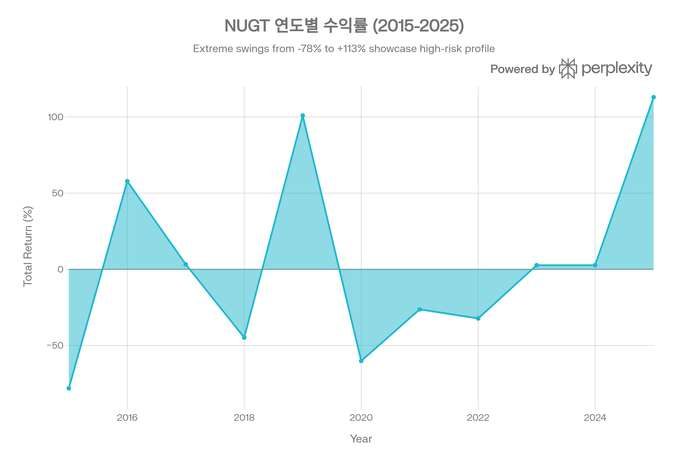
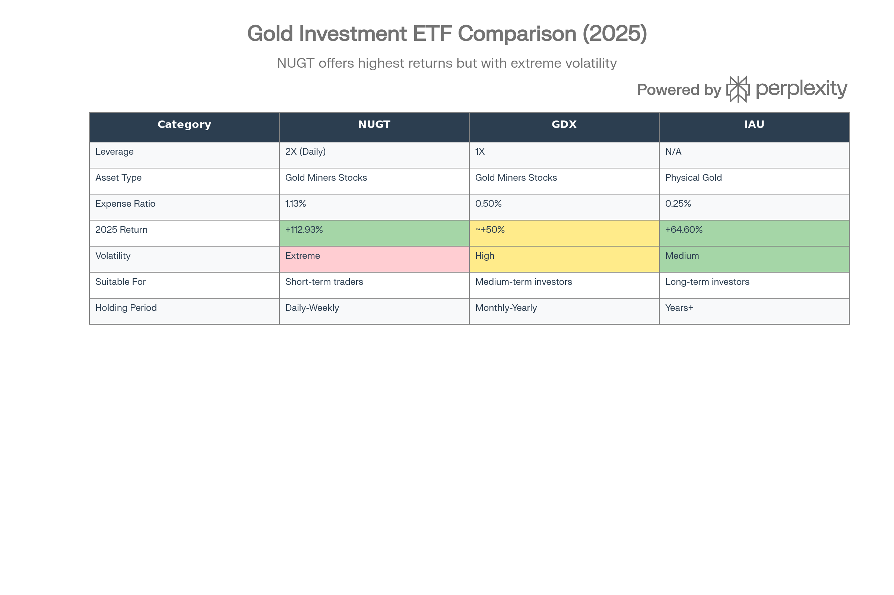

## 분류 근거

NUGT는 금광주 지수를 일일 2배 레버리지로 추종하는 ETF로, 분류 우선순위 1순위인 레버리지/인버스 상품입니다. 기존 `ETF/Leveraged Inverse/Gold`(GDXU, GLL) 폴더에 함께 분류했습니다.

## 개요

NUGT (Direxion Daily Gold Miners Index Bull 2X Shares)는 Direxion Investments가 2010년 12월 8일 출시한 레버리지 ETF로, 금광 기업 지수의 일일 성과를 2배로 추종하는 초고위험·고수익 상품이다. 원래 3배 레버리지로 시작했으나 2020년 3월 31일 2배로 조정되었으며, 2025년에는 112.93%의 폭발적 수익률을 기록하며 레버리지 ETF 시장에서 최고 성과를 달성했다.[^1][^2][^3][^4]

NUGT는 금 가격 상승의 이중 레버리지 효과를 노린다. 첫째, 금광 기업은 고정 채굴 비용 구조로 인해 금값 상승 시 이익이 비례 이상으로 증가하는 '운영 레버리지'를 갖는다. 둘째, NUGT는 선물·스왑·옵션 등 파생상품을 활용해 이 금광주 성과를 다시 2배로 증폭시키는 '금융 레버리지'를 제공한다. 결과적으로 금 가격이 10% 상승하면 금광주는 15\~20% 상승하고, NUGT는 30\~40% 급등하는 강력한 상승 모멘텀을 창출한다.[^5][^6][^7][^8][^1]

그러나 이 구조는 양날의 검이다. 2015년 NUGT는 -78.09%의 역사적 폭락을 경험했으며, 설정 이후 연환산 수익률은 -37.72%로 장기 보유 시 자본 잠식이 불가피하다. 일일 리밸런싱 구조로 인한 복리 효과와 변동성 소모(volatility drag)는 장기 투자자에게 치명적이며, Direxion 스스로 "레버리지 리스크를 이해하고 적극적으로 투자를 관리하는 투자자"에게만 권장한다고 명시한다.[^2][^9][^10][^11]

2026년 금 시장은 골드만삭스의 5,400달러 목표가, JP Morgan의 5,055달러 전망, 그리고 지속적인 중앙은행 금 매입(월 70톤 예상)으로 낙관적 전망이 우세하지만, 금값이 5,000달러를 돌파한 현 시점에서 단기 조정 가능성도 상존한다. NUGT는 이러한 환경에서 숙련된 단기 트레이더에게 강력한 수익 기회를 제공하지만, 초보 투자자나 장기 투자자에게는 절대 금기 상품이다.[^12][^8][^11][^1]

***

## NUGT (Direxion Daily Gold Miners Index Bull 2X Shares) 기본 정보

| 항목 | 내용 |
| :-- | :-- |
| **티커** | NUGT |
| **운용사** | Direxion Investments (Rafferty Asset Management LLC) |
| **설정일** | 2010년 12월 8일 |
| **상장 거래소** | NYSE Arca |
| **추종 지수** | NYSE Arca Gold Miners Index (GDMNTR) → MarketVector Global Gold Miners Index (2025년 9월 변경) |
| **레버리지 배수** | 일일 2배 (2X Daily Bull) |
| **운용자산(AUM)** | \$1.03B \~ \$1.56B (2026년 1월) |
| **현재가** | \~\$284.99 (2026년 1월 27일) |
| **운용보수(Expense Ratio)** | 1.13% |
| **발행 주식수** | 8.20M |
| **배당 정책** | 분기별 배당 (수익률 0.27\~0.95%) |
| **리밸런싱** | 일일 (매일 레버리지 비율 재조정) |

NUGT는 NYSE Arca Gold Miners Index(현 MarketVector Global Gold Miners Index)의 일일 성과를 200% 추종하는 것을 목표로 한다. 이 지수는 금·은 채굴 기업 중 매출의 50% 이상 또는 광물 자원의 50% 이상이 금·은과 관련된 대형 기업들로 구성되며, Newmont, Barrick Gold, Agnico Eagle Mines 등이 주요 구성 종목이다.[^1][^2][^9][^13]

NUGT의 역사는 극적이다. 2010년 출시 당시에는 3배 레버리지 ETF였으나, 2020년 3월 코로나 팬데믹으로 인한 극심한 변동성 속에서 투자자 보호를 위해 2배로 레버리지가 축소되었다. 이는 2020년 3월 한 달간 -40% 이상 폭락한 후 내린 결정으로, 3배 레버리지의 리스크가 대중 투자자에게 과도하다는 판단에서였다. 2025년 9월에는 추종 지수가 NYSE Arca에서 MarketVector로 변경되었으나, 구성 종목과 특성은 거의 동일하다.[^4][^1]

NUGT는 실제 금광주를 100% 보유하지 않고, VanEck Gold Miners ETF(GDX) 52.61%, GDX 스왑 계약 37.68%, 현금성 자산 및 담보 등으로 포트폴리오를 구성한다. 이는 선물·스왑·옵션 등 파생상품을 적극 활용하여 일일 2배 레버리지를 구현하는 합성 복제(synthetic replication) 방식이다.[^13][^7][^4]

***

## NUGT (Direxion Daily Gold Miners Index Bull 2X Shares) 성과 분석

### 수익률 실적 (2025년 12월 31일 기준)

2025년 NUGT는 금광주 시장의 역사적 강세를 2배로 증폭시키며 NAV 기준 112.93%, 1년 기준 100.27%의 폭발적 수익률을 기록했다. 이는 2025년 미국 레버리지 ETF 시장에서 최고 성과 중 하나이며, [GDXU](/blog/etf/leveraged-inverse/gold/gdxu/gdxu-microsectors-gold-miners-3x-leveraged-etn)(3배 레버리지 금광주 ETN, 자체 포스트 기준 2025년 약 175% 수익)에 이어 2위권을 차지했다.[^2][^14]

| 기간 | NAV Total Return (%) | 벤치마크(NYSE Arca Gold Miners Index) 추정 |
| :-- | :-- | :-- |
| **1개월** | 4.12 | \~2% |
| **3개월** | 20.02 | \~10% |
| **YTD (2025)** | 112.93 | \~56% (2배 추종) |
| **1년** | 100.27 | \~50% |
| **3년 (연환산)** | 31.37 | \~15.7% |
| **5년 (연환산)** | -0.10 | \~-0.05% |
| **10년 (연환산)** | -13.19 | \~-6.6% |
| **설정 후 (연환산)** | -37.72 | \~-18.9% |

출처: Direxion, POEMS[^9][^2]

2025년 성과는 금광주 섹터의 완벽한 폭풍을 반영한다. 금 가격이 온스당 2,600달러에서 3,700달러 수준으로 42% 급등하는 동안, 금광 기업들의 이익은 고정 채굴 비용 구조로 인해 60\~80% 증가했고, NUGT는 이를 다시 2배로 증폭시켜 100% 이상의 수익률을 달성했다. POEMS 데이터에 따르면 2년 기준으로는 428%까지 상승하기도 했다.[^5][^15][^9]

### 연도별 수익률: 극심한 변동성의 역사

NUGT의 극심한 변동성을 보여주는 11년간 연도별 수익률. 2배 레버리지로 금광주 시장의 등락을 극대화.

NUGT의 연도별 수익률은 레버리지 ETF의 극단적 특성을 그대로 보여준다. 2015년 -78.09%의 역사적 폭락은 금값이 2011년 고점(온스당 \$1,900)에서 2015년 저점(\$1,050)까지 하락한 시기를 반영하며, 3배 레버리지가 적용된 당시 투자자들은 사실상 원금의 78%를 잃었다.[^9]

반면 2016년과 2019년은 금 가격 회복기로 각각 +57.84%, +100.92%의 폭발적 수익을 제공했다. 2020년 코로나 팬데믹 초기에는 -60.11%로 다시 급락했지만, 이후 금값이 안전자산 수요로 급등하며 반등 기회를 제공했다. 2021\~2024년은 연준의 금리 인상 사이클로 금광주가 부진하며 -26.28% \~ +2.74% 범위의 낮은 수익률을 기록했다.[^9]

이러한 극심한 변동성은 NUGT가 "방향성이 확실한 단기 시장"에서만 유효한 도구임을 입증한다. 금 시장이 횡보하거나 방향성이 불분명할 때 NUGT를 보유하면 일일 리밸런싱으로 인한 변동성 소모(volatility drag)로 자본이 점진적으로 잠식된다.[^1][^10]

### 장기 성과의 함정

NUGT의 5년 연환산 수익률 -0.10%, 10년 -13.19%, 설정 후 -37.72%는 레버리지 ETF의 근본적 한계를 보여준다. 일일 리밸런싱 구조는 복리 효과(compounding effect)로 인해 장기 성과가 기초 지수의 2배가 되지 않는다. 특히 변동성이 큰 시장에서는 지수가 제자리로 돌아와도 NUGT는 손실을 기록할 수 있다.[^2]

**예시:** 금광주 지수가 1일차 +10%, 2일차 -9.09%로 원점 복귀 시

- 지수: 100 → 110 → 100 (±0%)
- NUGT (2배): 100 → 120 → 98.18 (-1.82%)

이러한 복리 효과와 변동성 소모는 레버리지 ETF의 숙명이며, 투자자는 반드시 일일\~주간 단위로 청산해야 한다.[^1][^7][^11]

***

## NUGT (Direxion Daily Gold Miners Index Bull 2X Shares) 비용 및 효율성

### 운용보수: 레버리지의 대가

NUGT의 운용보수는 1.13%로, 일반 금광주 ETF인 GDX(0.51%)나 금 실물 ETF인 IAU(0.25%) 대비 2\~4배 높다. 이는 레버리지 구현을 위한 파생상품 거래 비용, 일일 리밸런싱 비용, 담보 관리 비용 등이 포함된 결과다.[^2][^4][^16][^7]

| ETF | 운용보수 | 자산 유형 | 레버리지 |
| :-- | :-- | :-- | :-- |
| **NUGT** | 1.13% | 금광주 (파생상품) | 2배 |
| **GDX** | 0.50% | 금광주 (실물) | 1배 |
| **IAU** | 0.25% | 금 실물 | 없음 |
| **GDXU** | \~0.95% | 금광주 (파생상품) | 3배 |

출처: 각 운용사, 투자 분석 자료[^16][^7][^2]

1.13%의 운용보수는 연간 \$100,000 투자 시 \$1,130의 비용을 의미하지만, NUGT의 초단기 트레이딩 특성상 실제 보유 기간이 수일\~수주에 불과하므로 실질 비용 부담은 상대적으로 작다. 오히려 비드-애스크 스프레드와 파생상품 롤오버 비용이 더 중요하다.[^7]

### 유동성: 초단기 트레이딩의 생명줄

NUGT의 가장 큰 강점은 압도적인 유동성이다. 일평균 거래량은 788,100주, 거래금액은 약 5.27억 달러로, 이는 금광주 ETF 중 최고 수준이며 심지어 GDX(\$5.87억)에 근접한다. 이러한 높은 유동성은 대형 트레이더가 수백만\~수천만 달러 규모로 즉시 진입·청산할 수 있음을 의미하며, 비드-애스크 스프레드도 좁아 거래 비용이 최소화된다.[^1][^16][^17]

### 추종 효율성

NUGT는 일일 2배 추종을 목표로 하며, 단기(1일\~1주) 성과는 이 목표를 대체로 달성한다. 그러나 1개월 이상 보유 시 복리 효과로 기초 지수의 정확히 2배가 되지 않는다. 예를 들어, 2025년 YTD 기준 NYSE Arca Gold Miners Index가 약 56% 상승했을 때 NUGT는 112.93%로 정확히 2배(112%)에 근접하지만, 3년 연환산은 31.37%로 기초 지수 추정치(15.7%)의 2배(31.4%)와 거의 일치한다.[^2]

이는 NUGT가 단기적으로는 효율적이지만, 기간이 길어질수록 변동성 소모와 리밸런싱 비용으로 성과가 저하됨을 보여준다.[^1][^10]

***

## NUGT (Direxion Daily Gold Miners Index Bull 2X Shares) 포트폴리오 구성

### 자산 배분 전략

NUGT는 실제 금광주를 직접 보유하기보다는 GDX ETF와 스왑 계약, 현금성 자산을 조합하여 일일 2배 레버리지를 구현한다. 이는 합성 복제(synthetic replication) 방식으로, 파생상품을 활용해 목표 노출을 달성하는 효율적 구조다.[^13][^4]

**주요 보유 자산 (Morningstar 데이터 기준):**

| 보유 자산 | 비중 (%) | 시장가치 (USD) | 설명 |
| :-- | :-- | :-- | :-- |
| **VanEck Gold Miners ETF (GDX)** | 52.61 | 320M | 실물 금광주 ETF |
| **VanEck Vectors Gold Miners ETF Swap** | 37.68 | 229M | GDX 스왑 계약 |
| **Dreyfus Govt Cash Man Ins** | 30.91 | 188M | 현금성 자산 |
| **Goldman Sachs FS Treasury Intms Instl** | 12.03 | 73M | 단기 채권 |
| **Dreyfus Trsry Securities Cash Mgmt** | 4.68 | 28M | 현금 관리 |
| **담보 (Collateral): Citi, BNP, UBS, Goldman, JPM** | -22.15 (합계) | -141M | 차입 담보 |

출처: Morningstar[^13]

포트폴리오 비중의 합이 100%를 초과하는 것은 레버리지 구조 때문이다. GDX 실물 52.61% + 스왑 37.68% = 약 90%의 금광주 노출에 현금성 자산을 더한 후, 음수 담보(-22.15%)는 차입을 의미한다. 이 구조로 순자산 대비 약 200%의 금광주 노출을 달성한다.

### 기초 지수: NYSE Arca Gold Miners Index

NUGT가 추종하는 지수(2025년 9월 이후 MarketVector Global Gold Miners Index)는 시가총액 가중 방식으로 대형 금광 기업을 포함한다. 주요 구성 종목은 GDX를 통해 노출되며, 대표적으로 다음과 같다:[^1][^9]

- **Newmont Corporation**: 세계 최대 금 생산 기업
- **Barrick Gold**: 2위 금광 기업
- **Agnico Eagle Mines**: 북미 중심 금광
- **Franco-Nevada**: 금 로열티 기업
- **Wheaton Precious Metals**: 금·은 스트리밍 기업

이들 기업은 금·은 채굴이 주요 사업이며, 금 가격에 직접적인 레버리지 효과를 갖는다.[^5][^10]

### 지역 및 시가총액 배분

NUGT의 지역 배분은 GDX를 따르며, 아메리카(북미·남미), 유럽, 아시아·호주에 분산된다. 시가총액 배분은 Giant(8.20%), Large(21.34%), Medium(16.06%), Small(5.06%)로 대형주 중심이다. 이는 유동성과 안정성을 확보하기 위한 구조이며, 소형 금광주에 집중하는 JNUG(Direxion Daily Junior Gold Miners 2X)와 차별화된다.[^9]

NUGT vs GDX vs IAU 비교. NUGT는 극단적 수익과 리스크, GDX는 중간, IAU는 안정적 금 투자.

---

## NUGT (Direxion Daily Gold Miners Index Bull 2X Shares) 리스크 분석

### 레버리지의 양날의 검

NUGT의 가장 큰 리스크는 2배 레버리지가 하락 시에도 동일하게 작용한다는 점이다. 금광주 지수가 -10% 하락하면 NUGT는 -20% 폭락하며, -20% 하락 시 NUGT는 -40%로 급락한다. 2015년 금광주 지수가 약 -39% 하락했을 때 NUGT는 -78.09% 폭락했으며, 이는 투자자가 사실상 원금의 78%를 잃었음을 의미한다.[^1][^9][^7]

| 금광주 지수 변동 | NUGT 예상 변동 | 실제 사례 |
| :-- | :-- | :-- |
| +50% | +100% | 2025년 (112.93%) |
| +10% | +20% | 일반적 상승장 |
| -10% | -20% | 일반적 하락장 |
| -20% | -40% | 2020년 코로나 초기 |
| -39% | -78% | 2015년 금 약세장 |

출처: POEMS, Direxion[^9][^1]

### 일일 리밸런싱과 복리 효과

NUGT는 매일 포지션을 재조정하여 순자산 대비 200%의 레버리지 비율을 유지한다. 이는 단기적으로는 정확한 2배 추종을 보장하지만, 장기적으로는 복리 효과로 성과가 왜곡된다.[^1][^4]

**수학적 예시:**

- 금광주 지수: Day 1 +10% → Day 2 +10% = 21% 상승
- NUGT: Day 1 +20% → Day 2 +20% = 44% 상승 (21%의 2배가 아닌 44%)
- 반대로 금광주 지수: Day 1 +10% → Day 2 -9.09% = 0% (제자리)
- NUGT: Day 1 +20% → Day 2 -18.18% = -1.82% 손실

이러한 복리 효과는 변동성이 클수록 NUGT에 불리하게 작용하며, 이를 변동성 소모(volatility drag)라 부른다. 금광주 시장이 횡보할 때 NUGT를 장기 보유하면 손실이 누적된다.[^10][^1]

### 극심한 변동성

NUGT의 연환산 표준편차는 추정 50\~70% 수준으로, 일반 주식(S&P 500: 15\~20%)의 3\~4배에 달한다. 일중 변동폭도 5\~10%는 일상적이며, 급변하는 시장에서는 20\~30% 변동도 발생한다. 이는 단기 트레이더에게는 수익 기회지만, 일반 투자자에게는 감당하기 어려운 스트레스다.[^1][^7][^18][^19]

### 최대낙폭 (MDD)

NUGT의 역사적 최대낙폭은 -78.09%로, 2015년 금 약세장 시기에 기록되었다. 2020년 3월 코로나 팬데믹 초기에도 단 몇 주 만에 -40% 이상 폭락했다. 투자자는 NUGT 매수 시 단기간에 -50% 이상 하락할 가능성을 항상 염두에 두어야 한다.[^1][^9][^7]

### 주요 리스크 요인

**1. 금 가격 급락 리스크:** 금값이 급락하면 금광주는 더 크게 하락하고, NUGT는 다시 2배로 폭락한다. 연준의 매파적 전환(금리 인상 재개)은 최악의 시나리오다.[^12][^20]

**2. 금광주 고유 리스크:** 금광 기업은 채굴 비용, 환율, 에너지 가격, 노동 분쟁, 국가 리스크(광산 국유화, 세금 인상) 등 금 가격 외 다양한 변수에 노출된다.[^1][^10]

**3. 파생상품 리스크:** NUGT는 스왑·선물·옵션을 활용하므로, 상대방 리스크(counterparty risk)가 존재한다. 금융위기 시 스왑 상대방이 파산하면 손실이 발생할 수 있다.[^7][^1]

**4. 유동성 리스크 (극단 상황):** 평시에는 높은 유동성을 자랑하지만, 시장 패닉 시 유동성이 급격히 말라 비드-애스크 스프레드가 확대되거나 거래 자체가 어려울 수 있다.[^1]

**5. 세금 리스크:** 미국에서 NUGT의 수익은 Ordinary Income으로 과세되어 단기 자본이득세율(최대 39.60%)이 적용된다. 장기 자본이득세(최대 20.00%)보다 불리하다.[^21][^4]

**6. 롤오버 비용:** 선물·스왑 계약은 만기가 있어 정기적으로 롤오버(만기 연장)해야 하며, 이 과정에서 콘탱고(contango) 비용이 발생할 수 있다.[^7][^1]

**7. 시장 타이밍 실패:** NUGT는 방향성이 확실한 시장에서만 유효하다. 금광주가 횡보하거나 반전할 때 NUGT를 보유하면 변동성 소모로 손실이 누적된다.[^22][^1]

***

## 금광주 투자의 레버리지 효과

### 금광주가 금보다 빨리 오르는 이유

금광 기업은 채굴 비용이 고정비 성격을 띠므로, 금 가격 상승 시 수익이 비례 이상으로 증가하는 '운영 레버리지' 효과를 갖는다. 이는 NUGT 투자의 핵심 논리다.[^5][^6][^8]

**수학적 예시:**

- 금 채굴 기업: 채굴 비용 \$1,000/oz, 금값 \$1,200/oz → 이익 \$200/oz
- 금값 20% 상승 → \$1,440/oz → 이익 \$440/oz (120% 증가)
- 금광주 주가는 이익 증가율에 비례하므로 약 120% 상승 (금 가격 상승률 20%의 6배)

물론 실제로는 채굴 비용도 일부 변동(에너지·인건비)하므로 레버리지 효과는 3\~5배 수준이지만, 금 현물 ETF(IAU, GLD)보다 훨씬 높은 수익을 제공한다. NUGT는 이 금광주 레버리지를 다시 2배로 증폭시켜 금 가격 상승의 6\~10배 수익을 노린다.[^8][^5]

### 금 vs 금광주 vs NUGT 성과 비교 (2025년)

| 자산 | 2025년 수익률 | 레버리지 배수 |
| :-- | :-- | :-- |
| **금 현물 (IAU)** | +64.60% | 1배 (기준) |
| **금광주 (GDX)** | \~+50\~56% | 약 0.8\~0.9배 (금보다 낮음) |
| **NUGT (2X 금광주)** | +112.93% | 약 1.75배 (금 대비) |

출처: iShares, Direxion[^2][^23]

원출처는 위와 같이 2025년 GDX 수익률을 금 현물보다 낮은 \~50\~56%로 제시했다. 그러나 [GDX 자체 포스트](/blog/etf/gold/gdx/gdx-vaneck-gold-miners-etf)는 같은 해 수익률을 98.76\~155.61%(금 현물을 상회)로 보고하고 있어, 두 수치가 상당히 다르다. 이는 집계 시점·산출 방식 차이로 보이며, GDX의 실제 2025년 성과가 궁금하다면 GDX 자체 포스트를 참고하는 것이 정확하다. NUGT는 어느 기준으로 보아도 2배 레버리지 구조상 GDX 대비 증폭된 성과(112.93%)를 기록했다.[^12][^8]

### 금광주와 금 가격의 상관관계

금광주는 금 가격과 긍정적 상관관계를 갖지만 완벽하게 연동되지는 않는다. 주요 차이점은 다음과 같다:[^1][^10]

**1. 지연 효과:** 금 가격 변동이 금광주 수익에 반영되기까지 분기 단위로 시간차가 있다. 금값이 상승해도 금광 기업이 실제 매출·이익으로 실현하기까지는 몇 달이 소요된다.[^1]

**2. 기업 고유 리스크:** 광산 사고, 경영진 교체, 생산량 감소, 환율 변동 등은 금 가격과 무관하게 금광주에 영향을 미친다.[^10][^1]

**3. 시장 심리:** 금광주는 주식 시장의 일부이므로, 전체 주식 시장의 리스크 온·오프(risk-on/risk-off) 심리에도 영향을 받는다. 2020년 3월처럼 주식 시장 전체가 폭락할 때 금값은 상승해도 금광주는 하락할 수 있다.[^1]

***

## NUGT (Direxion Daily Gold Miners Index Bull 2X Shares) 배당 및 세금

### 배당 정책

NUGT는 분기별로 소액의 배당을 지급하지만, 배당수익률은 0.27\~0.95%로 극히 낮다. 최근 배당은 주당 \$0.22(2025년 12월)였으며, 이는 현재가 \$284.99 대비 약 0.08%에 불과하다. NUGT의 수익은 거의 전적으로 시세차익에서 발생하므로, 배당 수익을 기대하는 투자자에게는 부적합하다.[^24][^21][^4]

배당 처리 방식은 'Distributes'로, 금광주 ETF(GDX)로부터 받은 배당과 현금성 자산의 이자 수익 일부를 분배하는 구조다. 그러나 레버리지 운용 비용(1.13%)이 이자 수익을 상쇄하므로 실질 배당은 미미하다.[^4]

### 미국 세금 처리

NUGT의 세금 처리는 일반 주식보다 불리하다. 미국 세법은 NUGT의 수익을 Ordinary Income으로 분류하므로, 보유 기간에 관계없이 일반 소득세율이 적용된다.[^21][^4]

**1. 단기 자본이득세 (1년 미만 보유):** 최대 39.60% (일반 소득세율 37% + 추가 세금)[^4][^21]

**2. 장기 자본이득세 (1년 이상 보유):** 최대 20.00%[^21][^4]

그러나 NUGT는 일일\~주간 단위 트레이딩 상품이므로 대부분 투자자는 단기 보유에 해당하며, 39.60%의 높은 세율을 부담한다. 이는 일반 주식의 단기 자본이득세(37%)보다 높고, 장기 자본이득세(20%)와는 비교할 수 없을 정도로 불리하다.

**3. K-1 발행:** 일부 연도에 K-1(파트너십 과세 보고서)이 발행될 수 있으며, 이는 세금 신고를 복잡하게 만든다.[^7]

### 한국 투자자 세금 처리

한국 거주 투자자가 NUGT에 투자할 경우, 해외 주식 양도소득세가 적용된다. 연간 250만 원까지는 비과세이며, 초과분에 대해 22%(지방소득세 포함)의 세율이 적용된다.[^25][^26]

NUGT의 초단기 트레이딩 특성상 연간 수백만\~수천만 원의 차익을 실현할 가능성이 있으므로, 세금 부담은 상당할 수 있다. 예를 들어, 연간 1억 원의 차익 발생 시 (1억 원 - 250만 원) × 22% = 2,145만 원의 세금을 다음해 5월 종합소득세 신고 시 납부해야 한다.

***

## NUGT vs JNUG vs GDX: 금광 ETF 비교

금광 투자를 위한 ETF는 여러 선택지가 있으며, 각각의 특성을 이해하는 것이 중요하다.

### NUGT vs JNUG

**JNUG (Direxion Daily Junior Gold Miners Index Bull 2X Shares)**는 NUGT의 자매 ETF로, 중소형 금광 기업(junior miners)에 2배 레버리지로 투자한다.[^27][^7]

| 항목 | NUGT | JNUG |
| :-- | :-- | :-- |
| **추종 대상** | 대형 금광주 (Newmont, Barrick 등) | 중소형 금광주 |
| **레버리지** | 2배 (일일) | 2배 (일일) |
| **변동성** | 극심함 | 더욱 극심함 |
| **2025년 수익률** | +112.93% | +120\~675% (데이터 차이) |
| **리스크** | 매우 높음 | 초고위험 |
| **적합 투자자** | 숙련된 단기 트레이더 | 극단적 리스크 감수 가능 투자자 |

출처: Direxion, 키움증권[^14][^7][^27]

JNUG는 소형 금광 기업에 집중하므로 변동성과 레버리지 효과가 NUGT보다 크다. 2025년 일부 데이터에서는 JNUG가 +675%까지 상승한 것으로 나타나, 이는 중소형 금광주의 폭발적 상승을 반영한다. 그러나 하락 시에도 NUGT보다 가혹하므로, 일반 투자자에게는 NUGT도 충분히 위험하지만 JNUG는 전문가용 상품이다.[^27]

### NUGT vs GDX

**GDX (VanEck Gold Miners ETF)**는 비레버리지 금광주 ETF로, NUGT의 기초 자산이기도 하다.[^9][^13]

| 항목 | NUGT | GDX |
| :-- | :-- | :-- |
| **레버리지** | 2배 (일일) | 1배 (없음) |
| **운용보수** | 1.13% | 0.51% |
| **2025년 수익률** | +112.93% | \~+50\~56% (원출처 기준; [GDX 자체 포스트](/blog/etf/gold/gdx/gdx-vaneck-gold-miners-etf)는 98.76\~155.61%로 보고) |
| **변동성** | 극심함 | 높음 |
| **보유 기간** | 일일\~주간 | 월\~년 |
| **적합 투자자** | 초단기 트레이더 | 중기 투자자 |

출처: Direxion, VanEck[^2][^9]

GDX는 레버리지가 없으므로 변동성과 리스크가 NUGT의 절반 수준이다. 금광주에 중기(수개월\~수년) 투자하려는 투자자는 GDX를 선택하는 것이 합리적이며, NUGT는 일일\~주간 단위로 방향성이 확실할 때만 사용해야 한다.[^1][^7]

***

## NUGT (Direxion Daily Gold Miners Index Bull 2X Shares) 투자 전략

### 단기 트레이딩 전략

NUGT는 Direxion 스스로 "일일 수익률을 목표로 하며, 레버리지 리스크를 이해하고 적극적으로 투자를 관리하는 투자자"에게만 권장한다고 명시한다. 이는 NUGT가 Buy & Hold 상품이 아닌 단기 트레이딩 도구임을 강조한다.[^10][^11]

**1. 데이 트레이딩 (Day Trading):**

NUGT의 가장 일반적인 활용법은 하루 내 매매다. 금 가격과 금광주 뉴스를 모니터링하며, 강한 상승 모멘텀이 확인되면 매수하고 당일 청산한다. 기술적 분석(RSI, MACD, 이동평균선)을 활용하여 진입·청산 시점을 결정한다.[^7][^11][^22]

**장점:** 일일 리밸런싱의 부작용 최소화, 변동성 소모 회피
**단점:** 높은 집중력과 거래 빈도 필요, 거래 비용 누적

**2. 스윙 트레이딩 (Swing Trading):**

수일\~수주 단위로 금광주의 추세를 포착하여 매매한다. 금 가격이 명확한 상승 추세에 진입했다고 판단되면 NUGT를 매수하고, 추세가 약화되거나 반전 신호가 나타나면 청산한다.[^7]

**장점:** 데이 트레이딩보다 스트레스 적음, 큰 추세 포착 시 높은 수익
**단점:** 일일 리밸런싱으로 인한 복리 효과 시작, 변동성 소모 발생 가능

**3. 트렌드 팔로잉 전략:**

금광주 섹터가 강한 상승 추세일 때만 NUGT를 보유하고, 추세가 약화되면 즉시 청산하는 전략이다. 50일·200일 이동평균선을 활용하여 추세를 판단하며, GDX가 200일 이동평균선 위에서 거래될 때만 NUGT를 매수한다.[^7]

**장점:** 큰 추세를 놓치지 않음
**단점:** 추세 반전 시 손실 확대 가능성

### 손절매 및 익절 원칙

NUGT는 하루에 10\~20% 변동하므로, 명확한 손절매와 익절 기준이 필수다.[^1][^7]

**손절매 기준 예시:**

- 매수가 대비 -10% 하락 시 무조건 청산
- 금광주 지수(GDX)가 주요 지지선을 하향 돌파 시 청산
- 금 가격이 일중 -2% 이상 급락 시 청산 검토

**익절 기준 예시:**

- 매수가 대비 +15\~20% 상승 시 청산 고려
- RSI가 70 이상 과매수 구간 진입 시 일부 익절
- 금 가격이 주요 저항선에 도달 시 청산

### 투자 자금 배분

NUGT는 극단적 변동성으로 인해 포트폴리오의 5% 이하로 제한해야 한다. 보수적 투자자는 1\~2%, 공격적 트레이더도 10%를 초과해서는 안 된다. NUGT에 전 재산을 투자하는 것은 도박이며, 단기간에 -50% 이상 손실을 입을 각오가 필요하다.[^1][^7]

### 시장 타이밍의 중요성

NUGT는 '방향성이 확실한 시장'에서만 유효하다. 금광주가 횡보하거나 방향성이 불분명할 때 NUGT를 보유하면 일일 리밸런싱으로 인한 변동성 소모로 손실이 누적된다. 따라서 투자자는 다음 신호를 확인한 후 진입해야 한다:[^1][^22]

**매수 신호:**

- 금 가격이 주요 저항선 돌파 후 강한 상승 모멘텀
- 중앙은행 금 매입 확대, 연준 금리 인하 등 거시경제 호재
- GDX가 200일 이동평균선 상향 돌파
- 지정학적 리스크 고조(전쟁, 경제위기)로 안전자산 수요 급증

**매도 신호:**

- 금 가격이 주요 지지선 하향 이탈
- 연준의 매파적 전환(금리 인상 신호)
- GDX가 주요 이동평균선 하향 이탈
- 금광주 섹터의 피로도 누적(과매수 지표)

***

## NUGT (Direxion Daily Gold Miners Index Bull 2X Shares) 2026년 투자 전망

### 금 시장 전망: 낙관론 우세

2026년 금 시장은 주요 투자은행들의 낙관적 전망이 우세하다. 골드만삭스는 2026년 말 금 가격 목표를 5,400달러로 상향 조정했으며, 이는 현재 수준(5,000달러) 대비 약 8% 추가 상승 여력을 시사한다.[^12][^8][^20]

**주요 기관 금 가격 전망 (2026년):**

| 기관 | 2026년 말 목표가 | 평균 목표가 | 근거 |
| :-- | :-- | :-- | :-- |
| **Goldman Sachs** | \$5,400/oz | \$4,900/oz | 민간·중앙은행 금 매입 지속, 연준 금리 50bp 추가 인하 |
| **JP Morgan** | \$5,400/oz (2027) | \$5,055/oz (Q4 2026) | 중앙은행 연 585톤 매입, 투자 수요 회복 |
| **Bank of America** | \$5,000/oz (상단) | \$4,538/oz | 지정학적 리스크, 달러 약세 |
| **Morgan Stanley** | - | \$4,800/oz (Q4 2026) | 금리 인하, 연준 리더십 변화 |
| **State Street** | \$5,000/oz (강세) | \$4,000\~4,500/oz | 전략적 재배분, 지정학 |
| **Yardeni Research** | \$6,000/oz | - | 공격적 전망 |

출처: 각 기관 리서치 보고서[^12]

컨센서스는 \$4,500\~5,000 평균, 상단은 \$5,400\~6,000로 요약된다. 이는 금광주에게 유리한 환경이며, NUGT는 이 금광주 상승을 2배로 증폭시킬 수 있다.

### 금광주 전망: 구조적 강세 지속

금광주 섹터는 2026년에도 구조적 강세가 지속될 것으로 전망된다. 주요 상승 동력은 다음과 같다:[^12][^8]

**1. 중앙은행 금 매입 지속:** 골드만삭스는 2026년 중앙은행이 월 60톤, 연 720톤의 금을 매입할 것으로 예상한다. 이는 탈달러화 트렌드의 일환으로, 신흥시장 중앙은행들이 외환보유액 다변화를 추구하기 때문이다.[^12]

**2. 금광주 마진 확대:** 금 가격이 \$4,500\~5,000 범위를 유지하면 금광 기업들의 이익 마진은 역사적 고점 수준을 유지한다. 채굴 비용이 \$1,000\~1,200/oz 수준이므로, 금값 \$5,000일 때 마진은 \$3,800\~4,000/oz로 막대한 수익을 창출한다.[^8]

**3. 생산량 감소 및 공급 부족:** 세계 금 생산량은 정체 또는 감소 추세이며, 신규 금광 개발에는 수년이 소요된다. 공급 부족은 금값 상승 압력을 지속시킨다.[^12]

**4. M&A 활성화:** 금광 기업 간 인수합병(M&A)이 활발해지면 금광주 밸류에이션이 상승한다.[^12]

**5. 배당 및 자사주 매입 확대:** 높은 수익성을 바탕으로 금광 기업들이 배당과 자사주 매입을 늘리면 주주 환원율이 개선되어 주가를 지지한다.[^12]

### NUGT 전망: 단기 조정 후 상승 재개 가능

2026년 1월 현재 금값은 5,000달러를 돌파하며 역사적 고점을 경신했고, NUGT는 \$284.99로 거래되고 있다. 단기적으로는 과열 구간 진입으로 조정 가능성이 있지만, 중기적으로는 추가 상승 잠재력이 있다는 평가다.[^17][^12][^8]

**낙관 시나리오:**

- 금값 \$5,400 달성 시: 금광주 +15\~20% 상승 → NUGT +30\~40% 상승
- 현재가 \$285 → 목표가 \$370\~400 (약 30\~40% 상승 여력)

**기본 시나리오:**

- 금값 \$4,500\~5,000 범위 박스권: 금광주 횡보 → NUGT 변동성 소모로 손실 가능
- 명확한 추세 없이 보유 시 일일 리밸런싱으로 -10\~20% 손실 가능

**비관 시나리오:**

- 금값 \$4,000 이하 급락 (연준 매파 전환): 금광주 -20\~30% 폭락 → NUGT -40\~60% 폭락
- 현재가 \$285 → 목표가 \$110\~170 (약 -40\~60% 하락)

### 투자 권장사항

**2026년 상반기 NUGT 투자 전략:**

**1. 단기 조정 대기 (보수적, 추천):**

현재 금값이 5,000달러를 돌파한 고점 수준이므로, 단기 조정(4,400\~4,600달러)을 기다린 후 진입하는 것이 안전하다. 금광주(GDX)가 주요 지지선(50일 이동평균선)까지 조정받을 때 NUGT를 소량(포트폴리오의 1\~2%) 매수하고, 명확한 손절매 기준(-10%)을 설정한다.

**2. 즉시 진입 (공격적):**

금값이 5,400달러까지 추가 상승할 것으로 확신한다면, 현재 수준에서 소량 진입할 수 있다. 단, 단기 조정 시 -10\~20% 하락을 감내해야 하며, 일일\~주간 단위로 청산할 각오가 필요하다.

**3. 보유 금지 (장기 투자자):**

NUGT는 절대로 장기 보유 상품이 아니다. 금광주에 중장기(수개월\~수년) 투자하려면 GDX를 선택하고, 금 실물에 장기 투자하려면 IAU 또는 IAUM을 선택해야 한다. NUGT를 수개월 이상 보유하면 변동성 소모로 손실이 누적된다.

**4. 기술적 분석 활용:**

NUGT 매매 시 기술적 분석은 필수다. RSI, MACD, 볼린저 밴드, 이동평균선 등을 활용하여 과매수·과매도 구간을 판단하고, 지지선·저항선에서 진입·청산을 결정한다.[^7][^22]

**5. 위험 관리:**

NUGT 투자 시 단기간에 -50% 이상 손실을 입을 가능성을 항상 염두에 두어야 한다. 투자 자금은 포트폴리오의 5% 이하로 제한하고, 레버리지 상품의 특성을 완벽히 이해한 후 진입해야 한다.[^1][^11][^7]

***

## NUGT (Direxion Daily Gold Miners Index Bull 2X Shares) 투자 고려사항

### 강점

**1. 극대화된 수익 잠재력:** 2배 레버리지는 금광주 상승 시 일반 ETF의 2배 수익을 제공한다. 2025년처럼 금광주가 강세장을 형성하면 +100% 이상의 폭발적 수익이 가능하다.[^2][^3]

**2. 압도적 유동성:** 일평균 거래량 788,100주, 거래금액 \$5.27억은 금광 ETF 중 최고 수준이며, 대형 트레이더도 즉시 진입·청산할 수 있다.[^16][^17]

**3. 금의 이중 레버리지 효과:** 금광주의 운영 레버리지 + NUGT의 금융 레버리지 = 금 가격 상승의 6\~10배 수익 가능.[^5][^8]

**4. 편리한 접근성:** 개별 금광주를 선택·분석할 필요 없이 NUGT 하나로 금광주 섹터 전체에 레버리지 노출.[^1]

**5. 단기 추세 포착:** 금광주 섹터의 단기 추세를 공격적으로 포착하려는 숙련된 트레이더에게 최적의 도구.[^7][^11]

### 약점

**1. 극심한 변동성:** 하루 10\~20% 변동은 일상적이며, 급변하는 시장에서는 -30\~40% 폭락도 가능하다. 이는 일반 투자자에게 감당하기 어려운 스트레스다.[^1][^9]

**2. 장기 성과 부진:** 5년 -0.10%, 10년 -13.19%, 설정 후 -37.72%는 장기 보유가 불가능함을 입증한다.[^2]

**3. 일일 리밸런싱의 함정:** 복리 효과와 변동성 소모로 장기 성과가 기초 지수의 2배가 되지 않는다.[^10][^1]

**4. 높은 비용:** 1.13% 운용보수는 일반 ETF의 4\~5배 수준이다.[^4][^2]

**5. 금광주 고유 리스크:** 금 가격 외에 채굴 비용, 환율, 노동 분쟁, 국가 리스크 등 다양한 변수에 노출된다.[^1][^10]

**6. 세금 불리:** Ordinary Income 과세로 단기 자본이득세 최대 39.60% 부담.[^21][^4]

**7. 무배당 (실질적):** 배당수익률 0.27\~0.95%로 현금흐름이 거의 없다.[^24][^21]

### 리스크

**1. 원금 전액 손실 가능성:** 레버리지 구조상 금광주 지수가 -50% 폭락하면 NUGT는 -100%(원금 전액 손실)에 근접할 수 있다. 이론적으로는 청산 전 재조정이 이루어지지만, 극단적 시장에서는 원금 전액 손실 가능하다.[^1][^7]

**2. 시장 타이밍 실패:** 금광주가 횡보하거나 반전할 때 NUGT를 보유하면 변동성 소모로 손실이 누적된다.[^22][^1]

**3. 파생상품 리스크:** 스왑·선물 상대방이 파산하면 손실이 발생할 수 있다.[^7][^1]

**4. 청산 위험 (극단):** 이론적으로 NUGT가 -95% 이상 폭락하면 ETF 자체가 청산될 수 있다. 다만 Direxion은 일일 리밸런싱으로 이를 방지한다.

**5. 심리적 압박:** 하루 -20% 폭락을 경험하면 투자자는 패닉에 빠져 바닥에서 손절매하기 쉽다. 감정 통제가 불가능한 투자자는 NUGT를 피해야 한다.[^1][^7]

### 투자자 적합성

**적합한 투자자:**

- 금 및 금광주에 대한 강한 낙관론과 단기 방향성 확신
- 일일\~주간 단위 단기 트레이딩 가능 (매일 모니터링)
- 50% 이상 손실 감수 가능한 높은 위험 감내력
- 레버리지 ETF 작동 방식 완벽 이해
- 시장 타이밍과 기술적 분석에 자신 있는 숙련된 트레이더
- 포트폴리오의 1\~5% 소액만 투자

**부적합한 투자자:**

- 장기 투자자 (Buy & Hold)
- 초보 투자자 또는 위험 회피형 투자자
- 안정적 수익 추구자
- 배당 수익 필요한 투자자
- 매일 모니터링할 시간이 없는 직장인
- 감정 통제 어려운 투자자
- 레버리지 ETF의 복리 효과를 이해하지 못하는 투자자

***

## 결론

NUGT (Direxion Daily Gold Miners Index Bull 2X Shares)는 금광주 시장의 일일 성과를 2배로 증폭시키는 극단적 레버리지 ETF로, 2025년 112.93%의 폭발적 수익률을 기록하며 그 잠재력을 입증했다. 금 가격 상승의 이중 레버리지 효과(금광주의 운영 레버리지 + NUGT의 금융 레버리지)는 단기 트레이더에게 강력한 수익 기회를 제공하지만, 동시에 -78.09%(2015년)의 역사적 폭락을 경험한 초고위험 상품이기도 하다.[^2][^9][^3]

NUGT의 핵심 특징은 "일일 추종"이다. Direxion 스스로 "레버리지 리스크를 이해하고 적극적으로 투자를 관리하는 투자자"에게만 권장하며, 일일 리밸런싱 구조는 장기 보유 시 복리 효과와 변동성 소모로 자본을 잠식한다. 5년 -0.10%, 10년 -13.19%, 설정 후 -37.72%의 연환산 수익률은 NUGT가 절대로 장기 투자 상품이 아님을 명확히 한다.[^10][^11][^2]

2026년 금 시장은 골드만삭스의 5,400달러 목표가, JP Morgan의 5,055달러 전망, 지속적인 중앙은행 금 매입(월 70톤 예상)으로 낙관적 전망이 우세하다. 금광주 기업들도 금값 \$4,500\~5,000 범위에서 역사적 고마진을 유지하며 구조적 강세가 예상된다. 이는 NUGT에게 유리한 환경이지만, 금값이 5,000달러를 돌파한 현 시점에서 단기 조정 가능성도 상존한다.[^12][^8]

**투자 권장 요약:**

- **즉시 진입 (공격적):** 금값 5,400달러 확신, 단기 조정(-10\~20%) 감내 가능, 포트폴리오 1\~2% 소액
- **단기 조정 대기 (보수적, 추천):** 금값 4,400\~4,600달러 조정 후 진입, 명확한 손절매(-10%) 설정
- **보유 금지 (장기 투자자):** NUGT는 절대 장기 보유 불가, GDX 또는 IAU 선택
- **단기 트레이딩 (숙련자):** 일일\~주간 단위 매매, 기술적 분석 활용, 엄격한 위험 관리

**핵심 투자 포인트:**

1. **2배 레버리지의 양날의 검:** 금광주 +50% → NUGT +100%, 금광주 -39% → NUGT -78%
2. **일일 추종 원칙:** 수일\~수주 이상 보유 시 복리 효과로 성과 저하
3. **극심한 변동성:** 하루 10\~20% 변동 일상적, 50% 이상 손실 가능성 항상 존재
4. **높은 유동성:** 일거래량 \$5.27억, 대형 트레이더도 즉시 진출입 가능
5. **2026년 상승 잠재력:** 금값 5,400달러 달성 시 NUGT +30\~40% 추가 상승 가능
6. **단기 조정 가능성:** 현 고점(5,000달러)에서 4,400\~4,600달러로 조정 가능
7. **절대 금기:** 장기 보유, 초보 투자자, 포트폴리오 5% 초과 투자

NUGT는 2026년 금광주 시장의 변동성을 공격적으로 포착하려는 숙련된 단기 트레이더에게 강력한 무기가 될 수 있다. 그러나 이는 양날의 검이며, 방향성이 틀리거나 시장 타이밍을 놓치면 단기간에 원금의 절반 이상을 잃을 수 있다. 투자자는 NUGT를 "도박이 아닌 계산된 리스크"로 접근해야 하며, 명확한 진입·청산 기준과 철저한 위험 관리가 생존의 필수 조건이다.[^1][^7][^11]

***

**주요 출처**

1. Direxion Investments 공식 웹사이트 및 펙트시트[^4][^2]
2. POEMS, Morningstar 금광 ETF 데이터[^9][^13]
3. Goldman Sachs, JP Morgan 금 시장 전망[^12]
4. 금광 투자 전략 및 레버리지 ETF 분석[^7][^11][^1]
5. 국내 금융 매체 및 투자 블로그[^3][^5][^14][^28][^6]

**면책 조항**

본 보고서는 정보 제공 목적으로 작성되었으며, 투자 권유나 매매 추천이 아닙니다. NUGT는 극단적 레버리지 상품으로 단기간에 원금의 대부분 또는 전액을 잃을 수 있는 초고위험 투자입니다. Direxion 스스로 "일일 수익률 추종" 및 "레버리지 리스크를 이해하고 적극적으로 투자를 관리하는 투자자"에게만 권장한다고 명시합니다. 투자 결정은 투자자 본인의 판단과 책임 하에 이루어져야 하며, 투자 손실 발생 시 작성자는 책임을 지지 않습니다. 장기 보유는 절대 금기이며, 초보 투자자는 NUGT 투자를 피해야 합니다. 투자 전 반드시 전문가와 상담하시기 바랍니다.

[^1]: https://ktproject.tistory.com/entry/Direxion-Daily-Gold-Miners-Index-Bull-2X-Shares-NUGT

[^2]: https://www.direxion.com/product/daily-gold-miners-bull-bear-2x-etfs

[^3]: https://www.facebook.com/rowoon2/posts/레버리지etfcom은-25년-들어-가장-높은-수익률을-기록한-레버리지-etf-가운데-하나인-microsectors-gold-miners-3x-l/25773042855661834/

[^4]: https://www.tradingview.com/symbols/AMEX-NUGT/

[^5]: https://blog.naver.com/huddakgo/224036670075

[^6]: https://www.hankyung.com/article/202310190686i

[^7]: https://barrancogold.com/the-ultimate-guide-to-nugt-trading-strategies-and-performance/

[^8]: https://global.morningstar.com/en-gb/funds/gold-rally-continue-2026-top-performing-fund-manager-says

[^9]: https://www.poems.com.sg/etf-screener/NYSE-NUGT/

[^10]: https://hexn.io/blog/understanding-the-direxion-daily-gold-miners-index-bull-2x-shares-nugt-etf-u07d6e5dpxeo51gjcce4kzpd

[^11]: https://www.investopedia.com/articles/investing/042315/how-gold-miners-bull-3x-nugt-etf-works.asp

[^12]: https://www.canadianminingreport.com/blog/gold-is-over-5-000-is-this-the-start-of-a-new-era-for-gold-stocks

[^13]: https://www.morningstar.com/etfs/arcx/nugt/quote

[^14]: https://money-techs.tistory.com/26

[^15]: https://deriv.com/ko/blog/posts/gold-prices-sept-2025-fed-rate-cuts-etf-demand

[^16]: https://blog.naver.com/PostView.naver?blogId=cswcul&logNo=222169694336&categoryNo=0&proxyReferer=

[^17]: https://robinhood.com/us/en/stocks/NUGT/

[^18]: https://www.myplaniq.com/invest/quote/IAUM/

[^19]: https://portfolioslab.com/symbol/IAUM

[^20]: https://blog.naver.com/m_invest/224145904260?fromRss=true&trackingCode=rss

[^21]: https://kr.tradingview.com/symbols/BVL-NUGT/analysis/

[^22]: https://app.tradingsim.com/blog/4-tips-for-how-to-trade-leveraged-etfs/

[^23]: https://www.ishares.com/us/products/239561/ishares-gold-trust-fund

[^24]: https://stockevents.app/kr/stock/NUGT/dividends

[^25]: https://blog.naver.com/wonjae9/223031942823

[^26]: https://blog.naver.com/kimwh253967/224046667719?fromRss=true&trackingCode=rss

[^27]: https://bbn.kiwoom.com/rfTP719

[^28]: https://www.youtube.com/watch?v=Txp16yScFKQ

