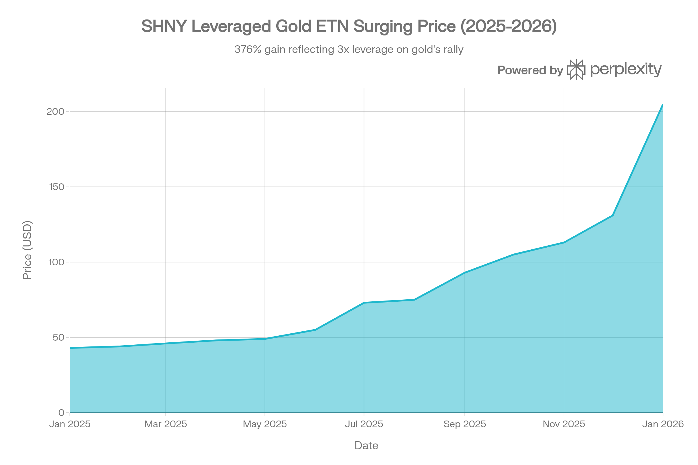
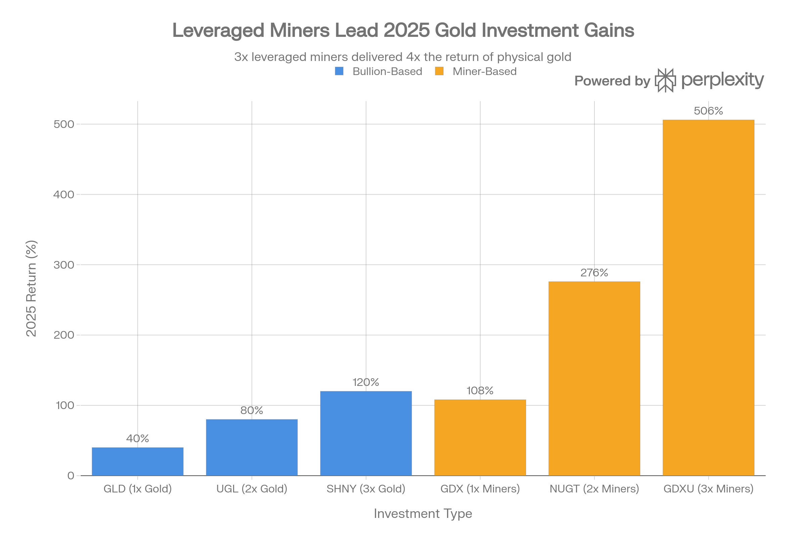
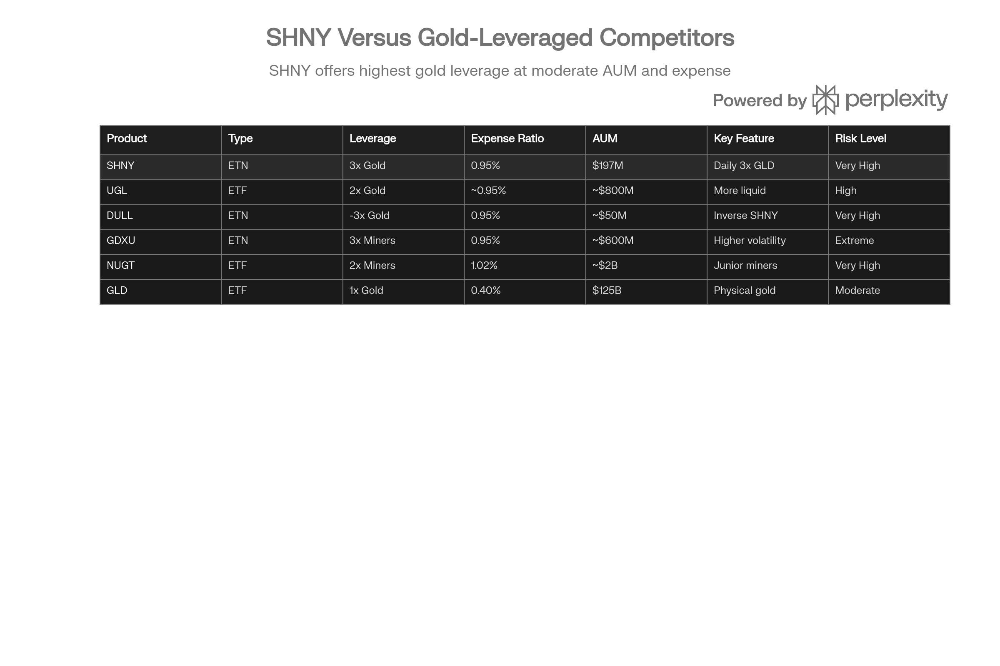

## 분류 근거

SHNY는 금 현물(GLD)의 일일 3배 레버리지를 추종하는 ETN으로, 기존 `ETF/Leveraged Inverse/Gold` 폴더(GDXU, GLL, NUGT)에 분류했습니다.

## 개요

MicroSectors™ Gold 3X Leveraged ETN (이하 SHNY)는 Bank of Montreal(BMO)가 발행한 교환거래형 채권(Exchange Traded Note)으로, SPDR Gold Shares ETF(GLD)의 일일 수익률에 3배 레버리지 노출을 제공하는 고위험 단기 거래 상품입니다. 2023년 2월 24일 설립된 SHNY는 2043년 1월 29일 만기로 20년의 투자 기간을 제공하지만, 설계상 장기 보유가 아닌 단일 거래일 내 전술적 거래를 위해 최적화되어 있습니다.[^1][^2][^3][^4][^5][^6]

2025년 금 가격이 역사적 강세장을 기록하면서 SHNY는 약 377%의 폭발적 수익률을 달성했으며, 이는 금 현물 가격 86% 상승의 3배 이상을 증폭시킨 결과입니다. 2026년 1월 27일 현재 약 \$204.88에 거래되고 있으며, 52주 최저가 \$43.68에서 최고가 \$211.50까지 무려 384%의 변동폭을 기록했습니다.[^7][^8][^9][^10][^11]

SHNY는 정교한 투자자와 적극적인 단기 트레이더를 위해 설계된 상품으로, 일반 투자자나 장기 투자 목적으로는 적합하지 않습니다. ETN 구조로 인한 발행사 신용 위험, 일일 리셋으로 인한 복리 효과, 그리고 높은 변동성이 주요 특징입니다.[^4][^5][^6]

SHNY는 2025년 1월 약 \$43에서 2026년 1월 \$205로 약 377% 상승하며, 금 가격 86% 상승의 3배 레버리지 효과를 극적으로 보여줍니다.

## ETN 구조의 이해

### ETF vs ETN: 핵심 차이점

SHNY를 이해하기 위해서는 먼저 ETN과 ETF의 근본적인 차이를 파악해야 합니다. 이 차이는 투자 결정에 중대한 영향을 미칩니다.

**소유권 및 구조:**

ETF(Exchange Traded Fund)는 펀드가 실제로 기초 자산을 보유하며, 투자자는 펀드의 지분을 소유합니다. 예를 들어 GLD ETF는 실제 금괴를 런던과 뉴욕의 금고에 보관하며, 투자자는 이러한 금괴에 대한 간접적 청구권을 갖습니다. ETF 발행사가 파산하더라도 펀드의 자산은 별도로 보관되어 있어 투자자는 보호받습니다.[^12][^13]

반면 ETN(Exchange Traded Note)은 발행 은행의 무담보 채무 증서(unsecured debt obligation)입니다. SHNY의 경우 Bank of Montreal이 투자자에게 GLD의 일일 수익률 3배를 지급하겠다는 약속일 뿐, SHNY는 어떠한 금이나 GLD 주식도 직접 보유하지 않습니다. 이는 ETN이 본질적으로 발행 은행의 신용에 의존하는 채권과 유사함을 의미합니다.[^2][^13][^14][^12]

**신용/거래상대방 위험:**

ETN 투자의 가장 중요한 리스크는 발행사 신용 위험입니다. Bank of Montreal이 파산하거나 채무불이행 상태에 빠지면, SHNY 투자자들은 전체 투자금을 잃을 수 있습니다. 이는 ETF와의 가장 큰 차이점입니다. ETF의 경우 최악의 시장 상황에서도 기초 자산의 가치가 0이 되지 않는 한 완전한 손실은 발생하지 않지만, ETN은 시장 상황과 무관하게 발행사 파산만으로도 투자금 전액 손실이 가능합니다.[^13][^14][^15][^16][^12]

**Bank of Montreal 신용도:**

다행히 BMO는 캐나다 3위, 미국 자산 기준 10위권 은행으로 견고한 신용등급을 유지하고 있습니다. Morningstar DBRS는 BMO에 AA 장기 발행사 등급과 R-1(high) 단기 등급을 부여했으며, 트렌드는 안정적(Stable)입니다. 내재 평가(Intrinsic Assessment)는 AA(low)이며, 캐나다 정부(AAA 등급)로부터 시기적절한 시스템적 지원이 예상된다는 SA2 지원 평가를 받았습니다.[^17][^18]

2025년 7월 기준 BMO의 채무불이행 확률은 0.180%로 낮은 수준이지만, 지난 3개월간 신용 스프레드가 22.9%, 12개월간 34.2% 확대되어 일부 신용 여건 악화 신호가 관찰됩니다. 그러나 전반적으로 BMO는 투자등급 신용 품질을 유지하고 있으며, ETN 투자자에게 상대적으로 낮은 거래상대방 위험을 제공합니다.[^19][^18]

**ETN의 장점:**

신용 위험이라는 중대한 단점에도 불구하고, ETN은 다음과 같은 장점을 제공합니다:

1. **추적 오차 제거:** ETF는 기초 지수를 물리적으로 복제하려 하면서 발생하는 추적 오차(tracking error)가 있습니다. 반면 ETN은 만기 시 정확한 지수 수익률(비용 차감 후)을 지급하겠다는 약속이므로 이론적으로 추적 오차가 없습니다.[^14][^12]
2. **세금 효율성:** ETN은 보유 기간 중 배당이나 분배금을 지급하지 않아 매년 과세 사건이 발생하지 않습니다. 투자자는 ETN을 매각하거나 만기 상환 시에만 자본 이득세를 부담하므로, 세금 이연 효과를 얻을 수 있습니다.[^16][^20][^14]
3. **세금 처리 방식:** 물리적 금 ETF(GLD, IAU, SGOL)는 미국 국세청(IRS)이 수집품(collectibles)으로 분류하여 장기 자본이득세 최대 28%를 부과하지만, ETN은 일반적으로 표준 자본 이득 세율(장기 0-20%, 단기 10-37%)이 적용됩니다. 다만 레버리지 ETN의 세금 처리는 불확실한 측면이 있어 세무 전문가와 상담이 필수적입니다.[^21][^22][^20]

**ETN의 단점:**

1. **완전한 거래상대방 위험:** 발행사 채무불이행 시 투자금 전액 손실 가능[^23][^12][^13]
2. **낮은 유동성:** 대부분의 ETN은 동등한 ETF보다 거래량이 적습니다[^14]
3. **투자자 보호 부족:** ETF는 투자자 이익을 대변하는 이사회가 있지만, ETN은 발행사가 목론견서에 명시된 규칙에 따라 단독으로 결정합니다[^24]
4. **이해상충 가능성:** 발행사가 ETN 투자자의 이익에 반하는 자기 매매나 헤지 활동을 수행할 수 있습니다[^24]

## 레버리지 메커니즘 및 일일 리셋

### 3배 레버리지의 작동 원리

SHNY는 GLD의 **일일** 수익률에 3배 노출을 제공합니다. 이는 매우 중요한 특징으로, 다음과 같이 작동합니다:[^1][^2][^3]

- GLD가 특정 거래일에 1% 상승하면, SHNY는 이론적으로 3% 상승합니다(수수료 차감 전)
- GLD가 특정 거래일에 1% 하락하면, SHNY는 이론적으로 3% 하락합니다

이러한 레버리지는 파생상품(선물 계약, 스왑 계약)을 통해 구현되며, **매일 종가 기준으로 리셋**됩니다. 이 일일 리셋 메커니즘이 SHNY의 수익률 특성을 결정하는 가장 중요한 요소입니다.[^4][^5]

### 복리 효과의 양날의 검

일일 리셋으로 인해 발생하는 복리 효과(compounding effect)는 레버리지 상품의 가장 복잡하고 오해받기 쉬운 측면입니다.[^25][^26][^27][^28]

**긍정적 복리 효과 (강한 트렌드 시장):**

금 가격이 지속적으로 상승하는 강한 상승 추세에서는 일일 복리 효과가 투자자에게 유리하게 작용합니다. 2025년이 완벽한 사례입니다. 금 가격이 86% 상승했을 때, 단순히 86% × 3 = 258%의 수익률이 아닌 약 377%의 수익률을 기록했습니다. 이는 매일 더 큰 베이스에서 3배 레버리지가 적용되는 복리 효과 덕분입니다.[^9][^10][^11]

**부정적 복리 효과 (변동성 높은 횡보장):**

반대로 금 가격이 큰 변동성을 보이면서 방향성 없이 횡보하는 시장에서는 복리 효과가 투자자에게 불리하게 작용합니다. 이를 "변동성 감쇠(volatility decay)" 또는 "시간 감쇠(time decay)"라고 합니다.[^29][^25]

**구체적 예시:**

기초 자산이 첫날 10% 하락, 둘째 날 10% 상승하는 경우를 생각해봅시다:[^30]

- 기초 자산: 100 → 90 (-10%) → 99 (-1% 최종)
- 3배 레버리지 ETN: 100 → 70 (-30%) → 91 (-9% 최종)

기초 자산은 1% 손실에 그쳤지만, 3배 레버리지 상품은 9%의 손실을 기록합니다. 이러한 효과는 변동성이 클수록, 보유 기간이 길수록 누적됩니다.[^31][^25][^30]

학술 연구에 따르면 "레버리지 ETF는 변동성이 크고 평균 회귀적인 시장에서 일일 리밸런싱 비용과 불규칙한 가격 움직임으로 인해 기대되는 초과 성과를 제공하지 못할 수 있습니다". VIX가 20 이상일 때 감쇠가 가속화되는 경향이 있습니다.[^30]

**장기 보유의 위험:**

SHNY의 목론견서와 발행사는 명확히 밝히고 있습니다: "ETN은 하루 이상의 기간 동안 기초 ETF의 누적 수익률을 제공할 것으로 기대되어서는 안 됩니다". "레버리지 ETN은 단일 거래일 목표를 달성하도록 설계되었습니다".[^4][^5][^6]

장기 보유 시 예상치 못한 결과가 발생할 수 있습니다. 예를 들어 금 가격이 1년 동안 원점으로 돌아왔지만 그 과정에서 큰 변동성을 보였다면, SHNY는 상당한 손실을 기록할 수 있습니다. 이는 레버리지 상품의 결함이 아니라 일일 리셋 설계의 수학적 귀결입니다.[^28][^25][^29]

## 비용 구조

SHNY의 총 비용은 여러 구성요소로 이루어져 있습니다:[^4]

**비용 구성:**

1. **일일 투자자 수수료(Daily Investor Fee):** 연 0.95% (일일로 계산)[^7][^32][^33][^4]
2. **일일 파이낸싱 비율(Daily Financing Rate):** 초기 2.75%, 최대 5%까지 인상 가능[^4]
3. **스프레드(Spread):** 초기 2%, 최대 4%까지 인상 가능[^4]

0.95%의 표면적 비용비율은 비레버리지 금 ETF(SGOL 0.17%, GLD 0.40%)보다 높지만, 3배 레버리지를 제공한다는 점을 고려하면 상대적으로 합리적입니다. 동일한 레버리지를 제공하는 경쟁 상품인 GDXU(금 광산주 3배)도 0.95%의 동일한 비용비율을 부과합니다.[^33][^34][^35][^7]

**장기 보유 시 비용 누적:**

OneGold의 분석에 따르면, 초기 \$10,000 투자에 매년 \$5,000씩 추가하며 연 8% 수익률을 가정할 때, 20년 후 SHNY의 누적 수수료는 \$30,259에 달합니다. 이는 OneGold의 물리적 금 보관 서비스(0.12% 수수료) 대비 \$26,216 더 높은 금액입니다. 그러나 SHNY는 장기 보유 상품이 아니므로 이러한 장기 비용 비교는 실질적 의미가 제한적입니다.[^33]

## 성과 분석

### 2025-2026년 폭발적 수익률

SHNY는 2025년 금 강세장에서 탁월한 성과를 기록했습니다. 2025년 1월 약 \$43에서 시작하여 2026년 1월 27일 \$204.88로 마감하며, 약 377%의 수익률을 달성했습니다.[^7][^8][^10][^11]

2025년 금 관련 투자상품 수익률 비교: SHNY는 120% 수익으로 물리적 금의 3배 레버리지를 제공했으며, 광산주 레버리지 ETF는 더 높은 수익과 위험을 보였습니다.

**기간별 성과 비교:**

| 상품 | 2025년 수익률 | 레버리지 | 특징 |
| :-- | :-- | :-- | :-- |
| GLD (물리적 금) | +40% | 1x | 기준선 |
| UGL (2배 금) | +80% | 2x | 이론치 대비 일치 |
| SHNY (3배 금) | +120% | 3x | 이론치 대비 일치 |
| GDX (광산주) | +108% | 1x | 운영 레버리지 |
| NUGT (2배 광산주) | +276% | 2x | 높은 변동성 |
| GDXU (3배 광산주) | +506% | 3x | 극단적 변동성 |

출처:[^34][^9]

> **수치 안내**: 위 표의 GLD/NUGT/GDXU 수익률은 원출처가 제시한 참고 수치다. 각 상품의 자체 포스트는 2025년 성과를 다르게 보고한다 — [GLD](/blog/etf/gold/gld/gld-spdr-gold-shares)는 +63.68%, [NUGT](/blog/etf/leveraged-inverse/gold/nugt/nugt-direxion-daily-gold-miners-index-bull-2x-shares)는 +112.93%, [GDXU](/blog/etf/leveraged-inverse/gold/gdxu/gdxu-microsectors-gold-miners-3x-leveraged-etn)는 약 +175%. 집계 시점·산출 방식 차이로 보이며, 각 상품의 정확한 수익률은 해당 자체 포스트를 참고하는 것이 좋다.

2025년은 강한 상승 트렌드가 지속되어 레버리지 상품에 이상적인 환경이었습니다. SHNY의 120% 수익률은 40% × 3 = 120%로 이론적 기대치와 정확히 일치하며, 이는 복리 효과가 긍정적으로 작용했음을 보여줍니다.[^9]

### 변동성 및 리스크 지표

SHNY의 고수익은 높은 변동성과 함께 왔습니다:[^34][^3]

**리스크 메트릭 (12개월 기준):**

- **표준편차:** 49.0% (연환산)[^3]
- **변동성:** 11.53% - 20.19% (12개월 롤링)[^34]
- **최대 낙폭(Max Drawdown):** -37.84%[^3][^34]
- **샤프 비율:** 1.53 - 2.04[^34][^3]
- **칼마 비율:** 2.30[^3]

SHNY의 최대 낙폭 -37.84%는 3배 광산주 레버리지인 GDXU의 -94.39%보다 훨씬 낮아, 물리적 금괴 기반 레버리지가 광산주 레버리지보다 안정적임을 보여줍니다. 그러나 샤프 비율 2.04는 GDXU의 0.71보다 훨씬 높아, 위험 조정 수익률 측면에서 SHNY가 더 효율적이었음을 나타냅니다.[^34]

### NAV 프리미엄/디스카운트

SHNY는 일반적으로 순자산가치(NAV) 대비 -0.1%에서 +0.12% 범위에서 거래되어 공정 가치에 매우 근접합니다. 2026년 1월 23일 기준 지시적 채권 가치(Closing Indicative Note Value)는 \$172.39였으며, 시장 가격은 이와 밀접하게 연동되어 거래되었습니다. 이는 ETN의 창출/환매 메커니즘이 효과적으로 작동하고 있음을 의미합니다.[^2][^32]

## 유동성 및 거래 특성

### 거래량 분석

SHNY의 유동성은 중소 규모 ETN으로서 적절한 수준이지만, 대형 ETF에는 미치지 못합니다:

**유동성 지표:**

- **30일 평균 일일 거래량:** 약 132,070 주[^8][^36]
- **65일 평균 일일 거래량:** 약 108,218 주[^36]
- **정규 거래 시간 명목 거래액:** 약 \$21.2M (최근 기준)[^37]
- **발행 주식 수:** 1,000,000 ETN[^2][^32]

2026년 1월 27일 거래량은 178,400주로 일평균 대비 35% 높았으며, 금 가격 변동성이 큰 날에는 거래가 활발해지는 경향을 보입니다.[^8][^37]

**매수-매도 스프레드:**

SHNY의 매수-매도 스프레드는 GLD나 UGL 같은 대형 상품보다 넓습니다. 이는 유동성이 낮기 때문이며, 트레이더들은 시장가 주문(market order)보다는 지정가 주문(limit order)을 사용하여 실행 가격을 관리해야 합니다. 특히 장 개시/마감 시간대나 시장 변동성이 큰 시기에는 스프레드가 더 확대될 수 있습니다.[^36]

### 기관 투자자 보유 현황

SHNY의 기관 투자자 보유는 매우 제한적입니다. 2025년 11월 기준 단 2개 기관 투자자가 총 7,625주(약 \$795,000 상당)를 보유하고 있으며, 이는 전 분기 대비 84.78% 감소한 수치입니다. 주요 보유자로는 Advisor Group Holdings와 Jane Street Group이 있으며, 이는 SHNY가 주로 개인 트레이더들에 의해 거래되는 상품임을 시사합니다.[^38]

기관 투자자의 낮은 보유 비율은 여러 요인에 기인합니다:

1. 단기 거래 도구로 설계되어 기관의 장기 포트폴리오에 부적합
2. 일일 모니터링이 필요한 높은 유지 관리 요구사항
3. ETN 구조로 인한 신용 위험
4. 상대적으로 작은 AUM과 유동성

## 경쟁 환경

### 레버리지 금 투자 스펙트럼

SHNY는 레버리지 금 투자 상품 스펙트럼에서 독특한 위치를 차지합니다:

SHNY는 3배 레버리지 금 ETN으로, 물리적 금(GLD)과 극단적 레버리지 광산주(GDXU) 사이의 포지션을 차지하며 단기 거래자를 위한 높은 위험-수익 프로파일을 제공합니다.

**물리적 금괴 기반:**

1. **GLD (1배):** 업계 표준, \$159B AUM([GLD 자체 포스트](/blog/etf/gold/gld/gld-spdr-gold-shares) 기준), 가장 높은 유동성, 0.40% 비용[^39][^40]
2. **UGL (2배):** 더 큰 AUM(\~\$1.4B, [UGL 자체 포스트](/blog/etf/leveraged-inverse/gold/ugl/ugl-proshares-ultra-gold) 기준), ETF 구조로 신용 위험 없음, 2배 레버리지[^41][^9]
3. **SHNY (3배):** ETN 구조, \$197M AUM, 3배 레버리지, BMO 신용 위험[^8]
4. **DULL (-3배):** SHNY의 역상품, 금 가격 하락에 베팅, 동일한 0.95% 비용[^4][^5]

**금 광산주 기반:**

금 광산주 레버리지 상품은 훨씬 더 높은 변동성과 수익률을 제공하지만, 더 큰 리스크를 수반합니다:

1. **GDX (1배):** 대형 금 광산 기업, 2025년 +108%[^9]
2. **NUGT (2배):** 중소형 금 광산 기업, 2025년 +276%, 1.02% 비용[^35][^41][^9]
3. **GDXU (3배):** 금 광산 지수 3배, 2025년 +506%, 변동성 30.28% vs SHNY 20.19%[^34][^9]

광산주 레버리지 상품이 더 높은 수익률을 제공한 이유는 금 가격 상승 시 광산 기업의 운영 레버리지(고정 생산 비용으로 인한 이익 증폭) 때문입니다. 광산 기업들의 손익분기점 생산 비용은 온스당 약 \$1,200-1,400이며, 금 가격이 이를 크게 초과하면 이익 마진이 급증합니다.[^42][^9]

그러나 GDXU의 최대 낙폭 -94.39%는 SHNY의 -37.84%에 비해 2.5배 이상 크며, 이는 광산주 레버리지 상품의 극단적 위험을 보여줍니다. 투자자들은 높은 수익 잠재력과 파괴적 손실 가능성 사이에서 균형을 맞춰야 합니다.[^34]

### 전략적 포지셔닝

SHNY는 다음과 같은 투자자들에게 최적의 선택지입니다:

- **물리적 금 노출 원하면서 3배 레버리지를 추구하는 트레이더** (광산주의 기업 특유 리스크 회피)
- **단기(수일) 금 가격 상승에 베팅하려는 투자자**
- **ETN 구조와 BMO 신용 위험을 수용할 수 있는 정교한 투자자**

반대로 다음과 같은 투자자들은 대안을 고려해야 합니다:

- **더 높은 레버리지와 변동성 추구:** GDXU (3배 광산주)
- **신용 위험 회피:** UGL (2배 금 ETF)
- **중간 레버리지 선호:** NUGT (2배 광산주 ETF)
- **안정성 및 장기 보유:** GLD, SGOL (1배 물리적 금 ETF)

## 리스크 요인 및 관리

### 주요 리스크

**1. 발행사 신용 위험 (Issuer Credit Risk)**

SHNY의 가장 근본적인 리스크는 Bank of Montreal의 신용 위험입니다. BMO가 파산하면 금 가격과 무관하게 투자금 전액을 잃을 수 있습니다. 이는 2008년 금융위기 당시 Lehman Brothers가 발행한 ETN 투자자들이 경험한 실제 시나리오입니다.[^12][^13][^14][^15][^21]

현재 BMO는 AA 등급의 견고한 신용도를 유지하고 있지만, 시스템적 금융 위기나 예상치 못한 사건으로 신용 상태가 급격히 악화될 가능성을 완전히 배제할 수는 없습니다. 투자자는 이 "테일 리스크(tail risk)"를 항상 인지하고 있어야 합니다.[^17][^18]

**2. 변동성 감쇠 (Volatility Decay)**

일일 리셋과 복리 효과로 인해 변동성이 큰 횡보장에서는 SHNY의 가치가 지속적으로 감소할 수 있습니다. 이는 상품의 결함이 아니라 설계의 수학적 귀결이므로, 투자자는 이를 이해하고 트렌드가 명확한 시장에서만 거래해야 합니다.[^25][^26][^27][^28]

**3. 극단적 시장 움직임 (Extreme Market Moves)**

3배 레버리지로 인해 금 가격이 단일 거래일에 33.3% 이상 하락하면 이론적으로 SHNY는 전액 손실에 직면할 수 있습니다. 5배 레버리지 상품의 경우 20% 하락만으로도 전액 손실이 발생합니다. 금 시장에서 이러한 극단적 움직임은 드물지만, 2020년 3월 COVID-19 팬데믹 초기처럼 블랙스완 이벤트 시 발생 가능합니다.[^30]

**4. 유동성 위험 (Liquidity Risk)**

시장 스트레스 시기에는 SHNY의 매수-매도 스프레드가 크게 확대되거나 거래가 어려워질 수 있습니다. 투자자는 예상보다 나쁜 가격에 포지션을 청산해야 할 수 있으며, 이는 손실을 악화시킵니다.[^14][^30]

**5. 레버리지 조정 비용 (Rebalancing Costs)**

매일 레버리지 비율을 3배로 재조정하는 과정에서 거래 비용이 발생하며, 이는 장기 수익률을 잠식합니다. 변동성이 클수록 재조정 빈도와 비용이 증가합니다.[^25][^30]

### 리스크 관리 전략

전문 트레이더들은 다음과 같은 리스크 관리 기법을 권장합니다:

**포지션 크기 (Position Sizing):**

- 전체 포트폴리오의 2-5% 이하로 제한
- 전액 손실을 감당할 수 있는 금액만 투자
- 레버리지 상품은 "위성(satellite)" 포지션으로만 사용

**시간 관리 (Time Management):**

- 단일 거래일 또는 최대 수일 이내 보유[^5][^6]
- 명확한 이익 실현 목표 설정 (예: +15-20%)
- 엄격한 손절매 설정 (예: -10-15%)[^30]
- 매일 종가 후 포지션 검토

**시장 조건 평가 (Market Condition Assessment):**

- 강한 상승 트렌드 시에만 진입
- VIX > 20 또는 높은 시장 변동성 시 회피[^30]
- 금 가격이 주요 지지선/저항선 근처에서 횡보 시 회피
- 명확한 트렌드 전환 신호 발생 시 즉시 청산

**실행 관리 (Execution Management):**

- 시장가 주문 대신 지정가 주문 사용
- 정규 거래 시간 중 거래 (장 전후 시간대 회피)
- 매수-매도 스프레드가 0.5% 이하일 때만 거래
- 대량 거래 시 분할 주문 고려

**포트폴리오 통합 (Portfolio Integration):**

- SHNY를 단독 금 투자로 사용하지 말 것
- 핵심 포트폴리오에는 SGOL, GLD 같은 비레버리지 금 ETF 보유
- SHNY는 단기 전술적 기회에만 활용
- 전체 레버리지 노출 모니터링 (다른 레버리지 상품 포함)

## 세금 고려사항

### 일반 세금 처리

ETN의 세금 처리는 ETF보다 단순할 수 있지만, 레버리지 ETN의 경우 불확실성이 존재합니다.[^22]

**일반 원칙:**

- ETN은 보유 기간 중 배당이나 분배금을 지급하지 않아 연간 세금 부담 없음[^14][^16][^20]
- 매각 시 자본 이득/손실로 과세
- 보유 기간에 따라 장기(1년 이상) 또는 단기 자본 이득 구분
- 장기: 0-20% (소득 구간에 따라), 단기: 10-37% (일반 소득세율)

**물리적 금 ETF 대비 장점:**

물리적 금 ETF(GLD, IAU, SGOL)는 IRS가 수집품으로 분류하여 장기 자본이득세 최대 28%를 부과합니다. 반면 ETN은 일반적으로 표준 자본 이득 세율이 적용되어, 고소득자의 경우 최대 8%포인트 절세 효과를 얻을 수 있습니다.[^21][^20]

예를 들어 연소득이 높은 투자자가 \$50,000의 장기 자본 이득을 실현한 경우:

- 물리적 금 ETF: \$50,000 × 28% = \$14,000 세금
- ETN (표준 자본 이득): \$50,000 × 20% = \$10,000 세금
- 절감액: \$4,000

**불확실성 및 주의사항:**

BMO는 목론견서에 "레버리지 ETN의 세금 처리에 대한 중요한 측면들은 불확실합니다. 자신의 세무 자문가와 상담하십시오"라고 명시하고 있습니다. 이는 다음과 같은 이유 때문입니다:[^22]

1. 레버리지 ETN은 상대적으로 새로운 상품이며 IRS 지침이 명확하지 않음
2. ETN이 사용하는 파생상품(선물, 스왑)의 세금 처리가 복잡함
3. Section 1256 계약 vs 일반 자본 이득 처리 여부 불명확
4. 주 단위 세금 처리가 연방세와 다를 수 있음

SHNY를 거래하기 전에 반드시 세무 전문가와 상담하여 개인 상황에 맞는 세금 영향을 파악해야 합니다.

### 한국 투자자 세금 고려

한국 거주 투자자가 SHNY에 투자할 경우 다음과 같은 세금 이슈가 발생합니다:

**한국 세법상 처리:**

- 해외 상장 ETF/ETN 양도소득세: 연간 250만 원 기본공제 후 22% (지방세 포함)[^43]
- 양도차익 = 매각가 - 취득가 (환율 변동 반영)
- 연간 거래 내역을 다음해 5월 종합소득세 신고 시 신고
- 손실은 동일 연도 내 다른 해외 주식 양도차익과 상계 가능

**환율 고려:**

- 모든 거래는 원화로 환산하여 과세
- 환차익도 양도소득에 포함
- 금 가격 상승 + 원화 약세 = 이중 이익 증폭 (3배 레버리지 효과와 중첩)
- 금 가격 하락 + 원화 강세 = 이중 손실 증폭

**실행 권장사항:**

1. 모든 거래 내역을 정확히 기록 (날짜, 환율, 가격)
2. 분기별 양도차익/손실 모니터링
3. 연간 250만 원 기본공제 한도 고려한 실현 타이밍 조절
4. 손실 발생 시 동일 과세 연도 내 실현하여 다른 이익과 상계

## 투자자 적합성 및 활용 전략

### 적합한 투자자 프로파일

SHNY는 다음 조건을 **모두** 충족하는 투자자에게만 적합합니다:[^4][^5][^6]

**필수 조건:**

1. **정교한 투자 지식:** 레버리지 상품, ETN 구조, 파생상품에 대한 깊은 이해
2. **적극적 모니터링 능력:** 매일 (또는 장중) 포지션 검토 가능
3. **높은 리스크 허용도:** 단기간 50% 이상 손실 감내 가능
4. **단기 거래 성향:** 장기 투자가 아닌 일 단위 전술적 거래
5. **충분한 자본:** SHNY가 전체 포트폴리오의 극히 일부여야 함

**이상적 투자자 유형:**

- 전문 데이 트레이더
- 적극적 스윙 트레이더 (수일 보유)
- 금 시장 전문가
- 헤지 펀드 포트폴리오 매니저 (단기 전술적 포지션)

### 부적합한 투자자

SHNY는 다음 투자자들에게 **절대 부적합**합니다:

- 초보 투자자 또는 투자 경험이 제한적인 투자자
- 장기 투자 목적 (은퇴 자금, 교육 자금 등)
- 일상적 모니터링이 불가능한 직장인
- 손실을 감내하기 어려운 위험 회피적 투자자
- 레버리지 상품의 메커니즘을 완전히 이해하지 못한 투자자

### 실전 활용 전략

**전략 1: 단기 모멘텀 거래**

금 가격이 주요 기술적 지지선을 돌파하거나, 연준 금리 결정 같은 촉매(catalyst)로 강한 상승 모멘텀이 예상될 때 활용합니다.

**진입 조건:**

- 금 가격이 50일 또는 200일 이동평균선을 상향 돌파
- RSI < 70 (과매수 구간 진입 전)
- 거래량 증가 동반
- 명확한 상승 촉매 존재 (경제 지표, 지정학적 위기 등)

**청산 조건:**

- 목표 수익률 달성 (+15-20%)
- 손절매 수준 도달 (-10-15%)
- 금 가격이 주요 저항선에서 반등 실패
- 보유 후 3-5 거래일 경과

**전략 2: 이벤트 기반 거래**

FOMC 회의, 비농업 고용지표 발표, 지정학적 위기 등 금 가격에 중대한 영향을 미치는 이벤트 전후로 단기 포지션을 취합니다.

**실행 방법:**

- 이벤트 1-2일 전 진입 (예상 방향에 베팅)
- 이벤트 발표 직후 실시간 모니터링
- 예상대로 전개되면 당일 또는 익일 청산
- 예상과 다르면 즉시 손절

**주의사항:**

- 이벤트 기반 거래는 극도로 높은 리스크
- 예상 밖의 결과 시 급격한 손실 가능
- 포지션 크기를 매우 작게 유지 (포트폴리오의 1-2%)

**전략 3: 헤지 포지션**

기존 금 롱 포지션(GLD, SGOL 등)에 대한 단기 헤지로 SHNY의 역상품인 DULL을 활용하거나, 금 가격 하락이 예상될 때 SHNY 포지션을 청산합니다.

**적용 시나리오:**

- 단기적 금 가격 조정 예상되지만 장기 롱 포지션 유지하고 싶을 때
- 포트폴리오 리밸런싱 시기까지 임시 헤지 필요할 때
- 시장 변동성 급증 시 다운사이드 보호

**전략 4: 트렌드 추종 (고급)**

200일 이동평균선 같은 트렌드 지표를 활용한 시스템적 접근입니다.[^31]

**규칙:**

- 금 가격이 200일 이동평균선 위에 있을 때만 SHNY 보유
- 200일 이동평균선 아래로 하락 시 전량 청산 및 현금 보유
- 재진입은 200일 이동평균선 상향 돌파 시

Reddit의 레버리지 ETF 연구에 따르면 "200일 단순이동평균 레버리지 회전 전략(200-Day SMA LRS)"이 레버리지 ETF를 활용하는 가장 효과적인 접근법입니다. 이는 지속적인 하락장과 급격한 폭락을 피하는 데 중점을 둡니다.[^31]

## 2026년 전망 및 전략적 고려사항

### 금 시장 전망

2026년 금 시장은 2025년의 강력한 모멘텀을 이어갈 가능성이 있지만, 변동성도 증가할 것으로 예상됩니다. 주요 투자은행들의 전망은 다음과 같습니다:

- **Goldman Sachs:** \$5,400/oz (2026년 말)[^44][^45]
- **JPMorgan:** \$5,055/oz (2026년 4분기)[^46]
- **TD Securities:** \$4,831/oz (연평균), 일시적으로 \$5,400 도달 가능[^47]

이러한 전망이 실현된다면 금 가격은 2026년 1월 27일 현재가(\$5,090) 대비 6-10% 추가 상승 여력이 있습니다. SHNY의 3배 레버리지를 고려하면 18-30%의 추가 수익 가능성이 있지만, 반대로 조정 시에는 동일한 비율로 손실이 발생합니다.

### 레버리지 활용 시나리오

**강세 시나리오 (확률 40-50%):**
금 가격이 \$5,400 이상으로 상승하며 강한 트렌드 유지

**SHNY 전략:**

- 금 가격 조정 시 (5-10% 하락) 분할 진입
- 단기 트레이딩으로 변동성 활용
- 목표가 달성 시 일부 이익 실현
- 최대 포지션 크기: 포트폴리오의 3-5%

**중립 시나리오 (확률 30-40%):**
금 가격이 \$4,500-5,200 범위에서 횡보하며 높은 변동성

**SHNY 전략:**

- 극도로 신중한 접근
- 변동성 감쇠 리스크로 장기 보유 회피
- 명확한 단기 트렌드 발생 시에만 진입
- 포지션 크기 축소: 포트폴리오의 1-2%
- SHNY보다는 비레버리지 GLD/SGOL 선호

**약세 시나리오 (확률 10-20%):**
금 가격이 \$4,000 이하로 하락하며 하락 트렌드 진입

**SHNY 전략:**

- SHNY 완전 회피 (롱 포지션)
- 역상품 DULL 단기 활용 고려
- 비레버리지 금 ETF로 저점 매수 기회 탐색
- SHNY는 바닥 형성 후 상승 전환 확인 후에만 재진입

### 2026년 특수 고려사항

**지정학적 불확실성:**
미중 긴장, 중동 정세, 우크라이나 전쟁 등 지정학적 위험이 지속되면 금에 대한 안전자산 수요가 유지될 것입니다. SHNY는 이러한 리스크-온(risk-on) 환경에서 단기 급등 기회를 포착하는 도구로 활용할 수 있습니다.[^48][^49]

**연준 금리 정책:**
연준의 금리 인하 지속 여부가 금 가격의 핵심 변수입니다. 금리 인하는 무수익 자산인 금의 매력을 높이지만, 경제 성장 가속화로 금리 인상 전환 시 금 가격에 부정적입니다. SHNY 트레이더들은 FOMC 회의 결과에 극도로 민감하게 반응해야 합니다.[^46][^48]

**ETF 자금 흐름:**
2025년 강력한 ETF 유입이 2026년에도 지속될지 주목해야 합니다. 유입 지속 시 금 가격 지지 요인이지만, 유출 전환 시 급격한 조정 가능성이 있습니다.[^50][^51]

## 결론 및 투자 권고

### 종합 평가

SHNY (MicroSectors™ Gold 3X Leveraged ETN)는 금 현물 가격에 대한 극단적으로 증폭된 단기 노출을 제공하는 고위험, 고수익 거래 도구입니다. 2025년의 377% 수익률은 강한 상승 트렌드 시장에서 레버리지 상품이 제공할 수 있는 폭발적 수익 잠재력을 극적으로 보여주었습니다.[^9][^10][^11]

그러나 이러한 수익은 극도의 변동성, 발행사 신용 위험, 변동성 감쇠, 그리고 자본 전액 손실 가능성이라는 중대한 리스크와 함께 옵니다. SHNY는 정교한 투자자를 위한 전문 거래 도구이며, 일반 투자자나 장기 투자 목적으로는 절대 적합하지 않습니다.

**핵심 평가:**

✅ **강점:**

- 금 가격 상승에 대한 최대 레버리지 노출 (3배)
- 비용 효율적 레버리지 구현 (직접 선물 거래 대비)
- 추적 오차 제거 (ETN 구조)
- 세금 효율성 (보유 기간 중 과세 사건 없음, 수집품 세율 회피 가능)
- 견고한 발행사 (BMO, AA 등급)

⚠️ **약점:**

- 발행사 신용 위험 (파산 시 전액 손실 가능)
- 변동성 감쇠 (횡보장에서 가치 지속 하락)
- 일일 리셋 메커니즘 (장기 보유 부적합)
- 제한적 유동성 (대형 ETF 대비)
- 극도로 높은 변동성 (최대 낙폭 -37.84%)

### 투자 적합성 매트릭스

| 투자자 유형 | 적합성 | 권장 대안 |
| :-- | :-- | :-- |
| 전문 데이 트레이더 | ✅ 적합 | - |
| 적극적 스윙 트레이더 | ⚠️ 신중히 고려 | UGL (2배) |
| 일반 개인 투자자 | ❌ 부적합 | SGOL, GLD |
| 장기 투자자 | ❌ 부적합 | SGOL, IAU |
| 은퇴 계좌 | ❌ 절대 부적합 | SGOL, GLD |
| 초보 투자자 | ❌ 절대 부적합 | GLD 또는 금 학습 |

### 실행 권고사항

SHNY 투자를 고려하는 투자자들을 위한 단계별 가이드:

**1단계: 자격 평가 (투자 전)**

- [ ] 레버리지 상품에 대한 충분한 이해 확보
- [ ] ETN 구조와 신용 위험 인지
- [ ] 일일 모니터링 가능 여부 확인
- [ ] 전액 손실 감내 가능한 자금 확보
- [ ] 세무 자문가와 세금 영향 상담 완료

**2단계: 시장 분석 (진입 전)**

- [ ] 금 가격 트렌드 분석 (상승 트렌드 확인 필수)
- [ ] VIX 및 시장 변동성 확인 (VIX < 20 선호)
- [ ] 주요 경제 이벤트 캘린더 검토
- [ ] 기술적 지지선/저항선 식별
- [ ] 진입/청산 계획 수립

**3단계: 진입 실행**

- [ ] 정규 거래 시간 중 거래
- [ ] 지정가 주문 사용 (매수-매도 스프레드 확인)
- [ ] 소량 테스트 거래로 시작
- [ ] 최대 포지션 크기 준수 (포트폴리오의 2-5%)
- [ ] 즉시 손절매 주문 설정

**4단계: 보유 기간 관리**

- [ ] 매일 종가 후 포지션 검토
- [ ] 금 가격 및 GLD 움직임 모니터링
- [ ] 손익 상황 추적
- [ ] 트렌드 전환 신호 감시
- [ ] 목표 수익률 또는 손절 수준 접근 시 청산 준비

**5단계: 청산 및 평가**

- [ ] 목표 달성 또는 손절 수준 도달 시 즉시 청산
- [ ] 최대 보유 기간(3-5일) 경과 시 자동 청산
- [ ] 거래 내역 기록 (세금 신고용)
- [ ] 거래 복기 및 교훈 도출
- [ ] 다음 기회까지 현금 보유

### 한국 투자자를 위한 특별 권고

**접근성:**
한국 투자자들은 Interactive Brokers, Charles Schwab 등 국제 증권사를 통해 SHNY에 접근할 수 있습니다. 일부 국내 증권사의 해외주식 거래 서비스도 이용 가능합니다.

**포지션 크기:**
한국 투자자는 환율 변동성이 추가되므로 포지션 크기를 더욱 보수적으로 관리해야 합니다:

- 일반 권장: 포트폴리오의 2-5%
- 한국 투자자: 포트폴리오의 1-3% (환율 리스크 고려)

**세금 최적화:**

- 연간 250만 원 기본공제를 효율적으로 활용
- 손실 발생 시 동일 과세연도 내 실현하여 다른 해외주식 이익과 상계
- 12월 말 접근 시 실현 타이밍 신중히 결정

**실무 팁:**

- 한국 시간 기준 밤 11:30 PM - 새벽 6:00 AM이 미국 정규 거래 시간
- 실시간 모니터링이 어려우므로 더욱 엄격한 손절매 설정 필수
- 모바일 앱 알림 기능 활용하여 주요 가격대 도달 시 통지 받기

### 최종 의견

SHNY는 양날의 검입니다. 2025년처럼 금이 강한 상승 트렌드를 보이는 환경에서는 폭발적 수익을 제공할 수 있지만, 변동성 높은 횡보장이나 하락장에서는 빠르게 자본을 잠식합니다. 성공적인 SHNY 거래는 시장 타이밍, 엄격한 리스크 관리, 그리고 감정 통제가 결합되어야 가능합니다.

대부분의 투자자들에게 SGOL이나 GLD 같은 비레버리지 금 ETF가 더 적절한 선택입니다. SHNY는 다음 조건을 **모두** 충족하는 경우에만 고려해야 합니다:

1. 레버리지 상품에 대한 깊은 이해
2. 적극적 단기 트레이딩 능력
3. 일일 모니터링 가능
4. 높은 리스크 허용도
5. 전액 손실 감내 가능한 자금

이러한 조건을 충족한다면, SHNY는 금 가격 상승에 대한 전술적 베팅을 위한 강력한 도구가 될 수 있습니다. 그러나 절대 "투자"가 아닌 "거래" 도구로 접근해야 하며, 포트폴리오의 핵심이 아닌 위성 포지션으로만 활용해야 합니다.

***

**면책조항:** 본 보고서는 정보 제공 목적으로 작성되었으며 투자 권유를 구성하지 않습니다. SHNY는 극도로 높은 리스크를 수반하는 레버리지 상품으로, 정교한 투자자만을 위해 설계되었습니다. 모든 투자 결정은 개인의 재무 상황, 투자 목표, 리스크 허용도를 고려하여 이루어져야 하며, 레버리지 상품 거래 전에는 반드시 전문 재무 자문가 및 세무 자문가와 상담하시기 바랍니다. 과거 성과는 미래 수익을 보장하지 않으며, 레버리지 상품은 투자 원금 전액 손실 가능성이 있습니다.

[^1]: https://microsectors.com/gold/

[^2]: https://www.bmoetns.com/ETN/SHNY.P/

[^3]: https://www.composer.trade/etf/SHNY

[^4]: https://www.bmoetns.com/Documents/SHNY/Fact_Sheet.pdf

[^5]: https://microsectors.com/insights/trade-gold-with-3-times-leverage/

[^6]: https://microsectors.com/products/shny/

[^7]: https://kr.investing.com/etfs/shny

[^8]: https://robinhood.com/us/en/stocks/SHNY/

[^9]: https://economistwritingeveryday.com/2025/09/16/leveraged-bullion-and-mining-funds-to-cash-in-on-the-gold-bonanza/

[^10]: https://ng.investing.com/etfs/shny-historical-data

[^11]: https://www.perplexity.ai/finance/SHNY/history

[^12]: https://www.investopedia.com/financial-edge/0213/etf-or-etn-whats-the-difference.aspx

[^13]: https://curvo.eu/article/etn-vs-etf-differences

[^14]: https://www.pyrrhacapital.com/blogs/etf-vs-etn-vs-etp

[^15]: https://www.hl.co.uk/shares/exchange-traded-funds-etfs/what-are-exchange-traded-products/what-is-an-etn

[^16]: https://www.optimizedportfolio.com/etf-vs-etn/

[^17]: https://dbrs.morningstar.com/research/437753/bank-of-montreal-credit-rating-report

[^18]: https://dbrs.morningstar.com/research/454695/morningstar-dbrs-confirms-bank-of-montreals-long-term-issuer-rating-at-aa-stable-trend

[^19]: https://martini.ai/pages/research/Bmo Bank of Montreal-a841714d664df813eafc728991b590fa

[^20]: https://www.fidelity.com/learning-center/investment-products/etf/special-rules-commodity-etfs

[^21]: https://www.reddit.com/r/LETFs/comments/1p5qr8a/a_guide_to_implementing_a_3x_leveraged_portfolio/

[^22]: https://www.bmoetns.com/ETN/GDXU.P/

[^23]: https://www.amundietf.dk/pdfDocuments/fundamentals_en_article-3_the-exchange-traded-product-family-1.pdf

[^24]: https://www.schwab.com/learn/story/exchange-traded-notes-facts-and-risks

[^25]: https://graniteshares.com/institutional/us/en-us/research/understanding-the-decay-risk-in-leveraged-etfs/

[^26]: https://www.cheddarflow.com/blog/gold-leveraged-etf-complete-guide-to-long-and-short-gold-etfs/

[^27]: https://www.sec.gov/Archives/edgar/data/927971/000121465923002804/r215231424b2.htm

[^28]: https://seekingalpha.com/article/127744-what-happens-when-you-hold-leveraged-etfs-for-more-than-one-day

[^29]: https://www.ii.co.uk/analysis-commentary/risks-holding-leveraged-etfs-more-one-day-ii513155

[^30]: https://www.investing.com/analysis/the-5x-leveraged-etf-trap-why-a-20-drop-means-you-lose-everything-200668931

[^31]: https://www.reddit.com/r/LETFs/comments/1gxvxwz/leverage_decay_is_not_as_bad_as_they_make_it_out/

[^32]: https://www.tradingview.com/symbols/AMEX-SHNY/

[^33]: https://www.onegold.com/etfs/shny

[^34]: https://portfolioslab.com/tools/stock-comparison/SHNY/GDXU

[^35]: https://www.investing.com/analysis/3-highrisk-highreward-gold-etfs-you-may-be-missing-200661615

[^36]: https://www.nasdaq.com/market-activity/etf/shny

[^37]: https://marketchameleon.com/Overview/SHNY/Stock-Price-Action/

[^38]: https://fintel.io/so/us/shny

[^39]: https://ycharts.com/companies/SGOL/total_assets_under_management

[^40]: https://finance.yahoo.com/news/zacks-analyst-blog-highlights-gld-124900750.html

[^41]: https://www.investopedia.com/articles/markets/071116/4-most-traded-2x-and-3x-gold-etfs-dust-nugt.asp

[^42]: https://www.vaneck.com.au/blog/gold/2026-golden-year-more-leverage-ahead/

[^43]: https://www.mk.co.kr/en/economy/11013457

[^44]: https://www.reuters.com/business/finance/goldman-sachs-raises-2026-end-gold-price-forecast-5400oz-2026-01-22/

[^45]: https://www.facebook.com/cnbctv18india/posts/goldman-sachs-has-raised-its-gold-price-forecast-for-end-2026-to-5400-per-ounce-/1369956128498482/

[^46]: https://www.jpmorgan.com/insights/global-research/commodities/gold-prices

[^47]: https://www.fxstreet.com/news/gold-bullish-outlook-for-2026-td-securities-202601271355

[^48]: https://www.ssga.com/ch/it/intermediary/insights/gold-2025-midyear-outlook-a-higher-for-longer-gold-price-regime

[^49]: https://research-center.amundi.com/article/gold-beyond-records

[^50]: https://www.ssga.com/ch/fr/intermediary/insights/gold-2026-outlook-can-the-structural-bull-cycle-continue-to-5000

[^51]: https://www.equiti.com/sc-en/news/global-macro-analysis/gold-consolidation-paves-the-way-for-new-highs-in-2026/

