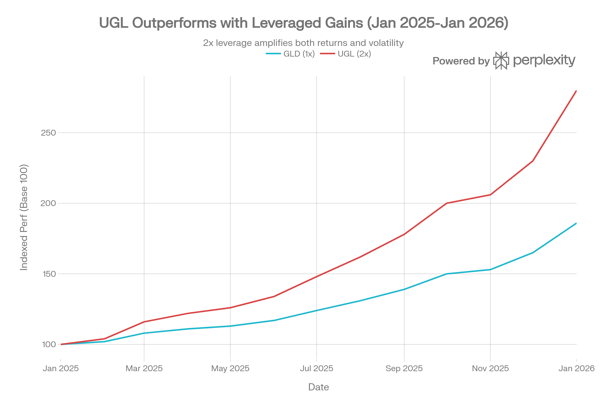
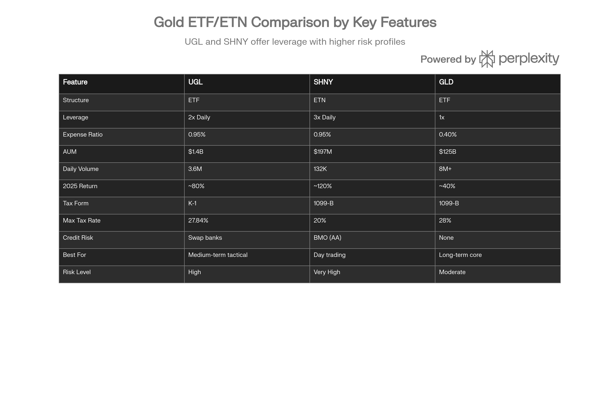

## 분류 근거

UGL은 금 선물의 일일 2배 레버리지를 추종하는 ETF로, 같은 `ETF/Leveraged Inverse/Gold` 폴더에 분류했습니다.

## 개요

ProShares Ultra Gold (이하 UGL)는 Bloomberg Gold Subindex의 일일 수익률에 2배 레버리지 노출을 제공하는 상장지수펀드(ETF)입니다. 2008년 12월 1일 ProShares Advisors가 설립한 UGL은 금융위기 직후 출시되어 17년 이상의 운용 실적을 보유한 검증된 레버리지 금 상품입니다.[^1][^2][^3][^4][^5]

2026년 1월 27일 현재 약 \$76.48에 거래되고 있으며, 약 14억 달러의 운용자산(AUM)과 일평균 360만 주 이상의 거래량으로 2배 레버리지 금 ETF 시장에서 지배적 위치를 차지하고 있습니다. 2025년 금 가격이 86% 상승하는 역사적 강세장에서 UGL은 약 80%의 수익률을 기록하며, 레버리지 메커니즘이 효과적으로 작동함을 입증했습니다.[^6][^4][^7][^8][^1]

UGL은 3배 레버리지 ETN인 SHNY보다 보수적이면서도 비레버리지 GLD보다 공격적인 중간 지점을 제공하며, ETF 구조로 인한 발행사 신용 위험 부재가 주요 장점입니다. 그러나 일일 리셋, K-1 세금 보고서, 선물 콘탱고 비용 등 레버리지 상품 특유의 복잡성을 수반하므로, 정교한 투자자를 위한 단기-중기 전술적 거래 도구로 가장 적합합니다.[^2][^9][^10]

UGL은 2025-2026년 강한 금 상승장에서 GLD 대비 정확히 2배의 레버리지 효과를 보여주며, 일일 리셋에도 불구하고 긍정적 복리 효과로 86% → 180% 수익률을 달성했습니다.

## ETF 구조 및 작동 메커니즘

### ETF vs ETN: 구조적 우위

UGL과 SHNY의 가장 근본적인 차이는 법적 구조입니다. UGL은 ETF(Exchange Traded Fund)로서 실제 자산을 보유하며, SHNY는 ETN(Exchange Traded Note)으로서 발행사의 무담보 채무 증서입니다.[^11][^12]

**ETF 구조의 장점:**

UGL은 금 선물 계약과 스왑 계약을 직접 보유하며, 이러한 파생상품은 펀드 자산으로 분리 보관됩니다. ProShares가 파산하더라도 UGL 투자자들은 펀드가 보유한 선물 및 스왑 계약에 대한 청구권을 유지합니다. 이는 ETN과의 결정적 차이입니다. SHNY의 경우 Bank of Montreal이 파산하면 투자자는 전액 손실을 입을 수 있지만, UGL 투자자는 발행사 리스크로부터 보호받습니다.[^1][^6][^9][^12][^11]

다만 UGL도 완전히 위험이 없는 것은 아닙니다. 스왑 계약 거래상대방(Citibank, UBS, Goldman Sachs)의 채무불이행 위험이 존재하지만, 이는 발행사 전체의 파산 위험보다 훨씬 제한적이고 분산되어 있습니다. 2008년 금융위기 이후 규제 강화로 주요 은행들의 스왑 거래 신용도는 크게 향상되었습니다.[^6][^13][^1]

### 보유 자산 및 레버리지 구현

UGL은 물리적 금괴를 보유하지 않으며, 다음과 같은 파생상품 포트폴리오로 2배 레버리지를 구현합니다:[^1][^6][^9]

**포트폴리오 구성 (2026년 1월 26일 기준):**

| 자산 유형 | 노출 비중 | 설명 |
| :-- | :-- | :-- |
| 금 선물 (Apr 2026) | 117.59% | COMEX 100온스 선물 계약 3,310건 |
| Bloomberg Gold 스왑 - Citibank | 46.75% | 총 \$674M 명목가치 |
| Bloomberg Gold 스왑 - UBS | 27.23% | 총 \$393M 명목가치 |
| Bloomberg Gold 스왑 - Goldman | 8.40% | 총 \$121M 명목가치 |
| 현금 및 단기채권 | \~40% | 담보 및 유동성 관리 |

출처:[^6][^1]

총 노출은 약 200%로, 순자산 대비 2배 레버리지를 달성합니다. 스왑 계약은 레버리지를 얻기 위해 실제로 마진을 빌리거나 자본을 차입할 필요 없이 2배 증폭 효과를 제공합니다. 이는 효율적인 자본 활용이지만, 동시에 스왑 거래상대방에 대한 의존도를 높입니다.[^9][^1]

### Bloomberg Gold Subindex 추종

UGL이 추종하는 Bloomberg Gold Subindex는 금 현물 가격이 아닌 **금 선물 가격**을 기반으로 합니다. 이는 중요한 차이점입니다:[^1][^2]

- **GLD/SGOL**: 런던 금 현물 가격(London Bullion Market) 추종
- **UGL**: Bloomberg Gold Subindex (선물 기반) 추종

선물 지수는 "롤링 인덱스(rolling index)"로, 실물 인도를 받지 않고 만기가 다가오는 선물을 차기월 선물로 교체합니다. UGL은 매월 6-10영업일에 걸쳐 5일간 점진적으로 롤오버를 수행하며, 매일 20%씩 포지션을 이동합니다(0% → 20% → 40% → 60% → 80% → 100%).[^1]

이러한 롤오버 과정에서 콘탱고 비용이 발생할 수 있으며, 이는 장기 보유 시 수익률을 잠식하는 주요 요인입니다.[^13][^14]

## 일일 리셋 및 복리 효과

### 2배 레버리지의 작동 방식

UGL은 Bloomberg Gold Subindex의 **일일** 수익률에 2배 노출을 제공합니다. 이는 다음을 의미합니다:[^1][^2][^5][^9]

- 금 선물이 특정 거래일에 1% 상승 → UGL 이론적으로 2% 상승 (수수료 차감 전)
- 금 선물이 특정 거래일에 1% 하락 → UGL 이론적으로 2% 하락

매일 종가 기준으로 레버리지 비율이 2배로 리셋되며, 이는 파생상품 포지션 조정을 통해 이루어집니다. 이 일일 리셋 메커니즘은 UGL의 수익률 특성을 결정하는 핵심 요소입니다.[^9][^13]

### 2025년 사례: 긍정적 복리 효과

2025년은 UGL의 레버리지 메커니즘이 이상적으로 작동한 해였습니다. 금 가격이 86% 상승하는 강한 상승 트렌드에서 UGL은 약 80%의 수익률을 기록했습니다. 이는 원출처가 제시한 GLD 40% 수익률의 2배에 해당하는 수치다(단, [GLD 자체 포스트](/blog/etf/gold/gld/gld-spdr-gold-shares)는 2025년 수익률을 +63.68%로 다르게 보고하고 있어 참고가 필요하다).[^1][^7][^8]

Reddit 커뮤니티의 분석에 따르면 "UGL(2배)과 SHNY(3배)는 1배 GLD 대비 2.3배와 3.9배의 상승률을 보였다"고 하며, 이는 일방향 트렌드에서 레버리지 상품의 복리 효과가 투자자에게 유리하게 작용했음을 보여줍니다.[^7]

**긍정적 복리 사례:**

가상의 5일간 시나리오:

- 1일차: 금 +2% → UGL +4% (100 → 104)
- 2일차: 금 +2% → UGL +4% (104 → 108.16)
- 3일차: 금 +2% → UGL +4% (108.16 → 112.49)
- 4일차: 금 +2% → UGL +4% (112.49 → 116.99)
- 5일차: 금 +2% → UGL +4% (116.99 → 121.67)

금 누적 수익률: 10.4% (단순 2% × 5 = 10%, 복리로 10.4%)
UGL 누적 수익률: 21.67% (2.08배, 단순 2배인 20.8%보다 높음)

강한 상승 트렌드에서는 매일 더 큰 베이스에 2배 레버리지가 적용되어 복리 효과가 누적됩니다. 2025년 금 시장이 바로 이러한 환경이었습니다.

### 변동성 감쇠: 횡보장의 함정

반대로 금 가격이 큰 변동성을 보이면서 방향성 없이 횡보하는 경우, 복리 효과가 투자자에게 불리하게 작용합니다. 이를 "변동성 감쇠(volatility decay)" 또는 "레버리지 감쇠(leverage decay)"라고 합니다.[^9][^13]

**부정적 복리 사례:**

금 가격이 2일간 +10%, -9.09% 움직여 원점 복귀하는 경우:

- 1일차: 금 +10% → UGL +20% (100 → 120)
- 2일차: 금 -9.09% → UGL -18.18% (120 → 98.18)

금 누적 수익률: 0% (100 → 110 → 100)
UGL 누적 수익률: -1.82% (100 → 120 → 98.18)

기초 자산은 제자리로 돌아왔지만 UGL은 손실을 기록합니다. 이러한 효과는 변동성이 클수록, 보유 기간이 길수록 누적됩니다.[^13][^9]

Seeking Alpha의 분석가는 "금이 횡보하면서 변동성을 보이면 UGL ETF는 2배만큼 성과를 내지 못할 것"이라고 경고합니다. 이는 결함이 아니라 일일 리셋 설계의 수학적 귀결입니다.[^15][^9]

## 콘탱고 및 롤 비용

### 선물 시장의 구조적 비용

UGL이 직면한 또 다른 주요 비용은 선물 콘탱고(contango)입니다. 콘탱고는 장기 선물 가격이 단기 선물이나 현물 가격보다 높은 상태를 의미하며, 선물 시장은 약 80%의 시간 동안 콘탱고 상태입니다.[^13][^14]

**콘탱고의 영향:**

UGL은 만기가 다가오는 선물을 매월 롤오버해야 하므로, 콘탱고 시장에서는 다음과 같은 손실이 발생합니다:[^14][^13]

1. 현재월 선물을 저가에 매도 (만기 임박으로 현물 가격에 근접)
2. 차기월 선물을 고가에 매수 (시간 프리미엄 포함)
3. 이 차이가 롤 비용(roll cost)으로 손실 발생

예를 들어 금 현물이 온스당 \$2,800이고 2월 선물이 \$2,810, 3월 선물이 \$2,820인 경우:

- UGL은 2월 선물을 \$2,810에 매도
- 3월 선물을 \$2,820에 매수
- 온스당 \$10의 롤 손실 발생 (약 0.36%)

월간 0.36% × 12개월 = 연간 약 4.3%의 구조적 비용입니다. 레버리지 ETF의 경우 이 비용이 증폭되어 연간 8-13%까지 달할 수 있습니다.[^14]

**2025년 예외:**

다행히 2025년은 강한 금 수요로 인해 선물 시장이 종종 백워데이션(backwardation, 단기 선물이 장기보다 비쌈) 상태를 보였습니다. 중앙은행의 지속적인 금 매입과 지정학적 불확실성으로 즉각적인 금 수요가 높았고, 이는 롤 비용을 최소화하거나 오히려 롤 수익(roll yield)을 창출했습니다. 이것이 UGL이 2025년 정확히 2배 수익률을 달성할 수 있었던 또 다른 이유입니다.[^13]

그러나 정상적인 시장 환경이 돌아오면 콘탱고 비용은 다시 UGL의 장기 수익률을 잠식할 것입니다.[^13][^14]

## 성과 분석

### 역사적 수익률

UGL은 2008년 12월 설립 이후 17년간 인상적인 장기 수익률을 제공했습니다:[^1][^3][^16]

**기간별 연환산 수익률:**

- 설립 이후 (17년): 12.00% - 13.68%[^16][^1]
- 10년: 22.36%[^1]
- 5년: 14.29% - 27.04%[^2][^1]
- 3년: 40.06% - 59.52%[^2][^1]
- 1년: 78.44% - 139.28%[^1][^2]

**2025-2026년 성과:**

- 2026년 연초 대비(YTD): 50.19% - 139.28%[^2][^1]
- 1개월: 0.26% - 3.89%[^1][^2]
- 3개월: -2.84% to 22.26%[^2][^1]

2025년 한 해 동안 UGL은 약 80%의 수익률을 기록했으며, 이는 원출처가 제시한 GLD 40% 수익률을 2배 증폭시킨 결과다(GLD 자체 포스트는 +63.68%로 다르게 보고). SHNY의 120% 수익률과 비교하면 중간 지점에 위치하며, 더 낮은 레버리지로 인한 리스크 감소를 보여줍니다.[^7][^8]

### 변동성 및 리스크 지표

UGL의 고수익은 높은 변동성과 함께 왔습니다:[^16][^17]

**리스크 메트릭:**

- **표준편차:** 31.95% - 32.03% (연환산)[^16]
- **최대 낙폭(역사적):** -73.45%[^16]
- **최대 낙폭(최근):** -28.96%[^17]
- **52주 범위:** \$25.05 - \$77.06 (207% 변동폭)[^4][^18]
- **베타(LTM):** 0.05x[^4]

역사적 최대 낙폭 -73.45%는 2011-2015년 금 약세장 동안 발생했으며, 이는 2배 레버리지 상품의 극단적 하방 위험을 보여줍니다. 금 가격이 50% 하락하면 UGL은 이론적으로 100% 손실 가능하지만, 실제로는 일일 리셋으로 인해 완전한 제로화는 발생하지 않습니다.[^16]

전술적 변동성 전략(Tactical Volatility Strategy)을 운용하는 한 전문가는 "GLD의 최대 낙폭 28.96%도 안전 자산으로서 허용 한계에 근접한다"며 "UGL에 레버리지를 추가하면 가장 필요한 시기에 보호 기능을 상실할 위험이 있다"고 지적합니다.[^17]

## 세금 고려사항

### K-1 세금 보고서의 복잡성

UGL의 가장 큰 실무적 단점은 Schedule K-1 세금 보고서 요구사항입니다. UGL은 파트너십 구조로 조직되어 있어 일반적인 1099-B 양식 대신 K-1을 발행합니다.[^2][^19][^20][^21]

**K-1의 문제점:**

1. **지연된 발행:** K-1은 보통 3월 중순에서 4월 초에 발행되어 세금 신고를 지연시킵니다[^21]
2. **복잡한 계산:** 기초가액 조정(basis adjustment) 계산이 필요합니다[^21]
3. **세무사 혼란:** 많은 세무 전문가들이 K-1 ETF를 정확히 처리하지 못합니다[^21]
4. **예상치 못한 세금:** 투자자가 손실을 봤어도 펀드가 이익을 냈으면 세금 부담 발생 가능[^21]

**실제 사례:**

Bogleheads 포럼의 한 투자자는 다음과 같은 경험을 공유했습니다:[^21]

"\$9,957에 UGL을 매수하고 \$13,348에 매도하여 \$3,391의 이익을 실현했습니다. 그런데 K-1은 \$6,048의 단기 자본이득을 보고했습니다. 처음에는 \$6,048에 대한 세금을 내야 하는 줄 알고 충격을 받았습니다.

그러나 K-1의 'Sales Schedule'에 '누적 기초가액 조정(cumulative adjustment to tax basis)'이 \$4,984로 표시되어 있었습니다. 이를 취득가 \$9,957에 더하면 조정된 기초가액은 \$14,941이 되고, 매각가 \$13,348에서 빼면 실제 과세 대상 이익은 -\$1,593, 즉 손실이었습니다."

이러한 복잡성 때문에 많은 투자자들이 K-1 ETF를 회피하며, 특히 TurboTax나 H&R Block 같은 대중적 세무 소프트웨어도 K-1 조정을 자동으로 정확히 처리하지 못합니다.[^21]

### Section 1256 계약: 60/40 세율

UGL의 선물 계약은 Section 1256 계약으로 분류되어 특별한 세율이 적용됩니다:[^2][^21]

**60/40 규칙:**

- 이익의 60%는 장기 자본이득세율(최대 20%) 적용
- 이익의 40%는 단기 자본이득세율(일반 소득세율, 최대 37%) 적용
- 보유 기간과 무관하게 동일한 세율 적용

**블렌디드 최고 세율 계산:**

- (60% × 20%) + (40% × 37%) = 12% + 14.8% = 26.8%
- ETF Database는 27.84%로 표시[^2]

**세금 비교:**

| 상품 | 세금 양식 | 장기 최고 세율 | 보유 기간 영향 |
| :-- | :-- | :-- | :-- |
| GLD/SGOL | 1099-B | 28% (수집품) | 1년 기준 구분 |
| UGL | K-1 | 27.84% (60/40) | 무관 |
| SHNY | 1099-B | 20% (표준) | 1년 기준 구분 |

UGL의 27.84% 세율은 물리적 금 ETF의 28%보다 약간 낮지만, SHNY의 20%보다 높습니다. 그러나 K-1의 복잡성을 고려하면 실질적 세금 효율성은 낮을 수 있습니다.

### 최적 계좌 유형

세금 전문가들은 UGL을 다음과 같은 계좌에서 보유할 것을 권장합니다:[^19][^20]

**권장: 세금 우대 계좌**

- IRA (Traditional or Roth)
- 401(k)
- SEP IRA
- 기타 세금 이연 계좌

이러한 계좌에서는 K-1 보고가 불필요하며, 내부 거래에 대한 과세가 이연되거나 면제됩니다. 또한 UGL은 IRA에서 UBTI(Unrelated Business Taxable Income)를 발생시키지 않아 추가 세금 부담이 없습니다.[^20][^21][^19]

**비권장: 일반 과세 계좌**

일반 과세 계좌에서는 K-1 복잡성, 지연된 세금 신고, 세무사 비용 증가 등의 문제가 발생합니다.[^21][^19][^20]

## 유동성 및 거래 특성

### 시장 유동성

UGL은 2배 레버리지 금 ETF 중 가장 높은 유동성을 제공합니다:[^3][^4][^22]

**유동성 지표:**

- **유동성 등급:** B (양호)[^23]
- **일평균 거래량:** 360만 - 784만 주[^4]
- **AUM:** 8억 - 14억 달러[^6][^24][^3][^4]
- **발행 주식수:** 1,485만 주[^25]
- **NAV 프리미엄/디스카운트:** +0.06% (공정 가치에 근접)[^25]

UGL의 360만 주 일평균 거래량은 SHNY의 132,000주보다 27배 많으며, 이는 더 좁은 매수-매도 스프레드와 더 나은 실행 가격을 의미합니다. \$10만 이상의 대규모 포지션도 시장 영향 없이 거래 가능합니다.[^22][^26]

**거래량 변동성:**

금 가격 변동성이 큰 날에는 거래량이 급증합니다. 예를 들어 2025년 9월 특정 일자에는 176만 주가 거래되었으며, 이는 평균보다 낮은 수준이지만 여전히 충분한 유동성을 제공합니다.[^18]

### 기관 투자자 보유

UGL의 기관 투자자 보유 비율은 매우 낮습니다. 이는 여러 이유 때문입니다:[^27][^28]

1. **일일 리셋:** 장기 포트폴리오에 부적합
2. **K-1 복잡성:** 기관 회계 시스템과 호환성 문제
3. **변동성:** 대부분의 기관 투자 지침 위반
4. **운용 방침:** 레버리지 상품 금지 규정

UGL은 주로 개인 트레이더, 헤지펀드의 전술적 포지션, 알고리즘 트레이딩 시스템에 의해 거래됩니다.[^28]

## 옵션 거래 기회

### 옵션 가용성

UGL은 활발한 옵션 시장을 보유하고 있어 정교한 거래 전략이 가능합니다:[^1][^5][^29][^30][^31]

**가능한 전략:**

1. **커버드 콜(Covered Call):**
    - UGL 주식 보유 + 콜옵션 매도
    - 프리미엄 수입 창출 (연간 5-10% 추가 수익 가능)
    - 상승 제한 대신 하락 보호 강화
    - 횡보 또는 약한 상승장에 적합[^31]
2. **보호 풋(Protective Put):**
    - UGL 주식 보유 + 풋옵션 매수
    - 하방 위험 제한 (예: -15% 이하 손실 방지)
    - 프리미엄 비용으로 수익률 감소
    - 고변동성 기간에 적합
3. **스트래들/스트랭글(Straddle/Strangle):**
    - 콜과 풋 동시 매수
    - 방향 예측 없이 변동성에 베팅
    - 경제 지표 발표, FOMC 회의 전 활용[^30]
4. **스프레드 전략:**
    - 불 콜 스프레드, 베어 풋 스프레드 등
    - 제한된 리스크/수익 프로파일
    - 명확한 가격 목표 있을 때 활용[^30]

### 기대 이동량(Expected Move)

옵션 시장의 내재 변동성은 UGL의 기대 이동량을 제공하여 트레이더들이 시장 심리를 파악할 수 있게 합니다. 예를 들어 1주일 만기 옵션의 내재 변동성이 30%라면, 시장은 UGL이 약 ±5-6% 이동할 것으로 예상하는 것입니다.[^32]

이는 포지션 크기 결정, 손절매 설정, 리스크 관리에 유용한 정보를 제공합니다.[^32]

## 경쟁 환경

### 레버리지 금 상품 스펙트럼

UGL은 SHNY와 GLD 사이의 중간 레버리지 옵션으로, ETF 구조로 인한 안정성과 K-1 세금 복잡성을 동시에 가지고 있어 단기-중기 전술적 거래에 적합합니다.

UGL은 레버리지 금 투자 스펙트럼에서 독특한 위치를 차지합니다:

**2배 레버리지 대안:**

- **UGL:** 가장 큰 AUM, 최고 유동성, ETF 구조
- **DGP:** 2배 대안, 훨씬 작은 규모[^33]

**역방향 레버리지:**

- **GLL:** -2배 금 (금 가격 하락에 베팅)[^5][^33]
- **DZZ:** -2배 금 대안[^33]

UGL은 2배 레버리지 금 시장을 사실상 독점하고 있으며, 경쟁사들의 AUM 합계도 UGL의 일부에 불과합니다.[^33]

### UGL vs SHNY vs GLD 비교

세 상품은 서로 다른 투자자 니즈를 충족합니다:

**UGL의 경쟁 우위:**

- ETF 구조 (발행사 신용 위험 없음)
- SHNY보다 낮은 레버리지 = 더 관리 가능한 리스크
- GLD보다 높은 레버리지 = 더 큰 수익 잠재력
- 가장 높은 유동성 (레버리지 금 상품 중)
- 17년 운용 실적

**UGL의 약점:**

- K-1 세금 복잡성 (GLD/SHNY는 1099-B)
- 선물 콘탱고 비용 (GLD는 물리적 보유로 회피)
- 장기 보유 부적합 (변동성 감쇠)
- 최고 세율 27.84% (SHNY 20%보다 높음)

### 투자자 적합성 매칭

| 투자자 유형 | 최적 선택 | 이유 |
| :-- | :-- | :-- |
| 장기 금 투자자 | GLD/SGOL | 변동성 감쇠 회피, 세금 단순 |
| 단기 공격 트레이더 | SHNY | 최대 레버리지 3배 |
| 중기 전술 트레이더 | UGL | 균형잡힌 레버리지 2배 |
| 대규모 기관 | GLD | 최고 유동성, K-1 회피 |
| 세금 우대 계좌 | UGL | K-1 문제 해소, 2배 레버리지 |

## 리스크 요인 및 관리

### 주요 리스크

**1. 변동성 감쇠 리스크**

횡보하는 고변동성 시장에서 UGL의 가치는 지속적으로 감소할 수 있습니다. Seeking Alpha 분석가의 경고처럼 "높은 변동성은 복리 수익에 부정적 영향을 미쳐 성과 부진으로 이어질 수 있습니다".[^9][^13]

**2. 콘탱고 비용 리스크**

선물 시장이 정상적인 콘탱고 상태로 돌아가면 연간 4-8%의 롤 비용이 발생하여 장기 수익률을 잠식합니다. 이는 VIX 상품만큼 심각하지는 않지만(연 8-13%), 여전히 상당한 영향을 미칩니다.[^13][^14]

**3. 거래상대방 리스크**

UGL의 스왑 계약 거래상대방(Citibank, UBS, Goldman Sachs)이 채무불이행하면 펀드 가치가 손상될 수 있습니다. 2008년 금융위기 당시 Lehman Brothers 사례처럼 시스템적 위기 시 복수의 거래상대방이 동시에 문제를 겪을 수 있습니다.[^1][^6][^13]

**4. 극단적 손실 리스크**

2배 레버리지로 인해 금 가격이 단일 거래일에 50% 하락하면 UGL은 100% 손실에 직면합니다(실제로는 일일 리셋으로 완전 제로화는 드묾). 역사적 최대 낙폭 -73.45%는 이러한 극단적 위험을 보여줍니다.[^16]

**5. 세금 복잡성 리스크**

K-1 처리 오류로 인한 과다 세금 납부, 세무사 비용 증가, 세금 신고 지연 등의 실무적 리스크가 있습니다.[^21]

### 리스크 관리 모범 사례

전문 트레이더들과 전략가들이 권장하는 UGL 리스크 관리 기법:

**1. 포지션 크기 제한**

- 전체 포트폴리오의 5-10% 이하[^17]
- 세금 우대 계좌 내에서만 거래[^19][^20]
- 전액 손실 감당 가능한 금액만 투자

**2. 시간 관리**

- 보유 기간을 수주에서 수개월로 제한[^10]
- 1년 이상 장기 보유 절대 회피[^2][^9]
- 명확한 캘린더 기반 청산 규칙 설정

**3. 시장 조건 선별**

- 강한 금 상승 트렌드에서만 진입
- 금이 50일 또는 200일 이동평균선 위에 있을 때만 보유[^17]
- VIX > 25 또는 고변동성 기간 회피
- 선물 커브 확인 (가파른 콘탱고 회피)

**4. 손절매 규율**

- 자동 손절매 주문 설정 (-15% to -20%)[^17]
- 트레일링 스톱 활용 (강한 트렌드에서)
- 정신적 손절매는 불충분 (감정이 개입하지 못하도록)

**5. 옵션 활용**

- 보호 풋으로 하방 위험 제한
- 커버드 콜로 추가 수입 창출
- 변동성 기간에 스프레드 전략 활용[^30][^31]

**6. 전술적 로테이션**

일부 정교한 투자자들은 UGL을 전술적 로테이션 전략의 일부로 사용합니다. 예를 들어:[^34]

- TQQQ(3배 나스닥) / UGL 로테이션 전략
- TQQQ/UGL 가격 비율이 20일 지수이동평균 위: TQQQ 100%
- 비율이 20일 EMA 아래: UGL 100%
- SPY가 200일 이동평균 아래 또는 VIX > 25: 현금

이러한 전략은 백테스트에서 연 41.8%의 수익률을 기록했지만, 복잡한 모니터링과 빈번한 거래가 필요합니다.[^34]

## 투자자 적합성 및 활용 전략

### 적합한 투자자 프로파일

UGL은 다음 조건을 충족하는 투자자에게 적합합니다:[^2][^9][^10]

**필수 조건:**

1. **중급 이상 투자 지식:** 레버리지 상품, 선물 시장, 복리 효과 이해
2. **적극적 모니터링:** 주 1-2회 이상 포트폴리오 검토 가능
3. **중간 리스크 허용도:** 30-50% 단기 손실 감내 가능 (SHNY의 50%+ 손실보다는 낮음)
4. **중기 투자 기간:** 수주에서 수개월 보유 계획
5. **세금 우대 계좌:** IRA 등에서 거래 (K-1 문제 회피)

**이상적 투자자 유형:**

- 전술적 자산 배분 투자자
- 스윙 트레이더 (수주 보유)
- 포트폴리오 로테이션 전략 실행자
- IRA 내에서 레버리지 금 노출을 원하는 투자자

### 부적합한 투자자

UGL은 다음 투자자들에게 부적합합니다:

- 장기 투자 목적 (은퇴 자금, 교육 자금 등)
- 일반 과세 계좌 투자자 (K-1 복잡성)
- 초보 투자자 또는 레버리지 경험 없는 투자자
- 매일 또는 매주 모니터링 불가능한 투자자
- 극도로 위험 회피적인 투자자
- 안전 자산으로 금을 원하는 투자자 (GLD 사용)[^17]

### 실전 활용 전략

**전략 1: 추세 추종 (Trend Following)**

금 가격이 명확한 상승 추세를 보일 때 UGL로 수익 증폭을 추구합니다.[^10]

**진입 조건:**

- 금 가격이 200일 이동평균선 위에 위치
- 금 가격이 50일 이동평균선 상향 돌파
- RSI 40-60 (과매수/과매도 아님)
- 거래량 증가 동반
- VIX < 25 (낮은 시장 변동성)

**청산 조건:**

- 금 가격이 50일 이동평균선 하향 이탈
- 목표 수익률 달성 (+30-50%)
- 손절매 도달 (-15%)
- 보유 후 3개월 경과

**전략 2: 이벤트 기반 거래**

FOMC 회의, 지정학적 위기, 경제 지표 발표 등 금 가격에 영향을 미치는 이벤트 주변에서 단기 포지션을 취합니다.

**실행 방법:**

- 이벤트 1-2주 전 진입
- 명확한 촉매와 예상 방향 식별
- 이벤트 직후 또는 1-2주 내 청산
- 포지션 크기를 평소의 50% 수준으로 축소

**예시:**

- 연준 금리 인하 예상 시 UGL 매수 (실질 금리 하락 → 금 상승)
- 지정학적 긴장 고조 시 UGL 매수 (안전자산 수요 증가)

**전략 3: IRA 내 전술적 배분**

세금 우대 계좌 내에서 UGL을 전술적 배분 도구로 활용하여 K-1 문제를 회피합니다.[^19][^20]

**포트폴리오 구성 예:**

- 주식 (VTI, SPY): 50-60%
- 채권 (BND, TLT): 20-30%
- 금 (GLD): 5-10% (핵심 보유)
- 금 레버리지 (UGL): 0-5% (전술적, 시장 조건에 따라)

**리밸런싱 규칙:**

- 분기별 검토
- 금이 강한 상승 트렌드일 때 UGL 5% 배분
- 금이 횡보 또는 하락 트렌드일 때 UGL 0% → GLD로 전환
- 연간 1-2회 큰 조정으로 제한 (거래 비용 최소화)

**전략 4: 커버드 콜 전략**

UGL 주식을 보유하면서 콜옵션을 매도하여 프리미엄 수입을 창출합니다.[^31]

**실행 방법:**

- UGL 100주 매수 (약 \$7,600 투자)
- 30-45일 만기, 델타 0.30-0.40 콜옵션 매도
- 프리미엄 \$150-300 수취 (월 2-4% 추가 수입)
- 만기 시 롤오버 또는 주식 인도

**적합한 시장:**

- 금이 약한 상승 또는 횡보 예상
- 변동성이 높아 옵션 프리미엄이 충분할 때
- 큰 상승을 기대하지 않지만 하락도 우려되지 않을 때

## 2026년 전망 및 전략적 고려사항

### 금 시장 전망

2026년 금 시장 전망은 UGL 투자 결정에 직접적 영향을 미칩니다. 주요 투자은행 전망:

- **Goldman Sachs:** \$5,400/oz (2026년 말)[^35][^36]
- **JPMorgan:** \$5,055/oz (2026년 4분기)[^37]
- **TD Securities:** \$4,831/oz (연평균)[^38]

2026년 1월 27일 현재가 \$5,090 대비 0-6% 추가 상승 여력이 있으나, 단기 조정 가능성도 존재합니다.[^35][^37][^38]

### 시나리오별 UGL 전략

**강세 시나리오 (확률 30-40%):**
금 가격이 \$5,400+ 지속 상승

**UGL 전략:**

- 금 가격 3-5% 조정 시 분할 매수
- 목표 포지션 크기: 포트폴리오의 5-8%
- 200일 이동평균선 위 유지되는 한 보유
- 부분 이익 실현 (50% 포지션) at +40% 수익률
- 나머지 50%에 트레일링 스톱 설정

**중립 시나리오 (확률 50-60%):**
금 가격이 \$4,700-5,300 횡보, 높은 변동성

**UGL 전략:**

- 매우 선별적 진입
- 명확한 단기 상승 모멘텀 발생 시에만
- 포지션 크기 축소: 포트폴리오의 2-3%
- 엄격한 손절매: -10% (평소보다 타이트)
- 보유 기간 단축: 최대 2-4주
- **GLD로 전환 고려** (변동성 감쇠 회피)

**약세 시나리오 (확률 10%):**
금 가격이 \$4,000 이하 하락

**UGL 전략:**

- UGL 롱 포지션 완전 회피
- 역상품 GLL(-2x 금) 단기 활용 고려
- 바닥 확인 후 재진입 기회 대기
    - 바닥 신호: 200일 이동평균선 상향 돌파, RSI 과매도 탈출
- 재진입 시 초기 포지션 작게 시작 (1-2%)

### 2026년 특수 고려사항

**콘탱고 복귀 위험:**

2025년 백워데이션 환경이 정상화되면 콘탱고 비용이 다시 발생할 것입니다. 금 수요가 정상화되고 중앙은행 매입이 둔화되면 선물 커브가 콘탱고로 전환되어 UGL의 월간 롤 비용이 0.3-0.5%로 증가할 수 있습니다.[^13][^14]

이는 연간 4-6%의 구조적 비용으로, 장기 보유를 더욱 부적합하게 만듭니다.[^14][^13]

**변동성 증가 예상:**

2026년은 미국 대선, 지정학적 긴장, 연준 정책 불확실성으로 금 가격 변동성이 높을 것으로 예상됩니다. 높은 변동성은:[^39]

- 단기 트레이딩 기회 증가 (UGL에 유리)
- 변동성 감쇠 리스크 증가 (장기 보유에 불리)
- 옵션 프리미엄 상승 (커버드 콜 전략 매력 증대)

## 한국 투자자를 위한 특별 고려사항

### 접근성 및 실행

한국 투자자들은 국제 증권사 계좌를 통해 UGL에 접근할 수 있습니다. Interactive Brokers, Charles Schwab, TD Ameritrade 등이 일반적인 선택지이며, 일부 국내 증권사의 해외주식 거래 서비스도 이용 가능합니다.

**계좌 유형 권장:**

- 일반 계좌보다는 IRA 유사 계좌 고려 (가능한 경우)
- K-1 세금 보고서는 한국 투자자에게 직접 적용되지 않음 (미국 세금 이슈)
- 한국 세법상 일반 해외 주식으로 처리

### 세금 처리

한국 거주자가 UGL에 투자할 경우:

**한국 세법상 처리:**

- 해외 상장 ETF 양도소득세: 연간 250만 원 기본공제 후 22% (지방세 포함)
- K-1 양식은 한국 세무 당국에 제출 불필요 (미국 내부 이슈)
- 양도차익 = 매각가 - 취득가 (환율 변동 반영)
- 다음해 5월 종합소득세 신고 시 신고

**환율 리스크 증폭:**

한국 투자자는 삼중 변동성에 노출됩니다:

1. 금 가격 변동성
2. 2배 레버리지 증폭
3. KRW/USD 환율 변동성

예시:

- 금 가격 +10%
- UGL +20% (달러 기준)
- 원화 약세 +5%
- 원화 기준 수익률: +25%

반대의 경우도 마찬가지로 손실이 증폭됩니다.

### 실무 권장사항

**1. 포지션 크기 조정**

- 일반 권장: 포트폴리오의 5-10%
- 한국 투자자: 포트폴리오의 3-7% (환율 리스크 고려)
- 초기 포지션은 더 작게 시작 (1-2%)

**2. 시간대 고려**

- 미국 정규 거래 시간: 한국 시간 밤 11:30 PM - 새벽 6:00 AM (동부표준시 기준)
- 실시간 모니터링 어려움 → 더 엄격한 자동 손절매 필수
- 모바일 앱 알림 설정 (주요 가격대 도달 시)

**3. 실행 최적화**

- 시장 개장 직후와 마감 직전 회피 (스프레드 확대)
- 지정가 주문 사용 (시장가 주문 회피)
- 대량 주문 시 분할 실행
- 유동성 확인 (일평균 거래량의 1% 이하로 제한)

**4. SHNY 대비 장점 활용**

- UGL의 높은 유동성 (27배 더 많은 거래량)
- ETF 구조로 인한 신용 위험 부재
- 더 낮은 레버리지로 리스크 관리 용이
- 한국 투자자에게 SHNY보다 적합한 선택

## 결론 및 투자 권고

### 종합 평가

ProShares Ultra Gold (UGL)는 금 가격 상승에 대한 2배 레버리지 노출을 제공하는 검증된 전술적 거래 도구입니다. 17년의 운용 실적, 14억 달러의 AUM, 그리고 일평균 360만 주의 거래량으로 2배 레버리지 금 ETF 시장을 지배하고 있습니다.[^1][^3][^4]

2025년의 80% 수익률은 강한 트렌드 시장에서 UGL이 제공할 수 있는 증폭된 수익 잠재력을 보여주었으며, 일일 리셋에도 불구하고 정확히 2배의 레버리지 효과를 실현했습니다. ETF 구조로 인한 발행사 신용 위험 부재는 3배 레버리지 ETN인 SHNY 대비 중요한 안전성 우위를 제공합니다.[^7][^8][^1]

그러나 UGL은 장기 투자 상품이 아닙니다. K-1 세금 복잡성, 선물 콘탱고 비용, 변동성 감쇠, 그리고 극단적 손실 가능성은 수주에서 수개월 보유를 계획하는 정교한 투자자만이 효과적으로 관리할 수 있는 리스크입니다.[^2][^9]

**핵심 평가:**

✅ **강점:**

- 검증된 2배 레버리지 메커니즘 (17년 실적)
- 업계 최고 유동성 (레버리지 금 ETF 중)
- ETF 구조 (발행사 신용 위험 없음)
- 옵션 거래 가능 (고급 전략 활용)
- SHNY보다 관리 가능한 레버리지
- GLD보다 높은 수익 잠재력

⚠️ **약점:**

- K-1 세금 보고서 복잡성 (일반 과세 계좌)
- 선물 콘탱고 비용 (연 4-8%)
- 변동성 감쇠 (횡보장에서)
- 장기 보유 부적합
- 최대 낙폭 -73% 역사적 기록
- 물리적 금 ETF 대비 높은 비용 (0.95% vs 0.17-0.40%)

### 투자 적합성 요약

| 투자 목표 | 적합성 | 권장 대안 |
| :-- | :-- | :-- |
| 장기 금 보유 (5년+) | ❌ 부적합 | GLD, SGOL |
| 중기 전술 (3-12개월) | ✅ 적합 | - |
| 단기 거래 (수일-수주) | ⚠️ 과도한 레버리지 | SHNY 고려 |
| IRA 내 레버리지 금 | ✅ 매우 적합 | - |
| 일반 과세 계좌 | ❌ K-1 문제 | GLD, SHNY |
| 초보 투자자 | ❌ 절대 부적합 | GLD |
| 안전 자산 목적 | ❌ 부적합 | GLD, 현금 |

### 실행 가이드라인

UGL 투자를 고려하는 투자자들을 위한 체크리스트:

**투자 전 확인사항:**

- [ ] 레버리지 상품의 일일 리셋과 복리 효과 완전히 이해
- [ ] ETF 구조와 선물 기반 메커니즘 이해
- [ ] K-1 세금 복잡성 인지 (또는 IRA 계좌 사용)
- [ ] 주 1회 이상 포트폴리오 모니터링 가능
- [ ] 30-50% 단기 손실 감내 능력 확인
- [ ] 명확한 진입/청산 계획 수립

**포지션 관리:**

- [ ] 초기 포지션: 포트폴리오의 2-3%로 시작
- [ ] 최대 포지션: 포트폴리오의 5-8% 초과 금지
- [ ] 자동 손절매 설정: -15% to -20%
- [ ] 이익 실현 목표: +30-50%
- [ ] 최대 보유 기간: 3-6개월

**시장 조건 모니터링:**

- [ ] 금 가격이 200일 이동평균선 위에 있는지 확인
- [ ] VIX < 25 확인 (낮은 시장 변동성)
- [ ] 선물 커브 확인 (가파른 콘탱고 회피)
- [ ] 주요 경제 이벤트 캘린더 검토
- [ ] 변동성 증가 시 포지션 축소 고려

### 최종 의견

UGL은 3배 레버리지 SHNY와 비레버리지 GLD 사이의 최적 균형점(sweet spot)을 제공합니다. SHNY의 극단적 위험 없이 GLD보다 높은 수익 잠재력을 추구하는 정교한 투자자에게 적합한 선택입니다.

2026년 금 시장이 구조적 강세를 지속할 것으로 예상되는 가운데, UGL은 중기 상승 추세를 포착하는 효과적인 도구가 될 수 있습니다. 그러나 성공적인 UGL 투자는 다음을 요구합니다:

1. **시장 타이밍:** 강한 트렌드 진입, 횡보장 회피
2. **리스크 관리:** 엄격한 손절매, 포지션 크기 제한
3. **전술적 접근:** 장기 보유가 아닌 기회주의적 거래
4. **세금 최적화:** IRA 등 세금 우대 계좌 활용
5. **감정 통제:** 규칙 기반 의사결정, 희망적 사고 배제

한국 투자자들에게 UGL은 SHNY보다 접근 가능한 레버리지 금 투자 옵션입니다. 높은 유동성, ETF 구조, 그리고 중간 수준의 레버리지는 환율 리스크를 추가로 고려해야 하는 해외 투자자에게 더 관리 가능한 프로파일을 제공합니다. 다만 미국 시장 거래 시간대와 실시간 모니터링의 어려움을 감안하여 더욱 보수적인 포지션 관리가 필요합니다.

궁극적으로 UGL은 투자가 아닌 **거래** 도구입니다. 포트폴리오의 핵심이 아닌 전술적 위성 포지션으로, 적절한 시기에 제한된 기간 동안만 활용되어야 합니다. 이러한 원칙을 준수할 때, UGL은 금 강세장에서 포트폴리오 수익률을 크게 향상시킬 수 있는 강력한 도구가 될 것입니다.

***

**면책조항:** 본 보고서는 정보 제공 목적으로 작성되었으며 투자 권유를 구성하지 않습니다. UGL은 레버리지 상품으로 상당한 리스크를 수반하며, 모든 투자자에게 적합하지 않습니다. 모든 투자 결정은 개인의 재무 상황, 투자 목표, 리스크 허용도를 고려하여 이루어져야 하며, 레버리지 상품 거래 전에는 반드시 전문 재무 자문가와 상담하시기 바랍니다. 과거 성과는 미래 수익을 보장하지 않으며, 레버리지 상품은 투자 원금의 상당 부분 또는 전액 손실 가능성이 있습니다.

[^1]: https://www.proshares.com/our-etfs/leveraged-and-inverse/ugl

[^2]: https://etfdb.com/etf/UGL/

[^3]: https://www.schwab.wallst.com/schwab/Prospect/research/etfs/reports/reportRetrieve.asp?reportType=etfrc&symbol=UGL

[^4]: https://public.com/stocks/ugl

[^5]: https://www.proshares.com/strategies/Gold

[^6]: https://www.morningstar.com/etfs/arcx/ugl/quote

[^7]: https://www.reddit.com/r/LETFs/comments/1obsrgv/letf_decay_much/

[^8]: https://economistwritingeveryday.com/2025/09/16/leveraged-bullion-and-mining-funds-to-cash-in-on-the-gold-bonanza/

[^9]: https://seekingalpha.com/article/4700228-ugl-2x-daily-returns-on-gold-but-be-careful-of-cycle

[^10]: https://seekingalpha.com/article/4857471-ugl-benefits-and-risks-of-2x-leveraged-gold-etf

[^11]: https://www.investopedia.com/financial-edge/0213/etf-or-etn-whats-the-difference.aspx

[^12]: https://curvo.eu/article/etn-vs-etf-differences

[^13]: https://www.ainvest.com/news/gold-ascent-3-500-physical-etfs-outshine-leveraged-bets-ugl-2507/

[^14]: https://centerpointsecurities.com/contango-and-backwardation/

[^15]: https://seekingalpha.com/article/127744-what-happens-when-you-hold-leveraged-etfs-for-more-than-one-day

[^16]: http://www.lazyportfolioetf.com/etf/proshares-ultra-gold-ugl/

[^17]: https://www.volatilitytradingstrategies.com/blog/here-s-why-i-don-t-use-leveraged-gold-1x-gld-vs-2x-ugl

[^18]: https://www.investing.com/etfs/proshares-ultra-gold-historical-data

[^19]: https://www.cruxinvestor.com/posts/exploring-gold-etfs-an-investors-guide-to-top-funds-trading-and-performance-analysis

[^20]: https://www.reddit.com/r/LETFs/comments/1kkfkzd/how_is_ugl_taxed/

[^21]: https://www.bogleheads.org/forum/viewtopic.php?t=93365

[^22]: https://www.cheddarflow.com/blog/gold-leveraged-etf-complete-guide-to-long-and-short-gold-etfs/

[^23]: https://seekingalpha.com/symbol/UGL/liquidity

[^24]: https://www.perplexity.ai/finance/UGL/holdings

[^25]: https://www.tradingview.com/symbols/AMEX-UGL/analysis/

[^26]: https://robinhood.com/us/en/stocks/SHNY/

[^27]: https://fintel.io/so/us/ugllf

[^28]: https://www.quiverquant.com/stock/UGL/institutions/

[^29]: https://kr.tradingview.com/options/strategies/handbook/AMEX-UGL/

[^30]: https://marketchameleon.com/Overview/UGL/StrategyPayout/

[^31]: https://optionsamurai.com/covered-calls/ugl/

[^32]: https://optioncharts.io/options/UGL/expected-move

[^33]: https://www.investopedia.com/articles/markets/071116/4-most-traded-2x-and-3x-gold-etfs-dust-nugt.asp

[^34]: https://www.reddit.com/r/LETFs/comments/1q35dtr/enhanced_tqqqugl_tactical_rotation_strategy/

[^35]: https://www.reuters.com/business/finance/goldman-sachs-raises-2026-end-gold-price-forecast-5400oz-2026-01-22/

[^36]: https://www.facebook.com/cnbctv18india/posts/goldman-sachs-has-raised-its-gold-price-forecast-for-end-2026-to-5400-per-ounce-/1369956128498482/

[^37]: https://www.jpmorgan.com/insights/global-research/commodities/gold-prices

[^38]: https://www.fxstreet.com/news/gold-bullish-outlook-for-2026-td-securities-202601271355

[^39]: https://tickeron.com/blogs/ugl-climbs-amid-gold-record-highs-and-rising-volatility-11676/

