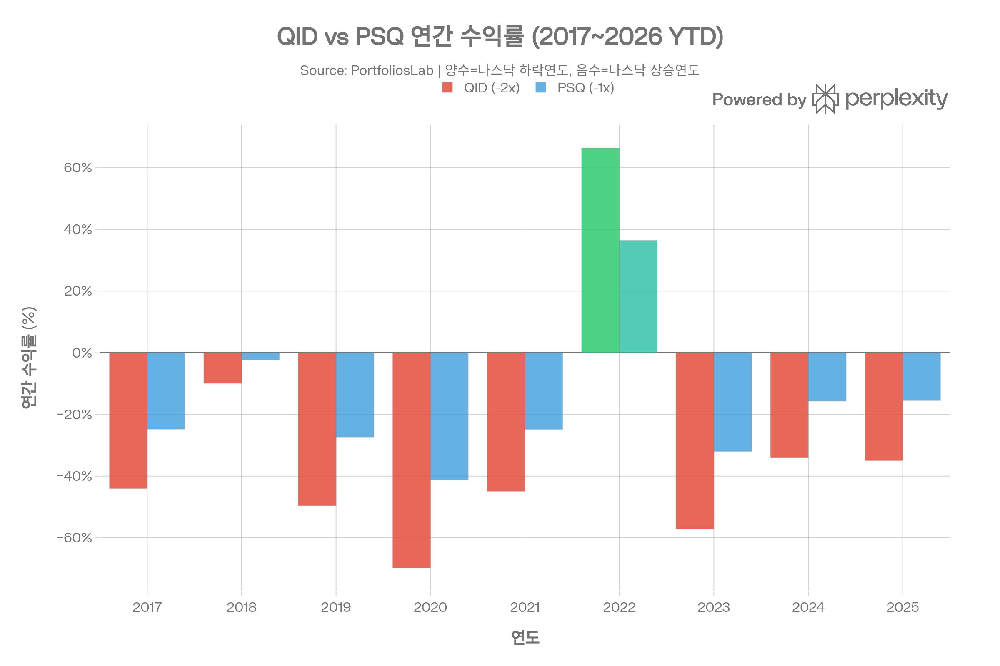
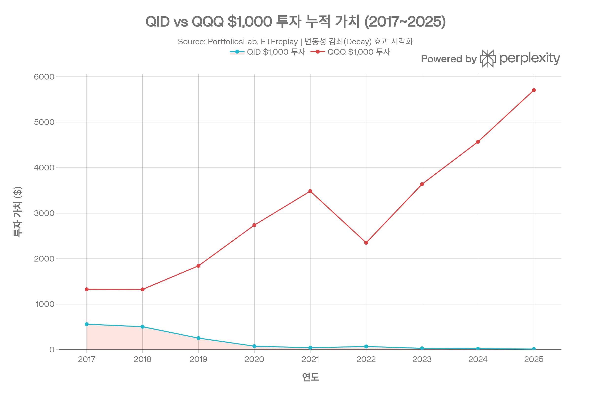

# QID (ProShares UltraShort QQQ) 종합 분석 보고서
> <strong>작성 기준일:</strong> 2026년 5월 3일 | <strong>데이터 출처:</strong> ProShares 공식 사이트, StockAnalysis, ETFdb, PortfoliosLab, TrendSpider 등

## ETF 분류

| 항목 | 내용 |
|------|------|
| <strong>최종 폴더</strong> | `ETF/Leveraged Inverse/Nasdaq-100/QID` |
| <strong>대분류</strong> | 레버리지·인버스 |
| <strong>하위 분류</strong> | Nasdaq-100 레버리지 인버스 |
| <strong>핵심 전략</strong> | Nasdaq-100 지수의 일일 수익률을 -2배로 추종 |
| <strong>레버리지·인버스</strong> | 예, 일일 -2x 인버스 |
| <strong>옵션 인컴 전략</strong> | 아니오 |
| <strong>분류 판단</strong> | Nasdaq-100 노출이 있지만 일반 대표지수 ETF가 아니라 일일 -2배 인버스 구조가 핵심이므로 레버리지·인버스 폴더에 우선 분류한다. |

***
## 1. 기본 정보
| 항목 | 내용 |
|------|------|
| 티커 | QID |
| 전체명 | ProShares UltraShort QQQ |
| 운용사 | ProShares (ProShare Advisors LLC) |
| 상장거래소 | NYSE Arca |
| CUSIP | 74349Y829 |
| 설정일 | 2006년 7월 11일 |
| 운용기간 | 약 19년 8개월 |
| 순자산(AUM) | 약 \$2억 7,840만 (≈ 약 3,900억 원)[1] |
| 총 보수(Gross Expense Ratio) | 1.02%[1] |
| 순 보수(Net Expense Ratio) | <strong>0.95%</strong>[1][2] |
| 추종 목표 | 나스닥-100 지수 일간 수익률의 <strong>-2배 (-2x)</strong> |
| 추종 지수 | Nasdaq-100 Index® |
| 분배 주기 | 분기배당 |
| 레버리지 유형 | 일일 재설정 역방향(-2x) 레버리지 ETF |

QID(ProShares UltraShort QQQ)는 2006년 7월 11일 설정된 미국의 레버리지 인버스 ETF로, 나스닥-100 지수의 <strong>일간 수익률</strong> 대비 -2배 수익을 목표로 설계된 파생상품 기반 펀드입니다. 나스닥 100이 하루에 1% 하락하면 QID는 이론적으로 2% 상승하고, 나스닥 100이 1% 상승하면 QID는 약 2% 하락합니다.[3][4][5]

***
## 2. 추종 구조 및 메커니즘
### 파생상품 기반 역레버리지 구조
QID는 주식을 직접 보유하지 않고, 나스닥-100 지수에 대한 역방향 스왑 계약(인덱스 스왑)과 E-Mini 선물 계약을 통해 -2x 노출을 구현합니다. 2026년 5월 1일 기준 보유 구성은 다음과 같습니다:[1][4]

| 스왑 상대방 | 노출 비중 |
|------------|---------|
| UBS AG | -32.27% |
| Société Générale | -24.13% |
| Nomura Capital | -22.14% |
| Bank of America NA | -20.81% |
| JPMorgan Chase Bank | -20.62% |
| Citibank NA | -15.43% |
| BNP Paribas | -12.29% |
| Goldman Sachs International | -12.11% |
| Morgan Stanley & Co. | -12.03% |
| E-Mini 나스닥 100 선물 (2026/06) | -11.55% |
| ProShares Genius Money Market ETF (담보) | 현금 등가 보유 |

나머지 자산은 ProShares Genius Money Market ETF(IQMM)에 현금성 담보로 보유하며, 다수의 스왑 거래 상대방에 분산하여 단일 거래 상대방 부도 위험(카운터파티 리스크)을 완화하고 있습니다.[6][7][1]
### 일일 레버리지 리셋 메커니즘
레버리지 배율은 <strong>매일 영업 종료 시 재설정</strong>됩니다. 이는 특정 기간의 누적 수익률이 해당 기간 나스닥-100 수익률의 정확히 -2배가 되지 않는다는 것을 의미합니다. 시장이 횡보하거나 변동성이 높을 때 '변동성 감쇠(Volatility Decay)' 또는 '베타 슬리피지(Beta Slippage)'가 발생하여 장기 보유 시 큰 손실을 야기합니다.[8][9][10][11]

***
## 3. 비용 구조
| 항목 | 내용 |
|------|------|
| 총 보수(Gross TER) | 1.02%[1][12] |
| 순 보수(Net TER) | <strong>0.95%</strong>[1] |
| 관리보수 | 0.75%[12] |
| 기타 비용 | 0.26%[12] |
| 30일 중간 호가 스프레드 | <strong>0.05%</strong>[1] |
| 연간 분배금 (TTM) | 주당 \$1.69 / 연간 배당률 약 6.87\~7.66%[8][13] |
### 경쟁 인버스 ETF 비용 비교
| ETF | 운용사 | 레버리지 | 비용률 | AUM |
|-----|--------|---------|--------|-----|
| PSQ | ProShares | -1x | 0.95% | \~\$2억 |
| <strong>QID</strong> | <strong>ProShares</strong> | <strong>-2x</strong> | <strong>0.95%</strong> | <strong>\~\$2.8억</strong> |
| SQQQ | ProShares | -3x | 0.95% | \~\$25억[14] |

세 인버스 ETF 모두 동일한 0.95%의 순 보수율을 갖지만, 레버리지 배율이 높을수록 변동성 감쇠 비용이 기하급수적으로 증가합니다. 실질적인 투자 비용은 명목 보수율보다 변동성 감쇠에 의해 훨씬 더 크게 결정됩니다.[5][14]

***
## 4. 유동성 평가
| 항목 | 내용 |
|------|------|
| 현재 주가 (2026/05/01) | \$16.61[1] |
| 일 거래량 (2026/05/01) | 22,222,035주[1] |
| 52주 최저 / 최고 | \$16.52 / \$50.45[15] |
| 30일 중간 호가 스프레드 | 0.05%[1] |
| AUM | 약 \$2.79억[1] |
| 옵션 거래 가능 여부 | 예 (Options Available)[1] |

QID는 일 거래량 2,200만 주 이상의 우수한 유동성을 보유하며, 30일 중간 호가 스프레드 0.05%는 매우 좁은 수준으로 IQQQ(0.16%)와 비교해 유동성이 훨씬 뛰어납니다. 시장 변동성이 높아지는 기간(예: 나스닥 급락 시)에는 거래량이 폭발적으로 증가하는 경향이 있습니다.[1]
### 역분할(Reverse Split) 이력
QID는 주가 희석으로 인해 <strong>2024년 4월 10일 1:5 역분할</strong>을 시행했습니다. 역분할 이후 주가가 5배로 상승하고 주식 수는 1/5로 감소했으며, 이는 주가 하락에 따른 관리 목적의 조치였습니다. CUSIP 번호도 새로 부여되었습니다(74349Y829).[16][17]

***
## 5. 포트폴리오 구성
QID는 개별 주식을 직접 보유하지 않으며, 모든 노출은 스왑 계약과 선물을 통해 구성됩니다. 상위 10대 보유 종목의 개념은 적용되지 않으며, 나스닥-100 지수 전체에 대한 역방향(-2x) 노출이 핵심 구조입니다.[4]

<strong>포트폴리오의 주요 특성:</strong>
- 나스닥-100 지수 편입 101개 종목 전체에 대한 -2x 노출[4]
- 실물 주식 비보유 (순수 파생상품 구조)[1]
- 담보로 머니마켓펀드(IQMM) 보유[1]
- 총 16개의 계약 포지션(스왑 9개 + 선물 1개 + 담보 MMF)[15]
- 섹터별 배분은 나스닥-100과 동일하지만, <strong>역방향(-2x) 노출</strong> 적용

***
## 6. 성과 분석
### 기간별 수익률 (NAV 기준, 2026년 3월 31일 / 2026년 5월 기준)

| 기간 | QID NAV | QID 시장가 |
|------|---------|-----------|
| 1개월 | +9.95% | +9.99%[1] |
| 3개월 (YTD) | +12.83% | +12.93%[1] |
| 6개월 | +7.88% | +7.97%[1] |
| 1년 | <strong>-37.68%</strong> | <strong>-37.63%</strong>[1] |
| 3년 (연환산) | -32.71% | -32.69%[1] |
| 5년 (연환산) | -27.11% | -27.08%[1] |
| 10년 (연환산) | -35.90% | -35.89%[1] |
| 설정 이후 (연환산) | <strong>-33.63%</strong> | <strong>-33.63%</strong>[1] |
### 연간 수익률 이력 (2017\~2026 YTD)
| 연도 | QID | PSQ (-1x) | 비고 |
|------|-----|-----------|------|
| 2017 | -44.00% | -24.77% | 나스닥 강세 |
| 2018 | -9.90% | -2.34% | 나스닥 소폭 하락 |
| 2019 | -49.57% | -27.49% | 나스닥 강세 |
| 2020 | -69.71% | -41.23% | 나스닥 강세 (팬데믹 반등) |
| 2021 | -44.93% | -24.84% | 나스닥 강세 |
| <strong>2022</strong> | <strong>+66.30%</strong> | <strong>+36.40%</strong> | <strong>나스닥 -32% 급락</strong> |
| 2023 | -57.19% | -32.01% | 나스닥 강세 반등 |
| 2024 | -34.06% | -15.68% | 나스닥 강세 |
| 2025 | -34.97% | -15.51% | 나스닥 강세 |
| 2026 YTD | +12.92% | +7.10% | 나스닥 약세[18] |

2022년을 제외하면 나스닥 강세장 지속으로 QID는 매년 대규모 손실을 기록했습니다. 2017년 시작 기준 \$1,000 투자 시 2025년 말 약 <strong>\$13 수준</strong>으로 하락한다는 것을 누적 복리 계산으로 확인할 수 있습니다.[18]
### 변동성 감쇠(Volatility Decay) 효과

레버리지 인버스 ETF의 가장 치명적인 특성은 변동성 감쇠입니다. 예를 들어, 나스닥 100이 이틀 연속으로 각각 +10%, -10% 움직였다고 가정하면:[9][11]
- 나스닥 100 누적 변화: 1.10 × 0.90 = 0.99 → <strong>-1% 손실</strong>
- QID(-2x) 이론값: (1 - 0.20) × (1 + 0.20) = 0.96 → <strong>-4% 손실</strong> (단순 -2x가 아닌 +2% 이상 과대 손실)

나스닥 100처럼 변동성이 높은 지수일수록 이 감쇠 효과가 더 크게 작용하며, 장기 보유 시 이론값보다 훨씬 큰 손실이 누적됩니다.[9]
### 위험 조정 성과 지표
| 지표 | QID | PSQ |
|------|-----|-----|
| 베타 | <strong>-2.25</strong>[15] | \~-1.1 |
| 샤프 지수 (1Y) | -1.20[19] | — |
| 샤프 지수 (5Y) | -0.59[19] | -0.78[18] |
| 샤프 지수 (10Y) | -0.82[19] | — |
| 소르티노 비율 (5Y) | -1.07[18] | -0.98[18] |
| 최대 낙폭 (Max Drawdown) | 매우 심각 (설정 이후 -99% 이상)[20] | — |

***
## 7. 추종 성과 지표
### 추적 오차 및 괴리율
| 항목 | 내용 |
|------|------|
| NAV vs 시장가 괴리율 | 약 -0.04% (소폭 디스카운트)[21] |
| 30일 중간 호가 스프레드 | 0.05%[1] |
| 1일 목표 복제 정확도 | 매우 높음 (스왑 구조 특성상 일간 추적 오차 최소)[4] |
| 장기 누적 추적 오차 | 변동성 감쇠로 인해 목표 레버리지와 크게 이탈[9] |

일간 단위에서 QID는 목표인 -2x를 매우 정확하게 추종합니다. 그러나 다수 일 보유 시 일일 복리 효과로 인해 누적 수익률은 나스닥-100의 -2배와 크게 달라집니다. 이것은 설계상의 결함이 아니라 <strong>일일 레버리지 리셋이라는 구조적 특성</strong>입니다.[8][22]

***
## 8. 배당 정보
| 항목 | 내용 |
|------|------|
| 배당 주기 | 분기배당 (3, 6, 9, 12월)[15] |
| TTM 배당금 | 주당 \$1.41\~\$1.69[15][13] |
| 12개월 배당 수익률 | 약 6.87\~7.66%[8][13] |
| 배당 성격 | 스왑 이자 수익 등 (자본 이익 아님) |
| 최근 배당 (2025/03/26) | \$0.36851/주[15] |
| 배당 성장률 (1Y) | -52.75%[13] |

인버스 레버리지 ETF의 배당 수익률은 주가 하락에 따른 수익률 분모 감소 효과로 일시적으로 높아 보일 수 있습니다. 배당의 대부분은 단기 스왑 계약의 이자 수익 성격이며, 주가가 크게 하락한 2024년 이후 배당금도 전년 대비 크게 감소했습니다.[1][13]

***
## 9. 리스크 요소
### 핵심 리스크 요약
| 리스크 유형 | 내용 |
|-----------|------|
| 변동성 감쇠 리스크 | 매일 재설정으로 장기 보유 시 심각한 가치 훼손[9][10] |
| 레버리지 리스크 | 베타 -2.25로 나스닥 상승 시 -2배 이상 손실[15] |
| 방향성 리스크 | 나스닥 장기 우상향 추세에 완전히 역행[23] |
| 역분할 리스크 | 2024년 이미 1:5 역분할 시행, 추가 역분할 가능성 존재[16] |
| 카운터파티 리스크 | 9개 스왑 거래 상대방 부도 시 손실 가능[6] |
| 유동성 리스크 | 시장 급변 시 NAV 대비 가격 괴리 확대 가능[24] |
| 복리 리스크 | 횡보장에서도 지속적 가치 하락[22] |
### 변동성 감쇠 수치 사례
QQQ 기반의 레버리지 ETF는 S&P 500 기반 ETF보다 변동성이 더 높기 때문에, 감쇠 효과도 더 심하게 나타납니다. 학술 연구에 따르면 고변동성 지수의 2x 인버스 ETF는 정상 시장 환경에서도 연간 5\~15% 이상의 변동성 감쇠 손실이 발생할 수 있습니다.[9][10]

<strong>투자자 경고:</strong> ProShares를 포함한 레버리지/인버스 ETF 발행사들은 공식 자료에서 이 상품들이 <strong>단기 트레이딩 목적</strong>으로만 적합하며 장기 보유에는 부적절하다고 명시하고 있습니다.[8][14]

***
## 10. 활용 전략 및 경쟁 ETF 비교
### QID의 적절한 활용 사례
1. <strong>단기 헤지(Short-Term Hedge):</strong> 기술주 중심 포트폴리오의 하락 리스크를 단기적으로 헤지할 때 사용. 보유 포트폴리오의 10\~20%를 QID로 헤지하는 전략이 일반적입니다.[25]
2. <strong>단기 방향성 거래:</strong> 나스닥 100 급락이 예상될 때 1\~5일 내외의 단기 포지션 진입.[4]
3. <strong>변동성 이벤트 대비:</strong> 주요 경제 지표 발표, FOMC 회의, 실적 시즌 등 단기 불확실성 구간에서 활용.
### 경쟁 인버스 ETF 비교
| 항목 | PSQ | <strong>QID</strong> | SQQQ |
|------|-----|---------|------|
| 레버리지 | -1x | <strong>-2x</strong> | -3x |
| 비용률 | 0.95% | <strong>0.95%</strong> | 0.95% |
| AUM | \~\$2억 | <strong>\~\$2.8억</strong> | \~\$25억 |
| 일 거래량 | 낮음 | <strong>중간</strong> | 매우 높음 |
| 2022 수익률 | +36.40% | <strong>+66.30%</strong> | +49.91%[20] |
| 2025 수익률 | -15.51% | <strong>-34.97%</strong> | -51%+ |
| 2026 YTD | +7.10% | <strong>+12.92%</strong> | \~+18%[14] |
| 10년 연환산 | -17.21% | <strong>-35.76%</strong> | \~-52.7%[14] |
| 샤프 (5Y) | -0.78 | <strong>-0.84</strong> | 더 낮음[18] |
| 변동성 감쇠 강도 | 낮음 | <strong>중간</strong> | 높음 |
| 적합 투자 기간 | 1\~수일 | <strong>1\~수일</strong> | 1\~수일 |

SQQQ는 QID보다 약 3배 큰 AUM과 유동성을 보유하여 기관 투자자들이 선호하는 반면, QID는 -2x 레버리지로 SQQQ 대비 변동성 감쇠가 덜 심해 상대적으로 더 긴 헤지 기간에 활용할 수 있습니다.[14]

***
## 11. 투자 요약 및 핵심 결론
QID는 나스닥-100 하락에 베팅하거나 기술주 포트폴리오를 단기 헤지하려는 전문 투자자를 위한 전술적 도구입니다. 2022년 나스닥 급락 시 +66.30%의 수익을 기록하는 등 단기 방향성 거래에서 강력한 효과를 보이나, 나스닥 장기 우상향 추세와 변동성 감쇠로 인해 설정 이후 연간 -33.63%라는 처참한 장기 수익률을 기록하고 있습니다.[1][4][18][25]

<strong>장기 투자로는 절대 적합하지 않습니다.</strong> 2017년부터 9년 보유 시 \$1,000 투자금이 약 \$13으로 소멸될 만큼, 레버리지 감쇠와 방향성 리스크가 복합적으로 작용하여 자산이 사실상 전소됩니다. ProShares 역시 공식 문서에서 이 상품이 <strong>단기 거래 및 헤지 목적</strong> 외에는 사용하지 말 것을 명시하고 있습니다.[8]

<strong>적합한 투자자:</strong> 나스닥 100의 단기 하락에 강한 확신이 있는 전문 트레이더, 기술주 포트폴리오 단기 헤지 목적의 기관 투자자, 시장 급락 이벤트를 활용하는 단기 매매자.

<strong>부적합한 투자자:</strong> 일반 장기 투자자, 변동성 감쇠를 이해하지 못한 투자자, 투자 원금 보전이 필요한 투자자.
