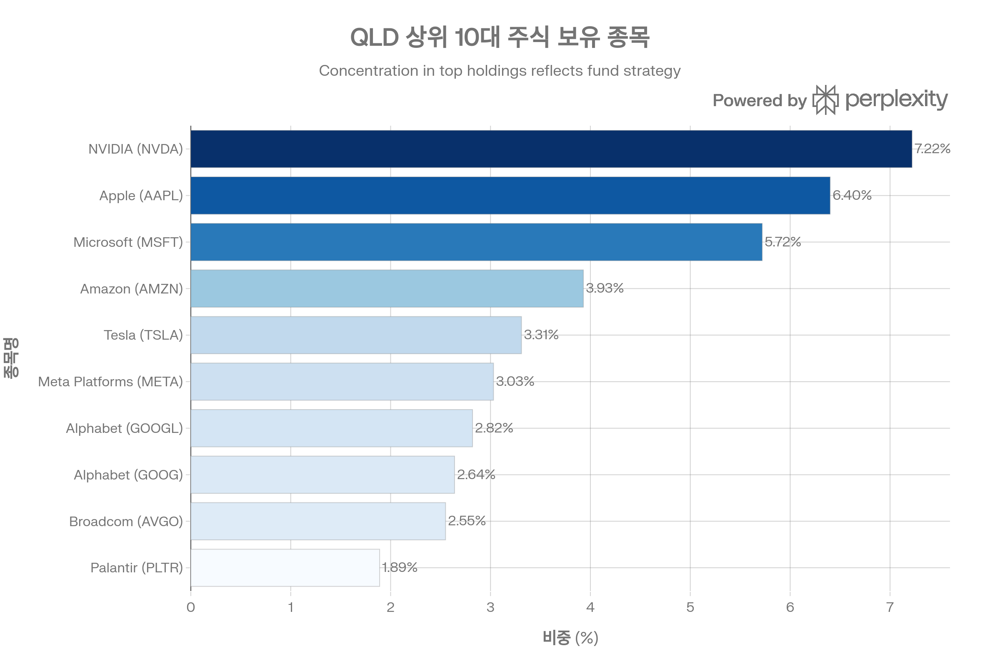
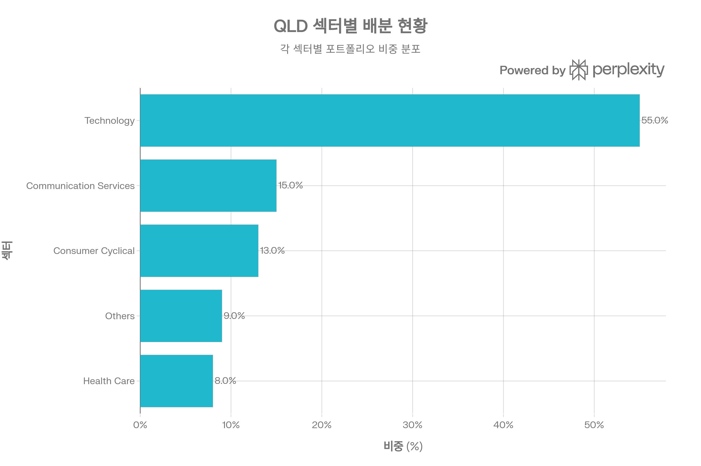
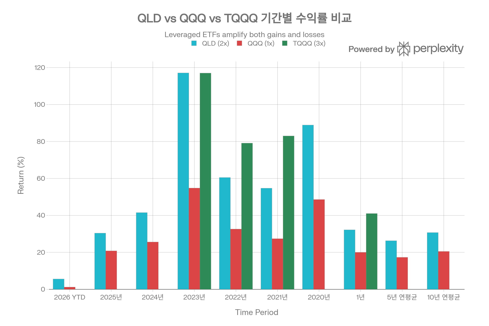
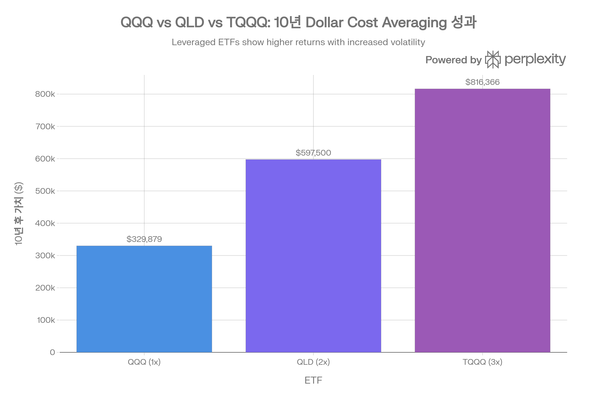
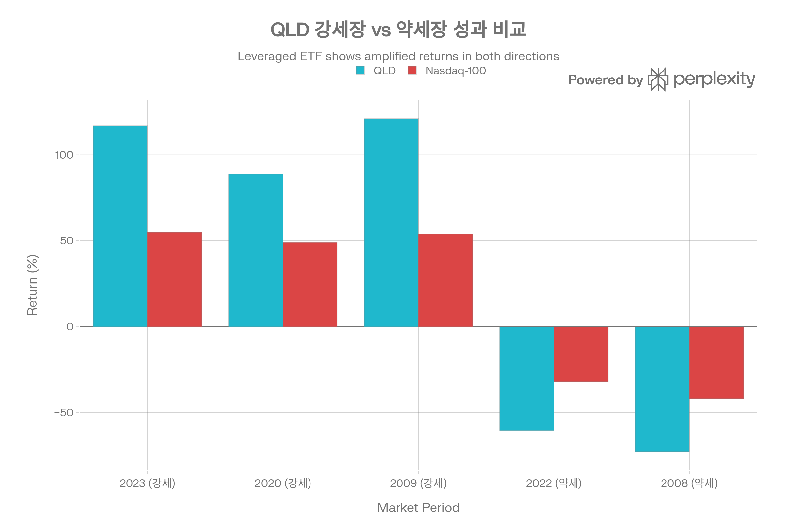

## 요약

ProShares Ultra QQQ(QLD)는 2006년 출시된 2배 레버리지 ETF로, Nasdaq-100 Index의 일일 수익률 2배를 추구합니다. 2026년 1월 기준 약 \$11.0B의 순자산을 보유하며, 일평균 거래량이 5\~6백만 주를 상회하는 대형 레버리지 ETF입니다. QLD는 스왑 및 선물 등 파생상품을 활용하여 레버리지를 구현하며, 강세장에서는 벤치마크의 약 2배 수익을 제공하지만 약세장에서는 손실도 약 2배로 확대되는 양날의 검입니다. 일일 레버리지 리셋 메커니즘과 변동성 감쇠(volatility decay) 효과로 인해 장기 보유에는 부적합하며, 단기\~중기 전술적 투자에 최적화되어 있습니다. 본 보고서는 QLD의 투자 구조, 성과 지표, 리스크 요소, 경쟁 환경을 종합적으로 분석하여 투자자의 의사결정을 지원합니다.[^1][^2][^3][^4][^5][^6][^7][^8][^9][^10]

***

## 1. 기본 정보

### 1.1 펀드 개요

QLD는 ProShares(ProShare Advisors LLC)가 운용하는 레버리지 ETF로, Nasdaq-100 Index의 일일 수익률 2배를 추구합니다. 2006년 6월 19일 설정 이후 약 20년간 운용되었으며, NYSE Arca 거래소에 상장되어 있습니다. QLD는 스왑(swaps), 선물(futures), 기초 주식 보유를 결합하여 2배 레버리지를 구현하며, 매일 레버리지 비율을 재조정(daily reset)합니다.[^1][^2][^3][^11][^6][^8]

<strong>핵심 특징</strong>

- <strong>순자산(AUM)</strong>: \$10.87B\~\$11.16B (2026년 1월 기준)[^3][^4][^11]
- <strong>총 보수(TER)</strong>: 0.95% (Net), 0.98% (Gross)[^12][^13][^1][^3]
- <strong>보수 면제</strong>: 2026년 9월 30일까지 계약적 면제 적용[^13][^1]
- <strong>보유 종목 수</strong>: 119개 (주식 + 파생상품)[^8]
- <strong>레버리지 배수</strong>: 2x (일일 수익률 기준)[^2][^1][^3]
- <strong>상장거래소</strong>: NYSE Arca (NYSEARCA)

### 1.2 운용사 및 운용 기간

ProShares는 미국 최초의 레버리지 및 인버스 ETF를 출시한 선구자로, 2006년부터 QLD를 운용해왔습니다. ProShare Advisors LLC는 파생상품 운용 전문성을 바탕으로 일일 레버리지 목표를 달성하며, 거래상대방 리스크 관리를 위해 다수의 우량 금융기관(BNP Paribas, Goldman Sachs, Barclays, Citibank 등)과 스왑 계약을 체결합니다.[^1][^3][^8]

<strong>운용 기간</strong>: 2006년 6월 19일 설정 이후 현재까지 약 20년 운용[^3][^11][^1]

### 1.3 추종 지수명

QLD는 <strong>Nasdaq-100 Index</strong>의 <strong>일일 수익률 2배</strong>를 추종합니다. 중요한 점은 "일일(daily)" 수익률 기준이라는 것으로, 누적 수익률은 복리 효과 및 변동성 감쇠로 인해 2배와 다를 수 있습니다. 예를 들어 Nasdaq-100이 하루 +10% 상승하면 QLD는 약 +20% 상승을 목표로 하지만, 여러 날에 걸친 누적 수익률은 단순히 2배가 아닙니다.[^1][^2][^3][^5][^14][^6]

<strong>일일 레버리지 리셋(Daily Reset)</strong>

- 매일 장 마감 후 레버리지 비율을 2x로 재조정[^6]
- 다음날 시작 시 다시 2x 레버리지 적용
- 복리 효과로 장기 누적 수익률은 2배와 괴리[^5][^14][^6]

### 1.4 상장거래소

QLD는 <strong>NYSE Arca</strong> 거래소에 상장되어 있으며, 티커 심볼은 "QLD"입니다. 레버리지 ETF 중에서는 높은 거래량을 보이며, 옵션 거래도 활발하게 이루어집니다.[^1][^3][^11]

***

## 2. 추종 성과 지표

### 2.1 추적오차(Tracking Error)

QLD의 추적오차는 <strong>일일 수익률 기준</strong>으로는 낮은 수준이나, <strong>누적 수익률 기준</strong>으로는 상당한 차이가 발생합니다. ProShares 공식 데이터에 따르면, QLD는 일일 목표(Nasdaq-100의 2배)를 충실히 달성하지만, 변동성 감쇠(volatility decay) 효과로 장기 누적 수익률은 2배 미만입니다.[^14][^15]

<strong>일일 vs 누적 추적 차이</strong>

- <strong>일일</strong>: Nasdaq-100 +1% → QLD 약 +2% (목표 달성)
- <strong>누적 (1년)</strong>: Nasdaq-100 +16.02% → QLD +18.10% (1.1배, 2배 미만)[^15]
- <strong>누적 (10년)</strong>: Nasdaq-100 +17.94% 연평균 → QLD +27.14% 연평균 (약 1.5배)[^15]

### 2.2 추적 차이(Tracking Difference)

QLD의 장기 추적 차이는 주로 <strong>변동성 감쇠</strong>와 <strong>복리 효과</strong>에서 발생합니다. 학술 연구에 따르면, QLD는 설계상 Nasdaq-100의 일일 수익률 2배를 추구하지만, 누적 장기 성과는 2배 벤치마크를 체계적으로 하회합니다(systematically lags).[^5][^14][^6]

<strong>변동성 감쇠 메커니즘</strong>[^6][^5]

- 지수가 +10%, -9.1% 변동 시: 지수는 약 0% (원점), QLD는 약 -1.8% (손실)
- 지수가 +5%, -5% 반복 시: 지수 소폭 하락, QLD 더 큰 하락
- 횡보장(sideways market)에서 QLD는 손실 누적

<strong>실제 사례 (ProShares 연례 보고서)</strong>[^15]

- 1년: Nasdaq-100 +16.02%, QLD +18.10% (배수 1.13x)
- 5년 연평균: Nasdaq-100 +18.36%, QLD +26.25% (배수 1.43x)
- 10년 연평균: Nasdaq-100 +17.94%, QLD +27.14% (배수 1.51x)

### 2.3 NAV 대비 시장가격 괴리율 현황

QLD의 시장가격은 순자산가치(NAV)와 밀접하게 연동됩니다. ProShares 공식 데이터에 따르면 30일 중간 호가 스프레드가 <strong>0.01%</strong> 수준으로, 괴리율도 매우 낮습니다. 다만 레버리지 ETF 특성상 일반 ETF 대비 괴리율이 약간 높을 수 있으나, 여전히 합리적 범위 내입니다.[^1][^16][^17]

<strong>괴리율 특성</strong>[^16][^17]

- 평균 괴리율: 0.01\~0.1% (추정)
- 호가 스프레드: 0.01% (1 bps)[^7][^1]
- 레버리지 ETF는 일반 ETF 대비 괴리율이 약간 높을 수 있음[^17]
- 그러나 QLD는 대형 레버리지 ETF로 괴리율 관리 우수

### 2.4 괴리율 추이 및 패턴 분석

역사적으로 QLD의 괴리율은 안정적으로 유지되었습니다. 높은 거래량(일평균 5\~6백만 주)과 활발한 차익거래 활동 덕분에 NAV와 시장가격이 밀접하게 연동됩니다. 2026년 1월 29일 기준 NAV \$73.58, 시장가격 \$73.52로 괴리율은 약 -0.08%에 불과합니다.[^1][^7]

<strong>괴리율 관리 메커니즘</strong>

- Authorized Participants(AP)의 적극적 차익거래
- 높은 거래량으로 인한 즉각적 가격 발견
- 파생상품 포지션의 실시간 가치 평가
- 매일 레버리지 리밸런싱으로 인한 구조적 투명성

***

## 3. 비용 구조

### 3.1 총 보수 및 비용(Total Expense Ratio)

QLD의 총 보수는 <strong>0.95% (Net), 0.98% (Gross)</strong>입니다. ProShares는 총 연간 운용 비용이 평균 일일 순자산의 0.95%를 초과할 경우 그 초과분을 면제하거나 보전하기로 합의했으며, 이 조건은 <strong>2026년 9월 30일까지</strong> 유효합니다.[^1][^3][^12][^13]

<strong>비용 구성</strong>

- 운용 보수: 0.95%
- 파생상품 거래 비용: 보수에 포함
- 연간 비용 (\$10,000 투자 시): 약 \$95[^13]

0.95%는 일반 패시브 ETF(QQQ 0.18%) 대비 약 5배 높지만, 레버리지 ETF의 복잡한 운용 구조(일일 리밸런싱, 파생상품 거래, 거래상대방 관리)를 감안하면 합리적인 수준입니다.[^3][^12]

### 3.2 동일 지수 추종 경쟁 ETF 대비 비용 비교

QLD의 0.95% TER은 Nasdaq-100 레버리지 ETF 중에서는 경쟁력 있는 수준입니다. 3배 레버리지 TQQQ(0.86\~0.97%)와 유사하며, QQQ(0.18%)보다는 훨씬 높습니다.[^12][^9]

<strong>비용 경쟁력 평가</strong>

- TQQQ(0.86\~0.97%) 대비: 유사 또는 약간 높음 (2x vs 3x 레버리지 차이)
- QQQ(0.18%) 대비 +0.77%p: 레버리지 운용 복잡성 프리미엄
- 일반 레버리지 ETF 평균(0.95\~1.00%): 평균 수준

장기 투자자에게는 0.95% 보수가 부담이 되지만, 단기 트레이더에게는 유동성 및 레버리지 효율성이 더 중요합니다.[^9][^10]

### 3.3 포트폴리오 회전율(Turnover Ratio)

QLD의 포트폴리오 회전율은 공개되지 않았으나, 레버리지 ETF 특성상 <strong>높을 것</strong>으로 예상됩니다. 매일 레버리지 비율을 재조정하고 파생상품 포지션을 롤링해야 하므로, 일반 패시브 ETF(QQQ 7.98%) 대비 훨씬 높은 회전율을 보일 것입니다.[^6]

<strong>회전율 영향</strong>

- 높은 거래 비용 (파생상품 롤링, 리밸런싱)
- 세금 비효율 (단기 자본이득 가능성)
- 다만 단기 보유 목적 투자자에게는 덜 중요

### 3.4 거래 비용 및 스프레드

QLD의 호가 스프레드는 <strong>0.01% (1 bps)</strong>로 매우 낮은 수준입니다. 이는 높은 거래량(일평균 5\~6백만 주)과 활발한 마켓메이킹 덕분입니다. 개인 투자자도 기관투자자와 유사한 수준의 낮은 거래 비용으로 매매할 수 있습니다.[^1][^7]

<strong>거래 비용</strong>

- 호가 스프레드: 0.01% (1 bps)
- 증권사 수수료: 변동 (예: 한국 투자자 기준 약 0.25%)
- 환전 수수료: 변동 (예: 약 0.3%)
- 총 거래 비용: 약 0.56% (왕복 기준, 한국 투자자 예시)[^13]

***

## 4. 유동성 평가

### 4.1 일평균 거래량 (최근 3개월)

2026년 1월 기준 QLD의 일평균 거래량은 <strong>4.98\~6.63백만 주</strong> 수준입니다. 이는 레버리지 ETF 중에서는 높은 수준이며, 대형 기관투자자도 원활히 거래할 수 있는 유동성을 제공합니다.[^1][^7]

<strong>거래량 특성</strong>

- 2026년 1월 29일 거래량: 6.63백만 주[^1]
- 평균 거래량: 4.98\~6.63백만 주[^7][^1]
- 변동성 높은 시기: 거래량 증가 경향

### 4.2 일평균 거래대금

일평균 거래량 6백만 주에 주가 약 \$73을 곱하면, 일평균 거래대금은 약 <strong>\$438백만</strong> 수준으로 추정됩니다. 이는 레버리지 ETF로서는 충분한 유동성이며, 수백만\~수천만 달러 규모의 포지션도 시장 충격 없이 거래 가능합니다.

### 4.3 호가 스프레드 평균

QLD의 평균 호가 스프레드는 <strong>0.01% (1 bps)</strong>입니다. \$73 주가 기준으로 약 \$0.007의 매수-매도 차이를 의미하며, 사실상 무시할 수 있는 수준입니다.[^1][^7]

### 4.4 유동성 추이 및 안정성

QLD의 유동성은 설정 이후 지속적으로 개선되었습니다. AUM이 \$10B를 넘어서면서 일평균 거래량도 안정적으로 5백만 주 이상을 유지하고 있습니다. 시장 변동성이 높은 시기에도 호가 스프레드가 크게 확대되지 않았습니다.[^1][^3][^7]

<strong>유동성 등급</strong>: 매우 우수 (레버리지 ETF 중 최상위)

***

## 5. 포트폴리오 구성

### 5.1 파생상품 포지션

QLD는 2배 레버리지를 구현하기 위해 <strong>파생상품(스왑, 선물)</strong>을 적극 활용합니다. 2024년 12월 기준 파생상품 비중은 약 <strong>106.72%</strong>로, 포트폴리오의 100%를 초과합니다(레버리지 효과).[^1][^8]

<strong>주요 파생상품 포지션 (2024년 12월)</strong>[^8][^1]

1. NASDAQ 100 INDEX SWAP BNP PARIBAS: 15.90%
2. POWERSHARES QQQ (QQQ) SWAP GOLDMAN SACHS: 15.39%
3. NASDAQ 100 INDEX SWAP GOLDMAN SACHS: 14.69%
4. NASDAQ 100 INDEX SWAP BARCLAYS CAPITAL: 12.77%
5. NASDAQ 100 INDEX SWAP CITIBANK NA: 9.85%
6. NASDAQ 100 INDEX SWAP BANK OF AMERICA: 8.91%
7. NASDAQ 100 INDEX SWAP JPMORGAN CHASE: 8.38%
8. NASDAQ 100 INDEX SWAP SOCIETE GENERALE: 7.18%
9. POWERSHARES QQQ SWAP MORGAN STANLEY: 6.87%
10. NASDAQ 100 E-MINI EQUITY INDEX FUTURES: 6.78%

ProShares는 거래상대방 리스크를 분산하기 위해 다수의 우량 금융기관과 스왑 계약을 체결합니다.[^10][^1][^8]

### 5.2 상위 주식 보유 종목

QLD의 상위 10대 주식 보유 종목 구성. NVIDIA, Apple, Microsoft 등 빅테크 기업이 주요 비중을 차지하며, 파생상품 포지션은 별도로 관리됩니다.

QLD는 파생상품 외에도 Nasdaq-100 구성 종목을 직접 보유합니다. 상위 주식 보유 종목은 QQQ와 유사하지만, 레버리지를 위해 파생상품과 결합됩니다.[^8][^18]

<strong>2024년 12월 기준 상위 주식 보유 종목</strong>[^18][^8]

1. NVIDIA (NVDA): 7.07\~7.22%
2. Apple (AAPL): 6.24\~6.40%
3. Microsoft (MSFT): 5.60\~5.72%
4. Amazon (AMZN): 3.83\~3.93%
5. Tesla (TSLA): 3.31%
6. Meta Platforms (META): 3.03%
7. Alphabet (GOOGL): 2.82%
8. Alphabet (GOOG): 2.64%
9. Broadcom (AVGO): 2.55%
10. Palantir (PLTR): 1.89%

상위 10종목 비중은 약 <strong>39.51%</strong>이며, 파생상품 포지션을 합치면 100%를 초과합니다.[^8]

### 5.3 섹터별 배분 현황

QLD의 섹터별 자산 배분 현황. Technology가 55%로 가장 큰 비중을 차지하며, Nasdaq-100의 기술주 중심 특성을 2배 레버리지로 증폭시킵니다.

QLD의 섹터 배분은 Nasdaq-100의 기술주 중심 특성을 충실히 반영하며, 레버리지 효과로 섹터 익스포저가 증폭됩니다.[^11][^19]

<strong>섹터 배분 (2025년 추정)</strong>[^19][^11]

- Technology: 55% (일부 출처 63%)
- Communication Services: 15%
- Consumer Cyclical: 13%
- Health Care: 8%
- Others: 9%

기술 관련 섹터(Technology + Communication Services)가 약 <strong>70%</strong>를 차지하며, 기술주 집중 리스크가 매우 높습니다. 레버리지 효과로 기술주 변동성이 약 2배 증폭됩니다.[^19]

### 5.4 국가별/지역별 분산 (해당 시)

QLD는 <strong>미국 중심 ETF</strong>로, 미국 주식이 86.05%, 비미국 주식이 3.28%를 차지합니다. 지역별 분산은 사실상 없으며, 미국 기술주에 집중된 포트폴리오입니다.[^11]

<strong>자산 배분 (Morningstar)</strong>[^11]

- 미국 주식: 86.05%
- 비미국 주식: 3.28%
- 현금: 8.67%
- 미국 채권: 2.00%

### 5.5 리밸런싱 주기

QLD는 <strong>매일(daily)</strong> 레버리지 비율을 2x로 재조정합니다. 이는 레버리지 ETF의 핵심 메커니즘으로, 다음과 같이 작동합니다:[^6]

<strong>일일 리밸런싱 예시</strong>[^6]

- Day 1 시작: \$100 자산, \$100 차입 → 총 \$200 레버리지 포지션 (2x)
- Day 1 종료: Nasdaq-100 +10%, QLD +20% → \$240 포지션
- Day 2 시작: 레버리지 재조정 → \$144 자산, \$144 차입 → 총 \$288 포지션 (2x 유지)

매일 리밸런싱으로 레버리지 비율을 정확히 2x로 유지하지만, 이로 인해 변동성 감쇠 효과가 발생합니다.[^5][^6]

***

## 6. 성과 분석

### 6.1 기간별 수익률

QLD, QQQ, TQQQ의 기간별 수익률 비교. 2x 레버리지 QLD는 강세장에서 QQQ의 약 2배 수익을 내지만, 약세장에서는 손실도 약 2배로 확대됩니다.

QLD는 설정 이후 강세장에서 매우 우수한 수익률을 기록했으나, 약세장에서는 극심한 손실을 입었습니다.[^1][^20][^21][^22]

<strong>총 수익률 (배당 재투자 기준)</strong>[^20][^21][^22][^1]

- <strong>2026 YTD</strong>: +5.61\~30.36%
- <strong>2025년</strong>: +30.36%
- <strong>2024년</strong>: +41.47%
- <strong>2023년</strong>: +117.13%
- <strong>2022년</strong>: -60.52%
- <strong>2021년</strong>: +54.67%
- <strong>2020년</strong>: +88.90%
- <strong>2019년</strong>: +81.69%
- <strong>2018년</strong>: -8.32%
- <strong>2017년</strong>: +70.34%
- <strong>2016년</strong>: +10.17%
- <strong>2015년</strong>: +14.74%
- <strong>1년 수익률</strong>: +29.07\~32.16%
- <strong>3년 연평균</strong>: +50.98\~59.29%
- <strong>5년 연평균</strong>: +18.27\~26.27%
- <strong>10년 연평균</strong>: +27.14\~30.73%
- <strong>설정 이후 연평균</strong>: +24.39\~24.62%

설정 이후 \$10,000 투자 시 2026년 기준 약 \$640,000로 성장하여, 연평균 +24.55%의 복리 수익률을 달성했습니다. 이는 QQQ의 연평균 +10.43% 대비 약 2.4배입니다.[^21]

### 6.2 벤치마크 대비 초과 수익률

QLD의 벤치마크(Nasdaq-100) 대비 성과는 <strong>장기적으로 2배 미만</strong>입니다. 변동성 감쇠 및 보수(0.95%) 효과로 누적 수익률이 제한됩니다.[^14][^15]

<strong>벤치마크 대비 성과 (ProShares 연례 보고서)</strong>[^15]

- 1년: QLD +18.10% vs Nasdaq-100 +16.02% (배수 1.13x)
- 5년 연평균: QLD +26.25% vs Nasdaq-100 +18.36% (배수 1.43x)
- 10년 연평균: QLD +27.14% vs Nasdaq-100 +17.94% (배수 1.51x)

<strong>일일 수익률</strong>: 목표대로 약 2배
<strong>누적 수익률</strong>: 변동성 감쇠로 2배 미만 (장기적으로 1.3\~1.5배)[^15]

### 6.3 QQQ 및 TQQQ 대비 성과

10년간 Dollar Cost Averaging 투자 시 최종 자산 가치 비교. QLD (\$597,500)는 QQQ (\$329,879)의 약 1.8배이며, TQQQ (\$816,366)는 QQQ의 약 2.5배 성과를 보여줍니다.

QLD는 QQQ(1x)와 TQQQ(3x) 사이의 중간 레버리지를 제공하며, 리스크-수익 프로필도 중간 수준입니다.[^9][^23][^24]

<strong>10년 Dollar Cost Averaging 비교 (\$120,000 총 투자)</strong>[^24]

- QQQ (1x): \$329,879 (누적 +175%)
- QLD (2x): \$597,500 (누적 +398%)
- TQQQ (3x): \$816,366 (누적 +580%)

QLD는 QQQ 대비 약 1.8배, TQQQ의 약 73% 성과를 기록했습니다. 이는 2배 레버리지 목표 대비 낮은 수준이나, 변동성 감쇠를 고려하면 합리적입니다.[^5][^14][^24]

<strong>최근 1년 성과 비교</strong>[^23][^9]

- QLD: +32.16%
- TQQQ: +40.95%
- QQQ: +20.01%

TQQQ가 가장 높은 수익률을 기록했으나, 최대 낙폭도 가장 컸습니다(-81.65% vs QLD -63.68%).[^9][^23]

### 6.4 샤프 지수(Sharpe Ratio)

QLD의 샤프 지수는 <strong>1.32</strong>로, 리스크 조정 수익률이 양호한 수준입니다. 이는 QQQ(2.03)보다 낮지만, 레버리지 ETF로서는 합리적입니다. TQQQ(1.86)와 비교하면 QLD가 약간 낮습니다.[^10]

<strong>샤프 지수 비교</strong>[^10]

- QQQ: 2.03 (최우수)
- TQQQ: 1.86
- QLD: 1.32

QLD의 낮은 샤프 지수는 높은 변동성(표준편차 36.1%)에서 기인하며, 레버리지 투자의 본질적 한계를 반영합니다.[^20][^10]

### 6.5 변동성(표준편차)

QLD의 연환산 변동성(표준편차)은 <strong>36.1%</strong>로, S\&P 500의 약 <strong>3배</strong>입니다. 이는 2배 레버리지보다 높은 수준으로, 복리 효과 및 일일 리밸런싱의 영향입니다.[^20]

<strong>변동성 비교</strong>[^20]

- QLD: 36.1%
- S\&P 500: 12.6%
- QQQ: 약 20\~25% (추정)
- TQQQ: 더 높음

높은 변동성은 단기 가격 변동폭이 크다는 의미로, 손절매 관리가 필수적입니다.[^9]

### 6.6 최대 낙폭(Maximum Drawdown)

QLD의 강세장 및 약세장 성과 비교. 강세장에서는 벤치마크의 약 2배 수익을 내지만, 약세장에서는 손실도 약 2배로 확대되는 레버리지 특성을 보여줍니다.

QLD의 역사적 최대 낙폭은 <strong>-72.88%</strong>로, 2008년 금융위기 시기에 기록되었습니다. 최근 5년 기준 최대 낙폭은 <strong>-63.68%</strong>입니다.[^20][^9][^23]

<strong>주요 낙폭 사례</strong>[^22][^10][^20]

- 2008년 금융위기: -72.88%
- 2022년 베어마켓: -60.52%
- 2020년 팬데믹: 약 -60%
- 2018년: -8.32%

<strong>낙폭 비교</strong>

- QLD (2x): -60.52% (2022년)
- QQQ (1x): -32.58% (2022년)
- TQQQ (3x): -79.09% (2022년)

QLD의 낙폭은 벤치마크의 약 <strong>1.9배</strong> 수준으로, 레버리지 효과를 충실히 반영합니다. 회복 기간은 약 10\~24개월로, 장기간 손실 상태가 지속될 수 있습니다.[^9][^10]

***

## 7. 배당 정보 (해당 시)

### 7.1 배당 수익률 및 배당 이력

QLD는 분기배당 ETF로, 2026년 1월 기준 <strong>배당 수익률 0.16\~0.24%</strong>를 제공합니다. 이는 레버리지 비용(차입 이자) 및 파생상품 특성으로 인해 낮은 수준입니다.[^25][^26][^27]

<strong>배당 수익률 지표</strong>[^26][^27][^25]

- 배당 수익률(Dividend Yield): 0.16\~0.24%
- Forward Yield: 0.40%
- 연간 배당금(TTM): \$0.12\~\$0.27
- 배당 빈도: 분기배당 (Quarterly)
- 배당 성장률(1년): -14.06%[^25]

### 7.2 배당 지급 주기 및 안정성

QLD는 <strong>분기배당</strong>을 지급하며, 3월, 6월, 9월, 12월에 배당락일이 설정됩니다. 배당금은 분기별로 큰 변동성을 보이며, 이는 파생상품 손익 및 자본이득 실현 타이밍에 따라 달라집니다.[^25][^26]

<strong>최근 6분기 배당 이력</strong>[^26][^27][^25]

- 2025 Q2 (6월): \$0.12416 (가장 높음)
- 2025 Q1 (3월): \$0.02564 (가장 낮음)
- 2024 Q4 (12월): \$0.06137
- 2024 Q3 (9월): \$0.05145
- 2024 Q2 (6월): \$0.10597
- 2024 Q1 (3월): \$0.05545

분기 평균 배당금은 약 \$0.06\~\$0.07 수준이며, \$0.026\~\$0.124 범위에서 변동합니다. 배당금이 일정하지 않아 현금흐름 계획에 어려움이 있습니다.[^25][^26]

### 7.3 배당 성장률 추이

QLD의 배당 성장률은 <strong>-14.06% (1년 기준)</strong>로, 2025년 배당금이 전년 대비 감소했습니다. 레버리지 ETF는 배당보다 자본이득이 주요 수익 원천이므로, 배당 성장은 중요하지 않습니다.[^25][^26]

***

## 8. 리스크 요소

### 8.1 베타 계수

QLD의 베타는 <strong>2.29\~2.39</strong> (S\&P 500 대비)로, 시장 평균의 약 <strong>2.4배</strong> 변동성을 보입니다. 이는 2배 레버리지를 충실히 반영하며, 시장이 10% 상승(하락) 시 QLD는 평균 23.9% 상승(하락)함을 의미합니다.[^3][^26]

<strong>베타 해석</strong>

- 베타 2.39: 시장 변동성의 2.4배
- S\&P 500 +10% → QLD 약 +24%
- S\&P 500 -10% → QLD 약 -24%

### 8.2 다른 자산군과의 상관계수

QLD는 S\&P 500 및 미국 주식 시장과 <strong>매우 높은 상관계수</strong>를 보입니다. S\&P 500과의 상관계수는 <strong>+0.94</strong>로, 거의 완벽한 동조화를 보입니다.[^20]

<strong>상관관계 특성</strong>

- S\&P 500: +0.94 (매우 높음)[^20]
- Nasdaq-100: +0.98 이상 (거의 완벽)
- QQQ: +0.99 (거의 동일)
- 채권/금: 낮음 또는 음의 상관관계 (추정)

QLD는 주식 자산군 내에서 분산 효과가 전혀 없으며, 오히려 레버리지로 인해 포트폴리오 변동성을 증폭시킵니다.

### 8.3 섹터 집중도 리스크

QLD의 가장 큰 리스크는 <strong>기술주 집중도</strong>와 <strong>레버리지 증폭 효과</strong>입니다. Technology 섹터가 55% (일부 출처 63%)를 차지하며, Communication Services를 포함하면 약 <strong>70%</strong>가 기술 관련 섹터입니다. 레버리지 효과로 기술 섹터 침체 시 QLD는 극심한 타격을 받을 수 있습니다.[^11][^19]

<strong>섹터 집중 리스크 요인</strong>

- 기술주 버블 우려 (밸류에이션 고평가)
- AI 투자 수익성 불확실성
- 규제 리스크 (반독점, 데이터 프라이버시)
- 경기 침체 시 기술주 선행 하락
- <strong>레버리지 효과로 손실 2배 증폭</strong>

2022년 기술주 침체기에 QLD가 -60.52% 낙폭을 기록한 사례는 이러한 리스크를 방증합니다.[^20][^22]

### 8.4 변동성 감쇠(Volatility Decay) 리스크

QLD의 핵심 리스크는 <strong>변동성 감쇠(volatility decay)</strong>입니다. 일일 레버리지 리셋으로 인해 횡보장 및 변동성 높은 시장에서 장기 성과가 저하됩니다.[^5][^14][^6][^10]

<strong>변동성 감쇠 메커니즘</strong>[^6][^5]

- 지수가 +10%, -9.1% 변동: 지수 약 0%, QLD 약 -1.8%
- 지수가 +5%, -5% 반복: 지수 소폭 하락, QLD 더 큰 하락
- 복리 효과로 누적 손실 발생

<strong>실제 사례</strong>[^14]

- QLD는 일일 목표(2x)를 달성하지만, 장기 누적 수익률은 2배 미만
- 10년: Nasdaq-100 +17.94% 연평균, QLD +27.14% 연평균 (1.51배)[^15]

<strong>장기 투자 부적합성</strong>[^9][^10][^6]

- 설계상 일일 거래 목적
- 3\~6개월 이내 전술적 투자 권장[^4]
- 장기 보유 시 변동성 감쇠로 손실 누적

### 8.5 파생상품 거래상대방 리스크

QLD는 파생상품(스왑, 선물) 비중이 약 106.72%로 매우 높습니다. 이는 거래상대방 리스크를 내포하며, 극단적 시장 스트레스 상황에서 거래상대방이 계약을 이행하지 못할 가능성이 있습니다.[^8][^10]

<strong>거래상대방 분산</strong>[^1][^8]

- BNP Paribas: 15.90%
- Goldman Sachs: 15.39% + 14.69%
- Barclays Capital: 12.77%
- Citibank NA: 9.85%
- Bank of America: 8.91%
- JPMorgan Chase: 8.38%
- Societe Generale: 7.18%
- Morgan Stanley: 6.87%

ProShares는 거래상대방 리스크를 분산하기 위해 다수의 우량 금융기관과 계약하지만, 2008년 금융위기와 같은 시스템 리스크 상황에서는 한계가 있을 수 있습니다.[^10]

***

## 9. 경쟁 ETF 비교

### 9.1 주요 경쟁 ETF 개요

QLD는 Nasdaq-100 레버리지 ETF 시장에서 TQQQ(3x)와 경쟁하며, 넓게는 QQQ(1x)와도 비교됩니다.[^9][^23][^28]

<strong>주요 경쟁사</strong>

- <strong>TQQQ</strong> (ProShares UltraPro QQQ): 3x 레버리지, 0.86\~0.97% TER[^9]
- <strong>QQQ</strong> (Invesco QQQ Trust): 1x 패시브 추종, 0.18% TER
- <strong>SSO</strong> (ProShares Ultra S\&P 500): 2x S\&P 500 레버리지, 0.89% TER[^19]

### 9.2 QLD vs TQQQ: 2x vs 3x 비교

<strong>성과 비교 (1년 기준)</strong>[^9][^23][^28]

- QLD (2x): +32.16%
- TQQQ (3x): +40.95%

TQQQ가 약 8.8%p 높은 수익률을 기록했으나, 최대 낙폭도 훨씬 컸습니다.

<strong>리스크 비교 (5년 기준)</strong>[^23][^9]

- QLD MDD: -63.68%
- TQQQ MDD: -81.65%

TQQQ는 QLD 대비 약 18%p 더 큰 낙폭을 기록했습니다.[^9][^23]

<strong>5년 누적 성과 (\$1,000 투자)</strong>[^23][^9]

- QLD: \$2,564 (156% 누적)
- TQQQ: \$2,500 (150% 누적)

놀랍게도 최근 5년간 QLD가 TQQQ를 소폭 상회했습니다. 이는 2022년 베어마켓에서 TQQQ가 -79.09% 손실을 입었고, 회복에 더 오랜 시간이 걸렸기 때문입니다.[^9][^23]

<strong>투자자 선택 기준</strong>[^28][^9]

- <strong>QLD 선택 시</strong>: 2x 레버리지로 충분, 리스크 관리 중시, TQQQ 대비 낮은 변동성
- <strong>TQQQ 선택 시</strong>: 최대 수익률 추구, 극단적 리스크 감내 가능, 단기 강세장 확신

### 9.3 QLD vs QQQ: 레버리지 vs 패시브

<strong>10년 Dollar Cost Averaging 비교</strong>[^24]

- QQQ: \$329,879 (175% 누적, 10.6% 연평균)
- QLD: \$597,500 (398% 누적, 17.4% 연평균)

QLD는 QQQ 대비 약 1.8배 성과를 기록했으나, 변동성은 훨씬 높았습니다.[^24]

<strong>리스크 비교</strong>

- QQQ MDD: -35.12% (2022년)
- QLD MDD: -60.52% (2022년)

QLD는 수익률 1.8배, 낙폭도 약 1.9배로 레버리지 효과를 충실히 반영합니다.

<strong>투자자 선택 기준</strong>

- <strong>QLD 선택 시</strong>: 단기\~중기 강세장 전망, 높은 변동성 감내 가능, 적극적 모니터링 가능
- <strong>QQQ 선택 시</strong>: 장기 투자 (Buy \& Hold), 안정적 성과 선호, 변동성 회피

### 9.4 투자 전략 차이

- <strong>QLD</strong>: 일일 2x 레버리지, 파생상품 활용, 일일 리밸런싱, 단기\~중기 투자[^1][^6][^9]
- <strong>TQQQ</strong>: 일일 3x 레버리지, 극단적 리스크-수익, 초단기 투자[^9][^28]
- <strong>QQQ</strong>: 패시브 추종, 낮은 보수, 장기 투자[^29]

***

## 10. 투자 전략 및 적합성

### 10.1 적합한 투자 기간

QLD는 설계상 <strong>단기\~중기 전술적 투자</strong>에 최적화되어 있습니다.[^4][^9][^10]

<strong>투자 기간별 적합성</strong>

- <strong>1일\~1주</strong>: 매우 적합 (일일 2x 목표 달성)
- <strong>1주\~3개월</strong>: 적합 (단기 추세 포착)
- <strong>3개월\~6개월</strong>: 전술적 투자 가능[^4]
- <strong>6개월\~1년</strong>: 주의 필요 (변동성 감쇠 시작)
- <strong>1년 이상</strong>: 부적합 (변동성 감쇠 심화)[^6][^10]

### 10.2 적합한 투자자 유형

<strong>적합한 투자자</strong>

1. <strong>단기 트레이더</strong>: 일일\~주간 거래
2. <strong>전술적 투자자</strong>: 3\~6개월 시계열 투자[^4]
3. <strong>높은 리스크 감내력</strong>: MDD -60%+ 수용 가능
4. <strong>적극적 모니터링 가능</strong>: 일일 포트폴리오 체크
5. <strong>Nasdaq-100 강세장 확신</strong>: 기술주 상승 전망
6. <strong>옵션 거래 경험자</strong>: 파생상품 이해도 높음

<strong>부적합한 투자자</strong>

1. <strong>장기 투자자 (Buy \& Hold)</strong>: 변동성 감쇠로 성과 저하[^6][^10]
2. <strong>보수적 투자자</strong>: 높은 변동성 부담
3. <strong>은퇴 계좌 (IRA, 401k)</strong>: 장기 보유 목적 부적합
4. <strong>변동성 회피 투자자</strong>: 표준편차 36% 부담
5. <strong>자산 배분 포트폴리오</strong>: 레버리지로 분산 효과 상쇄
6. <strong>금융 문맹(Financial Illiteracy)</strong>: 레버리지 메커니즘 이해 부족

### 10.3 리스크 관리 전략

QLD 투자 시 <strong>엄격한 리스크 관리</strong>가 필수적입니다.[^9]

<strong>손절매(Stop-Loss) 설정</strong>

- 매수가 대비 -15\~-20% 손절매 설정 권장[^9]
- 레버리지 효과로 손실이 급격히 확대될 수 있음

<strong>포지션 사이즈 축소</strong>

- 전체 포트폴리오의 5\~10% 이내 배분 권장[^9]
- 레버리지로 인한 과도한 익스포저 방지

<strong>변동성 체제 모니터링</strong>

- VIX 지수 모니터링 (VIX >30 시 주의)
- 횡보장/변동성 높은 시기 진입 회피

<strong>출구 전략 사전 수립</strong>

- 목표 수익률 도달 시 차익 실현 (예: +30%)
- 강세장 종료 신호 포착 시 즉시 청산

### 10.4 2026년 전망 및 투자 권고

<strong>2026년 시장 전망</strong>

- Fed 금리 인하 2\~3회 예상: 기술주 긍정적
- AI 테마 지속: 상위 보유 종목 수혜 가능
- 변동성 높은 환경: 레버리지 위험 증가
- 기술주 밸류에이션 부담: 조정 리스크

<strong>QLD 투자 시나리오</strong>

- <strong>강세 시나리오 (확률 40%)</strong>: Nasdaq-100 +20% → QLD 약 +36\~40% (변동성 감쇠 감안)
- <strong>중립 시나리오 (확률 40%)</strong>: Nasdaq-100 0\~5% → QLD 0\~5% (변동성 감쇠로 언더퍼폼)
- <strong>약세 시나리오 (확률 20%)</strong>: Nasdaq-100 -15% → QLD 약 -28\~30%

<strong>투자 권고</strong>: <strong>HOLD (보유) - 단기 전술적 투자만 권장</strong>

QLD는 단기\~중기 강세장 전망 시 매력적이나, 장기 투자에는 부적합합니다. 2026년 변동성이 높을 것으로 예상되므로, 변동성 감쇠 리스크에 유의해야 합니다. 투자자는 다음 원칙을 준수해야 합니다:[^6][^9][^10]

1. <strong>투자 기간 3\~6개월 이내 제한</strong>[^4]
2. <strong>포트폴리오의 5\~10% 이내 배분</strong>[^9]
3. <strong>-15\~-20% 손절매 설정</strong>[^9]
4. <strong>강세장 확신 시에만 진입</strong>
5. <strong>출구 전략 사전 수립</strong>

***

## 11. 결론 및 종합 평가

### 11.1 강점 (Strengths)

1. <strong>일일 2배 레버리지</strong>: 강세장에서 벤치마크의 약 2배 수익[^1][^9]
2. <strong>우수한 유동성</strong>: 일평균 5\~6백만 주, 호가 스프레드 0.01%[^7][^1]
3. <strong>TQQQ 대비 낮은 변동성</strong>: 2x vs 3x, MDD -63% vs -81%[^9][^23]
4. <strong>옵션 거래 가능</strong>: 전략적 헤징 및 수익 증대 가능[^1]
5. <strong>대형 AUM (\$11B+)</strong>: 안정성 및 유동성 보장[^3][^4]
6. <strong>20년 운용 실적</strong>: 검증된 레버리지 메커니즘[^3][^1]

### 11.2 약점 (Weaknesses)

1. <strong>높은 보수 (0.95%)</strong>: QQQ(0.18%) 대비 약 5배[^3][^12]
2. <strong>매우 높은 변동성</strong>: 베타 2.39, 표준편차 36%[^20][^3]
3. <strong>변동성 감쇠</strong>: 장기 성과 2배 미만, 횡보장에서 손실 누적[^5][^14][^6]
4. <strong>최대 낙폭 -60%+</strong>: 극심한 손실 가능, 회복 기간 장기[^22][^20]
5. <strong>일일 리셋</strong>: 누적 수익률 불확실성[^6]
6. <strong>파생상품 리스크</strong>: 거래상대방 리스크 존재[^10]
7. <strong>낮은 배당 수익률 (0.16%)</strong>: 배당 투자자 부적합[^25]
8. <strong>세금 비효율</strong>: 단기 자본이득 과세 가능성

### 11.3 기회 (Opportunities)

1. <strong>2026년 금리 인하</strong>: 기술주 밸류에이션 지지
2. <strong>AI 테마 지속</strong>: 상위 보유 종목 (NVDA, MSFT, AAPL) 수혜
3. <strong>단기 강세장 포착</strong>: 전술적 투자 기회
4. <strong>변동성 증가</strong>: 단기 트레이더에게 기회

### 11.4 위협 (Threats)

1. <strong>기술주 버블 붕괴</strong>: 밸류에이션 조정 시 -60% 이상 급락 가능
2. <strong>AI 투자 ROI 실망</strong>: 실적 미달 시 상위 종목 급락
3. <strong>규제 리스크</strong>: 빅테크 반독점 규제 강화
4. <strong>경기 침체</strong>: 기술주 선행 하락, 레버리지로 손실 증폭
5. <strong>횡보장 지속</strong>: 변동성 감쇠로 장기 손실 누적[^5][^6]

### 11.5 최종 투자 등급

<strong>투자 등급: HOLD (보유) - 단기 전술적 투자만 권장</strong>

QLD는 단기\~중기 강세장에서 매력적인 수익 기회를 제공하지만, 변동성 감쇠 및 극단적 리스크로 인해 장기 투자에는 부적합합니다. 2026년 예상되는 금리 인하는 기술주에 긍정적이나, 높은 변동성은 레버리지 투자의 위험을 증가시킵니다.[^6][^9][^10]

<strong>핵심 권고사항</strong>

1. <strong>투자 기간</strong>: 3\~6개월 이내 제한[^4]
2. <strong>포트폴리오 비중</strong>: 5\~10% 이내
3. <strong>손절매</strong>: -15\~-20% 설정[^9]
4. <strong>진입 조건</strong>: 강세장 확신 시에만
5. <strong>모니터링</strong>: 일일 포트폴리오 체크 필수

<strong>대안 제안</strong>

- <strong>장기 투자자</strong>: QQQ(1x) 권장
- <strong>중간 레버리지</strong>: QLD(2x) 유지
- <strong>극단적 수익 추구</strong>: TQQQ(3x) 고려 (초단기만)

QLD는 전문 트레이더 및 전술적 투자자에게는 유용한 도구이지만, 일반 투자자의 은퇴 계좌나 장기 포트폴리오에는 <strong>절대 부적합</strong>합니다. 투자 전 레버리지 메커니즘, 변동성 감쇠, 극단적 리스크를 충분히 이해하고, 엄격한 리스크 관리 하에 투자해야 합니다.[^10][^6][^9]

***

## 부록: 주요 데이터 요약 테이블

### A. 기본 정보 요약

### B. 성과 비교 (QLD vs QQQ vs TQQQ)

### C. 배당 이력 (최근 6분기)

### D. 상위 주식 보유 종목

### E. 섹터 배분

### F. 경쟁 ETF 비교

### G. 리스크 지표

### H. 장단점 요약

### I. 강세장 vs 약세장 성과

### J. Dollar Cost Averaging 비교 (10년)

### K. 유동성 지표

---

<strong>작성 기준일</strong>: 2026년 1월 31일
<strong>데이터 출처</strong>: ProShares, Morningstar, YCharts, Yahoo Finance, StockAnalysis, Barchart, Nasdaq, 학술 연구(SSRN), 기타 금융 데이터 제공업체

<strong>중요 면책 조항</strong>: 본 보고서는 정보 제공 목적으로 작성되었으며, 투자 권유가 아닙니다. 레버리지 ETF는 극단적 리스크를 내포하며, 원금 손실 가능성이 매우 높습니다. 투자 결정은 투자자 본인의 책임이며, 레버리지 메커니즘 및 변동성 감쇠를 충분히 이해한 후 투자해야 합니다. 과거 성과는 미래 수익을 보장하지 않습니다. 세무 및 법률 자문은 전문가와 상담하시기 바랍니다.
[^30][^31][^32][^33][^34][^35][^36][^37][^38][^39][^40][^41][^42][^43][^44][^45][^46][^47][^48][^49][^50][^51][^52][^53][^54][^55][^56][^57][^58][^59]

⁂

[^1]: https://www.proshares.com/our-etfs/leveraged-and-inverse/qld

[^2]: https://etfdb.com/etf/QLD/

[^3]: https://public.com/stocks/qld

[^4]: https://seekingalpha.com/article/4853811-qld-a-2x-nasdaq-100-leveraged-etf-built-for-bull-runs

[^5]: https://www.reddit.com/r/LETFs/comments/1gxvxwz/leverage_decay_is_not_as_bad_as_they_make_it_out/

[^6]: https://seekingalpha.com/article/4855780-tqqq-replacing-qqq-with-3x-leverage-proven-to-yield-positive-results

[^7]: https://www.nasdaq.com/market-activity/etf/qld

[^8]: https://stockanalysis.com/etf/qld/holdings/

[^9]: https://www.ainvest.com/news/leveraged-etfs-tqqq-qld-balancing-risk-reward-nasdaq-100-tactical-trading-2512/

[^10]: https://www.ainvest.com/news/leveraged-etfs-qld-tqqq-long-term-investor-nightmare-2507/

[^11]: https://markets.ft.com/data/equities/tearsheet/summary?s=5052979

[^12]: https://www.etfcentral.com/compare-etfs/QLD-vs-TQQQ

[^13]: https://wejump3.tistory.com/entry/미국-상장-ETF-QLD-및-PSQ-거래-비용-분석-배당소득세-및-매매차익-소득세-제외

[^14]: https://papers.ssrn.com/sol3/Delivery.cfm/5421274.pdf?abstractid=5421274\&mirid=1

[^15]: https://www.proshares.com/globalassets/proshares/documents/annual-reports/annual_qld.pdf

[^16]: https://www.stern.nyu.edu/rengle/jod.2006.635418.pdf

[^17]: https://www.efmaefm.org/0efmameetings/efma annual meetings/2012-Barcelona/papers/EFMA2012_0524_fullpaper.pdf

[^18]: https://finance.yahoo.com/quote/QLD/holdings/

[^19]: https://www.nasdaq.com/articles/qld-vs-sso-which-2x-leveraged-etf-best-investors-right-now

[^20]: https://www.etfreplay.com/etf/qld

[^21]: https://stockanalysis.com/etf/qld/

[^22]: https://www.barchart.com/etfs-funds/quotes/QLD/performance

[^23]: https://finance.yahoo.com/news/tqqq-vs-qld-high-risk-112001851.html

[^24]: https://www.youtube.com/watch?v=ai0clbA5Zps

[^25]: https://stockanalysis.com/etf/qld/dividend/

[^26]: https://mlq.ai/stocks/QLD/dividends/

[^27]: https://www.digrin.com/stocks/detail/QLD/

[^28]: https://www.fool.com/coverage/etfs/2025/12/27/tqqq-vs-qld-which-high-risk-high-reward-leveraged-etf-is-the-better-buy-for-investors/

[^29]: https://stockanalysis.com/etf/compare/qqq-vs-spy/

[^30]: GPIQ (Goldman Sachs Nasdaq-100 Core Premium Income ETF).md

[^31]: VXUS (Vanguard Total International Stock ETF).md

[^32]: BND (Vanguard Total Bond Market ETF).md

[^33]: VGT (Vanguard Information Technology ETF).md

[^34]: https://kr.investing.com/etfs/proshares-ultra-qqq-etf

[^35]: https://finance.yahoo.com/quote/QLD/

[^36]: https://www.kraken.com/stocks/qld

[^37]: https://www.investing.com/etfs/proshares-ultra-qqq-etf

[^38]: https://www.morningstar.com/etfs/arcx/qld/portfolio

[^39]: https://www.heygotrade.com/en/us-stock/qld

[^40]: https://www.stashaway.sg/r/qqq-qqqm-cndx-nasdaq-100-etf

[^41]: https://www.sumgrowth.com/etf-profile/invest-in-QID-etf.html

[^42]: https://marketchameleon.com/Overview/QLD/Stock-Price-Action/Premarket-VWAP

[^43]: https://www.blackrock.com/us/financial-professionals/insights/investment-directions-spring-2025

[^44]: https://seekingalpha.com/article/4845185-this-tqqq-chart-made-me-rethink-long-term-leveraged-investing

[^45]: https://www.fool.com.au/2026/01/30/is-the-mineral-resources-share-price-going-to-hit-70-00-this-year/

[^46]: https://www.invesco.com/qqq-etf/en/home.html

[^47]: https://finance.yahoo.com/quote/QLD260116C00122000/

[^48]: https://www.composer.trade/etf/QLD

[^49]: https://portfolioslab.com/portfolio/erdpk16qpe46hfn25w96uc0l

[^50]: https://finance.yahoo.com/quote/QLD/performance/

[^51]: https://www.investopedia.com/terms/s/sharperatio.asp

[^52]: https://www.financialregulationcourses.com/risk-metrics-explained-sharpe-ratio-alpha-beta

[^53]: https://economictimes.com/wealth/invest/alpha-beta-sharpe-ratio-in-mutual-funds-5-key-ratios-smart-investors-must-check-before-investing/standard-deviation-measuring-volatility-or-risk/slideshow/126792092.cms

[^54]: https://www.firstlinks.com.au/three-risk-measures-lic-picture

[^55]: https://www.forbes.com/2007/11/05/risk-alpha-beta-pf-education-in_rl_11050investopedia_inl.html

[^56]: https://www.cmcmarkets.com/en-au/cfd/learn/trading-strategies/sharpe-ratio

[^57]: https://www.nasdaq.com/articles/soxl-vs-qld-which-leveraged-etf-delivers-bigger-gains-investors

[^58]: https://portfoliometrics.net/etf-comparison/QLD-SQQQ

[^59]: https://www.sciencedirect.com/science/article/abs/pii/S0304405X24000606
