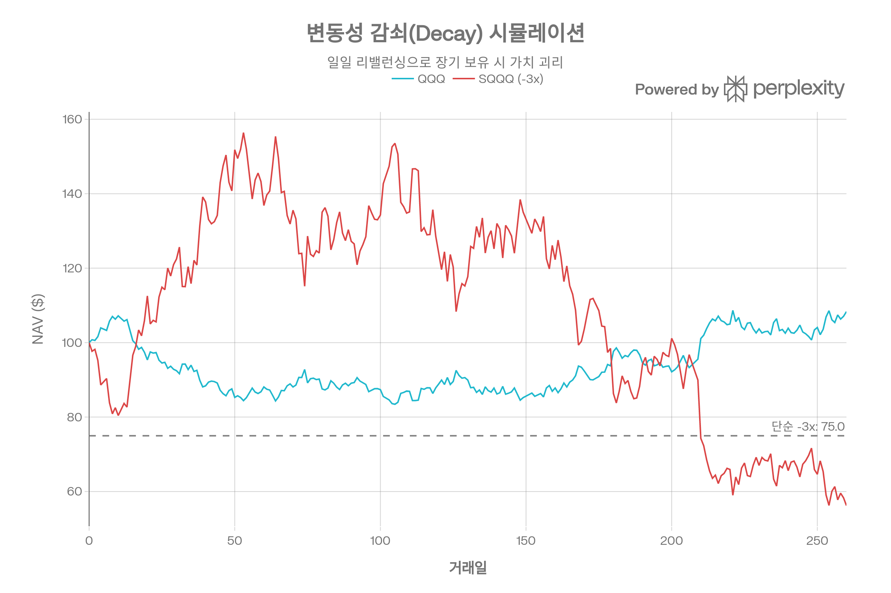
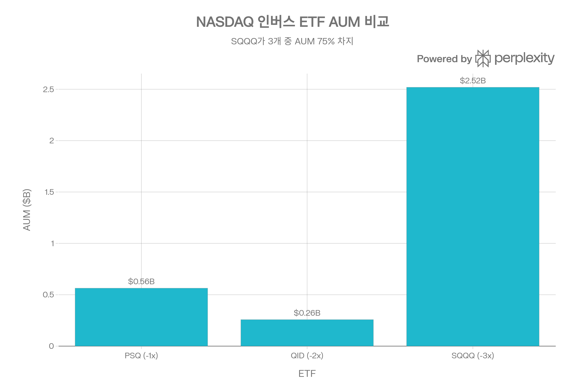
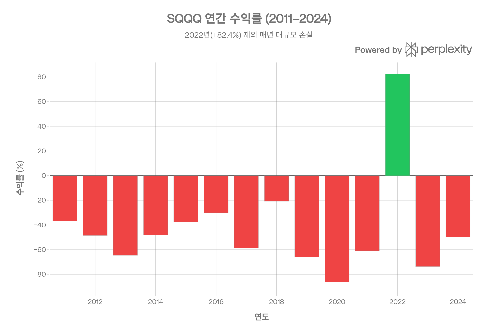
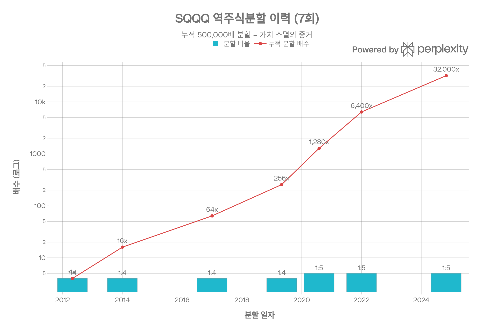
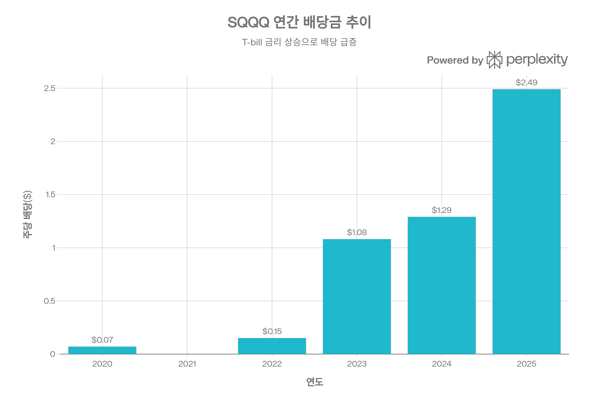

# SQQQ (ProShares UltraPro Short QQQ) 종합 분석 보고서
## 개요
SQQQ(ProShares UltraPro Short QQQ)는 NASDAQ-100 지수의 <strong>일일 수익률을 -3배(역방향 3배 레버리지)</strong>로 추종하는 인버스 레버리지 ETF이다. 2010년 2월 설정 이후 설정 이래 연환산 -52.23%의 수익률을 기록하고 있으며, 7차례의 역주식분할(누적 500,000배)을 거쳤다. 이는 SQQQ가 <strong>단기 전술적 트레이딩 및 포트폴리오 헤징 전용 도구</strong>이며, 장기 투자에는 구조적으로 부적합함을 의미한다. 순자산 \$25.2억 규모에 일평균 거래량 약 6,000만 주로, 미국 거래소에서 가장 활발히 거래되는 ETF 중 하나이다.[1][2][3][4][5]

***

## ETF 분류

| 항목 | 내용 |
|---|---|
| 최종 폴더 | `ETF/Leveraged Inverse/Nasdaq-100/SQQQ` |
| 대분류 | 레버리지·인버스 |
| 하위 분류 | Nasdaq-100 인버스 레버리지 |
| 핵심 전략 | Nasdaq-100 지수의 일일 수익률을 -3배로 추종하는 단기 전술·헤지 목적 ETF |
| 운용 방식 | 스왑, 선물, 단기 담보 자산 등을 활용하는 합성 복제형 레버리지 인버스 ETF |
| 레버리지/인버스 | 일일 -3배 인버스 |
| 옵션 인컴 여부 | 없음 |
| 분류 판단 | Nasdaq-100 노출이 있지만 일일 -3배 인버스 구조가 핵심이므로 ETF 분류 우선순위에 따라 `레버리지·인버스`로 분류 |

***

## 1. 기본 정보
| 항목 | 내용 |
|------|------|
| <strong>정식 명칭</strong> | ProShares UltraPro Short QQQ |
| <strong>티커</strong> | SQQQ |
| <strong>운용사</strong> | ProShares (ProShare Advisors LLC) |
| <strong>설정일</strong> | 2010년 2월 9일[3] |
| <strong>운용 기간</strong> | 약 16년 |
| <strong>순자산(AUM)</strong> | \$25.2억 (2026년 3월 6일 기준)[5] |
| <strong>추종 지수</strong> | NASDAQ-100 Index (일일 -3배)[3] |
| <strong>상장거래소</strong> | NASDAQ |
| <strong>NAV</strong> | \$73.42 (2026년 3월 6일)[5] |
| <strong>총 보유 종목 수</strong> | 17개 (스왑 계약 + T-bill + 선물)[3] |
| <strong>옵션 거래</strong> | 가능[5] |

SQQQ는 NASDAQ-100 지수를 직접 보유하지 않고, <strong>10개 대형 투자은행과의 총수익스왑(Total Return Swap)</strong> 계약을 통해 -300%의 역방향 노출을 구현한다. 담보 자산은 미 재무부 단기채(T-bill)와 ProShares Genius Money Market ETF(IQMM)로 구성되어 있다.[6][5]

***
## 2. 추종 성과 지표
### 일일 추적 정확도
SQQQ는 <strong>일일 기준</strong>으로 -3배 추적 목표를 충실히 달성한다. ProShares 공식 데이터에 따르면, NAV 수익률과 시장가격 수익률의 괴리는 극히 미미하다.[5]

| 기간 | NAV 수익률 | 시장가격 수익률 | 괴리 |
|------|-----------|---------------|------|
| 1개월 | +6.68% | +6.93% | +0.25%p |
| 3개월 | +5.86% | +5.96% | +0.10%p |
| 6개월 | -18.20% | -17.97% | +0.23%p |
| YTD | +3.24% | +3.43% | +0.19%p |
| 1년 | -51.90% | -51.87% | +0.03%p |

※ 2026년 2월 28일 기준 월말 데이터[5]
### 장기 추적 차이 — 변동성 감쇠(Volatility Decay)

SQQQ의 장기 성과가 단순히 "NASDAQ-100의 -3배"가 되지 않는 핵심 원인은 <strong>일일 리밸런싱에 따른 변동성 감쇠(Volatility Decay)</strong> 또는 <strong>감마 디케이(Gamma Decay)</strong>라 불리는 구조적 메커니즘이다.[7][8]

매일 장 마감 시 레버리지 비율을 -3x로 재조정하는 과정에서, 시장이 횡보(Sideways)하거나 변동성이 높을 때 <strong>복리 효과가 역방향으로 누적</strong>되어 가치가 지속적으로 소멸된다. 구체적으로:[9][10]

- NASDAQ-100이 하루 +2% 상승 후 다음날 -2% 하락하면, 지수는 -0.04%이지만 SQQQ는 약 -0.36%의 손실이 발생한다
- 이 감쇠가 매일 누적되어, <strong>연환산 감쇠율은 과거 최대 56.3%</strong>에 달한 바 있다[11]
- 결과적으로 SQQQ의 설정 이래 누적 가치는 사실상 -99.99% 이상 소멸되었다[12]
### NAV 대비 시장가격 괴리율
SQQQ의 프리미엄/디스카운트는 통상 <strong>±0.03% 이내</strong>로 매우 안정적이다. 이는 초대형 유동성과 효율적인 설정/환매(Creation/Redemption) 메커니즘 덕분이다. 최근 프리미엄은 +0.02% 수준으로, 실질적으로 NAV에 근접하게 거래되고 있다.[13][14]

***
## 3. 비용 구조
| 항목 | 내용 |
|------|------|
| <strong>총보수비율(Gross Expense Ratio)</strong> | 0.99%[5] |
| <strong>순보수비율(Net Expense Ratio)</strong> | 0.95% (수수료 면제 적용, 2026년 9월 30일까지)[5] |
| <strong>포트폴리오 회전율</strong> | N/A (스왑 기반 구조)[15] |
| <strong>30일 중간 호가 스프레드</strong> | 0.01%[5] |
### 경쟁 ETF 비용 비교

| ETF | 레버리지 | 순보수비율 | AUM | 3개월 ADV |
|-----|---------|-----------|-----|----------|
| PSQ (-1x) | -1배 | 0.95% | \$5.64억[16] | 570만 주 |
| QID (-2x) | -2배 | 0.95% | \$2.58억[17] | 620만 주 |
| <strong>SQQQ (-3x)</strong> | <strong>-3배</strong> | <strong>0.95%</strong> | <strong>\$25.2억</strong>[5] | <strong>1.04억 주</strong>[17] |
| TQQQ (+3x) | +3배 | 0.82% | \$273억[15] | - |

세 인버스 ETF 모두 동일한 0.95% 보수를 부과하나, SQQQ는 레버리지가 3배인 만큼 <strong>실효 비용(스왑 프리미엄 + 차입 비용 포함)이 표면 보수보다 실질적으로 훨씬 높다</strong>. 또한 정방향 레버리지 ETF인 TQQQ(0.82%)보다 13bp 비싸다.[15][18]
---
## 4. 유동성 평가
| 지표 | 수치 |
|------|------|
| <strong>일평균 거래량 (3개월)</strong> | 약 1.04억 주[17] |
| <strong>일평균 거래량 (1개월)</strong> | 약 8,733만 주[17] |
| <strong>일평균 거래대금</strong> | 약 \$50\~70억 (가격 × 거래량 추산) |
| <strong>30일 중간 호가 스프레드</strong> | 0.01%[5] |
| <strong>NAV 괴리율</strong> | +0.02%[14] |

SQQQ는 <strong>미국 전체 거래소에서 거래량 기준 상위 5위 이내</strong>에 드는 초유동성 상품이다. 호가 스프레드 0.01%는 사실상 마찰비용이 제로에 가까우며, 대규모 기관 블록 트레이딩에도 시장충격(Market Impact)이 미미하다. 이는 SQQQ가 단기 트레이딩 및 데이트레이딩 도구로서 최적화되어 있음을 보여준다.[1]

***
## 5. 포트폴리오 구성
### 노출 구조 (2026년 3월 6일 기준)
SQQQ는 전통적인 주식형 ETF와 달리, <strong>합성(Synthetic) 복제 방식</strong>으로 인버스 노출을 구현한다.[6]

| 구성 요소 | 비중 | 상세 |
|-----------|------|------|
| <strong>총수익스왑(TRS)</strong> | -300.06% | 10개 투자은행 상대방[5] |
| ProShares Money Market ETF | 60.3% | 담보 자산[3] |
| 미 재무부 단기채(T-bill) | \~36.4% | 담보 자산[5] |
| NASDAQ 100 E-mini 선물 | -8.86% | 추가 숏 노출[5] |
| 기타 순자산 | \~3.3% | 현금 등[5] |
### 스왑 거래 상대방 분산 (상위 10)
| 상대방 | 노출 비중 |
|--------|----------|
| Goldman Sachs International | -45.64%[5] |
| BNP Paribas | -35.80% |
| Nomura Capital | -30.93% |
| JPMorgan Chase Bank | -29.84% |
| Citibank NA | -29.22% |
| Bank of America NA | -28.21% |
| Barclays Capital | -25.98% |
| Morgan Stanley & Co. | -24.69% |
| Société Générale | -22.22% |
| UBS AG | -18.67% |

10개 글로벌 투자은행에 분산된 스왑 구조로, <strong>단일 상대방 리스크(Counterparty Risk)</strong>가 상당히 완화되어 있다.[5]
### 리밸런싱 주기
<strong>매일(Daily)</strong> — 매 거래일 장 마감 시 -3배 레버리지 비율을 재조정한다. 이 일일 리밸런싱은 SQQQ의 가장 핵심적인 구조적 특성이며, 장기 보유 시 변동성 감쇠의 직접적 원인이 된다.[8][19]

***
## 6. 성과 분석
### 기간별 수익률
| 기간 | NAV 수익률[5] |
|------|---------------------|
| 1개월 | +6.68% |
| 3개월 | +5.86% |
| 6개월 | -18.20% |
| YTD | +3.24% |
| 1년 | -51.90% |
| 3년 (연환산) | -55.42% |
| 5년 (연환산) | -45.48% |
| 10년 (연환산) | -54.29% |
| 설정 이후 (연환산) | -52.23% |
### 연간 수익률 이력

연간 수익률 데이터가 보여주듯, SQQQ는 <strong>14년 중 13년이 마이너스 수익</strong>을 기록했다. 유일한 양수 해인 2022년(+82.36%)은 연준의 공격적 금리 인상으로 NASDAQ-100이 -33% 하락한 해였다. 그 외 연도에서는 -20.75%(2018년, 최소 손실)에서 -86.40%(2020년, 최대 손실)까지 분포한다.[20]
### 리스크 지표
| 지표 | 수치 |
|------|------|
| <strong>베타</strong> | -3.40 (vs NASDAQ-100)[21] |
| <strong>표준편차 (연환산)</strong> | \~64.3%[12] |
| <strong>샤프 지수</strong> | -0.83[12] |
| <strong>최대 낙폭 (설정 이후)</strong> | -100.0% (사실상 전멸)[12] |
| <strong>역사적 변동성</strong> | \~49.89%[22] |
| <strong>내재 변동성</strong> | \~84.70%[22] |

SQQQ의 <strong>최대 낙폭은 -100.0%</strong>로, 설정 이후 초기 \$100 투자금은 역주식분할 미조정 기준으로 거의 전액 소멸되었다. 이는 단순한 성과 부진이 아니라, 레버리지 인버스 ETF의 <strong>구조적 필연</strong>이다.[12]
### 역주식분할 이력 — 가치 소멸의 물증

SQQQ는 설정 이후 <strong>총 7차례의 역주식분할</strong>을 실시했다:[4]

| 일자 | 비율 | 누적 배수 |
|------|------|----------|
| 2012-05 | 1:4 | 4배 |
| 2014-01 | 1:4 | 16배 |
| 2017-01 | 1:4 | 64배 |
| 2019-05 | 1:4 | 256배 |
| 2020-08 | 1:5 | 1,280배 |
| 2022-01 | 1:5 | 6,400배 |
| 2024-11 | 1:5 | 32,000배[23] |

역분할 없이 현재 가격을 환산하면, 설정 당시 주가는 약 \$73.42 × 32,000 = <strong>\$234만</strong> 수준이어야 하나 실제 설정가는 약 \$4,680이었으므로, <strong>누적 가치 하락률은 약 -99.998%</strong>에 달한다. 이는 SQQQ를 장기 보유할 경우 자본이 사실상 전멸한다는 것을 수학적으로 입증한다.

***
## 7. 배당 정보

| 항목 | 내용 |
|------|------|
| <strong>배당 수익률</strong> | \~12.18% (TTM)[24] |
| <strong>배당 지급 주기</strong> | 분기별 (Quarterly)[5] |
| <strong>배당 원천</strong> | T-bill 이자 및 단기금리 수익[25] |
### 연간 배당 이력
| 연도 | 총 배당금 (주당) | 증감 |
|------|-----------------|------|
| 2020 | \$0.07 | - |
| 2022 | \$0.15 | +114% |
| 2023 | \$1.08 | +620%[25] |
| 2024 | \$1.29 | +19% |
| 2025 | \$2.49 | +93%[25] |

SQQQ의 배당은 <strong>T-bill 및 머니마켓 담보 자산의 이자 수입</strong>에서 발생한다. 연준 기준금리가 0%에 가까웠던 2020\~2021년에는 배당이 거의 없었으나, 2022년 이후 금리 인상 사이클과 함께 배당이 급증했다. 그러나 이 높은 배당수익률은 <strong>NAV가 지속적으로 하락하는 와중에 담보 자산 이자를 지급하는 것</strong>이므로, 총수익(Total Return) 관점에서 의미 있는 소득으로 보기 어렵다.[25]

향후 금리 인하 사이클이 본격화되면 배당은 다시 대폭 감소할 전망이다.

***
## 8. 리스크 요소
### 변동성 감쇠 리스크 (최대 리스크)
SQQQ 투자의 <strong>가장 치명적인 리스크</strong>는 일일 리밸런싱에 따른 변동성 감쇠이다. 시장이 상승 추세일 때는 물론, <strong>횡보 장세에서도</strong> 가치가 지속적으로 소멸된다. ProShares 공식 투자설명서에서도 "1일을 초과하는 기간 동안의 성과는 지수의 역방향 3배 수익률과 크게 다를 수 있다"고 명시적으로 경고하고 있다.[3][7][9]
### 베타 및 상관계수
| 지표 | 수치 |
|------|------|
| <strong>베타 (vs NASDAQ-100)</strong> | -3.40[21] |
| <strong>베타 (vs Dow Jones)</strong> | -2.57[26] |
| <strong>상관계수 (vs S&P 500)</strong> | -0.98[27] |
| <strong>상관계수 (vs QID)</strong> | +1.00[26] |
| <strong>상관계수 (vs SPXS)</strong> | +0.93[26] |

SQQQ는 주식시장과 <strong>거의 완벽한 역상관(-0.98)</strong>을 보이므로, 분산 투자 효과가 극대화되는 자산이다. 그러나 이 역상관은 <strong>장기적으로 음의 기대수익</strong>을 동반하므로, 헤지 도구로서의 효용은 단기에 한정된다.[27]
### 상대방 리스크 (Counterparty Risk)
SQQQ의 -300% 노출은 10개 투자은행과의 OTC 스왑 계약으로 구현되므로, 상대방 부도 시 손실이 발생할 수 있다. 다만 글로벌 시스템적 중요 은행(G-SIB)으로 분산되어 있고, 일일 정산(Daily Mark-to-Market) 구조로 리스크가 상당히 완화된다.[6]
### 유동성 리스크
SQQQ 자체의 유동성은 극히 높으나(일평균 거래대금 \$50억+), <strong>극단적 시장 상황(Flash Crash, Circuit Breaker 발동)</strong>에서는 스왑 상대방의 유동성 공급이 일시적으로 중단될 수 있으며, 이 경우 NAV 대비 대폭 할인 거래가 발생할 수 있다.
### 섹터 집중도
SQQQ는 NASDAQ-100의 역방향을 추종하므로, <strong>기술 섹터에 극도로 집중</strong>된 역방향 베팅이다. NASDAQ-100의 상위 10종목(Apple, Microsoft, NVIDIA 등)이 지수의 약 50%를 차지하므로, 이들 메가캡 기술주의 급등 시 SQQQ는 집중적 타격을 받는다.

***
## 9. 경쟁 ETF 비교
| 항목 | PSQ | QID | SQQQ |
|------|-----|-----|------|
| <strong>추종 배수</strong> | -1x | -2x | -3x |
| <strong>보수비율</strong> | 0.95%[28] | 0.95%[17] | 0.95%[5] |
| <strong>AUM</strong> | \$5.64억[16] | \$2.58억[17] | \$25.2억[5] |
| <strong>3개월 ADV</strong> | 570만 주 | 620만 주 | 1.04억 주[17] |
| <strong>10년 연환산</strong> | -17.52%[28] | N/A | -54.29%[5] |
| <strong>변동성 감쇠</strong> | 낮음 | 중간 | 극심 |
| <strong>적합 보유 기간</strong> | 수일\~수주 | 수일 | <strong>당일\~수일</strong> |

SQQQ는 3개 인버스 ETF 중 <strong>AUM의 75%를 차지</strong>하며, 거래량에서 압도적 우위에 있다. 이는 트레이더들이 최대 레버리지를 선호하는 경향을 반영한다. 그러나 레버리지가 높을수록 감쇠도 기하급수적으로 커지므로, <strong>헤징 목적이라면 PSQ(-1x)가 훨씬 안정적</strong>인 선택이다.[17][28]

***
## 10. 투자 적합성 평가
### 적합한 활용 사례
- <strong>당일 트레이딩(Day Trading)</strong>: NASDAQ-100 하락에 대한 3배 레버리지 수익 추구
- <strong>초단기 전술적 헤지</strong>: 실적 발표, FOMC 등 이벤트 리스크 대비 (1\~3일)
- <strong>옵션 전략의 기초 자산</strong>: 풍부한 옵션 유동성을 활용한 복합 전략
### 부적합한 활용 사례
- <strong>장기 보유 (1주 이상)</strong>: 변동성 감쇠로 가치 소멸 필연
- <strong>포트폴리오 상시 헤지</strong>: 음의 기대수익으로 장기 헤지 비용이 과도
- <strong>약세장 베팅</strong>: 약세장이 수개월 지속되더라도 변동성으로 인해 기대 수익 미달
- <strong>소득 투자</strong>: 높은 배당수익률은 NAV 하락이 동반된 착시
### 핵심 경고
ProShares는 투자설명서에서 <strong>"이 펀드는 대부분의 투자자에게 적합하지 않으며, 단기 투자 지평을 가진 정교한 투자자만 사용해야 한다"</strong>고 명시하고 있다. SQQQ는 설정 이후 16년간 누적 -99.998%의 가치 소멸을 경험했으며, 이는 어떤 시장 환경에서도 <strong>장기 보유 시 자본 전멸이 구조적으로 보장된</strong> 상품임을 의미한다.[3][12][4]
