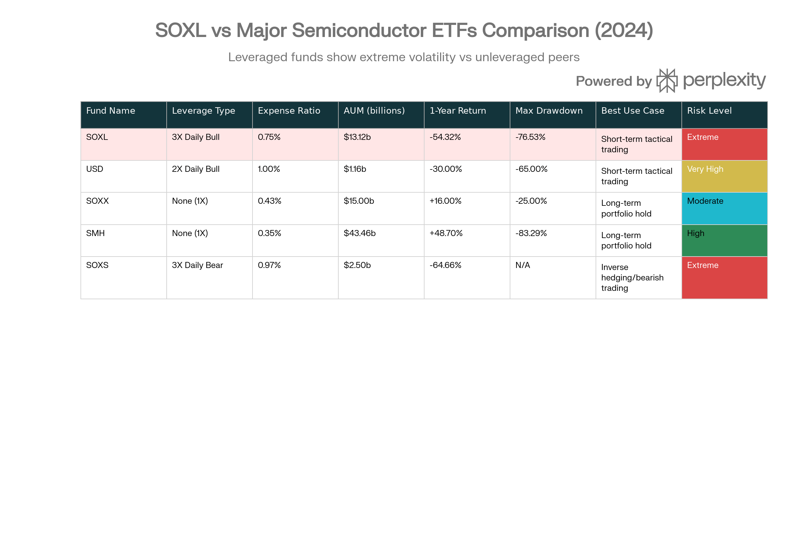
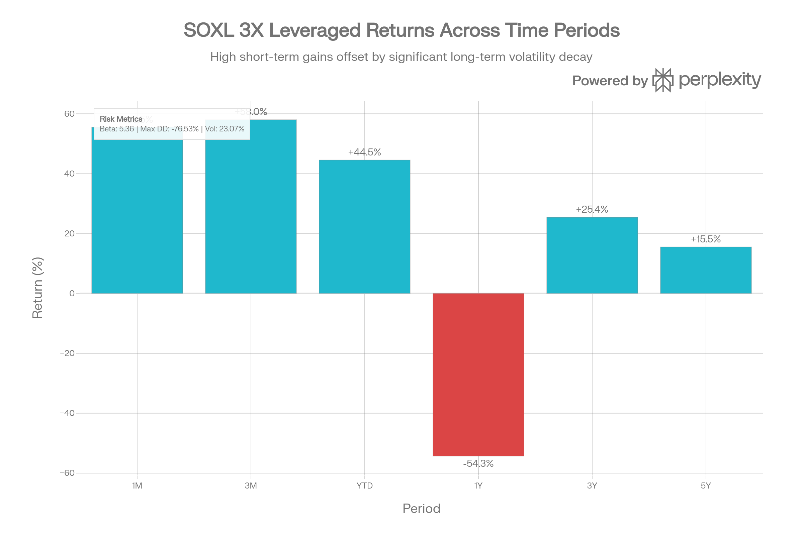
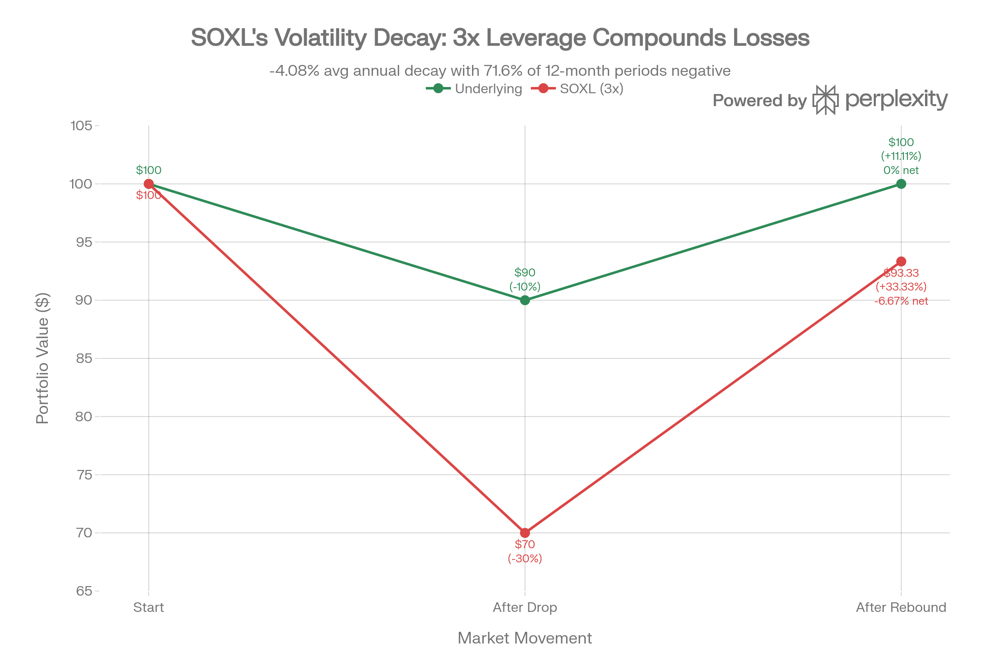

# Direxion Daily Semiconductor Bull 3X Shares (SOXL): 종합 분석 보고서

## ETF 분류

| 항목 | 내용 |
|---|---|
| 최종 폴더 | `ETF/Leveraged Inverse/Semiconductor/SOXL` |
| 대분류 | 레버리지·인버스 |
| 하위 분류 | 반도체 레버리지 |
| 핵심 전략 | NYSE Semiconductor Index의 일일 수익률을 3배로 추종하는 단기 전술 목적 ETF |
| 운용 방식 | 스왑, 선물, 옵션 등 파생상품을 활용하는 합성 복제형 레버리지 ETF |
| 레버리지/인버스 | 일일 +3배 레버리지 |
| 옵션 인컴 여부 | 없음 |
| 분류 판단 | 반도체 산업 노출이 있지만 일일 +3배 레버리지 구조가 핵심이므로 ETF 분류 우선순위에 따라 `레버리지·인버스`로 분류 |

***

### 개요 및 펀드 구조

Direxion Daily Semiconductor Bull 3X Shares (SOXL)는 2010년 3월 11일에 출시된 극도로 공격적인 레버리지 ETF로, NYSE Semiconductor Index(ICESEMIT)의 일일 수익률에 3배의 레버리지를 적용하는 전문화된 거래 도구입니다. 현재 \$13.12B의 자산 규모를 보유하고 있으며, 약 303.6M의 주식이 발행 중입니다.[^1][^2]

**구조적 특성**: SOXL은 옵션, 선물, 스왑 등의 파생상품을 활용하여 기초 지수의 일일 3배 수익을 추구합니다. 이는 핵심 메커니즘인 일일 리밸런싱(daily rebalancing)을 통해 달성되는데, 각 거래일 종료 후 펀드는 다음날의 3배 목표를 유지하기 위해 포지션을 재조정합니다. 이러한 구조는 짧은 기간의 거래에는 효과적이지만, 장기 보유에는 수학적으로 불리합니다.[^3][^4][^5][^1]

**중대 경고**: SOXL의 공식 문서는 명확히 "일일(daily) 투자 결과를 추구하며, 1일보다 긴 기간에 대해서는 누적 지수 수익률의 3배를 제공할 것으로 예상하지 않아야 한다"고 명시합니다. 이는 단순한 법적 면책이 아니라 구조적 현실입니다.[^1]

### 기초 지수 및 포트폴리오 구성

SOXL vs. Semiconductor ETF Competitive Landscape: Risk-Return Matrix

SOXL은 NYSE Semiconductor Index 추종하는데, 이는 미국 상장 반도체 상위 30개사를 시가총액 가중방식으로 구성합니다. 상위 10개 종목은 AMD(8.76%), NVIDIA(7.99%), Broadcom(7.79%), Texas Instruments(6.60%), Qualcomm(6.38%), Micron(4.46%), Marvell(4.40%), Microchip(4.14%), Lam Research(4.12%), KLA(4.05%)입니다.[^1]

이 포트폴리오는 반도체 부문(79.60%)과 반도체 재료 및 장비(20.40%)로 구성되어 있습니다. 중요한 점은 SOXL이 직접 주식을 보유하면서도 상당 부분을 ICE Semiconductor Index Swap으로 보유한다는 것입니다. 이는 파생상품에 대한 높은 노출을 의미하며, 파생상품 비용(acquired fund fees and expenses)이 이미 순비용 비율(0.75%)에 포함되어 있습니다.[^6][^1]

### 비용 구조 분석

| 비용 항목 | 금액 | 설명 |
| :-- | :-- | :-- |
| **총 비용 비율 (Gross)** | 0.89% | 레버리지 ETF로서 상당히 높음[^1] |
| **순 비용 비율 (Net)** | 0.75% | 수수료 면제 포함 (2026년 9월 1일까지)[^1] |
| **AFFE 제외 ER** | 0.72% | 파생상품 비용 제외 시[^1] |
| **비교**: SOXX | 0.43% | 레버리지 없는 순수 추적 ETF[^7] |
| **비교**: SMH | 0.35% | 광범위 반도체 ETF[^8] |
| **비교**: USD (2X) | 1.00% | 2배 레버리지 대안[^9] |

SOXL의 0.75% 순 비용은 표준 ETF 대비 높지만 레버리지 제품치고는 경쟁력 있습니다. 그러나 더 중요한 것은 비용 그 자체가 아니라 **레버리지 감쇠(leverage decay)**로 인한 잠재적 손실이 비용을 크게 초과한다는 점입니다.[^10]

### 성과 분석: 극단적인 변동성

SOXL Performance Overview \& Risk Profile (as of January 16, 2026)

SOXL의 성과는 극도로 불규칙합니다. 2025년에는 +54.91%의 인상적인 수익률을 기록했지만, 직전 연도인 2024년에는 -12.31%의 손실을 입었습니다. 더욱 놀라운 것은 최근 1년(2025년 초~2026년 1월)의 NAV 수익률이 -54.32%라는 점입니다. 이는 기초 지수가 그 정도로 손실을 입지 않았음을 시사하며, 순전히 레버리지와 변동성의 결과입니다.[^1][^11]

**최근 반등**: 2026년 초 강한 반도체 랠리에 힘입어 SOXL은 야드볼 1개월에 +55.47% NAV 수익률을 기록했습니다. 이는 3배 레버리지가 짧은 호황기에 어떻게 극적인 이득을 창출할 수 있는지 보여줍니다. 그러나 같은 메커니즘이 하락장에서는 -30% 손실을 -90% 손실로 변환시킵니다.[^1]

**역사적 성과**:

- **2023**: +226.98% (극도로 호황)
- **2022**: -85.66% (대재앙)
- **2021**: +118.84% (강세)
- **2020**: +70.04% (코로나 회복)
- **2019**: +231.83% (극도 호황)
- **2010-2026 (누적, 배당 재투자)**: +10,009.84%
- **연환산 수익률**: +33.80% 실제 / +38.49% 추세선

역사는 SOXL의 극단적 특성을 강조합니다. 누적 수익률이 인상적이지만, 이는 초기 낮은 기반(2010년 \$0.44)과 거의 16년의 투자 기간 때문입니다. 연환산 기준으로도 우수해 보이지만, 이는 극단적 변동성으로 인한 승산 왜곡(survivorship bias)을 포함합니다.

### 변동성 감쇠(Volatility Decay) 메커니즘

SOXL Volatility Decay Mechanics: How Daily Rebalancing Erodes Value

SOXL의 가장 중요한 리스크는 비용이나 단순 변동성이 아니라 **일일 리밸런싱으로 인한 수학적 손실 메커니즘**입니다. 이를 이해하려면 간단한 예시를 살펴봅시다.

**예시**: SOXL이 \$100에서 시작합니다.

- **1일차**: 기초 지수가 -10% 하락 → SOXL은 -30% → \$70로 떨어짐
- **2일차**: 지수가 +11.11% 반등 (원래 가치로 복귀) → SOXL은 +33.33% → \$93.33

**결과**: 지수는 원래 값으로 돌아왔지만, SOXL은 \$93.33에 머물러 -6.67%의 손실입니다. 이것이 변동성 감쇠입니다.[^12]

**학문적 증거**: 학술연구는 이를 확인합니다. SOXL의 12개월 드리프트는 71.6%의 비율로 음수이며, 평균 연간 감쇠는 -4.08%입니다. 즉, 기초 지수가 평탄하게 움직이더라도 SOXL은 매년 평균 4% 손실을 볼 것으로 예상할 수 있습니다.[^10][^13]

**더 큰 맥락**: 2024년 4월~2025년 4월 기간 동안, SOXL은 약 90%의 가치를 잃었습니다. \$70에서 시작하여 \$8-10으로 떨어진 것입니다. 같은 기간 기초 지수(SOXX)는 그 정도의 손실을 보지 않았습니다. 이는 순전히 레버리지 감쇠의 효과입니다.[^14]

### 위험 프로필: 극단적 수준

| 위험 메트릭 | SOXL | 비교 대상 | 평가 |
| :-- | :-- | :-- | :-- |
| **베타 (Beta)** | 5.36 | 광범위 시장: ~1.0 / SMH: ~1.7 | S\&P 500의 5배 변동성[^15] |
| **최대 낙폭** | -76.53% | SMH: -83.29% / SOXX: ~-25% | 극단적 하방 위험[^15] |
| **표준편차** | 23.07% | SOXX: ~12% | 거의 2배 변동성[^14] |
| **30일 IV** | 0.8961-1.7758 | SOXX: ~0.30-0.50 | 극도로 높은 옵션 변동성[^16] |
| **12개월 음수 드리프트** | 71.6% | 대부분 레버리지 ETF: 50-70% | 거의 3번 중 2번 손실[^10] |

베타 5.36은 극단적입니다. 이는 S\&P 500이 -10% 하락할 때, SOXL은 약 -50% 하락할 것으로 예상하는 것입니다. 2022년의 -85.66% 연간 손실은 이를 입증합니다.[^11]

### 배당 구조 및 현금 유출

SOXL은 분기별 배당을 지급하지만, 이는 매우 불규칙합니다:[^1]

- 2025년 6월: \$0.06799
- 2025년 3월: \$0.06477
- 2024년 12월: \$0.07683
- 2024년 9월: \$0.05955

배당 수익률(TTM)은 0.47-0.786%로, 이는 SOXX의 일반적인 배당 수익률보다 훨씬 낮습니다. 더 중요한 것은 배당이 극도로 변동한다는 점입니다. 역사적으로 \$0.0001에서 \$0.3020 사이를 오갔습니다. 이는 펀드의 구조적 불안정성을 반영합니다.[^2][^17][^18]

### 펀드 자금 흐름 신호

흥미로운 역설이 있습니다. SOXL의 AUM은 \$13.12B로 충분히 크지만, **1년간 자금 순유출이 \$7.23B**입니다. 이는 투자자들이 2025년 +54.91%의 수익률에도 불구하고 펀드에서 빠져나가고 있음을 의미합니다.[^2][^19]

**의미**: 이는 다음을 시사합니다.

1. 2024년의 심각한 손실(-12.31%)과 2025년 초의 극적인 하락(약 -90%)에서 입은 트라우마
2. 투자자들이 레버리지 거래의 어려움을 학습하고 있음
3. 기관 투자자들이 구조적 한계를 인식하고 있음
4. 순발 새로운 투자자들이 여전히 진입하고 있지만, 기존 보유자들의 퇴출을 상쇄하지 못하고 있음

### 경쟁 비교: USD (ProShares Ultra Semiconductors)

중요한 비교 대상은 USD입니다. USD는 2배 일일 레버리지를 제공하는 ProShares 상품입니다. 학술 연구와 실증 데이터는 **2배 레버리지 펀드가 장기 성과에서 3배 펀드를 일관되게 능가함**을 보여줍니다.[^7][^13]

**이유**: 5.36의 베타를 가진 3배 펀드는 변동성 감쇠의 치명적 희생자입니다. 2배 펀드(USD)는 여전히 감쇠를 경험하지만 덜 급격합니다. 6개월, 1년, 5년 기간에 걸쳐 USD는 SOXL을 지속적으로 능가했습니다.[^7]

### 대체 투자 고려: SOXX vs SOXL

더 광범위한 관점에서, SOXX(iShares PHLX Semiconductor ETF)는 SOXL의 기초 지수를 거의 동일한 형태로 추종하지만 레버리지가 없습니다. 2025년 결과:[^3]

- **SOXX**: +16% (직설적, 예측 가능)
- **SOXL**: +54.91% (극단적, 예측 불가)

만약 투자자가 3배 수익을 원한다면, SOXX에 3배의 자본을 투자하면 됩니다. 그러나 SOXL을 보유하는 것은 권리 행사하는 것이 아닙니다. 왜냐하면 일일 리밸런싱이 개입하기 때문입니다.

### 상대 성과: 역사적 관점

2023-2024 기간은 SOXL의 진정한 특성을 드러냅니다:

| 연도 | SOXL | 반도체 섹터 (추정) | SOXL/기초 성과 비율 |
| :-- | :-- | :-- | :-- |
| 2023 | +226.98% | +60-70% | 3.2-3.8배 (우월성) |
| 2024 | -12.31% | -5% (추정) | 2.5배 (악화) |
| 2025 | +54.91% | +15-20% (추정) | 2.7-3.7배 (우월성) |

이는 상승장에서는 3배 레버리지가 이론적 목표를 초과 달성(변동성 감쇠가 적을 때)하고, 하락장에서는 비례 이상의 손실을 본다는 점을 보여줍니다.

### 기술적 신호 및 2026 전망

SOXL의 최근 기술적 상황은 극도로 강세입니다:[^20]

- **MACD**: 2026년 1월 2일 양수 전환
- **모멘텀 지수**: 0 레벨 상향 돌파 (2025년 12월 29일)
- **이동 평균**: 50일선 상향 돌파 (2026년 1월 2일)
- **10/50 이동 평균 크로스**: 2026년 1월 2일 강세 크로스

AI 기반 예측 모델은 2026년 초~중반에 70-90%의 상승 확률을 제시합니다. 그러나 **이는 극도로 위험한 신호**입니다. SOXL이 오버샀을 수 있으며, 상방 브레이크아웃 후 급격한 조정이 일반적입니다.[^20]

### 투자 적합성 분석

**SOXL이 적합한 투자자**:

1. **경험 많은 단기 거래자**: 일일~5일 기간의 기술적 거래
2. **옵션 전략가**: 고 IV 프리미엄 판매 기회 활용
3. **극도로 공격적 투자자**: 극단적 변동성과 손실에 심리적으로 대비
4. **헤지 기관**: 포트폴리오의 매우 작은 부분(0.5%-2%)에서만

**SOXL이 절대 적합하지 않은 투자자**:

1. **퇴직 저축 투자자 (IRA/401k)**: 일일 리밸런싱은 장기 부의 축적에 반대
2. **배당 소득 추구자**: 0.47% 배당과 극도의 변동성은 소득 부적절
3. **장기 비교 투자자**: 5년 이상 보유 계획 투자자는 손실 거의 확실
4. **보수적 투자자**: -76.53% 최대 낙폭은 정신건강 위협
5. **시간 부족한 투자자**: 2-3시간 일일 모니터링 없이 관리 불가능

### 권장 사용 사례 및 포트폴리오 역할

SOXL을 포트폴이오에 포함할 경우, 매우 제한적이어야 합니다:

**전술적 단기 거래 (권장)**: 기술적 신호가 강한 며칠-1주일 기간에 포지션 배치. 예: 1월 초 강세 신호 이후 5-10일 보유, 명확한 이윤 실현/손실 중단점 설정.

**옵션 전략 (고도 경험자용)**: 높은 IV 환경(현재 IV Rank 22%는 낮음)에서 콜 옵션 판매, 또는 달력 스프레드 설정.

**절대 권장 안 함**: 매수-보유, 유의미한 포트폴리오 할당, 장기 성장 목표.

### 결론: SOXL의 본질

SOXL은 반도체 섹터에 대한 투자 수단이 아니라 **레버리지 거래의 도구**입니다. 이론적으로는 세미컨덕터의 3배 수익을 제공하지만, 현실에서는 일일 리밸런싱의 수학적 증가로 인해 변동성 감쇠가 그 약속을 훼손합니다.

**핵심 통계**:

- **71.6% 음수 드리프트**: 12개월 보유 중 약 3번 중 2번 손실
- **-4.08% 연간 평균 감쇠**: 정체한 시장에서도 손실
- **5.36 베타**: 시장 하락 시 5배 증폭 손실
- **\$7.23B 1년 순유출**: 투자자들이 구조적 위험을 인식하고 탈출 중

2025년의 +54.91% 수익과 2026년 초의 +55.47% 1개월 수익률은 **수직 상승장에서의 이상적 조건**을 반영합니다. 그러나 이러한 조건은 드물고, 변동성 있는 시장(절대 다수)에서는 SOXL은 장기 자산 축적 도구로서 수학적으로 열등합니다.

**최종 권장**: 경험 많은 거래자만, 매우 작은 위치 규모(포트폴리오의 1% 미만), 명확한 손익분기점, 활발한 모니터링이 있을 때만 고려하세요. 모든 다른 상황에서는 SOXX(레버리지 없음) 또는 SMH(광범위 노출)를 선택하세요.
[^21][^22][^23][^24][^25][^26][^27][^28][^29][^30][^31][^32][^33][^34][^35][^36][^37][^38][^39][^40][^41][^42][^43][^44]

⁂

[^1]: https://www.direxion.com/product/daily-semiconductor-bull-bear-3x-etfs

[^2]: https://www.tradingview.com/symbols/AMEX-SOXL/

[^3]: https://www.investing.com/analysis/looking-to-hedge-your-portfolio-consider-inverse-and-leveraged-etfs-200570644

[^4]: https://www.bitrue.com/blog/what-is-soxl-a-guide-to-specialized-financial-assets

[^5]: https://www.sumgrowth.com/etf-profile/invest-in-SOXL-etf.html

[^6]: https://cbonds.com/etf/5683/

[^7]: https://www.reddit.com/r/LETFs/comments/19c4qfn/semiconductors_2x_usd_outperforms_3x_soxl_in_long/

[^8]: https://finance.yahoo.com/news/smh-vs-xsd-semiconductor-etf-025325977.html

[^9]: https://djlee118.tistory.com/1384

[^10]: https://seekingalpha.com/article/4792102-soxl-benefits-drawbacks-to-leveraged-etf

[^11]: https://totalrealreturns.com/n/SOXL

[^12]: https://www.reddit.com/r/soxl/comments/1qbpxsl/why_is_the_soxx_chart_better_than_the_soxl_doesnt/

[^13]: https://www.ainvest.com/news/leveraged-etfs-volatile-semiconductor-markets-soxl-fails-long-term-test-2509/

[^14]: https://www.moomoo.com/community/feed/direxion-daily-semiconductor-bull-3x-shares-etf-soxl-performance-outlook-114327957929990

[^15]: https://rockflow.ai/stocks/soxl/

[^16]: https://www.alphaquery.com/stock/SOXL/volatility-option-statistics/30-day/iv-mean

[^17]: https://stockinvest.us/dividends/SOXL

[^18]: https://www.digrin.com/stocks/detail/SOXL/

[^19]: https://www.tradingview.com/symbols/AMEX-SOXL/analysis/

[^20]: https://tickeron.com/blogs/soxl-2025-2026-riding-a-new-wave-of-ai-driven-semiconductor-momentum-11622/

[^21]: QTUM (Defiance Quantum ETF).md

[^22]: SETM (Sprott Critical Materials ETF).md

[^23]: REMX (VanEck Rare Earth, Strategic Metals ETF).md

[^24]: https://finance.yahoo.com/quote/SOXL/

[^25]: https://kr.investing.com/etfs/direxion-dly-semiconductor-bull-3x

[^26]: https://etfdb.com/etf/SOXL/

[^27]: https://www.investopedia.com/articles/investing/121515/why-3x-etfs-are-riskier-you-think.asp

[^28]: https://seekingalpha.com/symbol/SOXL

[^29]: https://www.marketwatch.com/investing/fund/soxl

[^30]: https://finance.yahoo.com/news/soxl-vs-sso-leveraged-etfs-215202662.html

[^31]: https://optioncharts.io/options/SOXL

[^32]: https://finance.yahoo.com/quote/SOXL/performance/

[^33]: https://www.webull.com.my/news-detail/14122056659731456

[^34]: https://www.reddit.com/r/LETFs/comments/1h13dhl/how_can_measure_the_decay_along_the_time_in_soxl/

[^35]: https://www.aol.com/finance/soxl-vs-qld-leveraged-etf-230111625.html

[^36]: https://www.nasdaq.com/articles/sso-vs-soxl-leveraging-market-or-leveraging-momentum

[^37]: https://seekingalpha.com/article/4699929-soxl-after-doubling-semi-bulls-should-consider-adjusting-their-leverage

[^38]: https://www.investing.com/etfs/direxion-dly-semiconductor-bull-3x-historical-data

[^39]: https://marketchameleon.com/Overview/SOXL/Summary/

[^40]: https://www.reddit.com/r/options/comments/n04hpx/is_it_really_better_to_sell_options_during_high/

[^41]: https://www.barchart.com/etfs-funds/quotes/SOXL/volatility-charts

[^42]: https://portfoliometrics.net/etf-comparison/SOXL-USD

[^43]: https://www.morningstar.com/etfs/arcx/soxl/performance

[^44]: https://marketchameleon.com/Overview/SOXL/IV-Seasonality-Chart/
