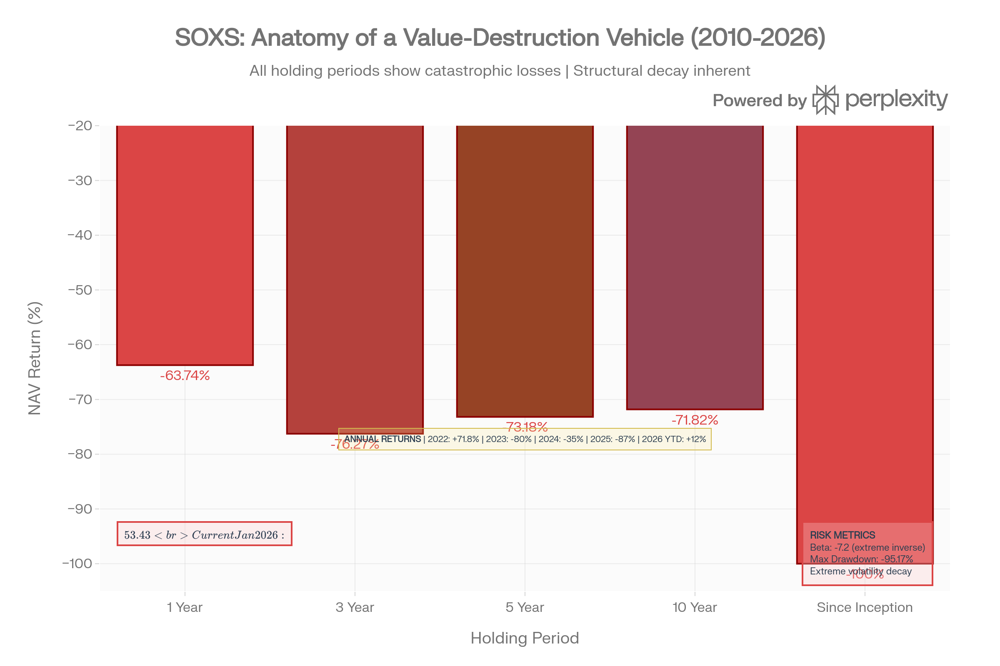
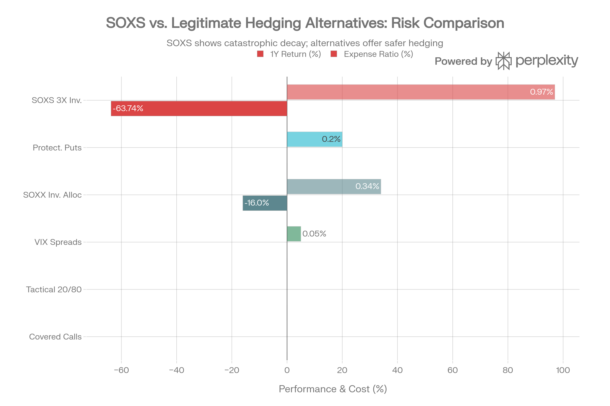
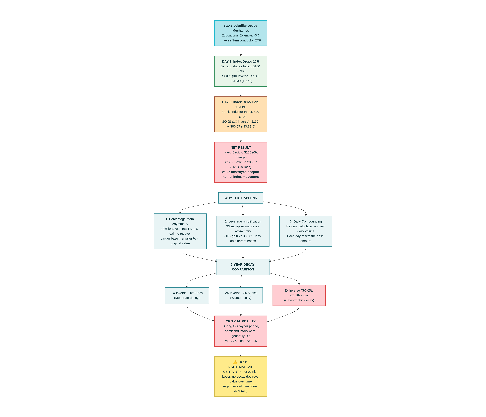

# Direxion Daily Semiconductor Bear 3X Shares (SOXS): 종합 분석 보고서

## ETF 분류

| 항목 | 내용 |
|---|---|
| 최종 폴더 | `ETF/Leveraged Inverse/Semiconductor/SOXS` |
| 대분류 | 레버리지·인버스 |
| 하위 분류 | 반도체 인버스 레버리지 |
| 핵심 전략 | NYSE Semiconductor Index의 일일 수익률을 -3배로 추종하는 초단기 하락 베팅용 ETF |
| 운용 방식 | 스왑, 선물, 옵션 등 파생상품을 활용하는 합성 복제형 인버스 레버리지 ETF |
| 레버리지/인버스 | 일일 -3배 인버스 레버리지 |
| 옵션 인컴 여부 | 없음 |
| 분류 판단 | 반도체 산업을 기초자산으로 하지만 일일 -3배 인버스 레버리지 구조가 핵심이므로 ETF 분류 우선순위에 따라 `레버리지·인버스`로 분류 |

***

### 개요: 가치 파괴 기계

Direxion Daily Semiconductor Bear 3X Shares (SOXS)는 2010년 3월 11일에 출시되었으며, **NYSE Semiconductor Index의 일일 역방향 3배 수익률을 추구하는 극도로 특화된 역레버리지 거래 도구**입니다. 현재 \$1.24-1.35B의 자산을 보유하고 있으나, 2025년에만 -87%의 손실을 기록하며 **수학적 가치 파괴를 향해 가고 있습니다**.[^1][^2][^3][^4]

**핵심 특성**: SOXS는 SOXL(불린 3X)의 정확한 역수이며, 반도체 섹터가 하락할 때 이득을 보도록 설계되었습니다. 그러나 **모든 역레버리지 ETF와 마찬가지로, SOXS는 장기 보유에서 구조적으로 값이 소멸합니다**.[^5][^6]

**통고**: 만약 당신이 SOXS를 "배당 수익" 또는 "장기 투자"로 간주하고 있다면, **즉시 재검토하십시오**. SOXS는 투자 수단이 아니라 순수한 거래 도구이며, 1일 이상 보유하면 수학적 패배입니다.[^4][^7][^8]

### 성과: 가치 소멸의 기록

SOXS: The Anatomy of a Value-Destruction Machine (2022-2026)

SOXS의 성과 기록은 **역레버리지 구조의 수학적 불가피성**을 명확히 보여줍니다:

| 기간 | 수익률 | 상황 |
| :-- | :-- | :-- |
| **2022** | +71.8% | 유일한 수익 연도 - 반도체 조정 중[^2] |
| **2023** | -80% | AI 붐이 시작되며 재앙적 손실[^2] |
| **2024** | -35% | 지속적 약세 추세[^2] |
| **2025** | -87% | 악몽 같은 해 - 최악의 해[^2][^4] |
| **YTD 2026** | +10-15% | 일시적 회복 (지속 불가능)[^9] |

**누적 기록**:

- 1년 NAV: -63.74%
- 3년 NAV: -76.27%
- 5년 NAV: -73.18%
- 10년 NAV: -71.82%
- **설립 이후**: -100% NAV[^2][^9]

**주가 붕괴**: SOXS는 2025년 3월에 \$53.43의 최고가에서 2026년 1월 \$2.04로 급락했습니다 - **10개월에 96.2% 손실**. 이는 단순한 시장 약세가 아니라 **구조적 가치 소멸**입니다.[^10][^9][^2]

### 배당 함정: "17.93% 수익률"의 거짓

SOXS의 가장 기만적인 특징은 **높은 배당 수익률 표시**입니다:[^11]

- **배당 수익률**: 17.93% (TTM)[^11]
- **연간 배당**: \$0.60/주[^11]
- **지급 빈도**: 분기별[^11]

**그러나 이것은 악의적인 환상입니다.**[^4]

SOXS는 반도체 회사들로부터 배당을 받지 않습니다(직접 주식 보유 안 함). 대신:

1. **현금 담보 이자**: AUM의 약 66%를 Treasury 채권으로 보유하여 약 4-5%의 이자 수익[^4]
2. **단기 스왑 이익**: 반도체 가격 하락 시 미미한 스왑 이익[^4]

**진실**: 2025년 SOXS는 \$0.60/주의 배당을 지급했지만, **동시에 87%의 NAV를 잃었습니다**. 이는 마치 집을 태운 후 나무 조각을 팔고 "18% 수익 달성"이라고 주장하는 것과 같습니다.[^4]

**수학**:

- 배당 지급: \$0.60/주
- NAV 손실: -87% (예: \$3에서 \$0.39로)
- **순 손실**: -86.4%

"고수익 배당" ETF가 아니라 **자본 파괴 기계**입니다.[^4]

### 역 변동성 감쇠: 수학적 불가피성

Inverse Volatility Decay: Why SOXS Is Mathematically Destined to Fail

SOXS가 100% 확실하게 가치를 잃는 이유는 **비율 수학의 비대칭성**입니다:[^5][^6]

**예시**:

- 시작: 지수 100, SOXS \$100
- 1일차: 지수 -10% → 90, SOXS +30% → \$130
- 2일차: 지수 +11.11% → 100 (복귀), SOXS -33.33% → \$86.67 (손실)

**결과**: 지수는 원래대로 돌아왔지만, **SOXS는 -13.3% 손실**[^6]

**왜 일어나는가**:

1. 10% 손실 = 11.11% 회복 필요 (비대칭)
2. 3배 레버리지 = 이를 4.8배 증폭
3. **일일 리밸런싱** = 이 손실이 매일 발생[^5]

**5년 실제 결과**: SOXS -73.18% 손실 **반도체 섹터가 일반적으로 UP인 기간 동안**. 이는 타이밍 문제가 아니라 **수학적 확실성**입니다.[^11][^6]

### 유일한 수익 연도: 2022

SOXS의 **유일한 이익 연도는 2022년 +71.8%**였습니다. 당시 반도체 섹터는 -35.6% 손실을 입었으므로, SOXS는 3배 역 효과를 완벽히 달성했습니다.[^2]

그러나 이후:

- 2023년: 반도체 AI 붐 → SOXS -80%
- 2024년: 지속적 약세 → SOXS -35%
- 2025년: AI 칩 초강세 → SOXS -87%

**교훈**: SOXS는 **5-10년 지속적 반도체 약세가 필요**하며, 이 확률은 매우 낮습니다.[^7]

### 비용 구조: 상당히 높음

SOXS의 0.97% 순 비용은 높습니다:[^3]

| 비용 항목 | SOXS | SOXL | SOXX | 평가 |
| :-- | :-- | :-- | :-- | :-- |
| **순 비용** | 0.97% | 0.75% | 0.34% | SOXS가 가장 비쌈[^3] |
| **연간 비용** (\$10K) | \$97 | \$75 | \$34 | SOXS가 2.8배[^3] |
| **수수료 면제** | 2026년 9월 1일까지 0.95%로 제한[^3] | 2026년 9월 1일까지 | 해당 없음 |  |

높은 비용은 이미 -63.74% 손실을 입은 파괴적 구조 위에 추가 시스템입니다.[^3]

### 위험 프로필: 극도로 높음

| 위험 지표 | SOXS | 평가 |
| :-- | :-- | :-- |
| **베타** | -7.2 (또는 -4.28 by some measures) | 극도로 극단적[^12][^7] |
| **최대 낙폭** | -95.17% | 거의 전체 자본 손실[^7] |
| **52주 범위** | \$2.05-\$53.43 | 2,506% 극단적 진동[^12] |
| **일일 변동성** | 10%+ 일반적 | 거래 불가능한 변동성 |
| **상관계수** | SOXL과 완벽 역 | 매일 리밸런싱이 비효율적[^5] |

-7.2 베타는 S\&P 500이 -1% 하락할 때 SOXS는 +7.2% 상승할 것으로 예상함을 의미합니다. 반대로 +1% 상승 시 -7.2% 손실.[^7]

### 투자자 부적합성

SOXS는 **다음 투자자에게 절대 부적합**합니다:[^7][^8]

1. **보수적 투자자**: 극도의 변동성과 -100% 손실 위험
2. **은퇴 자산 투자자**: IRA/401k에서는 금지되어야 할 상품
3. **배당 소득 추구자**: "배당"은 사실 자본 파괴 신호
4. **장기 투자자**: 1주일 이상 보유 금지
5. **시간 부족 투자자**: 실시간 모니터링 없으면 재앙
6. **기술적 분석 의존 투자자**: 정상 차트 기법 작동 안 함

### 제한적 적절 사용: 전문가 거래만

SOXS는 **매우 좁은 사용 사례**에서만 적절합니다:[^13][^8]

**허용된 사용**:

1. **일일 헤지**: 반도체 포지션의 1-2일 단기 보호[^8][^13]
2. **짧은 기간 거래**: 명확한 3-5일 약세 전망 + 정확한 손절[^14]
3. **알고리즘 쌍 거래**: SOXS/SOXL 자동 중립 헤징[^13]
4. **이벤트 거래**: U.S.-China 칩 제재 등 구체적 촉매에 베팅[^8]

**실제 예시** (2025년 5월):[^14]

- 53주를 \$11.44에 매수
- 10일 후 \$13.91에 매도
- 수익: +21.59%
- 그러나 계속 보유했다면: -61% 손실[^14]

### 알고리즘 헤징: 전문가 사용

기관과 AI 거래 로봇들은 SOXS를 정교하게 사용합니다:[^13]

- **Tickeron AI**: SOXS/SOXL 자동 쌍 거래로 1,200% ROI 달성 (시뮬레이션)[^13]
- **정적 포트폴이오 대비**: Sharpe 비율 1.8 vs 0.9[^13]
- **VIX > 20 환경**: 21% 초과 수익[^13]
- **응답 시간**: <1초 (인간 불가능)[^13]

**핵심**: 기관들은 SOXS를 **수초~수분 단위로 거래**하며, 절대 수일 이상 보유하지 않습니다.[^13]

### SOXS 대신 사용할 헤징 대안

Hedging Alternatives to SOXS: Why Experts Choose Options, Allocation, or Tactical Positioning

SOXS가 반도체 하락에 베팅하는 유일한 수단이 아닙니다:

**더 나은 대안**:

1. **SOXX 보호 Put**: 정의된 위험, 어떤 기간도 가능, 변동성 감쇠 없음
2. **VIX Call 스프레드**: 변동성 플레이, 제어된 손실
3. **전술적 배분**: 20% 반도체 / 80% 현금 - 진정한 위험 관리
4. **숏 커버드 콜**: 소유 SOXX에서 이익 + 헤징
5. **간단히 현금 보유**: SOXS보다 훨씬 안전[^4]

SOXX 보호 Put은 \$1-2의 프리미엄을 소비하지만, **SOXS와 달리 정의된 위험과 구조적 붕괴가 없습니다**.[^8]

### 기술 신호: 일시적 회복

2026년 1월 현재 SOXS는 약간의 기술적 강점을 보이고 있습니다:[^13][^15]

- MACD: 2026년 1월 2일 음수로 전환 (약세)[^13]
- RSI: 지그재그 패턴, 과매수 존근처[^15]
- 단기 저항: \$2.50-\$3.00 (모두 극히 낮음)[^15]
- 장기 지지: \$1.50, 최종적으로 \$0 향함[^15]

**해석**: 2026년 1월의 일시적 회복은 시장 스트레스의 좋은 기회이지만, **구조적 붕괴는 계속될 것입니다**.[^7][^13]

### 반도체 섹터 구조적 강점

SOXS가 지속적으로 패배하는 이유는 반도체 섹터의 **구조적 상승 동인**입니다:[^16]

1. **AI 칩 수요**: 감소 신호 없음 - NVIDIA, TSMC 사이클 초기
2. **자동화/로봇**: 장기 성장 추세
3. **CHIPS Act**: 미국 국내 투자 촉진
4. **데이터센터 확장**: Meta, Microsoft, Google의 AI 인프라 투자
5. **제조 기술**: 5nm, 3nm 공정의 경제성 개선

**의미**: SOXS를 "장기 헤지"로 간주할 경우, **당신은 8-10년 반도체 약세에 베팅하는 것**입니다. 그럴 확률은 낮습니다.[^16]

### 왜 SOXS가 존재하는가?

합리적 질문: 100% 확실히 가치를 잃는 상품이 왜 존재할까?[^8]

**답변**:

1. **규제 차익거래**: 역 ETF는 합법적 헤징 도구[^5]
2. **시장 조성자 수익**: 높은 스프레드와 빈번한 거래[^8]
3. **기관 일일 헤징**: 매일 마감하는 정교한 거래자용[^13]
4. **투명성**: 뮤추얼 펀드보다 더 투명한 숏 노출[^5]
5. **리테일 추측**: 일부 투자자들의 순수한 추측심[^8]

Direxion은 SOXS를 명시적으로 "1일 거래용"으로 표시합니다. 그 이상은 당신의 책임입니다.[^1][^17]

### 최종 평가: 피해야 할 상품

SOXS는 **무한 피해야 할 상품**입니다. 다음 상황을 제외한 모든 경우에:

**SOXS가 적절한 경우**:

- 전문 거래자가 1일 이내로 정확한 진입/출장을 계획하고 실행할 때

**SOXS가 부적절한 모든 다른 경우**:

- 주간 이상 보유
- 배당 수익 목적
- 포트폴이오 헤지 (더 나은 대안 존재)
- IRA/401k 배치
- "계절적" 약세 베팅

**가장 끔찍한 사용**:

- SOXS를 "고수익 배당" ETF로 간주하고 보유
- 결과: 87% 손실 + 17% 배당 = -70% 순 손실[^4]

### 요약: 극복할 수 없는 수학

SOXS의 문제는 **시장 타이밍이나 경영이 아니라 순수 수학**입니다:[^5][^6]

1. **10% 손실 = 11.11% 회복 필요** (비율 비대칭)
2. **3배 레버리지 = 이를 4.8배 악화**
3. **일일 리밸런싱 = 매일 이 손실 발생**
4. **결과 = 구조적 가치 소멸**

이것은 의견이 아니라 **수학 법칙**입니다.[^5]

Inverse Volatility Decay: Why SOXS Is Mathematically Destined to Fail

### 최종 권장: 회피

SOXS에 투자하지 마십시오. 기간에 관계없이, 이유에 관계없이. 만약 당신이 반도체 약세에 베팅하려면:

1. **보호 Put** (정의된 위험)
2. **현금 배분** (20% 반도체 / 80% 현금)
3. **VIX 전략** (변동성 플레이)
4. **아무것도 안 함** (현금 보유)

**절대**: SOXS (또는 어떤 역 3배 레버리지 ETF도) 장기 투자로.[^7][^8]

Hedging Alternatives to SOXS: Why Experts Choose Options, Allocation, or Tactical Positioning
[^18][^19][^20][^21][^22][^23][^24][^25][^26][^27][^28][^29][^30][^31][^32]

⁂

[^1]: https://finance.yahoo.com/quote/SOXS/

[^2]: https://stockanalysis.com/etf/soxs/

[^3]: https://markets.ft.com/data/etfs/tearsheet/summary?s=SOXS%3APCQ%3AUSD

[^4]: https://finance.yahoo.com/news/soxs-may-pay-20-dividend-161139331.html

[^5]: https://www.poems.com.sg/market-journal/advanced-etf-strategies-leveraging-complexity-for-potential-gains/

[^6]: https://www.reddit.com/r/LETFs/comments/1kae37v/plz_explain_soxs_current_price_was_when_soxl_was/

[^7]: https://rockflow.ai/stocks/soxs/

[^8]: https://etfuno.com/p/soxs-vs-semiconductors-the-ultimate-inverse-play

[^9]: https://www.investing.com/etfs/direxion-dly-semiconductor-bear-3x

[^10]: https://www.marketwatch.com/investing/fund/soxs

[^11]: https://stockanalysis.com/etf/soxs/dividend/

[^12]: https://public.com/stocks/soxs

[^13]: https://tickeron.com/blogs/7-proven-ai-trading-strategies-using-inverse-etfs-like-soxs-qid-and-nvds-to-profit-in-falling-markets-11527/

[^14]: https://www.reddit.com/r/dividends/comments/1lf956f/leveraged_etfs/

[^15]: https://www.moomoo.com/community/feed/how-to-inverse-etfs-to-profit-from-declining-market-short-114113115389958

[^16]: https://www.futunn.com/en/etfs/SOXS-US/news

[^17]: https://www.direxion.com/product/daily-semiconductor-bull-bear-3x-etfs

[^18]: QTUM (Defiance Quantum ETF).md

[^19]: SETM (Sprott Critical Materials ETF).md

[^20]: REMX (VanEck Rare Earth, Strategic Metals ETF).md

[^21]: https://kr.investing.com/etfs/direxion-dly-semiconductor-bear-3x

[^22]: https://etfdb.com/etf/SOXS/

[^23]: https://twelvedata.com/markets/619232/etf/bmv/soxs

[^24]: https://kr.tradingview.com/symbols/AMEX-SOXS/analysis/

[^25]: https://money.tmx.com/quote/SOXS:US/news/4893152227336890/Profit_From_The_Next_Semiconductor_Downturn_With_SOXS

[^26]: https://www.perplexity.ai/finance/SOXS/history

[^27]: https://www.investing.com/etfs/direxion-dly-semiconductor-bear-3x-dividends

[^28]: https://www.morningstar.com/etfs/arcx/soxs/quote

[^29]: https://seekingalpha.com/symbol/SOXS/dividends/yield

[^30]: https://stockinvest.us/dividends/SOXS

[^31]: https://stockevents.app/en/stock/SOXS/dividends

[^32]: https://seekingalpha.com/article/4844701-soxs-risks-of-trading-3x-leveraged-etf-and-how-to-limit-them
