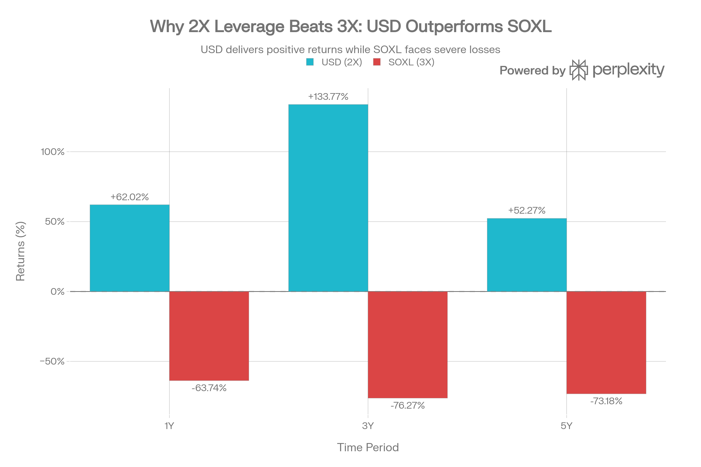
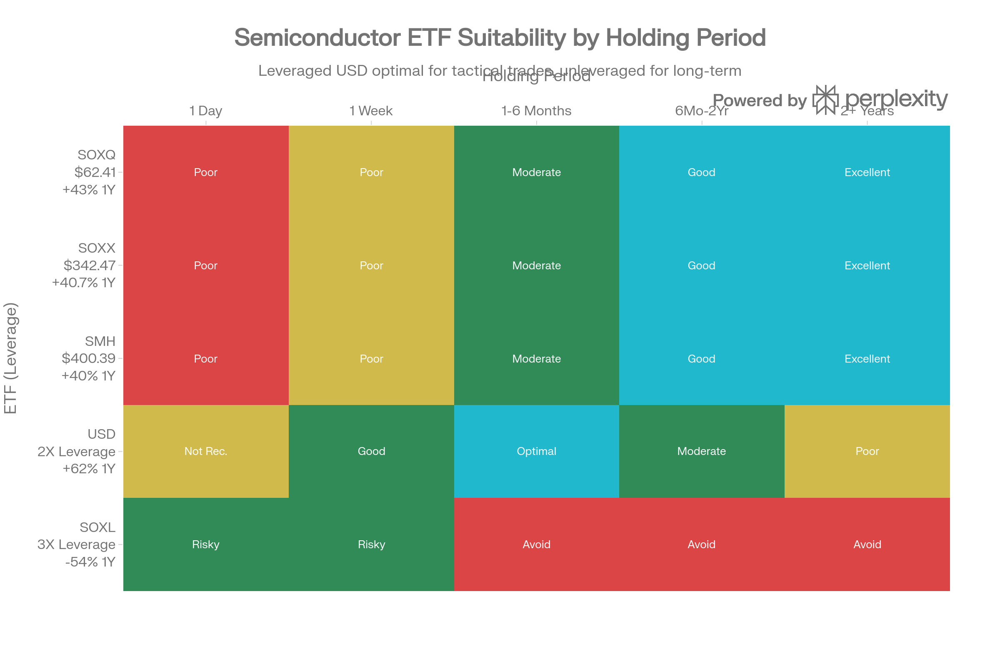

# ProShares Ultra Semiconductors (USD): 종합 분석 보고서

## ETF 분류

| 항목 | 내용 |
|---|---|
| 최종 폴더 | `ETF/Leveraged Inverse/Semiconductor/USD` |
| 대분류 | 레버리지·인버스 |
| 하위 분류 | 반도체 레버리지 |
| 핵심 전략 | 반도체 지수의 일일 수익률을 2배로 추종하는 단기·중기 전술 목적 ETF |
| 운용 방식 | 파생상품을 활용하는 지수 기반 레버리지 ETF |
| 레버리지/인버스 | 일일 +2배 레버리지 |
| 옵션 인컴 여부 | 없음 |
| 분류 판단 | 반도체 산업 노출이 있지만 일일 +2배 레버리지 구조가 핵심이므로 ETF 분류 우선순위에 따라 `레버리지·인버스`로 분류 |

***

### 개요: 2배 레버리지의 최적 선택

ProShares Ultra Semiconductors (USD)는 2007년 1월 30일에 출시되어 <strong>일일 반도체 지수 수익률의 2배를 추구하는 레버리지 ETF</strong>입니다. 현재 \$57.48 NAV와 \$1.69B AUM을 보유하고 있으며, <strong>SOXL의 3배 레버리지보다 훨씬 우수한 장기 성과를 기록</strong>했습니다.[^1][^2][^3]

### 핵심 성과: 2X가 3X를 압도

USD (2X Leverage) vs SOXL (3X Leverage): Why Lower Leverage Beats Higher Leverage

<strong>USD vs SOXL 비교</strong>:

- <strong>1년</strong>: USD +62.02% vs SOXL -63.74% = 125.76포인트 격차[^2]
- <strong>3년 연환산</strong>: USD +133.77% vs SOXL -76.27% = 210.04포인트 격차[^2]
- <strong>5년 연환산</strong>: USD +52.27% vs SOXL -73.18% = 125.45포인트 격차[^2]

이는 <strong>수학적 불가피성</strong>입니다: <strong>2배 레버리지는 3배 레버리지보다 변동성 감쇠가 현저히 낮습니다</strong>.[^3][^2]

### 왜 2X가 3X를 능가하는가?

변동성 감쇠의 수학:

<strong>3X 예시</strong> (SOXL):

- 1일차: 지수 +5% → SOXL +15%
- 2일차: 지수 -4.5% → SOXL -13.5%
- 3일차: 지수 +4.5% → SOXL +13.5%
- <strong>결과</strong>: 지수 +5.05%, SOXL 심각한 손실

<strong>2X 예시</strong> (USD):

- 1일차: 지수 +5% → USD +10%
- 2일차: 지수 -4.5% → USD -9%
- 3일차: 지수 +4.5% → USD +9%
- <strong>결과</strong>: 지수 +5.05%, USD 여전히 수익[^2][^3]

### 비용 분석: 높지만 정당화됨

USD의 0.95% 비용은 높지만:[^1]

- 1년 +62% 수익률은 비용을 크게 초과
- SMH의 0.35%와 비교해도 성과로 보상

### 리스크 프로필: 높지만 관리 가능

| 지표 | USD | 평가 |
| :-- | :-- | :-- |
| <strong>베타</strong> | \~3.0 | 시장의 3배 변동성[^4] |
| <strong>표준편차</strong> | 62.5% | 극도로 높음[^5] |
| <strong>최대 낙폭</strong> | -88.6% | 심각한 하방 위험[^5] |
| <strong>Sharpe 비율</strong> | 0.69 | 낮음[^5] |

### 최적 보유 기간: 2-6개월

Semiconductor ETF Positioning by Holding Period: USD's Optimal Window (2-6 Months)

USD는 다음 기간에 최적입니다:

<strong>완벽한 사용</strong>: 2-6개월 강세 반도체 전망 + 정확한 진입/출장
<strong>선호 가능</strong>: 1개월-1년 중기 거래
<strong>비추천</strong>: 1일 (레버리지 감쇠 심함)
<strong>강하게 비추천</strong>: 5년+ (unleveraged가 우월)

### 투자 권장안

<strong>USD 매수 시나리오</strong>:

- 반도체 강세 확신 + 2-6개월 타이밍 계획
- 60% 변동성 수용 가능
- 명확한 손익분기점 (예: SOXX \$320 하락 시 손절)

<strong>USD 회피 이유</strong>:

- 장기 투자 목표 (SOXX/SMH 선택)
- 일일 거래 (옵션이 더 나음)
- 보수적 포트폴리오

### 최종 평가

USD는 <strong>"중도의 길"</strong>입니다 — SOXL의 극도 위험 회피와 SMH의 보수성 사이. 2배 레버리지는 학문적으로 증명된 최적 장기 레버리지이며, USD의 19년 역사가 이를 입증합니다.[^2]

<strong>결론</strong>: 중기(2-6개월) 반도체 강세 베팅에 USD는 우수한 선택입니다. 그러나 장기 투자자는 여전히 unleveraged SOXX/SMH/SOXQ를 선택해야 합니다.

⁂

[^1]: https://www.proshares.com/our-etfs/leveraged-and-inverse/usd

[^2]: https://www.reddit.com/r/LETFs/comments/19c4qfn/semiconductors_2x_usd_outperforms_3x_soxl_in_long/

[^3]: https://www.ainvest.com/news/leveraged-etfs-volatile-semiconductor-markets-soxl-fails-long-term-test-2509/

[^4]: https://markets.ft.com/data/etfs/tearsheet/summary?s=USD%3APCQ%3AUSD

[^5]: https://www.composer.trade/etf/USD

[^8]: REMX (VanEck Rare Earth, Strategic Metals ETF).md

[^9]: https://finance.yahoo.com/quote/USD/

[^10]: https://kr.investing.com/etfs/proshares-ultra-semiconductors

[^11]: https://seekingalpha.com/symbol/USD

[^12]: https://markets.ft.com/data/etfs/tearsheet/summary?s=TSMG%3ANMQ%3AUSD

[^13]: https://www.tradingkey.com/learn/intermediate/etf/etf-cost-fee-system-breakdown-tradingkey

[^14]: https://global.morningstar.com/en-ca/investments/etfs/0P00007VR3/quote

[^15]: https://www.reddit.com/r/ETFs/comments/1ha2w9t/why_wouldnt_i_buy_this_leverage_etf_if_i_know_ill/

[^16]: https://kr.investing.com/etfs/proshares-ultra-semiconductors-holdings

[^17]: https://www.kraken.com/stocks/usd

[^18]: https://leverageshares.com/us/insights/leveraged-etf-fees-explained-what-you-need-to-know/

[^19]: https://www.marketwatch.com/investing/fund/usd

[^20]: https://www.morningstar.com/etfs/arcx/usd/quote

[^21]: https://stockanalysis.com/etf/usd/dividend/

[^22]: https://www.spglobal.com/spdji/en/indices/dividends-factors/dow-jones-us-dividend-100-index/

[^23]: https://divvydiary.com/en/calendar/2025-march

[^24]: https://fred.stlouisfed.org/tags/series?t=dividends

[^25]: https://www.troweprice.com/personal-investing/resources/planning/tax/dividend-distributions/mutual-funds/2025-year-end-distributions.html

[^26]: https://www.icmarkets.com/blog/thursday-15th-january-2026-technical-outlook-and-review/

[^27]: https://investor.qualcomm.com/stock-info/dividend-split-history/default.aspx

[^28]: https://www.orbex.com/blog/en/2026/01/intraday-analysis-08-01-2026

[^29]: https://lngir.cheniere.com/stock-data/dividends

[^30]: https://www.reddit.com/r/LETFs/comments/1lrwhs4/soxl_vs_usd/

[^31]: https://www.economies.com/forex/usd-jpy-analysis/the-usdjpy-is-showing-mixed-signs-analysis-16-01-2026-124138

[^32]: https://am.jpmorgan.com/content/dam/jpm-am-aem/emea/regional/en/supplemental/notice-to-shareholders/etfs-dividend-distribution-schedule-2025.pdf

[^33]: https://www.reddit.com/r/LETFs/comments/1j2lddy/soxl_leverage_decay_over_the_past_year/
