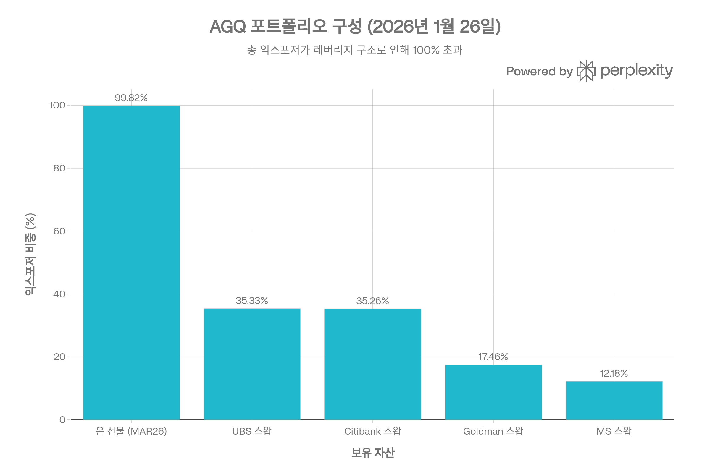
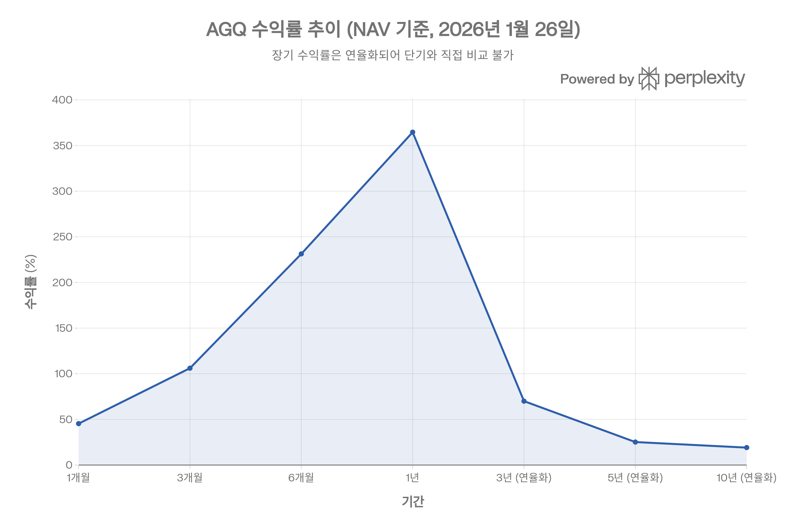
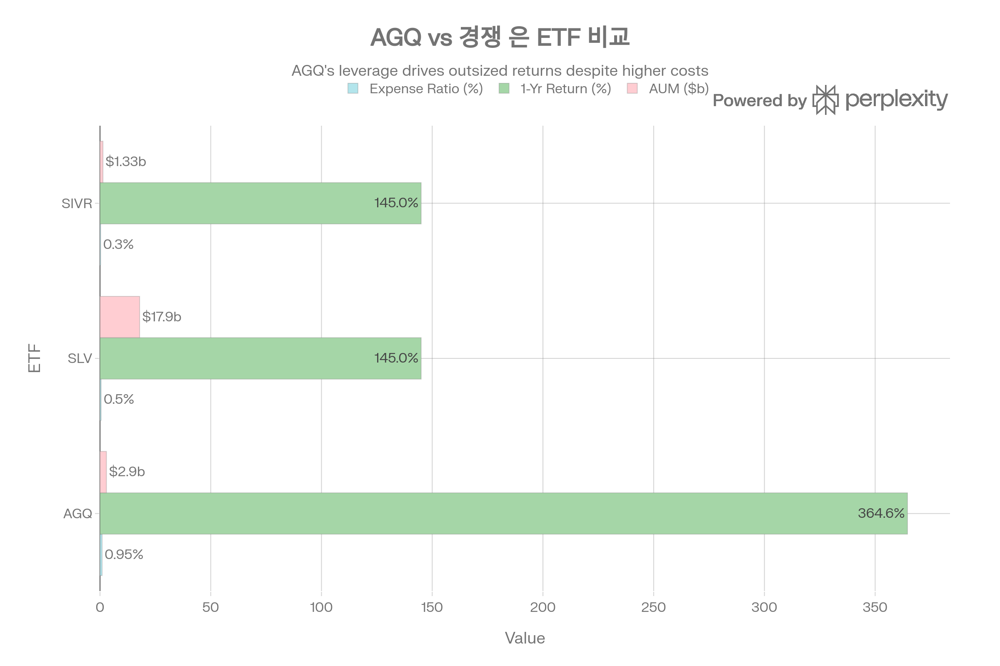
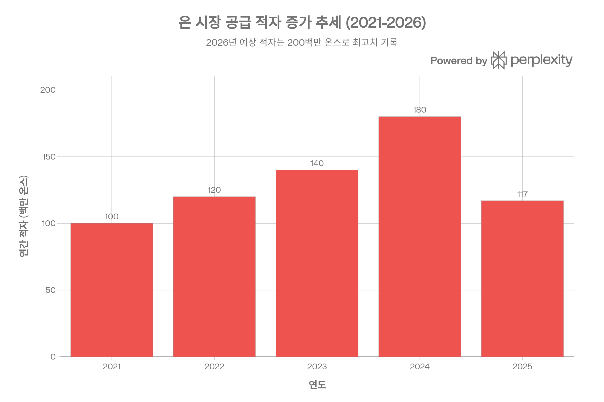

## 분류 근거

AGQ는 일일 2배 레버리지를 목표로 은 선물·스왑을 운용하는 상품이다. 분류 우선순위 1번인 "레버리지 또는 인버스 구조"가 자산군·테마보다 우선하므로, 은 관련 ETF이지만 `Leveraged Inverse/Silver`로 분류했다.

## 요약

ProShares Ultra Silver (AGQ)는 Bloomberg Silver Subindex의 일일 수익률을 2배로 추적하도록 설계된 레버리지 상장지수펀드(ETF)입니다. 2026년 1월 기준, AGQ는 2025년 은 가격 급등에 힘입어 연초 대비 +364.60%의 극단적인 수익률을 기록하며 역사적 성과를 달성했습니다. 그러나 일일 리밸런싱 메커니즘, 높은 변동성, 복잡한 세금 구조로 인해 AGQ는 정교한 단기 트레이더를 위한 전술적 도구이며, 장기 매수 후 보유 전략에는 부적합합니다.[^1][^2][^3][^4][^5]

은 시장은 5년 연속 공급 적자, 산업 수요 급증(태양광, 전기차), 중국의 수출 제한, COMEX 백워데이션 등 구조적 강세 요인이 결합되어 2026년에도 높은 변동성과 상승 가능성을 시사합니다. 그러나 AGQ 투자자는 변동성 붕괴, K-1 세금 신고 의무, NAV 대비 프리미엄/디스카운트 등 레버리지 ETF 고유의 리스크를 반드시 이해해야 합니다.[^6][^7][^8][^9][^10][^11][^12]

## 상품 개요

### 기본 정보

AGQ는 2008년 12월 1일 ProShares에 의해 출시된 상장지수펀드로, Bloomberg Silver Subindex의 일일 성과를 2배(2x) 복제하는 것을 목표로 합니다. 이 ETF는 실물 은을 직접 보유하지 않고, COMEX 은 선물 계약과 주요 금융기관(UBS, Citibank, Goldman Sachs, Morgan Stanley)과의 스왑 계약을 통해 레버리지 익스포저를 달성합니다.[^2][^11]

**핵심 특징:**

- **티커**: AGQ (NYSE Arca)
- **설립일**: 2008년 12월 1일
- **운용사**: ProShares (ProFund Advisors LLC / ProShare Advisors LLC)
- **벤치마크**: Bloomberg Silver Subindex
- **레버리지 배수**: 일일 2x
- **비용 비율**: 0.95% (연간)[^13][^2]
- **운용 자산(AUM)**: \$2.9\~4.28B (출처별 차이)[^14][^15]
- **구조**: Commodity Pool (한정 파트너십)[^1][^7]
- **세금 서식**: Schedule K-1 발행[^7][^16][^1]
- **옵션**: 사용 가능[^11]

### 포트폴리오 구성 (2026년 1월 26일 기준)

AGQ의 포트폴리오는 은 선물 계약과 스왑을 결합하여 2배 레버리지를 구현합니다:[^2][^11]

| 자산 유형 | 익스포저 비중 | 설명 |
| :-- | :-- | :-- |
| 은 선물 (MAR26) | 99.82% | COMEX 2026년 3월 만기 선물 계약 (9,224 계약)[^11] |
| UBS AG 스왑 | 35.33% | Bloomberg Silver Subindex 스왑 계약[^11] |
| Citibank NA 스왑 | 35.26% | Bloomberg Silver Subindex 스왑 계약[^11] |
| Goldman Sachs 스왑 | 17.46% | Bloomberg Silver Subindex 스왑 계약[^11] |
| Morgan Stanley 스왑 | 12.18% | Bloomberg Silver Subindex 스왑 계약[^11] |
| 순 기타 자산/현금 | - | \$5.34B[^11] |

**총 익스포저가 100%를 초과하는 이유**: 2x 레버리지 달성을 위해 선물과 스왑을 중첩 사용하며, 일일 리밸런싱을 통해 목표 배수를 유지합니다.[^4][^2]

AGQ의 포트폴리오 구성을 보여주는 차트. 은 선물이 99.82%의 익스포저를 차지하며, 추가로 여러 은행과의 스왑 계약을 통해 2x 레버리지를 달성합니다.

### Bloomberg Silver Subindex

AGQ가 추적하는 지수는 Bloomberg Commodity Index의 하위 지수로, COMEX 은 선물 계약의 성과를 반영합니다. "롤링 인덱스" 구조로 실물 상품을 보유하지 않으며, 특정 월(2월, 4월, 6월, 8월, 11월)에 5영업일에 걸쳐 선물 계약을 단계적으로 롤오버합니다. 각 날짜마다 약 20%씩(0% → 20% → 40% → 60% → 80% → 100%) 포지션을 이동하여 만기 도래 계약을 다음 만기 계약으로 교체합니다.[^2][^11]

## 성과 분석

### 2025-2026년 극단적 랠리

AGQ는 2025년 은 가격의 역사적 급등에 힘입어 2x 레버리지 효과로 극단적인 수익률을 기록했습니다. 2025년 은 가격은 연초 대비 +146\~161% 상승하여 1980년 이후 최고 연간 성과를 달성했으며, AGQ는 이를 2배로 증폭하여 투자자에게 전달했습니다.[^2][^3][^17][^18][^19]

**주요 성과 지표 (2026년 1월 26일 기준):**

| 기간 | AGQ NAV 수익률 | AGQ 시장가 수익률 | 벤치마크 (BCOMSITR) |
| :-- | :-- | :-- | :-- |
| 1개월 | +45.37% | +44.54% | 약 +22-25% (추정)[^2] |
| 3개월 | +106.09% | +103.46% | 약 +50-55% (추정)[^2] |
| 6개월 | +231.30% | +226.64% | 약 +115-120% (추정)[^2] |
| YTD/1년 | +364.60% | +360.71% | 약 +180-190% (추정)[^2] |
| 3년 (연율화) | +69.98% | +69.24% | - |
| 5년 (연율화) | +25.19% | +24.78% | - |
| 10년 (연율화) | +19.14% | +19.07% | - |
| 설립 이후 (연율화) | +6.89% | +6.85% | - |

**52주 범위:** \$31.88 (최저) \~ \$411.78 (최고) - **1,191%의 변동 폭**[^3][^15]

AGQ의 기간별 수익률 추이를 보여주는 차트. 단기(1-6개월) 성과가 극단적으로 높으며, 장기 연율화 수익률은 현저히 낮아 레버리지 복리 효과와 변동성 붕괴를 시사합니다.

### 성과 해석: 레버리지의 양날의 검

AGQ의 성과 데이터는 레버리지 ETF의 핵심 특성을 명확히 보여줍니다:

1. **단기 폭발적 수익**: 1개월 +45%, 3개월 +106%, 1년 +365%는 강한 상승 추세에서 2x 레버리지가 제대로 작동했음을 의미합니다.[^2]
2. **장기 수익률 압축**: 그러나 10년 연율화 수익률은 19.14%로, 연간 364%의 극단적 성과와 크게 대조됩니다. 이는 **변동성 붕괴(volatility decay)**와 **복리 효과(compounding effect)**의 결과입니다.[^4][^6][^20][^2]
3. **추세 시장에서의 우위**: 2025년처럼 강한 단방향 추세가 지속될 경우, 일일 복리 효과가 양(+)으로 작용하여 AGQ는 장기적으로도 2x 이상의 수익을 달성할 수 있습니다. 실제로 AGQ의 1년 수익률(364%)은 은 가격 상승률(146-161%)의 2배를 초과합니다.[^17][^19][^4]
4. **횡보/역추세 시장에서의 붕괴**: 반면 2009-2024년 대부분의 기간처럼 은 가격이 횡보하거나 변동성이 높을 경우, 일일 리밸런싱으로 인한 복리 효과가 음(-)으로 작용하여 장기 수익률이 크게 저하됩니다.[^6][^20][^4]

**수학적 예시 (변동성 붕괴):**

- 기초 자산(은): Day 1 +10% → Day 2 -9.09% = 원점 복귀
- 2x ETF (AGQ): Day 1 +20% → Day 2 -18.18% = **-1.5% 순손실**[^20][^6]

이러한 메커니즘으로 인해 AGQ는 **일일 \~ 수주 단위의 전술적 거래 도구**로만 사용되어야 하며, 장기 보유 시 변동성이 높은 횡보 시장에서는 심각한 가치 잠식이 발생할 수 있습니다.[^1][^5][^4]

### 경쟁 상품 비교

AGQ를 주요 은 ETF와 비교하면 레버리지와 구조의 차이가 명확해집니다:

| 지표 | AGQ | SLV | SIVR |
| :-- | :-- | :-- | :-- |
| **레버리지** | 2x 일일 | 없음 (1x) | 없음 (1x) |
| **기초 자산** | 선물/스왑 | 실물 은 | 실물 은 |
| **벤치마크** | Bloomberg Silver Subindex | LBMA Silver Price | LBMA Silver Price |
| **비용 비율** | 0.95%[^2][^13] | 0.50%[^21][^22] | 0.30%[^21][^23] |
| **AUM** | \$2.9B[^14] | \$17.9B[^22] | \$1.33B[^21] |
| **1년 수익률** | +364.60%[^2] | \~+145%[^21] | \~+145%[^21] |
| **10년 연율화 수익률** | +19.14%[^2] | +14.51%[^24] | - |
| **평균 일일 거래량** | 5-7M shares[^15][^25] | 22M shares[^22] | - |
| **세금 구조** | K-1 (commodity pool)[^1][^7] | 1099 (grantor trust)[^22] | 1099 |
| **실물 인출** | 불가능 | 불가능 (일반 투자자)[^26] | 불가능 |

AGQ와 주요 은 ETF(SLV, SIVR) 간의 비용 비율, 1년 수익률, AUM 비교. AGQ는 가장 높은 비용과 수익률을 보이며, SLV는 가장 큰 AUM을 보유합니다.

**핵심 인사이트:**

- **AGQ의 초과 수익**: 2025-2026년 강세장에서 AGQ는 SLV/SIVR 대비 2배 이상의 수익을 달성했습니다(364% vs 145%). 이는 이론적 2x 배수를 정확히 반영합니다.[^2][^21]
- **비용 프리미엄**: AGQ의 비용(0.95%)은 SLV(0.50%) 대비 거의 2배, SIVR(0.30%) 대비 3배 이상입니다. 이는 선물 롤링, 스왑 유지, 일일 리밸런싱에 따른 운영 복잡성을 반영합니다.[^1][^4][^21][^23][^2]
- **유동성**: SLV가 가장 높은 유동성(22M shares/day)을 제공하며, AGQ도 5-7M shares/day로 충분한 유동성을 확보하고 있습니다. 30일 중간 bid-ask 스프레드는 0.08%로 매우 타이트합니다.[^15][^25][^11][^22][^2]
- **세금 복잡성**: AGQ만 K-1을 발행하며, 이는 세금 신고 복잡성과 지연을 초래합니다. 반면 SLV/SIVR은 일반적인 1099 서식을 사용합니다.[^7][^16][^22][^1]

### NAV vs 시장가 괴리

2026년 1월 26일 기준, AGQ는 구조적 불일치를 보여주고 있습니다:

- **NAV**: \$398.35
- **시장가**: \$350.89
- **디스카운트**: -11.9%[^11]

이는 다음을 시사할 수 있습니다:

1. **유동성 스트레스**: 급격한 가격 변동 시 시장가가 NAV를 따라가지 못하는 현상[^12][^27]
2. **차익거래 기회**: 정교한 투자자에게는 디스카운트된 가격에 매수 후 NAV로 수렴 시 차익 실현 가능성[^12]
3. **거래 타이밍**: 변동성이 극도로 높은 시장에서 bid-ask 스프레드 확대 및 프리미엄/디스카운트 변동 증가[^28][^12]

역사적으로 AGQ의 프리미엄/디스카운트는 -2% \~ +12% 범위에서 변동했으며, 현재의 -12% 디스카운트는 극단적 수준입니다.[^27][^12]

## 은 시장 펀더멘털: 2026년 전망

AGQ의 성과는 궁극적으로 은 가격에 의해 결정되므로, 은 시장 펀더멘털을 이해하는 것이 필수적입니다.

### 2025년: 역사적 랠리

2025년 은 시장은 45년 만에 최고 성과를 기록했습니다:

- **연간 수익률**: +146\~161% (출처별 차이)[^17][^18][^19]
- **가격 범위**: 연초 \$32/oz → 연말 \$71-95/oz[^29][^30][^8]
- **기록 경신**: 1980년 \$50/oz 저항선 돌파 후 \$95/oz까지 상승[^30][^31][^29]
- **금 대비 성과**: 금(+59\~70%)을 2배 이상 초과 달성[^18][^19][^17]

### 공급-수요 불균형: 5년 연속 적자

은 시장의 가장 중요한 구조적 요인은 **지속적인 공급 부족**입니다:

**적자 추이:**

- 2021-2025 누적 적자: 약 **820M oz** (연간 광산 생산량과 거의 동일)[^10][^32]
- 2025년 적자: 약 117M oz[^33]
- 2026년 예상 적자: 약 **200M oz** (과거 대비 최대 수준)[^32][^10]

2021-2026년 은 시장의 공급 적자와 가격 추이. 5년 연속 적자 상황이며, 2025년 가격 급등 이후 2026년에는 적자 폭이 200M oz로 확대될 전망입니다.

**공급 제약의 근본 원인:**

1. **부산물 생산 구조**: 전체 은 생산량의 약 70-75%가 구리, 아연, 납 광산의 부산물로 생산됩니다. 이는 은 가격이 상승해도 공급이 빠르게 반응하지 못함을 의미합니다. 구리/아연 가격이 약세일 경우 은 공급은 더욱 제약됩니다.[^9][^10][^32][^34]
2. **1차 은 광산의 한계**: 은 전용 광산은 전체 공급의 30% 미만이며, 신규 광산 개발에는 발견부터 생산까지 **10-15년**이 소요됩니다. 따라서 현재의 적자를 해소할 새로운 공급은 2030년대 이후에나 가능합니다.[^32][^34]
3. **재활용 한계**: 2차 공급(재활용)은 가격에 반응하여 증가하지만, 산업용으로 소비된 은(태양광 패널, 전자제품)은 회수가 극히 어려워 재활용률이 낮습니다.[^35]
4. **중국 수출 제한**: 2026년 1월부터 중국이 은 수출 제한을 시행하면서 글로벌 공급이 더욱 긴축되었습니다. 중국은 정제 은의 주요 수출국이었으며, 이 제한은 서방 시장의 물리적 은 가용성을 직접적으로 감소시킵니다.[^10][^36][^32]

### 수요 급증: 산업용 + 투자 수요

**산업용 수요 (전체 수요의 60%):**

2024년 산업용 은 소비는 680M oz에 달했으며, 2026년에도 677-682M oz 수준을 유지할 것으로 예상됩니다. 주요 동인:[^8][^37]

| 섹터 | 2026년 예상 수요 | 성장 동인 |
| :-- | :-- | :-- |
| **태양광** | 120-125M oz[^8] | 2026년 글로벌 태양광 용량 665GW 예상. 각 패널당 약 20g 은 사용[^8][^38][^39] |
| **전기차** | 70-75M oz[^8] | 2026년 EV 생산 1,400-1,500만대 예상. EV는 기존 차량 대비 2배 은 사용[^8][^38] |
| **그리드/데이터센터** | 15-20M oz[^8] | 5G, AI 인프라, 재생에너지 송전망 확장[^8][^39] |
| **전자/반도체** | 기타 산업 수요에 포함 | 은의 전도성이 가장 우수 (대체 불가)[^37][^39] |

은은 전도성, 반사율, 열전도율에서 모든 금속 중 최고 성능을 보이며, 대부분의 산업 응용 분야에서 **대체 불가능**합니다. 특히 태양광 패널과 전기차 배터리는 은 소비의 **구조적 성장 동인**이며, 각국 정부의 탄소중립 정책으로 2030년대까지 지속적으로 수요가 증가할 전망입니다.[^37][^39][^8]

**투자 수요:**

- 2025년 ETF 유입: 15-20M oz[^8]
- 중앙은행 비축 증가: 미국, 폴란드 등 국가 전략 비축 확대[^38][^32]
- 개인 투자자: 인플레이션 헤지 및 안전자산 수요[^17]

### COMEX 백워데이션: 즉각적 부족 신호

2026년 1월, COMEX 은 선물 시장은 **백워데이션(backwardation)** 상태에 진입했습니다. 이는 은 시장 긴장의 가장 명확한 신호입니다.[^11][^36][^31]

**백워데이션이란?**

- **정상 시장(콘탱고)**: 먼 만기 선물 가격 > 근월 선물 가격 (보관 비용 반영)
- **백워데이션**: 근월 선물 가격 > 먼 만기 선물 가격 (즉각적 부족)[^40][^41][^36]

**2026년 1월 COMEX 상황:**

- 12월 인도 계약 대비 60센트 백워데이션 (계약당 \$3,000 프리미엄)[^36]
- 투자자들이 3월 계약에서 1-2월 계약으로 "역롤링(backward rolling)" - 즉각적 인도를 원함[^11]
- 1980년 이후 가장 깊은 백워데이션 수준[^31][^36]

**백워데이션의 의미:**

1. **물리적 부족**: 시장 참여자들이 종이 가격이 아닌 실물 은을 즉시 확보하려 함[^36][^31][^11]
2. **차익거래 붕괴**: 정상적으로는 차익거래가 백워데이션을 제거하지만, CME-LPMCL 간 유동성 관계가 붕괴되어 작동하지 않음[^36]
3. **AGQ에 유리**: 백워데이션 시장에서 선물 롤링은 **양의 롤 수익률(positive roll yield)**을 제공하여 AGQ에 유리합니다. 반대로 콘탱고 시장에서는 음의 롤 수익률이 AGQ 성과를 저해합니다.[^41][^42][^43]

### 2026년 은 가격 전망

애널리스트들은 2026년 은 가격에 대해 광범위하지만 대체로 강세적인 전망을 제시합니다:

| 시나리오 | 가격 범위 (\$/oz) | 확률 | 조건 |
| :-- | :-- | :-- | :-- |
| **강세** | \$85-120[^29][^30] (일부 \$150-170[^30]) | 중간 | 공급 적자 지속, 산업 수요 강세, 달러 약세, ETF 유입 지속 |
| **기본** | \$70-80[^29][^30] | 높음 | 현재 추세 유지, 적당한 변동성 |
| **약세** | \$60-70[^29] | 낮음 | 강한 달러, 금리 인상, 경기 침체로 산업 수요 급감 |

**주요 지지선**: \$65-70/oz[^29]
**저항선**: \$82-84/oz[^29]

**2026년 강세 요인:**

1. 구조적 공급 적자 (200M oz)[^10][^32]
2. 산업 수요 기록적 수준 유지 (677-682M oz)[^8]
3. 중국 수출 제한으로 글로벌 공급 타이트[^32][^10]
4. COMEX 백워데이션 지속[^11][^36][^31]
5. 금리 인하 기대 (실질 금리 하락 → 귀금속 수요 증가)[^3][^29]
6. 달러 약세 가능성[^30][^29]
7. 중앙은행 비축 확대[^38][^32]

**2026년 약세 요인:**

1. 단기 과매수 (RSI 78 수준)[^44]
2. 급격한 가격 상승 후 차익 실현 압력[^45][^29]
3. 강한 달러로 전환 시[^17][^29]
4. 연준의 예상외 매파적 전환[^17]
5. 글로벌 경기 침체로 산업 수요 급감[^29]
6. 지정학적 긴장 완화[^17]

**전문가 의견:**

Andrew Maguire (금속 시장 전문가)는 COMEX 구조 붕괴와 물리적 부족을 근거로 은 가격이 **\$80 이상**으로 상승할 가능성을 제시했습니다. Mike Maloney는 은이 "4배 이상 금을 초과 달성할 것"이며, 인플레이션 조정 시 1980년 최고가는 **\$1,640/oz**라고 강조하며 현재 가격이 "극단적 저평가"라고 주장했습니다.[^36][^17]

## 레버리지 ETF 메커니즘과 리스크

### 일일 리밸런싱의 수학

AGQ의 핵심은 **일일 2x 레버리지 목표**입니다. 이는 매일 종가 기준으로 Bloomberg Silver Subindex의 일일 수익률을 2배로 복제하지만, **다일 보유 시 복리 효과로 인해 2x 배수가 보장되지 않습니다**.[^1][^2][^4]

**예시 1: 추세 시장 (양의 복리 효과)**

- Day 1: 은 +10%, AGQ +20% (목표 달성)
- Day 2: 은 +10%, AGQ +20% (전날 120%에서 계산 → 144%)
- 2일 누적: 은 +21%, AGQ +44% (**2x 초과**)

**예시 2: 횡보 시장 (음의 복리 효과 = 변동성 붕괴)**

- Day 1: 은 +10%, AGQ +20% (100 → 120)
- Day 2: 은 -9.09% (121 → 110, 원점 복귀), AGQ -18.18% (120 → 98.2)
- 2일 누적: 은 0%, AGQ **-1.8%** (손실 발생)[^6][^20]

이러한 복리 메커니즘으로 인해:

- **강한 추세 시장**: AGQ는 2x 이상 수익 가능 (2025년 실제 사례: 은 +146%, AGQ +365%)[^2][^17]
- **횡보/고변동성 시장**: AGQ는 2x 미만 수익 또는 손실 발생[^4][^20][^6]

### 변동성 붕괴의 심각성

AGQ의 120일 역사적 변동성은 **98%**에 달합니다. 이는 연율화 기준으로 AGQ 가격이 연간 98% 범위에서 변동할 수 있음을 의미합니다. 이러한 극단적 변동성은 일일 리밸런싱과 결합되어 횡보 시장에서 심각한 가치 잠식을 초래합니다.[^4][^6][^44]

**시뮬레이션 (10일 횡보):**

- 은 가격이 일일 1% 범위에서 ±변동하지만 10일 후 원점으로 복귀
- AGQ는 일일 2% 변동하며 **-0.1% \~ -10% 손실** 발생 (변동 폭에 따라)[^20]

Reddit 사용자 Ceyenne18의 분석: "은 지수가 2-4% 일일 변동하지만 결국 제자리로 돌아올 경우, AGQ는 수주 내에 5-10% 손실을 볼 수 있습니다. 레버리지 ETF에 투자하는 것은 은 가격이 지속적으로 상승하지 않는 한 보장된 손실입니다."[^20]

### 학술 연구: 복리 효과의 조건

arXiv 논문 "Compounding Effects in Leveraged ETFs"는 레버리지 ETF 성과의 주요 결정 요인을 분석했습니다:[^4]

1. **독립적 수익률 시장**: 수익률 간 자기상관이 없을 경우, 레버리지 ETF는 **평균적으로 양의 복리 효과**를 보입니다.[^4]
2. **양의 자기상관 (추세)**: 추세가 강할수록 복리 효과가 증폭되어 레버리지 ETF가 목표 배수를 초과 달성합니다. 2025년 AGQ 사례가 이를 입증합니다.[^4]
3. **음의 자기상관 (평균회귀)**: 평균회귀 시장에서는 복리 효과가 음으로 전환되어 심각한 성과 저하가 발생합니다.[^4]
4. **변동성의 역할**: 변동성은 추세 시장에서는 복리 효과를 증폭하지만, 평균회귀 시장에서는 손실을 가속화합니다.[^4]

**결론**: AGQ는 은이 **강한 단방향 추세**를 보일 때만 효과적이며, 횡보하거나 평균회귀할 경우 구조적으로 불리합니다.[^20][^4]

## 리스크 분석

### 1. 변동성 붕괴 리스크 (최고 심각도)

**발생 조건**: 은 가격이 상승/하락을 반복하며 횡보하는 시장[^6][^20]

**영향**:

- 단기(수일\~수주): -5% \~ -15% 잠식 가능[^20]
- 장기(수개월): 원금의 30-50% 손실 가능[^6]

**완화 방법**:

- 보유 기간을 1-5일로 엄격히 제한[^46][^20]
- 추세가 약화되면 즉시 청산[^47]
- 스톱로스 15-20% 수준에서 설정[^45][^47]

### 2. 세금 복잡성 (중간 심각도)

AGQ는 commodity pool 구조로 **Schedule K-1**을 발행하며, 이는 일반적인 1099보다 훨씬 복잡합니다.[^1][^7][^16]

**K-1의 문제점:**

1. **늦은 발행**: K-1은 보통 3월에 발행되어 세금 신고 기한(4월 15일)에 촉박하거나 연장 신청이 필요할 수 있습니다.[^7]
2. **60/40 과세 규칙**: AGQ 수익/손실은 보유 기간과 무관하게 60%는 장기 자본이득(20%), 40%는 단기 자본이득(최대 39.6%)으로 과세됩니다. 혼합 최대 세율은 **27.84%**입니다.[^1][^7]
3. **연간 mark-to-market 과세**: AGQ를 보유한 상태로 연말을 넘길 경우, 매도하지 않았더라도 미실현 손익에 대해 과세됩니다. 이는 세금 유동성 리스크를 초래합니다.[^7]
4. **다중 주 신고**: K-1은 여러 주에서 소득이 발생한 것으로 간주될 수 있어 다중 주 세금 신고가 필요할 수 있습니다.[^7]
5. **회계사 비용**: K-1 처리에는 전문 세무사가 필요하여 추가 비용이 발생합니다.[^7]

**단기 트레이더에게 유리한 점**:
1년 미만 보유 시 60/40 규칙은 오히려 유리할 수 있습니다. 일반 ETF의 단기 자본이득(최대 39.6%)에 비해 AGQ는 혼합 27.84%이므로 **11.76%p 세금 절감** 효과가 있습니다.[^7]

### 3. 롤링 비용/이익 (콘탱고/백워데이션)

AGQ는 선물 기반 ETF이므로 매월 선물 계약을 롤오버하며, 이때 선물 곡선 형태에 따라 비용 또는 이익이 발생합니다.[^41][^42][^43]

**콘탱고 (정상 시장):**

- 먼 만기 선물이 더 비쌈 → 롤링 시 손실 → 음의 롤 수익률[^42][^41]
- 장기적으로 AGQ 성과를 저해[^43][^42]

**백워데이션 (현재 2026년 1월 상황):**

- 먼 만기 선물이 더 저렴 → 롤링 시 이익 → 양의 롤 수익률[^41][^42]
- AGQ 성과를 추가로 증폭[^48][^42][^43]

2026년 1월 현재 COMEX 은은 백워데이션 상태이므로, AGQ는 롤링 시 추가 이익을 얻고 있습니다. 그러나 시장이 정상화되어 콘탱고로 전환되면 이는 구조적 불리함으로 작용할 것입니다.[^11][^36][^48][^42][^43]

### 4. 거래상대방 리스크

AGQ는 포트폴리오의 100%를 스왑 계약으로 보유하며, 주요 거래상대방은 UBS, Citibank, Goldman Sachs, Morgan Stanley입니다. 이들 중 하나가 파산하거나 스왑 계약을 이행하지 못할 경우 AGQ는 심각한 손실을 입을 수 있습니다. 다만 이들은 모두 systemically important financial institutions (SIFIs)로 리스크는 낮습니다.[^2][^11]

### 5. 프리미엄/디스카운트 리스크

AGQ는 NAV와 시장가 간 괴리가 발생할 수 있으며, 특히 고변동성 시장에서 이 괴리가 확대됩니다. 2026년 1월 26일 -12% 디스카운트는 극단적 사례이며, 이는 다음을 의미합니다:[^11][^12][^27]

- **매수자**: 디스카운트된 가격에 매수 시 NAV로 수렴하면 추가 이익
- **매도자**: 프리미엄에 매도 시 NAV보다 높은 가격에 청산 가능
- **위험**: 디스카운트가 더 확대되거나 장기간 지속될 수 있음[^12][^27]

### 6. 유동성 리스크 (낮음)

AGQ의 평균 일일 거래량은 5-7M shares, 30일 중간 bid-ask 스프레드는 0.08%로 **유동성은 우수**합니다. 그러나 시장 급변 시 (예: 은 가격 10% 이상 급락) 스프레드가 일시적으로 확대될 수 있습니다.[^2][^15][^25][^28]

## 투자 전략 및 권장사항

### 적합한 투자자 프로필

AGQ는 다음 조건을 **모두** 충족하는 투자자에게만 적합합니다:

1. **단기 트레이딩 전문성**: 일중/일일/수일 단위 거래 경험이 풍부함[^1][^46][^47]
2. **레버리지 상품 이해**: 복리 효과, 변동성 붕괴, 롤링 비용을 완전히 이해함[^4][^6][^20]
3. **높은 리스크 감내도**: 일일 ±10-20% 변동을 감당 가능[^44]
4. **강한 은 상승 확신**: 단기(1일\~수주) 은 가격 상승을 확신함[^3][^46]
5. **K-1 세금 처리 능력**: 복잡한 세금 신고를 처리할 수 있거나 전문 세무사 이용 가능[^7][^16]
6. **충분한 시장 모니터링 시간**: 포지션을 일중 또는 매일 모니터링 가능[^46][^47]
7. **엄격한 리스크 관리**: 스톱로스를 항상 설정하고 준수[^47][^49]

### 부적합한 투자자

다음 투자자는 AGQ를 **절대 피해야** 합니다:

1. 장기 매수 후 보유 전략 추구자[^1][^4][^5]
2. 은에 대한 포트폴리오 비중을 높이려는 전략적 자산 배분 투자자[^5]
3. 변동성을 견디기 어려운 투자자[^6][^50]
4. 세금 복잡성을 피하고 싶은 투자자[^7]
5. 레버리지 상품 경험이 없는 초보 투자자[^4][^1]
6. 포지션을 자주 모니터링할 수 없는 투자자[^46]

### 거래 전술

**1. 보유 기간:**

- **이상적**: 1-5일[^20][^46]
- **최대**: 2-4주 (강한 추세 지속 시에만)[^51][^20]
- **절대 금지**: 수개월 이상 장기 보유[^1][^4][^5]

**2. 시장 타이밍:**

- **진입**: 은 가격이 명확한 상승 추세 돌입 시 (예: 주요 저항선 돌파, 50/200일 이동평균선 골든크로스)[^47][^49]
- **청산**: 추세 약화 신호 시 즉시 (예: 지지선 하향 돌파, RSI 과매수에서 하락 전환)[^49][^47]
- **피해야 할 시장**: 횡보, 고변동성, 방향성 불명확[^6][^50]

**3. 포지션 사이징:**

- 포트폴리오의 **5-10% 이하**로 제한[^52]
- 절대 차입 매수(margin) 사용 금지 (이미 2x 레버리지)[^4]

**4. 리스크 관리:**

- **필수 스톱로스**: 진입가 대비 -15% \~ -20%[^45][^47]
- **이익 실현**: 목표 수익(예: +30-50%) 달성 시 부분 또는 전액 청산[^46][^47]
- **일중 모니터링**: 은 가격 급변 시 신속 대응[^46]

**5. 옵션 전략 (대안):**
AGQ 주식 대신 **AGQ 콜 옵션**을 고려할 수 있습니다:[^46]

- **장점**: 손실이 옵션 프리미엄으로 제한되며, 레버리지 효과는 유사[^46]
- **단점**: 시간 가치 감소(theta decay), 내재변동성 변화에 민감[^46]
- **전략**: ATM 또는 약간 OTM 콜, 만기 2-4주[^46]

### 대안 상품

AGQ가 본인에게 부적합하다고 판단되면 다음 대안을 고려하십시오:

| 목표 | 추천 상품 | 이유 |
| :-- | :-- | :-- |
| **장기 은 투자** | SLV 또는 SIVR | 실물 은 추적, 낮은 비용, 1099 세금, 장기 보유 가능[^21][^23][^22] |
| **최저 비용 은 ETF** | SIVR (0.30%) | 가장 낮은 비용 비율[^21][^23] |
| **최대 유동성** | SLV | 가장 큰 AUM (\$17.9B), 가장 높은 거래량[^22] |
| **실물 인출 가능** | PSLV (Sprott Physical Silver Trust) | 10,000 oz 이상 보유 시 실물 인출 가능[^26][^53] |
| **물리적 소유** | 은화/바 직접 구매 | 거래상대방 리스크 제거, 완전한 소유권[^17] |
| **3x 레버리지** | USLV (VelocityShares 3x Long Silver) | 더 높은 레버리지 원할 경우 (리스크도 3배)[^49] |
| **선물 거래** | COMEX 은 선물 직접 거래 | 전문 트레이더에게 최대 유연성과 낮은 비용 |

**SLV vs AGQ 선택 기준:**

- **SLV**: 은 가격에 장기 노출, 낮은 변동성 선호, 세금 단순화 원함
- **AGQ**: 단기 강한 추세 활용, 2x 수익 목표, 일일 관리 가능

## 기관 투자자 관점

AGQ의 기관 투자자 보유 현황은 이 ETF의 성격을 명확히 보여줍니다:

**주요 보유자 (2025년 Q3):**

1. Jane Street Group: 168,100주 (1.21%)[^54][^55]
2. Citadel Advisors: 153,700주 (1.10%)[^55][^54]
3. Quadrature Capital: 139,449주 (0.96%)[^56][^54]
4. Simplex Trading: 108,380주[^54][^55]
5. Susquehanna International Group[^54]
6. Wolverine Trading[^54]

**특징**: 상위 보유자는 모두 **단기 트레이딩 및 마켓메이킹 전문 업체**입니다. 이는 AGQ가 장기 기관 투자자(연기금, 뮤추얼펀드)가 아닌 **알고리즘 트레이더와 헤지펀드**의 단기 전술 도구로 사용됨을 의미합니다.[^56][^54]

총 기관 보유는 1.05M 주로 전체 발행 주식(약 15M)의 **약 7%**에 불과합니다. 이는 SLV(기관 보유 비중 60%+)와 극명히 대조되며, AGQ가 개인 트레이더 중심 상품임을 시사합니다.[^54]

## 결론 및 최종 권고사항

### AGQ의 위치: 전술적 도구, 전략적 자산 아님

AGQ (ProShares Ultra Silver)는 2025-2026년 은 시장의 역사적 랠리에서 극단적인 성과(+365%)를 달성하며 레버리지 ETF의 잠재력을 입증했습니다. 그러나 이는 **강한 단방향 추세**라는 특수한 시장 환경에서만 가능했으며, AGQ의 일일 리밸런싱 구조는 횡보 또는 평균회귀 시장에서 구조적으로 불리합니다.[^2][^3][^4][^6][^20]

### 핵심 판단 기준

**AGQ는 다음 조건이 모두 충족될 때만 투자하십시오:**

1. **시장 환경**: 은 가격이 명확한 **강세 추세**에 있음 (기술적/펀더멘털 모두 확인)[^47][^49]
2. **보유 기간**: **1-5일** (최대 2-4주)로 엄격히 제한 가능[^20][^46]
3. **리스크 관리**: 15-20% 스톱로스를 **반드시** 설정하고 준수[^45][^47]
4. **세금 준비**: K-1 신고 처리 가능하거나 세무사 이용 계획[^7][^16]
5. **모니터링**: 포지션을 **일중 또는 매일** 확인 가능[^46][^47]

**단 하나라도 충족하지 못하면 SLV, SIVR, 또는 실물 은을 선택하십시오.**

### 2026년 전망과 AGQ 활용

2026년 은 시장은 구조적 강세 요인(5년 연속 적자, 산업 수요 기록, 중국 수출 제한, 백워데이션)이 지배적이지만, 단기 과매수와 차익 실현 압력으로 15-20% 조정 가능성도 존재합니다.[^45][^29][^9][^10][^11]

**시나리오별 AGQ 전략:**

| 시나리오 | 확률 | AGQ 전략 | 대안 |
| :-- | :-- | :-- | :-- |
| **강세 지속** (은 \$85-120) | 50% | 조정 후 반등 시 단기 매수, 추세 지속 시 보유 연장 고려 | SLV 장기 보유 |
| **횡보 변동** (은 \$70-85) | 30% | **AGQ 피해야 함** - 변동성 붕괴로 손실 위험 높음 | SLV 또는 관망 |
| **약세 전환** (은 \$60 이하) | 20% | 즉시 청산, 공매도 AGQ 고려 (단기 전문가만) | 현금 또는 달러 자산 |

### 최종 권고

**숙련된 단기 트레이더**: AGQ는 은 강세장에서 수익을 극대화할 수 있는 강력한 도구입니다. 2026년 1\~3월 은 가격이 \$85-95 저항선을 돌파하면 단기 매수 기회가 될 수 있습니다. 그러나 스톱로스와 이익 실현 규율을 엄격히 준수하십시오.

**일반 투자자**: AGQ는 부적합합니다. 은 시장의 장기 구조적 강세에 투자하려면 **SLV (0.50% 비용) 또는 SIVR (0.30% 비용)**을 포트폴리오의 5-15% 비중으로 배분하십시오. 더 나아가 실물 은화/바를 직접 보유하면 거래상대방 리스크를 제거할 수 있습니다.[^21][^17][^23][^22]

**세금 민감 투자자**: K-1 복잡성을 피하려면 AGQ 대신 SLV/SIVR을 선택하십시오.[^7][^22]

**은 시장에 대한 장기 확신이 있는 투자자**: 매월 일정 금액을 **달러 코스트 애버리징(DCA)**으로 SLV/SIVR에 투자하여 변동성을 완화하십시오. 은의 산업 수요 구조적 증가와 공급 제약은 2030년대까지 지속될 가능성이 높습니다.[^8][^17][^32][^34]

### 마지막 경고

AGQ는 **도박 도구가 아닙니다**. 레버리지 ETF는 정교한 금융 파생상품이며, 부적절하게 사용하면 단기간에 원금의 50% 이상을 잃을 수 있습니다. 본 보고서의 모든 리스크 섹션을 숙독하고, 자신의 투자 목표, 리스크 감내도, 거래 경험을 냉정히 평가한 후 결정하십시오.[^6][^20]

**은 시장의 장기 구조적 강세는 명확하지만, 그것이 반드시 AGQ를 통해 접근해야 함을 의미하지는 않습니다.** 대부분의 투자자에게 SLV, SIVR, 또는 실물 은이 더 안전하고 효과적인 선택입니다.

**면책 조항**: 본 보고서는 정보 제공 목적이며, 투자 권유가 아닙니다. 모든 투자 결정은 투자자 본인의 판단과 책임 하에 이루어져야 하며, 필요 시 전문 재무 상담사와 상담하십시오. 레버리지 ETF는 고위험 상품이며 원금 손실 가능성이 있습니다.

---

**출처**

[^1]: https://etfdb.com/etf/AGQ/
[^2]: https://www.proshares.com/our-etfs/leveraged-and-inverse/agq
[^3]: https://www.nasdaq.com/articles/leveraged-silver-etf-agq-hits-new-52-week-high
[^4]: https://arxiv.org/html/2504.20116v1
[^5]: https://wtop.com/news/2025/12/7-best-silver-etfs-to-buy/
[^6]: https://www.youtube.com/watch?v=ZaxW_iN-2X8
[^7]: https://finance.yahoo.com/news/k-1-taxes-hurdle-commodity-141500512.html
[^8]: https://www.equiti.com/sc-en/news/global-macro-analysis/strong-industrial-demand-supports-silver-in-2026/
[^9]: https://www.cbsnews.com/news/can-silver-outpace-gold-in-2026-heres-what-to-think-about/
[^10]: https://www.tradingkey.com/analysis/commodities/metal/261487879-2026-silver-physical-squeeze-strategic-asset-tradingkey
[^11]: https://www.fxstreet.com/analysis/unusual-comex-trend-could-signal-accelerating-silver-squeeze-202601132233
[^12]: https://in.tradingview.com/symbols/AMEX-AGQ/
[^13]: https://www.tradingview.com/symbols/AMEX-AGQ/analysis/
[^14]: https://www.perplexity.ai/finance/AGQ/holdings
[^15]: https://public.com/stocks/agq
[^16]: https://www.proshares.com/resources/tax-and-filing-documents/k-1s-form-1065
[^17]: https://goldsilver.com/industry-news/article/silver-price-forecast-2025-42-oz-milestone-45-ytd-gains/
[^18]: https://investingnews.com/daily/resource-investing/precious-metals-investing/silver-investing/silver-price-update/
[^19]: https://www.reuters.com/business/energy/silver-shines-2025-global-market-spotlight-softs-oil-lag-2025-12-31/
[^20]: https://www.reddit.com/r/singaporefi/comments/1qldie3/ideal_hold_period_for_agq_and_ugl/
[^21]: https://www.nasdaq.com/articles/slv-sivr-or-agq-which-spot-silver-etf-most-attractive
[^22]: https://etfdb.com/tool/etf-comparison/AGQ-SLV/
[^23]: https://money.usnews.com/investing/articles/whats-the-best-silver-etf-to-buy
[^24]: https://portfolioslab.com/tools/stock-comparison/AGQ/SLV
[^25]: https://marketchameleon.com/Overview/AGQ/Stock-Price-Action/Premarket-VWAP
[^26]: https://www.reddit.com/r/Silverbugs/comments/1q0eudc/has_anyone_requested_physical_delivery_of_their/
[^27]: https://ycharts.com/companies/AGQ/discount_or_premium_to_nav
[^28]: https://www.ig.com/en/trading-strategies/bid-ask-spread--what-is-it-and-how-does-it-work--250207
[^29]: https://www.investing.com/analysis/silver-price-forecast-2026-opportunities-challenges-and-technical-analysis-200672802
[^30]: https://www.physicalgold.com/insights/silver-price-predictions-for-2026/
[^31]: https://goldsilver.com/industry-news/video/best-investment-of-2026-silvers-setup-is-hard-to-ignore/
[^32]: https://www.linkedin.com/pulse/silver-shortage-primer-2026-ranga-eunny-tilgc
[^33]: https://permutable.ai/silver-market-outlook-2026-decembers-rally/
[^34]: https://www.bakersteelcap.com/2026/01/21/outlook-2026-miners-in-the-spotlight-are-we-at-the-start-of-a-multi-year-upcycle-for-commodities/
[^35]: https://www.cmegroup.com/insights/economic-research/2025/four-major-drivers-of-the-gold-silver-price-ratio.html
[^36]: https://www.sprottmoney.com/blog/80-silver-ahead-comex-panic-backwardation-crisis-andrew-maguire
[^37]: https://discoveryalert.com.au/silver-industrial-demand-electronics-solar-2026/
[^38]: https://www.linkedin.com/posts/we-areignite_what-will-silver-do-in-2026-activity-7413861653655543809-dqav
[^39]: https://doylestowngoldexchange.com/blog/silver-in-precious-metals-market-in-2026/
[^40]: https://www.linkedin.com/posts/commodity-trading-club_contango-vs-backwardation-what-do-these-activity-7332405087895539712-9Oto
[^41]: https://www.morganstanley.com/structuredinvestments/docs/marketingmaterials/Backwardation_Enhanced_Bloomberg_Commodity_Index_FWP.pdf
[^42]: https://www.puprime.com/contango-vs-backwardation-what-they-mean-for-traders-and-the-futures-market/
[^43]: https://learn.apmex.com/investing-guide/contango-vs-backwardation-understanding-futures-market-structure/
[^44]: https://www.alphaquery.com/stock/AGQ/volatility-option-statistics/120-day/historical-volatility
[^45]: https://pages.m1.com/invest/stocks/AGQ
[^46]: https://www.reddit.com/r/options/comments/1pwloba/strategies_best_suitable_for_a_melt_up_like_slvs/
[^47]: https://www.ig.com/en-ch/trading-strategies/short-term-trading-strategies-for-beginners-221109
[^48]: https://www.investing.com/analysis/silver-how-record-backwardation-could-ignite-a-tripledigit-rally-200668421
[^49]: https://www.investopedia.com/in-the-zone-3-silver-etfs-to-watch-4588677
[^50]: https://mlq.ai/etf/AGQ/
[^51]: https://finance.yahoo.com/news/big-risk-potentially-bigger-return-154900407.html
[^52]: https://www.marketbeat.com/originals/big-risk-potentially-bigger-return-for-these-3-leveraged-etfs/
[^53]: https://sprott.com/investment-strategies/exchange-listed-products/physical-bullion-funds/how-to-redeem/
[^54]: https://fintel.io/so/us/agq
[^55]: https://mlq.ai/stocks/AGQ/ownership/
[^56]: https://www.marketbeat.com/stocks/NYSEARCA/AGQ/institutional-ownership/
