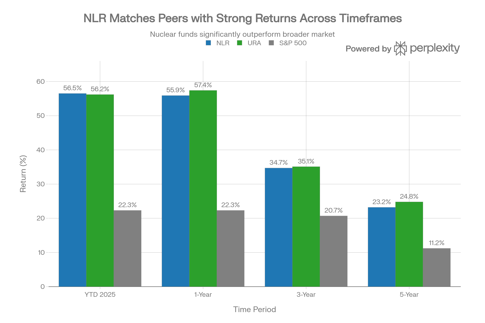
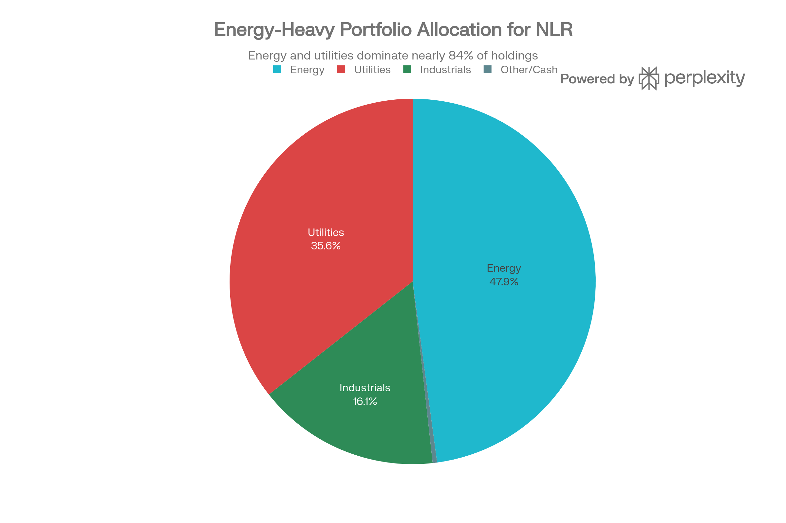
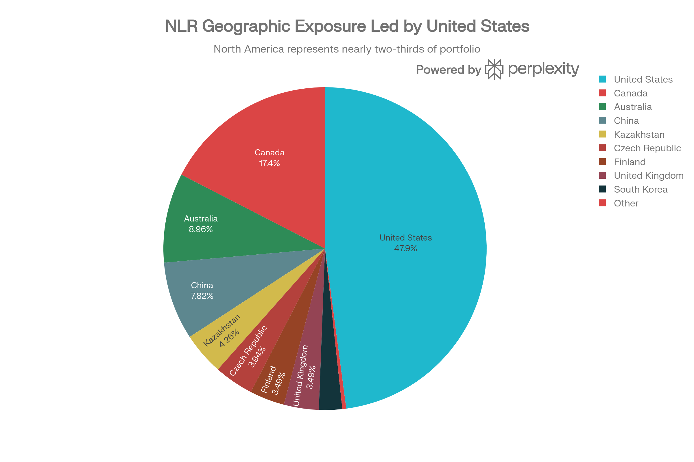

# NLR (VanEck Uranium and Nuclear ETF) 종합 투자 분석 보고서

## ETF 분류

| 항목 | 내용 |
|---|---|
| 최종 폴더 | `ETF/Power Infrastructure/Nuclear and Uranium/NLR` |
| 대분류 | 전력 인프라 |
| 하위 분류 | 원전·우라늄 |
| 핵심 전략 | 우라늄 채굴, 원전 운영 유틸리티, 원자력 기술·서비스 기업에 글로벌 분산 투자 |
| 운용 방식 | MVIS Global Uranium & Nuclear Energy Index 추종 패시브 ETF |
| 레버리지/인버스 | 없음 |
| 옵션 인컴 여부 | 없음 |
| 분류 판단 | 단순 원자재 채굴보다 원전 운영·유틸리티·원자력 서비스까지 포함하는 전력 인프라 테마 ETF이므로 `Power Infrastructure/Nuclear and Uranium`으로 분류 |

***

## 실행 요약

VanEck의 NLR (Uranium and Nuclear ETF)은 전 세계 원자력 및 우라늄 산업 전반에 대한 포괄적 노출을 제공하는 지수 추적형 ETF입니다. 2025년 말 기준 순자산 \$4.47억을 관리하며, 연초 대비 55.9% 수익률을 기록하여 S\&P 500의 22.3%를 크게 상회했습니다. NLR은 채광업체 중심의 경쟁사(URA, URNM)와 달리 유틸리티(35.62%), 에너지(47.86%), 산업(16.12%)을 균형있게 포함하여, 중간 정도의 변동성과 상대적으로 낮은 하방 위험을 특징으로 합니다. 2026년은 AI 데이터센터 수요 증가, 우라늄 공급 부족 심화, 강화된 정책 지원이 결합되면서 원자력 산업에 구조적 호재가 강하게 작용할 것으로 예상됩니다.

***

## 1. 기금 개요 및 구조

### 1.1 기본 정보

NLR은 2007년 8월 13일 설정된 20년 이상의 운용 이력을 가진 성숙한 ETF입니다. VanEck에서 관리하며, MVIS Global Uranium \& Nuclear Energy Index를 수동적으로 추적합니다. 기금의 투자 목표는 우라늄 채굴, 원자력 발전소 건설·유지보수, 핵에너지 발전, 관련 장비·기술·서비스를 제공하는 기업들에 투자하는 것입니다.[^1][^2][^3]

<strong>주요 기금 규모 지표:</strong>

- 순자산(AUM): \$4.47억 (2026년 1월 16일 기준)[^1]
- 보유 종목: 28개[^4]
- 보유 주식: 2,644만 주[^2]
- 상장일: 미국 AMEX (NYSE Arca)[^2]

### 1.2 운용 수수료 및 비용 구조

NLR의 순 운용 수수료는 0.56%입니다. 이는 업계 기준으로 경쟁력 있는 수준입니다. VanEck는 수수료 상한선을 2026년 5월 1일까지 0.60%로 설정하여, 자산 규모가 확대될 경우에도 투자자 보호 장치를 마련했습니다. 비교 대상 ETF 중 URA는 0.69%, URNM은 0.75%의 수수료를 징수하므로, NLR이 상대적으로 저비용 옵션입니다.[^2][^5][^6][^7][^8][^9]

***

## 2. 성과 분석

### 2.1 다기간 수익률

NLR은 2025년 강한 상승률을 기록했으며, 모든 주요 시장 지수 및 경쟁사를 상회했습니다.

NLR vs Uranium \& Nuclear ETF Peers Performance Comparison (2025-2023)

<strong>성과 하이라이트:</strong>

- <strong>연초 기준(YTD)</strong>: 55.9% (NAV 기준)[^10]
- <strong>1년 수익률</strong>: 55.9%[^10]
- <strong>3년 연평균</strong>: 34.4%[^10]
- <strong>5년 연평균</strong>: 23.0%[^10]
- <strong>10년 연평균</strong>: 13.8%[^10]

2025년 성과는 다음의 구조적 요인들에 의해 주도되었습니다: (1) 우라늄 공급 부족 심화에 따른 장기 가격 상승 기대, (2) AI 데이터센터의 기저부하 전력 수요 급증, (3) 미국과 주요 선진국의 원자력 정책 지원 강화입니다.[^3][^11][^12]

### 2.2 경쟁사 비교

NLR은 2025년 성과 면에서 주요 우라늄/원자력 ETF인 URA(Global X Uranium ETF)와 유사한 수익률을 달성했습니다. 그러나 더 중요한 차이는 포트폴리오 구성에 있습니다.[^13][^8]

| 지표 | NLR | URA | URNM |
| :-- | :-- | :-- | :-- |
| <strong>2025 YTD 수익률</strong> | 56.5%[^10] | 56.2%[^8] | 데이터 부족 |
| <strong>1년 수익률</strong> | 55.9%[^10] | 57.4%[^8] | \~60%+ |
| <strong>순자산(AUM)</strong> | \$4.47억[^1] | \$5.40억[^9] | \$1.83억[^9] |
| <strong>운용 수수료</strong> | 0.56%[^2] | 0.69%[^8] | 0.75%[^9] |
| <strong>변동성(1년)</strong> | 8.02%[^8] | 8.44%[^8] | 더 높음 |
| <strong>포트폴리오 초점</strong> | 균형(채광, 유틸리티, 서비스) | 우라늄 채광 중심 | 채광 업체만 |
| <strong>배당수익률</strong> | 0.42-2.14%[^14][^15] | 1.49%[^9] | 2.23%[^9] |

NLR의 핵심 차별성은 채광 업체뿐 아니라 유틸리티 회사도 상당히 포함하고 있다는 점입니다. 이는 우라늄 가격 변동성에 대한 노출을 감소시키면서도 원자력 산업 전반의 성장 혜택을 누릴 수 있게 해줍니다.[^16][^13]

***

## 3. 포트폴리오 구성

### 3.1 상위 10개 종목

NLR Sector Allocation (as of December 31, 2025)

NLR은 28개 종목에 분산 투자하며, 상위 10개 종목이 전체 자산의 55.59%를 차지합니다. 이는 중간 수준의 집중도를 의미합니다.[^4]

<strong>상위 10개 보유 종목(2026년 1월 15일):</strong>

| 순위 | 종목명 | 티커 | 비중 | 분류 |
| :-- | :-- | :-- | :-- | :-- |
| 1 | Cameco Corporation | CCJ | 8.67% | 우라늄 채광 |
| 2 | Constellation Energy | CEG | 6.79% | 원자력 발전 유틸리티 |
| 3 | BWX Technologies | BWXT | 5.88% | 원자력 기술/서비스 |
| 4 | Uranium Energy Corp | UEC | 5.51% | 우라늄 채광 |
| 5 | Denison Mines Corp | DML | 5.31% | 우라늄 채광 |
| 6 | Oklo Inc | OKLO | 4.91% | 소형 모듈 원자로(SMR) |
| 7 | NexGen Energy Ltd | NXE | 5.10% | 우라늄 채광 |
| 8 | Centrus Energy Corp | LEU | 4.69% | 우라늄 농축 |
| 9 | Public Service Enterprise Group | PEG | 4.65% | 유틸리티/발전 |
| 10 | PG\&E Corporation | PCG | 4.48% | 유틸리티/발전 |

<strong>주요 관찰:</strong>

1. <strong>채광 업체 비중</strong>: Cameco, Uranium Energy, Denison, NexGen 등 상위 10개 중 약 35%가 우라늄 채광에 집중되어 있습니다.[^4]
2. <strong>유틸리티 포함</strong>: Constellation Energy(6.79%), Public Service Enterprise Group(4.65%), PG\&E(4.48%)는 전기 생산·판매 회사로 안정적 수익원을 제공합니다.[^4]
3. <strong>신기술 노출</strong>: Oklo(4.91%)는 소형 모듈형 원자로(SMR) 개발사로, AI 시대 새로운 전력 수요 맞춤형 기술에 노출되어 있습니다.[^13][^4]

### 3.2 섹터 배분

NLR의 섹터 배분은 유라늄/원자력 산업 가치사슬 전반에 걸쳐 균형있게 분포합니다.[^1]

- <strong>에너지</strong>: 47.86% (우라늄 채광 업체들이 대부분)[^1]
- <strong>유틸리티</strong>: 35.62% (원전 운영, 전력 판매)[^1]
- <strong>산업</strong>: 16.12% (원자로 건설, 엔지니어링, 부품 공급)[^1]
- <strong>현금/기타</strong>: 0.39%[^1]

이 구성은 NLR을 경쟁사와 구별합니다. URA와 URNM은 채광 업체 비중이 훨씬 높아 우라늄 가격에 더욱 민감합니다.[^17][^13]

### 3.3 지역별 배분

NLR Geographic Allocation (as of December 31, 2025)

NLR은 미국 중심(47.90%)이면서도 글로벌 우라늄 공급처와 원자력 운영국에 분산 투자합니다.[^1]

<strong>주요 지역별 노출:</strong>

- <strong>북미</strong>: 65.33% (미국 47.90% + 캐나다 17.43%) - 양국 모두 선진 원자력 기술과 안정적 규제 환경 보유[^1]
- <strong>애시아</strong>: 17.97% (중국 7.82% + 호주 8.96% + 한국 2.32%) - 급성장하는 원자력 수요 지역[^1]
- <strong>유럽</strong>: 14.35% (카자흐스탄 4.26% + 체코 3.94% + 핀란드 3.49% + 영국 3.49%) - 주요 우라늄 공급처 및 원자력 운영국[^1]

이러한 지역 분산은 특정 국가의 정책 변화나 규제 리스크를 완화합니다.[^18]

***

## 4. 수익률, 배당 및 수익성

### 4.1 배당 수익률 및 배당금

NLR의 배당 정책은 매년 변동성을 보입니다.[^19]

<strong>최근 배당 이력:</strong>

- <strong>2025년</strong>: \$3.17 (2025년 12월 22일 배당락일)[^15][^19]
- <strong>2024년</strong>: \$0.61 (2024년 12월 23일)[^15][^19]
- <strong>2023년</strong>: \$3.26 (2023년 12월 18일)[^15]
- <strong>2022년</strong>: \$1.11 (2022년 12월 19일)[^15]

<strong>현재 배당수익률</strong>: 0.48%[^15]

배당의 높은 변동성은 원자력 산업 기업들의 순환적 이익 변동을 반영합니다. 배당락은 매년 12월 말에 집중되어 있어 예측 가능합니다.[^19][^15]

### 4.2 수익성 지표

- <strong>PER (주가수익비율)</strong>: 28.14\~30.40배 - 역사적 평균 45배, 최고점 85배 대비 현재 가치평가는 중간 수준[^9][^20]
- <strong>배당 지급률</strong>: 13.21%\~89.91% 범위 - 기업 지분에 따라 대폭 변함[^15][^19]
- <strong>3년 배당 성장률</strong>: 30% - 강력한 장기 배당 성장 추세[^19]

***

## 5. 위험 프로필 및 변동성

### 5.1 변동성 및 체계적 위험

NLR은 시장 평균보다 높은 변동성을 보입니다.[^21][^22]

<strong>위험 지표:</strong>

- <strong>베타</strong>: 1.13\~1.15 - S\&P 500 변동의 13-15% 추가 변동성 의미[^22][^21]
- <strong>1년 연율 표준편차</strong>: \~37-40% - 높은 변동성[^16]
- <strong>최대 낙폭(Max Drawdown)</strong>: \~-30%[^16]
- <strong>Sharpe 비율</strong>: \~1.7 - 위험 조정 수익률은 양호함[^16]
- <strong>SPY와의 상관계수</strong>: 0.28-0.29 - 낮은 상관성, 포트폴리오 다각화 효과[^21][^22]

### 5.2 52주 변동 범위

- <strong>최고가</strong>: \$168.12 (2025년)[^21]
- <strong>최저가</strong>: \$64.26[^23]
- <strong>변동폭</strong>: 161% - 매우 높음

이는 NLR이 매우 사이클리컬하고 정책 뉴스, 우라늄 가격, AI 수요 등 특정 테마에 민감함을 의미합니다.[^16]

### 5.3 주요 리스크 요인

1. <strong>정책/규제 리스크</strong>: 원자력 정책 역전, 허가 지연, 서방 시장에서의 정치적 난제[^16]
2. <strong>프로젝트 실행 리스크</strong>: 원자력 프로젝트의 원가 초과, 일정 지연, 기술적 문제[^16]
3. <strong>우라늄 공급 응답 리스크</strong>: 가격이 너무 높으면 신규 광산 개발이 촉진되어 가격 하락 가능성[^3][^24]
4. <strong>기업 신용 리스크</strong>: 소형 우라늄 채광업체 중 상당수는 프리-레버니 스테이지(pre-revenue)로 실패 위험 존재[^16]
5. <strong>모멘텀 역행 리스크</strong>: 현재 강한 수익률과 기금 유입이 의존하는 테마 모멘텀이 역전될 경우 급락 가능[^25][^16]
6. <strong>해외 정치 리스크</strong>: 카자흐스탄(우라늄 생산의 \~40%), 중국 노출로 인한 지정학적 리스크[^1][^11]

***

## 6. 유동성 및 거래 특성

### 6.1 거래량 및 유동성

NLR은 충분한 유동성을 갖춘 성숙한 ETF입니다.[^26]

<strong>유동성 지표:</strong>

- <strong>평균 일일 거래량</strong>: 551,000\~839,694주[^25][^26]
- <strong>평균 일일 거래액</strong>: \$80-92 백만[^26]
- <strong>매수호가-매도호가 스프레드</strong>: \~0.18% (매우 좁음)[^25]
- <strong>유동성 등급</strong>: Seeking Alpha A- 등급[^26]
- <strong>회전율(Turnover)</strong>: 1.8%[^25]

이는 투자자가 크기에 관계없이 최소한의 거래 비용으로 진입/퇴출할 수 있음을 의미합니다.[^26]

### 6.2 펀드 흐름 및 투자자 심리

- <strong>1년 펀드 유입</strong>: \$2.23\~2.44억 - 강력한 긍정적 수정 의사[^27][^28]
- <strong>NAV 대비 프리미엄/디스카운트</strong>: 0.37\~0.48% 프리미엄 - 투자자 수요가 공급을 약간 초과[^27]

이는 투자자들이 NLR에 매우 적극적인 수요를 보이고 있으며, 강한 수익률 추세에 의존한 것으로 보입니다.[^28]

***

## 7. 시장 환경 및 투자 논거

### 7.1 우라늄 시장 펀더멘털

2026년 우라늄 시장은 공급 부족과 수요 급증이 만나는 구조적 전환점에 있습니다.[^11][^29]

<strong>공급 측 제약:</strong>

- 현재 전 세계 우라늄 생산량은 수요의 90%만 충족, 10%는 재고 사용[^11]
- 세계 우라느 공급: 2024년 \~78,000톤 → 2030년 \~97,000톤 예상 (24% 증가)[^11]
- 기존 광산 대부분은 2030년 이후 생산 감소 또는 폐광 예정, 새로운 프로젝트 필요[^11]
- 우라늄 가격이 \$125-150 범위를 유지해야만 신규 광산 투자 가능[^11]

<strong>수요 측 확대:</strong>

- 글로벌 핵에너지 발전 용량: 398GWe(2024) → 746GWe(2040) 거의 2배 증가[^11]
- 우라늄 수요: 68,900톤(2025) → 150,000+ 톤(2040)[^11]
- 장기 수요 증가율: 연평균 4.1% CAGR[^11]

<strong>결과: 구조적 공급 부족이 2026년 이후 2년간 심화될 것으로 예상.</strong>[^24][^29][^11]

### 7.2 AI 데이터센터 전력 수요 혁명

기술 대기업들이 AI 인프라 급확대에 따른 안정적 기저부하 전력원으로 원자력에 주목하고 있습니다.[^12][^30]

<strong>AI 전력 수요 폭증:</strong>

- AI 데이터센터 전력 수요 성장률: 122% CAGR (2025-2028)[^12]
- 2030년까지 전 세계 데이터센터 전력 소비: 현재 대비 2배 이상 증가[^12]
- 미국 내 데이터센터 전력 비중: 2030년 9%로 상승[^12]

<strong>왜 원자력인가:</strong>

1. <strong>24/7 안정적 기저부하</strong>: 재생에너지와 달리 간헐성 없음[^30][^12]
2. <strong>저탄소 배출</strong>: AI ESG 약속 충족[^12]
3. <strong>높은 에너지 밀도</strong>: 작은 공간에서 대용량 전력 공급[^12]
4. <strong>그리드 회복력</strong>: 광역 정전 리스크 완화[^12]

<strong>대형 기술사의 원자력 PPA 급증</strong>:[^12]

- Google, Microsoft, Amazon, Meta 등이 2024-2025년 수십 건의 원자력 발전소 전력 구매 계약(PPA) 체결
- 이는 원자력 산업에 수십 년 만의 가시적 장기 수요 신호 제공

### 7.3 정책 환경 개선

미국을 중심으로 원자력에 대한 정치적 지원이 급증했습니다.[^12][^29][^31]

<strong>트럼프 행정부 조치 (2025년)</strong>:

1. 원자력 배포 가속화를 위한 4개 행정명령 서명[^12]
2. 2050년까지 미국 원자력 발전 용량 4배 증대 목표[^12]
3. 국내 우라느 채광 및 농축 역량 강화를 위한 \$2.7억 승인[^32]
4. SMR(소형 모듈 원자로) 테스트 및 규제 승인 프로세스 가속화[^12]

<strong>국제 정책 지원:</strong>

- 프랑스, 일본, 중국 등 주요국도 원자력 확충 정책 추진[^3][^11]
- 국제 협력 프레임워크 강화(IAEA 등)[^3]

<strong>평가: 이는 원자력 산업에 10년 이상 없었던 수준의 정책 꼬리바람을 제공합니다.</strong>[^29][^12]

### 7.4 우라늄 가격 전망

은행과 애널리스트들의 2026년 우라늄 가격 전망은 강세입니다.[^32][^29][^33]

| 기관 | 2026 목표 | 논거 |
| :-- | :-- | :-- |
| BofA | 50% 상승 예상 | 공급 부족, 장기 가격 상승[^32] |
| 범위 | \$80-150 파운드당 | 수요 펀더멘털 견고[^33] |
| 스프롯 | 구조적 재설정 (일시적 사이클이 아님) | 공급 제약 구조적이며 빠른 대응 불가[^29] |
| 분석가 | \$125-150 (10년 평균 필요 수준) | 신규 광산 투자 유인에 필요한 수준[^11] |

<strong>핵심 통찰</strong>: 애널리스트들은 우라늄 가격이 일시적 사이클이 아닌 "구조적 재설정"으로 본다. 즉, 가격이 상승한 후 예전 수준으로 돌아가지 않고 새로운 높은 평준에서 안정화될 것으로 예상.[^29][^33]

***

## 8. 투자 등급 및 권장 사항

### 8.1 투자자 적합성

NLR은 특정 투자자 프로필에 적합합니다.[^16][^18]

<strong>적합한 투자자:</strong>

- <strong>높은 위험 허용도</strong>: \~37% 변동성과 -20\~-30% 낙폭 수용 가능[^16]
- <strong>장기 보유자</strong>: 5년 이상 투자 지평[^18]
- <strong>테마 신봉자</strong>: AI 전력화, 원자력 르네상스 등 장기 추세 확신[^3][^12]
- <strong>포트폴리오 위성 보유</strong>: 핵심(core) 자산이 아닌 부수적 성장 공략용[^18]
- <strong>성장 지향</strong>: 배당보다는 자본 증가 추구[^18]

<strong>부적합한 투자자:</strong>

- 보수적 투자자 (변동성 회피)[^16]
- 단기 수익 추구자 (배당금 최대화 원함)[^16]
- 업체 선택 능력 부족 (사이클 타이밍 어려움)[^16]

### 8.2 포트폴리오 위치 및 규모

NLR은 위성(satellite) 포지션으로 배치해야 합니다.[^16][^18]

- <strong>공격적 포트폴리오(연령 < 40)</strong>: 전체 자산의 3-8% (핵심은 ETF 60-80%, 나머지 성장자산)
- <strong>보수적 포트폴리오(연령 > 60)</strong>: 전체 자산의 0-2% (선택적, 테마 확신 있을 시에만)
- <strong>중도 포트폴리오(연령 40-60)</strong>: 전체 자산의 2-4%

시작은 작게, 추가 매수는 약 10-15% 낙폭 시에 진행하는 "분할 진입" 전략 권장.[^16]

### 8.3 진입/청산 시점

<strong>긍정적 시나리오:</strong>

- 우라늄 공급 부족이 2026-2027년 더욱 심화
- AI 기술사의 원자력 PPA 추가 체결
- 미국 SMR 규제 승인 가속화
- 목표가: \$180-200 (현재 \$145 대비 24-38% 상승 가능)[^16]

<strong>부정적 시나리오:</strong>

- AI 자본지출 둔화 신호
- 우라늘 채산성 악화 또는 새로운 공급 개발
- 정책 역전 (원자력 반감론 재부상)
- 목표가: \$100-120 (현재 대비 -20\~-31% 낙폭)[^16]

***

## 9. 경쟁 환경 상세 비교

### 9.1 NLR vs URA (Global X Uranium ETF)

| 차원 | NLR | URA | 판정 |
| :-- | :-- | :-- | :-- |
| <strong>포트폴리오 집중도</strong> | 28개 종목 | 더 많은 종목 | URA |
| <strong>채광 업체 비중</strong> | \~50% | \~70% | NLR (더 균형) |
| <strong>유틸리티 비중</strong> | 35.62% | 더 낮음 | NLR |
| <strong>우라늘 가격 민감도</strong> | 중간 | 높음 | NLR (더 낮음) |
| <strong>변동성</strong> | 8.02% | 8.44% | NLR (더 낮음) |
| <strong>운용수수료</strong> | 0.56% | 0.69% | NLR |
| <strong>배당수익률</strong> | 0.42% | 1.49% | URA |
| <strong>AUM</strong> | \$4.47억 | \$5.40억 | URA (더 안정) |
| <strong>추천 이유</strong> | 균형잡힌 노출, 낮은 비용 | 우라늘 가격 직결 수익성 추구 | 보수적 투자자: NLR / 공격적: URA |

<strong>결론</strong>: NLR은 원자력 산업 전반의 성장을 노리는 투자자에게, URA는 순수 우라늘 가격 상승에 베팅하려는 투자자에게 더 적합합니다.[^8][^9][^16]

### 9.2 NLR vs URNM (Sprott Uranium Miners ETF)

| 차원 | NLR | URNM | 판정 |
| :-- | :-- | :-- | :-- |
| <strong>포트폴리오</strong> | 28개(채광/유틸리티/서비스) | 채광사만 | NLR (다각화) |
| <strong>변동성</strong> | \~37-40% | 더 높음 | NLR |
| <strong>배당수익률</strong> | 0.42% | 2.23% | URNM (높은 배당) |
| <strong>집중도 위험</strong> | 중간 | 높음 | NLR |
| <strong>운용수수료</strong> | 0.56% | 0.75% | NLR |
| <strong>우라늘 가격 상승 시 상승폭</strong> | 중간 | 매우 큼 | URNM |
| <strong>우라늘 가격 하락 시 낙폭</strong> | 중간 | 매우 큼 | NLR (손실 완화) |

<strong>결론</strong>: URNM은 높은 변동성과 극대 우라늘 수익성을 추구하는 투자자용이고, NLR은 변동성 중간 수준에서 다각화된 원자력 노출을 원하는 투자자용입니다.[^9][^16]

### 9.3 NLR vs NUKZ (Range Nuclear Renaissance Index ETF)

| 차원 | NLR | NUKZ | 판정 |
| :-- | :-- | :-- | :-- |
| <strong>포트폴리오 규모</strong> | 28개 종목 | 50개 종목 | NUKZ (더 분산) |
| <strong>순자산</strong> | \$4.47억 | \$772.48백만 | NLR (더 유동성) |
| <strong>운용수수료</strong> | 0.56% | 0.85% | NLR |
| <strong>PER</strong> | 28-30배 | 22.89배 | NUKZ (저평가) |
| <strong>배당수익률</strong> | 0.42% | 0.05% | NLR |
| <strong>유동성</strong> | 매우 좋음 | 낮음 | NLR |

<strong>결론</strong>: NLR은 더 좋은 유동성과 낮은 비용, NUKZ는 더 높은 분산을 추구하는 투자자용입니다.[^9][^25][^34]

***

## 10. 결론 및 최종 평가

### 10.1 투자 관점 종합 평가

NLR은 2026년 다음의 세 가지 강력한 구조적 호재에 의해 지원될 것으로 예상되는 매력적인 투자 기회입니다:

1. <strong>우라늘 시장 공급 부족 심화</strong>: 2026년부터 1.9억 파운드 이상 규모의 공급 적자 예상[^11]
2. <strong>AI 데이터센터 기저부하 수요 폭증</strong>: 122% CAGR로 성장 중인 전력 수요[^12]
3. <strong>정책 지원 강화</strong>: 트럼프 행정부와 국제사회의 원자력 가속화 정책[^32][^12]

NLR은 경쟁사(URA, URNM)보다 유틸리티 노출을 통해 상대적으로 낮은 변동성과 하방 보호를 제공하면서도 원자력 산업 전반의 성장 혜택을 누릴 수 있습니다.[^13][^16]

### 10.2 위험 고려사항

그러나 투자자는 다음의 리스크를 명확히 이해해야 합니다:

1. <strong>고변동성</strong>: \~37-40% 연율 표준편차는 주식시장 평균의 1.5-2배[^16]
2. <strong>정책 역전 리스크</strong>: 원자력 정책 변화는 빠를 수 있음[^16]
3. <strong>프로젝트 실행 리스크</strong>: 원자력 개발은 장시간 소요되고 비용 초과가 흔함[^16]
4. <strong>신신뢰성 기업 노출</strong>: 소형 채광사 중 상당수는 프리-레버니 단계로 실패 가능성[^16]

### 10.3 최종 권장사항

<strong>"조건부 매수"</strong>

<strong>적극 권장 (매수):</strong>

- 5년 이상 투자 지평을 가진 투자자
- 높은 위험 허용도를 가진 투자자
- 포트폴리오의 위성 자산(3-8%)으로 배치 계획 있는 투자자
- 현재 가격(\$145) 또는 10-15% 낙폭 시 진입 시점 적절

<strong>조건부 보유:</strong>

- 현재 보유자: 연년 실적이 나쁘지 않으면 보유
- 상승 목표가: \$180-200 (24-38% 상승 여력)
- 손실 한계: \$115-120 (-20\~-31% 스톱로스)

<strong>비추천:</strong>

- 보수적 투자자, 단기 보유자, 선진국 유틸리티/채권 수익 추구자

### 10.4 시나리오별 기대 수익률 (1년 후)

| 시나리오 | 확률 | 목표가 | 수익률 |
| :-- | :-- | :-- | :-- |
| 약세 (공급 확대/정책 역전) | 20% | \$100-115 | -23\~-31% |
| 중도 (현상 유지) | 45% | \$140-160 | -3\~+10% |
| 강세 (우라늘 공급 급증/AI 수요) | 30% | \$180-200 | +24\~+38% |
| 극강세 (정책 초강경화) | 5% | \$220+ | +52%+ |
| <strong>기대값 (가중평균)</strong> | - | <strong>\~\$148-155</strong> | <strong>+2\~+7%</strong> |

***

<strong>보고서 작성일</strong>: 2026년 1월 17일 (KST)
<strong>데이터 기준</strong>: 2026년 1월 15-16일
<strong>출처</strong>: VanEck 공식, 트레이딩뷰, 스톡 애널리시스, Seeking Alpha, 모닝스타 등 공식 재무 데이터

***

## 참고 자료 (인용 출처)

kr.investing.com - NLR 배당수익률[^35]
Investing.com - NLR 배당 정보[^14]
Naver Premium - URA vs NLR 비교[^17]
B-ECB Blog - NLR 대표적 우라늘 ETF 분석[^13]
VanEck 공식 - NLR ETF 상세 정보[^1]
TradingView - NLR ETF 분석[^27]
TradingView - AMEX NLR 정보[^2]
StockAnalysis - NLR 보유 현황[^4]
Schwab WallStreet - NLR 성과[^10]
Ad-hoc News - NLR 원자력 성장[^5]
StockAnalysis - NLR 배당 이력[^15]
ETF Trends - NLR 질문과 답변[^3]
VanEck ETF 가이드 - 운용 수수료 정보[^6]
Digrin - NLR 배당 정보[^19]
MarketChameleon - NLR 프로필[^7]
MarketChameleon - NLR 통계[^21]
MarketChameleon - NLR 개요[^22]
PortfoliosLab - URA vs NLR 비교[^8]
Webull - NLR 주가 정보[^23]
StockAnalysis - ETF 비교 도구 (URA, URNM, NLR, NUKZ)[^9]
Seeking Alpha - NLR 유동성[^26]
TradeNews - NLR ETF 평가 및 분석[^16]
TradingView - NLR 펀드 플로우[^28]
Benzinga (한국) - 2026년 우라늘 전망[^24]
ETF Research Center - NLR 분석[^25]
VanEck Asia - NLR ETF 질문과 답변[^18]
Benzinga (한국) - 2026년 우라늘 폭등 예상[^32]
ETF Database - NLR 개요[^36]
StockAnalysis - NLR ETF 개요[^20]
Yahoo Finance - NLR 보유 현황[^37]
INN - 2026년 우라늘 가격 전망[^11]
IO Fund - 원자력과 AI 데이터센터[^12]
Sprott - 2026년 우라늘 전망[^29]
Bessemer Trust - AI 시대 전력화 과제[^30]
TipRanks - NUKZ 유사 ETF[^34]
Crux Investor - 2026년 우라늘 시장 전망[^33]
Nuclear Business Platform - 원자력 투자 전망[^31]
[^38][^39][^40][^41][^42][^43][^44][^45][^46][^47][^48][^49][^50][^51][^52][^53][^54]

⁂

[^1]: https://www.vaneck.com/us/en/investments/uranium-nuclear-energy-etf-nlr/

[^2]: https://www.tradingview.com/symbols/AMEX-NLR/

[^3]: https://www.etftrends.com/tactical-allocation-channel/nlr-etf-question-answer/

[^4]: https://stockanalysis.com/etf/nlr/holdings/

[^5]: https://www.ad-hoc-news.de/boerse/news/ueberblick/nuclear-power-s-resurgence-fuels-growth-for-vaneck-s-diversified-etf/68492105

[^6]: https://www.vaneck.com/us/en/vaneck-etfs-fees.pdf

[^7]: https://marketchameleon.com/Overview/NLR/ETFProfile/

[^8]: https://portfolioslab.com/tools/stock-comparison/URA/NLR

[^9]: https://stockanalysis.com/etf/compare/ura-vs-urnm-vs-nlr-vs-nukz-vs-tsx:hura/

[^10]: https://www.schwab.wallst.com/Prospect/Research/etfs/performance.asp?symbol=NLR

[^11]: https://investingnews.com/uranium-forecast/

[^12]: https://io-fund.com/artificial-intelligence/nuclear-energy-ai-data-centers

[^13]: https://b-ecb.tistory.com/entry/NLRVanEck-Uranium-and-Nuclear-ETF-대표적인-우라늄-및-원자력-발전-ETF

[^14]: https://kr.investing.com/etfs/marketvectors-nuclear-energy

[^15]: https://stockanalysis.com/etf/nlr/dividend/

[^16]: https://www.tradingnews.com/news/nlr-etf-at-145-usd-uranium-nuclear-power

[^17]: https://contents.premium.naver.com/sec/vectorinsight/contents/250906021931375ux

[^18]: https://www.vaneck.com/asia/en/news-and-insights/blogs/natural-resources/nlr-etf-question-answer/

[^19]: https://www.digrin.com/stocks/detail/NLR/

[^20]: https://stockanalysis.com/etf/nlr/

[^21]: https://marketchameleon.com/Overview/NLR/Summary/

[^22]: https://marketchameleon.com/Overview/NLR/

[^23]: https://www.webull.com/quote/nysearca-nlr

[^24]: https://kr.investing.com/news/stock-market-news/article-1778392

[^25]: https://www.etfrc.com/NLR

[^26]: https://seekingalpha.com/symbol/NLR/liquidity

[^27]: https://kr.tradingview.com/symbols/AMEX-NLR/analysis/

[^28]: https://www.tradingview.com/symbols/AMEX-NLR/analysis/

[^29]: https://sprott.com/insights/uranium-outlook-2026/

[^30]: https://www.bessemertrust.com/insights/powering-the-ai-age

[^31]: https://www.nuclearbusiness-platform.com/media/insights/nuclear-investment-outlook

[^32]: https://kr.benzinga.com/news/usa/othermarkets/2026년은-우라늄의-해bofa-50-폭등-예고하며-추/

[^33]: https://www.cruxinvestor.com/posts/uranium-market-outlook-2026-navigating-uncertainty-and-investment-strategy

[^34]: https://www.tipranks.com/etf/nukz/similar-etfs

[^35]: QTUM (Defiance Quantum ETF).md

[^36]: https://etfdb.com/etf/NLR/

[^37]: https://finance.yahoo.com/quote/NLR/holdings/

[^38]: SETM (Sprott Critical Materials ETF).md

[^39]: REMX (VanEck Rare Earth, Strategic Metals ETF).md

[^40]: https://www.mk.co.kr/news/stock/11400605

[^41]: https://markets.ft.com/data/etfs/tearsheet/summary?s=NLR%3APCQ%3AUSD

[^42]: https://kr.benzinga.com/quote/NLR/holdings

[^43]: https://www.investing.com/etfs/marketvectors-nuclear-energy

[^44]: https://kr.investing.com/etfs/marketvectors-nuclear-energy-candlestick

[^45]: https://www.justetf.com/en/etf-profile.html?isin=IE000M7V94E1

[^46]: https://companiesmarketcap.com/vaneck-uranium-and-nuclear-etf/holdings/

[^47]: https://www.morningstar.com/etfs/xmex/nlr/portfolio

[^48]: https://stockevents.app/en/stock/NLR/dividends

[^49]: https://news.stocktradersdaily.com/news_release/15/NLR_Volatility_Zones_as_Tactical_Triggers_010226033801_1767343081.html

[^50]: https://seekingalpha.com/article/4836982-nlr-a-proxy-for-nuclear-theme-investing

[^51]: https://www.investing.com/etfs/marketvectors-nuclear-energy-holdings

[^52]: https://www.dbpia.co.kr/journal/articleDetail?nodeId=NODE01879066

[^53]: https://koreascience.or.kr/article/JAKO200856450900234.pdf

[^54]: https://www.msci.com/documents/10199/255599/msci-emerging-markets-small-cap-risk-weighted-index.pdf
