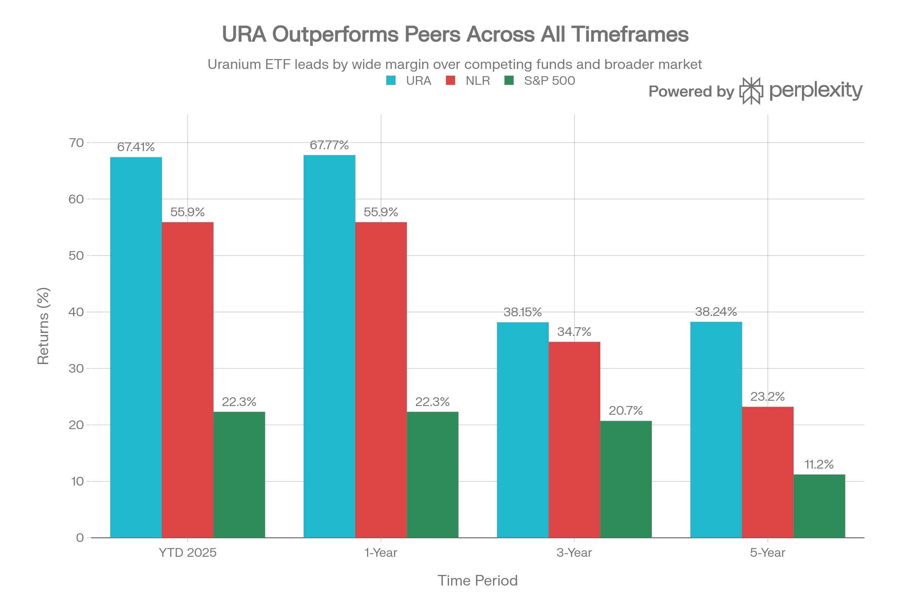
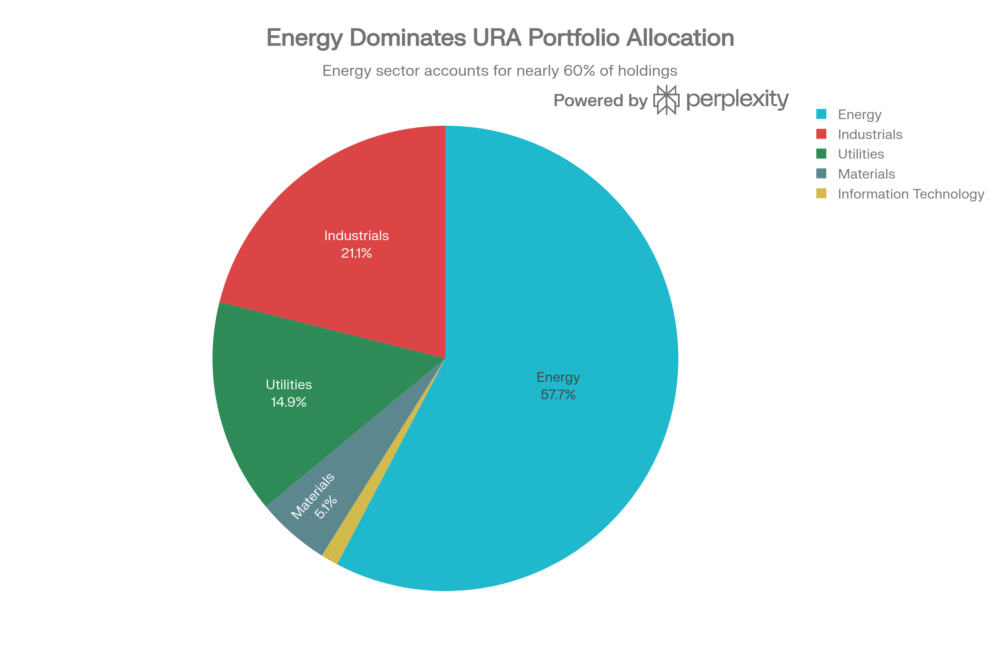
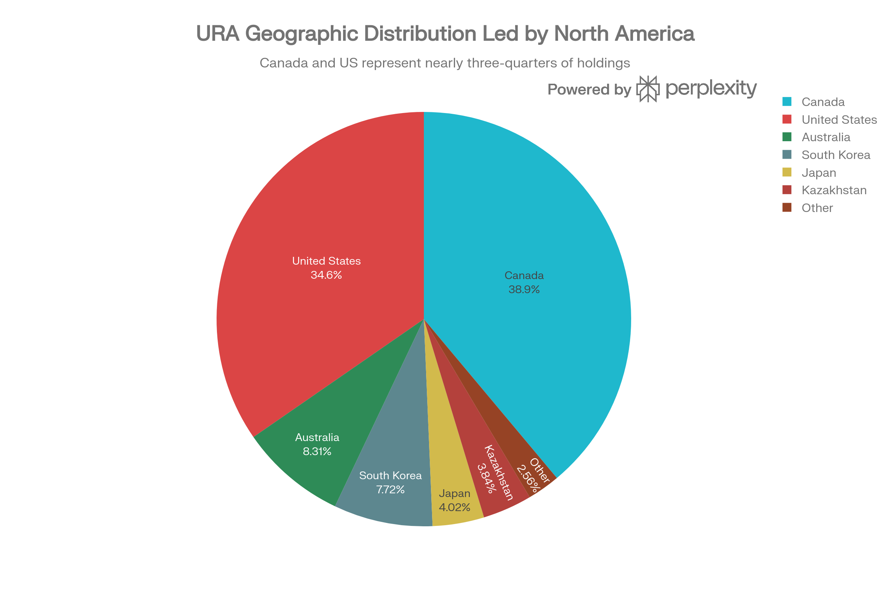

# URA (Global X Uranium ETF) 종합 투자 분석 보고서

## ETF 분류

| 항목 | 내용 |
|---|---|
| 최종 폴더 | `ETF/Power Infrastructure/Nuclear and Uranium/URA` |
| 대분류 | 전력 인프라 |
| 하위 분류 | 원전·우라늄 |
| 핵심 전략 | 우라늄 채굴, 물리적 우라늄 신탁, 원전 부품·기술·서비스 기업에 글로벌 분산 투자 |
| 운용 방식 | Solactive Global Uranium & Nuclear Components Total Return Index 추종 패시브 ETF |
| 레버리지/인버스 | 없음 |
| 옵션 인컴 여부 | 없음 |
| 분류 판단 | 우라늄 채굴 비중이 높지만 원전 부품·SMR·원자력 가치사슬까지 포함하므로 전력 인프라 내 `Nuclear and Uranium` 테마로 분류 |

***

## 실행 요약

Global X의 URA (Global X Uranium ETF)는 세계 최대 규모의 순수 우라늄 산업 투자 도구로, 2026년 1월 기준 순자산 \$5.40억을 관리하고 있습니다. 2025년 67.77% 수익률을 기록하여 경쟁사 NLR의 55.9% 및 S\&P 500의 22.3%를 크게 상회했습니다. URA는 우라늄 채광 기업들에 57.7% 집중 투자하며, 글로벌 최고의 유동성과 0.69% 운용 수수료를 제공합니다. 그러나 극도의 포트폴리오 집중도(상위 3개 42%), 극심한 변동성(베타 1.24-1.33), 그리고 강렬한 수익 매도로 인한 음수 펀드 플로우가 주의해야 할 위험 요소입니다. 2026년은 우라늄 공급 부족, AI 데이터센터 수요, 정책 지원이 강화되지만, 현재의 극도의 가치평가와 기술적 과열 상태는 단기 조정 위험을 높입니다.[^1][^2][^3][^4]

***

## 1. 기금 개요 및 구조

### 1.1 기본 정보

URA는 2010년 11월 4일 설정된 15년 이상 운용 이력을 가진 업계 최대 규모의 우라늄 ETF입니다. Global X Management Company LLC (Mirae Asset의 자회사)에서 관리하며, Solactive Global Uranium \& Nuclear Components Total Return Index를 수동 추적합니다.[^1][^5][^6]

<strong>기금 규모 및 구조:</strong>

- 순자산(AUM): \$5.40-6.52억 (전 세계 우라늄 ETF 중 최대)[^2][^3][^1]
- 보유 종목: 49-51개[^7][^8][^5]
- 보유 주식: 107-123 million 주[^9][^1]
- 거래소: 미국 NYSE Arca (AMEX)[^1]

URA는 경쟁사 NLR(\$4.47B)보다 \$1 billion 이상 크고, 대체 ETF 중 가장 큰 규모입니다.[^3]

### 1.2 운용 수수료 및 비용

URA의 총 운용 수수료는 0.69%입니다. 이는 NLR의 0.56%보다 높지만, URNM의 0.75%보다는 낮습니다. 절대 금액 기준으로는 \$5.4B 자산에서 연간 약 \$37.3 million을 지출합니다.[^1][^4][^5][^10]

***

## 2. 성과 분석

### 2.1 다기간 수익률

URA는 2025년 연초 대비 67.77%의 인상적인 수익률을 기록했습니다. 이는 같은 기간 NLR의 55.9%를 11% 포인트 상회합니다.[^1][^2]

URA vs NLR and S\&P 500 Performance Comparison (2025-2023)

<strong>성과 하이라이트:</strong>

- <strong>연초 기준(YTD)</strong>: 67.41-67.77% (NAV 기준)[^1][^2]
- <strong>1년 수익률</strong>: 67.77%[^1]
- <strong>3년 연평균</strong>: 38.15%[^1]
- <strong>5년 연평균</strong>: 38.24%[^1]
- <strong>10년 연평균</strong>: 16.75%[^1]
- <strong>설정 이후(11/2010)</strong>: -29.57% (장기적으로 S\&P 500 대비 언더퍼폼)[^1]

<strong>3-5년 성과의 의미</strong>: URA의 3년 38.15%와 5년 38.24% 거의 동일한 수익률은 2022-2023년의 약세 이후 2023년부터 가속화된 강세를 반영합니다.[^11][^1]

### 2.2 경쟁사 대비 성과

URA는 순수 우라늄 플레이로서 2025년 동안 주요 경쟁사를 상회했습니다.[^11]

<strong>52주 성과 비교:</strong>

- <strong>URA</strong>: 67.77% (NAV)[^1]
- <strong>NLR</strong>: 55.9% (더 낮은 변동성, 더 높은 안정성)[^1]
- <strong>URNM</strong>: 데이터 부족하지만 역사적으로 URA보다 변동성 높음[^11]
- <strong>S\&P 500</strong>: 22.3%[^1]

URA가 NLR을 상회한 주된 이유는 우라늄 가격이 2025년 중반 이후 급등했기 때문입니다. URA의 우라늄 채광 비중이 높을수록 가격 상승의 직접적 수혜를 받습니다.[^10][^12][^13]

***

## 3. 포트폴리오 구성 및 집중도 위험

### 3.1 상위 10개 종목

URA Sector Allocation (as of 2025)

URA는 49-51개 종목을 보유하고 있지만, 상위 10개가 전체 자산의 71.82%를 차지하는 <strong>매우 높은 집중도</strong>를 보입니다.[^7][^14]

<strong>상위 10개 보유 종목 (2026년 1월):</strong>

| 순위 | 종목명 | 티커 | 비중 | 특성 |
| :-- | :-- | :-- | :-- | :-- |
| 1 | Cameco Corporation | CCJ/CCO | 22.20-23.37% | 글로벌 최대 우라늄 생산사 |
| 2 | Oklo Inc | OKLO | 13.48-15.91% | SMR(소형 모듈형 원자로) 개발 |
| 3 | Uranium Energy Corp | UEC | 5.90-6.95% | 우라늄 채광 및 탐사 |
| 4 | Sprott Physical Uranium Trust | SPUT | 5.88-6.00% | 물리적 우라늄 신탁 |
| 5 | NexGen Energy Ltd | NXE | 4.81-5.50% | 우라늄 채광사 |
| 6 | Centrus Energy Corp | LEU | 4.37-4.58% | 우라늄 농축 |
| 7 | National Atomic Co Kazatomprom | NATKY | 3.97-4.03% | 카자흐스탄 국영광산사 |
| 8 | Energy Fuels Inc | EFR | 3.58-3.95% | 우라늄 및 희토류 |
| 9 | NuScale Power Corp | SMR | 2.19-2.84% | SMR 기술 개발 |
| 10 | Denison Mines Corp | DML | 2.42-2.85% | 우라늄 채광 개발 |

<strong>집중도 위험 분석:</strong>

- <strong>상위 3개</strong>: Cameco + Oklo + UEC = 42-46% (극도의 집중도)[^8][^7]
- <strong>Cameco 독주</strong>: 23% 단독 비중으로, 개별 광산사에 대한 높은 의존성[^1][^15]
- <strong>Oklo 신흥</strong>: 15.91%의 높은 비중에도 불구하고 SMR은 아직 상업화 전 단계[^1]
- <strong>인덱스 제약</strong>: Solactive Index 규칙에 따라 순수 플레이 기업 최대 비중 22.5% 캡 적용[^15]

### 3.2 섹터 배분

URA의 섹터 배분은 순수 우라늄 산업에 극도로 집중됩니다.[^1][^16]

- <strong>에너지</strong>: 57.7% (우라늄 채광, 탐사, 처리)[^1]
- <strong>산업</strong>: 21.1% (엔지니어링, 건설, 서비스)[^1]
- <strong>유틸리티</strong>: 14.9% (발전사)[^1]
- <strong>기초재료</strong>: 5.1% (우라늄 신탁, 물리적 위탁)[^1]
- <strong>정보기술</strong>: 1.2% (기술 기업)[^1]

<strong>NLR과의 비교</strong>: NLR은 유틸리티 35.62% vs URA 14.9%로 안정성 측면에서 NLR이 우월합니다.[^17]

### 3.3 지역별 배분

URA Geographic Allocation (as of 2025)

URA는 북미에 73.55% 집중하며, 우라늄 주요 생산국인 카자흐스탄, 호주는 낮은 비중입니다.[^1][^18]

<strong>주요 지역별 노출:</strong>

- <strong>캐나다</strong>: 35.81-38.91% (Cameco, NexGen, Denison 중심)[^18][^1]
- <strong>미국</strong>: 29.06-34.64% (Oklo, UEC, Centrus, Energy Fuels)[^1][^18]
- <strong>오스트레일리아</strong>: 8.31% (Paladin, Deep Yellow, Aura Energy)[^1]
- <strong>한국</strong>: 7.72% (엔지니어링·건설사, 핵기술)[^1]
- <strong>일본</strong>: 4.02% (Mitsubishi Heavy Industries 등)[^1]
- <strong>카자흐스탄</strong>: 3.84% (Kazatomprom - 세계 우라늄 공급의 \~40%)[^1]

***

## 4. 배당 및 수익성

### 4.1 배당 정책 및 수익률

URA는 반기별 배당을 지급합니다.[^1][^4]

<strong>최근 배당 이력:</strong>

- <strong>2025년 12월</strong>: \$0.7414 (12월 30일 배당락)[^4][^19]
- <strong>2023년 12월</strong>: \$1.6816[^19]
- <strong>2022년 12월</strong>: \$0.0492[^19]
- <strong>2024년 누적</strong>: \$4.43 (연 12회 분배)[^19]

<strong>현재 배당수익률</strong>: 1.48-4.87%[^4][^19]

배당수익률의 광범위한 범위는 우라늄 산업의 순환적 성수익 변동을 반영합니다. Sprott Physical Uranium Trust 보유로 인한 이자 소득도 포함됩니다.[^4][^19]

### 4.2 수익성 지표

- <strong>PER (주가수익비율)</strong>: 38.99-65.80배 - 2024년 287배에서 회복했으나 여전히 높음[^1][^20]
- <strong>P/B (주가순자산가비율)</strong>: 3.89-4.39배 - 순자산 대비 약 4배에서 거래[^1]
- <strong>배당 성장 패턴</strong>: 변동성 높음, 장기 추세는 상향[^4][^19]

***

## 5. 위험 프로필 및 변동성

### 5.1 극심한 변동성

URA는 모든 우라늄/핵 ETF 중 가장 높은 변동성을 보입니다.[^1][^21][^22]

<strong>위험 지표:</strong>

- <strong>베타</strong>: 1.15-1.33 - 시장 변동성 33% 증가[^21][^23][^1]
- <strong>연율 표준편차</strong>: 34-46% - 시장 평균 15-18% 대비 2.5-3배[^22][^1]
- <strong>최대 낙폭(Max Drawdown)</strong>: -34.6% (과거 1년)[^21]
- <strong>52주 변동 범위</strong>: \$19.50-\$60.51 (210% 범위!)[^1][^21]
- <strong>SPY 상관계수</strong>: 0.23 (낮음, 포트폴리오 다각화 도움)[^24]

### 5.2 최근 변동성 사례

2025년 11월 중순: URA는 한 주에 -14% 낙폭을 기록했으며, 10월 15일 \$60.51 고점에서 이후 급락했습니다.[^25]

이러한 큰 낙폭은 "높은 베타 테마 투자의 체계적 청산"을 반영하며, 모멘텀 투자자들의 수익 실현 압력을 보여줍니다.[^25]

### 5.3 주요 리스크 요인

1. <strong>극도의 가치평가 위험</strong>: 2024년 P/E 287배 수준에서는 급락 필연적, 현재 65배도 여전히 높음[^1]
2. <strong>포트폴리오 집중 위험</strong>: Cameco 23% + Oklo 16% = 39% 의존성[^8][^1]
3. <strong>상품 가격 연동성</strong>: 우라늄 현물 가격의 급등락에 직접 연동[^21]
4. <strong>소형주/프리-레버니 위험</strong>: Oklo, NuScale 등 상업화 전 기업들[^15][^1]
5. <strong>지정학적 위험</strong>: 카자흐스탄(4%), 중국 노출(7.72%)[^18][^1]
6. <strong>기술적 과열</strong>: RSI 76, 52주 고점 대비 -10% 조정 필요[^26]
7. <strong>음수 펀드 플로우</strong>: 67% 수익에도 -128.67M 유출은 수익 매도 신호[^4]

***

## 6. 유동성 및 거래 특성

### 6.1 우수한 유동성

URA는 모든 우라늄 ETF 중 최고의 유동성을 제공합니다.[^22][^27]

<strong>유동성 지표:</strong>

- <strong>평균 일일 거래량</strong>: 4.84-5.45 million 주[^9][^22]
- <strong>평균 일일 거래액</strong>: \$255 million[^22]
- <strong>매수호가-매도호가 스프레드</strong>: 0.03-0.07% (매우 좁음)[^1][^26][^22]
- <strong>30일 중앙값 스프레드</strong>: 0.07%[^1]
- <strong>회전율(Turnover)</strong>: 1.8-3.8%[^1][^22]

이는 개인투자자가 수십만 달러 규모의 거래도 최소 비용으로 진입/퇴출 가능함을 의미합니다.[^22]

### 6.2 펀드 플로우와 투자자 심리 (⚠️ 주의)

URA의 펀드 플로우는 성과와 인상적인 불일치를 보입니다.[^4]

| 지표 | 수치 | 의미 |
| :-- | :-- | :-- |
| <strong>1년 수익률</strong> | 67.77% | 매우 높음 |
| <strong>1년 펀드 플로우</strong> | -128.67M | 음수 (유출) |
| <strong>NAV 프리미엄</strong> | 0.8-7.79% | 프리미엄 거래 |

<strong>분석</strong>: 투자자들이 67% 수익을 얻은 후 현금화하고 있습니다. 이는 다음을 시사합니다:

1. 모멘텀 드라이브 투자자들의 수익 실현[^25][^4]
2. 시장 정상부 근처에서의 기술적 포지션 조정[^25]
3. 다가올 조정의 잠재적 신호[^25]

***

## 7. 시장 환경 및 2026년 투자 논거

### 7.1 우라늄 시장 2026년 전망

2026년은 우라늄이 "구조적 재설정(structural repricing)"을 경험할 것으로 예상됩니다.[^28]

<strong>공급 측면:</strong>

- 글로벌 우라늄 생산: 2024년 78,000톤 → 2030년 97,000톤 (24% 증가)[^13]
- 현재 공급: 수요의 75% 정도만 충족[^12]
- 공급 증가 미흡: 광산 폐광, 신규 프로젝트 지연[^28]

<strong>수요 측면:</strong>

- 원자력 발전 용량: 2024년 398GWe → 2040년 746GWe (88% 증가)[^13]
- 우라늄 수요: 2025년 68,900톤 → 2040년 150,000톤 (118% 증가)[^13]
- AI 데이터센터: 122% CAGR 전력 성장[^29]

<strong>가격 기대:</strong>

- <strong>장기 계약 가격</strong>: US\$86/lb (현재)[^28]
- <strong>분석가 목표</strong>: US\$100-\$135/lb[^12]
- <strong>기본 시나리오</strong>: US\$125-\$150/lb 필요 (신규 광산 투자 유인)[^13]
- <strong>BofA</strong>: 50% 상승 예상[^30]

### 7.2 정책 및 규제 환경

<strong>미국 (트럼프 행정부):</strong>

- 원자력 배포 4배 확대 목표 (2050년까지)[^29][^30]
- 국내 우라늄 채광 및 농축에 \$2.7억 투자[^30]
- SMR 규제 승인 가속화[^29]

<strong>국제:</strong>

- 프랑스, 일본, 중국 등 원자력 확충[^13]
- EU 그린 택소노미 원자력 포함[^13]

### 7.3 AI 데이터센터 수요

기술 대기업들이 AI 인프라용 원자력 확보에 집중합니다.[^29][^31]

- <strong>Google, Microsoft, Amazon</strong>: 다수 PPA 체결[^29]
- <strong>전력 수요 성장</strong>: 2025-2028년 122% CAGR[^29]
- <strong>안정성 필요</strong>: 간헐적 재생에너지가 아닌 기저부하 필수[^29]

***

## 8. 경쟁 환경 심층 비교

### 8.1 URA vs NLR 상세 비교

| 차원 | URA | NLR | 판정 |
| :-- | :-- | :-- | :-- |
| <strong>포트폴리오 집중도</strong> | 상위 3개 42% | 상위 3개 20% | NLR (더 분산) |
| <strong>에너지 비중</strong> | 57.7% | 47.86% | URA (더 높은 채광 노출) |
| <strong>유틸리티 비중</strong> | 14.9% | 35.62% | NLR (안정성) |
| <strong>우라늄 가격 민감도</strong> | 매우 높음 | 중간 | URA (더 높은 베타) |
| <strong>변동성</strong> | 34-46% | \~37-40% | 유사하나 URA가 더 극단적 |
| <strong>베타</strong> | 1.24-1.33 | 1.13-1.15 | URA (더 높음) |
| <strong>운용수수료</strong> | 0.69% | 0.56% | NLR (더 저렴) |
| <strong>순자산</strong> | \$5.40B | \$4.47B | URA (더 큼) |
| <strong>배당수익률</strong> | 1.48% | 0.42% | URA (더 높음) |
| <strong>유동성</strong> | 매우 좋음 (\$255M/일) | 좋음 (\$80-92M/일) | URA |
| <strong>펀드 플로우</strong> | -128.67M (음수) | +2.24-2.44B (양수) | NLR (더 강한 수요) |
| <strong>2025 YTD 성과</strong> | 67.77% | 55.9% | URA (+11.87%) |
| <strong>3년 성과</strong> | 38.15% | 34.7% | URA (+3.45%) |

<strong>결론</strong>: URA는 공격적인 우라늄 가격 상승 노리는 투자자용, NLR은 균형있는 원자력 노출 추구 투자자용입니다.[^32][^10]

### 8.2 URA vs URNM (Sprott Uranium Miners ETF)

| 차원 | URA | URNM | 판정 |
| :-- | :-- | :-- | :-- |
| <strong>포트폴리오</strong> | 49종목 | 채광사 중심 | URA (더 광범위) |
| <strong>순자산</strong> | \$5.40B | \$1.83B | URA (더 크고 안정) |
| <strong>배당수익률</strong> | 1.48% | 2.23% | URNM |
| <strong>운용수수료</strong> | 0.69% | 0.75% | URA |
| <strong>유동성</strong> | 우수 | 좋음 | URA |
| <strong>2025 YTD 성과</strong> | 56.20% | 24.26% | URA (+32%) 크게 우월 |

<strong>평가</strong>: 2025년 URA가 URNM을 32% 포인트 능가하는 성과를 제시했으나, 이는 일시적일 수 있습니다.[^11]

***

## 9. 투자 등급 및 권장 사항

### 9.1 투자자 적합성

URA는 <strong>특정 프로필의 매우 적극적인 투자자</strong>를 위한 수단입니다.[^21][^10]

<strong>적합한 투자자:</strong>

- 매우 높은 위험 허용도 (46% 변동성, -35% 낙폭 수용)[^21]
- 우라늄 가격에 직접 베팅 가능한 신념[^15]
- 3-5년 이상 투자 지평[^10]
- 포트폴리오 위성 자산 (2-3% 최대)[^10]
- 공격적 성장 추구, 배당 무관[^10]

<strong>부적합한 투자자:</strong>

- 보수적 성향 (변동성 회피)[^21]
- 배당 수익 추구[^21]
- 기술적 타이밍 능력 부족[^10]
- 1년 이내 목표[^21]

### 9.2 현재(2026년 1월) 투자 시점 평가

<strong>매수 신호:</strong>

- ✅ 장기 우라늄 계약가 \$86/lb로 상승[^28]
- ✅ 공급 부족 구조적 심화 예상[^12][^28]
- ✅ 정책 지원 강화 (트럼프 행정부)[^30]
- ✅ AI 데이터센터 기저부하 수요[^29]

<strong>매도/주의 신호:</strong>

- ⚠️ 기술적 과열 (RSI 76)[^26]
- ⚠️ 펀드 음수 플로우 (-128.67M 1년)[^4]
- ⚠️ P/E 65.80배 극도의 가치평가[^1]
- ⚠️ 최근 -14% 낙폭 이후 회복, 다시 고점 접근[^25]
- ⚠️ 상위 3개 기업 42% 극도 의존[^8]

### 9.3 포지셀 전략

<strong>분할 진입 권장:</strong>

1. <strong>1차 (현재, \$50-54)</strong>: 전체 계획의 50% 진입
2. <strong>2차 (조정시, \$42-45)</strong>: 나머지 50% 진입
3. <strong>청산</strong>: \$70 도달 시 점진적 청산 또는 적어도 손절 한계 설정 (\$35-40)

<strong>최대 포지션 크기:</strong> 포트폴리오의 3-5% 초과 불가[^10]

***

## 10. 시나리오 분석 및 기대 수익률

### 10.1 1년 시나리오 (2026년 1월 → 2027년 1월)

| 시나리오 | 확률 | 우라늄 가격 | 목표가 | 수익률 |
| :-- | :-- | :-- | :-- | :-- |
| <strong>약세</strong> (공급 급증/정책 역전) | 15% | \$60-70/lb | \$35-42 | -35\~-23% |
| <strong>중도</strong> (현상유지) | 50% | \$85-95/lb | \$48-58 | -11\~+7% |
| <strong>강세</strong> (공급 부족 심화) | 30% | \$110-130/lb | \$65-80 | +20\~+48% |
| <strong>극강세</strong> (AI/정책 초강경화) | 5% | \$150+/lb | \$90+ | +66%+ |
| <strong>기대값</strong> | - | \~\$96/lb | <strong>\~\$53-62</strong> | <strong>+2\~+15%</strong> |

### 10.2 장기 전망 (5년)

URA의 5년 누적 연평균 38.24% 수익률은 우라늄 산업이 지속적으로 구조적 호재를 받을 것으로 시사합니다. 다만 이는 과거 데이터이며, 미래는 다를 수 있습니다.[^1][^28]

<strong>5년 목표가 범위</strong>: \$120-180 (현재 \$54 기준 122-234% 상승)

***

## 11. 결론 및 최종 권장사항

### 11.1 투자 관점 종합 평가

URA는 2026년 강력한 우라늄 시장 펀더멘털에 의해 지원되는 <strong>선택적 공격 투자 기회</strong>입니다. 그러나 다음의 주의사항이 있습니다:

<strong>긍정 요인:</strong>

1. 글로벌 최대 우라늄 ETF로 최고의 유동성[^22][^9]
2. 우라늄 가격 상승의 직결 수혜[^15]
3. 장기 구조적 우라늄 공급 부족[^12][^28]
4. AI 데이터센터 기저부하 수요 신규 촉매[^29]

<strong>부정 요인:</strong>

1. 극도의 포트폴리오 집중 (Cameco 23%)[^8]
2. 음수 펀드 플로우로 인한 수익 매도 압력[^4]
3. 기술적 과열 상태 (RSI 76)[^26]
4. 극도의 가치평가 (P/E 65.8배)[^1]

### 11.2 최종 권장사항

<strong>"조건부 매수 - 공격적 투자자만"</strong>

<strong>즉시 매수:</strong>

- \$45 이하: 공격적 투자자는 위성 포지션 시작 가능
- 위험 허용도 높은 5년+ 투자자
- 포트폴리오의 3-5% 이내

<strong>보유 (현재 보유자):</strong>

- \$70 목표가까지 보유
- \$40 손실 한계선 설정
- 분기별 펀드 플로우와 우라늄 가격 모니터링

<strong>비추천:</strong>

- 보수적 투자자
- 1년 이내 목표
- 기술 타이밍 능력 없는 투자자
- 이미 고점에서 보유 중인 투자자 (분할 청산 권고)

### 11.3 NLR vs URA 선택 기준

<strong>URA 선택하면 좋은 경우:</strong>

- 순수 우라늄 가격 상승에 직결 베팅
- 최고의 유동성 필요
- 최대 상승률 추구 (높은 위험 수용)

<strong>NLR 선택하면 좋은 경우:</strong>

- 우라늄 + 원자력 산업 전반 노출
- 상대적으로 낮은 변동성 선호
- 안정성과 배당 중요
- 장기 보유 계획 (5년+)

***

<strong>보고서 작성일</strong>: 2026년 1월 17일 (KST)
<strong>데이터 기준</strong>: 2026년 1월 15-16일
<strong>출처</strong>: Global X 공식, Yahoo Finance, Schwab, TradingView, MarketChameleon, StockAnalysis 등 공식 재무 데이터

***

## 참고 자료 (인용 출처)

B-ECB Blog - NLR 분석[^17]
StockAnalysis - ETF 비교[^20]
Benzinga Korea - 2026 우라늄 전망[^30]
INN - 우라늄 가격 전망[^13]
IO Fund - 원자력과 AI 데이터센터[^29]
Global X 공식 웹사이트 - URA 정보[^1]
Global X (브라질) - URA NAV 데이터[^2]
StockAnalysis - URA 보유 현황[^7]
Ad-hoc News - URA 뉴스[^3]
Schwab WallStreet - URA 보유[^8]
TradingView - URA 분석[^4]
MLQ.ai - URA 배당 이력[^19]
Rockflow - URA 분석[^21]
MarketChameleon - URA[^24]
ETF Database - URA[^5]
ETF Trends - 우라늄 ETF 2025[^15]
ETF Research Center - URA[^22]
Interactive Brokers - URA 기술 분석[^25]
GuruFocus - URA 통계[^26]
Public Investing - URA 정보[^9]
Global X 공식 팩트시트 - URA 지역 배분[^18]
Seeking Alpha - 우라늄 2026 NLR 전환[^32]
OptimizedPortfolio - 우라늄 ETF 2026[^10]
PortfoliosLab - URA vs URNM[^11]
Mining.com - 2026 AI 우라늄 수요[^12]
GuruFocus - 우라늄 ETF 전망[^33]
Crux Investor - 2026 우라늄 구조적 재설정[^28]
[^34][^35][^36][^37][^38][^39][^40][^41][^42][^43][^44][^45][^46][^47][^48][^49][^50][^51][^52][^53][^54][^55][^56][^57][^58][^59][^60][^61][^62][^63][^64][^65][^66][^67][^68]

⁂

[^1]: https://www.globalxetfs.com/funds/ura/

[^2]: https://globalxetfs.com.br/en/funds/ura/

[^3]: https://www.ad-hoc-news.de/boerse/news/ueberblick/uranium-etf-surges-on-supply-squeeze-and-policy-support/68492798

[^4]: https://www.tradingview.com/symbols/AMEX-URA/analysis/

[^5]: https://etfdb.com/etf/URA/

[^6]: https://www.tradingview.com/symbols/AMEX-URA/

[^7]: https://stockanalysis.com/etf/ura/holdings/

[^8]: https://www.schwab.wallst.com/schwab/Prospect/research/etfs/schwabETF/index.asp?symbol=URA\&type=holdings

[^9]: https://public.com/stocks/ura

[^10]: https://www.optimizedportfolio.com/uranium-etfs/

[^11]: https://portfolioslab.com/tools/stock-comparison/URA/URNM

[^12]: https://www.mining.com/ai-boom-set-to-turbocharge-uranium-demand-in-2026/

[^13]: https://investingnews.com/uranium-forecast/

[^14]: https://www.schwab.wallst.com/Prospect/Research/etfs/portfolio.asp?symbol=ura

[^15]: https://www.etftrends.com/gold-silver-investing-channel/uranium-etfs-commodity-watch-2025/

[^16]: https://mlq.ai/etf/URA/holdings/

[^17]: https://b-ecb.tistory.com/entry/NLRVanEck-Uranium-and-Nuclear-ETF-대표적인-우라늄-및-원자력-발전-ETF

[^18]: https://assets.globalxetfs.com/funds/documents/ura/Fact-Sheet_URA.pdf

[^19]: https://mlq.ai/etf/URA/dividends/

[^20]: https://stockanalysis.com/etf/compare/ura-vs-urnm-vs-nlr-vs-nukz-vs-tsx:hura/

[^21]: https://rockflow.ai/stocks/ura/

[^22]: https://www.etfrc.com/URA

[^23]: https://finance.yahoo.com/quote/URA/risk/

[^24]: https://marketchameleon.com/Overview/URA

[^25]: https://www.interactivebrokers.com/campus/traders-insight/securities/macro/chart-advisor-energy-nears-critical-resistance/

[^26]: https://www.gurufocus.com/etf/URA/summary

[^27]: https://www.gate.com/tr/post/status/17103673

[^28]: https://www.cruxinvestor.com/posts/ai-driven-demand-growth-supply-constraints-signal-uranium-structural-repricing-in-2026

[^29]: https://io-fund.com/artificial-intelligence/nuclear-energy-ai-data-centers

[^30]: https://kr.benzinga.com/news/usa/othermarkets/2026년은-우라늄의-해bofa-50-폭등-예고하며-추/

[^31]: https://www.bessemertrust.com/insights/powering-the-ai-age

[^32]: https://seekingalpha.com/article/4857861-uranium-2026-why-im-switching-etfs-from-ura-to-nlr

[^33]: https://www.gurufocus.com/news/2568665/urnm-ura-nlr-etfs-projected-for-strong-longterm-performance

[^34]: QTUM (Defiance Quantum ETF).md

[^35]: SETM (Sprott Critical Materials ETF).md

[^36]: REMX (VanEck Rare Earth, Strategic Metals ETF).md

[^37]: https://kr.investing.com/etfs/global-x-uranium

[^38]: https://finance.yahoo.com/quote/URA/

[^39]: https://www.cnbc.com/quotes/URA

[^40]: https://www.justetf.com/en/etf-profile.html?isin=IE000NDWFGA5

[^41]: https://www.investing.com/etfs/global-x-uranium-historical-data

[^42]: https://cbonds.com/etf/7767/

[^43]: https://bbn.kiwoom.com/rfTP639

[^44]: https://www.google.com/finance/quote/URA:NYSEARCA?hl=ko

[^45]: https://finance.yahoo.com/quote/URA/holdings/

[^46]: https://www.morningstar.com/etfs/arcx/ura/portfolio

[^47]: https://marketxls.com/etfs/ura

[^48]: https://www.mezzi.com/blog/ura-vs-urnm-uranium-etf-nuclear-energy-exposure

[^49]: https://snowball-analytics.com/public/asset/URA.NYSE ARCA.USD

[^50]: https://www.tradingview.com/symbols/BVC-URA/

[^51]: https://www.home.saxo/content/articles/options/open-interest-monitor---21-oct-2025---global-x-uranium-etf-ura-deep-dive-21102025

[^52]: https://arxiv.org/pdf/1403.8125.pdf

[^53]: https://marketchameleon.com/Overview/URA/OptionSummary/

[^54]: https://www.etfcentral.com/compare-etfs/IBAT-vs-URA

[^55]: https://www.nasdaq.com/market-activity/etf/ura

[^56]: https://www.tradingnews.com/news/nlr-etf-at-145-usd-uranium-nuclear-power

[^57]: https://www.theglobeandmail.com/investing/markets/stocks/UEC/pressreleases/37064519/etfs-primed-to-benefit-from-americas-27-billion-nuclear-push/

[^58]: https://seekingalpha.com/article/4860347-urnm-supply-and-demand-squeeze-long-term-drivers-pressured-by-valuation

[^59]: https://policy.asiapacificenergy.org/node/1925

[^60]: https://nanonuclearenergy.com/nano-nuclear-selected-for-inclusion-in-the-solactive-global-uranium-nuclear-components-total-return-index-qualifying-it-for-inclusion-in-the-prominent-global-x-uranium-etf-ura/

[^61]: https://www.ad-hoc-news.de/boerse/news/ueberblick/nuclear-power-s-resurgence-fuels-growth-for-vaneck-s-diversified-etf/68492105

[^62]: https://www.solactive.com/Indices/?index=DE000SLA4825

[^63]: https://www.sec.gov/Archives/edgar/data/1432353/000143235320000088/a497kura.htm

[^64]: https://www.solactive.com/Indices/?index=DE000SL0EWE2

[^65]: https://www.marketbeat.com/stock-ideas/3-alternative-energy-etfs-that-are-crushing-the-market-this-year/

[^66]: https://coincodex.com/article/80115/best-uranium-stocks-to-buy-in-2026-invest-in-the-rapidly-growing-uranium-industry/

[^67]: https://www.schwab.wallst.com/schwab/Prospect/research/etfs/reports/reportRetrieve.asp?reportType=etfrc\&symbol=URA

[^68]: https://www.reddit.com/r/UraniumSqueeze/comments/p2grhb/ura_vs_urnm/
