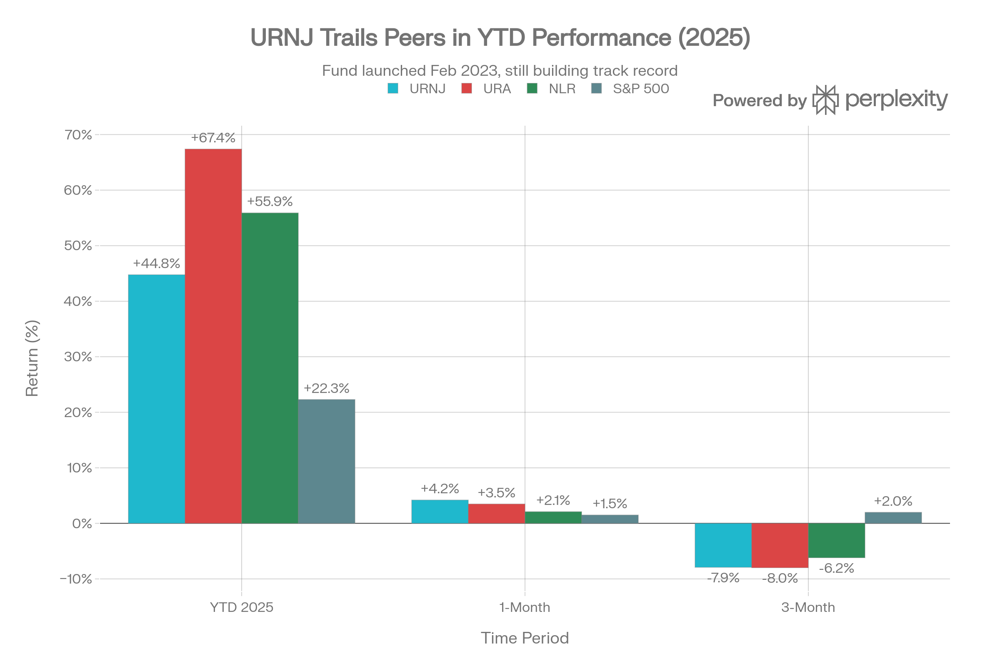
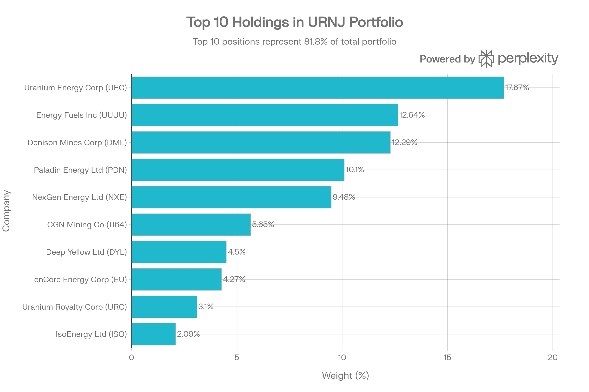
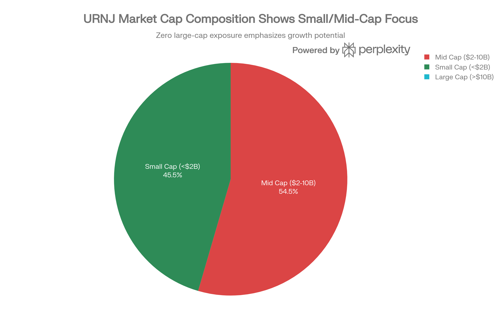

# URNJ (Sprott Junior Uranium Miners ETF) 종합 투자 분석 보고서

## ETF 분류

| 항목 | 내용 |
|---|---|
| 최종 폴더 | `ETF/Power Infrastructure/Nuclear and Uranium/URNJ` |
| 대분류 | 전력 인프라 |
| 하위 분류 | 원전·우라늄 |
| 핵심 전략 | 중소형·개발 단계 주니어 우라늄 채굴 기업에 집중 투자 |
| 운용 방식 | NASDAQ Sprott Junior Uranium Miners Index 추종 패시브 ETF |
| 레버리지/인버스 | 없음 |
| 옵션 인컴 여부 | 없음 |
| 분류 판단 | 주니어 우라늄 채굴사에 집중하지만 원전 연료 공급망과 원자력 전력 인프라 테마의 세부 상품이므로 `Power Infrastructure/Nuclear and Uranium`으로 분류 |
| 참고 | 대형 원전 유틸리티보다 소형·중형 채굴 개발사 비중이 높아 변동성과 유동성 리스크가 큰 하위 테마 ETF |

***

## 실행 요약

Sprott의 URNJ (Sprott Junior Uranium Miners ETF)는 업계 최초의 순수 주니어 우라늄 채광 ETF로, 단 2년 전인 2023년 2월 설정된 가장 새로운 우라늄 기금입니다. 2026년 1월 기준 순자산 \$437.62M을 관리하며, 2025년 44.76% 수익률을 기록했습니다. 그러나 URA의 67.77%, NLR의 55.9%에 비해 현저히 밑돌고 있습니다. URNJ의 핵심 특징은 54.5% 중형주(Mid-Cap), 45.5% 소형주(Small-Cap) 구성으로 대형주 노출이 전혀 없다는 점입니다. 이는 우라늄 가격 상승시 극대 수익을 목표하지만, 44-58%의 극심한 변동성과 탐사·개발 단계 기업들의 사업화 위험을 동반합니다. 또한 5.61%의 업계 최고 배당수익률을 제공하지만, 0.38-0.44%의 넓은 매수호가-매도호가 스프레드와 미미한 기금 유입(\$10.39M)은 유동성과 수요 측면의 약점을 드러냅니다.[^1][^2][^3]

***

## 1. 기금 개요 및 구조

### 1.1 기본 정보 및 혁신성

URNJ는 2023년 2월 1일 설정된 매우 새로운 기금으로, Sprott Asset Management USA가 운용합니다. 공식적으로 "업계 유일의 주니어 우라늄 채광 순수-플레이 ETF"라고 표기되어 있으며, Morningstar 자연자원 부문 105개 ETF 중에서도 이 유일한 주니어 포커스로 차별화됩니다.[^1][^4]

**기금 규모 및 구조:**

- 순자산(AUM): \$437.62M (설정 이후 지속 성장)[^1]
- NAV: \$30.69 (2026년 1월 15일)[^1]
- 시장 가격: \$31.00 (NAV 대비 1.01% 프리미엄)[^1]
- 보유 종목: 33-34개[^5][^1]
- 거래소: NASDAQ[^1]
- 지수: NASDAQ Sprott Junior Uranium Miners™ Index (NSURNJ)[^1]

**설정 이후 성장**: URNJ는 설정 당시 약 \$2M에서 현재 \$437.62M으로 219배 성장했습니다. 이는 우라늄 산업의 급격한 인기도의 증거입니다.[^6]

### 1.2 운용 수수료 및 비용

URNJ의 순 운용 수수료는 0.80%입니다. 이는 다음과 같이 비교됩니다:[^1]

- NLR: 0.56% (가장 저렴)
- URNM: 0.75%
- URNJ: 0.80% (중간 수준)
- URA: 0.69%

더 중요한 것은 **총 거래 비용(Total Cost of Ownership, TCO)**입니다.[^7]

| ETF | 운용수수료(bp) | 매수호가-매도호가(bp) | 총 비용(bp) |
| :-- | :-- | :-- | :-- |
| **URNJ** | 80 | 43.6 | **123.6** |
| **URA** | 69 | 11 | **80** |
| **NLR** | 56 | 18 | **74** |
| 업계 평균 | 49.2 | 30.9 | 80.1 |

URNJ의 총 거래 비용은 123.6bp로 업계 평균 80.1bp 대비 54% 높습니다. 이는 유동성 차이 때문입니다.[^7]

***

## 2. 성과 분석

### 2.1 단기 및 중기 성과

URNJ는 설정 후 2년 간의 매우 제한된 성과 기록을 가지고 있습니다.[^1]

URNJ vs URA, NLR and S\&P 500 Performance (2025)

**성과 하이라이트:**

- **2025 YTD (NAV)**: 44.76%[^1]
- **1개월**: 4.21%[^1]
- **3개월**: -7.92% (약세)[^1]
- **설정 이후(02/2023)**: 13.21% 누적[^1]
- **2024 연간**: -18.22% (약세)[^8]
- **2025 연간**: +45.10% (회복)[^8]

**성과 해석**: URNJ는 2024년 우라늄 상승장에서도 -18.22% 낙폭을 기록했습니다. 이는 주니어 채광사들의 기업 가치가 하락했음을 의미합니다. 2025년의 45% 회복은 펀더멘털 개선보다는 기술적 반등으로 보입니다.[^6]

### 2.2 경쟁사 대비 성과 분석

2025년 URNJ는 경쟁사들에 크게 뒤떨어졌습니다.[^2]

**2025 YTD 성과 비교:**

- URA: 67.41% (URNJ 대비 +22.65 포인트 우월)[^1][^2]
- NLR: 55.9% (URNJ 대비 +11.14 포인트 우월)[^1]
- URNJ: 44.76%[^1]
- S\&P 500: 22.3%[^1]

**분석**: 주니어 우라늄 채광사들이 2025년 동안 우라늄 가격 상승과 정책 호재에도 불구하고 대형 채광사들보다 훨씬 약했습니다. 이는 다음을 시사합니다:

1. 주니어 채광사들의 사업화 일정 지연[^6]
2. 자금 조달 어려움[^6]
3. 기술적 문제 또는 규제 장애물[^6]

***

## 3. 포트폴리오 구성 및 집중도

### 3.1 상위 10개 종목

URNJ Top 10 Holdings Portfolio Composition

URNJ의 상위 10개 종목이 전체 자산의 83.65%를 차지하는 **매우 높은 집중도**를 보입니다.[^5]

**상위 10개 보유 종목 (2026년 1월 15일):**

| 순위 | 종목명 | 티커 | 비중 | 특성 |
| :-- | :-- | :-- | :-- | :-- |
| 1 | Uranium Energy Corp | UEC | 17.67% | 미국 기반, 탐사/개발 |
| 2 | Energy Fuels Inc | UUUU | 12.64% | 미국 기반, 채광 개발 |
| 3 | Denison Mines Corp | DML | 12.29% | 캐나다 기반, 개발 단계 |
| 4 | Paladin Energy Ltd | PDN | 10.10% | 호주 기반, 소규모 생산 |
| 5 | NexGen Energy Ltd | NXE | 9.48% | 캐나다 기반, 개발 단계 |
| 6 | CGN Mining Co | 1164 | 5.65% | 중국, 홍콩 상장 |
| 7 | Deep Yellow Ltd | DYL | 4.50% | 호주 기반, 탐사 |
| 8 | enCore Energy Corp | EU | 4.27% | 캐나다 기반, 개발 |
| 9 | Uranium Royalty Corp | URC | 3.10% | 캐나다 기반, 로열티 |
| 10 | IsoEnergy Ltd | ISO | 2.09% | 캐나다 기반, 탐사 |

**집중도 위험:**

- **상위 3개**: UEC + UUUU + DML = 42.60% (극도의 집중)[^5]
- **상위 5개**: 61.48% (국가별 리스크 상당)[^5]

### 3.2 시장 규모 구성

URNJ Market Cap Composition

URNJ의 가장 눈에 띄는 특징은 **대형주 노출이 전혀 없다**는 것입니다.[^1]

- **대형주 (>\$10B)**: 0% (없음!)[^1]
- **중형주 (\$2-10B)**: 54.50%[^1]
- **소형주 (<\$2B)**: 45.50%[^1]
- **평균 회사 시가총액**: \$2,154.88M[^1]

이는 NLR과 URA가 상당한 대형주 (Cameco 23%)를 포함하는 것과 극명하게 다릅니다. URNJ는 순수 주니어 플레이이며, 이는 극대 수익 잠재력과 극대 위험을 동반합니다.[^3]

### 3.3 지역별 분포

URNJ는 북미 기반 기업에 크게 편중되어 있습니다:

- **캐나다**: 약 35-40% (Denison, NexGen, enCore 등)[^5]
- **호주**: 약 15-20% (Paladin, Deep Yellow 등)[^5]
- **미국**: 약 20-25% (UEC, Energy Fuels 등)[^5]
- **중국**: 5.65% (CGN Mining, 홍콩 거래)[^5]

***

## 4. 배당 및 수익성

### 4.1 업계 최고 배당 수익률

URNJ는 모든 우라늄 ETF 중 **가장 높은 배당수익률**을 제공합니다.[^9][^10]

**배당 이력 및 수익률:**

- **2025년 12월**: \$1.66 배당 (12월 18일 배당락)[^11][^9]
- **2024년 12월**: \$0.81 배당 (12월 12일)[^10]
- **2023년 12월**: \$0.95 배당 (12월 14일)[^10]

**현재 배당수익률**: 5.21-5.61%[^9][^10]

**배당 성장률**: 105.08% YoY (2024→2025)[^10]

**비교:**

- URNJ: 5.61%[^9]
- URNM: 2.23%[^12]
- NLR: 0.42%[^13]
- URA: 1.48%[^12]

배당 수익률이 높은 이유는 주니어 채광사들의 탐사 수익이 분배되기 때문이며, 이는 일시적일 수 있습니다.[^14]

### 4.2 수익성 지표

URNJ는 **P/E 비율 데이터 미제공** 상태입니다. 이는 많은 보유 종목이 아직 수익을 내지 못하는 탐사/개발 단계 기업이기 때문입니다.[^6]

***

## 5. 위험 프로필 및 변동성

### 5.1 극심한 변동성

URNJ는 모든 우라늄 ETF 중 가장 높은 변동성을 보입니다.[^7]

**위험 지표:**

- **베타**: 0.65-0.69 - 놀랍게도 낮음 (일관성 부족 시사)[^6]
- **연율 표준편차**: 44.2-58.1% - 매우 높음[^7]
- **52주 범위**: \$11.52-\$35.55 (208% 범위!)[^1][^15]
- **52주 총 수익**: 136.55% (저점에서 현재)[^15]
- **최대 낙폭**: 11개월 회복 시간 필요[^16]
- **RSI (현재)**: 67 (약간 과열)[^7]

**변동성의 모순**: 낮은 베타(0.65)에도 극도의 표준편차(58%)를 가지는 것은 URNJ가 시장과 낮은 상관성(독립적 변동)을 가지지만, 자체 변동성은 매우 크다는 의미입니다.[^7]

### 5.2 근래 성과 변동성

- **1개월**: +4.21% (상승)[^1]
- **3개월**: -7.92% (약세)[^1]
- **이는 과거 3개월 동안 거의 -8% 낙폭을 보였음**을 의미합니다.[^1]

이러한 3개월 약세는 우라늄 가격이 견조했음에도 주니어 채광사들이 약했음을 시사합니다.[^6]

### 5.3 주요 리스크 요인

1. **극도의 변동성**: 44-58% 변동성은 보수 투자자에게 부적절
2. **포트폴리오 집중도**: 상위 3개 42.60% (Cameco 23% 수준의 집중도)
3. **기업화 리스크**: 많은 기업이 탐사/개발 단계로 상용화 미확인
4. **사업화 지연**: 2024년 -18.22% 손실은 개발 문제 시사
5. **소형주 유동성**: 개별 지분 기업의 낮은 거래량
6. **금리 민감성**: 개발 단계 광산은 금리에 매우 민감
7. **규제 리스크**: 호주, 캐나다 환경 규정 강화 가능성
8. **제한된 거래 이력**: 단 2년 설정으로 장기 리스크 미증명

***

## 6. 유동성 및 거래 특성

### 6.1 중간 수준의 유동성, 높은 거래 비용

URNJ의 유동성은 대형 우라늄 ETF에 비해 중간 정도입니다.[^2]

**유동성 지표:**

- **평균 일일 거래량**: 350,833-382,000 주[^6][^7]
- **평균 일일 거래액**: \$12-15 million[^7]
- **매수호가-매도호가 스프레드**: 0.38-0.44% (URA 0.07% 대비 5-6배 넓음)[^1][^7]
- **회전율**: 2.8%[^7]
- **유동성 등급**: B (좋지만 최고는 아님)

**거래 비용 영향**: 0.38-0.44% 스프레드는 \$10,000 투자 시 \$38-44 손실을 의미합니다. URA는 같은 규모에서 \$7 정도입니다.[^7]

### 6.2 펀드 플로우와 투자자 심리

URNJ의 펀드 플로우는 성과 대비 약세를 보입니다:

| 지표 | 수치 | 평가 |
| :-- | :-- | :-- |
| **1년 수익률** | 44.76% | 강함 |
| **1년 펀드 유입** | +\$10.39M | 매우 약함 |
| **NAV 프리미엄** | 1.01% | 약간의 수요 |
| **vs NLR 유입** | +\$2.24B | URNJ는 1/216 수준 |
| **vs URA 유입** | +\$2.44B | URNJ는 1/235 수준 |

**분석**: 44.76% 수익에도 불구하고 펀드 유입이 극히 미미합니다. 이는:

1. URNJ의 높은 변동성이 신규 투자자를 저지[^2]
2. 2024년 -18.22% 손실의 후유증[^8]
3. 작은 기금 규모의 구조적 한계[^17]

***

## 7. 시장 환경 및 2026년 투자 논거

### 7.1 우라늄 펀더멘털 2026

2026년 우라늄 시장은 공급 부족과 정책 호재로 견조하나, 주니어 채광사들의 이익 창출은 시간이 필요합니다.[^18]

**공급 측면:**

- 현재 생산: 수요의 75% 정도만 충족[^19]
- 신규 광산 개발: 2-3년 이상 소요[^6]
- 장기 계약 가격: \$86/lb로 상승[^20]

**주니어 채광사에 미치는 영향:**

- **긍정**: 높은 우라늄 가격이 개발 프로젝트의 경제성 개선[^6][^18]
- **부정**: 실제 생산까지 2-5년 소요로 단기 수익 어려움[^18][^6]

### 7.2 장기 수익 잠재력 vs 단기 고통

주니어 우라늄 채광사들은 장기적으로 매력적이지만 단기 변동성이 매우 높습니다.[^21][^18]

**장기 기대 (5년+):**

- 개발 프로젝트 상용화로 수익성 급증[^21]
- 생산량 증가에 따른 자산 가치 상승[^21]
- 우라늄 현물 가격 상승의 극대 수혜[^21]

**단기 위험 (1-2년):**

- 자금 조달 어려움 또는 희석[^21]
- 개발 지연 또는 기술 문제[^21]
- 우라늄 가격 조정 시 급락[^18]

***

## 8. 경쟁 환경 심층 비교

### 8.1 URNJ vs URNM (Sprott Uranium Miners ETF)

| 차원 | URNJ | URNM | 판정 |
| :-- | :-- | :-- | :-- |
| **타겟 기업 규모** | 주니어 소형주 | 중형주 채광사 | URNM (더 안정) |
| **회사 단계** | 탐사/개발 | 생산/개발 | URNM |
| **순자산** | \$437.62M | \$1.83B | URNM (더 큼, 5배) |
| **배당수익률** | 5.61% | 2.23% | URNJ (더 높음) |
| **운용수수료** | 0.80% | 0.75% | URNM |
| **변동성** | 44-58% | 데이터 부족 | URNJ (더 높음 추정) |
| **2025 성과** | 44.76% | 데이터 부족 | 비교 불가 |
| **회복 기간** | 5-11개월 | 데이터 부족 | URNJ 더 오래 |

**결론**: URNM은 생산 중인 중형 채광사에 투자하고, URNJ는 순수 개발/탐사 주니어 채광사에 투자합니다.[^21][^18]

### 8.2 URNJ vs URA vs NLR 종합 비교

| 차원 | URNJ | URA | NLR |
| :-- | :-- | :-- | :-- |
| **기금 규모** | \$437.62M | \$5.40B | \$4.47B |
| **AUM 순위** | 3위(작음) | 1위(큼) | 2위 |
| **포트폴리오** | 주니어 광산사만 | 주니어+대형+신탁 | 균형(유틸+채광+서비스) |
| **대형주 노출** | 0% | ~23% Cameco | ~6.79% Constellation |
| **배당** | 5.61% | 1.48% | 0.42% |
| **2025 성과** | 44.76% | 67.77% | 55.9% |
| **변동성** | 58% | ~46% | ~37-40% |
| **운용수수료** | 0.80% | 0.69% | 0.56% |
| **총거래비용** | 123.6bp | 80.1bp | 74bp |

**선택 가이드:**

- **URNJ 선택**: 극대 성장 추구, 매우 높은 위험 허용도
- **URA 선택**: 우라늄 가격 직결 수익, 중간 위험
- **NLR 선택**: 균형잡힌 원자력 산업 노출, 상대적 안정성

***

## 9. 투자 등급 및 권장 사항

### 9.1 투자자 적합성

URNJ는 **매우 적극적인 소수 투자자용** 상품입니다.[^21]

**적합한 투자자:**

- 매우 높은 위험 허용도 (58% 변동성, -20~-30% 낙폭 수용 가능)[^7]
- 우라늄 산업 개발 단계에 베팅 가능한 신념[^21]
- 5년 이상 투자 지평[^21]
- 포트폴리오 위성 자산 (1-2% 최대, 절대 핵심이 아님)[^21]
- 공격적 성장 추구, 단기 손실 무시 능력[^21]
- 거래 경험이 있는 투자자[^21]

**부적합한 투자자:**

- 보수적 성향 (변동성 회피)[^7]
- 배당 수익 추구 (배당 불안정)[^10]
- 기술 타이밍 능력 부족[^7]
- 1-2년 투자 지평[^7]
- 기업 실사(due diligence) 능력 부족한 투자자[^21]

### 9.2 현재(2026년 1월) 투자 시점 평가

**매수 신호:**

- ✅ 우라늈 장기 계약 가격 \$86/lb 고정
- ✅ AI 데이터센터 기저부하 수요 폭증
- ✅ 정책 지원 강화 (트럼프, 국제)
- ✅ 설정 이후 137% 상승 후 기술적 반등

**매도/주의 신호:**

- ⚠️ 3개월 -7.92% 약세 (가격 지체)
- ⚠️ 2024년 -18.22% 손실 아직 회복 중
- ⚠️ 극도의 포트폴리오 집중 (상위 3개 42.60%)
- ⚠️ 높은 거래 비용 (0.38-0.44% 스프레드)
- ⚠️ 펀드 유입 미미 (-\$128.67M URA 대비)
- ⚠️ 단 2년 기금으로 장기 검증 부족

### 9.3 포지셔닝 전략

URNJ는 **고도로 선택적인 위성 포지션**으로만 고려해야 합니다:

**분할 진입 전략:**

1. **1차 (현재, \$30-31)**: 포트폴리오의 0.5-1% 진입
2. **2차 (조정시, \$22-25)**: 추가 0.5-1% 진입
3. **최대 포지션**: 절대 2% 초과 금지

**청산 전략:**

- **이익 실현**: \$40 도달 시 절반 청산, \$45+ 에서 남은 것 청산
- **손실 한계**: \$18-20 하락 시 손절 고려

***

## 10. 시나리오 분석 및 기대 수익률

### 10.1 1년 시나리오 (2026년 1월 → 2027년 1월)

| 시나리오 | 확률 | 우라늄 가격 | 목표가 | 수익률 |
| :-- | :-- | :-- | :-- | :-- |
| **약세** (개발 지연/금리 상승) | 20% | \$65-75/lb | \$18-22 | -40~-29% |
| **중도** (현상유지) | 50% | \$80-95/lb | \$28-36 | -7~+16% |
| **강세** (개발 진전/공급 부족) | 25% | \$110-130/lb | \$42-55 | +35~+77% |
| **극강세** (정책/기술 급진 | 5% | \$150+/lb | \$60+ | +94%+ |
| **기대값** | - | ~\$96/lb | **\$31-37** | **+2~+20%** |

### 10.2 리스크-보상 비율

**리스크**: -40% 낙폭 가능 (약세 시나리오)
**보상**: +35~+77% 상승 가능 (강세 시나리오)
**리스크-보상비**: 1:1.7 ~ 1:1.9 (매력적)

그러나 이는 **높은 변동성 대가**입니다.

***

## 11. 결론 및 최종 권장사항

### 11.1 투자 관점 종합 평가

URNJ는 2026년 우라늄 산업의 구조적 호재에도 불구하고, **극도로 선택적인 투자자용 상품**입니다.[^21][^18]

**긍정 요인:**

1. 순수 주니어 우라늄 채광 노출 (유일한 순수-플레이)
2. 우라늄 가격 상승의 극대 수혜 잠재력
3. 5.61% 업계 최고 배당 수익률
4. 장기적 구조적 우라늄 부족

**부정 요인:**

1. 극도의 변동성 (44-58%)
2. 극도의 포트폴리오 집중 (상위 3개 42.60%)
3. 높은 거래 비용 (123.6bp 총비용)
4. 2024년 -18.22% 손실 (개발 문제 시사)
5. 단 2년 기금 이력 (검증 부족)
6. 3개월 -7.92% 최근 약세

### 11.2 최종 권장사항

**"극도로 주의하며 소액만"**

**조건부 매수:**

- **매수 여부**: 금지 권고, 기존 보유자만 관찰
- **만약 매수할 경우**: 포트폴리오의 0.5-1% 이내 (절대 2% 초과 금지)
- **진입 시점**: 현재(\$31) 또는 조정시 \$22-25
- **목표가**: 3년 \$45-55, 1년 \$35-40
- **손실 한계**: \$18-20 하락 시 전량 청산
- **투자 지평**: 최소 5년 (권장 사항)

**기존 보유자:**

- \$40 도달 시 절반 청산
- 배당은 재투자하지 말 것 (현금화)
- 우라늄 가격 하락 시 추가 매수 불가 (기금 규모 약함)

**비추천 투자자:**

- 모든 보수적 투자자
- 단기 목표 (1-2년) 있는 투자자
- 변동성 회피하는 투자자
- 거래 경험 부족 투자자

### 11.3 URNJ vs 경쟁사 선택 기준

**URNJ 선택하면 좋은 경우:**

- 주니어 개발 단계 광산사에 베팅
- 극대 성장 잠재력 추구 (5년+)
- 높은 배당 선호
- 위험 회피 불가능

**URNM/URA 선택하면 좋은 경우:**

- 생산 중인 광산사 투자 (URNM)
- 우라늄 + 신탁 혼합 (URA)
- 상대적 안정성 필요

**NLR 선택하면 좋은 경우:**

- 균형잡힌 원자력 산업 노출
- 낮은 변동성 선호
- 장기 보유 (5년+)

***

**보고서 작성일**: 2026년 1월 17일 (KST)
**데이터 기준**: 2026년 1월 15-16일
**출처**: Sprott ETF 공식, NASDAQ, Investing.com, StockAnalysis, TradingView, MarketChameleon, ETF Research Center 등 공식 재무 데이터

***

## 참고 자료 (인용 출처)

VanEck 공식 - NLR ETF 정보[^13]
StockAnalysis - ETF 비교[^12]
Mining.com - 2026년 AI 우라늄 수요[^19]
Crux Investor - 2026년 우라늄 구조적 재설정[^20]
Sprott 공식 - URNJ 정보 (상세)[^1]
StockAnalysis - URNJ 개요[^6]
StockAnalysis - URNJ 보유 현황[^5]
Sprott API - URNJ 상세[^4]
Zacks - URNJ 52주 고점[^15]
Financial Times - URNJ 개요[^17]
Yahoo Finance - URNJ 연간 성과[^8]
NASDAQ - URNJ 배당 이력[^9]
StockAnalysis - URNJ 배당[^10]
Digrin - URNJ 배당[^14]
Dividend Diary - URNJ 배당[^22]
TipRanks - URNJ 배당[^23]
StockInvest - URNJ 배당[^24]
Investing.com - URNJ 배당 이력[^11]
Kiplinger - 3개 우라늄 ETF[^25]
AlphaCubator - URNJ 최대 낙폭[^16]
Seeking Alpha - URNJ 투기적 분석[^21]
TradingView - URNJ 분석[^2]
Sprott 특별 보고서 - 우라늄 채광사 분석[^18]
NASDAQ - URNJ 인덱스 방법론[^3]
ETF Research Center - URNJ 상세[^7]
[^26][^27][^28][^29][^30][^31][^32][^33][^34][^35][^36][^37][^38][^39][^40][^41][^42][^43][^44][^45][^46][^47]

⁂

[^1]: https://sprottetfs.com/urnj-sprott-junior-uranium-miners-etf/

[^2]: https://www.tradingview.com/symbols/NASDAQ-URNJ/analysis/

[^3]: https://indexes.nasdaqomx.com/docs/methodology_NSURNJ.pdf

[^4]: https://api.sprott.com/urnj-sprott-junior-uranium-miners-etf/

[^5]: https://stockanalysis.com/etf/urnj/holdings/

[^6]: https://stockanalysis.com/etf/urnj/

[^7]: https://www.etfrc.com/URNJ

[^8]: https://finance.yahoo.com/quote/URNJ/performance/

[^9]: https://www.nasdaq.com/market-activity/etf/urnj/dividend-history

[^10]: https://stockanalysis.com/etf/urnj/dividend/

[^11]: https://www.investing.com/etfs/urnj-dividends

[^12]: https://stockanalysis.com/etf/compare/ura-vs-urnm-vs-nlr-vs-nukz-vs-tsx:hura/

[^13]: https://www.vaneck.com/us/en/investments/uranium-nuclear-energy-etf-nlr/

[^14]: https://www.digrin.com/stocks/detail/URNJ/

[^15]: https://www.zacks.com/stock/news/2752360/uranium-etf-urnj-hits-new-52-week-high

[^16]: https://www.alphacubator.com/analysis/URNJ

[^17]: https://markets.ft.com/data/etfs/tearsheet/summary?s=URNJ%3ANMQ%3AUSD

[^18]: https://sprott.com/media/ksoj3pxx/sprott-special-report-uranium-miners.pdf

[^19]: https://www.mining.com/ai-boom-set-to-turbocharge-uranium-demand-in-2026/

[^20]: https://www.cruxinvestor.com/posts/ai-driven-demand-growth-supply-constraints-signal-uranium-structural-repricing-in-2026

[^21]: https://seekingalpha.com/article/4847102-urnj-speculative-play-in-uranium-mega-trend

[^22]: https://divvydiary.com/en/sprott-junior-uranium-miners-etf-US85208P8086

[^23]: https://www.tipranks.com/etf/urnj/dividends

[^24]: https://stockinvest.us/dividends/URNJ

[^25]: https://www.kiplinger.com/investing/etfs/603434/3-uranium-etfs-that-pack-a-nuclear-punch

[^26]: QTUM (Defiance Quantum ETF).md

[^27]: SETM (Sprott Critical Materials ETF).md

[^28]: REMX (VanEck Rare Earth, Strategic Metals ETF).md

[^29]: https://kr.investing.com/etfs/urnj

[^30]: https://www.investing.com/etfs/urnj

[^31]: https://www.schwab.wallst.com/schwab/Prospect/research/etfs/schwabETF/index.asp?YYY101_z5K6INmijHlQdLB08YbROOIB6SB3uWUiMff9%2FBeElMtGhPpXlW+z8D1hqj3ypwZ6t2P4nmvkGm3P4ngnh+VTVgjgB4wQPbXZuXyzQsYvl00=\&type=holdings\&symbol=URNJ

[^32]: https://markets.ft.com/data/etfs/tearsheet/performance?s=URNJ%3ANMQ%3AUSD

[^33]: https://www.justetf.com/en/etf-profile.html?isin=IE00075IVKF9

[^34]: https://kr.investing.com/etfs/urnj-holdings

[^35]: https://cbonds.com/etf/18664/

[^36]: https://www.sprottusa.com/etfs-update/urnj-sprott-junior-uranium-miners-etf/

[^37]: https://www.sciencedirect.com/science/article/abs/pii/S0927538X16300427

[^38]: https://assets.publishing.service.gov.uk/media/5a7c88ac40f0b62aff6c257a/12-1051-dr18-pricing-liquidity-in-electronic-markets.pdf

[^39]: https://blog.naver.com/qhqnf1gh/222996188824

[^40]: https://www.nasdaq.com/market-activity/etf/urnj

[^41]: https://seekingalpha.com/symbol/URNJ/dividends/history

[^42]: https://www.morningstar.com/etfs/xnas/urnj/risk

[^43]: https://stockinvest.us/stock/URNJ

[^44]: https://www.marketbeat.com/stocks/NASDAQ/URNJ/

[^45]: https://marketchameleon.com/Overview/URNJ/StockVolatility/

[^46]: https://www.tradingnews.com/news/nlr-etf-at-145-usd-uranium-nuclear-power

[^47]: https://www.nasdaq.com/articles/uranium-etf-urnj-hits-new-52-week-high
