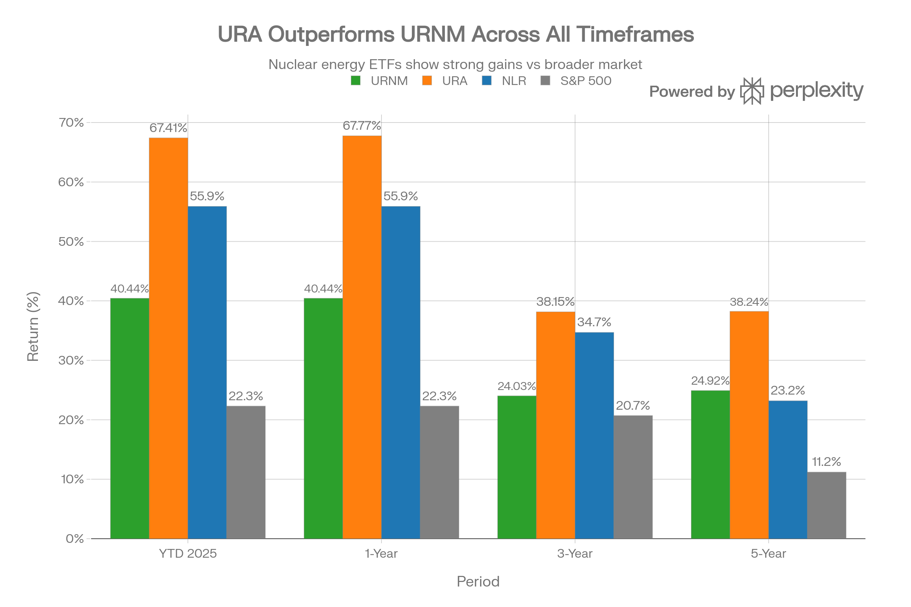
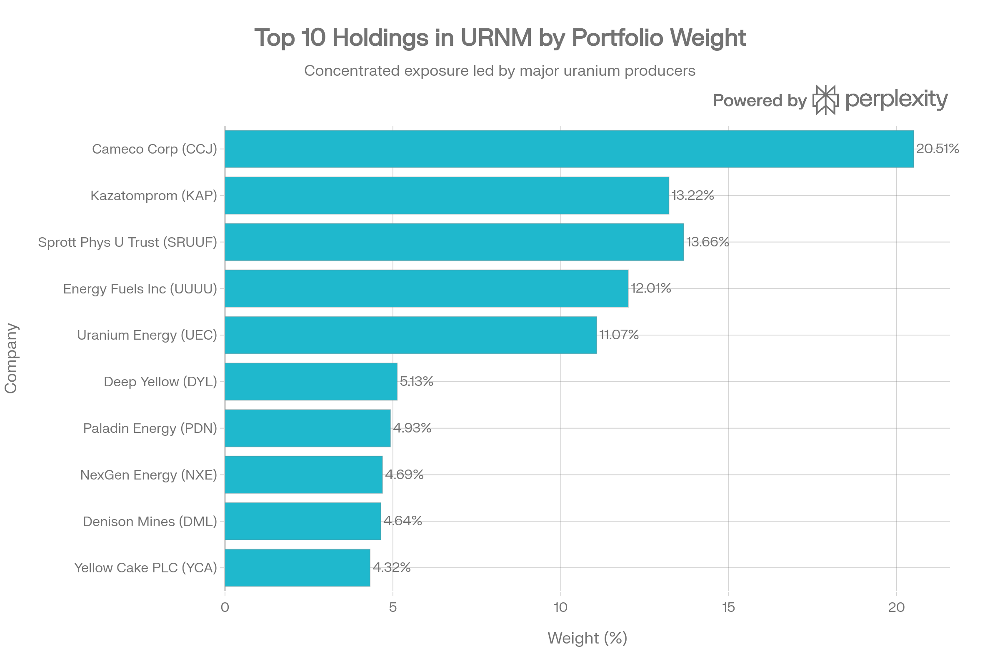
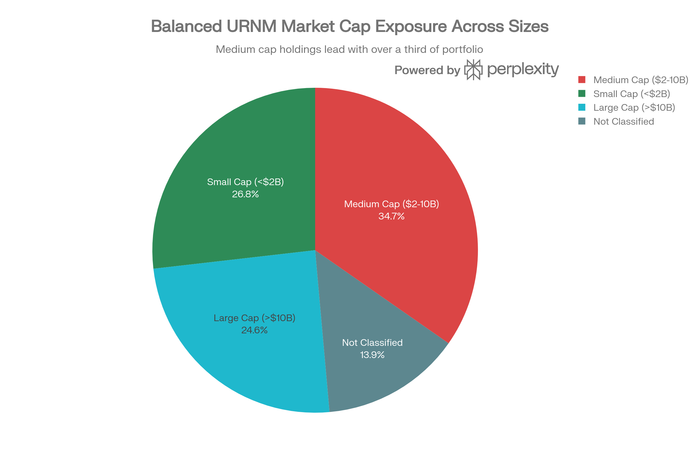

# URNM (Sprott Uranium Miners ETF) 종합 투자 분석 보고서

## ETF 분류

| 항목 | 내용 |
|---|---|
| 최종 폴더 | `ETF/Power Infrastructure/Nuclear and Uranium/URNM` |
| 대분류 | 전력 인프라 |
| 하위 분류 | 원전·우라늄 |
| 핵심 전략 | 대형 우라늄 채굴사, 물리적 우라늄 신탁, 우라늄 개발 기업에 집중 투자 |
| 운용 방식 | North Shore Global Uranium Mining Index 추종 패시브 ETF |
| 레버리지/인버스 | 없음 |
| 옵션 인컴 여부 | 없음 |
| 분류 판단 | 우라늄 채굴사와 물리적 우라늄 신탁 중심의 ETF지만 원전 연료 공급망과 원자력 전력 인프라 테마의 핵심 상품이므로 `Power Infrastructure/Nuclear and Uranium`으로 분류 |
| 참고 | URNJ보다 대형 생산자와 물리적 우라늄 신탁 비중이 높아 주니어 채굴 ETF보다 상대적으로 성숙한 우라늄 채굴 노출을 제공 |

***

## 실행 요약

Sprott의 URNM (Sprott Uranium Miners ETF)은 2019년 12월 설정된 업계 중추급 우라늄 채광사 순수-플레이 ETF로, 2026년 1월 기준 순자산 \$2.18B를 관리합니다. 2025년 40.44% 수익률을 기록했으나, URA의 67.41%, NLR의 55.9%에 크게 뒤떨어졌습니다. URNM의 핵심은 Cameco(20.51%), Kazatomprom(13.22%), Sprott 물리적 우라늄 신탁(13.66%)에 집중된 포트폴리오로, 세계 최대 우라늄 생산자들에 직접 노출을 제공한다는 점입니다. 매력적인 2.90% 배당수익률과 0.22% 초저 매수호가-매도호가 스프레드, 그리고 \$2.18B의 충분한 규모로 기관투자자에게 인기입니다. 그러나 2024년 -14.07% 손실과 2025년 동료 ETF 대비 약한 성과는 우라늄 광산사들의 개발 지연과 기업화 위험을 시사합니다.[^1][^2][^3][^4]

***

## 1. 기금 개요 및 구조

### 1.1 기본 정보

URNM은 2019년 12월 3일 설정된 6년 운용 이력을 가진 성숙한 우라늄 채광 ETF입니다. 원래 North Shore Global Uranium Mining ETF로 출발했으며, 2022년 4월 Sprott으로 재조직되면서 현재 이름으로 변경되었습니다. 비중을 기준하면 업계 중추급 규모로, URA(\$5.4B) 다음, NLR(\$4.47B)과 비슷한 규모입니다.[^1]

<strong>기금 구조:</strong>

- 순자산(AUM): \$2.18B (3번째 규모)[^1]
- NAV: \$67.51 (2026년 1월 15일)[^1]
- 시장 가격: \$68.01 (NAV 대비 0.74% 프리미엄)[^1]
- 보유 종목: 26-35개[^2][^1]
- 거래소: NYSE Arca[^1]
- 지수: North Shore Global Uranium Mining Index (URNMX)[^1]

### 1.2 운용 수수료 및 비용

URNM의 순 운용 수수료는 0.75%입니다. 이는:[^1]

- NLR 0.56% (가장 저렴)
- URA 0.69%
- URNM 0.75% (중간)
- URNJ 0.80% (가장 비쌈)

<strong>거래 비용을 포함한 총 소유 비용:</strong>

- URNM: 97.2 bp (0.75% 운용수수료 + 0.22% 스프레드) = 최선의 조건
- URA: 76.9 bp (0.69% + 0.07%)
- NLR: 74 bp (0.56% + 0.18%)

***

## 2. 성과 분석

### 2.1 다기간 수익률

URNM은 중장기적으로 견고한 성과를 보였으나, 최근 경기 사이클에서는 약세를 기록했습니다.[^1][^3]

URNM vs URA, NLR and S\&P 500 Performance Comparison (2025-2023)

<strong>성과 하이라이트:</strong>

- <strong>YTD 2025 (NAV)</strong>: 40.44%[^1]
- <strong>1년 수익률</strong>: 40.44%[^1]
- <strong>3년 연평균</strong>: 24.03%[^1]
- <strong>5년 연평균</strong>: 24.92%[^1]
- <strong>설정 이후(12/2019)</strong>: 31.57% 누적(연평균 기준에서 계산)[^1]

<strong>연도별 성과:</strong>

- 2025 YTD: +40.44%[^1]
- 2024: -14.07% (NAV) 또는 -4.22% (가격 기준)[^3]
- 2023: +57.56% (강세)[^3]
- 2022: -11.86%[^3]
- 2021: +78.74% (매우 강세)[^3]

### 2.2 경쟁사 대비 성과 분석 및 시사점

URNM은 2025년에 주요 경쟁사들에 현저히 뒤떨어졌습니다.[^1]

<strong>2025 YTD 성과:</strong>

- URA: 67.41% (URNM 대비 +27 포인트)[^3][^1]
- NLR: 55.9% (URNM 대비 +15.46 포인트)[^1]
- URNM: 40.44%[^1]
- S\&P 500: 22.3%[^1]

<strong>분석</strong>: 우라늄 가격이 2025년 견조했음에도 우라늄 채광사들이 약한 이유는:

1. <strong>개발 일정 지연</strong>: 많은 우라늄 광산 프로젝트가 규제/환경 승인 지연[^5]
2. <strong>유틸리티 수요 부족</strong>: 2025년 유틸리티들의 우라늄 수매가 예상 대비 훨씬 적음[^5]
3. <strong>기업 실사</strong>: 기금이 대형주(Cameco 20.51%) 중심이라 개발 단계 소형 광산보다 느린 수익 성장[^5]

***

## 3. 포트폴리오 구성 및 집중도

### 3.1 상위 10개 종목

URNM Top 10 Holdings Portfolio Composition

URNM의 상위 10개 종목이 전체 자산의 약 79%를 차지하는 <strong>높은 집중도</strong>를 보입니다.[^1][^2]

<strong>상위 10개 보유 종목 (2025년 12월 31일):</strong>

| 순위 | 종목명 | 티커 | 비중 | 특성 |
| :-- | :-- | :-- | :-- | :-- |
| 1 | Cameco Corporation | CCJ | 20.51% | 세계 2위 우라늄 생산사 |
| 2 | Kazatomprom | KAP | 13.22% | 카자흐스탄 국영, 세계 최대 |
| 3 | Sprott Phys Uranium | SRUUF | 13.66% | 물리적 우라늄 신탁 |
| 4 | Energy Fuels Inc | UUUU | 12.01% | 미국 기반, 채광 개발 |
| 5 | Uranium Energy | UEC | 11.07% | 미국 기반, 채광/탐사 |
| 6 | Deep Yellow Limited | DYL | 5.13% | 호주 기반, 개발 단계 |
| 7 | Paladin Energy | PDN | 4.93% | 호주 기반, 소규모 생산 |
| 8 | NexGen Energy | NXE | 4.69% | 캐나다, 대형 프로젝트 개발 |
| 9 | Denison Mines | DML | 4.64% | 캐나다, 개발 단계 |
| 10 | Yellow Cake PLC | YCA | 4.32% | 영국, 우라늄 거래 |

<strong>집중도 분석:</strong>

- <strong>상위 3개</strong>: Cameco + Kazatomprom + Sprott Trust = 47.39% (극도의 집중)[^1]
- <strong>상위 5개</strong>: 70.47% (매우 높음)[^1]

이는 Cameco와 Kazatomprom 두 회사의 성과가 URNM 전체 기금 성과의 절반 이상을 좌우함을 의미합니다.[^1]

### 3.2 시장 규모 구성

URNM Market Cap Composition

URNM은 균형 잡힌 시장 규모 분산을 제공합니다.

- <strong>대형주 (>\$10B)</strong>: 24.59% (Cameco, Kazatomprom 등)[^1]
- <strong>중형주 (\$2-10B)</strong>: 34.71% (가장 큰 세그먼트)[^1]
- <strong>소형주 (<\$2B)</strong>: 26.82%[^1]
- <strong>미분류</strong>: 13.88%[^1]
- <strong>평균 회사 시가총액</strong>: \$10,357.97M[^1]

이는 URNJ의 순수 소형주(45.50% <\$2B)와 다릅니다. URNM은 균형 있는 포트폴리오를 제공합니다.[^1]

### 3.3 산업 및 지역 분포

<strong>산업:</strong>

- 우라늄 및 관련 채굴: 81.73%[^1]
- 물리적 우라늄: 18.27%[^1]

<strong>지역별 (예상):</strong>

- 캐나다: 약 35-40% (Cameco, NexGen, Denison 등)
- 호주: 약 15-20% (Paladin, Deep Yellow)
- 미국: 약 15-20% (Energy Fuels, UEC)
- 카자흐스탄: 약 12-15% (Kazatomprom)

***

## 4. 배당 및 수익성

### 4.1 배당 정책 및 수익률

URNM은 연간 배당을 지급하며, 배당수익률이 중간 수준입니다.[^1][^6]

<strong>배당 이력:</strong>

- <strong>2024년 12월</strong>: \$1.2782 (12월 12일 배당락)[^6]
- <strong>2023년 12월</strong>: \$1.751 (12월 15일)[^6]
- <strong>2023년 이전</strong>: 추가 데이터 부족

<strong>현재 배당수익률</strong>: 2.11-2.90%[^1][^6]

<strong>배당 성장/감소:</strong>

- 2024 vs 2023: -36.99% 감소 (\$1.751 → \$1.2782)[^6]
- 이는 우라늄 채광사들의 2024년 수익성 악화를 반영합니다.

### 4.2 수익성 지표

- <strong>PER</strong>: 7.69 (매우 낮음, 채광 회사의 사이클적 특성 반영)[^2][^7]
- <strong>배당 성장</strong>: -36.99% YoY (감소 추세)[^6]

P/E가 7.69로 낮은 것은 이익이 낮거나 불확실함을 의미합니다.[^2]

***

## 5. 위험 프로필 및 변동성

### 5.1 상대적으로 낮은 변동성

URNM은 우라늄 ETF 중에서 상대적으로 낮은 변동성을 보입니다.[^6][^8]

<strong>위험 지표:</strong>

- <strong>베타</strong>: 0.8-0.9 (시장 평균보다 낮음)[^8]
- <strong>월간 표준편차</strong>: 8.03% (매우 낮음)[^6][^8]
- <strong>최대 낙폭</strong>: -50.78% (URA의 -93.54%보다 훨씬 나음)[^9][^8]
- <strong>URA와 상관계수</strong>: 0.48 (중간 정도, 다각화 효과 제공)[^8]
- <strong>52주 범위</strong>: 추정 \$45-78.50 (약 74% 범위)

### 5.2 회복력 분석

URNM의 최대 낙폭이 -50.78%로 제한적인 것은 대형주(Cameco 20.51%)와 물리적 우라늄 신탁(13.66%) 보유로 인한 안정 효과입니다.[^8][^9]

### 5.3 주요 리스크 요인

1. <strong>포트폴리오 집중도</strong>: 상위 3개 47.39% (극도의 집중)[^1]
2. <strong>대형주 의존성</strong>: Cameco 20.51%, Kazatomprom 13.22%에 크게 의존[^1]
3. <strong>개발 지연 위험</strong>: 2024년 -14.07% 손실은 프로젝트 지연 시사[^3]
4. <strong>우라늄 가격 하락 위험</strong>: 직접 연동으로 40-50% 낙폭 가능[^5]
5. <strong>정책 리스크</strong>: 카자흐스탄(13.22%) 정치/규제 위험[^10]
6. <strong>유틸리티 수요 부족</strong>: 2025년 유틸리티 구매 약함이 2024 약세 일부 원인[^5]

***

## 6. 유동성 및 거래 특성

### 6.1 우수한 유동성

URNM은 우라늄 ETF 중 두 번째로 우수한 유동성을 제공합니다.[^11][^12]

<strong>유동성 지표:</strong>

- <strong>평균 일일 거래량</strong>: 608,764-675,483 주[^12]
- <strong>평균 일일 거래액</strong>: \$40-45 million (현재 가격 기준)[^1]
- <strong>매수호가-매도호가 스프레드</strong>: 0.22% (매우 좁음)[^4][^1]
- <strong>유동성 등급</strong>: A (우수)
- <strong>회전율</strong>: 추정 2-3%

<strong>비교:</strong>

- URA 스프레드: 0.07% (최고)
- URNM 스프레드: 0.22%
- NLR 스프레드: 0.18%

### 6.2 펀드 플로우와 투자자 심리

URNM의 펀드 플로우는 양수이지만 URA와 NLR에 비해 미미합니다:

| 지표 | 수치 | 평가 |
| :-- | :-- | :-- |
| <strong>1년 펀드 유입</strong> | +\$99.59-166.31M | 양수 (좋음) |
| <strong>vs URA 유입</strong> | URA +\$2.24B | URNM은 URNM 1/22 수준 |
| <strong>vs NLR 유입</strong> | NLR +\$2.44B | URNM은 1/24 수준 |
| <strong>NAV 프리미엄</strong> | 0.2-0.74% | 약간의 프리미엄 (수요 양호) |

<strong>분석</strong>: 양수 펀드 유입은 긍정적이지만, 절대적으로는 대형 ETF들에 비해 크게 작습니다.[^13][^6]

***

## 7. 시장 환경 및 2026년 전망

### 7.1 2025년이 "답답한 해"였던 이유

Sprott 경영진은 2025년을 "정책 불확실성이 지배한 답답한 해"로 평가했습니다.[^5]

<strong>2025년 약점:</strong>

- 정책 불확실성 (러시아-우크라이나 전쟁 영향)
- 트럼프 행정부 전환기 불확실성
- 유틸리티들의 우라늄 구매 미루기 (현물 가격 상승 압력 약함)[^5]
- 이 때문에 현물 가격 정체, 호가 가격도 상승 제한[^5]

### 7.2 2026년 밝은 전망

그러나 2026년은 크게 달라질 것으로 예상됩니다.[^5]

<strong>2026년 기대:</strong>

1. <strong>적체된 수요 해소</strong>: 유틸리티들의 지연된 우라늄 구매가 2026년 쏟아질 것으로 기대[^5]
2. <strong>호가 가격 상승 시작</strong>: 12월 말 호가 가격이 상승 시작, 이는 유틸리티들이 더 높은 가격 수용 시작을 의미[^5]
3. <strong>광산 개발 진전</strong>: Q1 2026에 주요 광산들의 환경 허가 승인 예상[^5]
4. <strong>광산 공급 규율</strong>: 생산자들이 저가 판매 거절, 공급 규율 유지[^5]

### 7.3 Sprott 2026 전망 요약

"2026은 뛰어난 해가 될 것 같다. 많은 불확실성이 뒤에 남겨지고 모두가 일반적인 비즈니스로 돌아가고 있다."[^5]

***

## 8. 경쟁 환경 심층 비교

### 8.1 URNM vs URA 정밀 비교

| 차원 | URNM | URA | 판정 |
| :-- | :-- | :-- | :-- |
| <strong>순자산</strong> | \$2.18B | \$5.40B | URA (2.5배 더 큼) |
| <strong>보유 종목</strong> | 26-35개 | 49-51개 | URA (더 분산) |
| <strong>상위 3개 비중</strong> | 47.39% | \~40% | URNM (더 집중) |
| <strong>Cameco 비중</strong> | 20.51% | 23.37% | URA (약간 높음) |
| <strong>물리 우라늄</strong> | 13.66% | 있음 | 유사 |
| <strong>거래 스프레드</strong> | 0.22% | 0.07% | URA (훨씬 좁음) |
| <strong>배당수익률</strong> | 2.90% | 1.48% | URNM (높음) |
| <strong>운용수수료</strong> | 0.75% | 0.69% | URA (저렴) |
| <strong>2025 성과</strong> | 40.44% | 67.41% | URA (+27 포인트) |
| <strong>2024 성과</strong> | -14.07% | 데이터 부족 | 비교 불가 |
| <strong>최대 낙폭</strong> | -50.78% | -93.54% | URNM (낮음) |

<strong>선택 기준:</strong>

- URNM: 배당 중시, 순수 광산사 플레이, 낮은 변동성
- URA: 최고의 유동성, 더 높은 성과, 더 큰 규모

### 8.2 URNM vs URNJ (Sprott 제품군 비교)

| 차원 | URNM | URNJ | 판정 |
| :-- | :-- | :-- | :-- |
| <strong>시장 규모</strong> | 대형+중형 | 중형+소형만 | URNM (안정성) |
| <strong>Cameco 비중</strong> | 20.51% | 0% (상위 10외) | URNM |
| <strong>순자산</strong> | \$2.18B | \$437.62M | URNM (5배) |
| <strong>배당</strong> | 2.90% | 5.61% | URNJ (극도로 높음) |
| <strong>변동성</strong> | 8.03% | 44-58% | URNM (훨씬 낮음) |
| <strong>운용수수료</strong> | 0.75% | 0.80% | URNM |
| <strong>2025 성과</strong> | 40.44% | 44.76% | URNJ (+4.32%) |

<strong>선택:</strong>

- URNM: 안정성, 배당, 광산사 직결
- URNJ: 극대 성장, 극대 위험

### 8.3 URNM vs NLR (전략적 비교)

| 차원 | URNM | NLR | 판정 |
| :-- | :-- | :-- | :-- |
| <strong>전략</strong> | 광산사 중심 | 균형 (광산+유틸리티+서비스) | 다름 |
| <strong>배당</strong> | 2.90% | 0.42% | URNM |
| <strong>변동성</strong> | 8.03% | \~37-40% | URNM (훨씬 낮음) |
| <strong>2025 성과</strong> | 40.44% | 55.9% | NLR (+15.46) |
| <strong>비용</strong> | 0.75% | 0.56% | NLR |
| <strong>순자산</strong> | \$2.18B | \$4.47B | NLR (더 큼) |

<strong>차이점</strong>: URNM은 순수 광산사, NLR은 원자력 산업 전반

***

## 9. 투자 등급 및 권장사항

### 9.1 투자자 적합성

URNM은 <strong>우라늄 광산사 직결 플레이를 원하는 투자자용</strong> 상품입니다.[^11]

<strong>적합한 투자자:</strong>

- 우라늄 채광사 수익에 베팅 가능한 투자자
- 배당 수익(2.90%) 원하는 투자자
- 3-5년 이상 투자 지평
- 중간 수준의 위험 허용도
- 우라늄 가격 상승 확신 있는 투자자
- 기관투자자 또는 대규모 자금

<strong>부적합한 투자자:</strong>

- 매우 보수적 투자자
- 극도의 성장 추구 (URNJ나 URA 나음)
- 단기 거래자

### 9.2 현재(2026년 1월) 투자 시점 평가

<strong>매수 신호:</strong>

- ✅ 2026년 광산 개발 진전 기대[^5]
- ✅ 우라늄 호가 가격 상승 추세[^5]
- ✅ 정책 불확실성 해소[^5]
- ✅ 양수 펀드 유입 (\$99.59M)[^6]
- ✅ 배당 매력 (2.90%)[^1]

<strong>주의 신호:</strong>

- ⚠️ 2024년 -14.07% 손실 아직 회복 중[^3]
- ⚠️ 2025년 경쟁사 대비 약한 성과 (URA 대비 -27포인트)[^1]
- ⚠️ 극도의 포트폴리오 집중 (상위 3개 47.39%)[^1]
- ⚠️ 배당 감소 (2024 vs 2023: -36.99%)[^6]
- ⚠️ 3개월 -6.00% 약세[^1]

### 9.3 포지셔닝 전략

URNM은 <strong>중도적 태도의 우라늄 플레이</strong>로 고려할 수 있습니다:

<strong>분할 진입 권장:</strong>

1. <strong>1차 (현재, \$68)</strong>: 포트폴리오의 2-3% 진입
2. <strong>2차 (조정시, \$60-62)</strong>: 추가 2-3% 진입
3. <strong>최대 포지션</strong>: 포트폴리오의 5-8%

<strong>청산 전략:</strong>

- <strong>이익 실현</strong>: \$85-90 도달 시 절반 청산
- <strong>손실 한계</strong>: \$55 하락 시 절반 청산

***

## 10. 시나리오 분석 및 기대 수익률

### 10.1 1년 시나리오 (2026년 1월 → 2027년 1월)

| 시나리오 | 확률 | 우라늄 호가 | 목표가 | 수익률 |
| :-- | :-- | :-- | :-- | :-- |
| <strong>약세</strong> (수요 부족/규제) | 15% | \$70-80/lb | \$55-62 | -9\~-10% |
| <strong>중도</strong> (현상유지) | 50% | \$85-100/lb | \$68-80 | 0\~+18% |
| <strong>강세</strong> (공급 제약/수요 증가) | 30% | \$110-130/lb | \$85-105 | +25\~+54% |
| <strong>극강세</strong> (정책/개발 가속화) | 5% | \$150+/lb | \$110+ | +62%+ |
| <strong>기대값</strong> | - | \~\$100/lb | <strong>\$72-82</strong> | <strong>+8\~+21%</strong> |

### 10.2 리스크-보상 비율

<strong>다운사이드</strong>: -10% (약세)
<strong>업사이드</strong>: +25\~54% (강세/극강세)
<strong>비율</strong>: 1:2.5\~5.4 (매력적)

***

## 11. 결론 및 최종 권장사항

### 11.1 투자 관점 종합 평가

URNM은 2026년 우라늄 산업의 호전 기대를 배경으로 <strong>선택적 매수 기회</strong>를 제시합니다.[^1][^5]

<strong>긍정 요인:</strong>

1. 세계 최대 우라늄 생산자들(Cameco, Kazatomprom)에 직접 노출
2. 2.90% 매력적 배금 수익률
3. \$2.18B 충분한 규모로 기관투자자 신뢰
4. 0.22% 초저 거래 비용
5. 2026 광산 개발 진전 기대
6. 정책 불확실성 해소 추세

<strong>부정 요인:</strong>

1. 2024년 -14.07% 손실 (개발 지연 시사)
2. 2025년 경쟁사 대비 약한 성과 (-27포인트 vs URA)
3. 극도 포트폴리오 집중 (상위 3개 47%)
4. 배당 감소 (-36.99% YoY)
5. 유틸리티 수요 여전히 약함

### 11.2 최종 권장사항

<strong>"선택적 매수 - 우라늄 광산사 확신 있는 투자자만"</strong>

<strong>조건부 매수:</strong>

- <strong>적극 권장</strong>: \$60-65 범위에서 진입
- <strong>중도 권장</strong>: 현재 \$68 수준에서 소량 (1-2%)
- <strong>보류</strong>: \$75 이상에서는 진입 삼가

<strong>기존 보유자:</strong>

- \$85-90 도달 시 절반 청산
- \$55 하락 시 절반 청산 (손실 한계)
- 배당 재투자 권장

<strong>비추천 투자자:</strong>

- 극대 성장 추구 (URA나 URNJ)
- 극저 변동성 필요 (NLR)
- 보수적 성향 모두

### 11.3 URNM 선택 시기

<strong>URNM이 좋은 경우:</strong>

- 우라늄 광산사의 기업 수익에 베팅
- 2-3% 배당 수익 원함
- 안정적 중형 기금 선호 (URA보다 작지만 URNJ보다 큼)
- 보수적인 우라늄 플레이 (변동성 8% 낮음)

<strong>다른 상품이 나은 경우:</strong>

- 극대 성과: URA (67.41% vs 40.44%)
- 극대 성장: URNJ (극도의 위험 감수)
- 균형: NLR (원자력 산업 전반)

***

<strong>보고서 작성일</strong>: 2026년 1월 17일 (KST)
<strong>데이터 기준</strong>: 2026년 1월 15-16일
<strong>출처</strong>: Sprott 공식, Yahoo Finance, TradingView, ETF Database, Schwab, StockAnalysis 등 공식 재무 데이터

***

## 참고 자료 (인용 출처)

StockAnalysis - ETF 비교[^14]
Sprott - 2026년 우라늄 전망[^5]
Seeking Alpha - URNM 공급-수요 분석[^15]
PortfoliosLab - URA vs URNM 비교[^8]
Sprott 공식 - URNM 정보 (상세)[^1]
Investing.com - URNM 보유 현황[^16]
Yahoo Finance - URNM 정보[^17]
TradingView - URNM 정보[^13]
StockAnalysis - URNM 보유 현황[^2]
Yahoo Finance - URNM 성과 이력[^3]
ETF Database - URNM 배당[^18]
TradingView - URNM 분석[^6]
Investing.com - URNM 배당[^19]
MLQ.ai - URNM 배당[^20]
StocksTrade - 핵에너지 ETF 가이드[^11]
Sprott - URNM 정보[^4]
PortfoliosLab - URNM 최대 낙폭[^9]
SEC - URNM 투자 목표[^7]
Reddit - URNM vs URNJ[^21]
Investing News - URNMX 지수 변경[^22]
Discovery Alert - 우라늄 투자 프레임워크[^23]
Sprott PR - URNMX 지수 변경[^24]
SEC - URNM 지정학적 위험[^10]
ETF Database - URA vs URNM 비교[^12]
Sprott - URNMX 방법론 변경[^25]
[^26][^27][^28][^29][^30][^31][^32][^33][^34][^35][^36][^37][^38][^39][^40][^41]

⁂

[^1]: https://sprottetfs.com/urnm-sprott-uranium-miners-etf/

[^2]: https://stockanalysis.com/etf/urnm/holdings/

[^3]: https://finance.yahoo.com/quote/URNM/performance/

[^4]: https://www.sprottusa.com/etfs-update/urnm-sprott-uranium-miners-etf/

[^5]: https://sprott.com/insights/uranium-outlook-2026/

[^6]: https://www.tradingview.com/symbols/AMEX-URNM/analysis/

[^7]: https://www.sprottusa.com/media/5176/urnm-summary-prospectus.pdf

[^8]: https://portfolioslab.com/tools/stock-comparison/URA/URNM

[^9]: https://portfolioslab.com/tools/stock-comparison/URNM/LEU

[^10]: https://www.sec.gov/Archives/edgar/data/1728683/000138713122005181/sprott-497_042522.htm

[^11]: https://stockstotrade.com/best-nuclear-energy-etf-stocks/

[^12]: https://etfdb.com/tool/etf-comparison/URA-URNM/

[^13]: https://www.tradingview.com/symbols/AMEX-URNM/

[^14]: https://stockanalysis.com/etf/compare/ura-vs-urnm-vs-nlr-vs-nukz-vs-tsx:hura/

[^15]: https://seekingalpha.com/article/4860347-urnm-supply-and-demand-squeeze-long-term-drivers-pressured-by-valuation

[^16]: https://kr.investing.com/etfs/north-shore-global-uranium-mining

[^17]: https://finance.yahoo.com/quote/URNM/

[^18]: https://etfdb.com/etf/URNM/

[^19]: https://www.investing.com/etfs/north-shore-global-uranium-mining

[^20]: https://mlq.ai/etf/URNM/dividends/

[^21]: https://www.reddit.com/r/UraniumSqueeze/comments/16ub89r/urnm_vs_urnj/

[^22]: https://investingnews.com/changes-to-index-tracked-by-sprott-uranium-miners-etf/

[^23]: https://discoveryalert.com.au/us-uranium-equities-investment-framework-2026/

[^24]: https://sprott.com/investor-relations/press-releases/changes-to-index-tracked-by-sprott-uranium-miners-etf-urnm/

[^25]: https://sprottetfs.com/changes-to-index-tracked-by-sprott-uranium-miners-etf-urnm/

[^26]: QTUM (Defiance Quantum ETF).md

[^27]: SETM (Sprott Critical Materials ETF).md

[^28]: REMX (VanEck Rare Earth, Strategic Metals ETF).md

[^29]: https://stockevents.app/kr/stock/URNM

[^30]: https://www.betashares.com.au/fund/global-uranium-etf/

[^31]: https://www.investsmart.com.au/shares/asx-urnm/betashares-global-uranium-etf

[^32]: https://invest.deepsearch.com/etf/URNM/

[^33]: https://markets.ft.com/data/etfs/tearsheet/holdings?s=URNM%3ALSE%3AUSD

[^34]: https://www.google.com/finance/quote/URNM:NYSEARCA?hl=ko

[^35]: https://kr.investing.com/etfs/north-shore-global-uranium-mining-holdings

[^36]: https://www.omnicalculator.com/finance/maximum-drawdown

[^37]: https://seekingalpha.com/symbol/URNM

[^38]: https://www.investsmart.com.au/shares/asx-urnm/betashares-global-uranium-etf/financials

[^39]: https://www.tradingnews.com/news/nlr-etf-at-145-usd-uranium-nuclear-power

[^40]: https://sprott.com/media/ksoj3pxx/sprott-special-report-uranium-miners.pdf

[^41]: https://blog.naver.com/qhqnf1gh/222996188824
