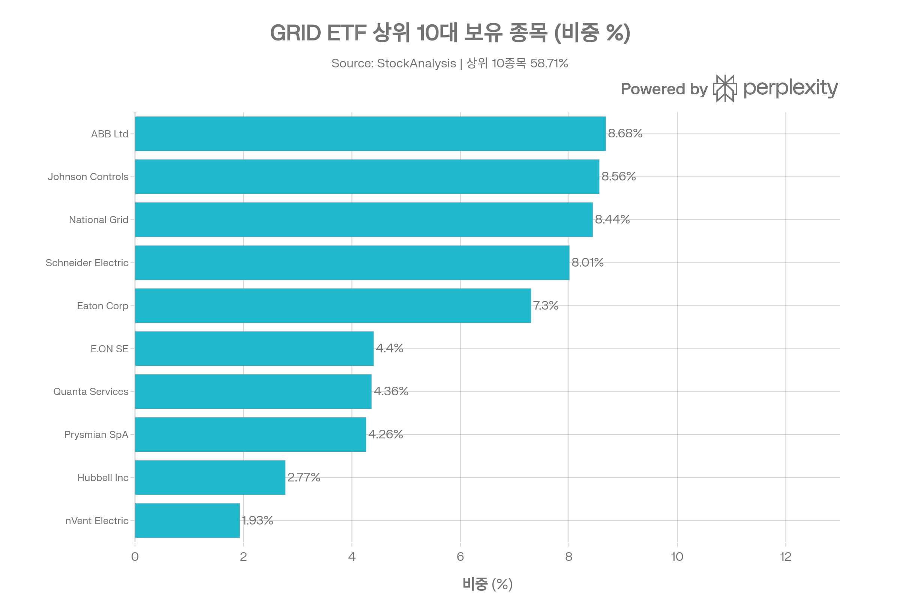
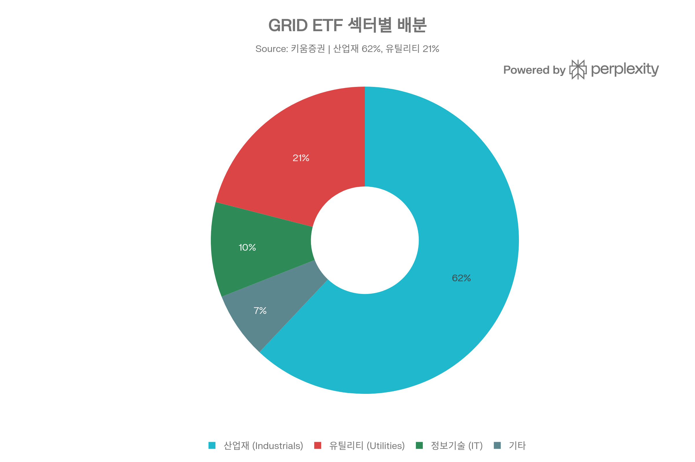
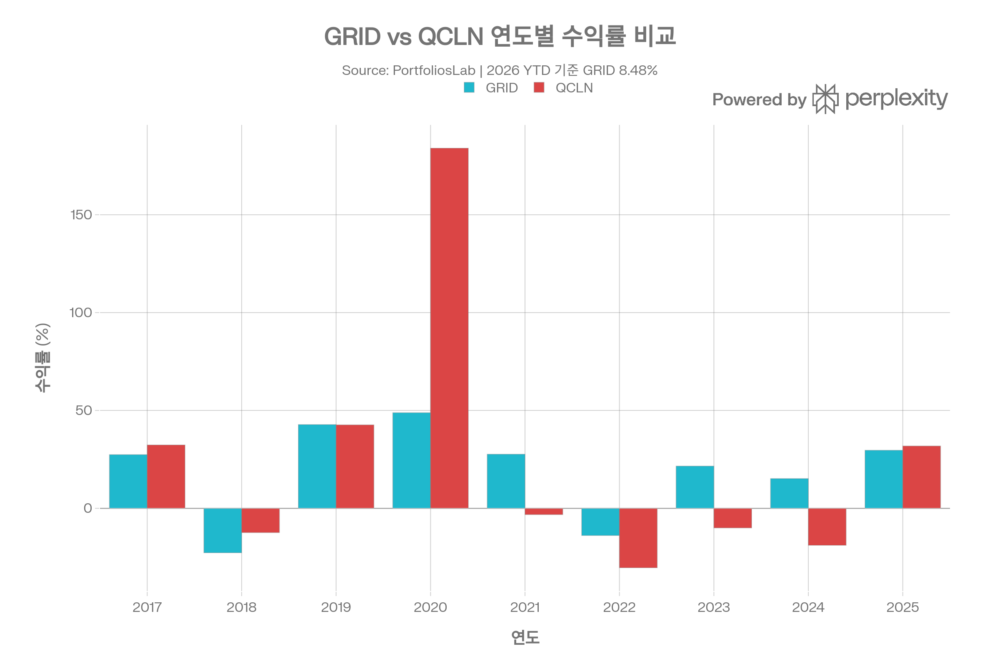
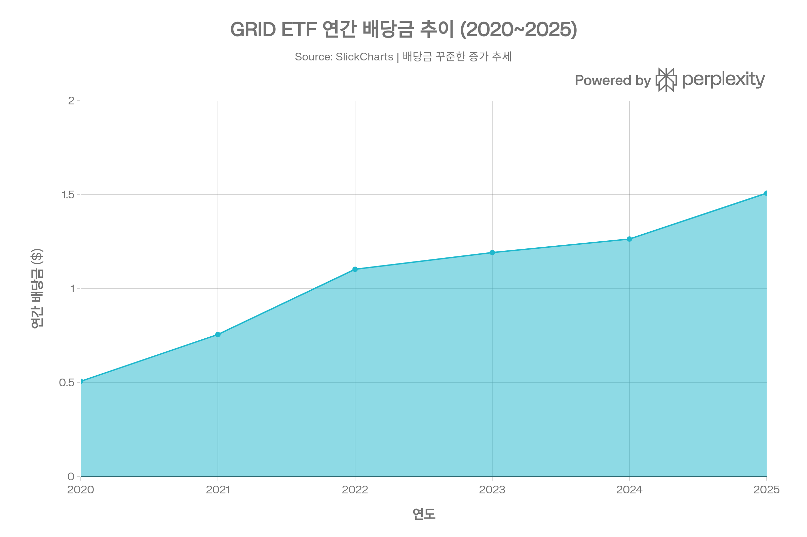
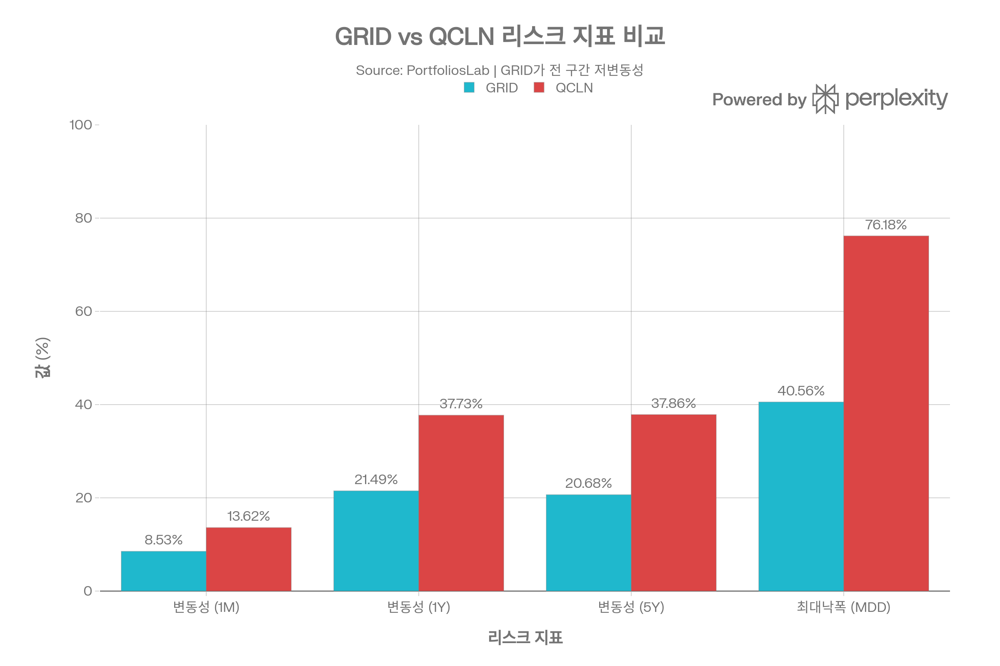

## 요약

> **분석 기준일:** 2026년 4월 8일

***
## ETF 분류

| 항목 | 내용 |
|------|------|
| **최종 폴더** | `ETF/Power Infrastructure/Smart Grid/GRID` |
| **대분류** | 테마 |
| **하위 분류** | Power Infrastructure / Smart Grid |
| **핵심 전략** | Nasdaq Clean Edge Smart Grid Infrastructure Index 추종 |
| **운용 방식** | 패시브 |
| **레버리지·인버스 여부** | 아니오 |
| **옵션 인컴 전략 여부** | 아니오 |

GRID는 명칭에 `NASDAQ`이 포함되어 있지만 대표지수 ETF가 아니라 스마트그리드와 전력망 현대화 관련 기업에 투자하는 **전력 인프라 테마 ETF**입니다. ETF 분류 기준상 실제 노출과 투자 목적을 우선하므로 `Power Infrastructure/Smart Grid`로 분류합니다.

***
## 1. 기본 정보
GRID ETF는 **First Trust Advisors L.P.**가 운용하는 패시브 ETF로, 전 세계 스마트 그리드 및 전기 에너지 인프라 기업에 집중 투자하는 테마형 펀드입니다.[1][2]

| 항목 | 내용 |
|------|------|
| **정식 명칭** | First Trust NASDAQ® Clean Edge® Smart Grid Infrastructure Index Fund |
| **티커** | GRID (NASDAQ) |
| **설정일** | 2009년 11월 16일 |
| **운용 기간** | 약 16년 (2009~현재) |
| **추종 지수** | Nasdaq Clean Edge Smart Grid Infrastructure Index™ |
| **운용사** | First Trust Advisors L.P. |
| **상장 거래소** | NASDAQ |
| **순자산(AUM)** | 약 77억 4천만 달러 (약 10.7조 원, 2026년 3월 기준) |
| **운용 방식** | 패시브 (완전 복제, Full Replication) |
| **카테고리** | Alternative Energy Equities / Infrastructure |
| **ISIN** | US33737A1088 |

**순자산 성장:** 2022년 약 7.2억 달러에서 2026년 77억 달러로 급격히 성장하며 AI·전력 인프라 수요 증가의 수혜를 받았습니다.[3][4]
### 추종 지수 소개
Nasdaq OMX Clean Edge Smart Grid Infrastructure™ Index(티커: QGDX)는 전 세계 전력망 현대화, 스마트 미터, 에너지 저장·관리, 관련 소프트웨어 부문에서 주된 사업을 영위하는 기업들로 구성된 수정 시가총액 가중 지수입니다. 구성 종목은 크게 **Pure Play(순수 관련 기업, 최대 80%)** 와 **Diversified(다각화 기업, 최대 20%)** 로 분류됩니다.[1][5]

***
## 2. 추종 성과 지표
### 추적 오차 및 추적 차이
| 지표 | 내용 |
|------|------|
| **NAV 대비 시장가격 괴리율** | 약 +0.10~+0.14% (프리미엄 상태) |
| **복제 방식** | 완전 복제 (Full Replication) |
| **지수 구성 종목 수** | 약 103~125개 |

- GRID ETF는 완전 복제(Full Replication) 방식을 채택하여 기초 지수 내 모든 구성 종목을 동일 비중으로 매수합니다.[1][6]
- NAV 대비 시장가격은 약 +0.10~0.14%의 소폭 프리미엄을 유지하고 있으며, 이는 활발한 유동성 덕분에 괴리가 최소화된 상태입니다.[7]
- 비용 비율(0.56%)과 포트폴리오 회전율(26%)을 감안하면, 추적 차이는 비용 수준 내에서 안정적으로 유지되는 것으로 평가됩니다.[8][4]

***
## 3. 비용 구조
### 총 보수 및 비용
| 항목 | GRID | QCLN | ICLN (iShares) |
|------|------|------|------|
| **총 보수(Expense Ratio)** | 0.56% | 0.60% | 0.40% |
| **최대 수수료 상한** | 0.70% (2026년 1월까지 계약) | — | — |
| **포트폴리오 회전율** | 26% | — | — |
| **배당 수익률** | 약 0.91~0.92% | 0.22% | — |

[8][9][10]

- GRID의 순 보수율은 **0.56%**로, 동일 섹터 ETF인 QCLN(0.60%)보다 낮고, iShares의 ICLN(0.40%)보다는 높습니다.[9][11]
- 포트폴리오 회전율은 26%로, 패시브 ETF 중 중간 수준이며 분기별 리밸런싱 및 지수 반기 재구성에 따른 비용이 반영됩니다.[5][8]
- 비용 상한이 0.70%로 계약되어 있으며, 실제 부담 비용은 0.56% 수준으로 유지됩니다.[10]

***
## 4. 유동성 평가
| 항목 | 수치 |
|------|------|
| **일평균 거래량 (1개월 기준)** | 약 21.3만 주 |
| **일평균 거래량 (3개월 기준)** | 약 14.1만 주 |
| **일평균 거래대금 (2025 기준)** | 약 $35M~$60M |
| **발행 주식 수** | 약 4,670만 주 |
| **52주 최저/최고** | $99.78 / $179.35 |

[4][11]

- AUM 77억 달러 규모의 대형 ETF로, 활발한 시장 조성자(Market Maker) 참여 덕분에 매수/매도 스프레드가 매우 좁게 유지됩니다.[12][4]
- 2025년 한 해 동안 약 **8억 5,500만 달러의 자금 순유입**이 발생하였으며, 2026년 3월에도 Adams Wealth Management가 1,460만 달러를 신규 투자하는 등 기관 투자자의 관심이 지속되고 있습니다.[13][7]
- 국내 키움증권 등을 통해서도 투자 접근이 가능하며, 유럽 UCITS 버전(아일랜드 법인, TER 0.63%)도 2022년 4월 이후 거래 중입니다.[6]

***
## 5. 포트폴리오 구성
### 상위 10대 보유 종목

| 순위 | 종목명 | 섹터 | 비중 |
|------|--------|------|------|
| 1 | ABB Ltd (스위스) | 산업재 | 8.68% |
| 2 | Johnson Controls International (아일랜드) | 산업재 | 8.56% |
| 3 | National Grid PLC (영국) | 유틸리티 | 8.44% |
| 4 | Schneider Electric SE (프랑스) | 산업재 | 8.01% |
| 5 | Eaton Corp PLC (아일랜드) | 산업재 | 7.30% |
| 6 | E.ON SE (독일) | 유틸리티 | 4.40% |
| 7 | Quanta Services (미국) | 산업재 | 4.36% |
| 8 | Prysmian SpA (이탈리아) | 산업재 | 4.26% |
| 9 | Hubbell Incorporated (미국) | 산업재 | 2.77% |
| 10 | nVent Electric PLC (아일랜드) | 산업재 | 1.93% |

[14][4]

**상위 10종목 합계 비중: 58.71%** — 카테고리 평균(40.86%)을 크게 상회합니다.[15]
### 섹터별 배분

포트폴리오는 **산업재(Industrials) 62%, 유틸리티(Utilities) 21%** 두 섹터에 집중되어 있습니다. 나머지 약 17%는 IT, 소재 등 기타 섹터로 구성됩니다. 이는 GRID ETF가 단순 유틸리티 ETF가 아니라, 전력망을 고도화하는 장비·솔루션·소프트웨어 기업에 폭넓게 투자하는 '픽스 앤 샤블(picks and shovels)' 전략임을 보여줍니다.[16][17]
### 국가별 배분

| 국가 | 비중 |
|------|------|
| 미국 | 21.7% |
| 아일랜드 | 18.1% |
| 영국 | 10.1% |
| 프랑스 | 9.4% |
| 스위스 | 8.7% |
| 이탈리아 | 6.3% |
| 독일 | 6.3% |
| 일본 | 4.0% |
| 한국 | 3.1% |
| 브라질 | 3.0% |
| 기타 | 9.3% |

[18]

미국 비중(21.7%)이 가장 높지만, **비미국 비중이 78.3%**에 달하여 글로벌 전력 인프라에 폭넓게 분산 투자합니다. 이는 국내 투자자에게 환율 리스크와 동시에 미국 외 선진국 전력 현대화 수혜를 제공하는 특성입니다.[18]
### 리밸런싱 주기
Nasdaq OMX Clean Edge Smart Grid Infrastructure 지수는 **분기별 리밸런싱, 반기별 재구성(Reconstitution)**을 실시합니다. 재구성 기준일은 매년 2월 및 8월 마지막 거래일입니다.[5]

***
## 6. 성과 분석
### 기간별 수익률
| 기간 | GRID 수익률 | 비고 |
|------|------------|------|
| YTD (2026) | +8.48% | S&P 500 대비 우위 |
| 1개월 | -1.93% | — |
| 6개월 | +8.95% | — |
| 1년 | +45.75% | 벤치마크 크게 상회 |
| 3년 (연환산) | +20.80% | — |
| 5년 (연환산) | +15.01% | — |
| 10년 (연환산) | +18.39% | — |
| 설정 이후 (연환산) | +12.36% | 2009년 11월 기준 |
### 벤치마크 대비 초과 수익
- 최근 1년(+45.75%)은 S&P 500(약 +14.4%)을 약 **31%p 초과** 달성하였습니다.[19]
- 10년 연환산 기준 +18.39%로, 경쟁 ETF QCLN(10년 +12.87%)을 약 **5.5%p 상회**합니다.[9]
- 2025년 한 해 동안 +29.65%를 기록하여, AI 및 데이터센터 전력 수요 급증의 최대 수혜 ETF 중 하나로 평가됩니다.[20][9]
### 위험조정 수익률
| 지표 | GRID | QCLN |
|------|------|------|
| **샤프 비율 (1Y)** | 2.14 | 1.59 |
| **샤프 비율 (5Y)** | 0.73 | -0.19 |
| **샤프 비율 (10Y)** | 0.81 | 0.37 |
| **소르티노 비율 (1Y)** | 2.93 | 2.20 |
| **칼마 비율 (1Y)** | 4.02 | 3.70 |

[9]

***
## 7. 배당 정보
### 배당 개요

| 항목 | 수치 |
|------|------|
| **배당 수익률 (TTM)** | 약 0.91~0.92% |
| **연간 배당금 (TTM)** | 약 $1.48~$1.55/주 |
| **배당 지급 주기** | 분기 배당 (연 4회) |
| **최근 배당락일** | 2025년 12월 12일 ($0.338) |
| **배당 성장률 (1Y)** | 약 +19.54% |
| **배당 성향(Payout Ratio)** | 약 22.94% |
### 배당 이력 (최근 2년)
| 배당락일 | 배당금 | 지급일 |
|---------|--------|--------|
| 2025-12-12 | $0.338 | 2025-12-31 |
| 2025-09-25 | $0.236 | 2025-09-30 |
| 2025-06-26 | $0.835 | 2025-06-30 |
| 2025-03-27 | $0.139 | 2025-03-31 |
| 2024-12-13 | $0.273 | 2024-12-31 |
| 2024-09-26 | $0.251 | 2024-09-30 |
| 2024-06-27 | $0.638 | 2024-06-28 |
| 2024-03-21 | $0.102 | 2024-03-28 |

[21][22]

배당금은 **분기별로 지급되며 6월 배당이 유독 크게 책정**되는 경향이 있습니다. 이는 포트폴리오 보유 기업들의 상반기 배당 집중에 기인합니다. 배당 수익률 자체는 낮지만, 주가 자본 이득이 훨씬 크므로 주로 성장형 투자 수단으로 적합합니다.[9][21]

***
## 8. 리스크 요소
### 베타 계수 및 변동성

| 지표 | 수치 |
|------|------|
| **베타 계수** | 1.22 (S&P 500 대비) |
| **변동성 (1M)** | 8.53% |
| **변동성 (1Y)** | 21.49% |
| **변동성 (5Y 연환산)** | 20.68% |
| **변동성 (10Y 연환산)** | 22.74% |
| **최대 낙폭 (MDD, 전체 이력)** | -40.56% |
| **최대 낙폭 (MDD, 1Y)** | -11.73% |
| **최대 낙폭 (MDD, 5Y)** | -29.64% |
- 베타가 1.22로, 시장 전체 대비 약 22% 더 크게 움직입니다. 전력·에너지 인프라는 경기에 민감하지 않은 특성이 있지만, 테마형 ETF 특성상 성장주적 성격이 섞여 시장보다 변동이 큽니다.[4]
- 역대 최대 낙폭(MDD)은 -40.56%이며, 경쟁 ETF인 QCLN(-76.18%)에 비해 훨씬 방어적입니다. 이는 포트폴리오 내 대형 우량주 비중이 높기 때문입니다.[9]
### 주요 리스크 요인
**1. 섹터 집중도 리스크**
상위 10종목이 전체 자산의 약 58.71%를 차지하며, ABB, Johnson Controls, National Grid, Schneider Electric 등 상위 4개 종목만으로도 33%를 초과합니다. 이들 중 하나에서 큰 악재가 발생할 경우 ETF 전체에 상당한 영향을 미칩니다.[15][14]

**2. 환율 및 국제 정치 리스크**
비미국 비중이 78.3%에 달하여 달러 강세 시 수익률이 압박을 받습니다. 유럽 에너지 정책 변화, 지정학 리스크(러·우 전쟁 등), 각국 규제 변동이 포트폴리오 성과에 직접적인 영향을 미칩니다.[18][10]

**3. 금리 리스크**
전력 인프라 기업들은 대규모 자본 투자가 필요한 자본집약적 산업입니다. 고금리 환경에서는 자금조달 비용 상승으로 수익성이 악화될 수 있으며, 반대로 금리 인하는 강력한 상승 촉매로 작용합니다.[23]

**4. 밸류에이션 리스크**
최근 급격한 주가 상승으로 PER이 약 25배까지 높아졌으며, Seeking Alpha는 2026년 1월 "밸류에이션 부담과 모멘텀 냉각"을 이유로 등급을 하향 조정하였습니다. AI 인프라 투자 기대가 선반영된 측면이 있어 기대치 미달 시 조정 가능성이 존재합니다.[4][20]

**5. AI·데이터센터 성장 둔화 리스크**
2024~2025년의 랠리는 주로 AI 및 데이터센터의 전력 수요 급증 기대에 기반하였습니다. 해당 테마가 약화될 경우 단기 조정 압력을 받을 수 있습니다.[17][24]
### 타 자산과의 상관계수
| 비교 대상 | 상관계수 |
|-----------|---------|
| QCLN (청정에너지) | 0.67 (보통) |
| S&P 500 (SPY) | 높음 (베타 1.22 반영) |

[9]

***
## 9. 경쟁 ETF 비교
| 항목 | GRID | QCLN | ICLN |
|------|------|------|------|
| **운용사** | First Trust | First Trust | iShares (BlackRock) |
| **추종 지수** | Nasdaq Clean Edge Smart Grid | Nasdaq Clean Edge Green Energy | S&P Global Clean Energy |
| **AUM** | ~$7.74B | ~소규모 | 대형 |
| **보수율** | 0.56% | 0.60% | 0.40% |
| **1년 수익률** | +45.75% | — | — |
| **10년 연환산** | +18.39% | +12.87% | — |
| **최대 낙폭** | -40.56% | -76.18% | — |
| **샤프 비율 (1Y)** | 2.14 | 1.59 | — |
| **투자 특성** | 전력망·산업재 중심 | 청정에너지 전반 | 글로벌 청정에너지 |

[9][25]

GRID는 테마 순수성, 장기 성과, 리스크 관리 측면에서 경쟁 ETF 대비 우위를 보이며, 특히 AI·전력 인프라 수요 증가라는 장기 구조적 트렌드에 직접적으로 노출된 ETF로 평가됩니다.[17][10]

***
## 10. 종합 투자 시사점
**투자 매력 요인:**
- 전 세계 전력망 현대화, AI 데이터센터 전력 수요, EV 충전 인프라 등 **장기 구조적 성장 테마**에 집중 노출[17][24]
- 설정 이래 연환산 +12.36%, 10년 연환산 +18.39%의 **강력한 장기 복리 성과**[4][9]
- 대형 우량주(ABB, Schneider, Eaton 등) 위주 포트폴리오로 순수 청정에너지 ETF 대비 **낮은 변동성과 방어적 특성**[9]
- 비미국 78.3%의 **글로벌 분산 투자** 효과[18]

**투자 유의 사항:**
- PER 25배 수준의 **고밸류에이션** 부담 존재[20][4]
- 비미국 78.3% 비중에 따른 **환율 리스크** 및 지정학 노출[18]
- 상위 10종목 58.71% 집중으로 **개별 종목 리스크** 주의[15]
- 배당 수익률 0.91%로 **인컴 투자 목적에는 부적합**, 자본 이득 위주 상품[4]

GRID ETF는 전력 인프라의 장기 성장을 믿는 투자자, 특히 AI·데이터센터 전력 수요 및 스마트 그리드 현대화 테마에 체계적으로 투자하고자 하는 중장기 투자자에게 적합한 상품으로 평가됩니다.
