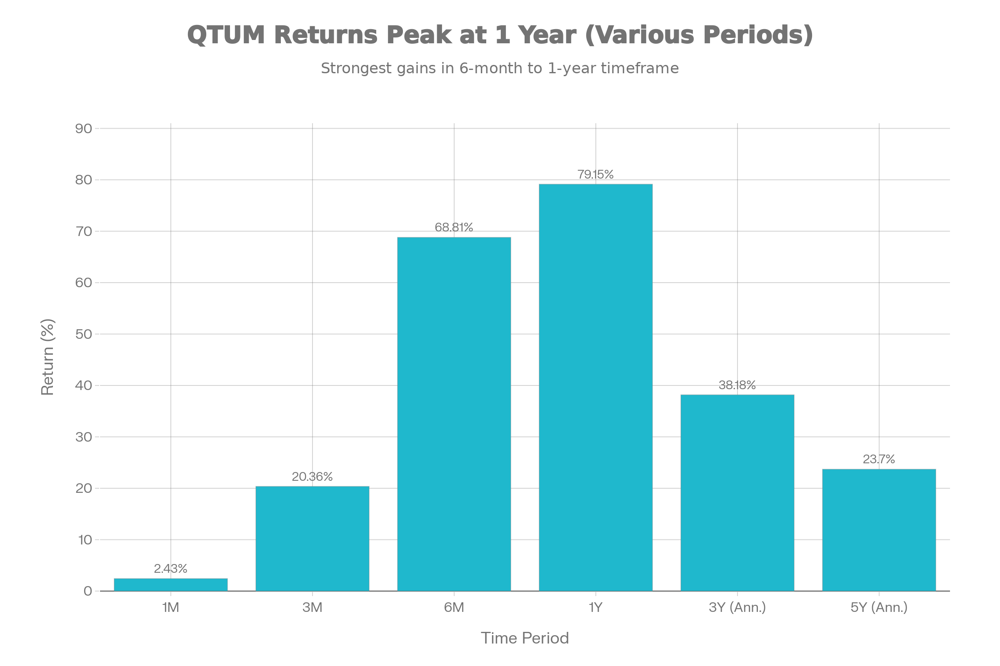
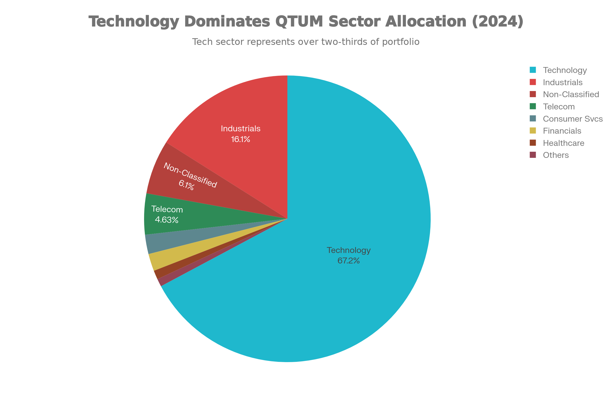
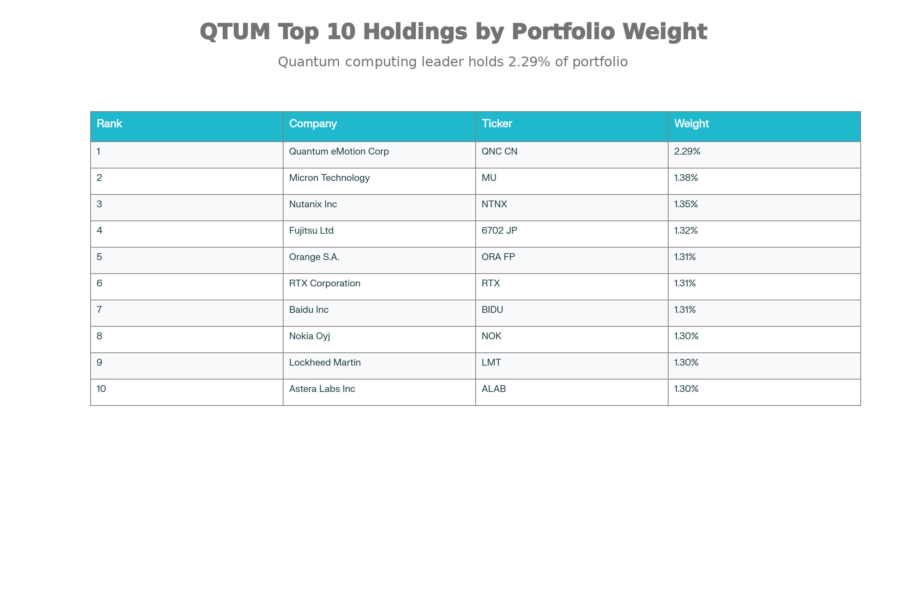
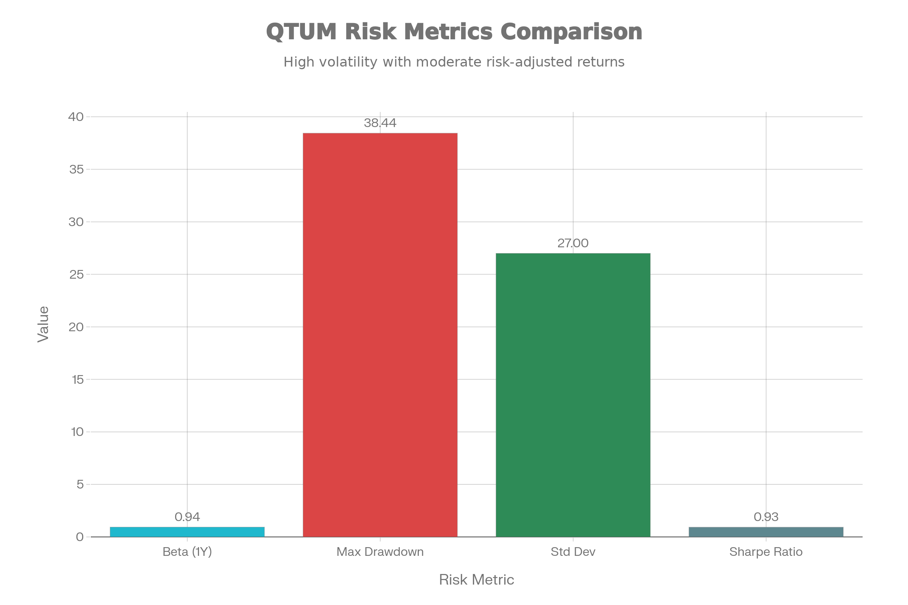

## Defiance Quantum ETF (QTUM) 종합 분석 보고서

## ETF 분류

| 항목 | 내용 |
|---|---|
| 최종 폴더 | `ETF/Quantum Computing/QTUM` |
| 대분류 | 테마 |
| 하위 분류 | 양자컴퓨팅 / 머신러닝 |
| 핵심 전략 | BlueStar Quantum Computing and Machine Learning Index를 추종해 양자컴퓨팅·머신러닝 관련 글로벌 기업에 투자 |
| 운용 방식 | 패시브 테마 ETF |
| 레버리지/인버스 | 없음 |
| 옵션 인컴 여부 | 없음 |
| 분류 판단 | 특정 섹터 전체가 아니라 양자컴퓨팅과 머신러닝이라는 구조적 성장 테마 노출이 핵심이므로 `테마 > 양자컴퓨팅`으로 분류 |

***

### 1. 기본 정보

<strong>QTUM (Defiance Quantum ETF)</strong>은 양자 컴퓨팅 및 머신러닝 분야의 글로벌 혁신 기업에 투자하는 업계 최초의 테마형 상장지수펀드입니다. Defiance ETFs에서 운용하며 BlueStar® Quantum Computing and Machine Learning Index (BQTUM)를 추종합니다.[^1]

| 항목 | 내용 |
| :-- | :-- |
| <strong>티커</strong> | QTUM (NASDAQ)[^2] |
| <strong>설정일</strong> | 2018년 9월 4-5일[^3][^4] |
| <strong>운용사</strong> | Defiance ETFs |
| <strong>상장거래소</strong> | NASDAQ |
| <strong>추종 지수</strong> | BlueStar Quantum Computing and Machine Learning Index (BQTUM)[^5] |
| <strong>현재 AUM</strong> | \$3.2B (2026년 1월 기준)[^6] |
| <strong>보유 종목 수</strong> | 86개[^7] |

QTUM은 2018년 상장 이후 획기적인 성장을 보여왔습니다. 2024년 말 기준 1년 수익률이 55% 이상을 기록했으며, 2025년 1월을 넘어서는 과정에서 \$1B 이상의 순자산을 달성했습니다.[^8][^9]

### 2. 추종 성과 지표

<strong>2026년 1월 5일 기준 QTUM의 성과는 탁월한 성장세를 보여줍니다:</strong>

QTUM ETF 기간별 수익률 (2026년 1월 5일 기준)

최근 1년간 79.15%의 높은 수익률을 기록했으며, 3년 연평균 38.18%, 5년 연평균 23.70%의 성과를 달성했습니다. 특히 2024년은 55% 이상의 수익률을 기록하며, 양자 컴퓨팅 섹터에 대한 시장의 강한 관심을 반영하고 있습니다.[^8][^10]

다만 <strong>추적 오차</strong>가 상당한 수준입니다. 1년 기준 17.12-17.32%의 추적 오차를 보이고 있으며, 이는 펀드의 실제 성과가 지수를 추종하는 과정에서 상당한 편차를 갖고 있음을 의미합니다. 추적 차이(Tracking Difference)의 중앙값이 -0.73%인 점을 고려하면, 운영 비용, 배당 처리, 리밸런싱 등에서 연 약 0.7% 정도의 손실이 발생하고 있습니다.[^10][^11]

<strong>NAV 대비 시장가격 괴리율</strong>은 매우 양호합니다. 평균 프리미엄/디스카운트가 0.10% 수준으로, ETF의 공정가가 시장 가격과 거의 일치하고 있음을 보여줍니다.[^11]

### 3. 비용 구조

| 비용 항목 | QTUM | 업계 평균 |
| :-- | :-- | :-- |
| <strong>총 관리비(Expense Ratio)</strong> | 0.40%[^6][^12] | 0.50-0.80% |
| <strong>추적 차이(Tracking Difference)</strong> | -0.73% (중앙값)[^11] | -0.30\~-1.00% |
| <strong>포트폴리오 회전율</strong> | 1.4%[^13] | 2-5% |
| <strong>평균 호가 스프레드</strong> | 0.07%[^13] | 0.10-0.20% |

QTUM의 0.40% 관리비는 테마형 ETF 시장에서 경쟁력 있는 수준입니다. 특히 양자 컴퓨팅과 같은 뉘앙스 있는 분야를 추종하는 ETF 중에서는 낮은 편입니다.[^1]

포트폴리오 회전율 1.4%는 반연간(6월, 12월) 리밸런싱 주기와 수정 동등가중 방식을 반영하는 매우 낮은 수준으로, 거래 비용 최소화에 기여합니다.[^14]

### 4. 유동성 평가

QTUM은 뛰어난 유동성을 보유한 것으로 평가됩니다:

| 유동성 지표 | 수치 | 평가 |
| :-- | :-- | :-- |
| <strong>평균 일 거래량</strong> | 374,000-407,000주[^6][^13] | 우수 |
| <strong>평균 일 거래대금</strong> | \$44-46M[^13] | 우수 |
| <strong>호가 스프레드</strong> | 0.07%[^13] | 매우 우수 |
| <strong>AUM 추이</strong> | 상승세[^15][^9] | 강화 중 |

2024년 말부터 2025년 초에 걸쳐 매달 수억 달러의 자금이 순유입되고 있습니다. 특히 2024년 12월 한 달간 약 \$250M이 유입되어 월간 기준 최대 규모를 기록했으며, 2025년 1월에도 지속적인 자금 유입이 이어져 \$1B 이상의 AUM을 달성했습니다.[^15][^8][^9]

호가 스프레드 0.07%는 매우 낮은 수준으로, 소액 투자자도 거래 비용 측면에서 불리함이 없습니다. 한국의 양자컴퓨팅 관련 ETF(예: SOL)와 비교했을 때도 일일 거래대금 기준 QTUM의 유동성이 훨씬 우수합니다.

### 5. 포트폴리오 구성

<strong>섹터별 배분:</strong>

QTUM ETF 섹터별 배분 현황

QTUM은 정보기술 섹터에 67.2%로 집중되어 있으며, 산업 16.05%, 통신 4.63%로 구성되어 있습니다. 이는 양자 컴퓨팅 및 머신러닝 기술이 주로 기술 기업에 의해 개발되기 때문입니다.[^16]

<strong>상위 10대 보유 종목:</strong>

QTUM ETF 상위 10대 보유 종목

상위 10개 종목의 비중이 14.17%로, 고도로 분산된 포트폴리오 구조를 유지하고 있습니다. 양자 컴퓨팅 전용 기업(Quantum eMotion, D-Wave 등)과 반도체 및 관련 기술 기업(Micron, Intel, NVIDIA 등)이 혼합되어 있습니다.[^17][^16]

<strong>지역별 구성:</strong>

| 지역 | 비중 |
| :-- | :-- |
| <strong>북미</strong> | 62.62%[^7] |
| <strong>아시아</strong> | 22.49%[^7] |
| <strong>유럽</strong> | 13.75%[^7] |
| <strong>오세아니아</strong> | 1.14%[^7] |

QTUM의 포트폴리오는 글로벌 양자 컴퓨팅 생태계를 대표합니다. 미국(NVIDIA, Intel, Microsoft 등), 캐나다(Quantum eMotion, D-Wave 등), 유럽(Nokia, Infineon 등), 아시아(Baidu, Alibaba, Fujitsu, TSMC 등)의 기업들이 모두 포함되어 있습니다.[^17]

<strong>리밸런싱:</strong>

리밸런싱은 반연간(6월, 12월) 진행되며, 수정 동등가중 방식을 사용합니다. 각 종목의 최대 가중치는 3개월 평균 일일 거래량 USD를 1억으로 나눈 값으로 제한되어, 유동성이 낮은 종목의 과도한 비중을 방지합니다.[^14][^18]

### 6. 성과 분석

<strong>기간별 수익률 분석:</strong>

QTUM의 수익률은 강한 상승 추세를 보이고 있습니다:

- <strong>단기(1-6개월)</strong>: 높은 변동성 속에서도 상승세 유지. 1개월 2.43%, 3개월 20.36%, 6개월 68.81%
- <strong>중기(1-3년)</strong>: 연평균 38.18% (3년)로 매우 우수한 수익률
- <strong>장기(5년)</strong>: 연평균 23.70%, 상장 이후 누적 370.42%[^10]

<strong>초과 수익률:</strong>

QTUM의 알파(Alpha)는 1년 기준 31.50%로, 벤치마크 대비 월등한 초과 성과를 기록하고 있습니다. 다만 3년, 5년 알파는 각각 6.11%, 5.87%로 감소하고 있어, 단기 모멘텀과 장기 기대 수익의 괴리를 시사합니다.[^10]

<strong>위험 조정 성과:</strong>

- <strong>샤프 지수</strong>: 0.93 (양호한 수준)[^19]
- <strong>칼마 비율</strong>: 0.62 (수익 vs 최대 낙폭 비율)[^19]
- <strong>소르티노 지수</strong>: 1년 6.79 (하락 위험 조정 수익률)[^10]

이들 지표는 QTUM이 높은 수익률을 추구하면서도 위험 관리 측면에서 합리적인 균형을 유지하고 있음을 보여줍니다.

### 7. 배당 정보

| 배당 지표 | 수치 |
| :-- | :-- |
| <strong>배당 수익률</strong> | 0.65-1.13%[^20][^21] |
| <strong>연간 배당액</strong> | \$1.06-1.11[^12][^20] |
| <strong>배당 주기</strong> | 분기별[^21] |
| <strong>최근 배당액</strong> | \$0.425 (2025년 12월)[^22] |
| <strong>1년 배당 증가율</strong> | 33-45%[^20][^23] |

QTUM의 배당금은 분기별로 지급되며, 최근 증가율이 높은 편입니다. 2024년과 2025년 초의 높은 수익률로 인해 기초 자산의 배당액이 크게 증가했기 때문입니다.

배당 이력을 보면 변동성이 큰 편입니다. 이는 기초 자산인 양자 컴퓨팅 관련 기업들의 배당 패턴과 포트폴리오 리밸런싱의 영향을 받기 때문입니다.[^22][^20]

### 8. 리스크 요소

QTUM ETF 주요 리스크 지표

<strong>시스템적 위험:</strong>

- <strong>베타</strong>: 0.94-1.30 - 시장과 유사하거나 약간 높은 민감도를 보입니다. 1.30에 가까운 경우 시장이 1% 하락할 때 QTUM은 1.3% 하락할 수 있음을 의미합니다.[^6][^24]
- <strong>S\&P 500 상관계수</strong>: 0.67-0.80 - 광범위한 시장과의 상관관계가 적당한 수준으로, 포트폴리오 분산화 효과를 제공합니다.[^25][^24]

<strong>변동성 및 낙폭:</strong>

- <strong>표준편차</strong>: 약 27% - 기술주 ETF(예: QQQ)의 20-25% 대비 높은 수준입니다.[^19]
- <strong>최대 낙폭</strong>: -38.44% - 2020년 코로나 팬데믹 당시의 시장 하락장에서 나타났습니다. 광범위한 기술주 지수 대비 더 큰 낙폭을 보일 수 있음을 의미합니다.[^19]

<strong>다운사이드 캡처 비율:</strong>

- 1년: -42.47% - 시장이 1% 하락할 때 QTUM이 0.42% 정도만 하락하여, 하락장에서의 방어력이 우수합니다.[^10]
- 3년: 76.94% - 중장기에는 시장 하락의 77% 정도를 함께 경험합니다.[^10]

<strong>업사이드 캡처 비율:</strong>

- 1년: 125.22% - 시장이 1% 상승할 때 QTUM이 1.25% 상승하여, 상승장에서의 수익성이 우수합니다.[^10]
- 3년: 99.79% - 중장기에는 시장 상승의 거의 대부분을 따라갑니다.[^10]

<strong>테마 집중도 리스크:</strong>

가장 중요한 리스크는 양자 컴퓨팅 산업 자체의 미성숙성입니다. 양자 컴퓨팅 기술이 아직 연구 개발 단계에 있으며, 상용화 시점과 규모가 불확실합니다. 만약 양자 컴퓨팅의 상용화가 지연되거나 기술 발전이 기대에 미치지 못할 경우, QTUM의 수익률은 큰 폭으로 조정될 수 있습니다.[^26]

<strong>소형주/신생 기업 노출:</strong>

포트폴리오에는 양자 컴퓨팅 전문 기업(D-Wave, IonQ, Rigetti 등)과 같은 소형주와 신생 기업들이 포함되어 있으며, 이들은 대형주 대비 변동성과 유동성 리스크가 높습니다.[^2][^16]

<strong>비다양화 위험:</strong>

QTUM은 기술 섹터에 67% 이상 집중되어 있으며, 특히 양자 컴퓨팅이라는 단일 테마에 노출되어 있습니다. 이는 광범위한 시장 분산화 효과를 제공하지 못합니다.[^26]

### 결론 및 투자 고려사항

<strong>QTUM의 강점:</strong>

1. <strong>강한 성장 모멘텀</strong>: 2024년 이후 지속적인 자금 유입과 55% 이상의 연 수익률
2. <strong>경쟁력 있는 비용 구조</strong>: 0.40%의 낮은 관리비와 0.07%의 호가 스프레드
3. <strong>우수한 유동성</strong>: 일 거래대금 \$44-46M으로 대규모 자금도 거래 가능
4. <strong>분산된 포트폴이오</strong>: 86개 종목으로 개별 종목 리스크 분산
5. <strong>글로벌 노출</strong>: 미국, 캐나다, 유럽, 아시아의 양자 기업 포괄

<strong>QTUM의 위험:</strong>

1. <strong>높은 변동성</strong>: 표준편차 27%, 최대 낙폭 -38.44%
2. <strong>테마 집중도 리스크</strong>: 양자 컴퓨팅 상용화 시점 불확실
3. <strong>높은 추적 오차</strong>: 1년 기준 17%+ 로 지수 추종도가 낮음
4. <strong>소형주 노출</strong>: 양자 컴퓨팅 신생 기업의 높은 비중
5. <strong>기술 섹터 편중</strong>: 67% 이상이 정보기술 섹터

<strong>투자 적절성:</strong>

QTUM은 다음과 같은 투자자에게 적합합니다:

- 중장기(3년 이상) 성장 기업에 투자하고자 하는 투자자
- 양자 컴퓨팅 분야의 장기 성장을 확신하는 투자자
- 높은 변동성을 감수할 수 있는 투자자
- 포트폴리오의 일부(10-20%)로 테마형 투자를 원하는 투자자

반면, 보수적인 투자자나 단기 수익을 추구하는 투자자에게는 부적절할 수 있습니다.

<strong>2025-2026년 전망:</strong>

양자 컴퓨팅 분야는 "다음 단계의 AI"로 주목받고 있으며, 정부와 기업의 투자가 연구 개발에서 실제 배포로 전환되는 단계에 진입하고 있습니다. 이는 장기적으로 QTUM에 긍정적인 요소입니다. 다만, 현재의 높은 수익률(1년 79%)이 지속될 가능성은 낮으며, 시장 조정 시 상당한 낙폭이 발생할 수 있다는 점을 감안해야 합니다.[^27]

***

<strong>주요 수치 요약:</strong>

| 지표 | 수치 |
| :-- | :-- |
| AUM | \$3.2B |
| 1년 수익률 | 79.15% |
| 3년 연평균 | 38.18% |
| 관리비 | 0.40% |
| 베타 | 0.94-1.30 |
| 최대 낙폭 | -38.44% |
| 배당 수익률 | 0.65-1.13% |
| 호가 스프레드 | 0.07% |
| 추적 오차 (1년) | 17.12% |

[^28][^29][^30][^31][^32][^33][^34][^35][^36][^37][^38][^39][^40][^41][^42][^43][^44][^45][^46][^47][^48][^49][^50][^51][^52][^53][^54][^55][^56][^57][^58][^59][^60]

⁂

[^1]: https://heartplay.tistory.com/803

[^2]: https://blog.naver.com/cross181/224036031534?fromRss=true\&trackingCode=rss

[^3]: https://kr.investing.com/etfs/defiance-quantum

[^4]: https://pearler.com/invest/us/asset/QTUM

[^5]: https://www.morningstar.com/etfs/xnas/qtum/quote

[^6]: https://robinhood.com/us/en/stocks/QTUM/

[^7]: https://www.investing.com/etfs/defiance-quantum-holdings

[^8]: https://m.ekn.kr/view.php?key=20241225024168664

[^9]: https://mlq.ai/stocks/QTUM/news/

[^10]: https://markets.businessinsider.com/etfs/defiance-quantum-etf-us26922a4206

[^11]: https://etfdb.com/etf/QTUM/

[^12]: https://www.barchart.com/etfs-funds/quotes/QTUM/profile

[^13]: https://www.etfrc.com/QTUM

[^14]: https://etfdb.com/fs-insight-reports/QTUM_insight_report.pdf

[^15]: https://dealsite.co.kr/articles/134309

[^16]: https://www.marketwatch.com/investing/fund/qtum/holdings

[^17]: https://stockanalysis.com/etf/qtum/holdings/

[^18]: https://www.marketvector.com/rulebooks/download/BQTUM_Index_Guide.pdf

[^19]: https://www.composer.trade/etf/QTUM

[^20]: https://www.digrin.com/stocks/detail/QTUM/

[^21]: https://stockanalysis.com/etf/qtum/dividend/

[^22]: https://www.defianceetfs.com/qtum/

[^23]: https://stockinvest.us/dividends/QTUM

[^24]: https://marketchameleon.com/Overview/QTUM/Summary/

[^25]: https://www.etfreplay.com/etf/qtum

[^26]: https://finance.yahoo.com/news/defiance-qtum-quantum-computing-etf-120600686.html

[^27]: https://thequantuminsider.com/2025/12/02/insider-data-trends-show-quantum-entering-industrial-deployment/

[^28]: https://kr.tradingview.com/chart/QTUM/bb0Ow2hJ/

[^29]: https://www.kraken.com/stocks/qtum

[^30]: https://www.tradingview.com/symbols/NASDAQ-QTUM/

[^31]: https://dealsiteplus.co.kr/articles/134309/025116

[^32]: https://ycharts.com/companies/QTUM/total_assets_under_management

[^33]: https://www.marketbeat.com/stocks/NASDAQ/QTUM/

[^34]: https://finance.yahoo.com/quote/QTUM/

[^35]: https://kr.tradingview.com/symbols/NASDAQ-QTUM/analysis/

[^36]: https://www.quantumamc.com/downloads/QGF-Tracking-Error-and-Difference.pdf

[^37]: https://feelsogood90.tistory.com/230

[^38]: https://markets.ft.com/data/etfs/tearsheet/holdings?s=QTUM%3ANMQ%3AUSD

[^39]: https://multihobby-syndrome.tistory.com/75

[^40]: https://blog.naver.com/PostView.naver?blogId=quiettchoi\&logNo=223660842448

[^41]: https://www.defianceetfs.com/qtum-full-holdings/

[^42]: https://v.daum.net/v/2EyFYuA8Xy

[^43]: https://marketchameleon.com/Overview/QTUM/Stock-Price-Action/Premarket-VWAP

[^44]: https://portfolioslab.com/tools/stock-comparison/QTUM/FTEC

[^45]: https://seekingalpha.com/symbol/QTUM/expenses

[^46]: https://www.spinquanta.com/news-detail/best-quantum-computing-etfs-for-2025

[^47]: https://www.wisdomtree.com/investments/etfs/megatrends/wqtm

[^48]: https://mlq.ai/etf/QTUM/dividends/

[^49]: https://www.barchart.com/stocks/quotes/QTUM

[^50]: https://finominal.com/fund-analyzer-analyze/1/US/QTUM

[^51]: https://www.sec.gov/Archives/edgar/data/1924868/000199937125012960/qtum_485apos-090925.htm

[^52]: https://global.morningstar.com/en-ca/investments/etfs/0P0001D9ZF/risk

[^53]: https://www.vaneck.com/uk/en/investments/quantum-computing-etf/index/

[^54]: https://cssanalytics.wordpress.com/2024/12/23/drawdown-implied-correlations-part-1/

[^55]: https://www.validea.com/etf-factor-report/QTUM

[^56]: https://www.okx.com/learn/what-is-qtum-token

[^57]: https://www.moomoo.com/community/feed/quantum-ai-nuclear-power-us-small-to-medium-stocks-top-115625727164422

[^58]: https://www.quantumamc.com/equity-funds/quantum-small-cap-fund

[^59]: https://finance.yahoo.com/quote/QTUM/profile/

[^60]: https://www.defianceetfs.com/qtum/Prospectus?rand=0.96967917191796
