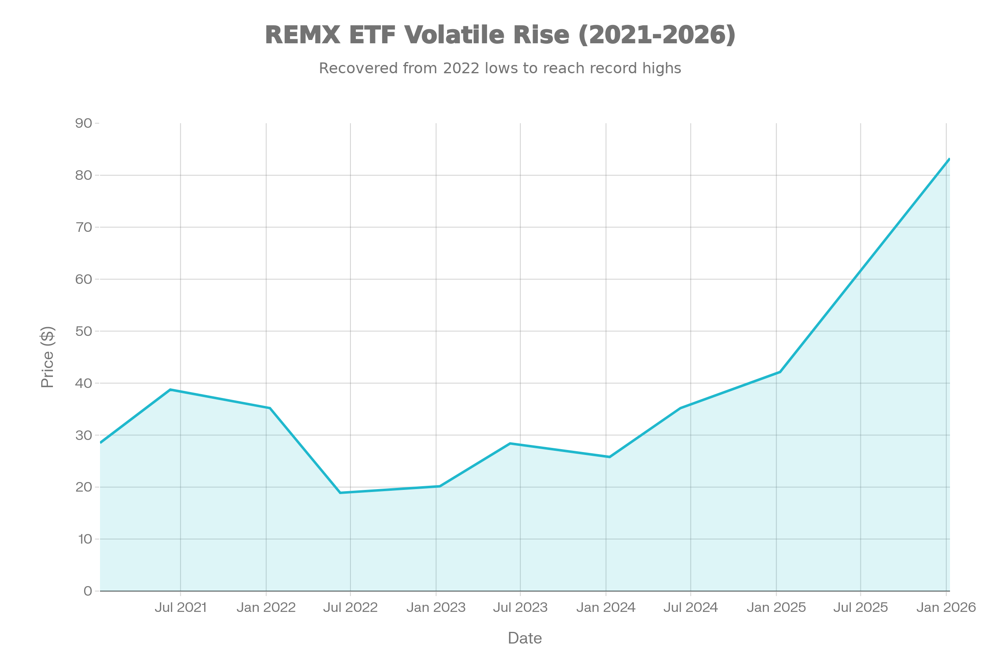
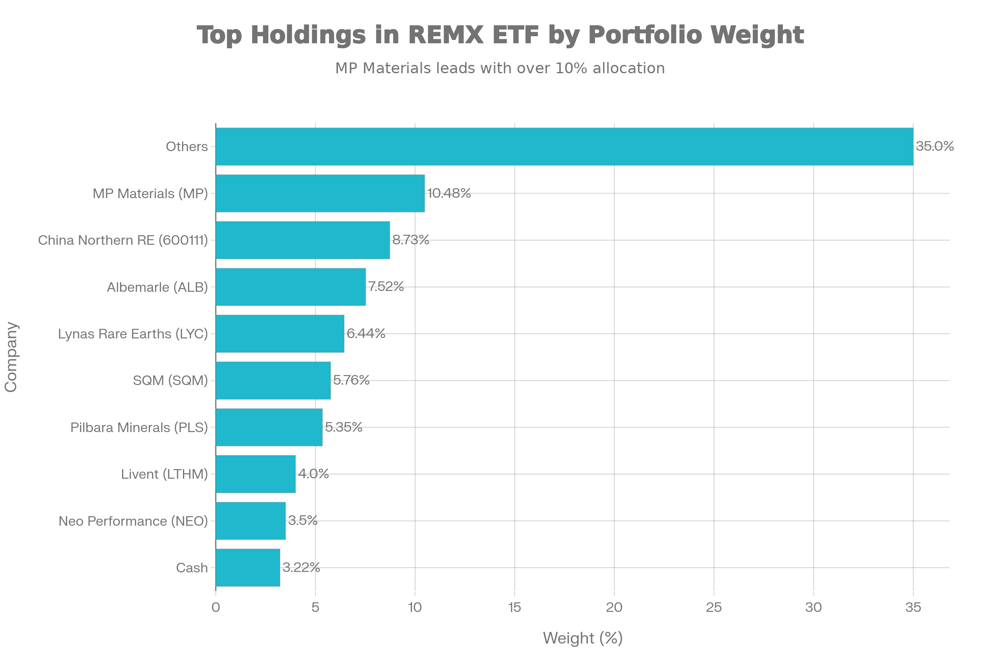
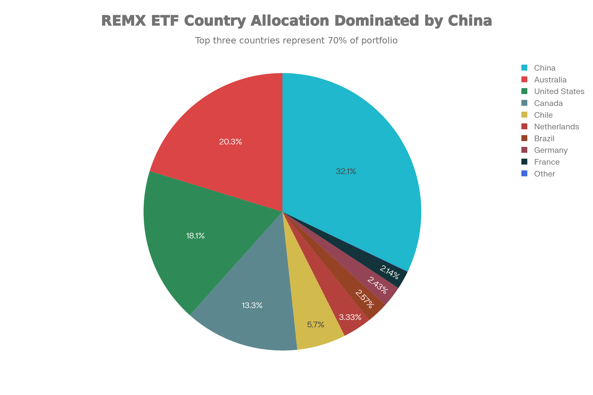
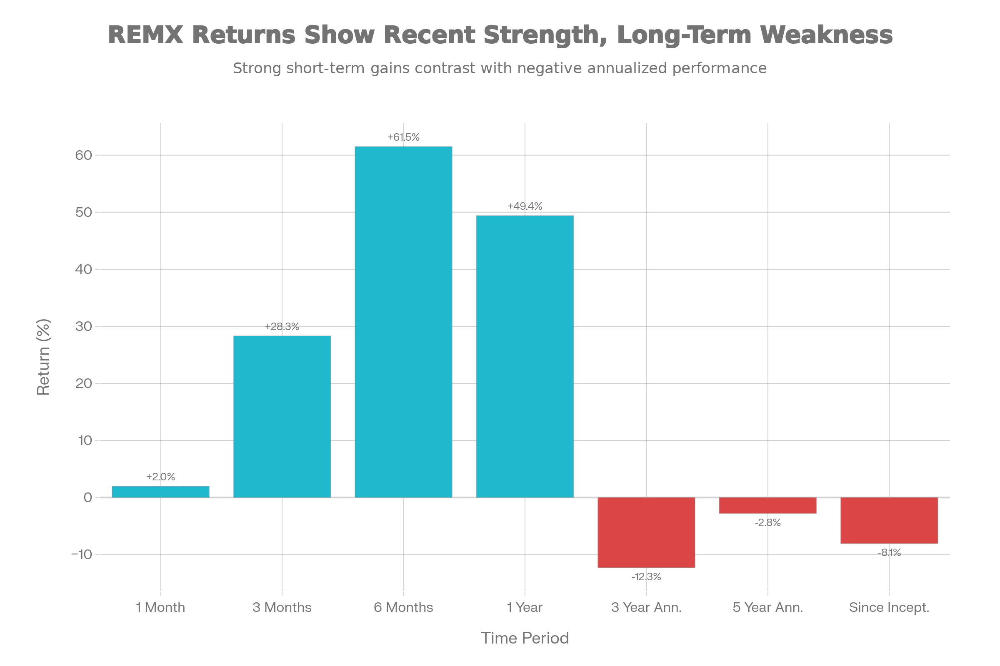

### 기본 정보

REMX는 VanEck Associates Corp.가 운용하는 패시브 지수 추종 상장지수펀드(ETF)로, 2010년 10월 27일에 설정되어 약 15.3년간 운용 중입니다. AMEX에 상장되며, MVIS Global Rare Earth/Strategic Metals Index를 추종합니다. 희토류(Rare Earth Elements) 및 전략 금속(리튬, 칼륨, 구리 등)의 채굴, 정제, 재활용 기업에 투자합니다.[^1]

순자산 규모(AUM)는 약 \$1.39B로 최근 급속도로 증가했습니다. 2025년 초만 해도 \$700-800M 규모였으나, 강한 시장 성과와 자금 유입으로 1년 내 \$803.38M의 순 유입을 기록했습니다. 현재 가격은 \$83.25로, 2021년 초 \$28.50에서 약 192% 상승했습니다.[^2]

***

### 추종 성과 지표

REMX ETF 5년 가격 추이 (2021-2026)

**극도의 우수한 2025년 성과**: REMX는 2025년 YTD 기준 약 95-99%의 극도로 우수한 수익률을 기록했습니다. 이는 모든 글로벌 ETF 중 최고 수준의 성과입니다. 1년 수익률 기준으로도 49.41% (NAV 기준)로 매우 높습니다.[^3]

**기간별 극단적 성과 변동**:

- **1개월**: +1.96%
- **3개월**: +28.33%
- **6개월**: +61.5%
- **1년**: +49.41%
- **3년 연환산**: -12.3% ⚠️ (극도 마이너스)
- **5년 연환산**: -2.8% ⚠️
- **설립 이후 15년**: -8.06% ⚠️ (극도 마이너스)

**성과 해석**: REMX는 최근 1년이 매우 우수하지만, 3년 이상의 중장기 관점에서는 마이너스 수익을 기록했습니다. 이는 원자재 가격 사이클의 극단성을 보여줍니다.

***

### 연도별 극단적 변동성

- **2025년**: +95-99% (희토류/리튬 가격 급등)
- **2024년**: -13.25% (중국 경제 둔화)
- **2023년**: +5.8% (전기차 수요 회복)
- **2022년**: -70% 이상 (팬데믹 이후 조정)
- **2021년**: 긍정적 (AI 붐 시작)

***

### 비용 구조

**총 운용보수**: REMX의 운용보수는 0.58%로 합리적입니다. 우주·항공우주 ETF의 0.38-0.75%와 비슷한 수준입니다.[^4]

**배당 정책**: REMX는 연 1회 배당을 지급하며, 배당수익률은 1.43-1.53%입니다. 2025년 12월 배당은 \$1.30으로 최근 3년 중 가장 높았습니다. 배당 이력을 보면 2021년에 매우 높았다가 감소했고, 최근 다시 증가하고 있습니다.[^5]

***

### 유동성 평가

**거래량 및 거래대금**: REMX의 일평균 거래대금은 약 \$43.5M로 우주·항공우주 ETF들(ITA \$174.61M, ARKX \$23.31M, UFO \$7.99M)과 비교하면 양호한 수준입니다. 좋은 유동성을 의미합니다.[^6]

**NAV 괴리율**: NAV 할인이 -1.9%로 약간의 할인으로 거래되고 있습니다.

***

### 포트폴리오 구성

REMX ETF 상위 보유 종목 및 비중

**상위 보유 종목**: REMX의 포트폴리오는 25-30개 종목으로 구성되어 있습니다. 상위 6개 종목이 약 44%를 차지합니다.[^7]

주요 보유 종목:

1. **MP Materials Corp (10.48%)** - 미국 희토류 채굴·정제 (미국 국방부 지원)
2. **China Northern Rare Earth (8.73%)** - 중국 희토류 기업
3. **Albemarle Corporation (7.52%)** - 리튬 및 희토류
4. **Lynas Rare Earths (6.44%)** - 호주 희토류 기업
5. **SQM (5.76%)** - 칠레 리튬 광산
6. **Pilbara Minerals (5.35%)** - 호주 리튬 기업

**국가별 분배**:

REMX ETF 국가별 자산 배분

REMX는 글로벌하게 분산되어 있습니다. 중국(32.07%)이 가장 큰 비중을 차지하지만, 호주(20.26%), 미국(18.12%), 캐나다(13.33%)도 상당한 비중을 가집니다. 칠레(5.70%)는 리튬 생산국으로서 중요한 역할을 합니다.[^8]

**지정학적 리스크**: 중국이 32%를 차지하므로, 미-중 갈등이나 중국 규제 변화에 영향을 받을 수 있습니다.

***

### 성과 분석

REMX ETF 기간별 수익률

**2025년 극도의 회복의 이유**:

1. **희토류·리튬 가격 급등**: AI 칩, 배터리, 전기자동차 부품 수요 폭증
2. **지정학적 긴장**: 우크라이나 전쟁, 중동 갈등으로 전략 자원 가치 상승
3. **미국 국가 안보 전략**: Executive Order 13817에 의한 핵심 광물 공급망 재편
4. **AI 붐**: AI 데이터센터 건설, 고성능 칩 수요 급증
5. **전기차 성장**: 글로벌 EV 도입 가속으로 리튬/코발트 수요 증가
6. **정부 직접 투자**: 미국 정부의 MP Materials, Lynas 등에 대한 직접 투자

**중장기 성과의 약점**: 3년 -12.3%, 5년 -2.8%, 15년 -8.06%는 극도의 사이클성을 보여줍니다. 2022년 팬데믹 이후 조정(-70%), 2023년 회복(+5.8%), 2024년 재조정(-13.25%), 2025년 극도 회복(+95%)의 패턴입니다.

***

### 리스크 요소

**극도의 높은 변동성**: P/E 34.85, 베타 추정 1.3-1.4로 매우 높은 변동성을 가집니다. 52주 범위 \$16.31-\$99.40는 약 509%의 극단적 변동을 의미합니다.[^9]

**원자재 가격 의존성**: 희토류와 리튬 가격의 변동에 거의 전적으로 의존합니다. 글로벌 수요 감소나 공급 증가 시 급락할 수 있습니다.

**지정학적 리스크**: 중국이 32%를 차지하므로, 미-중 갈등, 수출 제한, 채광 규제 등에 극도로 민감합니다.

**경기 사이클 의존성**: 전기자동차, 재생에너지 산업의 경기가 좋을 때만 강세입니다. 2024년 경기 둔화로 -13.25% 손실을 기록했습니다.

**정책 리스크**: 중국의 희토류 수출 제한 정책, 미국의 관세 정책, 환경 규제 등이 가격에 미치는 영향이 큽니다.

***

### 투자 의미와 기회

**글로벌 패권 경쟁의 핵심 자원**:

REMX의 성공은 희토류와 리튬이 미국과 중국의 기술 경쟁의 핵심이 됨을 보여줍니다. AI 칩, 배터리, 풍력 터빈, 전기자동차 모두 희토류와 리튬에 의존합니다.

**국가 차원의 투자**:

미국 정부가 직접 MP Materials와 Lynas Rare Earths에 투자하는 것은 단순한 기업 투자가 아니라 국가 안보 차원의 투자입니다. 이는 장기적인 가격 지지를 의미할 수 있습니다.

**AI와 EV의 이중 수혜**:

AI 데이터센터와 전기자동차가 동시에 성장하면서 희토류 수요가 폭증했습니다. 이 트렌드가 계속되면 REMX의 장기적 수익성이 높을 수 있습니다.

***

### 종합 평가 및 투자 고려사항

**강점**:

- 2025년 극도의 우수한 성과 (+95-99%)
- 글로벌 패권 경쟁에서 핵심 자원
- 정부 지원으로 공급망 안정화
- AI와 EV의 이중 성장 동인
- 좋은 유동성 (\$43.5M 일거래)
- 적절한 운용보수 (0.58%)
- 배당 수익 (1.43%)

**약점**:

- **극도의 장기 변동성**: 3년 -12.3%, 5년 -2.8%, 15년 -8.06%
- **2025년 성과는 지속 불가능**: 회정 매우 높아서 조정 위험
- **중국 의존도**: 32% 중국 기업으로 지정학적 리스크
- **원자재 사이클**: 경기 둔화 시 급락 (2024년 -13.25%)
- **정책 리스크**: 규제 변화에 극도로 민감
- **P/E 상승**: 고평가 위험 증대

**투자 적합성**:

**추천 투자자**:

1. **글로벌 패권 경쟁에 베팅하는 투자자**
2. **AI/EV 성장에 확신하는 투자자**
3. **희토류·리튬 공급 부족을 믿는 투자자**
4. **고위험 고수익을 추구하는 투자자**
5. **3-5년 이상 장기 투자자** (단기 변동성 감수)

**비추천 투자자**:

1. **안정성 중시 투자자** (극도 변동성)
2. **단기 수익 추구자** (사이클 예측 어려움)
3. **2025년의 +95% 성과 반복 기대자** (지속 불가능)
4. **중국 리스크 회피자** (32% 중국 노출)

***

### 최종 결론

**REMX는 글로벌 패권 경쟁과 AI/EV 성장의 이중 수혜를 받는 전략 자원 ETF**입니다. 2025년의 +95-99% 성과는 희토류와 리튬이 21세기 가장 중요한 자원이 되었음을 의미합니다.

그러나 **극도의 장기 변동성**(3년 -12.3%)을 고려할 때, 이는 **고위험 고수익** 자산입니다. 2025년의 극도 우수한 성과는 역사적으로 보면 수정이 필요할 수 있습니다.

**투자 전략**:

- **포지션 크기**: 전체 포트폴리오의 2-5% (고위험 자산)
- **투자 기간**: 최소 3-5년 (사이클 수용)
- **진입 전략**: 일시 투자보다 분할 매매 (변동성 대비)
- **혼합 포트폴리오**: REMX만으로는 위험, 안정 자산과 혼합

**결론**: REMX는 **미래 자원 전쟁에 베팅하는 투자자**에게 매력적이지만, **극도의 변동성을 감수할 수 있는 경험 많은 투자자**에게만 권고됩니다.

***

### 참고 자료

VanEck 공식 사이트 - 기본 정보[^10][^1]
TradingView - AUM 및 자금 흐름[^11][^2]
Investing.com - 2025년 성과[^12][^3]
TradingView - 운용보수[^4][^11]
VanEck - 배당 이력[^5][^10]
TradingView - 거래 통계[^6][^11]
Fintel - 포트폴리오 구성[^13][^7]
VanEck - 국가별 배분[^8][^10]
TradingView - P/E 및 리스크[^9][^11]
[^14][^15][^16][^17][^18][^19][^20][^21][^22][^23][^24]

⁂

[^2]: https://kr.investing.com/etfs/spdr-kensho-final-frontiers

[^3]: https://m.invest.zum.com/etf/ROKT/

[^4]: https://kr.investing.com/etfs/spdr-kensho-final-frontiers-technical

[^5]: https://kr.investing.com/etfs/spdr-kensho-final-frontiers-options

[^6]: https://kr.investing.com/etfs/spdr-kensho-final-frontiers-scoreboard

[^7]: https://cbonds.com/etf/2245/

[^8]: https://kr.tradingview.com/symbols/AMEX-ROKT/

[^9]: https://www.samsungfund.com/etf/insight/newsroom/view.do?seqn=70015

[^10]: https://www.vaneck.com/us/en/investments/rare-earth-strategic-metals-etf-remx/

[^11]: https://kr.tradingview.com/symbols/AMEX-REMX/analysis/

[^12]: https://kr.investing.com/etfs/marketv.-rare-earth-strat.-metals

[^13]: https://fintel.io/ko/i/vaneck-vectors-etf-trust-vaneck-vectors-rare-earth-strategic-metals-etf

[^14]: https://kr.investing.com/etfs/marketv.-rare-earth-strat.-metals-holdings

[^15]: https://bbn.kiwoom.com/rfTP686

[^16]: https://heartplay.tistory.com/811

[^17]: https://investment-space.tistory.com/520

[^18]: https://www.vaneck.com/us/en/remx/fact-sheet/

[^19]: https://april.lifewellstory.kr/entry/REMX-ETF-투자-가이드-MP-Materials-50-급등과-희토류-시장-전망-분석

[^20]: https://stockevents.app/kr/stock/REMX

[^21]: https://kr.investing.com/etfs/marketv.-rare-earth-strat.-metals-options

[^22]: https://blog.naver.com/jeunkim/224127353372?fromRss=true\&trackingCode=rss

[^23]: https://brunch.co.kr/@josephlee54/7098

[^24]: https://invest.deepsearch.com/etf/REMX/
