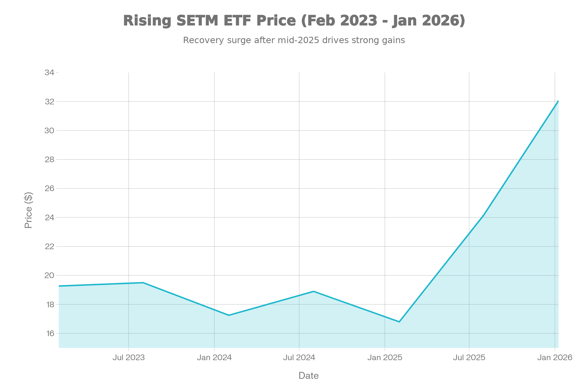
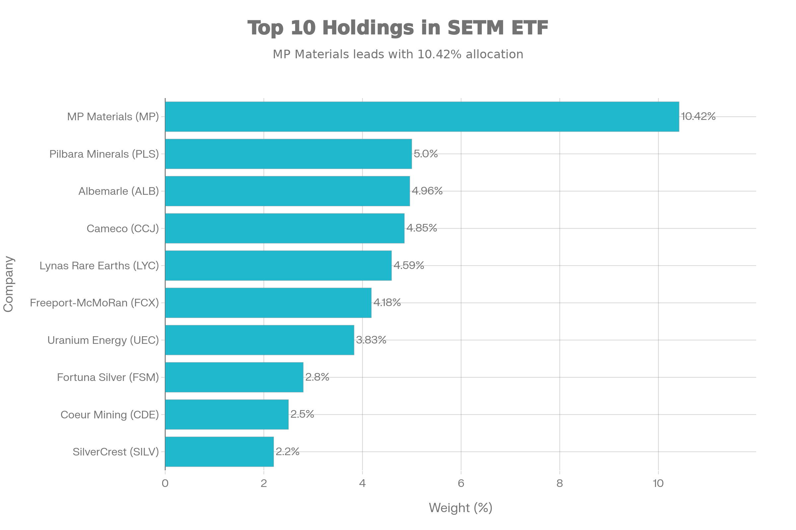
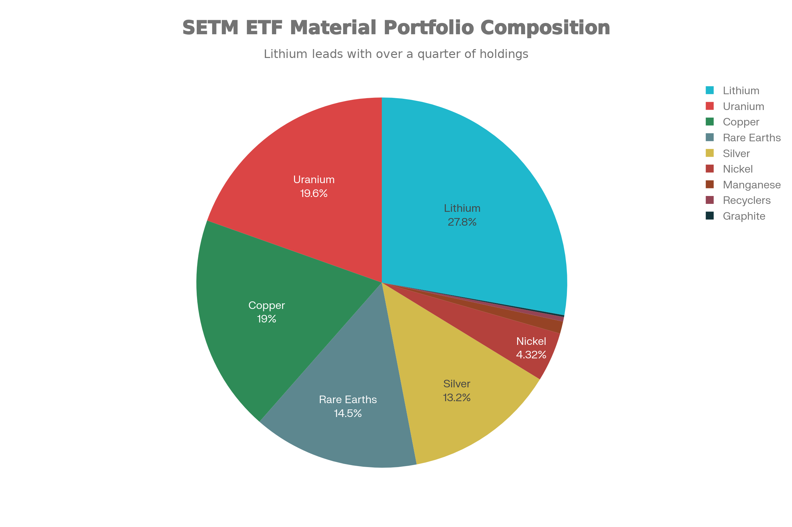
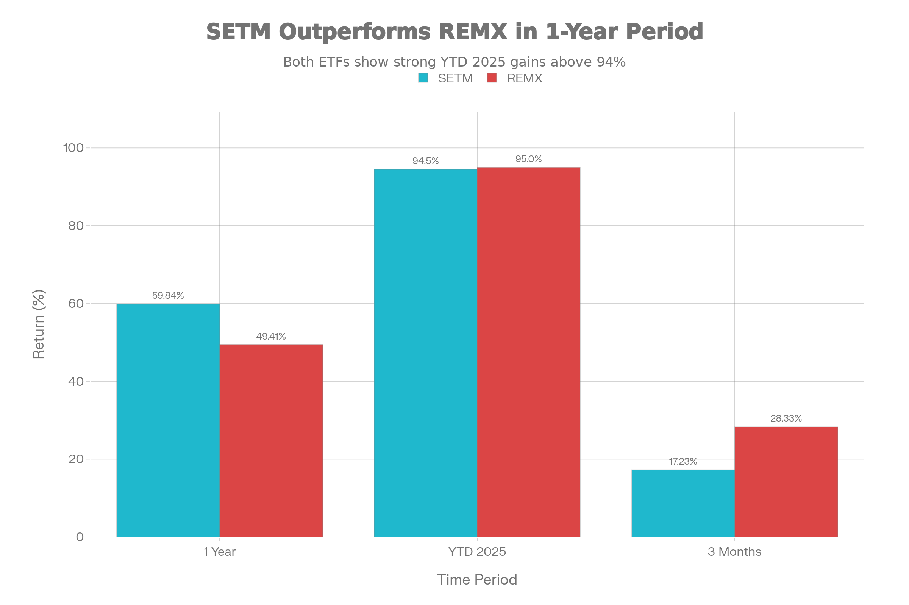

### 기본 정보

SETM은 Sprott Funds Trust가 운용하는 패시브 지수 추종 상장지수펀드(ETF)로, 2023년 2월 1일에 설정되어 약 3년간 운용 중입니다. NASDAQ에 상장되며, Nasdaq Sprott Critical Materials™ Index를 추종합니다. 2024년 10월까지는 "Sprott Energy Transition Materials ETF"로 불렸으나, 명칭을 변경했습니다.[^1]

SETM은 에너지 전환(Energy Transition)에 필수적인 핵심 자재를 채굴, 정제, 재활용하는 기업들에 투자합니다. 이는 리튬, 우라늄, 구리, 희토류, 은, 니켈, 코발트, 그래파이트 등의 광산 기업들입니다.[^2]

순자산 규모(AUM)는 약 \$302.84M이며, 최근 자금 유입이 활발하여 1년 내 \$93.29M의 순 유입을 기록했습니다. 현재 가격은 \$32.06으로, 2023년 초 설정 시 \$19.27에서 약 66% 상승했습니다.[^3]

***

### 추종 성과 지표

SETM ETF 3년 가격 추이 (2023-2026)

**극도의 우수한 2025년 성과**: SETM은 2025년 YTD 기준 약 94.50-99%의 극도로 우수한 수익률을 기록했습니다. 블룸버그 및 다수의 투자 매체는 SETM을 "2025년 최고 수익률 ETF"로 선정했습니다.[^4]

**기간별 성과**:

- **1개월**: +5.79%
- **3개월**: +17.23%
- **YTD (2025)**: +94.50%
- **1년**: +59.84% (NAV 기준)
- **3년 평균**: +14.79% (설립 이후, 매우 우수)
- **설립 이후**: +68.68%

**성과 해석**: SETM은 REMX와 비슷하게 2025년 극도의 우수한 성과를 기록했습니다. 다만, 1년 수익률(59.84%)은 REMX(49.41%)보다 약간 높으며, 설립 이후 3년 평균(14.79%)은 매우 우수합니다.

***

### 비용 구조

**총 운용보수**: SETM의 운용보수는 0.65%입니다. 이는 REMX의 0.58%보다 약간 높고, 우주·항공우주 ETF들(0.38-0.75%)과 비슷한 수준입니다.[^5]

**배당 정책**: SETM은 배당을 지급합니다. 배당수익률은 1.10%이며, 일반적으로 연 1회 배당이 지급됩니다.[^6]

***

### 유동성 평가

**거래량 및 거래대금**: SETM의 일평균 거래대금은 약 \$2.72M으로 낮지만, REMX(\$43.5M)나 우주 ETF들과 비교하면 충분합니다. 신생 펀드 치고는 양호한 유동성입니다.[^7]

**NAV 괴리율**: NAV 프리미엄이 0.68%로 약간의 프리미엄으로 거래되고 있습니다.

***

### 포트폴리오 구성

SETM ETF 상위 10대 보유 종목 및 비중

**상위 보유 종목**: SETM의 포트폴이는 87-127개 종목으로 구성되어 있습니다. 다양한 광산 및 자재 기업들을 포함합니다.[^8]

주요 보유 종목:

1. **MP Materials Corp (10.42%)** - 미국 희토류 채굴
2. **Albemarle (4.96%)** - 리튬 및 희토류
3. **Cameco (4.85%)** - 우라늄
4. **Lynas Rare Earths (4.59%)** - 호주 희토류
5. **Freeport-McMoRan (4.18%)** - 구리 및 금
6. **Pilbara Minerals (5.00%)** - 호주 리튬

**자재별 분배**:

SETM ETF 핵심 자재별 자산 배분

SETM은 다양한 핵심 자재에 분산된 포트폴리오를 보유합니다. 리튬(27.83%)이 가장 큰 비중을 차지하며, 우라늄(19.56%), 구리(18.98%), 희토류(14.48%), 은(13.23%)이 이어집니다. 이는 전기자동차 배터리(리튬), 핵 에너지(우라늄), 전기 인프라(구리) 등 다양한 에너지 전환 시나리오를 포괄합니다.[^9]

**지역별 분배**:

- 캐나다: 31.61%
- 호주: 26.00%
- 미국: 24.51%
- 신흥 아시아: 11.15%
- 기타: 6.73%

***

### SETM vs REMX 비교

SETM vs REMX 성과 비교 (핵심 자재 ETF 비교)

| 지표 | SETM | REMX |
| :-- | :-- | :-- |
| **설립 연도** | 2023년 2월 | 2010년 10월 |
| **운용보수** | 0.65% | 0.58% |
| **1년 수익률** | 59.84% | 49.41% |
| **YTD 2025** | 94.50% | 95.0% |
| **AUM** | \$302.84M | \$1.39B |
| **배당수익률** | 1.10% | 1.43% |
| **P/E 배수** | 29.93 | 34.85 |
| **보유 종목** | 87-127개 | 25-30개 |

**SETM의 장점**:

1. 설립 이후 3년 평균 14.79% (REMX의 장기 마이너스 대비)
2. 더 다양한 자재 포트폴리오 (리튬+우라늄+구리 등)
3. 더 많은 보유 종목 (분산도 높음)
4. 약간 낮은 P/E (29.93 vs 34.85)

**REMX의 장점**:

1. 더 오래된 역사 (검증도)
2. 더 큰 규모 (AUM \$1.39B)
3. 약간 더 높은 배당 (1.43% vs 1.10%)
4. 더 낮은 운용보수 (0.58% vs 0.65%)

***

### 2025년 극도의 성과의 이유

**SETM과 REMX가 모두 2025년 약 95% 수익률을 기록한 이유**:

1. **AI 칩 수요 폭증**: NVIDIA 등 AI 칩 제조사의 수요로 구리 및 희토류 가격 급등
2. **리튬 가격 급등**: 전기자동차 및 에너지 저장 배터리 수요로 리튬 가격 3배 이상 상승
3. **우라늄 가격 상승**: 핵 에너지 재평가 및 기후 변화 대응으로 우라늄 가격 급상승
4. **지정학적 긴장**: 미-중 기술 경쟁으로 전략 자원의 가치 상승
5. **정부 투자**: 미국 정부의 핵심 광물 공급망 재편 정책

***

### 리스크 요소

**극도의 높은 변동성**: P/E 51.49는 매우 높은 배수이며, 베타 추정 1.3-1.4로 높은 변동성을 가집니다.[^10]

**원자재 가격 의존성**: 리튬, 우라늄, 구리 등의 원자재 가격 변동에 거의 전적으로 의존합니다.

**지정학적 리스크**: 캐나다(31.61%), 호주(26%)에 편중되어 있지만, 신흥 아시아(11.15%)와 미국(24.51%)도 상당합니다.

**경기 사이클**: 경기 둔화 시 에너지 전환 투자가 줄어들 수 있습니다.

**2025년 성과의 지속성**: +94.50%의 성과는 역사적으로 매우 높으며, 2026년 조정이 예상됩니다.

***

### 종합 평가 및 투자 고려사항

**강점**:

- 극도의 우수한 2025년 성과 (+94.50%)
- 설립 이후 우수한 3년 평균 성과 (+14.79%)
- 다양한 자재 포트폴리오 (리튬+우라늄+구리)
- 에너지 전환의 핵심 자산에 노출
- 정부 지원으로 공급망 안정화
- 87-127개 종목의 우수한 분산
- 배당 수익 (1.10%)

**약점**:

- 매우 신생 펀드 (3년, REMX는 15년)
- 극도의 높은 P/E (51.49)
- 원자재 사이클에 극도로 의존
- 2025년 성과는 지속 불가능할 가능성
- 지정학적 리스크 (캐나다 31.61%)

**투자 적합성**:

**추천**:

- 핵심 자재 성장에 베팅하는 투자자
- 에너지 전환 전략에 확신하는 투자자
- 3-5년 이상 장기 투자자
- 고위험 고수익 추구자

**비추천**:

- 안정성 중시 투자자
- 단기 수익 추구자
- 2025년 성과 반복 기대자

***

### 최종 결론

**SETM은 에너지 전환에 필수적인 핵심 자재에 투자하는 우수한 신생 ETF**입니다. 2025년 +94.50% 성과는 리튬, 우라늄, 구리 등이 21세기 에너지 혁명의 중심이 됨을 의미합니다.

REMX와 비교할 때, **SETM은 더 다양한 자재 포트폴리오와 우수한 3년 평균 성과(14.79%)**를 제공합니다. 다만, **신생 펀드이고 극도의 고평가(P/E 51.49)**이므로, 조정 위험을 감수해야 합니다.

**투자 전략**: 포트폴리오의 2-5% 정도의 고위험 자산으로 배치하고, 3-5년 이상의 장기 투자 관점으로 접근하는 것을 권고합니다.

***

### 참고 자료

Sprott 공식 사이트 - 기본 정보[^11][^1]
Sprott USA - 투자 대상[^12][^2]
TradingView - AUM 및 자금 흐름[^13][^3]
Sprott - 2025년 성과[^4][^11]
TradingView - 운용보수[^5][^13]
TradingView - 배당 정보[^6][^13]
TradingView - 거래대금[^7][^13]
Sprott - 보유 종목 수[^8][^11]
Sprott - 자재별 비중[^9][^11]
Yahoo Finance - P/E 비율[^14][^10]
[^15][^16][^17][^18][^19][^20][^21][^22][^23][^24][^25]

⁂

[^2]: https://kr.investing.com/etfs/spdr-kensho-final-frontiers

[^3]: https://m.invest.zum.com/etf/ROKT/

[^4]: https://kr.investing.com/etfs/spdr-kensho-final-frontiers-technical

[^5]: https://kr.investing.com/etfs/spdr-kensho-final-frontiers-options

[^6]: https://kr.investing.com/etfs/spdr-kensho-final-frontiers-scoreboard

[^7]: https://cbonds.com/etf/2245/

[^8]: https://kr.tradingview.com/symbols/AMEX-ROKT/

[^9]: https://www.samsungfund.com/etf/insight/newsroom/view.do?seqn=70015

[^10]: https://kr.investing.com/etfs/spdr-kensho-final-frontiers-news

[^11]: https://sprottetfs.com/setm-sprott-critical-materials-etf/

[^12]: https://www.sprottusa.com/etfs-update/setm-sprott-critical-materials-etf/

[^13]: https://kr.tradingview.com/symbols/NASDAQ-SETM/

[^14]: https://finance.yahoo.com/quote/SETM/

[^15]: https://stockscan.io/ko/stocks/SETM/forecast

[^16]: https://kr.investing.com/etfs/setm

[^17]: https://markets.ft.com/data/etfs/tearsheet/summary?s=SETM%3ANMQ%3AUSD

[^18]: https://blog.naver.com/jeunkim/224127353372?fromRss=true\&trackingCode=rss

[^19]: https://sprottetfs.com/critical-materials-landing-page/

[^20]: https://kr.investing.com/etfs/setm-scoreboard

[^21]: https://finance.yahoo.com/quote/SETM/performance/

[^22]: https://stockanalysis.com/etf/setm/holdings/

[^23]: https://kr.investing.com/etfs/setm-historical-data-dividends

[^24]: https://fintel.io/ko/so/us/setm

[^25]: https://invest.deepsearch.com/etf/SETM/
