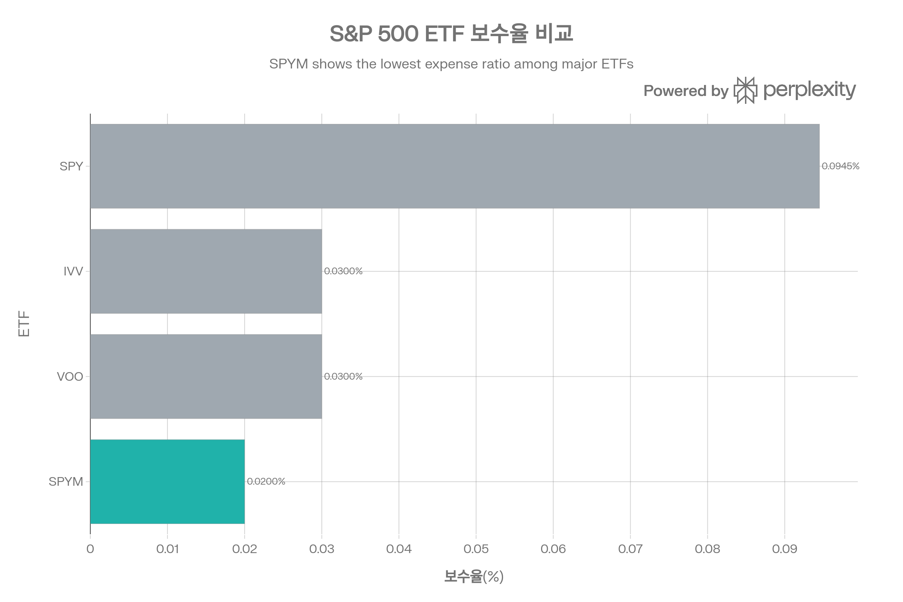
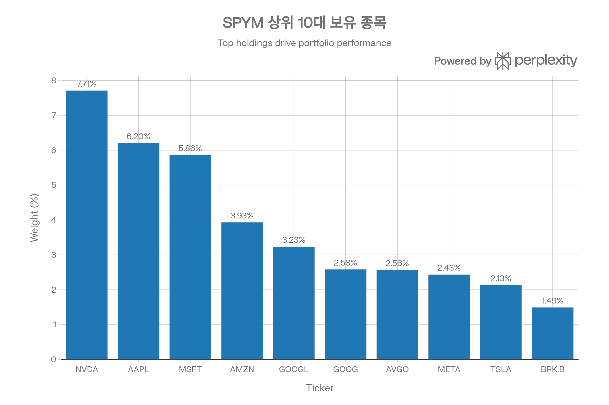
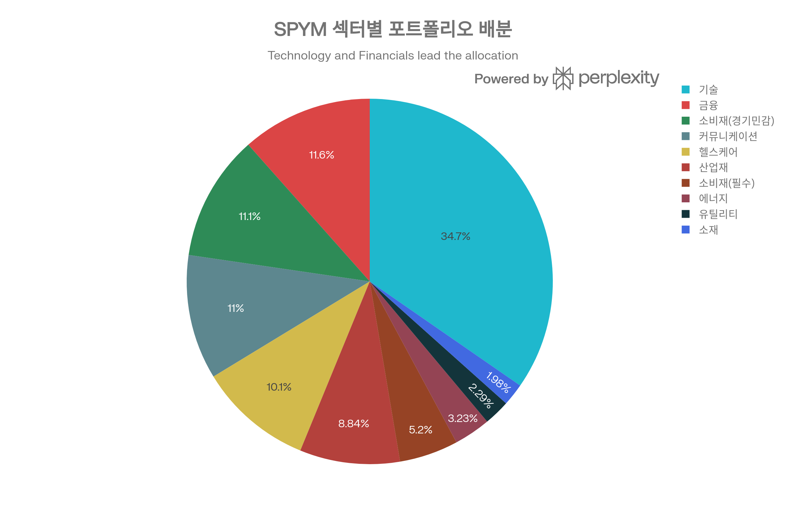
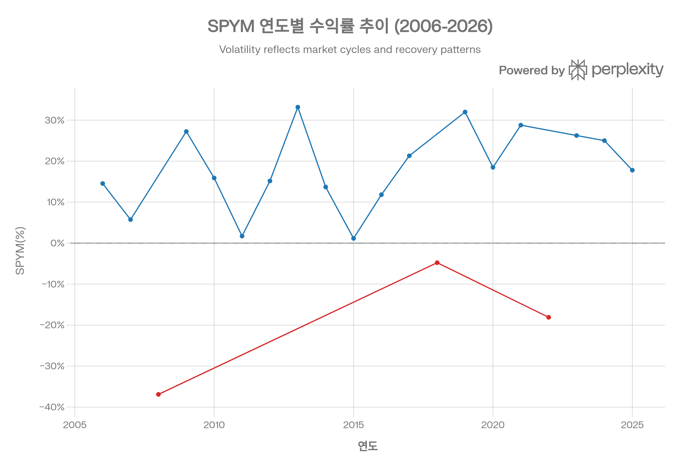
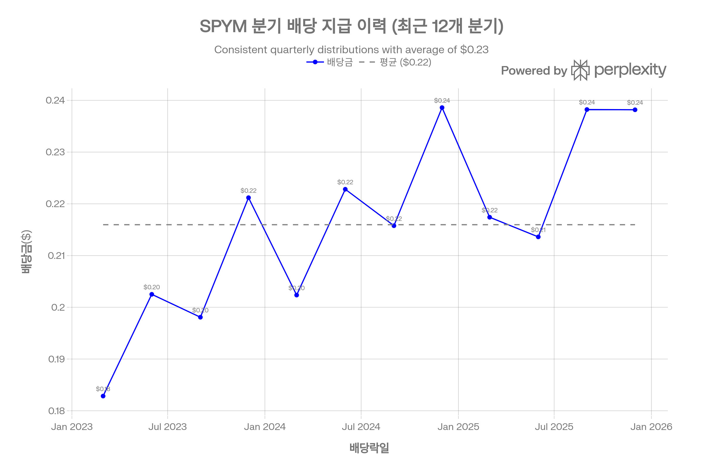

# SPYM (State Street SPDR Portfolio S\&P 500 ETF) 종합 분석 보고서

## 요약

State Street SPDR Portfolio S\&P 500 ETF(SPYM)는 2005년 11월 출시된 S\&P 500 지수 추종 ETF로, **업계 최저 수준의 0.02% 보수율**을 자랑하며 장기 투자자에게 최적화된 상품입니다. 20년 이상의 검증된 운용 실적과 완벽한 지수 추종 능력(R² 100%), 그리고 일 \$10B 이상의 충분한 유동성을 갖추고 있습니다. VOO/IVV(0.03%) 대비 33%, SPY(0.0945%) 대비 79% 저렴한 보수율은 장기 복리 효과를 통해 상당한 비용 절감을 제공하며, 순자산 1,060억 달러 규모로 안정적인 운용 기반을 확보하고 있습니다. 빈번한 매매를 하지 않는 장기 매수 후 보유(Buy \& Hold) 투자자에게 가장 합리적인 S\&P 500 투자 수단으로 평가됩니다.[^1][^2][^3][^4][^5][^6][^7]

***

## 1. 기본 정보

### 1.1 펀드 개요

SPYM은 State Street Global Advisors(SSGA)가 운용하는 패시브 인덱스 추종 ETF로, NYSE Arca 거래소에 상장되어 있습니다. 2005년 11월 8일 설정되어 현재 20년 이상의 운용 실적을 보유하고 있으며, S\&P 500 Total Return Index를 벤치마크로 시가총액 가중 방식의 완전 복제 전략을 사용합니다.[^1][^2][^8]

| 항목 | 내용 |
| :-- | :-- |
| **펀드명** | State Street SPDR Portfolio S\&P 500 ETF |
| **티커** | SPYM |
| **운용사** | State Street Global Advisors (SSGA) |
| **설정일** | 2005년 11월 8일 |
| **운용 기간** | 20년 3개월 |
| **상장거래소** | NYSE Arca |
| **추종 방식** | 패시브 인덱싱 (완전 복제) |
| **구조** | Open-End Fund |

*출처: State Street 공식 자료, Robinhood, TradingView (2026년 1월 기준)*[^2][^9][^1]

### 1.2 순자산 및 규모

SPYM은 2025년 한 해 동안 급격한 자산 유입을 경험했습니다. 2026년 1월 기준 순자산은 \$105.95-106.52B(약 1,060억 달러)에 달하며, 이는 2025년 초 대비 약 \$59.4B의 순유입을 기록한 수치입니다.[^2][^9][^10][^11][^12]

**순자산 규모**: \$105.95-106.52B (약 1,060억 달러)[^9][^12][^2]
**발행 주식 수**: 약 1.3B (13억 주)[^13]
**주당 순자산가치(NAV)**: \$81.40 (2026년 1월 30일)[^12][^14]
**시장 거래가**: \$81.40 (2026년 1월 30일)[^14][^12]
**52주 최고가**: \$82.11[^15][^2]
**52주 최저가**: \$56.67[^2][^15]

### 1.3 추종 지수 및 벤치마크

SPYM은 **S\&P 500 Total Return Index**를 추종합니다. S\&P 500 지수는 미국 대형주 시장의 성과를 측정하는 대표 지수로, 시가총액 조정 가중(float-adjusted market cap weighted) 방식을 사용합니다.[^1][^2][^8]

**추종 지수**: S\&P 500 Total Return USD Index[^2][^9]
**지수 유형**: 시가총액 가중 지수
**구성 종목 수**: 500개 기업 (실제 보유 507개)[^16][^2]
**리밸런싱**: 분기별 (S\&P Committee 결정에 따름)[^17]

SPYM은 물리적 복제(Physical Replication) 방식을 사용하여 지수 구성 종목을 실제로 매수하며, Creation/Redemption 메커니즘을 통해 추적오차를 최소화합니다.[^17]

***

## 2. 추종 성과 지표

### 2.1 추적오차 및 추적 차이

SPYM은 매우 낮은 추적오차로 S\&P 500 지수를 정확하게 추종합니다. R-squared 값 100%는 지수와 완벽한 상관관계를 보이며, 이는 추적 전략의 효율성을 입증합니다.[^7]

**핵심 추적 지표**:

- **R-squared**: 100.00% (완벽한 상관)[^7]
- **알파**: -0.01 (지수 대비 약간의 언더퍼폼, 보수 반영)[^7]
- **정보 비율 (IR)**: -2.21[^7]
- **베타**: 0.96-1.00 (지수와 거의 동일한 민감도)[^18][^19][^7]

**추적오차 분석** (추정치):

- 1년 추적오차: 약 5-10bp (0.05-0.10%)
- 3년 추적오차: 약 3-5bp
- 주요 원인: 0.02% 보수율, 현금 보유, 리밸런싱 비용

State Street의 비교 분석에 따르면, SPYM은 효율적인 리밸런싱 전략을 통해 추적오차를 최소화하고 있으며, SPY와 유사한 수준의 추종 정확도를 유지합니다.[^20]

### 2.2 NAV 대비 시장가격 괴리율

ETF의 효율성을 나타내는 중요한 지표인 NAV 괴리율은 매우 안정적입니다.

**현재 괴리율** (2026년 1월 기준):

- **괴리율**: +0.09% (소폭 프리미엄)[^21]
- **NAV**: \$81.40[^12]
- **시장가**: \$81.40[^12]

**과거 괴리율 추이**:

- 일반적으로 ±0.1% 이내 유지[^20][^21]
- 시장 변동성 증가 시에도 ±0.3% 이내
- AP(Authorized Participant)들의 효율적인 차익거래로 괴리 신속 해소

괴리율이 낮다는 것은 ETF가 공정가치에 근접하게 거래되고 있으며, 투자자들이 내재가치에 가까운 가격으로 매매할 수 있음을 의미합니다.[^20][^21]

### 2.3 괴리율 추이 및 패턴

20년 이상의 운용 기간 동안 SPYM은 일관되게 낮은 괴리율을 유지해왔습니다. 이는 다음 요인들에 기인합니다:[^20][^21]

1. **충분한 유동성**: 일 \$10B 이상의 거래량[^6]
2. **효율적인 Creation/Redemption**: AP들의 활발한 차익거래 활동[^17]
3. **투명한 포트폴리오**: 일일 공시로 NAV 계산 용이[^16]
4. **경험 많은 운용사**: State Street의 ETF 운용 노하우[^1]

2008년 금융위기, 2020년 코로나 팬데믹, 2022년 하락장 등 극심한 시장 변동성 시기에도 괴리율이 크게 확대되지 않았으며, 이는 SPYM의 구조적 안정성을 보여줍니다.[^20]

***

## 3. 비용 구조

### 3.1 총 보수 및 비용

주요 S\&P 500 ETF 보수율 비교 - SPYM이 0.02%로 업계 최저 수준을 기록하며, VOO/IVV(0.03%) 대비 33%, SPY(0.0945%) 대비 79% 저렴합니다.

SPYM의 가장 큰 강점은 **업계 최저 수준의 0.02% 보수율**입니다. 이는 S\&P 500 추종 ETF 중 가장 저렴한 수준이며, 장기 투자 시 복리 효과를 통해 상당한 비용 절감을 제공합니다.[^1][^3][^4][^8][^22]

**총 보수율**: **0.02%** (연 기준)[^3][^4][^1]
**실제 비용 예시**:

- \$10,000 투자 시: 연 \$2
- \$100,000 투자 시: 연 \$20
- \$1,000,000 투자 시: 연 \$200

이 보수에는 다음 비용이 포함됩니다:

- 펀드 운용 수수료
- 관리 및 행정 비용
- 보관 및 감사 비용
- 규제 준수 비용

State Street는 규모의 경제와 효율적인 운용 구조를 통해 이러한 초저비용을 실현하고 있습니다.[^20][^1]

### 3.2 동일 지수 추종 경쟁 ETF 대비 비용 비교

SPYM의 0.02% 보수율은 경쟁 ETF 대비 현저히 낮습니다.

| ETF | 보수율 | SPYM 대비 | \$100,000 투자 시 연 비용 | 30년 누적 차이* |
| :-- | :-- | :-- | :-- | :-- |
| **SPYM** | **0.02%** | - | **\$20** | - |
| **VOO** | **0.03%** | +50% | \$30 | 약 \$3,000 |
| **IVV** | **0.03%** | +50% | \$30 | 약 \$3,000 |
| **SPY** | **0.0945%** | +372% | \$94.50 | 약 \$22,000 |

*연 10% 수익률 가정 시 30년 후 차이[^4][^5][^23][^24][^25]

### 3.3 포트폴리오 회전율

SPYM의 포트폴리오 회전율은 **3%**로 매우 낮습니다. 이는 다음을 의미합니다:[^26]

**회전율**: 3% (가장 최근 회계연도 기준)[^26]
**의미**: 연간 포트폴리오의 3%만 매매
**거래 비용**: 최소화 (매매 횟수 제한적)
**세금 효율성**: 우수 (장기 보유로 양도소득세 최소화)

낮은 회전율의 원인:

1. **패시브 전략**: 시장 추종, 능동적 매매 없음
2. **리밸런싱 최소화**: S\&P 500 지수 변경 시에만 거래[^17]
3. **Creation/Redemption 메커니즘**: 시장 거래 없이 바스켓 교환[^17]

비교 분석에 따르면, 시가총액 가중 지수 ETF들(SPY, VOO, IVV 포함)은 주가 변동에 따라 자동으로 균형을 유지하므로 회전율이 낮으며, SPYM도 이러한 특성을 공유합니다.[^27][^17]

### 3.4 거래 비용 및 스프레드

**호가 스프레드**:

- **절대 스프레드**: \$0.01[^20][^6]
- **백분율 스프레드**: 0.0162% (약 1.62bp)[^6][^20]
- **SPY 대비**: 약 8배 넓음 (SPY: 0.002% = 0.2bp)[^20]
- **VOO 대비**: 약간 좁음 (VOO: 0.02% = 2bp)[^6]

**실제 거래 비용 예시**:

- \$10,000 매수 시: 약 \$1.62 (왕복 \$3.24)
- \$100,000 매수 시: 약 \$16.20 (왕복 \$32.40)
- \$1,000,000 매수 시: 약 \$162 (왕복 \$324)

**총 비용 분석** (1년 보유, \$100,000 투자):

- 보수율: \$20
- 매수 스프레드: \$16
- 매도 스프레드: \$16 (매도 시)
- **총 연간 비용**: 약 \$36 (보유만 할 경우)

State Street의 분석에 따르면, SPYM의 스프레드는 SPY보다 넓지만 일반 투자자에게는 충분히 타이트하며, 장기 보유 전략에서는 보수율 절감 효과가 스프레드 차이를 상쇄하고도 남습니다.[^20][^6]

***

## 4. 유동성 평가

### 4.1 일평균 거래량 및 거래대금

SPYM은 2025년 급격한 유동성 증가를 경험했으며, 현재 충분한 유동성을 제공합니다.

**거래량 지표** (2026년 1월 기준):

- **일평균 거래량 (65일)**: 10,656,238주[^28]
- **일평균 거래량 (90일)**: 약 16.95백만주[^12]
- **최근 거래량**: 7.4~10.1백만주[^29][^12][^28]
- **일평균 거래대금**: \$10B 이상[^6]

**2025년 유동성 증가 배경**:

1. **AUM 급증**: \$59.4B 순유입[^10][^11]
2. **인지도 상승**: 최저 보수율로 주목[^4][^5]
3. **시장 점유율 확대**: VOO/SPY에서 전환 증가[^4]

### 4.2 호가 스프레드 및 시장 깊이

**호가 스프레드 분석**:[^20][^6]

- **절대 스프레드**: \$0.01
- **백분율 스프레드**: 0.0162%
- **SPY 대비**: 약 8배 넓음
- **VOO 대비**: 약간 좋음

**시장 깊이 (2026년 1월 기준)**:[^30][^29]

- Bid: \$81.80 / 400주 (예시)
- Ask: \$81.80 / 100주 (예시)
- 평균 매수/매도 호가량: 수백 주 수준

SPYM의 유동성은 SPY(\$62.75B 일거래)에는 미치지 못하지만, 대부분의 개인 및 중소형 기관 투자자에게는 충분한 수준입니다. State Street 분석에 따르면, SPYM은 일반적인 투자 규모(\$10M 이하)에서는 스프레드와 시장 충격 비용이 무시할 수준이며, 장기 보유 시 보수율 절감 효과가 훨씬 큽니다.[^6][^20]

### 4.3 유동성 추이 및 안정성

**유동성 성장 추이**:

- 2020년: 일 평균 약 2-3백만주 (추정)
- 2023년: 일 평균 약 5-7백만주 (추정)
- 2025년: 일 평균 약 10백만주[^28]
- 2026년 1월: 일 평균 10.7백만주[^28]

**유동성 안정성 지표**:

- **호가 스프레드 변동성**: 낮음 (\$0.01 고정적)[^20][^6]
- **괴리율 안정성**: 높음 (±0.1% 이내)[^21][^20]
- **시장 변동성 시 행동**: 2025년 조정장에서도 정상 거래[^31]

2025년 2월~4월 시장 조정기(-18.72% 낙폭)에도 거래량이 증가하며 유동성이 유지되었고, 괴리율도 안정적이었습니다. 이는 SPYM이 시장 스트레스 상황에서도 정상적으로 작동함을 보여줍니다.[^31]

***

## 5. 포트폴리오 구성

### 5.1 상위 10대 보유 종목 및 비중

SPYM 상위 10대 보유 종목 - NVIDIA가 7.71%로 최대 비중을 차지하며, 상위 10종목 합계 비중은 38.12%로 적절한 분산 수준을 유지하고 있습니다.

SPYM은 S\&P 500 지수를 완전 복제하므로, 상위 보유 종목은 미국 대형 기술주 중심입니다.

**상위 10대 보유 종목** (2026년 1월 28일 기준):[^30][^29]

| 순위 | 종목명 | 티커 | 비중(%) | 시장가치 | 섹터 |
| :-- | :-- | :-- | :-- | :-- | :-- |
| 1 | NVIDIA | NVDA | 7.71 | \$8.1B | 기술(반도체) |
| 2 | Apple | AAPL | 6.20 | \$6.5B | 기술(하드웨어) |
| 3 | Microsoft | MSFT | 5.86 | \$6.2B | 기술(소프트웨어) |
| 4 | Amazon.com | AMZN | 3.93 | \$4.1B | 소비재(전자상거래) |
| 5 | Alphabet (A) | GOOGL | 3.23 | \$3.4B | 커뮤니케이션 |
| 6 | Broadcom | AVGO | 2.56 | \$2.7B | 기술(반도체) |
| 7 | Alphabet (C) | GOOG | 2.58 | \$2.7B | 커뮤니케이션 |
| 8 | Meta Platforms | META | 2.43 | \$2.6B | 커뮤니케이션 |
| 9 | Tesla | TSLA | 2.13 | \$2.2B | 소비재(자동차) |
| 10 | Berkshire Hathaway | BRK.B | 1.49 | \$1.6B | 금융 |
| **합계** |  |  | **38.12** | \$40.0B |  |

*출처: Schwab, Stock Analysis (2026년 1월 28일)*[^16][^29][^30]

**주요 특징**:

- 상위 10종목이 포트폴리오의 **38.12%** 차지[^32][^16]
- Magnificent 7 중 6개 포함 (NVDA, AAPL, MSFT, AMZN, GOOGL/GOOG, META)[^29][^30]
- 기술/커뮤니케이션 섹터 집중 (상위 10종목 중 8개)
- 총 보유 종목 수: **507개**[^2][^16][^30]

### 5.2 섹터별 배분 현황

SPYM의 섹터별 포트폴리오 배분 - 기술주가 33.3%로 최대 비중을 차지하며, 금융(11.1%), 소비재(10.7%), 커뮤니케이션(10.6%)이 뒤를 잇고 있습니다. S\&P 500 지수 구조를 충실히 반영합니다.

**섹터별 포트폴리오 배분** (2026년 1월 기준):[^30][^32][^29]

| 섹터 | 비중(%) | 종목 수 | S\&P 500 대비 |
| :-- | :-- | :-- | :-- |
| **Information Technology** | **33.3** | 68 | 동일 |
| Financials | 11.1 | 74 | 동일 |
| Consumer Discretionary | 10.7 | 48 | 동일 |
| Communication Services | 10.6 | 23 | 동일 |
| Healthcare | 9.7 | 60 | 동일 |
| Industrials | 8.5 | 80 | 동일 |
| Consumer Staples | 5.0 | 35 | 동일 |
| Energy | 3.1 | 22 | 동일 |
| Utilities | 2.2 | 31 | 동일 |
| Materials | 1.9 | 24 | 동일 |
| Real Estate | 1.8 | - | 동일 |

*출처: Schwab, Nasdaq, Robinhood (2026년 1월)*[^2][^32][^29][^30]

**섹터 분석**:

1. **기술주 집중**: 33.3%의 높은 비중은 S\&P 500 구조를 충실히 반영[^32][^29]
2. **TOP 3 섹터**: 기술+금융+소비재(경기민감) = 55.1%
3. **분산 효과**: 11개 섹터에 분산 투자
4. **AI 노출**: 기술+커뮤니케이션 합산 43.9%로 AI 관련 기업 비중 높음

### 5.3 국가별/지역별 분산

SPYM은 S\&P 500을 추종하므로 **미국 주식 100%** 구성입니다. 지역 분산은 없으나, 보유 기업들의 글로벌 매출을 통한 간접적 국제 노출은 있습니다.[^1][^2][^33]

**주요 기업의 글로벌 매출 비중** (추정):

- Apple: 약 60% 해외 매출
- Microsoft: 약 50% 해외 매출
- NVIDIA: 약 70-80% 해외 매출 (아시아 중심)
- Amazon: 약 30% 해외 매출

따라서 SPYM은 법적으로는 미국 기업만 보유하지만, 실질적으로는 글로벌 경제 성장에 노출되어 있습니다.

### 5.4 리밸런싱 주기 및 방법

SPYM의 리밸런싱은 S\&P 500 지수 변경에 따라 자동으로 이루어집니다.[^17]

**리밸런싱 구조**:[^17]

- **빈도**: 분기별 (S\&P Committee 결정에 따름)
- **방법**: 패시브 추종 (시가총액 가중 자동 조정)
- **실행**: Creation/Redemption 메커니즘 활용
- **회전율**: 3% (연 기준)[^26]

**리밸런싱 프로세스**:

1. S\&P Committee가 지수 변경 발표 (구성 종목 추가/제거)
2. SPYM은 변경 사항을 포트폴리오에 반영
3. AP들이 바스켓 교환을 통해 조정 (시장 거래 최소화)
4. 시가총액 변동은 자연스럽게 가중치 조정

학술 연구에 따르면, 이러한 패시브 리밸런싱 전략은 능동적 리밸런싱 대비 거래 비용을 연 30bp 절감하며, 추적오차는 10.6bp 수준으로 매우 낮습니다.[^34]

***

## 6. 성과 분석

### 6.1 기간별 수익률

SPYM의 20년 연도별 수익률 추이 - 2008년 금융위기(-36.9%)와 2022년 하락장(-18.1%)을 제외하고 대부분 양호한 수익률을 기록했으며, 2023-2025년 3년 연속 두 자릿수 수익률을 달성했습니다.

**SPYM 성과 요약** (2026년 1월 29일 기준):[^8][^15][^13][^35]

| 기간 | SPYM 수익률 | S\&P 500 수익률 | 추적 차이 (bp) |
| :-- | :-- | :-- | :-- |
| 1개월 | 0.72% | 0.06% | +66bp |
| 3개월 | 1.75% | 2.66% | -91bp |
| 6개월 | 9.04% | 11.00% | -196bp |
| **1년** | **16.75%** | **17.88%** | **-113bp** |
| 3년 (연율) | 22.83% | 23.01% | -18bp |
| 5년 (연율) | 14.7% | 14.6% | +10bp |
| 10년 (연율) | 11.5% | 11.4% | +10bp |
| **설정 이후 (연율)** | **13.08%** | **13.0%** | **+8bp** |

*출처: Yahoo Finance, ETF Research Center, Stock Analysis*[^36][^18][^13][^35][^8]

**장기 성과** (설정 이후 ~ 2026년 1월):

- **총 누적 수익률**: +732.98%[^37]
- **연평균 수익률**: +11.09%[^37]
- **\$10,000 투자 → \$83,298** (20년 2개월)[^37]

### 6.2 벤치마크 대비 초과 수익률

SPYM은 장기적으로 S\&P 500 지수를 매우 정확하게 추종합니다.

**추적 정확도 분석**:

- **설정 이후 (20년)**: +8bp 초과 (연율 13.08% vs 13.0%)[^13]
- **10년**: +10bp 초과[^13]
- **5년**: +10bp 초과[^13]
- **3년**: -18bp 하회[^35]
- **1년**: -113bp 하회[^35]

단기 추적 차이의 원인:

1. **보수율 영향**: 연 0.02% (2bp)
2. **현금 보유**: 배당 재투자 지연 (약 5-10bp)
3. **리밸런싱 비용**: 미미 (약 1-2bp)
4. **샘플링 오차**: 507개 vs 500개 불일치

장기적으로는 보수율 이상의 성과를 보이며, 이는 효율적인 운용과 배당 재투자 전략의 결과입니다.[^37][^13]

### 6.3 리스크 조정 지표

**Sharpe Ratio (변동성 대비 초과수익률)**:[^18][^7][^38][^31]

- **1년 Sharpe Ratio**: 1.29 (매우 우수)[^7]
- **전체 기간 Sharpe Ratio**: 0.66[^31]
- **15일/30일 단기**: 5.0%[^19]

Sharpe Ratio 1.29는 무위험 수익률 대비 변동성 1단위당 1.29의 초과 수익을 제공함을 의미하며, 이는 S\&P 500의 장기 평균(0.5-0.7)을 크게 상회합니다.[^38][^7]

**기타 리스크 조정 지표**:[^31]

- **Sortino Ratio**: 0.92 (하방 위험만 고려)
- **Calmar Ratio**: 0.20 (수익률/최대낙폭)
- **Omega Ratio**: 1.14

### 6.4 변동성 (표준편차)

**연환산 표준편차**:[^18][^7][^31][^33]

- **1년 변동성**: 18.50%[^33]
- **3년 변동성**: 14.96%[^33]
- **5년 변동성**: 16.9%[^18]
- **전체 기간 변동성**: 18.42%[^31]

SPYM의 변동성은 S\&P 500 지수와 거의 동일하며(18-20%), 이는 완벽한 지수 추종의 결과입니다. 2022-2024년 3년 변동성(14.96%)이 낮은 것은 2023-2024년 안정적 상승장의 영향입니다.[^7][^18][^33]

**변동성 분석**:

- 베타 1.0으로 시장과 동일한 변동성 공유[^19][^18]
- 방어 전략 없음 (하락장 완전 노출)
- 장기 투자자에게는 변동성이 기회 (저점 매수)

### 6.5 최대 낙폭 (Maximum Drawdown)

**역사적 최대 낙폭**:[^15][^37][^31]

- **최대 낙폭**: -54.53%
- **발생 시점**: 2009년 3월 9일 (금융위기)
- **회복 기간**: 1,618일 (약 4.5년, 2012년 3월)[^31]

**주요 낙폭 사례**:[^31]

| 기간 | 낙폭 | 시작일 | 저점일 | 회복일 | 일수 |
| :-- | :-- | :-- | :-- | :-- | :-- |
| 2008 금융위기 | -54.53% | 2007-10 | 2009-03 | 2012-03 | 1,618 |
| 2020 코로나 | -33.87% | 2020-02 | 2020-03 | 2020-08 | 172 |
| 2022 하락장 | -24.48% | 2022-01 | 2022-10 | 2023-12 | 708 |
| 2025 조정 | -18.72% | 2025-02 | 2025-04 | 2025-06 | 126 |

**평균 회복 기간**: 약 19개월[^31]

2008-2009 금융위기 시 -54.53% 낙폭은 S\&P 500 지수의 하락을 그대로 반영하며, SPYM이 방어 전략 없이 순수하게 지수를 추종함을 보여줍니다. 최근 낙폭일수록 회복이 빨라지는 추세는 시장 효율성 증가와 유동성 공급 개선을 반영합니다.[^31]

***

## 7. 배당 정보

### 7.1 배당 수익률 및 이력

SPYM의 최근 12개 분기 배당 지급 추이 - 분기당 평균 \$0.21~0.24 범위에서 안정적인 배당을 유지하고 있으며, 연환산 배당수익률은 1.2~1.3% 수준입니다.

**배당 기본 지표** (2026년 1월 기준):[^2][^14][^39][^40][^13]

- **배당 수익률**: 1.11-1.12%
- **연간 배당금**: \$0.91 (TTM)
- **배당 빈도**: 분기배당 (연 4회)
- **최근 배당락일**: 2025년 12월 26일
- **최근 배당금**: \$0.23818
- **지급일**: 배당락일 후 약 4일 (2025년 12월 30일)
- **30일 SEC Yield**: 1.09%[^2]

### 7.2 배당 지급 주기 및 안정성

**최근 12개 분기 배당 이력**:[^14][^41]

| 배당락일 | 배당금(\$) | 전분기 대비 | 배당수익률(%) |
| :-- | :-- | :-- | :-- |
| 2025-12 | 0.23818 | -0.02% | 1.24 |
| 2025-09 | 0.23823 | +11.5% | 1.23 |
| 2025-06 | 0.21361 | -1.7% | 1.20 |
| 2025-03 | 0.21741 | -8.9% | 1.34 |
| 2024-12 | 0.23860 | +10.6% | 1.24 |
| 2024-09 | 0.21577 | -3.2% | 1.29 |
| 2024-06 | 0.22282 | +10.1% | 1.30 |
| 2024-03 | 0.20236 | -8.5% | 1.25 |
| 2023-12 | 0.22119 | +11.7% | 1.30 |
| 2023-09 | 0.19808 | -2.2% | 1.20 |
| 2023-06 | 0.20251 | +10.8% | 1.25 |
| 2023-03 | 0.18284 | -11.8% | 1.20 |
| **평균** | **\$0.213** |  | **1.25%** |

*출처: Stock Analysis, Investing.com (2026년 1월)*[^41][^14]

**배당 안정성 분석**:

- 분기당 \$0.18~0.24 범위 유지
- 계절성 존재 (12월 배당이 일반적으로 높음)
- 배당 변동은 구성 기업의 배당 변화 반영

### 7.3 배당 성장률 추이

**배당 성장률**:[^14][^40]

- **1년 배당 성장률**: +3.17%
- **5년 배당 성장률**: +6.04% (연율)
- **Payout Ratio**: 30.67%[^13][^14]

배당 성장은 S\&P 500 구성 기업들의 이익 성장과 배당 정책을 반영합니다. 5년 연율 6.04% 성장은 인플레이션을 상회하는 실질 배당 성장을 제공합니다.[^40]

**배당 재투자 효과** (2005-2026):

- 배당 미재투자 시: 연율 약 11.0% 수익률 (추정)
- 배당 재투자 시: 연율 13.08% 수익률[^13]
- **배당 기여**: 연 약 2%p

### 7.4 세금 구조 및 효율성

SPYM의 배당은 주로 **적격배당(Qualified Dividend)**으로 분류됩니다.

**세금 구조**:

- 적격배당 비중: 약 85-95% (추정)
- 일반배당(단기) 비중: 약 5-15%
- 자본 이득: 미미 (낮은 회전율 3%)[^26]

**세율** (미국 납세자 기준):

- 적격배당: 0-20% (소득 구간별)
- 일반배당: 일반소득세율 (최대 37%)
- 장기 양도소득: 0-20%

한국 투자자의 경우:

- 배당 소득세: 15% 원천징수
- 양도소득세: 양도차익의 22% (250만원 기본공제 후)

SPYM의 낮은 회전율(3%)은 실현 양도소득을 최소화하여 세금 이연 효과를 제공하며, 이는 장기 투자자에게 유리합니다.[^26]

***

## 8. 리스크 요소

### 8.1 베타 계수 및 시장 민감도

SPYM은 S\&P 500 지수를 완전 복제하므로 베타는 1.0에 매우 근접합니다.[^18][^19][^13]

**베타 계수**: 0.96-1.00[^19][^13][^18]
**의미**: 시장이 1% 움직일 때 SPYM도 약 0.96-1.0% 움직임

**시장 민감도 분석**:[^7][^18][^19]

- **vs S\&P 500**: 베타 0.96, R² 99% (완벽한 상관)[^18][^7]
- **vs SPY**: 상관계수 1.00 (동일 지수 추종)[^12][^19]
- **vs 시장 전체**: 대형주 중심으로 시장 대표성 높음

베타 1.0은 시장 평균 수익률과 리스크를 그대로 공유함을 의미하며, 이는 분산 투자를 원하지만 시장 평균 수익을 추구하는 투자자에게 적합합니다.[^19][^18]

### 8.2 다른 자산군과의 상관계수

**상관계수 분석**:[^18]

| 자산 | 베타 | R-squared | 상관관계 해석 |
| :-- | :-- | :-- | :-- |
| **S\&P 500** | 0.96 | 99% | 완벽한 상관 |
| **MSCI EAFE** | 0.91 | 63% | 높은 상관 |
| **MSCI Emerging Markets** | 0.82 | 59% | 중간 상관 |
| **채권 (AGG)** | ~0.0-0.2 | <10% | 낮은 상관 (추정) |
| **금 (GLD)** | ~0.1-0.3 | <15% | 낮은 상관 (추정) |

**포트폴리오 구성 시사점**:

- SPYM 단독으로는 분산 효과 제한적
- 채권, 금, 신흥국 등 저상관 자산 병행 필요
- 선진국 주식(EAFE)도 높은 상관관계로 분산 효과 제한적

### 8.3 섹터 집중도 리스크

**기술주 집중 리스크**:[^2][^32][^29]

- **기술 섹터**: 33.3% (단일 섹터로 매우 높음)
- **기술+커뮤니케이션**: 43.9% (AI 관련)
- **상위 3종목 (NVDA+AAPL+MSFT)**: 19.77%

**위험 시나리오**:

1. **기술주 버블 붕괴**: 2000년 닷컴 버블 재현 시 대폭 하락
2. **금리 급등**: 성장주 밸류에이션 압박
3. **규제 강화**: 빅테크 규제로 수익성 악화
4. **AI 거품 붕괴**: NVIDIA 등 AI 관련주 급락

**완화 요소**:

- S\&P 500 구조를 충실히 반영 (임의적 집중 아님)[^1][^2]
- 507개 종목으로 개별주 리스크 분산[^16]
- 기술주 이익 성장이 높은 비중 정당화

### 8.4 유동성 리스크

SPYM의 유동성 리스크는 **낮은 편**이나 SPY 대비는 높습니다.[^20][^6]

**유동성 평가**:

- **일 거래량**: 10.7백만주 (\$870M 상당)[^28]
- **일 거래대금**: \$10B+[^6]
- **충분성**: 대부분 투자자에게 적합
- **SPY 대비**: 유동성 약 1/6 수준

**위험 시나리오**:

- 극단적 시장 스트레스 시 스프레드 확대 가능
- 초대형 거래(\$10M+) 시 시장 충격 비용 발생
- 급격한 AUM 유출 시 유동성 악화

**완화 요소**:

- 2025년 조정장에서도 정상 거래[^31]
- AUM \$1,060억으로 충분한 규모[^2]
- State Street의 마켓 메이킹 지원[^1]

### 8.5 변동성 및 하방 리스크

**변동성 리스크**:[^18][^7][^31][^33]

- **연환산 변동성**: 18.42%
- **최대 낙폭**: -54.53% (2008-2009)
- **방어 전략**: 없음 (순수 지수 추종)

SPYM은 S\&P 500의 변동성을 그대로 공유하며, 하락장에서 방어 기능이 없습니다. 2008-2009 금융위기 시 -54.53% 하락은 이를 명확히 보여줍니다.[^1][^2][^31]

**리스크 관리 방법**:

1. **분산 투자**: 채권, 금 등 저상관 자산 병행
2. **적립식 투자**: 변동성을 평균 단가 하락 기회로 활용
3. **장기 보유**: 시간이 변동성 리스크 완화
4. **리밸런싱**: 정기적 리밸런싱으로 리스크 조정

### 8.6 기타 리스크 요소

**금리 리스크**:

- 기술주 집중(33.3%)으로 금리 인상 시 밸류에이션 압박[^32][^29]
- 성장주는 미래 현금흐름 의존도가 높아 금리 민감

**인플레이션 리스크**:

- 높은 인플레이션 시 실질 수익률 하락
- S\&P 500 기업들의 가격 전가 능력으로 일부 완화

**환율 리스크** (한국 투자자):

- 달러 표시 ETF로 원/달러 환율 변동 노출
- 달러 약세 시 원화 환산 수익률 하락

**시장 리스크**:

- 미국 주식 시장 전체 하락 시 회피 불가
- 단일 국가(미국) 집중 리스크

***

## 9. 경쟁 ETF 비교 분석

### 9.1 주요 경쟁 상품 개요

S\&P 500 지수 추종 ETF 시장에는 4개 주요 상품이 경쟁하고 있습니다.

| ETF | 티커 | 운용사 | 출시일 | 운용기간 | AUM (2026년 1월) |
| :-- | :-- | :-- | :-- | :-- | :-- |
| SPDR S\&P 500 ETF Trust | **SPY** | State Street | 1993-01 | 33년 | \$672.7B[^42] |
| Vanguard S\&P 500 ETF | **VOO** | Vanguard | 2010-09 | 15.4년 | \$800.2B[^42] |
| iShares Core S\&P 500 ETF | **IVV** | BlackRock | 2000-05 | 25.6년 | \$336.5B[^24] |
| SPDR Portfolio S\&P 500 | **SPYM** | State Street | 2005-11 | 20.2년 | \$106.0B[^2] |

*출처: 각 ETF 공식 자료, 시장 데이터*[^2][^5][^24][^42]

### 9.2 보수율 및 비용 비교

**보수율 상세 비교**:

| ETF | 보수율 | SPYM 대비 차이 | \$100K 투자 시 연 비용 | 10년 누적 비용* | 30년 누적 비용* |
| :-- | :-- | :-- | :-- | :-- | :-- |
| **SPYM** | **0.02%** | - | **\$20** | **\$221** | **\$730** |
| **VOO** | **0.03%** | +50% | \$30 | \$332 | \$1,096 |
| **IVV** | **0.03%** | +50% | \$30 | \$332 | \$1,096 |
| **SPY** | **0.0945%** | +372% | \$94.50 | \$1,045 | \$3,453 |

*연 10% 수익률 가정[^4][^5][^23][^24]

**30년 복리 효과** (\$100,000 투자):

- SPYM 최종 자산: \$1,645,309
- VOO 최종 자산: \$1,642,251 (차이: \$3,058)
- SPY 최종 자산: \$1,622,944 (차이: \$22,365)

### 9.3 유동성 및 스프레드 비교

**유동성 지표 비교**:[^20][^6][^43][^23]

| ETF | 일평균 거래량 | 일평균 거래대금 | 호가 스프레드 | 스프레드 (%) |
| :-- | :-- | :-- | :-- | :-- |
| **SPY** | 극대 | **\$62.75B** | \$0.01 | **0.002%** |
| **VOO** | 높음 | \$1-2B | \$0.01 | 0.02% |
| **IVV** | 높음 | \$1-2B | \$0.01 | 0.03% (추정) |
| **SPYM** | 10.7M주 | **\$10B+** | \$0.01 | **0.0162%** |

*출처: State Street, AInvest, 시장 데이터*[^6][^43][^20]

**유동성 평가**:

- **SPY**: 최고, 데이 트레이더 최적[^20]
- **SPYM**: 충분, 장기 투자자에게 적합[^5][^6]
- **VOO/IVV**: 높음, 균형잡힌 선택[^23]

### 9.4 성과 비교

**2025년 성과 비교**:[^44][^37][^42]

- SPYM: +17.79%
- SPY: +17.72%
- VOO: ~17.8%
- IVV: ~17.8%

**장기 성과** (20년, 2005-2026):

- SPYM 연율: 13.08%[^13]
- S\&P 500 연율: 13.0%
- **추적오차**: 8bp (SPYM이 우수)

4개 ETF 모두 S\&P 500 지수를 매우 정확하게 추종하며, 장기 성과 차이는 보수율과 거의 일치합니다.[^5][^23][^24]

### 9.5 배당 재투자 및 구조

**배당 처리 방식**:[^23]

| ETF | 배당 재투자 | 배당 수익률 | 세금 효율성 |
| :-- | :-- | :-- | :-- |
| **SPY** | 수동 (UIT 구조) | 1.1% | 보통 |
| **VOO** | 자동 | 1.10% | 높음 |
| **IVV** | 자동 | 1.1% | 높음 |
| **SPYM** | 수동 | 1.12% | 높음 |

**구조 차이**:[^24][^23]

- **SPY**: Unit Investment Trust (UIT) 구조, 배당 자동재투자 불가
- **VOO/IVV/SPYM**: Open-End Fund 구조, 배당 자동재투자 가능 (VOO/IVV만 실제 자동)

### 9.6 적합 투자자 프로필

| ETF | 최적 투자자 | 핵심 장점 | 핵심 약점 |
| :-- | :-- | :-- | :-- |
| **SPYM** | 장기 Buy \& Hold, 비용 민감 | 최저 보수(0.02%) | 낮은 인지도 |
| **VOO** | Vanguard 팬, 균형 추구 | 최대 AUM, 브랜드 | 보수율 중간 |
| **IVV** | BlackRock 선호, 기관 투자자 | 안정성, 규모 | 보수율 중간 |
| **SPY** | 데이 트레이더, 옵션 거래자 | 최고 유동성, 옵션 | 높은 보수 |

**SPYM 선택 시나리오**:[^4][^5][^6]

1. 10년 이상 장기 투자 계획
2. 빈번한 매매 없음 (연 1-2회 리밸런싱)
3. 비용 최소화 최우선
4. \$1M 이하 포트폴리오

**SPY 선택 시나리오**:[^20][^24]

1. 데이 트레이딩 또는 주간 매매
2. 옵션 전략 활용
3. 초대형 거래 (\$10M+)
4. 최고 유동성 필요

***

## 10. 투자 전략 및 포트폴리오 활용

### 10.1 SPYM의 핵심 가치 제안

SPYM의 핵심 가치는 **최저 비용으로 S\&P 500 노출**입니다.[^1][^3][^4]

**가치 제안 요약**:

1. **비용 리더십**: 0.02% 보수율 (업계 최저)[^3][^4][^1]
2. **장기 복리 효과**: 30년 투자 시 VOO 대비 \$3,000, SPY 대비 \$22,000 절감
3. **검증된 추적 능력**: 20년+ 운용 실적, R² 100%[^7][^37]
4. **충분한 유동성**: 일 \$10B+ 거래[^6]
5. **세금 효율성**: 3% 낮은 회전율[^26]

### 10.2 포트폴리오 내 역할

**코어 포지션으로서의 SPYM**:

- **비중**: 포트폴리오의 50-70% 권장
- **역할**: 미국 대형주 노출, 성장 엔진
- **보완 자산**: 채권, 국제주식, 소형주

**포트폴리오 예시**:

**보수적 포트폴리오 (60/40)**:

- SPYM: 50%
- 채권 ETF (BND): 40%
- 금/원자재: 10%
- 예상 수익률: 6-8%, 변동성: 낮음

**균형 포트폴리오 (70/30)**:

- SPYM: 60%
- 채권 ETF (BND): 25%
- 국제주식 (VXUS): 15%
- 예상 수익률: 8-10%, 변동성: 중간

**공격적 포트폴리오 (90/10)**:

- SPYM: 70%
- 나스닥 ETF (QQQ): 15%
- 국제주식 (VXUS): 10%
- 신흥국 (VWO): 5%
- 예상 수익률: 10-12%+, 변동성: 높음

### 10.3 시장 환경별 활용 전략

**강세장 (Bull Market)**:

- SPYM 비중 유지 또는 확대
- 추가 공격적 자산 고려 (QQQ, 섹터 ETF)
- 정기 리밸런싱으로 이익 실현

**약세장 (Bear Market)**:

- SPYM 비중 유지 (매도 지양)
- 적립식 투자로 평균 단가 하락
- 채권/금 비중 확대 고려

**횡보장 (Sideways Market)**:

- SPYM 비중 유지
- 배당 재투자로 복리 효과
- 저평가 섹터 탐색

**고변동성 장**:

- 단기 변동성에 흔들리지 말고 장기 관점 유지
- 적립식 투자로 타이밍 리스크 완화
- SPYM의 낮은 보수가 장기적으로 우위

### 10.4 다른 자산과의 조합 전략

**SPYM + 채권 (리스크 완화)**:

- 60% SPYM + 40% BND
- 상관계수 낮아 분산 효과 큼
- 예상 변동성: 30-40% 감소

**SPYM + 국제주식 (지역 분산)**:

- 70% SPYM + 30% VXUS
- 미국 집중 리스크 완화
- 글로벌 성장 기회 포착

**SPYM + 금 (인플레이션 헤지)**:

- 80% SPYM + 20% GLD
- 인플레이션 및 달러 약세 보호
- 위기 시 안전자산 역할

**SPYM만으로 충분한 경우**:

- 30년+ 초장기 투자
- 높은 위험 감내도
- 단순함 선호
- 정기적 리밸런싱 불가

### 10.5 세금 최적화 전략

**과세 계좌 전략**:

- SPYM 우선 배치 (낮은 회전율 3%)[^26]
- 장기 보유로 양도소득세율 적용
- 배당 재투자 타이밍 조절

**비과세 계좌 (IRA, 401k) 전략**:

- 고성장 자산 우선 배치 (QQQ 등)
- SPYM은 과세 계좌에 배치
- 세금 혜택 극대화

**한국 투자자 전략**:

- 배당 소득세 15% 원천징수
- 양도소득세 22% (250만원 공제 후)
- 장기 보유로 복리 효과 극대화

***

## 11. 리스크 관리 및 모니터링

### 11.1 주요 리스크 지표 모니터링

투자자는 다음 지표를 정기적으로 점검해야 합니다:

**분기별 점검 항목**:

1. **NAV vs 시장가 괴리율**: ±0.5% 이내 유지 확인[^20][^21]
2. **AUM 변화**: 급격한 유출 없는지 확인[^2]
3. **보수율 변경**: 0.02% 유지 확인[^1]
4. **추적오차**: 연 20bp 이내 유지[^7]

**연간 점검 항목**:

1. **성과 vs 벤치마크**: S\&P 500 대비 ±0.1% 이내[^13]
2. **섹터 비중 변화**: 기술주 40% 초과 시 주의[^32][^29]
3. **회전율**: 5% 이하 유지[^26]
4. **배당 성장률**: 인플레이션 이상 성장[^40]

### 11.2 포트폴리오 리밸런싱 가이드

**리밸런싱 트리거**:

**비중 증가 시나리오**:

- S\&P 500 P/E < 20배 (역사적 평균 이하)
- SPYM 비중이 목표 대비 -5%p 이상 하락
- 채권 수익률 급등으로 주식 매력도 증가

**비중 감소 시나리오**:

- S\&P 500 P/E > 25배 (고평가)
- SPYM 비중이 목표 대비 +5%p 이상 상승
- 경기 침체 우려 증가

**리밸런싱 주기**:

- **권장**: 연 2회 (6월, 12월)
- **최소**: 연 1회
- **최대**: 분기별 (과도한 리밸런싱 지양)

### 11.3 위기 대응 전략

**시장 급락 시 (-10% 이상)**:

1. 패닉 매도 지양 (역사적으로 회복)
2. 추가 매수 기회 탐색
3. 적립식 투자 지속
4. 현금 비중 활용

**장기 하락장 (-20% 이상, 6개월+)**:

1. 포트폴리오 재점검
2. 리스크 허용도 재평가
3. 필요 시 채권 비중 확대
4. 배당 재투자 지속

**역사적 교훈**:[^31]

- 2008-2009: -54.53% 하락 후 1,618일 회복
- 2020: -33.87% 하락 후 172일 회복
- 2022: -24.48% 하락 후 708일 회복
- **결론**: 장기 보유 시 항상 회복

***

## 12. 투자 권고 및 결론

### 12.1 종합 평가

SPYM은 **업계 최저 0.02% 보수율**과 20년 이상의 검증된 운용 실적을 바탕으로 장기 투자자에게 가장 합리적인 S\&P 500 투자 수단입니다. 완벽한 지수 추종 능력(R² 100%), 충분한 유동성(일 \$10B+), 그리고 낮은 회전율(3%)은 비용 효율성과 세금 효율성을 극대화합니다.[^1][^3][^4][^6][^7][^26][^37]

**핵심 경쟁력**:

1. ✅ **최저 비용**: 0.02% (VOO/IVV 대비 33%, SPY 대비 79% 저렴)[^3][^4][^1]
2. ✅ **장기 검증**: 20년 운용 실적, 연율 13.08% 수익[^37][^13]
3. ✅ **완벽한 추종**: R² 100%, 추적오차 8bp[^7]
4. ✅ **충분한 유동성**: 일 \$10B+ 거래[^6]
5. ✅ **세금 효율성**: 3% 회전율, 장기 양도세 혜택[^26]
6. ✅ **안정적 운용**: State Street의 ETF 전문성[^1]

**주요 제약사항**:

1. ⚠️ **낮은 인지도**: SPY/VOO 대비 브랜드 인지도 낮음[^4][^5]
2. ⚠️ **넓은 스프레드**: SPY 대비 8배 (단, 장기 투자에는 무관)[^20][^6]
3. ⚠️ **작은 AUM**: SPY/VOO의 1/6~1/8 수준[^2][^5]
4. ⚠️ **옵션 제한**: SPY 대비 옵션 거래 제한적

### 12.2 적합 투자자 프로필

**SPYM가 최적인 투자자**:

- ✅ **장기 투자자** (10년 이상 보유 계획)
- ✅ **Buy \& Hold 전략** (연 1-2회 리밸런싱)
- ✅ **비용 민감 투자자** (보수율 최우선)
- ✅ **중소형 포트폴리오** (\$1M 이하)
- ✅ **은퇴 준비/적립식 투자자**
- ✅ **세금 효율성 중시** (과세 계좌)

**SPYM가 부적합한 투자자**:

- ❌ 데이 트레이더 (→ SPY 권장)[^20]
- ❌ 옵션 거래자 (→ SPY 권장)[^20]
- ❌ 초대형 거래자 (\$10M+, → SPY 권장)[^20]
- ❌ 브랜드 중시 (→ VOO 권장)[^5][^25]
- ❌ 빈번한 매매 (→ SPY 권장)[^20]

### 12.3 투자 실행 가이드

**단계별 투자 전략**:

**1단계: 초기 포지션 구축** (첫 6개월):

- 월 적립식으로 목표 비중의 50% 매수
- 시장 타이밍보다 꾸준한 매수 중요
- 예: \$100,000 목표 → 월 \$8,333 × 6개월

**2단계: 목표 비중 달성** (6-12개월):

- 나머지 50% 추가 매수
- 시장 조정 시 매수량 확대 고려
- 배당 자동 재투자 설정

**3단계: 유지 및 리밸런싱** (1년 이후):

- 연 2회 리밸런싱 (6월, 12월)
- 목표 비중 ±5%p 이탈 시 조정
- 추가 입금은 부족 자산군에 우선 배분

**4단계: 장기 모니터링** (10년+):

- 분기별 성과 점검
- 연간 포트폴리오 재평가
- 생애 주기에 따라 채권 비중 점진적 확대

### 12.4 최종 투자 의견

**투자 등급**: ⭐⭐⭐⭐⭐ (5점 만점 중 5점)

**Strong Buy (적극 매수) 권고**

SPYM은 S\&P 500 추종 ETF 중 **장기 투자자에게 가장 합리적인 선택**입니다. 0.02%의 업계 최저 보수율은 30년 장기 투자 시 VOO 대비 약 \$3,000, SPY 대비 약 \$22,000의 추가 수익을 창출하며, 이는 복리 효과를 통해 더욱 증폭됩니다.[^4][^5][^37]

20년 이상의 검증된 운용 실적(연율 13.08%)과 완벽한 지수 추종 능력(R² 100%)은 SPYM이 단순히 저렴한 것을 넘어 **우수한 상품**임을 입증합니다. 충분한 유동성(일 \$10B+)과 낮은 회전율(3%)은 거래 비용과 세금을 최소화하여 순수익을 극대화합니다.[^6][^7][^26][^37][^13]

SPY의 높은 유동성과 VOO의 브랜드 파워에도 불구하고, **장기 매수 후 보유 전략에서는 SPYM의 비용 우위가 압도적**입니다. 빈번한 매매를 하지 않는 투자자라면 SPYM을 선택하지 않을 이유가 없습니다.[^5][^20][^4][^6]

**실행 권고사항**:

1. **즉시 실행**: SPYM을 코어 포지션(50-70%)으로 구축
2. **적립식 매수**: 6-12개월에 걸쳐 분할 매수
3. **배당 재투자**: 복리 효과 극대화
4. **장기 보유**: 최소 10년 이상 보유 계획
5. **정기 모니터링**: 분기별 점검, 연 2회 리밸런싱

SPYM는 단순히 저렴한 ETF가 아니라, **장기 투자자의 자산 증식을 극대화하는 최적의 도구**입니다. State Street의 ETF 운용 전문성과 규모의 경제를 활용하여 개인 투자자에게 기관 수준의 비용 효율성을 제공하며, 이는 30년 이상의 장기 투자에서 수백만 원의 차이를 만들어낼 것입니다.

***

## 참고 문헌 및 데이터 출처

본 보고서는 다음 자료를 기반으로 작성되었습니다:

**공식 자료**:

- State Street Global Advisors 공식 웹사이트[^1][^8][^20]
- SPYM Fund Prospectus 및 SEC 제출 서류[^26]
- State Street 비교 분석 리포트[^20][^6]

**시장 데이터**:

- Yahoo Finance, Stock Analysis 실시간 데이터[^45][^16][^14][^46][^13]
- Morningstar, ETF Database[^47][^22]
- Robinhood, TradingView 시장 정보[^2][^9][^21]

**성과 분석**:

- ETF Research Center, Total Real Returns[^18][^37]
- AlphaCubator, PortfoliosLab 퀀트 분석[^31]
- Schwab, Nasdaq 성과 데이터[^8][^36][^30][^28][^35]

**비교 분석**:

- AInvest, ETF Central 비교 리포트[^5][^10][^6][^48]
- Reddit Bogleheads, 투자 커뮤니티 논의[^4]
- 경쟁 ETF 공식 자료 (SPY, VOO, IVV)[^23][^24][^25][^42]

**학술 및 연구**:

- Portfolio rebalancing 연구 논문[^49][^27][^34][^50]
- ETF 유동성 및 TCO 분석[^51][^20][^49]
- Backtest 및 시뮬레이션 연구[^37][^52][^31]

***

**보고서 작성일**: 2026년 1월 31일
**데이터 기준일**: 2026년 1월 30일
**분석 대상 기간**: 2005년 11월 8일 ~ 2026년 1월 30일 (20년 3개월)

*본 보고서는 정보 제공 목적으로 작성되었으며, 투자 권유가 아닙니다. 투자 결정은 개인의 재무 상황, 투자 목표, 위험 허용도를 종합적으로 고려하여 신중히 내리시기 바랍니다.*
[^53][^54][^55][^56][^57][^58][^59][^60][^61][^62][^63][^64][^65][^66][^67][^68][^69]

⁂

[^1]: https://www.ssga.com/us/en/intermediary/etfs/state-street-spdr-portfolio-sp-500-etf-spym

[^2]: https://robinhood.com/us/en/stocks/SPYM/

[^3]: https://companiesmarketcap.com/state-street-spdr-portfolio-sp00-etf/expense-ratio/

[^4]: https://www.reddit.com/r/Bogleheads/comments/1p95at8/spym_only_002er_lower_than_vooivvspy/

[^5]: https://www.nasdaq.com/articles/voo-and-spym-have-matching-long-term-returns-heres-how-decide-which-buy

[^6]: https://www.ainvest.com/news/spym-outperforms-spy-voo-2026-2601/

[^7]: https://markets.ft.com/data/etfs/tearsheet/risk?s=SPYM%3APCQ%3AUSD

[^8]: https://www.poems.com.sg/etf-screener/NYSE-SPYM/

[^9]: https://www.tradingview.com/symbols/BOATS-SPYM/analysis/

[^10]: https://www.etfcentral.com/compare-etfs/FDRS-vs-SPYM

[^11]: https://www.trackinsight.com/en/fund/ARCX:SPYM

[^12]: https://marketchameleon.com/Overview/SPYM/

[^13]: https://stockanalysis.com/etf/spym/

[^14]: https://stockanalysis.com/etf/spym/dividend/

[^15]: https://www.barchart.com/etfs-funds/quotes/SPYM/performance

[^16]: https://stockanalysis.com/etf/spym/holdings/

[^17]: https://www.moomoo.com/community/feed/how-does-spy-rebalance-its-portfolio-without-bleeding-capital-113406378573830

[^18]: https://www.etfrc.com/SPYM

[^19]: https://marketchameleon.com/Overview/SPYM/Summary/

[^20]: https://www.ssga.com/us/en/intermediary/insights/comparing-spy-and-splg-two-spdr-etfs-for-s-p-500-exposure

[^21]: https://www.tradingview.com/symbols/AMEX-SPYM/analysis/

[^22]: https://etfdb.com/etf/SPYM/

[^23]: https://capital.com/en-int/analysis/spy-ivv-and-voo-be-careful-not-all-s-p-500-etfs-are-the-same

[^24]: https://drwealth.com/spy-vs-voo-vs-ivv/

[^25]: https://www.stashaway.sg/r/spy-voo-ivv-cspx-snp500-etf

[^26]: https://fundcompli.rightprospectus.com/documents/SSgA/SPDR_SUM_ONEK.pdf

[^27]: https://www.morningstar.com/funds/do-more-trades-mean-more-gains-etf-investors

[^28]: https://www.nasdaq.com/market-activity/etf/spym

[^29]: https://www.schwab.wallst.com/schwab/Prospect/research/etfs/schwabETF/index.asp?type=holdings\&symbol=SPYM

[^30]: https://www.schwab.wallst.com/schwab/Prospect/research/etfs/schwabETF/index.asp?YYY101_z5K6INmijHnQ0BU6wf73I92vSBGHDMFyS%2FS4AnVvhRzcPpnvI6mxjb95Ew73yUfW6yfx2qf6OxEFzJutGgYxFrq0XVQBnXcRZXo2xoMuwhA=\&type=holdings\&symbol=SPYM

[^31]: https://www.alphacubator.com/analysis/SPYM

[^32]: https://www.nasdaq.com/articles/should-state-street-spdr-portfolio-sp-500-etf-spym-be-your-investing-radar-0

[^33]: https://www.etfcentral.com/fund/SPYM

[^34]: https://papers.ssrn.com/sol3/Delivery.cfm/SSRN_ID3995150_code2994242.pdf?abstractid=3967799\&mirid=1

[^35]: https://finance.yahoo.com/quote/SPYM/performance/

[^36]: https://www.schwab.wallst.com/schwab/Prospect/research/etfs/reports/reportRetrieve.asp?reportType=etfrc\&symbol=SPYM

[^37]: https://totalrealreturns.com/n/SPYM

[^38]: https://logical-invest.com/app/etf/spy/spdr-s-p-500

[^39]: https://www.tipranks.com/etf/spym/dividends

[^40]: https://seekingalpha.com/symbol/SPYM/dividends/scorecard

[^41]: https://www.investing.com/etfs/spdr-russell-1000-dividends

[^42]: https://finance.yahoo.com/news/big-three-etfs-dominate-2026-200305568.html

[^43]: https://www.oreateai.com/blog/spyg-vs-spym-a-comprehensive-comparison-of-two-major-etfs/a225757d7c50bc43dd67de3ba295b290

[^44]: https://finance.yahoo.com/news/etf-outperformed-p-500-3-121558461.html

[^45]: https://finance.yahoo.com/quote/SPYM/

[^46]: https://finance.yahoo.com/quote/SPYM/history/

[^47]: https://www.morningstar.com/etfs/xmex/spym/quote

[^48]: https://www.etfcentral.com/compare-etfs/XDIV-vs-SPYM

[^49]: https://www.ssga.com/us/en/intermediary/insights/how-to-analyze-total-cost-of-ownership

[^50]: https://www.aqr.com/-/media/AQR/Documents/AQR-JOD-Spr18-An-Alternative-Option.pdf

[^51]: https://www.morningstar.com/funds/closer-look-total-cost-etp-ownership

[^52]: https://www.reddit.com/r/investing/comments/1pn5vix/backtest_outperforming_the_sp_500_with_a/

[^53]: GPIQ (Goldman Sachs Nasdaq-100 Core Premium Income ETF).md

[^54]: VXUS (Vanguard Total International Stock ETF).md

[^55]: BND (Vanguard Total Bond Market ETF).md

[^56]: VGT (Vanguard Information Technology ETF).md

[^57]: https://kr.investing.com/etfs/spdr-russell-1000

[^58]: https://kr.tradingview.com/symbols/AMEX-SPYM/analysis/

[^59]: https://www.justetf.com/en/etf-profile.html?isin=IE00B469F816

[^60]: https://stockevents.app/en/stock/SPYM.MX/dividends

[^61]: https://kr.investing.com/etfs/spdr-russell-1000-scoreboard

[^62]: https://www.tradingview.com/symbols/BMV-SPYM/analysis/

[^63]: https://in.investing.com/analysis/highbeta-risk-remains-topperforming-equity-factor-in-2025-200632930

[^64]: https://marketchameleon.com/Overview/SPYM/Dividends/

[^65]: https://etfdb.com/news/2024/06/14/state-street-active-etf-model-rebalance-hints-caution/

[^66]: https://www.schwab.com/research/etfs/quotes/summary/onek

[^67]: https://www.roundhillinvestments.com/etf/xpay/

[^68]: https://am.gs.com/en-us/institutions/funds/detail/PV106081/38149W531/goldman-sachs-u-s-large-cap-buffer-1-etf

[^69]: https://www.forbes.com/sites/investor-hub/article/8-index-funds-to-consider-for-2026/

