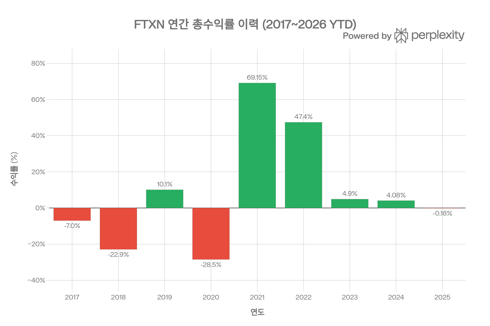
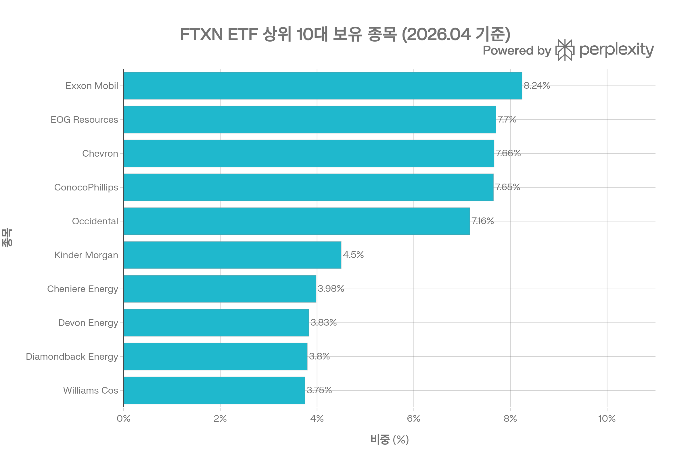
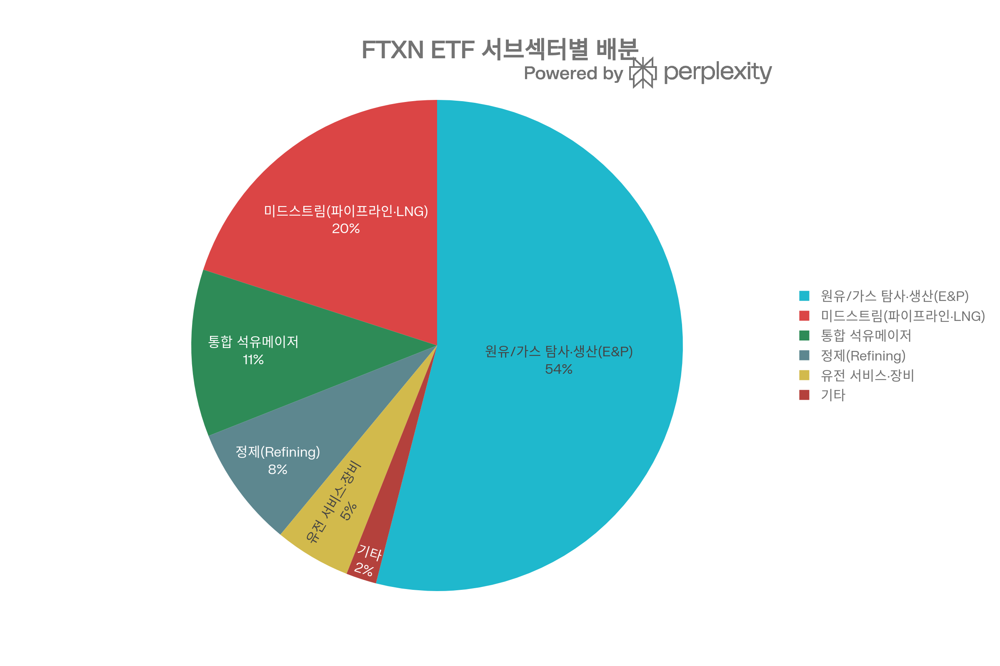
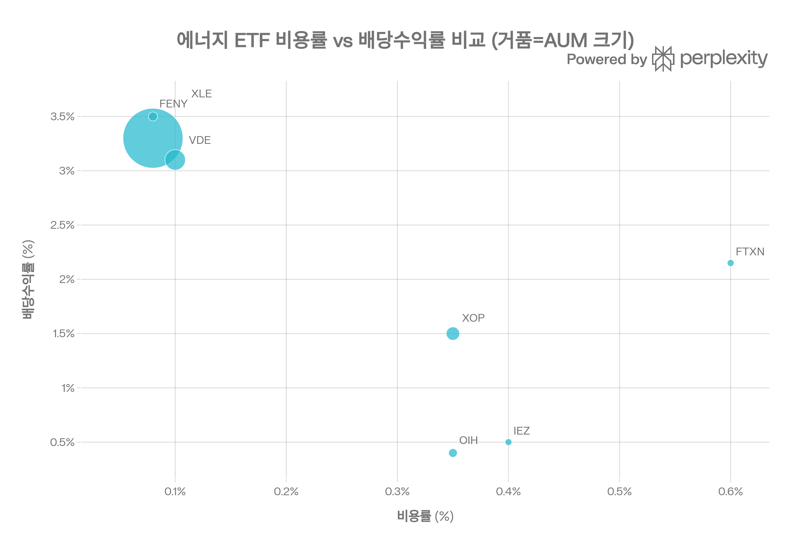

## 요약

> **작성 기준일:** 2026년 5월 11일 | **데이터 출처:** First Trust 공식 사이트, Morningstar, Robinhood, MarketWatch, ETFdb, PortfoliosLab, Nasdaq Index Research, Cbonds, StockAnalysis, Yahoo Finance 등

***
## ETF 분류

| 항목 | 내용 |
|------|------|
| **최종 폴더** | `ETF/Sector/Energy/Oil Gas/FTXN` |
| **대분류** | 섹터 |
| **하위 분류** | Energy / Oil Gas |
| **핵심 전략** | Nasdaq US Smart Oil & Gas Index 추종 |
| **운용 방식** | 패시브 |
| **레버리지·인버스 여부** | 아니오 |
| **옵션 인컴 전략 여부** | 아니오 |

FTXN은 Nasdaq 이름이 붙어 있지만 대표지수 ETF가 아니라 미국 석유·가스 기업에 투자하는 **에너지 섹터 ETF**입니다. ETF 분류 기준상 산업 섹터 노출이 명확하므로 `Sector/Energy/Oil Gas`로 분류합니다.

***
## 1. 기본 정보
| 항목 | 내용 |
|------|------|
| 티커 | FTXN |
| 전체명 | First Trust Nasdaq Oil & Gas ETF |
| 운용사 | First Trust Advisors L.P. |
| 상장거래소 | NASDAQ[1] |
| ISIN | US33738R8455[2] |
| 설정일 | **2016년 9월 20일**[1][3] |
| 설정가격 | $19.84[1] |
| 운용기간 | 약 8년 7개월 |
| 순자산(AUM) | **$827.07M (약 8,270억원)**[4][5] |
| 총 보수(Expense Ratio) | **0.60%**[1][6] |
| 운용 방식 | **패시브 (인덱스 추종)**[7] |
| 추종 지수 | **Nasdaq US Smart Oil & Gas Index™ (NQSSOG)**[8][7] |
| 종목 수 | 약 **42~45개**[5][3] |
| 포트폴리오 회전율 | **32~0.9%** (마켓워치 32% vs etfrc 0.9%)[6][9] |
| 재밸런싱 주기 | **분기 1회** (3·6·9·12월 세 번째 금요일 다음 거래일)[10][11] |
| 배당 주기 | **분기 배당**[12] |
| 배당 수익률 (TTM) | **2.14~2.15%**[6][12] |
| P/E 비율 | 17.15배[5] |
| 현재 주가 | $35.24~$38.04 (2026/05/01~05/04)[13][5] |
| 베타 (vs S&P 500) | 0.65~0.77[12][3] |
| 52주 범위 | $23.43 ~ $40.13[12] |

***
## 2. 운용사 및 상장 배경
First Trust는 2016년 9월에 'Nasdaq US Smart Sector™ 시리즈'의 일환으로 FTXN을 출시했습니다. 이 시리즈는 시가총액 가중 방식 대신 **팩터 기반 스마트 베타 방법론**으로 석유·가스 섹터 내 50개 기업을 선별·가중하는 방식으로 설계되었습니다.[1][10][8][7]

First Trust Advisors는 2016년 기준 약 $1천억 이상의 AUM을 보유한 ETF 전문 운용사로, AlphaDEX 계열과 스마트 베타 인덱스 전략으로 잘 알려진 회사입니다. FTXN의 포트폴리오 매니저는 Roger Testin, Daniel Lindquist, Jon Erickson, David McGarel 등 다수가 공동으로 담당합니다.[14]

***
## 3. 추종 지수: Nasdaq US Smart Oil & Gas Index™
### 지수 개요
FTXN은 **Nasdaq US Smart Oil & Gas Index™**를 추종합니다. 이 지수는 단순 시가총액 가중 방식이 아닌 **3가지 팩터 점수에 따른 변형 가중(Modified Factor-Weighted)** 방식으로 구성 종목의 비중을 결정합니다.[10][11][8][7]
### 종목 선정 기준
**스크리닝 대상:** Nasdaq US Benchmark Index 중 ICB(Industry Classification Benchmark) 기준 석유·가스 산업으로 분류된 미국 기업[1][7]

**유동성 기준 선정:** 상위 50개 가장 유동적인 석유·가스 종목을 편입[12][7]

포함 활동 유형: 석유·가스 탐사·생산(E&P), 시추, 파이프라인·미드스트림, 정제, 가스 판매, LNG 등[7]
### 팩터 가중 방법론 (3가지 팩터)

선정된 종목들은 아래 3가지 팩터 점수에 따라 가중치를 결정받습니다:[10][11][15]

**1. 성장(Growth) 팩터**
- 3개월·6개월·9개월·12개월 평균 가격 수익률(모멘텀)로 측정[7]
- 직전 월말 기준 데이터 사용

**2. 가치(Value) 팩터**
- 현금흐름 대비 가격(Cash-Flow-to-Price) 비율로 측정[10][7]
- 직전 분기말 기준 데이터 사용

**3. 저변동성(Low Volatility) 팩터**
- 역사적 가격 변동폭(Price Fluctuation)으로 측정[7]
- 직전 월말 기준 데이터 사용
### 가중치 상·하한 제약 (3단계 조정)
| 단계 | 제약 조건 |
|------|---------|
| 1단계 | 어떤 종목도 8% 초과 불가[11][15] |
| 2단계 | 상위 5종목 이후 4% 초과 불가[11] |
| 3단계 | 어떤 종목도 0.25% 미만 불가[11] |

**재밸런싱:** 매년 3·6·9·12월의 세 번째 금요일 다음 거래일 장 시작 전 실행[10][11]

***
## 4. 포트폴리오 구성
### 상위 10대 보유 종목 (2026년 4월 기준)

| 순위 | 종목 | 서브섹터 | 비중 |
|------|------|---------|------|
| 1 | **Exxon Mobil (XOM)** | 통합 메이저 | 8.24%[2] |
| 2 | **EOG Resources (EOG)** | E&P | 7.70%[2] |
| 3 | **Chevron (CVX)** | 통합 메이저 | 7.66%[2] |
| 4 | **ConocoPhillips (COP)** | E&P | 7.65%[2] |
| 5 | **Occidental Petroleum (OXY)** | E&P | 7.16%[2] |
| 6 | **Kinder Morgan (KMI)** | 미드스트림 | 4.50%[2] |
| 7 | **Cheniere Energy (LNG)** | LNG 미드스트림 | 3.98%[2] |
| 8 | **Devon Energy (DVN)** | E&P | 3.83%[2] |
| 9 | **Diamondback Energy (FANG)** | E&P | 3.80%[2] |
| 10 | **Williams Companies (WMB)** | 미드스트림 | 3.75%[2] |

**상위 10종목 합산 비중:** 58.4%[4]
**상위 5종목 합산 비중:** 38.4%[14]

전체 42~45개 종목 중 XOM, EOG, CVX, COP, OXY 등 대형 E&P 기업이 상위권을 차지하며, 8% 상한 제약으로 인해 XOM과 CVX의 집중도가 XLE 대비 낮습니다.[2][16]
### 서브섹터별 배분

| 서브섹터 | 비중 | 주요 기업 |
|---------|------|---------|
| 원유/가스 탐사·생산 (E&P) | **~54%** | EOG, COP, OXY, DVN, FANG |
| 미드스트림 (파이프라인·LNG) | **~20%** | KMI, LNG, WMB |
| 통합 석유메이저 | **~11%** | XOM, CVX |
| 정제 (Refining) | **~8%** | MPC, VLO, PSX |
| 유전 서비스·장비 | **~5%** | SLB, HAL, BKR |
| 기타 | **~2%** | 현금 등 |

**국가별 배분:** 미국 99.5%[9]

XLE는 XOM·CVX 두 종목에 약 40% 집중된 반면, FTXN은 8% 상한 제약으로 더 분산된 구조입니다.[16]

***
## 5. 비용 구조
| 항목 | 내용 |
|------|------|
| 총 보수율(TER) | **0.60%**[1][8] |
| 평균 호가 스프레드 | 0.06% of price (약 6bp)[9] |
| 포트폴리오 회전율 | 32%(MarketWatch)[6] / 0.9%(ETFRC)[9] |
| 총 실질 보유 비용(TCO) | ~65.6bp (비용률 60bp + 스프레드 5.6bp)[9] |
| 경쟁사 TCO 평균 | ~59.3bp[9] |
| 배당 수익률 (TTM) | 2.14~2.15%[6][12] |

ETFRC 데이터에 따르면 FTXN의 TCO(총 실질 보유 비용)는 65.6bp로 경쟁사 평균 59.3bp보다 소폭 높습니다. 그러나 Morningstar는 FTXN을 "비용 두 번째 최저 5분위 그룹에 포함되어 비용 우위가 있다"고 평가합니다.[4][9]
### 경쟁 에너지 ETF 비용 비교

| ETF | 전략 | 비용률 | AUM | 배당률 | 특징 |
|-----|------|--------|-----|--------|------|
| **FTXN** | 나스닥 스마트 베타 E&P | **0.60%** | **$8.3억** | 2.15% | 팩터 가중 E&P 집중 |
| XLE | S&P 500 에너지 (시가총액) | **0.08%** | $270억 | 3.30% | XOM+CVX 40% 집중[16] |
| VDE | 전체 미국 에너지 | 0.10% | $75억 | 3.10% | 가장 넓은 유니버스 |
| XOP | S&P E&P 동일가중 | 0.35% | $40억 | 1.50% | 순수 E&P 동일가중 |
| OIH | 유전 서비스 | 0.35% | $17억 | 0.40% | 서비스·장비 특화[17] |
| FENY | MSCI 에너지 | 0.08% | $18억 | 3.50% | 최저 비용 |

FTXN의 0.60% 비용은 XLE(0.08%), VDE(0.10%)에 비해 현저히 높습니다. 팩터 가중이라는 액티브적 요소에 대한 프리미엄을 지불하는 구조입니다.[16][17]

***
## 6. 유동성 평가
| 항목 | 내용 |
|------|------|
| AUM | **$827.07M (약 8.3억달러)**[5] |
| 일평균 거래량 | **약 651,390주** (MarketWatch)[6] / **3.76M주** (Robinhood)[5] |
| 30일 SEC 수익률 | 1.68%[5] |
| NAV 디스카운트/프리미엄 | 약 **+0.08%** 프리미엄[18] |
| 52주 최저/최고 | $23.43 / $40.13[12] |
| 평균 호가 스프레드 | 0.06%[9] |
| 기초 자산 일평균 거래대금 | $72.74억[9] |

AUM $8.3억은 동일 에너지 섹터의 XLE($270억)나 VDE($75억)에 비해 작지만, 개인 투자자 매매에 충분한 유동성입니다. NAV 대비 0.08% 미미한 프리미엄으로 가격 효율성도 양호합니다.[18]

***
## 7. 성과 분석
### 연간 총수익률 (배당 재투자 포함)
| 연도 | FTXN 수익률 | 비고 |
|------|-----------|------|
| 2016 (일부) | — | 설정 (9/20) |
| 2017 | **-7.0%** | 유가 횡보, 에너지 부진[19] |
| 2018 | **-22.9%** | 유가 급락, Q4 -40%[19] |
| 2019 | **+10.1%** | 유가 회복[19] |
| 2020 | **-28.5%** | 코로나 쇼크, 유가 마이너스[19] |
| 2021 | **+69.15%** | 에너지 슈퍼사이클 개막[20] |
| 2022 | **+47.40%** | 러시아-우크라이나 전쟁, 유가 급등[20] |
| 2023 | **+4.90%** | 에너지 가격 정상화[20] |
| 2024 | **+4.08%** | 글로벌 수요 둔화 우려[20] |
| 2025 | **-0.18%** | 유가 하락 압력[20] |
| 2026 YTD | **+10.2%** | 지정학 리스크 완화·에너지 반등[13] |

**설정 이후 연평균 수익률(CAGR):** 6.27~7.1%[1][3]
**주요 특징:** 2021~2022년 에너지 슈퍼사이클 시기에만 +69.15%·+47.40%의 폭발적 수익을 냈으며, 그 외 기간에는 저성과 또는 손실 패턴이 반복됩니다.
### 기간별 성과 (2025년 2월 기준, ETFRC 표준화)
| 기간 | FTXN 수익률 | 변동성 |
|------|-----------|--------|
| YTD | 3.7% | 22.7%[9] |
| 1년 | 5.1% | 20.0%[9] |
| 2년 | 7.9% | 21.7%[9] |
| 3년 | 10.8% | 29.4%[9] |
| 5년 | 22.2% | 38.0%[9] |
| 설정 이후 | 7.1% | —[9] |

**3개월 최고 수익:** +40.13%, **3개월 최악 손실:** -12.61%[19]

***
## 8. 추종 성과 지표
| 항목 | 내용 |
|------|------|
| 복제 방식 | 완전 복제(Full Replication) — 실물 주식 보유 90% 이상[1] |
| NAV 디스카운트/프리미엄 | +0.08% (극소 프리미엄)[18] |
| ALTAR 스코어™ | **12.8%** (카테고리 평균 6.0%, 상위 1%)[9] |
| 수익률 대비 변동성 | 5년 수익률 22.2%, 변동성 38.0% (매우 높음)[9] |
| 추적 오차 | NDXESG 대비 낮음 (실물 복제 방식) |

ETFRC의 ALTAR Score™(Adjusted Long-Term Annualized Return)는 12.8%로 카테고리 평균(6.0%) 대비 2.3 표준편차 우위, 상위 1%에 해당합니다. 이는 5년 에너지 슈퍼사이클 시기 성과를 반영합니다.[9]

***
## 9. 위험 조정 성과 지표
| 지표 | FTXN | 비고 |
|------|------|------|
| 베타 (vs S&P 500) | **0.65~0.77**[12][3] | 시장 대비 낮은 민감도 |
| 연환산 변동성 (5년) | **38.0%**[9] | 에너지 섹터 특성상 매우 높음 |
| 연환산 변동성 (1년) | **20.0%**[9] | 최근 안정화 |
| RSI (30일 기준) | 52[9] | 중립 |
| 공매도 비율 (기초자산) | 5.5%[9] | 보통 수준 |
| 최대 낙폭 (MDD) 추정 | -28.5%(2020), -22.9%(2018) | 유가 하락 연동 |

**유가 상관관계:** FTXN의 성과는 WTI 원유 가격 변동과 높은 상관관계를 보입니다. E&P 기업 비중이 54%에 달하는 구조상 유가 변동이 가장 직접적 리스크 요인입니다.

**베타 0.65~0.77의 의미:** S&P 500 대비 낮은 베타는 주식시장 전반과의 상관관계가 낮음을 의미합니다. 이는 에너지 섹터가 주식시장 사이클과 다른 독자적 유가·공급 사이클로 움직이기 때문입니다.[12]

***
## 10. 배당 정보
| 항목 | 내용 |
|------|------|
| 배당 주기 | **분기 배당 (Quarterly)**[12] |
| 최근 배당금 | $0.22/주 (2025년 12월)[6] |
| TTM 총 배당금 | $0.75~$0.76/주[3][21] |
| TTM 배당 수익률 | **2.14~2.84%**[6][21] |
| 배당 성향 | 35.66%[3] |
| 1년 배당 성장률 | **9.6%**[22] |
| 최근 3년 배당 증가 횟수 | 6회[22] |
| 최근 3년 배당 감소 횟수 | 6회[22] |
### 연간 배당 이력 패턴
배당금이 **동수로 증가·감소**한 점은 에너지 섹터의 이익 변동성을 그대로 반영합니다. 유가 급등기(2021~2022년)에는 배당이 큰 폭으로 늘어났다가, 유가 정상화(2023~2025년)에 따라 감소했습니다. 배당 수익률 2.1~2.8%는 XLE(3.3%)나 FENY(3.5%)보다 낮은 수준입니다.[16][22]

***
## 11. 리스크 요소
### 주요 리스크 요약
| 리스크 유형 | 내용 |
|-----------|------|
| **유가 변동 리스크** | E&P 비중 54%, 유가 10% 하락 시 포트폴리오 직격[10] |
| **에너지 섹터 집중 리스크** | 100% 에너지 단일 섹터, 섹터 회전 시 소외 가능 |
| **팩터 페이드 리스크** | 모멘텀·가치·저변동 팩터가 동시에 작동하지 않는 환경 존재 |
| **높은 비용 리스크** | 0.60%로 XLE(0.08%) 대비 7.5배 비쌈[16] |
| **지정학적 리스크** | 중동 갈등, OPEC+ 결정, 러시아 제재 등 |
| **에너지 전환 리스크** | 중장기 화석연료 수요 감소 전망 |
| **변동성 리스크** | 5년 연환산 변동성 38%, 단기 낙폭 매우 큼[9] |
| **2022 이후 성과 부진** | 에너지 슈퍼사이클 종료 후 2023~2025년 저성과 지속[20] |
| **유동성 집중 리스크** | 상위 5종목 38%, 개별 기업 이슈에 취약[14] |

**에너지 사이클 리스크:** FTXN의 성과는 에너지 사이클에 극도로 의존합니다. 2021~2022년의 합산 +116% 수익은 코로나 이후 공급 부족과 지정학 충격이라는 특수 상황이었으며, 이후 3년간(2023~2025년) 누적 수익은 +8.8%에 불과합니다.[20]

***
## 12. 경쟁 에너지 ETF 종합 비교
| 항목 | **FTXN** | XLE | VDE | XOP | OIH |
|------|----------|-----|-----|-----|-----|
| 전략 | 팩터 가중 스마트베타 | 시가총액 가중 | 시가총액 가중 | 동일가중 E&P | 유전 서비스 |
| 추종 지수 | Nasdaq Smart Oil & Gas | S&P 에너지 | MSCI 에너지 | S&P O&G E&P | — |
| 비용률 | 0.60% | **0.08%** | **0.10%** | 0.35% | 0.35% |
| AUM | $8.3억 | $270억 | $75억 | $40억 | $17억 |
| 종목 수 | **45개** | 22개 | 110+개 | 60+개 | 25개 |
| XOM+CVX 비중 | ~16% | **~41%** | ~25% | ~3% | 없음 |
| E&P 집중도 | **~54%** | ~30% | ~35% | **~100%** | 0% |
| 배당률 | 2.15% | **3.30%** | **3.10%** | 1.50% | 0.40% |
| 베타 | **0.65** | ~0.90 | ~0.90 | ~1.10 | ~1.20 |
| 2021~2022 수익 | **+116%** | +85% | +85% | +100%+ | +80% |
| 2023~2025 수익 | **~+8.8%** | ~+10% | ~+10% | 손실 | 고수익 |
| 유동성 | 중간 | **매우 높음** | 높음 | 높음 | 중간 |

**FTXN vs XLE:** XLE는 비용 0.08%로 압도적 저비용이나 XOM+CVX에 41% 집중됩니다. FTXN은 8% 상한 제약으로 더 분산되나 비용이 7.5배 높습니다. 2022년 에너지 강세 시 FTXN(+47%) > XLE(+65% 차이로 XLE 우세).[16]

***
## 13. 2026년 에너지 섹터 전망
2026년 에너지 섹터는 지정학 불확실성과 OPEC+ 정책 변화 사이에서 변동성 높은 장세를 보이고 있습니다. FTXN은 2026년 YTD 약 +10.2% 상승하며 2025년의 부진(-0.18%)에서 벗어나는 모습입니다. 유전 서비스 ETF OIH가 동기간 +45.3%로 훨씬 강세인 점과 비교하면, FTXN의 팩터 모델이 현재 국면에서는 유전 서비스 모멘텀을 충분히 포착하지 못하고 있습니다.[23][13]

미국 에너지 전문가들은 "FTXN은 E&P 기업에 대한 팩터 기반 접근으로 중장기 에너지 베팅에 적합하나, 단기 모멘텀 플레이나 비용 최적화를 원하는 투자자에게는 XLE나 XOP가 더 나은 선택"이라고 평가합니다.[16][17]

***
## 14. 투자 요약 및 핵심 결론
FTXN은 2016년 설정된 석유·가스 섹터 전문 **팩터 가중 스마트 베타 ETF**로, 모멘텀·가치·저변동성 세 팩터로 45개 미국 오일·가스 기업을 선별합니다. 비용률 0.60%로 경쟁 에너지 ETF 대비 높지만, 8% 상한 제약으로 XLE보다 분산된 포트폴리오를 제공합니다.[1][10][11][16]

**성과의 극단적 주기 의존성이 핵심 특징입니다:**
- 2021~2022년 에너지 슈퍼사이클: 합산 +116%의 폭발적 수익[20]
- 2017~2020년, 2023~2025년 평범기: 손실 또는 저성과 반복[20]
- 설정 이후 연평균(CAGR) 6.27~7.1%로 나스닥·S&P 500에 크게 뒤처짐[3]

**FTXN이 적합한 투자자:**
- 에너지 가격 급등 사이클을 기대하며 포트폴리오 일부를 에너지 섹터에 배분하는 투자자
- XLE/VDE 대비 대형주 집중(XOM+CVX 40%)을 완화하고 싶은 투자자
- 팩터(모멘텀·가치·저변동) 기반 스마트 베타 전략 선호 투자자

**핵심 주의사항:**
- 비용 0.60%는 XLE(0.08%) 대비 너무 높아 **단순 에너지 노출 목적이라면 XLE·FENY가 훨씬 효율적**
- 에너지 슈퍼사이클 이외 구간에서는 배당·수익률 모두 부진
- 높은 변동성(5년 38%)으로 포트폴리오 배분 비중 관리 필수
