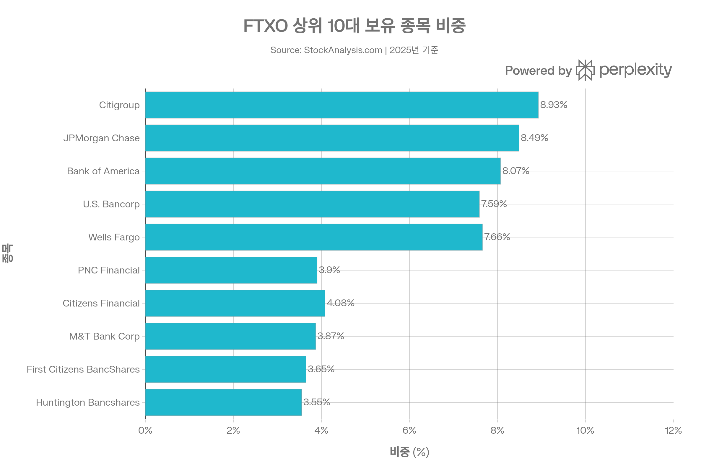
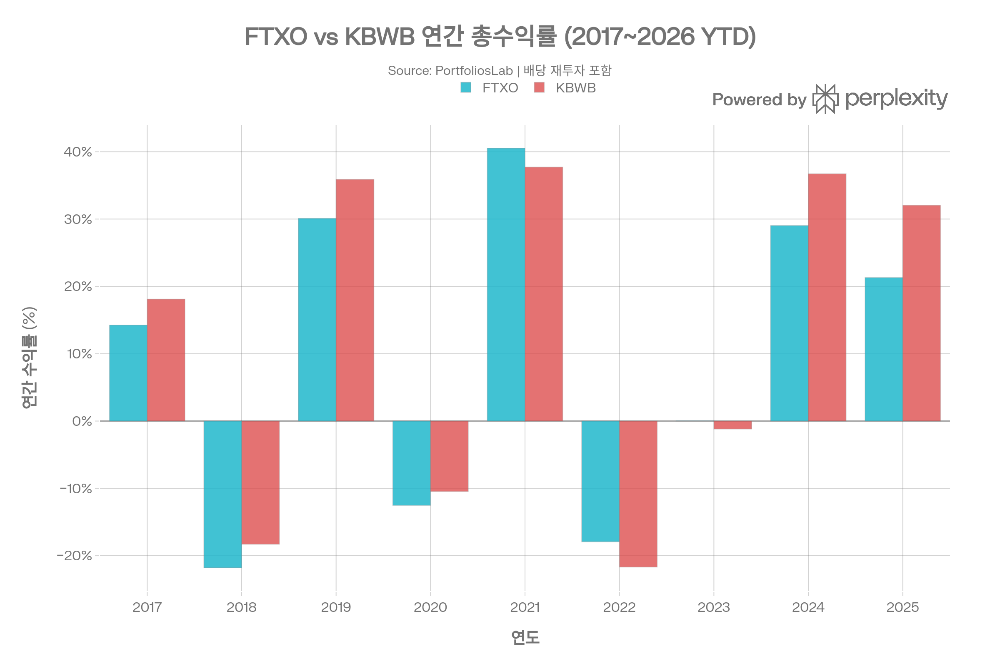
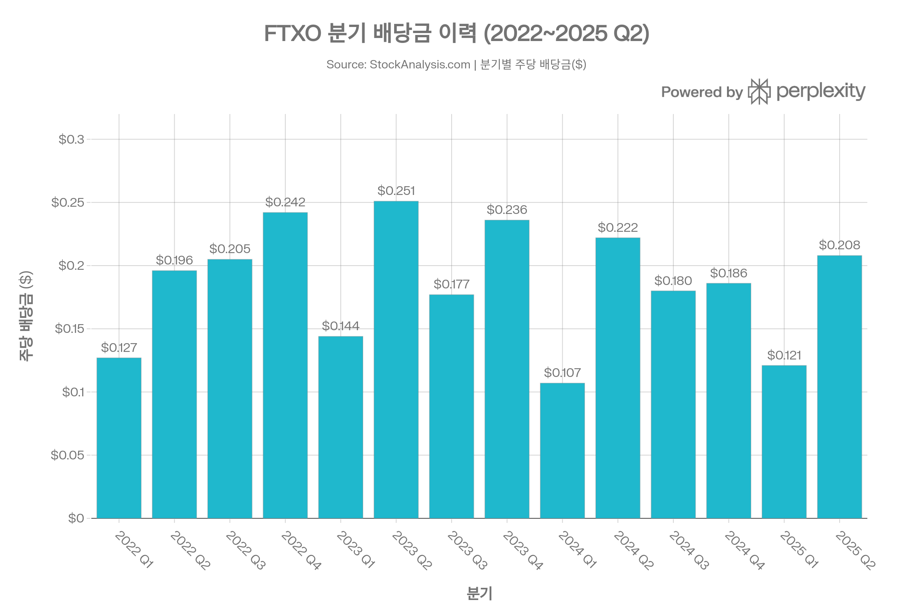

## 요약

> **작성 기준일:** 2026년 5월 3일 | **데이터 출처:** First Trust Portfolios, StockAnalysis, Morningstar, PortfoliosLab, ETFdb 등

***
## ETF 분류

| 항목 | 내용 |
|------|------|
| **최종 폴더** | `ETF/Sector/Financials/Banks/FTXO` |
| **대분류** | 섹터 |
| **하위 분류** | Financials / Banks |
| **핵심 전략** | Nasdaq US Smart Banks Index 추종 |
| **운용 방식** | 패시브 |
| **레버리지·인버스 여부** | 아니오 |
| **옵션 인컴 전략 여부** | 아니오 |

FTXO는 Nasdaq 이름이 붙어 있지만 대표지수 ETF가 아니라 미국 은행주에 집중 투자하는 **금융 섹터 ETF**입니다. ETF 분류 기준상 산업 섹터 노출이 명확하므로 `Sector/Financials/Banks`로 분류합니다.

***
## 1. 기본 정보
| 항목 | 내용 |
|------|------|
| 티커 | FTXO |
| 전체명 | First Trust Nasdaq Bank ETF |
| 운용사 | First Trust Advisors L.P. |
| 상장거래소 | NASDAQ |
| 설정일 | 2016년 9월 20일[1] |
| 운용기간 | 약 9년 7개월 |
| 순자산(AUM) | 약 $2억 3,155만~$3억 2,900만 (시기별 상이)[2][3] |
| 총 보수(Expense Ratio) | **0.60%**[4][5] |
| 추종 지수 | Nasdaq US Smart Banks™ Index[6] |
| 총 종목 수 | 약 51개[2][7] |
| 포트폴리오 회전율 | 약 24%[8] |
| 배당 주기 | 분기배당[9] |
| 운용 매니저 | Roger Testin, Daniel Lindquist 외[1] |

First Trust Nasdaq Bank ETF(FTXO)는 2016년 9월 20일 설정된 미국 은행주 집중형 스마트베타 ETF로, Nasdaq US Smart Banks™ Index를 추종하며 미국 은행 섹터에 대한 팩터 가중(Factor-Weighted) 노출을 제공합니다. 동종 은행 ETF 대비 비용률 0.60%는 중간 수준이지만, 스마트베타 팩터 전략으로 단순 시가총액 가중 대비 차별화된 선별 기준을 적용합니다.[1][6][10][11]

***
## 2. 추종 지수: Nasdaq US Smart Banks™ Index
### 지수 구조 및 선종 방법론
**Nasdaq US Smart Banks™ Index(NQSSBA)**는 미국 은행 섹터에서 3가지 팩터를 기반으로 종목을 선별하고 가중치를 부여하는 수정 팩터가중(Modified Factor-Weighted) 지수입니다.[6][12]

**선별 및 가중 프로세스:**
1. **유니버스 선별:** NASDAQ US Benchmark Index에서 은행업 종목을 추출하여 유동성(거래량) 기준으로 1차 스크리닝[10]
2. **3가지 팩터 스코어 산출:** 변동성(Volatility), 가치(Value), 성장(Growth) 팩터를 종합 점수화[12]
   - **변동성 팩터:** 낮은 변동성 선호 (역순위 부여)
   - **가치 팩터:** 은행 특성상 장부가치(Book Value) 기반으로 측정[13]
   - **수익(Profit) 팩터:** 총이익 또는 순이익 기준 상위 선호[13]
3. **포트폴리오 구성:** 30~50개 종목으로 구성[13]
4. **가중치 결정 구조(3단계):**
   - Stage 1: 초기 팩터 점수 기반 비중 산출; 상위 5개 종목 외에는 4% 상한 적용[13]
   - Stage 2: 추가 조정을 통해 비중 상한 유지
   - Stage 3: 최소 종목 비중 0.5% 보장[13]
5. **리밸런싱 주기:** 연간 (정기 구성 변경)[10]

시가총액 가중 방식이 아니라 팩터 점수 기반으로 가중치를 조정하므로, 대형 은행주가 자동으로 최고 비중을 갖지 않습니다. 다만 현재 포트폴리오에서는 Citigroup, JPMorgan, Bank of America 등 대형 은행이 상위를 차지하고 있어 실질적으로 대형주 중심 구조를 보입니다.[14]

***
## 3. 비용 구조
| 항목 | 내용 |
|------|------|
| 총 보수율(TER) | **0.60%**[4][5] |
| 포트폴리오 회전율 | 약 24%[8] |
| 30일 중간 호가 스프레드 | 약 0.05~0.07% (추정)[15] |
| P/E 비율 | 약 13.11배[15] |
### 경쟁 은행 ETF 비용 비교
| ETF | 운용사 | 추종 지수 | 비용률 | AUM |
|-----|--------|---------|--------|-----|
| KBE | State Street SPDR | S&P Banks Select Industry | 0.35% | 약 $13.8억[7] |
| **FTXO** | **First Trust** | **Nasdaq US Smart Banks** | **0.60%** | **약 $2.3~3.3억** |
| KBWB | Invesco | KBW Nasdaq Bank Index | 0.35%[11] | 약 $58.1억[7] |
| IAT | iShares | Dow Jones US Regional Banks | 0.40% | 중간 규모 |

FTXO의 비용률 0.60%는 주요 경쟁 ETF인 KBWB(0.35%)와 KBE(0.35%) 대비 약 0.25%p 높습니다. Morningstar는 동종 그룹 내 두 번째로 낮은 비용 구간으로 평가하며, 팩터 기반 스마트베타 ETF의 관리 복잡성을 감안하면 경쟁력 있는 수준으로 봅니다. 회전율 24%는 연간 리밸런싱 구조에서 비교적 낮은 편입니다.[14][7][8][11]

***
## 4. 유동성 평가
| 항목 | 내용 |
|------|------|
| 현재 주가 (2026/05/01 기준) | 약 $38.95~$39.21[15] |
| 일 평균 거래량 (3개월) | 약 123,020주[15] |
| 52주 최저 / 최고 | $28.35 / $39.32[15] |
| AUM | 약 $3억 2,093만[15] |
| 총 발행 주식 수 | 약 680만~840만 주[2] |

일평균 거래량 약 12만 3천 주는 대형 은행 ETF(KBWB: 수백만 주/일)에 비해 현저히 낮습니다. 그러나 AUM 대비 스프레드는 좁아 소규모~중간 규모 투자에서 거래 비용은 수용 가능한 수준입니다. 다만 큰 규모 매매 시 시장 충격이 발생할 수 있는 점은 유의해야 합니다.[15]

***
## 5. 포트폴리오 구성
### 상위 10대 보유 종목 (2025~2026년 기준)

| 순위 | 종목명 | 티커 | 비중 |
|------|--------|------|------|
| 1 | Citigroup Inc. | C | 8.93%[2] |
| 2 | JPMorgan Chase & Co. | JPM | 8.49%[2] |
| 3 | Bank of America | BAC | 8.07%[2] |
| 4 | Wells Fargo & Company | WFC | 7.66%[2] |
| 5 | U.S. Bancorp | USB | 7.59%[2] |
| 6 | Citizens Financial Group | CFG | 4.08%[2] |
| 7 | PNC Financial Services | PNC | 3.90%[2] |
| 8 | M&T Bank Corporation | MTB | 3.87%[2] |
| 9 | First Citizens BancShares | FCNCA | 3.65%[2] |
| 10 | Huntington Bancshares | HBAN | 3.55%[2] |

상위 10개 종목 합산 비중은 약 **59.80%**로, 특히 상위 5개 대형 은행(C, JPM, BAC, WFC, USB)이 전체의 약 40.7%를 차지합니다. Morningstar는 상위 10대 보유 종목 비중을 58.7%로 기록하고 있습니다.[14][2]
### 섹터 및 스타일 분석
- **섹터:** 금융 서비스(Financial Services) 100% — 은행업 특화[1]
- **스타일:** 중형 가치주(Mid Cap, Value)[1]
- **총 편입 종목 수:** 약 51개[7]
- **국가 배분:** 미국 100%[1]
- **리밸런싱:** 연간 정기 구성 변경[10]

시가총액 기준으로는 대형 은행 중심이지만, 팩터 가중 방식이 적용되어 Citizens Financial, M&T Bank, First Citizens BancShares 같은 중형·지역 은행도 의미 있는 비중으로 포함됩니다.[2][10]

***
## 6. 성과 분석
### 기간별 수익률 (2026년 기준)

| 기간 | FTXO NAV | FTXO 시장가 |
|------|----------|-----------|
| 1개월 | — | — |
| YTD (2026) | +3.47%[16] | +2.73%[11] |
| 6개월 | — | — |
| 1년 | +22.63%[2] | — |
| 설정 이후 연환산 | +8.92%[2] | — |
### 연간 수익률 이력
| 연도 | FTXO | KBWB | 비고 |
|------|------|------|------|
| 2017 | +14.25% | +18.11% | 은행주 강세 |
| 2018 | -21.79% | -18.30% | 금리 상승 우려 |
| 2019 | +30.11% | +35.90% | 금리 안정 반등 |
| 2020 | -12.53% | -10.46% | 코로나 충격 |
| 2021 | +40.53% | +37.72% | 경기 회복 |
| **2022** | **-17.93%** | **-21.68%** | 금리 급등 초기 |
| 2023 | +0.05% | -1.18% | SVB 사태 여파 |
| **2024** | **+29.05%** | **+36.73%** | 규제 완화 기대 |
| **2025** | **+21.32%** | **+32.05%** | 강한 은행 실적 |
| 2026 YTD | +2.73% | +2.75% | 관세 불확실성[11] |

FTXO는 매년 KBWB 대비 수익률이 낮은 경향이 있으며, 특히 2024년(+29.05% vs +36.73%)과 2025년(+21.32% vs +32.05%) 격차가 두드러집니다. 5년 연환산 수익률도 FTXO 6.76% vs KBWB 9.37%로 KBWB가 앞섭니다.[11]
### 위험 조정 성과 지표
| 지표 | FTXO | KBWB |
|------|------|------|
| 베타 | 0.96~0.97[7][2] | 1.09[17] |
| 연간 표준편차 (3Y) | 약 24.95~26.46%[7][18] | 약 25.86~23.28%[17] |
| 샤프 비율 (1Y) | 2.06[11] | 2.61[11] |
| 샤프 비율 (5Y) | 0.25[11] | 0.35[11] |
| 소르티노 비율 | 2.73[11] | 3.27[11] |
| 최대 낙폭 (Max Drawdown) | -55.25%[18] | -50.27%[18] |

FTXO는 KBWB보다 베타가 약간 낮아(0.96 vs 1.09) 이론적으로 시장 하락 시 손실이 적을 것으로 기대되지만, 실제 최대 낙폭은 FTXO(-55.25%)가 KBWB(-50.27%)보다 오히려 더 컸습니다. 이는 FTXO의 스마트베타 선별이 대형 은행 방어력을 약화시킨 결과일 수 있습니다.[7][18][17]

***
## 7. 추종 성과 지표
### 추적 오차 및 NAV 괴리율
| 항목 | 내용 |
|------|------|
| ETF 유형 | 패시브 인덱스 (비분산 ETF)[19] |
| 추적 오차 특성 | 연간 리밸런싱 구조로 장기 편차 최소화 |
| NAV 괴리율 | 통상 좁음 (유동성 한계로 스트레스 시 확대 가능) |
| Morningstar 평가 | **Neutral** (Middle 공정 가치 추정 기반)[14] |
| Morningstar Process Pillar | **Below Average**[14] |

Morningstar는 FTXO에 대해 'Neutral' 등급을 부여하며, 비용 면에서는 경쟁력이 있으나 **팩터 선별 프로세스(Process Pillar)를 Below Average**로 평가합니다. 이는 Nasdaq US Smart Banks Index의 팩터 구성이 경쟁 지수 대비 뚜렷한 우위를 입증하지 못하고 있음을 의미합니다.[14]

***
## 8. 배당 정보

### 배당 개요
| 항목 | 내용 |
|------|------|
| 배당 주기 | 분기배당 (3·6·9·12월)[9] |
| 12개월 배당금 (TTM) | 주당 $0.69[9] |
| 배당 수익률 (TTM) | 약 1.75~2.33%[9][20] |
| 12개월 배당 성장률 | -6.40%[9] |
| 배당성향(Payout Ratio) | 약 24~26%[2][9] |
| 가장 최근 배당 (2025/06) | $0.2075/주[9] |
| 2025/12 배당 | $0.23/주[8] |
### 분기 배당금 이력 (2022~2025)
| 기간 | 주당 배당금 | 지급일 |
|------|-----------|------|
| 2025 Q2 | $0.2075 | 2025-06-30[9] |
| 2025 Q1 | $0.1207 | 2025-03-31[9] |
| 2024 Q4 | $0.1864 | 2024-12-31[9] |
| 2024 Q3 | $0.1796 | 2024-09-30[9] |
| 2024 Q2 | $0.2216 | 2024-06-28[9] |
| 2024 Q1 | $0.1069 | 2024-03-28[9] |
| 2023 Q4 | $0.2362 | 2023-12-29[9] |
| 2023 Q3 | $0.1770 | 2023-09-29[9] |
| 2023 Q2 | $0.2506 | 2023-06-30[9] |
| 2022 Q4 | $0.2416 | 2022-12-30[9] |

배당 수익률 약 1.75~2.33%는 은행주 ETF 평균 대비 낮은 편이며, 이는 포트폴리오가 저배당 성향의 대형 성장 은행주를 포함하기 때문입니다. 2025년 Q1 배당($0.12)이 Q2($0.21) 대비 낮아 분기별 편차가 있음을 알 수 있습니다.[11][9]

***
## 9. 리스크 요소
### 주요 리스크 요약
| 리스크 유형 | 내용 |
|-----------|------|
| 섹터 집중 리스크 | 100% 은행 섹터 집중, 금융위기 시 심각한 손실 가능[2] |
| 금리 리스크 | 금리 인상 초기 수혜, 급등 또는 급락 시 이자 마진 변동[7] |
| 규제·정책 리스크 | 금융 규제 강화 또는 완화에 따른 수익성 변화[7] |
| 유동성 리스크 | 일 거래량 약 12만 주로 대규모 매매 시 슬리피지 가능[15] |
| 비분산(Non-Diversified) 리스크 | 소수 종목 집중 구조로 개별 주가 변동에 취약[19] |
| 팩터 리스크 | 팩터 기반 선별이 시장 환경에 따라 불리하게 작용 가능[14] |
| 신용 리스크 | 포트폴리오 내 은행들의 부실 채권 증가 시 손실[7] |
| 최대 낙폭 리스크 | -55.25%의 최대 낙폭은 금융 섹터 집중 ETF의 구조적 한계[18] |

**금리 환경 민감성:** 은행주는 금리에 대한 양면성을 가집니다. 금리 상승 초기에는 순이자마진(NIM) 개선으로 수혜를 받지만, 금리가 너무 높아지거나 경기 침체 우려가 커지면 부실 대출 리스크가 부각됩니다. 2022년 금리 급등 당시 FTXO는 -17.93%를 기록했고, 2023년 SVB(실리콘밸리은행) 사태 여파에도 연간 +0.05%로 간신히 보합에 그쳤습니다.[21][11]

**비분산 ETF 구조:** FTXO는 비분산(Non-Diversified) ETF로 분류되어, 규정상 단일 종목 비중이 최대 25%까지 허용됩니다. 상위 5개 종목이 전체의 40%를 차지하는 집중 구조는 대형 은행 개별 이슈에 취약합니다.[19]

***
## 10. 경쟁 ETF 종합 비교
| 항목 | **FTXO** | KBWB | KBE | IAT |
|------|----------|------|-----|-----|
| 운용사 | First Trust | Invesco | State Street | iShares |
| 추종 지수 | Nasdaq US Smart Banks | KBW Nasdaq Bank | S&P Banks Select Industry | DJ US Regional Banks |
| 전략 | 스마트베타 팩터가중 | 시가총액 가중 | 동일가중 | 시가총액 가중 |
| 비용률 | 0.60% | 0.35% | 0.35% | 0.40% |
| AUM | ~$2.3~3.3억 | ~$58.1억 | ~$13.8억 | 소규모 |
| 편입 종목 수 | ~51개 | ~30개 | ~90개 | ~40개 |
| 2024 수익률 | +29.05% | +36.73% | — | — |
| 2025 수익률 | +21.32% | +32.05% | — | — |
| 5Y 연환산 | 6.50%[18] | 9.04%[18] | — | — |
| 샤프(5Y) | 0.25 | 0.35 | — | — |
| 베타 | 0.96~0.97 | 1.09 | — | — |
| 최대 낙폭 | -55.25% | -50.27% | — | — |
| 배당률 | 1.75~2.33% | 2.09% | — | — |

KBWB는 FTXO보다 비용이 저렴하고(0.35% vs 0.60%), 장기 수익률과 위험 조정 수익(샤프 지수)도 모두 우월합니다. 다만 FTXO는 팩터 가중 방식으로 더 많은 종목(51개 vs 30개)을 편입하여 개별 종목 집중도가 상대적으로 낮고, 지역·중형 은행에 더 넓은 노출을 제공합니다.[2][10][11]

***
## 11. 투자 요약 및 핵심 결론
FTXO는 미국 은행 섹터에 스마트베타 팩터 전략으로 투자하는 ETF입니다. 설정 이후 연평균 8.92%의 수익률은 수용할 만하나, 유사한 전략의 경쟁 ETF 대비 지속적으로 낮은 성과를 기록하고 있습니다. Morningstar의 Process Pillar 'Below Average' 평가는 팩터 선별 방식의 실효성에 대한 의문을 제기합니다.[14][2][6][12]

**FTXO에 적합한 투자자:**
- 미국 은행 섹터에 집중적으로 노출하되 단순 시가총액 가중이 아닌 팩터 접근을 선호하는 투자자
- 대형 은행과 지역 은행에 균형 있는 노출을 원하는 투자자
- 경기 회복·금리 정상화 국면에서 은행주 상승에 베팅하는 전술적 투자자

**FTXO의 핵심 단점:**
- KBWB 대비 비용 0.25%p 추가 부담에도 불구하고 지속적으로 낮은 수익률[11]
- 5년 누적 기준 KBWB 9.37% vs FTXO 6.76%로 약 2.6%p 격차[11]
- 일 거래량 12만 주 수준의 제한적 유동성[15]
- 은행 섹터 100% 집중으로 금융 위기 시 심각한 손실 위험[2][18]
