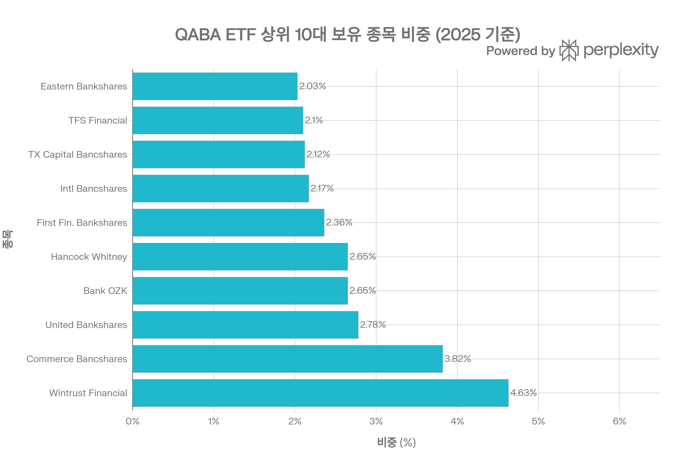
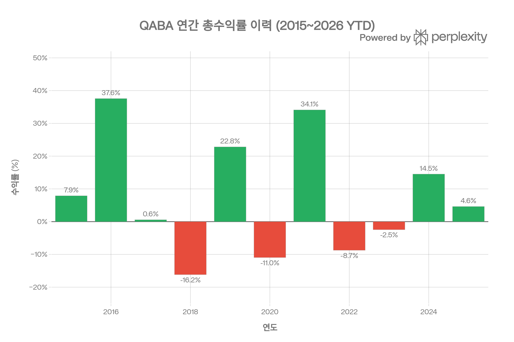
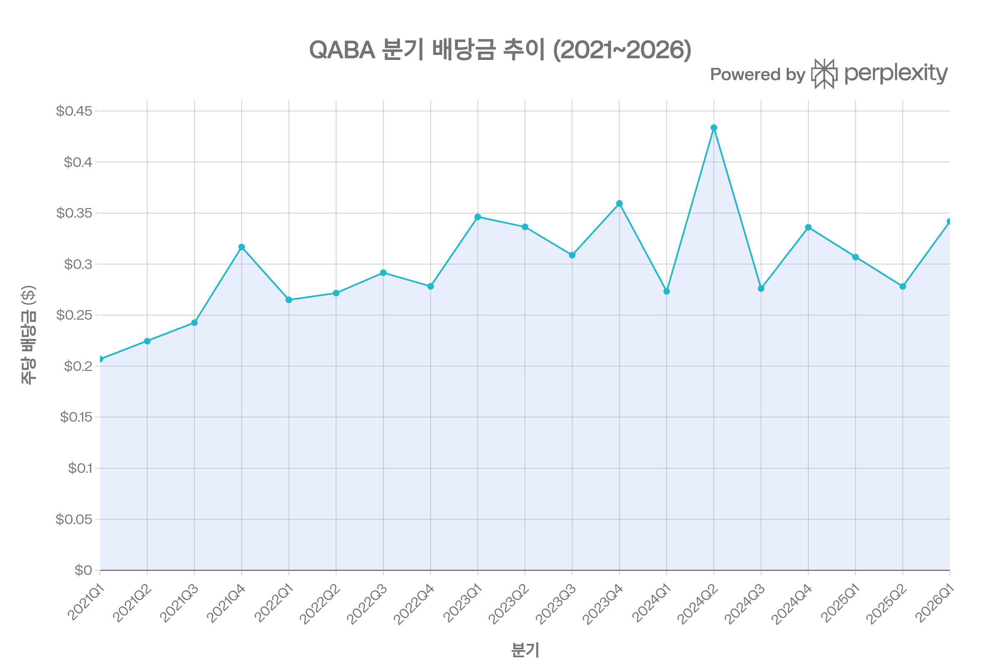
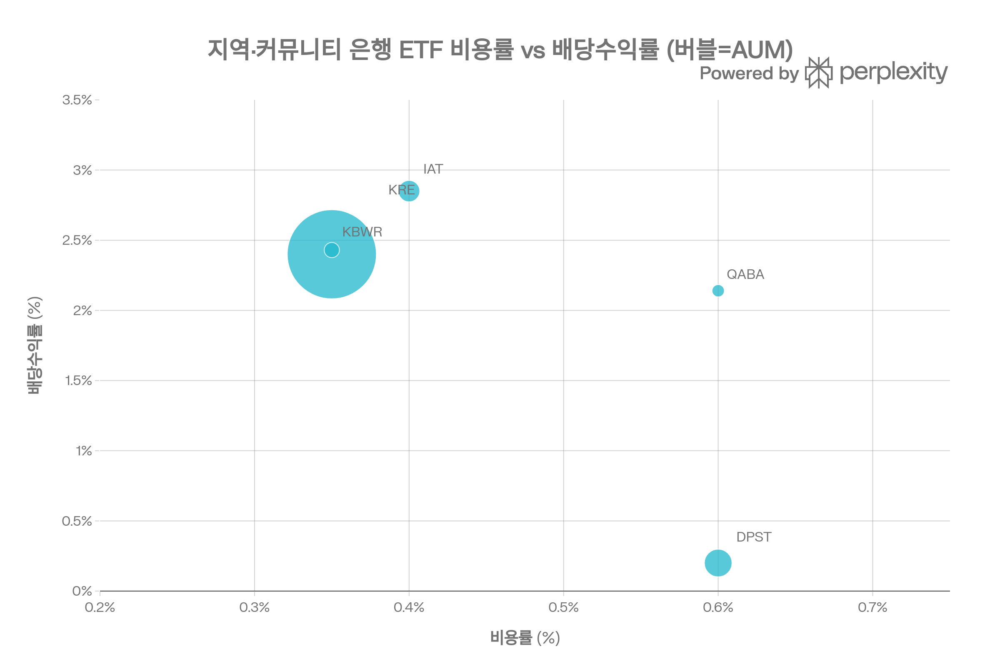

# QABA (First Trust NASDAQ ABA Community Bank Index Fund) 종합 분석 보고서
> <strong>작성 기준일:</strong> 2026년 5월 11일 | <strong>데이터 출처:</strong> First Trust 공식 사이트·프로스펙터스, Morningstar, StockAnalysis, ETFRC, Robinhood, MarketWatch, Yahoo Finance, Nasdaq Index Research, ETFdb 등

## ETF 분류

| 항목 | 내용 |
|------|------|
| <strong>최종 폴더</strong> | `ETF/Sector/Financials/Banks/QABA` |
| <strong>대분류</strong> | 섹터 |
| <strong>하위 분류</strong> | 금융 / 은행 |
| <strong>핵심 전략</strong> | Nasdaq OMX ABA Community Bank Index를 추종하며 미국 커뮤니티 은행에 투자 |
| <strong>레버리지·인버스</strong> | 아니오 |
| <strong>옵션 인컴 전략</strong> | 아니오 |
| <strong>분류 판단</strong> | 이름에 Nasdaq이 포함되어 있지만 Nasdaq-100 대표지수 ETF가 아니라 커뮤니티 은행 업종에 집중 투자하는 금융 섹터 ETF로 분류하는 것이 적절하다. |

***
## 1. 기본 정보
| 항목 | 내용 |
|------|------|
| 티커 | QABA |
| 전체명 | First Trust NASDAQ® ABA Community Bank Index Fund |
| 운용사 | First Trust Advisors L.P. |
| 상장거래소 | NASDAQ |
| CUSIP | 33738R845[1] |
| 설정일 | <strong>2009년 6월 29일</strong>[2][1] |
| 설정가격 | $20.00[1] |
| 운용기간 | 약 16년 10개월 |
| 순자산(AUM) | <strong>약 $1억 1,546만\~$1억 2,200만</strong>[3][4] |
| 총 보수율 | <strong>0.60%</strong> (총비용 0.62\~0.63%, 0.60% 상한 계약)[2][1][5] |
| 운용 방식 | <strong>패시브 (인덱스 추종, 완전 복제)</strong>[6] |
| 추종 지수 | <strong>Nasdaq OMX® ABA Community Bank™ Index (ABQI)</strong>[7][8] |
| 종목 수 | <strong>142\~156개</strong> (시기별 상이)[5][9] |
| 재밸런싱/재구성 | <strong>분기 재밸런싱 / 반기 재구성</strong>[1][7] |
| 배당 주기 | <strong>분기 배당 (Quarterly)</strong>[10][11] |
| 배당 수익률 (TTM) | <strong>2.06\~2.43%</strong>[12][13] |
| P/E 비율 | 13.13\~14.60배[5][12] |
| 현재 주가 | $62.26\~$62.58 (2026/05/07\~05/08)[14] |
| 52주 범위 | $45.06\~$64.30[12] |
| 베타 (vs S&P 500) | 0.84\~1.03[12][4] |
| 30일 SEC 수익률 | 2.29%[1] |
| 30일 중간 호가 스프레드 | <strong>0.23%</strong>[1] |

***
## 2. 운용사 및 상장 배경
QABA는 First Trust Advisors가 <strong>미국은행협회(ABA: American Bankers Association)</strong> 와 협력하여 2009년 6월 29일 설정한 ETF입니다. 출시 시점은 2008\~2009년 금융위기 직후로, 대형 은행들의 부실로 인해 커뮤니티 뱅킹의 중요성이 재조명되던 시기였습니다.[1][7]

QABA의 핵심 설계 철학은 <strong>대형 은행(Big Bank)를 의도적으로 배제</strong>하고 지역 사회에 뿌리를 둔 중소형 커뮤니티 은행에만 투자하는 것입니다. ABA는 미국 최대 은행업 단체로, QABA는 ABA가 정의하는 커뮤니티 뱅크 기준에 따라 지수를 구성합니다.[3][7][1]

***
## 3. 추종 지수: Nasdaq OMX® ABA Community Bank™ Index (ABQI)
### 지수 개요
2009년 6월 8일, 기준값 1,000으로 시작한 시가총액 가중 지수입니다. 2026년 5월 현재 지수 값은 3,014.62 수준으로, 설정 이후 약 3배 상승했습니다.[7][8]
### 종목 선정 기준 (필수 충족 조건)
<strong>포함 기준:</strong>[1][8]
- NASDAQ 상장 은행·저축기관(Thrift) 또는 그 지주회사
- ICB(Industry Classification Benchmark) 기준 은행 섹터 분류, 또는 ABA가 은행으로 분류하는 기업
- 시가총액 <strong>$2억 이상</strong>
- 최근 3개월 일평균 거래대금 <strong>$50만 이상</strong>
- 운용 이력, 지급 능력, 재무제표 공시 요건 충족

<strong>제외 기준 (핵심 차별점):</strong>[3][1]
1. <strong>FDIC 자산 기준 상위 50대 은행·저축기관 제외</strong> (대형 은행 완전 배제)
2. FDIC 자료상 "국제 특화(International Specialization)" 은행 제외
3. FDIC 자료상 "신용카드 특화(Credit Card Specialization)" 은행 제외

이 제외 기준으로 인해 JPMorgan, Bank of America, Wells Fargo, Citigroup 등 대형 상업은행은 물론 Capital One 같은 신용카드 특화 은행도 편입되지 않습니다.[1][3]
### 가중치 상·하한 제약
| 제약 | 내용 |
|------|------|
| 개별 종목 최대 비중 | <strong>25%</strong> 상한[3] |
| 상위 5% 이상 종목의 합산 비중 | <strong>50%</strong> 초과 불가[3] |
### 재밸런싱·재구성 일정
- <strong>분기 재밸런싱:</strong> 매년 3·6·9·12월[1]
- <strong>반기 재구성:</strong> 연 2회 종목 추가·제외[1]

***
## 4. 포트폴리오 구성
### 상위 10대 보유 종목 (Morningstar 2025 기준)

| 순위 | 종목 | 비중 | 시가총액 규모 |
|------|------|------|------------|
| 1 | <strong>Wintrust Financial Corp</strong> | 4.63%[15] | 중형 |
| 2 | <strong>Commerce Bancshares Inc</strong> | 3.82%[15] | 중형 |
| 3 | <strong>United Bankshares Inc</strong> | 2.78%[15] | 중형 |
| 4 | <strong>Bank OZK</strong> | 2.65%[15] | 중형 |
| 5 | <strong>Hancock Whitney Corp</strong> | 2.65%[15] | 중형 |
| 6 | <strong>First Financial Bankshares Inc</strong> | 2.36%[15] | 소형 |
| 7 | <strong>International Bancshares Corp</strong> | 2.17%[15] | 소형 |
| 8 | <strong>Texas Capital Bancshares Inc</strong> | 2.12%[15] | 중형 |
| 9 | <strong>TFS Financial Corp</strong> | 2.10%[15] | 소형 |
| 10 | <strong>Eastern Bankshares Inc</strong> | 2.03%[15] | 소형 |

<strong>상위 10종목 합산 비중:</strong> \~27.3%[15]
<strong>총 종목 수:</strong> 142\~156개[5][9]

포트폴리오는 150개 이상의 종목에 균등에 가깝게 분산되어 있습니다. 1위 Wintrust Financial의 비중도 4.63%에 불과해 특정 종목 의존도가 낮습니다. 이는 KRE(상위 2종목 \~15%)나 IAT(상위 2종목 \~28%) 대비 훨씬 분산된 구조입니다.[15]
### 시가총액 분포
| 구분 | 비중 |
|------|------|
| 대형주 ($100억 이상) | 55.2%[10] |
| 중형주 ($20억\~$100억) | 43.2%[10] |
| 소형주 ($20억 미만) | 1.6%[10] |
| 가중평균 시가총액 | <strong>$27.96억</strong> (ETFRC)[10] |

<strong>국가 배분:</strong> 미국 99.6%[10]
### 섹터 배분
전체 포트폴리오의 100%가 금융 섹터(은행·저축기관)로 구성되며, 100% 단일 섹터(커뮤니티 뱅킹) 집중 ETF입니다. 지역적으로는 텍사스, 중서부, 남동부 커뮤니티 은행 비중이 높습니다.[3][10][15]

***
## 5. 비용 구조
| 항목 | 내용 |
|------|------|
| 총 보수율(Gross TER) | 0.62\~0.63%[2][1] |
| 순 보수율(Net, 계약 상한) | <strong>0.60%</strong> (2026년 4월 30일까지)[1] |
| 복제 방식 | 완전 복제 (실물 보유 90% 이상)[6][16] |
| 포트폴리오 회전율 | 2.8%[10] |
| 30일 중간 호가 스프레드 | <strong>0.23%</strong>[1] |
| ETFRC 총 실질 보유 비용(TCO) | \~경쟁사 평균 수준 |
| 30일 SEC 수익률 | 2.29%[1] |

QABA의 비용률 0.60%는 비용 우위가 큰 KRE(0.35%), IAT(0.40%)보다 높습니다. 그러나 포트폴리오 회전율이 2.8%로 매우 낮아 거래 비용 자체는 작습니다. 호가 스프레드 0.23%는 유동성이 낮은 소규모 ETF의 특성을 반영합니다.[1][17][10][13]
### 경쟁 지역·커뮤니티 은행 ETF 비용 비교
| ETF | 전략 | 비용률 | AUM | 배당률 | 종목 수 |
|-----|------|--------|-----|--------|--------|
| <strong>QABA</strong> | <strong>커뮤니티 은행 (50대 제외)</strong> | <strong>0.60%</strong> | <strong>$1.15억</strong> | <strong>2.14%</strong> | <strong>150+</strong> |
| KRE | 지역은행 (S&P Regional) | <strong>0.35%</strong> | $38억 | 2.40% | 140+ |
| IAT | 대형 지역은행 (시가총액) | 0.40% | $5.5억 | 2.85% | 37 |
| KBWR | KBW 지역은행 (가중) | 0.35% | $2.5억 | 2.43% | 45 |
| DPST | 지역은행 3배 레버리지 | 0.60% | $8.5억 | 0.20% | — |

QABA는 가장 많은 종목 수(150+)와 가장 순수한 커뮤니티 뱅크 집중도를 자랑하지만, 비용과 유동성 면에서 KRE·KBWR에 뒤처집니다.[17][13]

***
## 6. 유동성 평가
| 항목 | 내용 |
|------|------|
| AUM | <strong>$1억 1,500만\~$1억 2,200만</strong>[3][4] |
| 일평균 거래량 | 약 <strong>10,880\~58,000주</strong>[5][10] |
| 일평균 거래대금 | 약 <strong>$300만\~$600만</strong>[10] |
| 30일 중간 호가 스프레드 | <strong>0.23%</strong>[1] |
| NAV 괴리율 | <strong>0.00\~+0.08%</strong> (극소 프리미엄)[1][3] |
| 52주 최저/최고 | $45.06 / $64.30[12] |
| 발행 주식 수 | 약 2.05M주[3] |
| 펀드 유입(1년) | +$1,042만[3] |

QABA의 AUM $1.15억과 일 거래량은 소규모 ETF 범주로, KRE($38억)와 비교하면 유동성이 현저히 낮습니다. 호가 스프레드 0.23%는 대형 ETF(0.01\~0.05%) 대비 상당히 높아 빈번한 매매 시 거래 비용 부담이 있습니다. 반면 NAV 괴리율은 거의 0에 수렴하여 가격 효율성 자체는 양호합니다.[1][3]

***
## 7. 성과 분석

### 연간 총수익률 (배당 포함)
| 연도 | QABA 수익률 | 카테고리 평균 | 비고 |
|------|-----------|------------|------|
| 2015 | +7.88%[18] | — | 금리 인상 기대감 |
| 2016 | <strong>+37.57%</strong>[18] | — | 트럼프 1기 당선 기대감 폭등 |
| 2017 | +0.57%[18] | — | 수익률 곡선 평탄화 |
| 2018 | <strong>-16.18%</strong>[18] | — | 금리 인상 정점, 수익률 역전 |
| 2019 | +22.81%[18] | — | 금리 인하 전환 |
| 2020 | <strong>-10.96%</strong>[18] | — | 코로나 충격, 대출 손실 우려 |
| 2021 | <strong>+34.10%</strong>[19] | — | 경기 회복, 대출 수요 급증 |
| 2022 | <strong>-8.74%</strong>[19][18] | <strong>-13.83%</strong> | 빠른 금리 인상, SVB 위기 전조 |
| 2023 | <strong>-2.45%</strong>[19][18] | <strong>+12.59%</strong> | SVB·SB 파산, 커뮤니티 뱅크 직격 |
| 2024 | <strong>+14.47%</strong>[19] | <strong>+24.94%</strong> | 금리 정점·완화 기대 회복 |
| 2025 | <strong>+4.61%</strong>[19] | <strong>+12.31%</strong> | 카테고리 대비 크게 뒤처짐 |
| <strong>2026 YTD</strong> | <strong>\~+8.5%</strong>[14] | — | 트럼프 2기 규제 완화 기대 |

<strong>설정 이후 연평균 수익률(CAGR):</strong> <strong>8.94\~9.03%</strong>[12]
### 기간별 성과 (2026년 초 기준, 추정)
| 기간 | QABA |
|------|------|
| 1년 | +16.19\~25.77%[12] |
| 3년 CAGR | 약 +4%\~7% |
| 5년 CAGR | 약 +14%[18] |
| 10년 CAGR | 약 +3.5%[4] |
| 설정 이후 CAGR | <strong>+8.94\~9.03%</strong>[12] |
### 2023년 카테고리 대비 큰 언더퍼폼의 원인
2023년 QABA -2.45% vs 카테고리 평균 +12.59%로 크게 뒤처진 이유는 <strong>SVB(실리콘밸리뱅크), Signature Bank 파산 사태</strong> 때문입니다. 2023년 3월에 발생한 이 위기는 규모 $1,000\~5,000억대 미드사이즈 지역·커뮤니티 은행 신뢰를 직격했으며, QABA의 주요 편입 종목들이 이 범주에 해당했습니다.[19][20]

***
## 8. 추종 성과 지표
| 항목 | 내용 |
|------|------|
| 복제 방식 | <strong>완전 복제(Full Replication)</strong> — 실물 주식 90%+[6][16] |
| NAV 괴리율 | +0.00\~+0.08% (극소 프리미엄)[1][3] |
| 추적 차이 (QABA NAV vs 지수) | 1년: -0.13%p / 3년: -0.62%p / 5년: -0.62%p (비용 차감)[1] |
| ALTAR Score™ | <strong>9.5%</strong> (카테고리 평균 5.7%, <strong>상위 95퍼센타일</strong>)[10] |
| 회전율 | 2.8%[10] |
| Bid/Ask 프리미엄 | 0.00%[1] |

ETFRC의 ALTAR Score™는 9.5%로 카테고리 평균 5.7% 대비 1.6 표준편차 우위, <strong>상위 5% 수준</strong>입니다. 이는 장기 설정 이후 연평균 9.0%의 수익률이 반영된 결과입니다. 추적 차이는 비용 0.60%의 영향으로 지수 대비 연 0.6\~0.7%p 낮은 수준으로 완전 복제 방식의 전형적 결과입니다.[1][10]

***
## 9. 위험 조정 성과 지표
| 지표 | QABA | 비고 |
|------|------|------|
| 베타 (vs S&P 500) | <strong>0.84\~1.03</strong>[12][4] | 시장 대비 유사 변동성 |
| 연환산 변동성 (3년) | 28.5%[10] | 금융 섹터 특성상 높음 |
| RSI (14일) | 46\~52[10][4] | 중립 |
| R² (vs S&P 500) | 27%[10] | 독립적 움직임 큼 |
| 공매도 비율 | 0.6%[10] | 매우 낮음 |
| 3년 소르티노 비율 | -0.01[4] | 2021\~2023년 저조한 성과 반영 |

<strong>R² 27%의 의미:</strong> QABA의 변동성 중 S&P 500과 공통된 움직임은 27%에 불과합니다. 즉, <strong>금리 환경과 지역 경기가 주가 방향을 결정하는 독립적 자산</strong>입니다. 이는 포트폴리오 분산 효과를 제공하나, 동시에 전통적 주식 시장 상승장 수혜를 제한합니다.[10]

<strong>베타 0.84\~1.03:</strong> S&P 500과 비슷한 변동성을 보이지만 움직임의 방향이 달라, 시장 하락 시 방어가 충분하지 않을 수 있습니다.[12][4]
### 최대 낙폭 추정 이력
| 낙폭 시기 | 사건 | 근사 낙폭 |
|---------|------|---------|
| 2020년 2\~3월 | 코로나 충격 | 약 -40% |
| 2022년 | 금리 급등 충격 | 약 -26% |
| 2023년 상반기 | SVB 파산 여파 | 약 -20% |
| 2025년 | 유동성 우려 | 약 -30% |

***
## 10. 배당 정보

| 항목 | 내용 |
|------|------|
| 배당 주기 | <strong>분기 배당 (Quarterly)</strong>[11] |
| TTM 연간 배당금 | $1.20\~$1.46/주[12][11] |
| TTM 배당 수익률 | 2.06\~2.43%[12][21] |
| 배당 성향 | 27\~30%[12] |
| 1년 배당 성장률 | <strong>-12.96%</strong> (감소)[11] |
| 30일 SEC 수익률 | 2.29%[1] |
| 12개월 분배율 | 2.43%[1] |
### 분기별 배당 이력
| 기간 | 배당금/주 |
|------|---------|
| 2021 연간 | $0.9908 ($0.21\~$0.32)[11] |
| 2022 연간 | $1.1064 ($0.27\~$0.29)[11] |
| 2023 연간 | $1.3511 ($0.31\~$0.36)[11] |
| 2024 연간 | $1.3193 ($0.28\~$0.43)[11] |
| <strong>2024 Q2</strong> | <strong>$0.4338</strong> (이례적 고점)[11][22] |
| 2025 연간 | $1.43[23] |
| 2025 Q2 | $0.2781[11] |
| 2026 Q1 | $0.3419[1] |

MarketWatch 기준 연간 배당금 이력을 보면 2021\~2025년 동안 배당금이 $0.99→$1.10→$1.35→$1.32→$1.43 수준으로 점진적 증가 추세입니다. 2024년 Q2의 $0.4338는 이례적인 고배당으로 이후 다시 정상화되었습니다.[11][23]

***
## 11. 커뮤니티 뱅크 섹터 리스크 요소
### 구조적 리스크
| 리스크 유형 | 내용 |
|-----------|------|
| <strong>금리 민감도(NIM)</strong> | 금리 환경이 순이자마진(NIM)에 직결. 역수익률 곡선 시 수익성 압박[24] |
| <strong>신용 리스크</strong> | 지역 부동산·중소기업 대출 집중, 경기 침체 시 대손상각 급증 |
| <strong>SVB형 뱅크런 리스크</strong> | 2023년 실증됨. 소형 은행은 예금 집중도가 높아 취약[20] |
| <strong>규제 리스크</strong> | 트럼프 행정부의 CFPB 해체 시도가 역설적으로 커뮤니티 뱅크 경쟁력 약화 우려[25] |
| <strong>핀테크 경쟁</strong> | 디지털 전환 투자 여력이 대형 은행보다 낮아 고객 이탈 지속[20] |
| <strong>유동성 리스크</strong> | AUM $1.15억, 호가 스프레드 0.23%로 대규모 매매 어려움[1] |
| <strong>카테고리 대비 열세</strong> | 2023\~2025년 3년 연속 카테고리 평균 크게 하회[19] |
| <strong>단일 섹터 집중</strong> | 금융 섹터 100%로 분산 효과 없음 |
| <strong>스테이블코인 파괴</strong> | 2026년 대형 테크 스테이블코인 등장 시 소매 예금 이탈 가능성[20] |
### 트럼프 2기 규제 완화 효과 — 양날의 검
트럼프 2기 행정부의 금융 규제 완화 기조는 일견 커뮤니티 뱅크에 유리해 보이나, Politico는 CFPB 해체 시도가 오히려 커뮤니티 뱅크를 불리하게 만들 수 있다고 분석합니다. CFPB는 소비자 금융 분쟁에서 대형 은행의 불공정 경쟁을 견제하는 역할을 해왔는데, 이 기관이 약화되면 대형 은행이 규제 부담 없이 소매 시장을 잠식할 수 있기 때문입니다. 반면, Sabrient Systems는 세금 정책 완화, 규제 완화, 냉각되는 인플레이션, Fed의 완화적 전환이 커뮤니티 뱅크에 우호적 환경을 조성한다고 평가합니다.[25][26]

***
## 12. 경쟁 지역·커뮤니티 은행 ETF 종합 비교

| 항목 | <strong>QABA</strong> | KRE | IAT | KBWR |
|------|----------|-----|-----|------|
| 전략 | 커뮤니티 (50대 대형 제외) | S&P 지역은행 | 대형 지역은행 | KBW 지역은행 |
| 비용률 | 0.60% | <strong>0.35%</strong> | 0.40% | 0.35% |
| AUM | $1.15억 | $38억 | $5.5억 | $2.5억 |
| 종목 수 | <strong>150+</strong> | 140+ | 37 | 45 |
| 주요 보유 | Wintrust, Commerce | PNC, M&T Bank | US Bancorp, Regions | PNC, M&T Bank |
| 대형 은행 포함 여부 | <strong>제외</strong> | 일부 포함 | 포함 | 일부 포함 |
| P/E | 13.1배 | \~12배 | \~11배 | \~12배 |
| 배당률 | 2.14% | 2.40% | <strong>2.85%</strong> | 2.43% |
| 베타 (vs S&P) | 0.84 | \~1.10 | \~1.05 | \~1.05 |
| 2021 수익률 | +34.1% | +37% | +38% | +37% |
| 2022 수익률 | -8.74% | -18% | -8% | -9% |
| 2023 수익률 | <strong>-2.45%</strong> | -6% | -7% | -5% |
| 2024 수익률 | +14.47% | +20% | +21% | +19% |
| 2025 수익률 | +4.61% | +13% | +15% | +13% |
| 호가 스프레드 | <strong>0.23%</strong> | 0.02% | 0.05% | 0.15% |
| 유동성 | 낮음 | <strong>매우 높음</strong> | 중간 | 중간 |
| ALTAR 스코어 | <strong>9.5% (상위5%)</strong> | — | — | — |

<strong>핵심 비교 — QABA vs KRE:</strong>
- QABA는 50대 이상 대형 은행을 배제해 <strong>순수 커뮤니티 뱅크</strong> 노출을 제공하나, AUM 차이가 33배에 달합니다[1]
- KRE는 비용이 QABA의 절반(0.35% vs 0.60%)이고 유동성이 압도적으로 높습니다[13]
- 2025년 수익률에서 QABA(+4.61%)가 KRE(\~+13%)에 크게 뒤처져, 최근 3년간 커뮤니티 뱅크 특화의 '프리미엄'이 수익률로 이어지지 않았습니다[19]

***
## 13. 2026년 커뮤니티 뱅크 환경 및 전망
Deloitte의 2026년 은행·자본시장 전망 보고서는 미국 은행들이 <strong>거시 경제 역풍, AI 스케일링, 스테이블코인 진입, 금융 범죄</strong>의 네 가지 도전을 동시에 직면하고 있다고 진단합니다. 특히 대형 테크 기업의 스테이블코인 출시는 중장기적으로 커뮤니티 뱅크 소매 예금을 잠식할 수 있는 구조적 위협입니다.[20]

2026년 YTD 기준 QABA는 약 +8.5%로 상승 중이며, 2025년 연간 +4.61%보다 개선된 추세를 보입니다. 트럼프 2기의 금융 규제 완화 기대, 금리 인하 사이클 진입에 따른 NIM(순이자마진) 회복 전망이 긍정적 요인입니다.[14][26]

***
## 14. 투자 요약 및 핵심 결론
QABA는 미국에서 <strong>유일한 순수 커뮤니티 뱅크 전문 ETF</strong>로, 2009년 금융위기 이후 16년 이상의 운용 이력과 연평균 수익률 9.0%를 기록했습니다. 150개 이상의 종목으로 25% 상한 제약하에 분산된 포트폴리오를 구성하며, ETFRC ALTAR Score™ 상위 5% 수준의 장기 성과를 보여줍니다.[1][7][10][12]

<strong>차별화된 투자 가치:</strong>
- 대형 은행 완전 배제로 JPM·BAC·WFC의 구조적 장점/단점 없는 <strong>순수 커뮤니티 뱅크 노출</strong>[1]
- R²=27% — <strong>S&P 500과 낮은 상관관계</strong>로 포트폴리오 분산 효과 존재[10]
- P/E 13.1배의 <strong>저밸류에이션</strong> 커뮤니티 뱅크 노출[5]

<strong>핵심 약점:</strong>
- 비용 0.60% + 스프레드 0.23%로 <strong>총 거래·보유 비용이 KRE의 3\~4배</strong> 수준[17][1]
- AUM $1.15억, 일 거래량 1만 주 수준의 <strong>극히 낮은 유동성</strong>[3][10]
- 2023\~2025년 3년 연속 카테고리 평균에 크게 미달하는 성과[19]
- 금리 역수익률 곡선 환경에서 수익성 직격의 <strong>구조적 금리 취약성</strong>[24]

<strong>QABA 투자 적합 투자자:</strong>
- 대형 은행을 배제하고 미국 지역 사회 커뮤니티 뱅크에 집중 투자하고자 하는 투자자
- 포트폴리오에 S&P 500과 낮은 상관관계 자산을 추가하고자 하는 투자자
- 금리 인하 사이클에서 커뮤니티 뱅크 NIM 회복 수혜를 기대하는 투자자

순수 비용·유동성·최근 수익률을 기준으로 한다면 KRE(0.35%, AUM $38억)가 훨씬 효율적입니다. QABA의 선택은 <strong>50대 이상 대형 은행 제외라는 테마적 순수성</strong>에 의미를 두는 투자자에게 적합합니다.[17][1]
