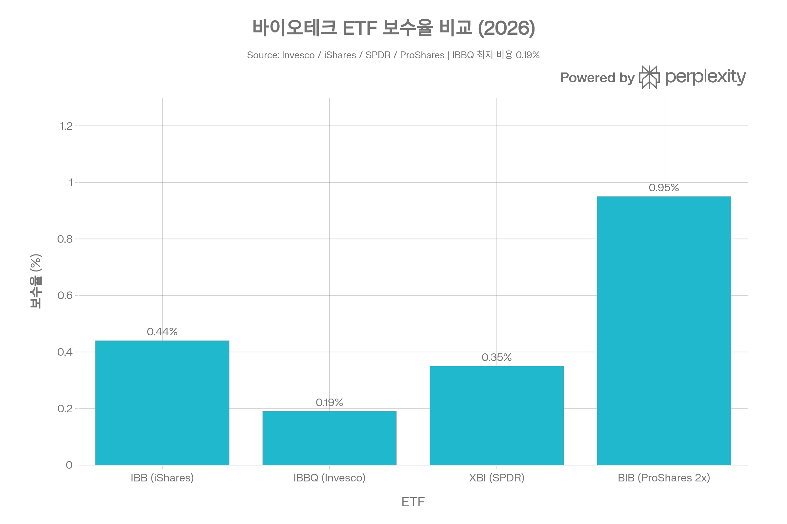
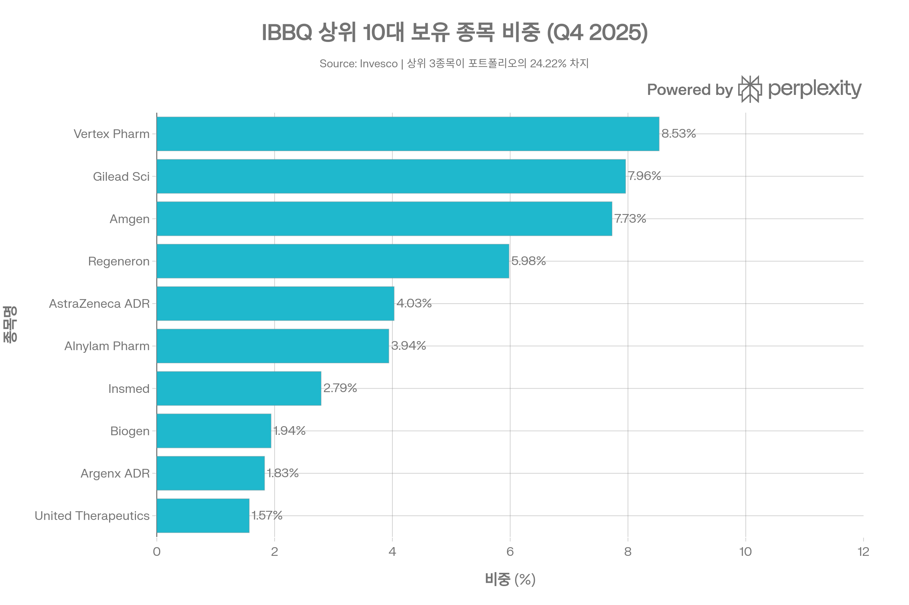
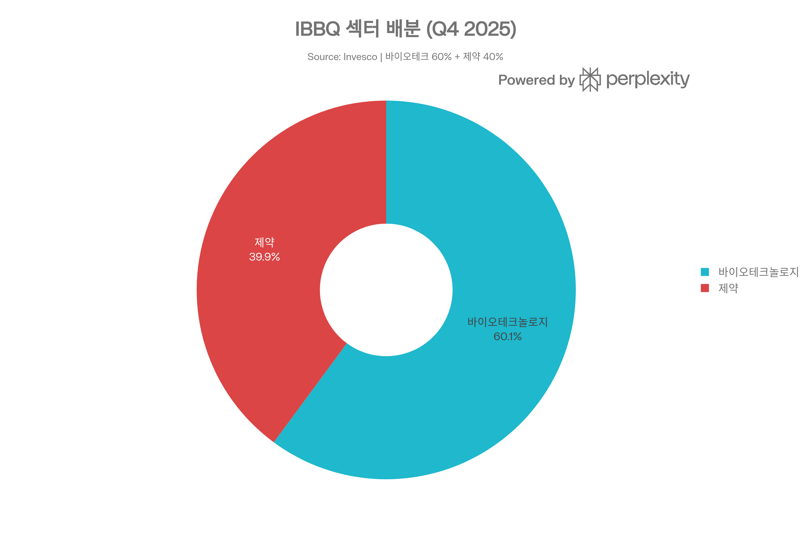
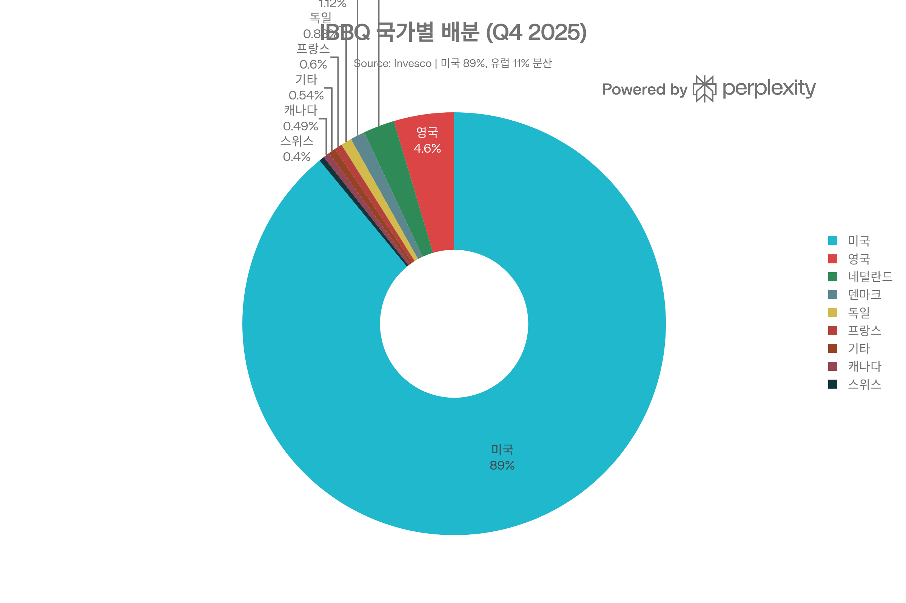
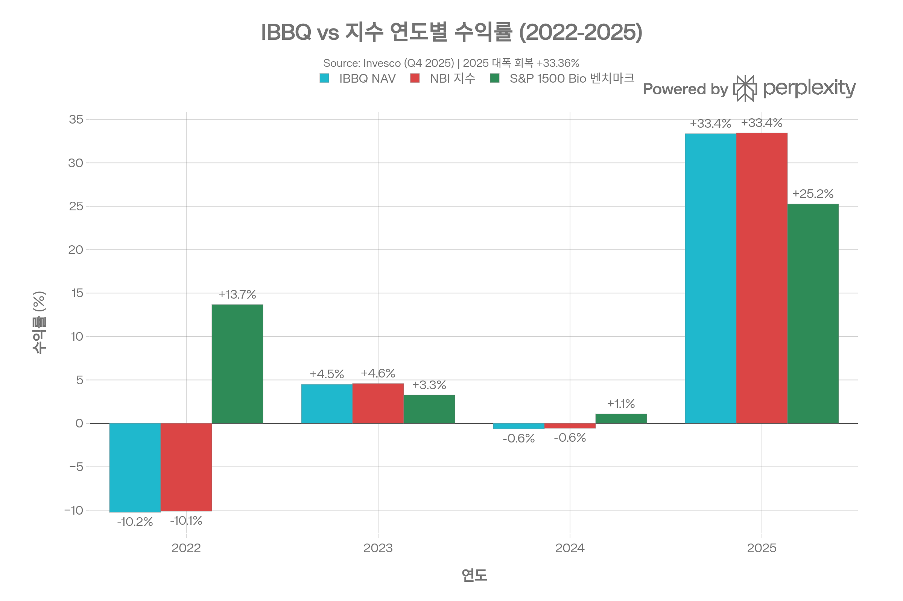

## 요약

> <strong>작성일</strong>: 2026년 5월 25일 기준 데이터 | <strong>운용사</strong>: Invesco Capital Management LLC | <strong>카테고리</strong>: 바이오테크·제약 패시브 ETF

***
## ETF 분류

| 항목 | 내용 |
|------|------|
| <strong>최종 폴더</strong> | `ETF/Sector/Health Care/Biotechnology/IBBQ` |
| <strong>대분류</strong> | 섹터 |
| <strong>하위 분류</strong> | Health Care / Biotechnology |
| <strong>핵심 전략</strong> | Nasdaq Biotechnology Index 추종 |
| <strong>운용 방식</strong> | 패시브 |
| <strong>레버리지·인버스 여부</strong> | 아니오 |
| <strong>옵션 인컴 전략 여부</strong> | 아니오 |

IBBQ는 명칭과 추종 지수에 `Nasdaq`이 포함되어 있지만 Nasdaq-100 대표지수 ETF가 아니라, 바이오테크놀로지 및 제약 기업에 집중 투자하는 <strong>헬스케어 내 바이오테크 섹터 ETF</strong>입니다. ETF 분류 기준상 산업 섹터 노출이 명확하므로 `Sector/Health Care/Biotechnology`로 분류합니다.

***
## 1. 기본 정보
IBBQ는 <strong>Invesco Capital Management LLC</strong>가 운용하는 <strong>Nasdaq Biotechnology Index(NBI) 추종 패시브 ETF</strong>로, 2021년 6월 11일 설정되었다. 나스닥에 상장된 바이오테크놀로지 및 제약 기업에 집중 투자하는 상품으로, 동일 지수를 추종하는 iShares IBB(AUM $8.5B)와 <strong>동일한 지수 기반이나 보수율이 절반 이하</strong>인 저비용 대안으로 포지셔닝된다.

| 항목 | 내용 |
|------|------|
| <strong>정식 명칭</strong> | Invesco Nasdaq Biotechnology ETF |
| <strong>티커</strong> | IBBQ (Nasdaq) |
| <strong>설정일</strong> | 2021년 6월 11일 |
| <strong>운용사</strong> | Invesco Capital Management LLC |
| <strong>배포사</strong> | Invesco Distributors, Inc. |
| <strong>포트폴리오 매니저</strong> | Peter Hubbard, Michael Jeanette, Tony Seisser, Pratik Doshi |
| <strong>상장거래소</strong> | Nasdaq |
| <strong>순자산(AUM)</strong> | $66.27M (2026.05.22 기준) |
| <strong>보유 종목 수</strong> | 255 (2026.05.22 기준) |
| <strong>총 보수(TER)</strong> | 0.19% |
| <strong>추종 지수</strong> | Nasdaq Biotechnology Index (NBI / Bloomberg: XNBI) |
| <strong>지수 제공자</strong> | Nasdaq, Inc. |
| <strong>관리 스타일</strong> | 패시브(규칙 기반) |
| <strong>복제 방식</strong> | 완전 복제(Physical) |
| <strong>옵션 거래 가능</strong> | 가능 |
| <strong>30일 SEC 수익률</strong> | 0.45% |
| <strong>P/B 비율</strong> | 7.70 (2025.12.31) |
| <strong>P/E 비율</strong> | 3.90 (2025.12.31) |
| <strong>자기자본이익률(ROE)</strong> | -3.89% |
| <strong>가중 평균 시가총액</strong> | $62,480M ($62.5B) |

***
## 2. 추종 지수: Nasdaq Biotechnology Index (NBI)
NBI는 나스닥에 상장된 기업 중 ICB(Industry Classification Benchmark) 기준으로 <strong>바이오테크놀로지 또는 제약 섹터</strong>로 분류된 종목으로 구성되는 지수다. BIB(ProShares Ultra Nasdaq Biotechnology ETF, 2x 레버리지)와 동일한 기초 지수를 사용한다.
### 지수 가중치 방식: 티어드(Tiered) 가중
NBI는 단순 시가총액 가중이 아닌 <strong>수정 시가총액 가중(Modified Market-Cap Weighted)</strong> 방식을 채택한다:
- 시가총액 기준으로 초기 순위 결정
- 단일 종목 최대 비중 8% 상한 적용
- 소형주에 추가 비중 배분(Tiered 조정)

이 방식은 순수 시가총액 가중(IBB가 추종하는 ICE Biotechnology Index)보다 상위 대형주 집중도를 완화하는 효과가 있다.
### 리밸런싱 일정
- <strong>구성 종목 재편(Reconstitution)</strong>: 매년 12월
- <strong>분기 리밸런싱</strong>: 3월, 6월, 9월, 12월
- <strong>포트폴리오 회전율</strong>: 약 17%(연간)

***
## 3. 추종 성과 지표
### NAV 대비 시장가격 괴리율
| 항목 | 수치 |
|------|------|
| <strong>NAV 할인/프리미엄</strong> | -0.004% (거의 완전 일치) |
| <strong>평균 호가 스프레드</strong> | 0.10% |
| <strong>추적 오차(Tracking Error)</strong> | 매우 낮음 (NAV vs 지수 수익률 차이 약 0.07%) |

Q4 2025 팩트시트 기준 IBBQ NAV와 NBI 지수 간 수익률 차이는 연간 0.07\~0.09%p 수준으로 보수율(0.19%)과 비교하면 놀랍도록 정밀한 추적 성과를 보여준다.
### 추적 차이(Tracking Difference) 분석
| 기간 | ETF-NAV | NBI 지수 | 추적 차이 |
|------|---------|---------|--------|
| 2025년(YTD) | 33.36% | 33.43% | <strong>-0.07%</strong> |
| 2024년 | -0.63% | -0.57% | <strong>-0.06%</strong> |
| 2023년 | 4.49% | 4.59% | <strong>-0.10%</strong> |
| 2022년 | -10.24% | -10.12% | <strong>-0.12%</strong> |
| 설정 이후 | 3.29% | 3.36% | <strong>-0.07%</strong> |

추적 차이가 보수율(0.19%)보다 낮게 유지되는 것은 <strong>증권 대여 수익(Securities Lending Revenue)</strong>이 비용을 상쇄하고 있음을 시사한다.

시장가 수익률은 NAV 수익률보다 약간 높게 나타나는 경향이 있다(예: 2025년 시장가 33.51% vs NAV 33.36%). 이는 장중 거래 시점과 종가 NAV의 차이에서 발생하는 미세한 프리미엄 현상이다.

***
## 4. 비용 구조
### 총 비용
| 항목 | 수치 |
|------|------|
| <strong>관리 보수</strong> | 0.19% |
| <strong>총 보수(TER)</strong> | 0.19% |
| <strong>포트폴리오 회전율</strong> | 17%(연간) |
| <strong>증권 대여 비용</strong> | 해당 없음(수익 측) |
| <strong>최대 단기 자본이득세율</strong> | 39.60% |
| <strong>최대 장기 자본이득세율</strong> | 20.00% |
| <strong>K-1 세금 양식</strong> | 해당 없음(1099 처리) |
### 경쟁 ETF 보수율 비교

*▲ 바이오테크 ETF 보수율 비교: IBBQ 0.19%가 동 카테고리 최저 수준*

| ETF | 운용사 | 추종 지수 | 보수율 | AUM |
|-----|--------|---------|------|-----|
| <strong>IBBQ</strong> | Invesco | <strong>Nasdaq Biotechnology Index</strong> | <strong>0.19%</strong> | $66.27M |
| IBB | iShares(BlackRock) | ICE Biotechnology Index | 0.44% | <strong>$8.53B</strong> |
| XBI | SPDR(State Street) | S&P Biotechnology Select Industry | 0.35% | $4.87B |
| BIB | ProShares | Nasdaq Biotechnology (2x 레버리지) | 0.95% | $71.3M |

IBBQ의 0.19% 보수율은 IBB 대비 절반 이하(IBB: 0.44%, -57%), XBI 대비도 저렴한 수준이다. 다만 IBB(AUM $8.53B)에 비해 IBBQ의 AUM($66.27M)은 약 128배 적어, 규모의 경제 측면에서 여전히 큰 격차가 있다.

***
## 5. 유동성 평가
| 항목 | 수치 |
|------|------|
| <strong>AUM</strong> | $66.27M (2026.05) |
| <strong>일평균 거래량(ADV)</strong> | 약 20,720주 |
| <strong>일평균 거래대금(ADV 추정)</strong> | 약 $607K/일(주가 $29.3 × 20,720주) |
| <strong>호가 스프레드(평균)</strong> | 0.10% |
| <strong>52주 최고/최저</strong> | $30.50 / $19.54 |
| <strong>숏 인터레스트</strong> | 1.8% |
| <strong>RSI(상대강도지수)</strong> | 63 |

IBBQ의 평균 거래량 2만여 주는 IBB(일평균 180만\~180만 주)와 비교하면 미미한 수준이다. 소규모 투자자에게는 유동성이 충분하지만, 대규모 기관 매매에는 <strong>호가 충격(Market Impact) 비용</strong>이 발생할 수 있다.

유동성 리스크와 관련해 2024년 Seeking Alpha 분석은 "AUM $38M, 보수율 0.19%로 Invesco에 수익성이 없을 수 있어 <strong>청산 리스크</strong>가 있다"고 경고했으나, 이후 AUM이 $66.27M까지 증가해 우려가 어느 정도 완화되었다. 그러나 AUM $100M 미만은 여전히 ETF 업계의 청산 위험 임계 기준을 밑도는 수준으로 주의가 필요하다.

***
## 6. 포트폴리오 구성
### 자산 유형
| 구분 | 비중 |
|------|------|
| 미국 주식 | 88.28% |
| 비미국 주식 | 11.72% |
| 현금 | 0.01% |
| <strong>합계</strong> | 100.01% |
### 상위 10대 보유 종목 (Q4 2025 기준)

*▲ IBBQ 상위 10대 보유 종목: 상위 3종목(Vertex, Gilead, Amgen)이 포트폴리오의 24.22% 차지*

| 순위 | 종목명 | 비중 |
|------|--------|------|
| 1 | Vertex Pharmaceuticals | 8.53% |
| 2 | Gilead Sciences | 7.96% |
| 3 | Amgen | 7.73% |
| 4 | Regeneron Pharmaceuticals | 5.98% |
| 5 | AstraZeneca ADR | 4.03% |
| 6 | Alnylam Pharmaceuticals | 3.94% |
| 7 | Insmed | 2.79% |
| 8 | Biogen | 1.94% |
| 9 | Argenx ADR | 1.83% |
| 10 | United Therapeutics | 1.57% |
| <strong>상위 10종목 합계</strong> | | <strong>46.30%</strong> |

2026년 5월 기준으로는 포트폴리오 재편이 이루어져 상위 10종목 비중이 41.18%로 소폭 감소했다. 상위 종목에 Gilead Sciences(7.38%), Vertex(7.35%), Amgen(7.06%), Regeneron(5.95%)이 포함되며, Revolution Medicines(RVMD, 2.29%), Illumina(ILMN, 1.76%) 등이 새롭게 상위권에 진입했다.
### 섹터 배분

*▲ IBBQ 섹터 배분: 바이오테크놀로지 60.11%, 제약 39.89%*

| 섹터 | 비중 |
|------|------|
| 바이오테크놀로지 | 60.11% |
| 제약 | 39.89% |
| <strong>헬스케어 합계</strong> | <strong>100%</strong> |
### 국가별·지역별 배분

*▲ IBBQ 국가별 배분: 미국 89.04%, 유럽 약 11% 분산*

| 국가/지역 | 비중 |
|----------|------|
| 미국 | 89.04% |
| 영국 | 4.60% |
| 네덜란드 | 2.38% |
| 덴마크 | 1.12% |
| 독일 | 0.83% |
| 프랑스 | 0.60% |
| 캐나다 | 0.49% |
| 스위스 | 0.40% |
| 기타 | 0.54% |

해외 편입 비중은 약 11%이며, 주요 편입 해외 종목에는 AstraZeneca ADR(영국), Argenx ADR(네덜란드), Novo Nordisk ADR(덴마크) 등이 포함된다. 이는 IBBQ가 IBB(ICE 지수, ADR 편입 적음)보다 글로벌 바이오파마에 더 넓게 노출됨을 의미한다.
### 시가총액 분포
| 시가총액 구분 | 비중 |
|------------|------|
| 대형주(>$10B) | 61.6% |
| 중형주($2\~10B) | 20.8% |
| 소형주(<$2B) | 11.8% |
| 선진국 시장 | 91.7% |
| 신흥 시장 | 1.3% |

***
## 7. 성과 분석
### 기간별 수익률 (2025.12.31 기준)
| 기간 | IBBQ (NAV) | IBBQ (시장가) | NBI 지수 | S&P 1500 Bio |
|------|-----------|------------|---------|------------|
| <strong>YTD 2025</strong> | <strong>33.36%</strong> | 33.51% | 33.43% | 25.25% |
| <strong>1년</strong> | <strong>33.36%</strong> | 33.51% | 33.43% | 25.25% |
| <strong>3년(연환산)</strong> | <strong>11.46%</strong> | 11.51% | 11.54% | 9.35% |
| <strong>설정 이후(연환산)</strong> | <strong>3.29%</strong> | 3.30% | 3.36% | 9.20% |
| <strong>2022년</strong> | -10.24% | — | -10.12% | 13.68% |
| <strong>2023년</strong> | 4.49% | — | 4.59% | 3.26% |
| <strong>2024년</strong> | -0.63% | — | -0.57% | 1.09% |
| <strong>2026 YTD</strong> | +3.64%(2026.3.10) | — | — | — |

*▲ IBBQ 연도별 수익률: 2022년(-10.24%), 2024년(-0.63%)의 하락 후 2025년 강한 반등(+33.36%)*

설정 이후 연환산 수익률 3.29%는 S&P 1500 Bio 벤치마크(9.20%)를 크게 밑돈다. 이는 2021\~2022년 바이오테크 전반의 급락기가 설정 시점과 맞물린 결과로, 더 오랜 역사를 가진 IBB(설정 2001년)보다 불리한 기산점을 갖는다. $10,000 투자 시 설정\~2025.12.31 기준 IBBQ는 $11,586 달성 vs NBI 지수 $11,624(Growth of $10,000).
### 위험 조정 성과 지표
| 지표 | 수치 | 출처 |
|------|------|------|
| <strong>최대 낙폭(MDD)</strong> | <strong>-37.94%</strong> (2022.06.13) | PortfoliosLab |
| <strong>샤프 지수(1년)</strong> | <strong>-0.38</strong> (2025.05 기준) | PortfoliosLab |
| <strong>샤프 지수(3년)</strong> | 0.52 | Morningstar |
| <strong>표준편차(1년)</strong> | 16.27% | Morningstar |
| <strong>표준편차(3년)</strong> | 18.02% | Morningstar |
| <strong>베타(vs S&P 500)</strong> | 0.86 | Public.com |
| <strong>변동성(연환산)</strong> | 24.1%(YTD 2025) | ETFRC |
| <strong>현재 낙폭</strong> | -25.04%(설정 이후 고점 대비) | PortfoliosLab |
| <strong>위험 대비 수익 순위</strong> | 하위 6%ile (1/100위) | PortfoliosLab |
| <strong>IBB와의 상관계수</strong> | <strong>0.98</strong> | 매우 높은 동행성 |
| <strong>XBI와의 상관계수</strong> | <strong>0.91</strong> | 높은 동행성 |

샤프 지수가 음수(-0.38)로 나타나는 것은 2025년 초\~중반 바이오테크 섹터 하락 압력을 반영한다. 그러나 2025년 연간으로는 +33.36%의 강한 회복을 보였다. 설정 이후 최대 낙폭 -37.94%는 동기간 IBB(-62.85%)보다 훨씬 낮아, 대형 바이오파마 중심 포트폴리오의 방어력을 보여준다.

***
## 8. 배당 정보
IBBQ는 <strong>분기 배당</strong>을 지급한다.

| 항목 | 수치 |
|------|------|
| <strong>배당 수익률</strong> | 0.85%(2026.05.05 기준) |
| <strong>연간 배당(주당)</strong> | $0.25 |
| <strong>배당 지급 주기</strong> | 분기(3·6·9·12월) |
| <strong>최근 배당(2026.03.27)</strong> | $0.0361/주 |
| <strong>최근 기준일</strong> | 2026년 3월 23일 |
| <strong>배당 성장률(1년)</strong> | -$0.0545 감소 |
| <strong>페이아웃 비율</strong> | 17.11% |
| <strong>연속 배당 증가 연수</strong> | 3년 연속 증가 후 최근 감소 |
### 최근 배당 이력
| 기준일 | 배당액(/주) | 지급일 |
|--------|-----------|-------|
| 2026.03.23 | $0.0361 | 2026.03.27 |
| 2025.09.19 | $0.0958 | — |
| 2025.06.23 | $0.0287 | 2025.06.27 |
| 2025.03.24 | $0.0402 | 2025.03.28 |
| 2024.12.23 | $0.0619 | 2024.12.27 |
| 2024.09.23 | $0.0894 | — |
| 2024.06.24 | $0.0506 | — |

배당액이 분기마다 큰 폭으로 변동하는 것은 포트폴리오 내 배당주 비중 및 기업별 배당 정책에 따른 자연스러운 현상이다. 2025년 9월의 $0.0958이 최근 최고치였으며, 이후 하락세를 보이고 있다.

***
## 9. 리스크 요소
### 핵심 투자 리스크
<strong>① 섹터 집중 리스크(Sector Concentration Risk)</strong>
- 헬스케어(바이오테크+제약) 100% 집중 투자
- FDA 규제 결정, 임상시험 실패, 특허 절벽 등 섹터 고유 이벤트에 고스란히 노출
- 2022년 금리 상승기에 성장주 섹터로서 -10.24% 손실
- 2021\~2022년 바이오테크 업계 전반 하락으로 설정 이후 연환산 수익률 제한

<strong>② 소규모 AUM 및 청산 리스크</strong>
- AUM $66.27M은 ETF 업계 안정 기준($100M) 미만
- Invesco 입장에서 수익성 낮아 상품 청산 가능성 주의
- 다만 최근 AUM 증가 추세(자금 유입 +$8M YTD 2026)로 위험 완화 중

<strong>③ 유동성 리스크</strong>
- 일평균 거래량 2만여 주로 IBB 대비 현저히 낮음
- 대규모 매매 시 호가 스프레드 확대 가능성
- 0.10% 평균 스프레드는 소액 투자자에게는 수용 가능 수준

<strong>④ 대형주 집중도 리스크</strong>
- 상위 3종목(Vertex, Gilead, Amgen)이 포트폴리오의 24% 이상 차지
- 특히 Amgen, Gilead 등 특허 만료 기업의 성장성 한계
- Vertex(낭포성 섬유증 독점)는 집중 위험 존재

<strong>⑤ 소형·중형주 임상 리스크</strong>
- 중소형 바이오테크 비중 32.6%(중형 20.8% + 소형 11.8%)
- 임상 실패, 규제 당국 거부 시 개별 종목 급락 가능성
- 소형주는 "더 취약하고 유동성 낮을 수 있음"

<strong>⑥ 외환 리스크</strong>
- 비미국 주식 약 11.7%(AstraZeneca, Argenx, Novo Nordisk 등)
- 달러 강세 시 외화 자산 NAV 하락 효과 발생
- 환헤지 없음

<strong>⑦ 비다각화(Non-Diversified) 리스크</strong>
- 팩트시트에 명시: "비다각화 펀드로 더 다각화된 투자보다 높은 변동성 경험 가능"
### 베타 및 상관관계
| 비교 자산 | 상관계수 | 의미 |
|----------|--------|------|
| IBB(iShares 동일 지수) | <strong>0.98</strong> | 거의 동일한 움직임 |
| XBI(S&P Biotech, 균등가중) | <strong>0.91</strong> | 높은 동행성 |
| S&P 500(SPY) | 베타 0.86 | 시장보다 약간 덜 민감 |
| IDYA(Ideaya Biosciences) | 0.66 | 특정 소형 바이오와 상관 |

IBB와의 0.98 상관계수는 두 ETF가 사실상 동일 자산에 투자함을 의미한다. IBB를 이미 보유한 투자자가 IBBQ를 추가 매수하는 것은 실질적 분산 효과가 없다.

***
## 10. IBBQ vs IBB vs XBI 종합 비교
| 항목 | IBBQ | IBB | XBI |
|------|------|-----|-----|
| <strong>운용사</strong> | Invesco | iShares | SPDR |
| <strong>추종 지수</strong> | NBI(XNBI) | ICE Biotech | S&P Biotech Select |
| <strong>가중 방식</strong> | 수정 시가총액(Tiered) | 시가총액 | 수정 균등 가중 |
| <strong>보수율</strong> | <strong>0.19%</strong> | 0.44% | 0.35% |
| <strong>AUM</strong> | $66.27M | <strong>$8.53B</strong> | <strong>$4.87B</strong> |
| <strong>설정일</strong> | 2021.06.11 | 2001.02.05 | 2006.01.31 |
| <strong>보유 종목 수</strong> | 255 | 182 | 균등 가중 200+ |
| <strong>대형주 비중</strong> | 61.6% | 더 높음 | 낮음 |
| <strong>최대 낙폭(MDD)</strong> | <strong>-37.94%</strong> | -62.85% | <strong>-63.89%</strong> |
| <strong>IBB와의 상관</strong> | 0.98 | — | 낮음 |
| <strong>배당 수익률</strong> | 0.85% | 0.22% | 0.34% |
| <strong>옵션 거래</strong> | 가능 | 가능 | 가능 |
| <strong>청산 리스크</strong> | 주의 요망 | 없음 | 없음 |

XBI의 균등 가중 방식은 소형 바이오테크에 높은 노출을 제공해 MDD가 -63.89%에 달하지만, 반등 시 더 강한 상승 잠재력을 갖는다. IBBQ는 MDD -37.94%로 세 ETF 중 하방 방어력이 가장 강하다. 그러나 IBBQ는 유동성과 AUM에서 IBB/XBI에 비해 열위에 있어, 유동성이 중요한 투자자라면 IBB가 더 현실적인 선택일 수 있다.

***
## 11. 총평 및 투자자 고려사항
<strong>IBBQ는 Nasdaq Biotechnology Index를 0.19%의 저비용으로 추종하는 패시브 ETF다.</strong> 보수율 측면에서는 IBB(0.44%) 대비 명확한 우위를 갖지만, AUM $66.27M의 소규모와 일평균 거래량 2만 주의 낮은 유동성이 약점이다.
### 핵심 장·단점
| 구분 | 내용 |
|------|------|
| <strong>장점</strong> | 최저 보수율 0.19%, 세밀한 NBI 지수 추적(차이 0.07%), 낮은 MDD(-37.94%, IBB의 -62.85% 대비), 글로벌 바이오파마 ADR 편입(AZN, ARGX 등), 분기 배당 지급 |
| <strong>단점</strong> | AUM $66.27M(청산 위험 임계 수준), 일거래량 적음(2만 주), 설정 이후 연환산 3.29% (S&P 1500 Bio 9.20% 대비 열위), 헬스케어 100% 집중, 2021\~2022년 바이오테크 하락기 설정으로 불리한 기산점 |
### 투자 적합 프로파일
- <strong>적합</strong>: IBB와 동일한 NBI 지수에 저비용으로 투자하고 싶은 장기 투자자, 소액 분산 투자자, 바이오테크 섹터 장기 테마 투자자
- <strong>부적합</strong>: 대규모 자금을 운용하는 기관 투자자(유동성 부족), 청산 위험을 극도로 회피하는 안정 추구형 투자자, 단기 트레이더(스프레드 비용 누적)
### 향후 AUM 성장이 핵심
IBBQ의 투자 리스크 완화를 위한 핵심 변수는 <strong>AUM $100M 달성 여부</strong>다. 2025년 바이오테크 섹터 강한 반등(+33.36%)과 YTD 2026 자금 유입 +$8M은 긍정적 신호다. 그러나 IBB의 압도적 시장 지배력($8.53B)을 고려하면, IBBQ가 충분한 규모에 도달하기까지 상당한 시간이 필요할 것으로 예상된다.

> ⚠️ <strong>면책 조항</strong>: 본 보고서는 정보 제공 목적으로 작성되었으며 투자 권고로 해석되어서는 안 된다. 모든 ETF 투자에는 원금 손실 가능성이 있으며, 과거 성과는 미래 성과를 보장하지 않는다.
