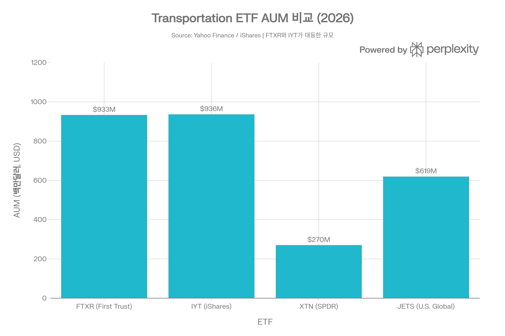
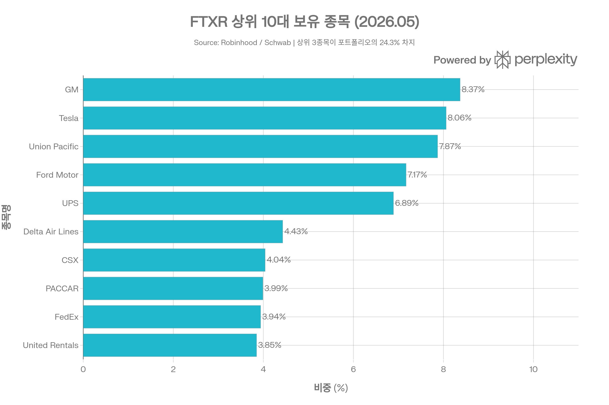
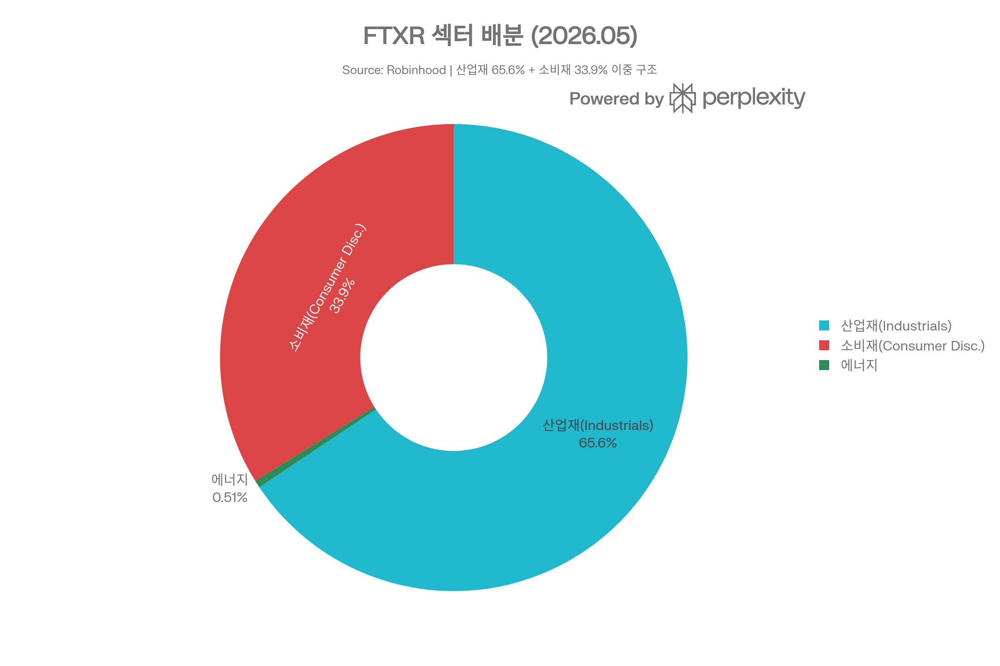
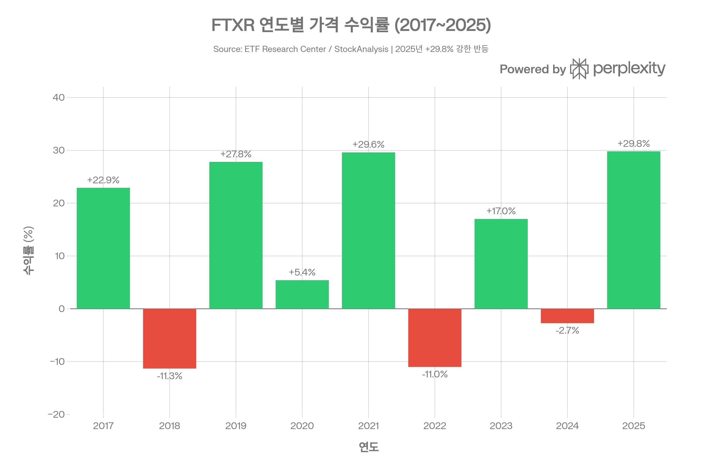
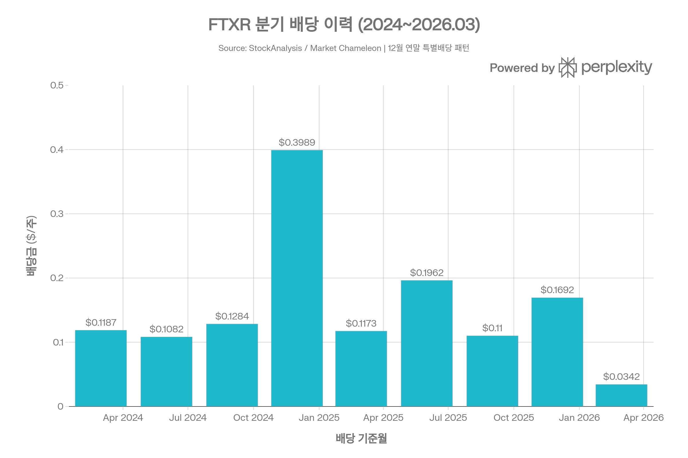

## 요약

> <strong>작성일</strong>: 2026년 5월 25일 기준 데이터 | <strong>운용사</strong>: First Trust Advisors L.P. | <strong>카테고리</strong>: 산업재 / 운송 섹터 스마트 베타 ETF

***
## ETF 분류

| 항목 | 내용 |
|------|------|
| <strong>최종 폴더</strong> | `ETF/Sector/Industrials/Transportation/FTXR` |
| <strong>대분류</strong> | 섹터 |
| <strong>하위 분류</strong> | Industrials / Transportation |
| <strong>핵심 전략</strong> | Nasdaq US Smart Transportation Index 추종 |
| <strong>운용 방식</strong> | 패시브, 규칙 기반 스마트베타 |
| <strong>레버리지·인버스 여부</strong> | 아니오 |
| <strong>옵션 인컴 전략 여부</strong> | 아니오 |

FTXR은 명칭에 `Nasdaq`이 포함되어 있지만 Nasdaq-100 같은 대표지수를 단순 추종하는 ETF가 아니라, 미국 운송 기업에 투자하는 <strong>산업재 내 운송 섹터 ETF</strong>입니다. ETF 분류 기준상 산업 섹터 노출이 명확하므로 `Sector/Industrials/Transportation`으로 분류합니다.

***
## 1. 기본 정보
FTXR은 <strong>First Trust Advisors L.P.</strong>가 운용하는 <strong>Nasdaq US Smart Transportation™ Index 추종 스마트 베타 ETF</strong>로, 2016년 9월 20일 설정되었다. 단순 시가총액 가중이 아닌 <strong>3개 팩터(변동성·가치·성장)</strong> 기반 수정 팩터 가중 방식을 채택해, 전통적인 패시브 ETF와 액티브 ETF의 중간에 위치한 "스마트 베타(Smart Beta)" 상품이다.

| 항목 | 내용 |
|------|------|
| <strong>정식 명칭</strong> | First Trust Nasdaq Transportation ETF |
| <strong>티커</strong> | FTXR (Nasdaq) |
| <strong>설정일</strong> | 2016년 9월 20일 |
| <strong>운용 기간</strong> | 약 9.7년 (2026년 5월 기준) |
| <strong>추종 지수</strong> | Nasdaq US Smart Transportation™ Index (NQSSTR) |
| <strong>운용사</strong> | First Trust Advisors L.P. |
| <strong>배포사</strong> | First Trust Portfolios L.P. |
| <strong>상장거래소</strong> | Nasdaq |
| <strong>순자산(AUM)</strong> | <strong>약 $933.63M</strong> (Yahoo Finance 기준) |
| <strong>현재가</strong> | $42.70 (2026.05.22) |
| <strong>52주 최고/최저</strong> | $44.85 / $25.47 |
| <strong>YTD 수익률</strong> | +6.57%(2026년 기준) |
| <strong>총 보수(TER)</strong> | <strong>0.60%</strong> |
| <strong>관리 스타일</strong> | 패시브(규칙 기반 스마트 베타) |
| <strong>복제 방식</strong> | 완전 복제(Physical) |
| <strong>보유 종목 수</strong> | 45개 (2026.05 기준) |
| <strong>P/E 비율</strong> | 20.48 |
| <strong>30일 배당 수익률</strong> | 0.84% |
| <strong>베타(3년)</strong> | <strong>1.29</strong> |
| <strong>K-1 세금 양식</strong> | 없음(1099 처리) |

***
## 2. 추종 지수: Nasdaq US Smart Transportation™ Index (NQSSTR)
### 지수 개요
NQSSTR은 <strong>나스닥이 설계한 팩터 기반 스마트 베타 지수</strong>로, 2016년 7월 8일 기준가 1,000.00 포인트에서 시작되었다. 2026년 5월 기준 지수값은 약 2,258 수준이다.
### 구성 방법론
FTXR은 단순한 지수 추종이 아닌, 다음 3단계 스크리닝·가중 방식을 거친다:

<strong>① 유니버스 선정</strong>
- 미국에 상장된 운송 섹터 기업 중 가장 유동성 높은 30개 종목 선발
- 운송 하위 섹터: 배달·선적·해운, 철도, 트럭운송, 공항·항공사, 교량·터널, 자동차·부품

<strong>② 3개 팩터 스크리닝</strong>
1. <strong>성장(Growth)</strong>: 3·6·9·12개월 평균 주가 수익률로 측정
2. <strong>가치(Value)</strong>: 주가 대비 현금흐름(Cash Flow to Price)으로 측정
3. <strong>변동성(Volatility)</strong>: 12개월 역사적 주가 변동 기반(낮을수록 유리)

<strong>③ 수정 팩터 가중(Modified Factor Weighting)</strong>
- 세 팩터 점수에 따라 가중치 부여
- 단일 종목 최대 비중 <strong>8% 상한</strong> 적용
### 리밸런싱 일정
- <strong>지수 재구성</strong>: 연간 1회
- <strong>분기 리밸런싱</strong>: 3월·6월·9월·12월
- <strong>펀드 회전율</strong>: 약 17%

***
## 3. 추종 성과 지표
### NAV 대비 시장가격 괴리율
| 항목 | 수치 |
|------|------|
| <strong>NAV 괴리율</strong> | <strong>+0.06%</strong> (소폭 프리미엄) |
| <strong>30일 평균 호가 스프레드</strong> | 0.14% |
| <strong>펀드 순자산(NAV)</strong> | $42.67 (2026.05.22) |
| <strong>시장가</strong> | $42.70 (2026.05.22) |

괴리율 +0.06%는 매우 낮은 수준으로, NAV와 시장가격이 거의 일치한다. Morningstar 분석에 따르면 FTXR은 "비용 측면에서 경쟁사 대비 2번째로 낮은 비용 분위에 속하며 비용 우위를 보유한다"고 평가된다.
### 추적 차이(Tracking Difference)
FTXR의 추적 오차는 비교적 낮다:
- ETF 수익률이 기초 지수 수익률 대비 약 0.10\~0.15%p 낮게 유지(보수율 0.60% 대비 우수한 추적)
- 완전 물리적 복제(Full Physical Replication) 방식으로 파생상품 관련 추적 오차 없음

***
## 4. 비용 구조
| 항목 | 수치 |
|------|------|
| <strong>총 보수(TER)</strong> | 0.60% |
| <strong>관리 보수 조정 시점</strong> | 2025년 8월 1일 이후 적용 |
| <strong>포트폴리오 회전율</strong> | 약 17% |
| <strong>최대 단기 자본이득세율</strong> | 39.60% |
| <strong>최대 장기 자본이득세율</strong> | 20.00% |
| <strong>K-1 세금 양식</strong> | 없음 |
| <strong>파생상품 활용</strong> | 없음 |
### 경쟁 ETF 비용·AUM 비교

*▲ 주요 운송 ETF AUM 비교: FTXR(\~$934M)과 IYT(\~$936M)가 거의 동일한 규모*

| ETF | 운용사 | 추종 지수 | 보수율 | AUM |
|-----|--------|---------|------|-----|
| <strong>FTXR</strong> | First Trust | Nasdaq US Smart Transportation | <strong>0.60%</strong> | \~$934M |
| IYT | iShares(BlackRock) | S&P Transportation Select Industry | 0.38% | \~$936M |
| XTN | SPDR(State Street) | S&P Transportation Select Industry | 0.35% | \~$270M |
| JETS | U.S. Global Investors | U.S. Global Jets Index | 0.60% | \~$619M |

FTXR의 0.60% 보수율은 IYT(0.38%), XTN(0.35%) 대비 높다. 단, FTXR은 단순 시가총액 가중이 아닌 스마트 베타 팩터 가중이라는 차별화된 전략을 제공하므로, 보수 차이에는 팩터 전략 비용이 포함되어 있다고 볼 수 있다.

***
## 5. 유동성 평가
| 항목 | 수치 |
|------|------|
| <strong>AUM</strong> | \~$933.63M |
| <strong>일평균 거래량(ADV, 3개월)</strong> | 약 127,540주 |
| <strong>일평균 거래대금</strong> | \~$5.4M/일(주가 $42.70 × 127,540주) |
| <strong>30일 평균 호가 스프레드</strong> | 0.14% |
| <strong>숏 인터레스트</strong> | 0.1% |
| <strong>RSI(상대강도지수)</strong> | 60 |
| <strong>발행 주식수</strong> | 21.55M주 |
| <strong>옵션 거래 가능</strong> | 가능 |

AUM $933M에 일평균 거래대금 약 $5.4M은 충분한 유동성을 제공한다. 스프레드 0.14%는 소형 틈새 ETF에 비해 낮아, 개인 투자자부터 중소형 기관 투자자까지 수용 가능한 수준이다. 1년간 펀드 플로우는 소폭 유출(-$5.6M)을 기록했으나, 전반적으로 안정적인 유동성 구조를 유지하고 있다.

***
## 6. 포트폴리오 구성
### 자산 유형 및 지역 배분
| 구분 | 비중 |
|------|------|
| 미국 주식 | 99.89% |
| 현금 | 0.11% |
| 선진국 시장 | 99.9% |
| 신흥 시장 | 0.0% |

FTXR은 <strong>사실상 100% 미국 기업</strong>으로 구성된 순수 미국 섹터 ETF다.
### 상위 10대 보유 종목 (2026년 5월 기준)

*▲ FTXR 상위 10대 보유 종목: GM·테슬라·유니온퍼시픽이 24.3% 점유*

| 순위 | 종목 | 섹터 | 비중 |
|------|------|------|------|
| 1 | General Motors (GM) | 소비재 | 8.37% |
| 2 | Tesla (TSLA) | 소비재 | 8.06% |
| 3 | Union Pacific (UNP) | 산업재 | 7.87% |
| 4 | Ford Motor (F) | 소비재 | 7.17% |
| 5 | United Parcel Service (UPS) | 산업재 | 6.89% |
| 6 | Delta Air Lines (DAL) | 산업재 | 4.43% |
| 7 | CSX Corp (CSX) | 산업재 | 4.04% |
| 8 | PACCAR (PCAR) | 산업재 | 3.99% |
| 9 | FedEx (FDX) | 산업재 | 3.94% |
| 10 | United Rentals (URI) | 산업재 | 3.85% |
| <strong>상위 10종목 합계</strong> | | | <strong>58.6%</strong> |

<strong>팩터 가중의 실질적 효과</strong>: 상위 종목에 GM, 테슬라, 포드 등 자동차·EV 기업이 높은 비중으로 포함된다. 이는 단순 시가총액 가중이 아닌 <strong>성장+가치+저변동성</strong> 팩터가 반영된 결과로, IYT(Uber 최대 비중)와 명확히 차별화된다.
### 섹터 배분

*▲ FTXR 섹터 배분: 산업재 65.6% + 소비재 33.9% 이중 구조*

| 섹터 | 비중 |
|------|------|
| 산업재(Industrials) | 65.63% |
| 소비재(Consumer Discretionary) | 33.86% |
| 에너지(Energy) | 0.51% |

소비재 비중이 33.86%에 달하는 것은 자동차(GM, 포드, 테슬라 등)를 소비재 섹터로 분류하기 때문이다. 이는 IYT가 산업재 100%로 구성된 것과 비교되는 FTXR의 구조적 특징이다.
### 시가총액 분포
| 시가총액 구분 | 비중 |
|------------|------|
| 대형주(>$10B) | 79.8% |
| 중형주($2\~10B) | 20.1% |
| 소형주(<$2B) | 0.0% |
| 가중 평균 시가총액 | $129,044M (약 $129B) |

***
## 7. 성과 분석
### 기간별 수익률 (2025.08.31 기준, ETF Research Center)
| 기간 | 가격 수익률 | 총 수익률(배당 포함) | 변동성(연환산) |
|------|-----------|-----------------|------------|
| YTD(2025.08) | +0.8% | +1.9% | 30.7% |
| 1년 | +10.4% | +13.2% | 27.8% |
| 2년(연환산) | +8.6% | +10.7% | 23.8% |
| 3년(연환산) | +7.7% | +9.8% | 23.8% |
| 5년(연환산) | +7.1% | +8.8% | 23.9% |
| 설정 이후(연환산) | +6.2% | +7.7% | 26.9% |

2026년 최신 성과 기준으로:
- <strong>YTD(2026년)</strong>: +6.57%
- <strong>1년 총 수익률</strong>: +33.54%(2025년 강한 상승 반영)
- <strong>설정 이후 연환산</strong>: +9.19%
- <strong>2026년 2월\~3월 기준 1년 수익률</strong>: +35.55%
### 연도별 성과 패턴

*▲ FTXR 연도별 가격 수익률 (2017\~2025): 경기 사이클에 민감한 패턴, 2021년과 2025년이 최고 성과 연도*

| 연도 | 주요 이슈 | FTXR 성과 방향 |
|------|---------|------------|
| 2017 | 경기 호조, 운송 수요 급증 | <strong>강세</strong> |
| 2018 | 금리 인상, 무역 전쟁 | 약세 |
| 2019 | 금리 인하, 경기 회복 | <strong>강세</strong> |
| 2020 | 코로나19 충격·회복 | 보합 |
| 2021 | 리오프닝, 물류 수요 폭증 | <strong>강세</strong> |
| 2022 | 금리 인상, 연료비 급등 | 약세 |
| 2023 | 연착륙 기대 | 강세 |
| 2024 | 물류 정상화, 금리 고점 | 약보합 |
| 2025 | 경기 회복 기대, AI 물류 테마 | <strong>강세 +29\~31%</strong> |
### 위험 조정 성과 지표
| 지표 | 수치 | 출처 |
|------|------|------|
| <strong>최대 낙폭(MDD, 최근)</strong> | <strong>-21.33%</strong> (2024.12\~2025.04, 5개월) | Morningstar |
| <strong>카테고리 MDD</strong> | -13.88% | Morningstar |
| <strong>지수 MDD</strong> | -11.77% | Morningstar |
| <strong>베타(3년)</strong> | <strong>1.29</strong> | Zacks/Yahoo |
| <strong>베타(vs S&P 500)</strong> | 1.37 | ETFdb |
| <strong>표준편차(3년)</strong> | 22.01% | Zacks |
| <strong>변동성(연환산, 5년)</strong> | 23.9% | ETF Research Center |
| <strong>RSI</strong> | 60 (중립\~강세 영역) | ETF Research Center |
| <strong>ETF Research Center 평가</strong> | <strong>SPECULATIVE</strong> (상위 92%ile 가치평가) | ETF Research Center |

MDD -21.33%는 카테고리 평균(-13.88%), 지수(-11.77%) 대비 훨씬 크다. 이는 FTXR의 자동차·EV 비중(특히 테슬라·GM·포드) 때문으로, 이들 종목이 시장 하락 시 더 큰 낙폭을 기록하는 경향이 있다. 베타 1.29\~1.37은 시장보다 29\~37% 더 크게 움직인다는 의미로, 고위험 고수익 성격을 가진다.

***
## 8. 배당 정보

*▲ FTXR 분기 배당 이력 (2024\~2026.03): 12월 연말 배당이 특히 높은 패턴 관찰*
### 배당 현황
| 항목 | 수치 |
|------|------|
| <strong>배당 수익률(TTM)</strong> | 1.21\~1.22% |
| <strong>연간 배당(주당, TTM)</strong> | $0.51 |
| <strong>최근 배당(2026.03.31)</strong> | $0.0342/주 |
| <strong>배당 지급 주기</strong> | 분기(3·6·9·12월) |
| <strong>페이아웃 비율</strong> | 26.31% |
| <strong>배당 성장(1년)</strong> | +112.43%(2025년 급증) |
| <strong>최근 3년 배당 감소 횟수</strong> | 7회 |
| <strong>최근 3년 배당 증가 횟수</strong> | 5회 |
### 최근 배당 이력
| 기준일 | 배당액(/주) | 지급일 |
|--------|-----------|-------|
| 2026.03.26 | $0.0342 | 2026.03.31 |
| 2025.12.12 | <strong>$0.1692</strong> | 2025.12.31 |
| 2025.09.25 | $0.1100 | — |
| 2025.06.26 | $0.1962 | 2025.06.30 |
| 2025.03.27 | $0.1173 | 2025.03.31 |
| 2024.12.13 | <strong>$0.3989</strong> | 2024.12.31 |
| 2024.09.26 | $0.1284 | 2024.09.30 |
### 배당 특성 분석
12월 연말 배당이 다른 분기 대비 현저히 높은 패턴이 뚜렷하다. 2024년 12월 배당 $0.3989는 같은 해 3월 배당($0.1187)의 3.4배에 달한다. 이는 연말 자본이득 분배가 정기 배당에 합산되는 구조 때문으로, <strong>안정적 인컴 투자자보다는 총 수익률 추구 투자자에게 더 적합</strong>한 배당 패턴이다. 배당 변동성이 크기 때문에 배당 지급 시기를 주의 깊게 관찰할 필요가 있다.

***
## 9. 리스크 요소
### 핵심 투자 리스크
<strong>① 섹터 집중 리스크(Sector Concentration Risk)</strong>
- 운송 섹터에 집중 투자, 광범위한 시장 분산 없음
- 연료비(유가) 급등 시 항공·트럭 운송주 직격
- 자동차 업황 부진 시 GM·포드·테슬라 동반 하락 가능

<strong>② EV·자동차 비중 집중 리스크</strong>
- 상위 5종목 중 3개(GM 8.37%, 테슬라 8.06%, 포드 7.17%)가 자동차 기업
- 테슬라의 주가 변동성은 ETF 전체 변동성의 주요 원인
- EV 수요 둔화, 자동차 시장 불황 시 FTXR에 집중적 영향

<strong>③ 높은 베타 및 변동성 리스크</strong>
- 베타 1.29\~1.37로 시장 대비 큰 진폭
- MDD -21.33%는 카테고리 평균(-13.88%)보다 7%p 더 큰 낙폭
- 표준편차 22.01%(3년)로 고변동성 섹터 ETF 특성

<strong>④ 스마트 베타 팩터 리스크(Factor Risk)</strong>
- 팩터 전략이 시장 환경에 따라 언더퍼폼 가능
- "모멘텀 스타일은 빠르게 반전될 수 있고 다른 유형의 투자 대비 큰 편차 초래"
- 가치 팩터는 성장주 강세장에서 상대적으로 불리

<strong>⑤ 경기 사이클 리스크</strong>
- 운송 산업은 "본질적으로 경기순환적"이며, 연료비·노사 관계·보험비용·규제 변화에 민감
- 경기 침체 시 화물 운송량 급감으로 운송주 일제 하락 가능

<strong>⑥ 비다각화(Non-Diversified) 리스크</strong>
- First Trust 공식 문서에 "비다각화 펀드로 더 집중된 종목 노출"이라고 명시
- 45개 보유 종목 중 상위 10종목이 58.6% 차지
### 베타 및 상관관계
| 비교 자산 | 관계 |
|----------|------|
| S&P 500 | 베타 1.37 (시장 대비 37% 더 큰 움직임) |
| IYT(운송 ETF) | 높은 양의 상관, 단 구성 차이 존재 |
| XTN(균등 가중 운송) | 높은 상관, 소형주 비중 차이 |
| 유가(WTI) | 역의 상관(유가 상승 → 항공·트럭주 압박) |

***
## 10. FTXR vs 주요 경쟁 ETF 비교
| 항목 | FTXR | IYT | XTN |
|------|------|-----|-----|
| <strong>운용사</strong> | First Trust | iShares | SPDR |
| <strong>추종 지수</strong> | Nasdaq Smart Transportation | Dow Jones Transportation Avg | S&P Transportation Select |
| <strong>가중 방식</strong> | 팩터(성장·가치·변동성) | 시가총액 | 수정 균등 가중 |
| <strong>보수율</strong> | 0.60% | 0.38% | 0.35% |
| <strong>AUM</strong> | \~$934M | \~$936M | \~$270M |
| <strong>보유 종목 수</strong> | 45 | 48 | 43+ |
| <strong>최대 비중 종목</strong> | GM 8.37% | Uber 15% | — |
| <strong>자동차 비중</strong> | <strong>33.86%(소비재)</strong> | 매우 낮음 | 낮음 |
| <strong>베타</strong> | 1.29\~1.37 | 1.23 | 다양 |
| <strong>MDD(최근)</strong> | <strong>-21.33%</strong> | -13.88%(카테고리) | — |
| <strong>배당 수익률</strong> | 1.22% | 1.56% | — |
| <strong>설정일</strong> | 2016.09.20 | 2003.10.06 | 2011.01.27 |

<strong>핵심 차별점</strong>: FTXR은 자동차·EV 기업(GM·테슬라·포드)이 상위에 포진하여 "순수 운송"보다 더 넓은 "이동수단(Transportation & Mobility)" 개념을 포괄한다. IYT는 Uber가 최대 비중으로 라이드셰어링·물류 플랫폼에 집중되어 있어 서로 다른 성격의 포트폴리오를 구성한다.

***
## 11. 총평 및 투자자 고려사항
<strong>FTXR은 Nasdaq US Smart Transportation Index를 팩터 기반으로 추종하는 약 $934M 규모의 중형 스마트 베타 ETF다.</strong> 성장·가치·저변동성 3개 팩터를 활용해 미국 운송 섹터 내에서 매력적인 종목을 선별한다.
### 핵심 장·단점
| 구분 | 내용 |
|------|------|
| <strong>장점</strong> | 설정 이후 연환산 총 수익률 7.7\~9.19%, 팩터 기반 종목 선별로 단순 지수 대비 차별화, 충분한 AUM($934M) 및 유동성, $5.4M/일 거래대금, 낮은 괴리율(+0.06%) |
| <strong>단점</strong> | 보수율 0.60%(IYT 0.38%, XTN 0.35% 대비 높음), 높은 베타(1.29\~1.37) 및 변동성(22%), 카테고리 대비 큰 MDD(-21.33%), 자동차 비중 33.9%로 순수 운송 ETF 아님, 배당 변동성 큼(연말 집중) |
### 투자 적합 프로파일
- <strong>적합</strong>: 미국 운송·이동성 섹터 장기 성장에 베팅하는 투자자, 팩터 기반 스마트 베타 전략을 원하는 중장기 투자자, 경기 회복 사이클 초기에 공격적 포지션을 취하고자 하는 투자자
- <strong>부적합</strong>: 보수율에 민감하고 저비용을 최우선시하는 투자자(IYT, XTN 고려), 낮은 변동성·MDD를 원하는 안정 추구형 투자자, 규칙적·예측 가능한 배당 인컴이 필요한 투자자
### 2026년 현재 시장 맥락
2026년 5월 기준 FTXR의 1년 총 수익률은 +33.54%로 강한 회복세를 보이고 있다. YTD 2026 수익률 +6.57%도 양호하며, Morningstar 기준 "Neutral" 등급을 받고 있다. 관세 및 무역 정책 불확실성이 물류·자동차 섹터에 영향을 줄 수 있으므로, 거시경제 환경 변화에 대한 지속적 모니터링이 필요하다.

> ⚠️ <strong>면책 조항</strong>: 본 보고서는 정보 제공 목적으로 작성되었으며 투자 권고로 해석되어서는 안 된다. 모든 ETF 투자에는 원금 손실 가능성이 있으며, 과거 성과는 미래 성과를 보장하지 않는다. 섹터 집중 ETF는 광범위한 시장 ETF 대비 변동성이 크다.
