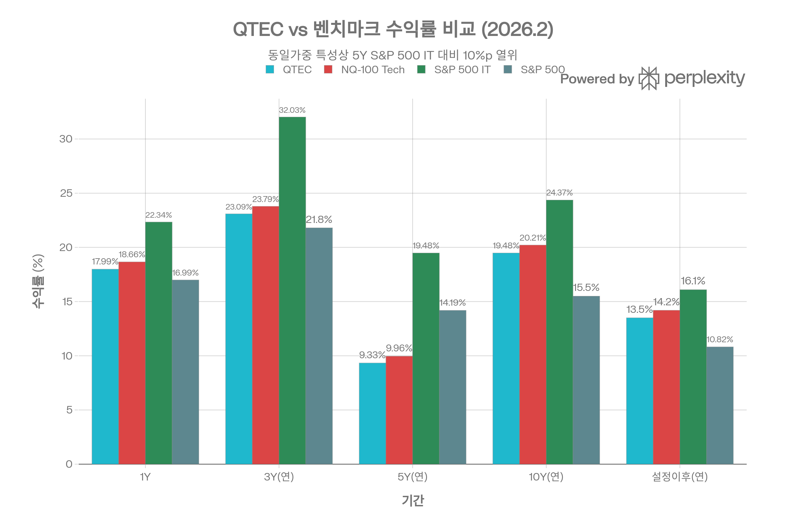
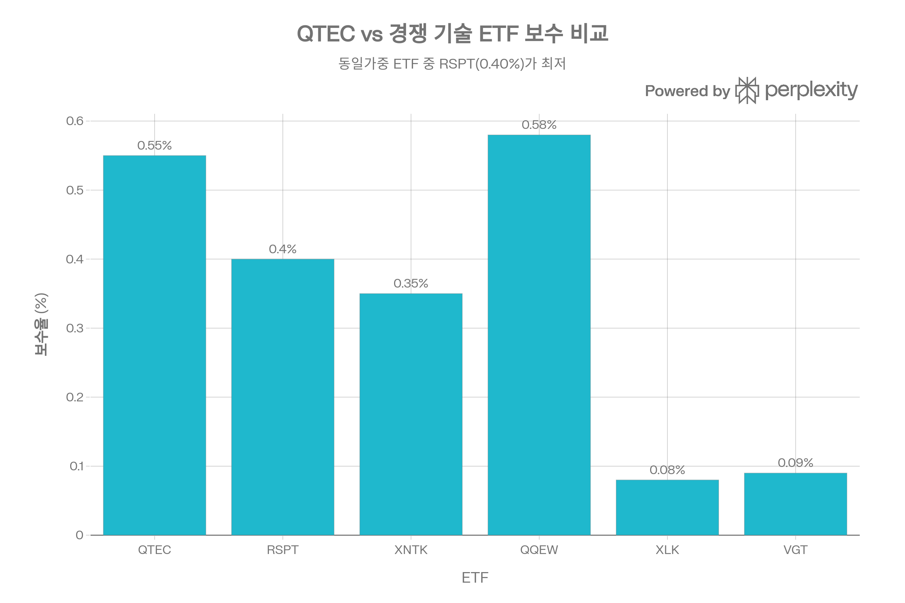
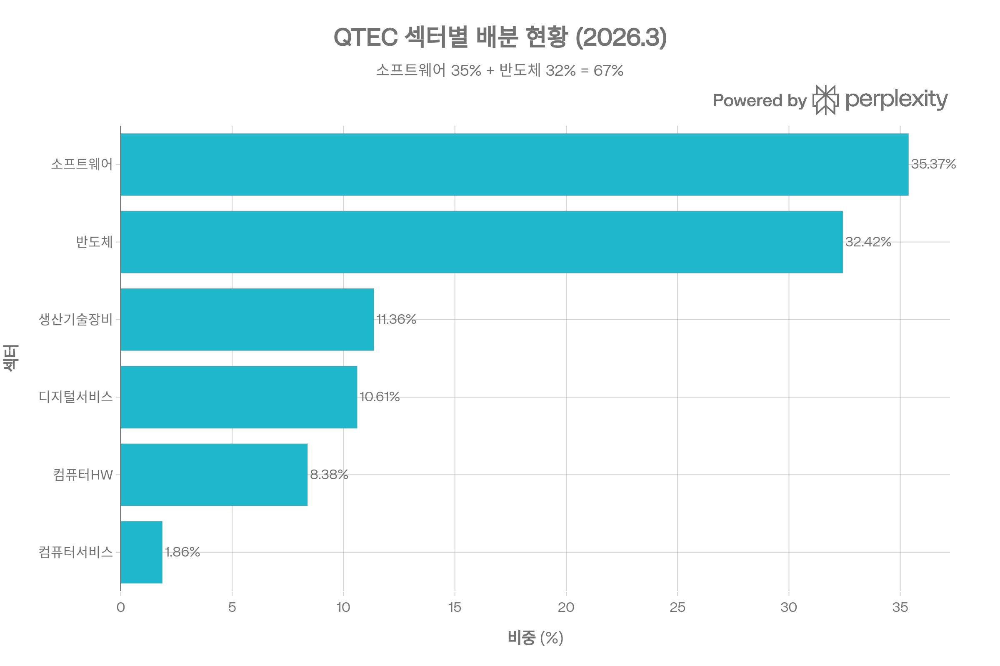
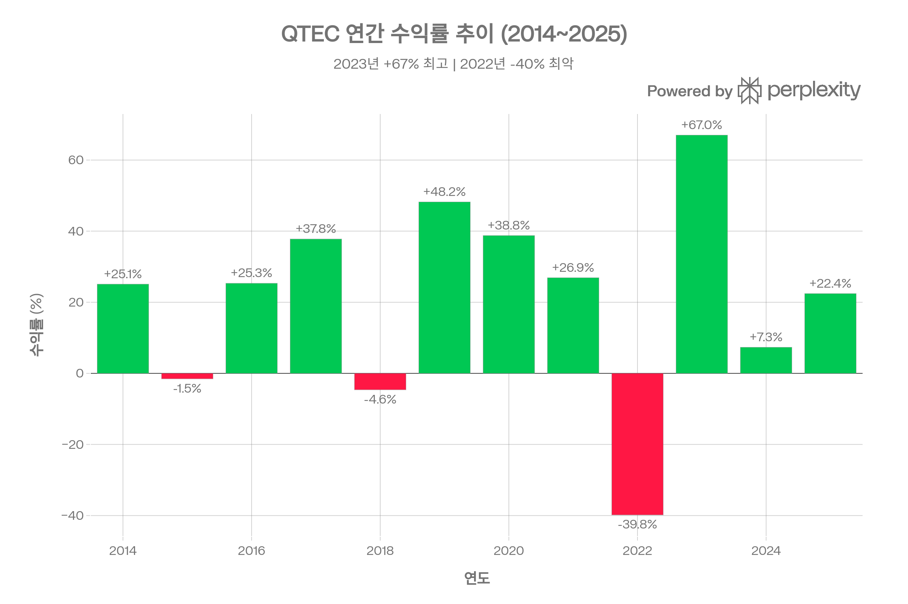
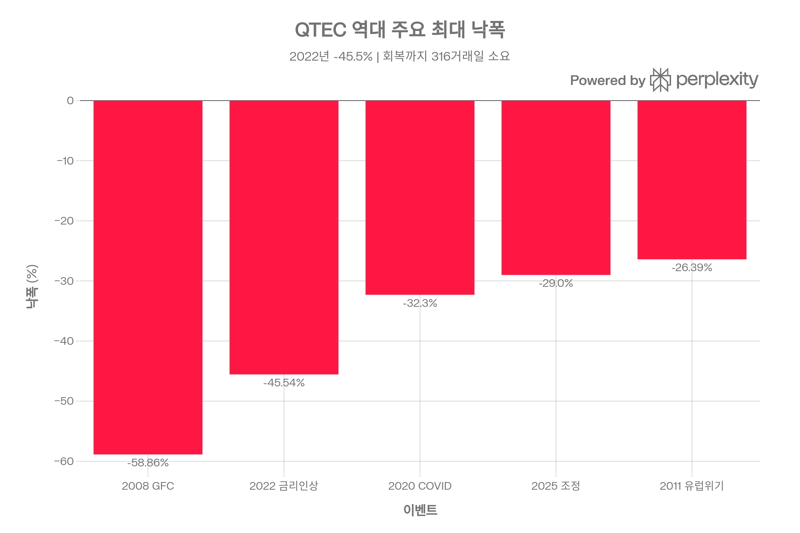

# QTEC (First Trust NASDAQ-100 Technology Sector Index Fund) 종합 분석 보고서
## 개요
QTEC는 NASDAQ-100 지수 내 기술 섹터 종목만을 **동일가중(Equal-Weight)** 방식으로 추종하는 ETF로, 메가캡 집중 리스크를 분산하면서 기술주 전체에 폭넓게 투자하는 독특한 전략을 제공한다. 2006년 4월 설정 이후 연환산 13.50%의 수익률을 기록하며, 동일 기간 S&P 500(~10.8%)을 약 2.7%p 상회하는 장기 성과를 보여주고 있다. 다만 동일가중 특성상 Apple·Microsoft·Nvidia 같은 메가캡의 비중이 제한되어, 시가총액가중 기술 ETF(XLK, VGT) 대비 최근 5년간 연 5~10%p의 수익률 열위가 관찰된다.[1][2]

## ETF 분류

| 항목 | 내용 |
|------|------|
| **최종 폴더** | `ETF/Sector/Technology/Equal Weight/QTEC` |
| **대분류** | 섹터 |
| **하위 분류** | Technology / Equal Weight |
| **핵심 전략** | Nasdaq-100 내 기술 섹터 종목을 동일가중으로 편입해 메가캡 기술주 집중도를 낮추고 기술 섹터 전반에 분산 투자 |
| **운용 방식** | 패시브 |
| **레버리지·인버스 여부** | 아니오 |
| **옵션 인컴 전략 여부** | 아니오 |
| **분류 판단** | Nasdaq-100 기반이지만 투자 목적은 기술 섹터 단일 노출이며, 동일가중 방식으로 기술 섹터를 추종하므로 대표지수보다 `Sector/Technology/Equal Weight`로 분류한다. |

***
## 1. 기본 정보
| 항목 | 내용 |
|------|------|
| **티커/정식명** | QTEC / First Trust NASDAQ-100-Technology Sector Index Fund |
| **순자산 규모(AUM)** | $27.7억 (2026년 3월)[2] |
| **설정일** | 2006년 4월 19일 (약 20년 운용)[1] |
| **추종 지수** | Nasdaq-100 Technology Sector™ Index[1] |
| **가중 방식** | 동일가중(Equal-Weight), 분기별 리밸런싱[2] |
| **운용사** | First Trust Advisors L.P.[1] |
| **상장 거래소** | Nasdaq[1] |
| **설정가** | $20.00[1] |
| **현재가 (NAV)** | $220.99 (2026.3.6)[1] |

QTEC의 핵심 차별점은 **동일가중** 방식에 있다. 일반적인 시가총액가중 기술 ETF(XLK, QQQ)에서 상위 5~10개 메가캡이 50% 이상을 차지하는 것과 달리, QTEC는 45개 종목에 각 ~2.2%씩 균등 배분하여 종목별 집중도를 낮춘다. 이 방식은 소형·중형 기술주의 상대적 초과 성과를 포착할 수 있는 반면, 메가캡 랠리 국면에서는 상대적 열위를 초래한다.[2]

***
## 2. 추종 성과 지표
### 추적 차이(Tracking Difference)
QTEC의 벤치마크(Nasdaq-100 Technology Sector Index) 대비 추적 차이는 비용비율을 반영하여 일관된 패턴을 보인다:[1]

| 기간 | QTEC (NAV) | 벤치마크 | 추적 차이 |
|------|-----------|---------|----------|
| 1년 | 17.99% | 18.66% | -0.67%[1] |
| 3년(연환산) | 23.09% | 23.79% | -0.70%[1] |
| 5년(연환산) | 9.33% | 9.96% | -0.63%[1] |
| 10년(연환산) | 19.48% | 20.21% | -0.73%[1] |
| 설정 이후(연환산) | 13.50% | 14.20% | -0.70%[1] |

추적 차이는 전 기간에 걸쳐 **-0.63%~-0.73%** 범위로, TER(0.55%) + 거래 비용(분기별 리밸런싱)을 고려하면 합리적인 수준이다. 다만 동일가중 ETF 특성상 분기마다 전체 포트폴리오를 재조정해야 하므로, 시가총액가중 ETF보다 추적 비용이 높다.
### NAV 대비 시장가격 괴리율
2025년 전체 거래일 중 프리미엄 72일, 디스카운트 178일이 관찰되었으며, 2026년 Q1(3월 6일 기준)에는 프리미엄 13일, 디스카운트 31일을 기록했다. 직전 거래일 기준 NAV($220.99) vs 시장가($221.03)로 괴리율은 +0.02%에 불과하여 정상 범위이다. 디스카운트 거래일이 더 많은 것은 시장 조성자 스프레드와 일중 가격 변동 때문이며, 구조적 문제는 아니다.[1]

***
## 3. 비용 구조
| 항목 | 수치 |
|------|------|
| **총 보수(TER)** | 0.55% (상한 0.60%)[1] |
| **30일 중간 호가 스프레드** | 0.06%[1] |
| **포트폴리오 회전율** | 0.8% (연간)[2] |
| **총 보유 비용(추정)** | ~0.61% (TER + 스프레드) |
### 경쟁 ETF 비용 비교

| ETF | TER | 가중 방식 | 종목 수 | 스프레드 |
|-----|-----|----------|---------|---------|
| **QTEC** | 0.55%[1] | 동일가중 | 45 | 0.06%[1] |
| **RSPT** | 0.40%[3] | 동일가중 | 67 | ~0.04% |
| **XNTK** | 0.35%[2] | 동일가중 | 35 | ~0.10% |
| **QQEW** | 0.58%[2] | 동일가중 | 101 | ~0.08% |
| **XLK** | 0.08% | 시가가중 | 68 | ~0.01% |
| **VGT** | 0.09% | 시가가중 | 312 | ~0.01% |

QTEC의 0.55% TER은 동일가중 ETF 중 **중상위 수준**이다. 동일 가중 방식의 직접 경쟁 상대인 RSPT(0.40%)가 15bp 더 저렴하며, XNTK(0.35%)는 22bp 낮다. 다만 시가총액가중 ETF(XLK 0.08%, VGT 0.09%)와 비교하면 6~7배에 달하는 비용 차이가 존재한다. 이는 분기별 동일가중 리밸런싱에 따른 높은 거래 비용을 반영한다.[2][3]

회전율은 0.8%로 매우 낮게 보이나, 이는 연간 기준이며 리밸런싱 시 실제 매매 회전은 종목별 가격 변동에 따라 달라진다.[2]
---
## 4. 유동성 평가
| 지표 | 수치 |
|------|------|
| **일평균 거래량 (30일)** | 248,408주[1] |
| **일평균 거래대금** | ~$21M[2] |
| **호가 스프레드 (30일 중간값)** | 0.06%[1] |
| **옵션 거래** | 가능[2] |
| **공매도 비율** | 2.1%[2] |

일평균 거래대금 $21M은 기관 투자자에게도 충분한 유동성을 제공하며, 0.06% 호가 스프레드는 $200대 가격에서 약 $0.13에 해당한다. 옵션 시장도 활성화되어 있어 헤지 및 수익 강화 전략 구현이 가능하다. AUM $27.7억 규모는 ETF 청산 리스크가 사실상 없는 수준이다.[1][2]

52주 가격 범위는 $149.56~$246.56으로 약 65%의 등락폭을 보여, 기술 섹터 ETF 특유의 높은 가격 변동성을 반영한다.[1]

***
## 5. 포트폴리오 구성
### 상위 10대 보유 종목 (2026.3.6 기준)
| 순위 | 종목명 | 비중 |
|------|--------|------|
| 1 | Micron Technology | 3.34%[1] |
| 2 | Western Digital | 3.25%[1] |
| 3 | Applied Materials | 3.04%[1] |
| 4 | ASML Holding | 2.94%[1] |
| 5 | Seagate Technology | 2.86%[1] |
| 6 | Intel Corporation | 2.83%[1] |
| 7 | Lam Research | 2.78%[1] |
| 8 | Analog Devices | 2.76%[1] |
| 9 | Texas Instruments | 2.63%[1] |
| 10 | Monolithic Power Systems | 2.62%[1] |
| | **상위 10 합계** | **~28.05%** |

동일가중 방식에도 불구하고 상위 10개 종목이 28%를 차지하는 것은 분기 리밸런싱 사이에 개별 종목의 가격 변동이 반영되기 때문이다. 시가총액가중 ETF(XLK)에서 Apple+Microsoft+Nvidia가 50% 이상을 차지하는 것과 비교하면, **집중도가 현저히 낮다**. HHI(허핀달-허쉬만 지수)는 227로 극도로 분산된 구조를 확인할 수 있다.[1][2]

주목할 점은 상위 종목이 Micron, Western Digital, Seagate 등 **메모리·스토리지 하드웨어** 중심이라는 것이다. 이들은 최근 시장에서 AI 인프라 수요 기대로 급등하여 동일가중 내에서도 비중이 높아졌다.[1]
### 섹터별 배분 현황

| 섹터 | 비중 |
|------|------|
| 소프트웨어 | 35.37%[1] |
| 반도체 | 32.42%[1] |
| 생산기술장비 | 11.36%[1] |
| 소비자 디지털 서비스 | 10.61%[1] |
| 컴퓨터 하드웨어 | 8.38%[1] |
| 컴퓨터 서비스 | 1.86%[1] |
소프트웨어(35%)와 반도체(32%)가 합산 **67%**를 차지하여 두 하위 섹터에 대한 집중도가 높다. 이는 NASDAQ-100 기술 섹터 지수의 구성 특성을 그대로 반영한 것이다.[1]
### 국가별 분산
| 국가 | 비중 |
|------|------|
| 미국 | 83.6%[2] |
| 캐나다 | 5.1%[2] |
| 네덜란드 | 4.6%[2] |
| 중국 | 2.6%[2] |
| 영국 | 2.1%[2] |
| 호주 | 2.0%[2] |

미국이 84%를 차지하지만, NASDAQ 상장 글로벌 기업(ASML-네덜란드, Shopify-캐나다, PDD-중국 등)이 포함되어 16%의 해외 노출이 존재한다.[2]
### 리밸런싱 주기
분기별(3월/6월/9월/12월) 동일가중 리밸런싱을 실시하며, 지수 구성 변경도 분기별로 반영된다. 리밸런싱 시점에 전체 포트폴리오를 균등 비중으로 재조정하므로, 본질적으로 **고평가 종목 매도 + 저평가 종목 매수**라는 역발상(contrarian) 특성을 갖는다.[2]

***
## 6. 성과 분석
### 기간별 수익률 (2026.2.27 기준, NAV)
| 기간 | QTEC | 벤치마크 | S&P 500 IT | S&P 500 |
|------|------|---------|-----------|---------|
| 3개월 | -1.73%[1] | -1.59% | -5.75% | +0.74% |
| YTD | -2.28%[1] | -2.19% | -5.51% | +0.68% |
| 1년 | +17.99%[1] | +18.66% | +22.34% | +16.99% |
| 3년(연) | +23.09%[1] | +23.79% | +32.03% | +21.80% |
| 5년(연) | +9.33%[1] | +9.96% | +19.48% | +14.19% |
| 10년(연) | +19.48%[1] | +20.21% | +24.37% | +15.50% |
### 연간 수익률 추이

QTEC의 연간 수익률은 극단적인 변동 패턴을 보인다. 2023년 **+67.02%**로 최고 수익률을 기록한 반면, 바로 전년인 2022년에는 **-39.83%**의 급락을 경험했다. 2019년(+48.22%), 2020년(+38.76%)에도 시장 평균을 크게 상회했다.[4]
### 벤치마크 대비 초과 수익률
동일가중 특성상 벤치마크와의 추적 차이(-0.6~-0.7%p/년)는 비용에서 기인하며, 추적오차(Tracking Error)는 벤치마크 수익률 대비 안정적이다. 그러나 S&P 500 IT(시가총액가중) 대비로는 5년 연환산 기준 **연 10.15%p의 열위**(QTEC 9.33% vs S&P 500 IT 19.48%)가 나타난다. 이는 2023~2024년 Nvidia, Apple, Microsoft 등 메가캡의 폭발적 상승을 동일가중 방식이 충분히 포착하지 못했기 때문이다.[1]
### 리스크 조정 성과
| 지표 | QTEC (3년 기준) | 비교 |
|------|----------------|------|
| **표준편차** | 20.97%[1] | S&P 500 대비 약 1.5배 |
| **베타** | 1.43[1] | 시장 대비 고변동 |
| **알파** | -4.36[1] | S&P 500 대비 음의 알파 |
| **샤프 지수** | 0.88 (3년)[1] | 위험 대비 양호한 보상 |
| **상관계수** | 0.79[1] | S&P 500과 높은 상관 |

샤프 지수 0.88(3년)은 절대 수준에서 양호하나, 베타 1.43과 알파 -4.36은 동일 변동성을 감수할 때 시장 대비 초과 수익이 부족함을 의미한다. 10년 장기 샤프 지수는 0.67로 개선되며, 이는 2016~2019년 등 동일가중 전략이 유효했던 시기를 포함하기 때문이다.[1][4]
### 최대 낙폭(Maximum Drawdown)

| 이벤트 | 최대 낙폭 | 회복 기간 |
|--------|----------|----------|
| 2008 글로벌 금융위기 | **-58.86%**[4] | 485 거래일 |
| 2022 금리 인상 | **-45.54%**[4] | 316 거래일 |
| 2020 COVID | **-32.30%**[4] | 74 거래일 |
| 2025 조정 | **-29.00%**[4] | 54 거래일 |
| 2011 유럽 위기 | **-26.39%**[4] | 143 거래일 |

2022년의 -45.54% 낙폭은 주목할 필요가 있다. 같은 기간 S&P 500이 약 -25% 수준이었으므로, QTEC는 시장 대비 약 **1.8배의 하락 배율**을 경험했다. 이는 베타 1.43과 일치하는 수준이다. 회복까지 316거래일(약 1년 3개월)이 소요되었으며, COVID 낙폭(-32.3%)은 V자 반등으로 74일 만에 회복한 점이 대조적이다.[4]

***
## 7. 배당 정보
| 항목 | 수치 |
|------|------|
| **배당 수익률** | ~0.02%[5] |
| **연간 배당금 (TTM)** | $0.043/주[5] |
| **배당 빈도** | 분기(실질적으로 반기)[5] |
| **최근 배당일** | 2025.3.27 ($0.0083)[5] |
### 배당 이력 추이
QTEC의 배당은 사실상 **무의미한 수준**이다. 2019년에는 연간 $0.68/주를 지급했으나, 2024년에는 $0.04, 2025년(현재까지)에는 $0.008에 불과하다. 배당 성장률은 1년 기준 **-67.33%**로 급감 추세에 있다.[5][6]

이는 QTEC가 투자하는 기술주들이 배당보다 자사주 매입이나 재투자에 이익을 활용하는 경향이 강하기 때문이다. QTEC는 순수 **자본이득(Capital Appreciation) 중심의 성장형 ETF**로 접근해야 하며, 인컴 목적으로는 부적합하다.[6][5]

***
## 8. 리스크 요소
### 베타 계수 및 시장 민감도
| 벤치마크 | 베타 | R² |
|---------|------|-----|
| S&P 500 | 1.23~1.43[1][2] | 64~79% |
| MSCI EAFE | 0.73[2] | 26% |
| MSCI 신흥시장 | 0.72[2] | 27% |

베타 1.23~1.43은 미국 시장 하락 시 **23~43% 추가 하락** 가능성을 의미한다. S&P 500과의 R² 64~79%는 높은 상관관계를 나타내지만 나머지 21~36%는 기술 섹터 고유의 변동에 기인한다.[1][2]
### 주요 리스크 요인
- **섹터 집중도 리스크**: 기술 섹터 단일 투자로, 기술주 전반의 밸류에이션 조정(P/E 39.02) 시 큰 폭의 손실 가능. 소프트웨어+반도체가 67%를 차지하여 두 하위 섹터에 대한 의존도가 높다.[1]
- **동일가중 역풍 리스크**: 메가캡 주도의 상승장에서 상대적 열위 지속 가능. 2023~2025년처럼 Magnificent 7이 시장을 이끄는 환경에서는 시가가중 ETF 대비 5~10%p 열위가 구조적으로 발생한다.[1]
- **높은 변동성**: 연간 변동성 23~33%로 채권·혼합형 자산 대비 극히 높으며, 2022년처럼 -45% 이상의 낙폭이 반복될 수 있다.[4][2]
- **비용 리스크**: TER 0.55%는 동일 전략의 RSPT(0.40%)보다 15bp, 시가가중 XLK(0.08%)보다 47bp 높아, 장기 복리 효과에서 불리하다. 10년 투자 시 $10,000 기준 약 $500+의 추가 비용이 발생한다.[3]
- **소형주 비중 부재**: 대형주(시총 $100억+)가 97.6%를 차지하여, 동일가중에도 불구하고 소형 기술주 프리미엄을 포착하지 못한다.[2]
### 다른 자산군과의 상관계수
S&P 500과 0.79의 상관관계는 주식 포트폴리오 내 분산 효과가 제한적임을 의미한다. 반면 MSCI EAFE(0.51)나 MSCI 신흥시장과의 낮은 R²(26~27%)는 글로벌 주식 대비 일정 수준의 비상관 특성을 보유하고 있음을 시사한다.[1][2]

***
## 9. 경쟁 ETF 비교
| 항목 | QTEC | RSPT | XNTK | XLK | VGT |
|------|------|------|------|-----|-----|
| **가중 방식** | 동일가중[2] | 동일가중[3] | 동일가중 | 시가가중 | 시가가중 |
| **TER** | 0.55%[1] | 0.40%[3] | 0.35%[2] | 0.08% | 0.09% |
| **종목 수** | 45[1] | 67[3] | 35 | 68 | 312 |
| **AUM** | $27.7억[1] | ~$50억 | ~$10억 | ~$700억 | ~$600억 |
| **유니버스** | NQ-100 Tech | S&P 500 EW Tech | NYSE Tech | S&P 500 Tech | MSCI US IT |
| **배당 수익률** | 0.02%[5] | ~0.50% | ~0.40% | ~0.50% | ~0.50% |
| **상위 10 비중** | 28%[1] | ~18% | ~35% | ~65% | ~60% |
| **QTEC 중복률** | 100% | 43.4%[2] | 52.9%[2] | ~40% | ~40% |
### QTEC vs RSPT (동일가중 직접 비교)
RSPT와의 상관계수는 0.83으로 높지만, 핵심 차이가 존재한다:[7]

- **유니버스**: QTEC는 NASDAQ-100 내 기술주(45종목)만, RSPT는 S&P 500 내 IT 섹터(67종목)를 대상으로 한다.[3]
- **비용**: RSPT가 15bp 저렴하다(0.40% vs 0.55%).[3]
- **성과**: 10년 연환산 기준 QTEC(17.40~19.48%)이 RSPT(16.57%)를 약 1~3%p 상회한다. 이는 NASDAQ-100의 고성장 기술주 유니버스가 S&P 500 IT보다 높은 성장 잠재력을 반영하기 때문이다.[1][3]
- **변동성**: QTEC(20.31%)가 RSPT(18.58%)보다 약 1.7%p 높다.[7]

비용을 중시하면 **RSPT**, NASDAQ 고성장주 노출을 원하면 **QTEC**이 적합하다.

***
## 10. 투자 적합성 평가
### QTEC이 적합한 투자자
- 메가캡 집중 리스크를 분산하면서 기술 섹터에 투자하고자 하는 투자자
- 동일가중의 역발상(contrarian) 리밸런싱 효과를 장기적으로 기대하는 투자자
- 소프트웨어·반도체 양 축에 균형 잡힌 노출을 원하는 투자자
- 높은 변동성(연 20~30%)을 감내할 수 있는 공격적 포트폴리오의 위성(satellite) 배분용
### QTEC이 부적합한 투자자
- 인컴(배당) 수익을 기대하는 투자자 (배당 수익률 0.02%)[5]
- 비용에 민감한 장기 투자자 (XLK 0.08%와 47bp 차이)[1]
- 메가캡 기술주(Nvidia, Apple, Microsoft)의 성장에 집중 베팅하고자 하는 투자자
- 시장 하락 시 방어력을 중시하는 보수적 투자자 (베타 1.43)[1]
### 핵심 투자 판단 포인트
QTEC의 가치는 **시장 환경에 따라 극적으로 달라진다**. 메가캡 집중 장세(2023~2024)에서는 XLK·VGT에 크게 열위하지만, 기술 섹터 내 "mean reversion" 국면(중소형 기술주 반등기)에서는 동일가중 특성이 빛을 발한다. 2016년(+25.3%), 2017년(+37.8%), 2019년(+48.2%)의 강한 성과가 이를 증명한다. 포트폴리오 내 **핵심(core) 기술 ETF 옆에 동일가중 위성(satellite)** 배분으로 활용하는 것이 리스크-수익 최적화에 가장 효과적이다.[4]
