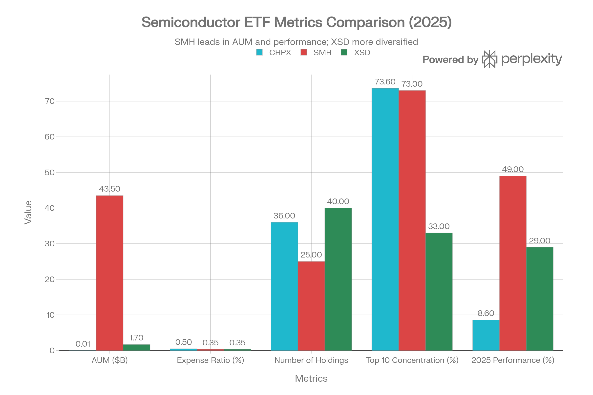
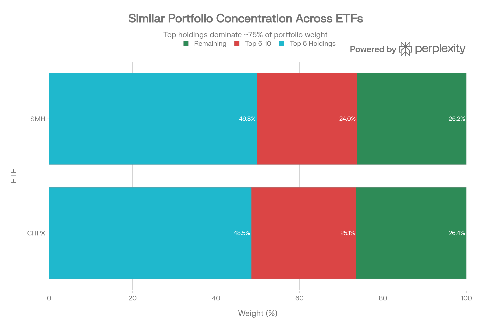

## 요약

CHPX(Global X AI Semiconductor & Quantum ETF)는 **AI 반도체와 양자컴퓨팅 생태계**에 집중 투자하는 Global X의 테마형 ETF입니다. 일반 반도체 ETF가 넓은 반도체 산업 전체를 담는다면, CHPX는 AI용 칩, HBM·메모리, 데이터센터 시스템·인프라, 양자컴퓨팅까지 묶어 “차세대 컴퓨팅 인프라”에 더 직접적으로 노출되도록 설계된 상품입니다.[^1][^2]

2026년 5월 28일 Global X 공식 페이지 기준으로 CHPX는 **Nasdaq 상장**, **총보수 0.50%**, **보유 종목 36개**, **순자산 약 2.45억 달러** 규모입니다. 설정일은 2025년 9월 30일로 아직 운용 기간이 짧은 신생 ETF이므로, 테마 매력과 별개로 유동성·성과 검증 기간 부족은 반드시 같이 봐야 합니다.[^1]

***

## 1. 기본 정보

| 항목 | 내용 |
|---|---|
| ETF명 | Global X AI Semiconductor & Quantum ETF |
| 티커 | CHPX |
| 운용사 | Global X |
| 상장거래소 | Nasdaq |
| 설정일 | 2025-09-30 |
| 추종지수 | Global X AI Semiconductor & Quantum Index |
| 총보수 | 0.50% |
| 보유 종목 수 | 36개 |
| 순자산 | 약 $244.63M |
| 30일 중간 bid-ask 스프레드 | 0.33% |
| 확인 기준 | 2026-05-28 |

CHPX의 투자 목표는 수수료와 비용 차감 전 기준으로 **Global X AI Semiconductor & Quantum Index**의 가격 및 수익률 성과에 대응하는 것입니다.[^1]

***

## 2. 무엇에 투자하는 ETF인가?

CHPX는 AI와 양자컴퓨팅을 가능하게 하는 하드웨어 중심 밸류체인에 투자합니다. Global X는 CHPX가 AI 반도체·컴퓨팅 시스템·데이터센터 인프라·양자컴퓨팅 기술 기업에 노출되도록 설계됐다고 설명합니다.[^1][^2]

핵심 노출은 크게 네 가지입니다.

| 구분 | 설명 | 대표 노출 |
|---|---|---|
| AI 반도체 | AI 학습·추론에 필요한 GPU, ASIC, CPU, 네트워크 칩, 메모리 | NVIDIA, Broadcom, AMD, Micron, SK Hynix |
| 컴퓨팅 시스템 | AI 서버, 시스템 통합, 고성능 컴퓨팅 장비 | 서버·네트워크 인프라 기업 |
| 데이터센터 인프라 | 전력 효율, 냉각, 장비, AI 클러스터 구축 인프라 | 데이터센터 장비·인프라 기업 |
| 양자컴퓨팅 | 양자컴퓨팅 시스템과 관련 기술 | 양자컴퓨팅 관련 기업 |

즉 CHPX는 “반도체 제조사만 담는 ETF”라기보다, **AI 계산 인프라를 만드는 전체 공급망**에 가까운 상품입니다. 이 점이 SMH, SOXX 같은 전통 반도체 ETF와의 핵심 차이입니다.

***

## 3. 상위 보유 종목

Global X 공식 페이지의 2026년 5월 28일 기준 상위 보유 종목은 다음과 같습니다.[^1]

| 순위 | 티커 | 종목 | 비중 |
|---:|---|---|---:|
| 1 | MU | Micron Technology | 9.44% |
| 2 | 000660 KS | SK Hynix | 9.15% |
| 3 | INTC | Intel | 8.23% |
| 4 | ASML | ASML Holding | 8.20% |
| 5 | TSM | Taiwan Semiconductor Manufacturing | 7.96% |
| 6 | AVGO | Broadcom | 6.50% |
| 7 | NVDA | NVIDIA | 6.14% |
| 8 | ARM | Arm Holdings | 5.77% |
| 9 | AMD | Advanced Micro Devices | 5.24% |
| 10 | 2454 TT | MediaTek | 4.22% |

상위 종목을 보면 CHPX는 단순히 NVIDIA만 크게 담는 구조가 아닙니다. **Micron, SK Hynix, ASML, TSMC, Broadcom**처럼 AI 반도체 밸류체인의 병목이 될 수 있는 메모리, 제조, 장비, 네트워크 영역을 함께 담습니다.

***

## 4. 투자 포인트

### 4.1 AI 반도체 수요에 직접 노출

AI 모델이 커질수록 GPU, HBM, 네트워크 칩, AI 서버 수요가 함께 증가합니다. Global X는 AI가 반도체 산업의 구조 변화를 이끌고 있으며, 기존 범용 CPU 중심에서 AI 최적화 칩·메모리·초고속 인터커넥트 중심으로 수요가 이동하고 있다고 봅니다.[^2]

CHPX는 이런 변화에 맞춰 AI 반도체와 관련 인프라 기업을 집중적으로 담기 때문에, AI 인프라 투자 사이클에 대한 민감도가 높습니다.

### 4.2 HBM과 메모리 비중이 크다

상위 보유 종목 1~2위가 Micron과 SK Hynix라는 점이 중요합니다. AI 서버에서는 GPU만큼이나 HBM과 고성능 메모리가 병목으로 부각됩니다. CHPX는 기존 반도체 ETF보다 메모리 사이클에 더 직접적으로 반응할 수 있습니다.

### 4.3 양자컴퓨팅 테마를 일부 포함

CHPX는 이름에 Quantum이 들어가며, 양자컴퓨팅 기술 기업도 투자 범위에 포함합니다. 다만 현재 포트폴리오의 핵심은 여전히 AI 반도체와 데이터센터 인프라입니다. 양자컴퓨팅은 장기 옵션 성격으로 보는 편이 현실적입니다.

***

## 5. 리스크

| 리스크 | 설명 |
---|---|
| 신생 ETF 리스크 | 2025년 9월 설정으로 장기 성과 검증 기간이 부족합니다. |
| 테마 집중 리스크 | AI 반도체·양자컴퓨팅 테마가 꺾이면 변동성이 커질 수 있습니다. |
| 밸류에이션 부담 | AI 관련 반도체주는 이미 높은 기대를 반영한 종목이 많습니다. |
| 유동성 리스크 | 순자산은 빠르게 커졌지만 SMH·SOXX 같은 대형 ETF 대비 거래 유동성은 아직 작습니다. |
| 지정학 리스크 | TSMC, SK Hynix, ASML 등 글로벌 공급망 핵심 기업 비중이 높아 미중 갈등·수출 규제에 민감합니다. |
| 기술 변화 리스크 | GPU, ASIC, HBM, 양자컴퓨팅 등 기술 주도권이 바뀌면 포트폴리오 성과가 크게 달라질 수 있습니다. |

***

## 6. 경쟁 ETF와 비교

| 구분 | CHPX | SMH | SOXX |
|---|---|---|---|
| 핵심 노출 | AI 반도체 + 메모리 + 데이터센터 + 양자컴퓨팅 | 대형 반도체 중심 | 미국 중심 대형 반도체 |
| 운용 방식 | 테마형 지수 추종 | 반도체 지수 추종 | 반도체 지수 추종 |
| 보수 | 0.50% | 대체로 더 낮음 | 대체로 더 낮음 |
| 장점 | AI 인프라 밸류체인 노출이 더 직접적 | 규모·유동성·대표성 | 분산도와 전통 반도체 노출 |
| 단점 | 신생 ETF, 유동성·성과 검증 부족 | NVIDIA·TSMC 등 대형주 의존 | AI 순수 노출은 CHPX보다 낮을 수 있음 |

CHPX는 SMH나 SOXX를 완전히 대체하기보다는, **AI 반도체와 차세대 컴퓨팅 인프라에 더 공격적으로 기울이고 싶을 때 검토할 수 있는 보완재**에 가깝습니다.

***

## 7. 어떤 투자자에게 맞을까?

CHPX가 맞을 수 있는 투자자는 다음과 같습니다.

- AI 반도체, HBM, 데이터센터 인프라를 하나의 ETF로 묶어 보고 싶은 투자자
- SMH·SOXX보다 더 테마성이 강한 반도체 ETF를 찾는 투자자
- 신생 ETF의 유동성·변동성 리스크를 감수할 수 있는 투자자
- 양자컴퓨팅을 장기 옵션으로 일부 포함하고 싶은 투자자

반대로 다음 투자자에게는 부담이 클 수 있습니다.

- 검증된 장기 성과와 큰 거래량을 최우선으로 보는 투자자
- 낮은 보수와 넓은 분산을 선호하는 투자자
- AI 반도체 테마의 단기 과열을 우려하는 투자자

***

## 결론

CHPX는 **AI 반도체 ETF 중에서도 “AI 인프라 풀스택”에 가까운 상품**입니다. GPU뿐 아니라 HBM, 파운드리, 반도체 장비, 네트워크, AI 서버, 양자컴퓨팅까지 묶어 차세대 컴퓨팅 생태계에 투자합니다.

다만 아직 신생 ETF이고, 테마 집중도가 높으며, AI 반도체 밸류에이션 부담이 커진 구간에서는 변동성이 크게 나타날 수 있습니다. 따라서 CHPX는 핵심 장기 지수 ETF라기보다, **AI 반도체·차세대 컴퓨팅 테마에 대한 위성 포지션**으로 검토하는 편이 적절합니다.

[^1]: [Global X - CHPX AI Semiconductor & Quantum ETF](https://www.globalxetfs.com/funds/chpx/)
[^2]: [Global X - Introducing CHPX: The Case for AI Semiconductors & Quantum Computing](https://www.globalxetfs.com/articles/introducing-chpx-the-case-for-ai-semiconductors-and-quantum-computing/)
[^3]: [StockAnalysis - CHPX ETF Overview](https://stockanalysis.com/etf/chpx/)
