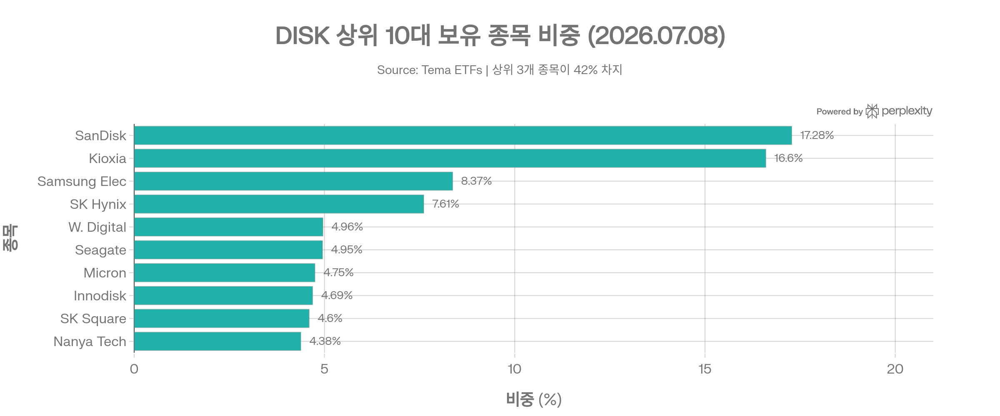
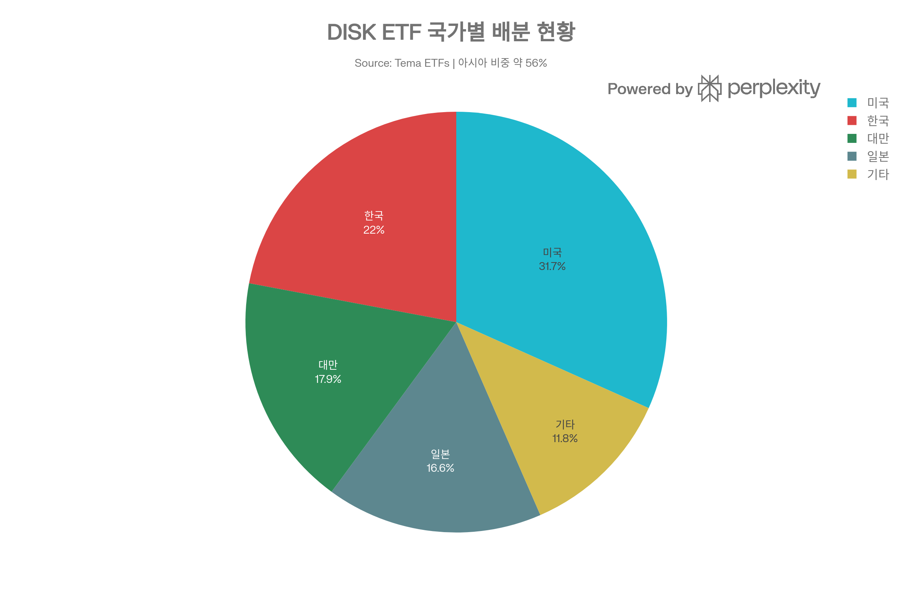

# DISK (Tema Memory ETF)

DISK는 Tema ETFs가 2026년 6월 30일 설정하고 NYSE Arca에 상장한 메모리 반도체 집중 액티브 ETF입니다. 반도체 리서치 전문기관 SemiAnalysis와 파트너십을 맺고, AI 인프라의 핵심 병목으로 꼽히는 HBM·DRAM·NAND 밸류체인 기업을 선별해 담습니다.

기존 반도체 ETF가 NVIDIA, Broadcom, TSMC처럼 반도체 산업 전체에 넓게 투자한다면, DISK는 <strong>메모리 사이클과 AI 메모리 수요</strong>라는 훨씬 좁은 축에 베팅하는 상품입니다.

## 1. 기본 정보

| 항목 | 내용 |
| --- | --- |
| 티커 | DISK |
| ETF명 | Tema Memory ETF |
| 운용사 | Tema ETFs |
| 상장 거래소 | NYSE Arca |
| 설정일 | 2026년 6월 30일 |
| 운용 방식 | 액티브 ETF (지수 미추종) |
| 총 보수 | 0.75% |
| 포트폴리오 매니저 | Yuri Khodjamirian(CIO), Hong Yi Chen |
| 투자 대상 | 글로벌 메모리·스토리지 밸류체인 기업 (HBM, DRAM, NAND, SSD, HDD) |
| 배당 성격 | 성장 테마형 ETF라 배당보다 가격 상승에 초점 |

DISK는 지수를 추종하지 않는 액티브 펀드로, 리서치 파트너 SemiAnalysis와 협업해 메모리·스토리지 공급망 전반의 기업을 선별 투자합니다. 2026년 7월 중순 기준 총자산(AUM)은 약 7,600만~8,060만 달러, 보유 종목 수는 19~22개 수준으로 집계되며(데이터 소스별 소폭 편차), 상장 직후부터 빠른 자금 유입을 기록했습니다.

## 2. 무엇에 투자하는 ETF인가

DISK의 핵심도 DRAM ETF와 마찬가지로 메모리입니다.

- <strong>HBM</strong>: AI GPU와 AI 가속기에 붙는 고대역폭 메모리
- <strong>DRAM</strong>: CPU, GPU, 서버, PC, 모바일에 쓰이는 휘발성 메모리
- <strong>NAND / SSD</strong>: 데이터 저장 장치와 스토리지 인프라
- <strong>HDD / 스토리지</strong>: 대용량 데이터 저장 수요와 연결

AI 시대에는 계산 칩만 중요한 것이 아닙니다. GPU가 아무리 빨라도 데이터를 충분히 빠르게 공급하지 못하면 병목이 생기고, HBM과 고성능 메모리는 이 병목을 푸는 핵심 부품으로 평가됩니다.

DISK가 다른 메모리 ETF와 다른 지점은 <strong>SemiAnalysis라는 전문 리서치 기관과의 협업</strong>입니다. 지수를 그대로 복제하는 대신, 리서치 파트너의 산업 분석을 바탕으로 포트폴리오 매니저가 종목을 능동적으로 선별·조정합니다.

## 3. 포트폴리오 구조

DISK는 소수 기업에 비중이 몰린 고집중 포트폴리오입니다. 2026년 7월 8일 기준 상위 10대 종목은 다음과 같습니다.

| 순위 | 종목명 | 티커 | 비중 |
| --- | --- | --- | --- |
| 1 | SanDisk | SNDK | 17.28% |
| 2 | Kioxia Holdings | 285A | 16.60% |
| 3 | Samsung Electronics | 005930 | 8.37% |
| 4 | SK Hynix | 000660 | 7.61% |
| 5 | Western Digital | WDC | 4.96% |
| 6 | Seagate Technology | STX | 4.95% |
| 7 | Micron Technology | MU | 4.75% |
| 8 | Innodisk | — | 4.69% |
| 9 | SK Square | 402340 | 4.60% |
| 10 | Nanya Technology | 2408 | 4.38% |

상위 4개 종목(SanDisk, Kioxia, Samsung Electronics, SK Hynix)만으로 자산의 절반가량을 차지하며, 상위 10대 종목의 합산 비중은 약 80%에 달합니다. Aehr Test Systems 같은 반도체 검사 장비 기업이 상위권에 들어올 때도 있어, 액티브 운용 특성상 리밸런싱에 따라 순위가 시점별로 바뀝니다.

섹터 비중으로 보면 정보기술(IT)이 90% 이상을 차지하고, 나머지는 산업재와 현금성 자산이 소폭 차지하는 구조입니다.

## 4. 국가별 특징

DISK도 DRAM ETF와 마찬가지로 아시아 비중이 매우 높습니다.

| 국가·지역 | 비중 |
| --- | --- |
| 미국 | 31.70% |
| 한국 | 22.04% |
| 대만 | 17.89% |
| 일본 | 16.60% |
| 기타 | 11.77% |

한국·대만·일본을 합치면 아시아 비중이 약 56%에 달합니다. 메모리 반도체 산업의 특성상 삼성전자·SK하이닉스(한국), 난야테크(대만), 키오시아(일본) 같은 기업 노출이 자연스럽게 커지는 구조입니다.

- 장점: 미국 계좌에서 삼성전자·SK하이닉스 등 아시아 메모리 대표 기업에 간접 접근 가능
- 단점: 원화·엔화·대만달러 등 다중 환율 변동과 지정학 이슈에 함께 노출

## 5. 비용과 유동성

DISK의 총보수는 0.75%로, SOXX·SMH 같은 광범위 반도체 지수 ETF(통상 0.35~0.40% 수준)보다 높습니다. SemiAnalysis와 협업한 심층 리서치 기반의 능동적 종목 선별 프리미엄으로 볼 수 있습니다. 회전율은 아직 0%로 보고되지만, 이는 설정 후 첫 연간 리포트 이전의 초기값이라 향후 실질 회전율은 더 높아질 가능성이 있습니다.

유동성 측면에서는 하루 거래량이 약 47만~77만 주 수준으로 신규 상장 테마 ETF치고는 활발한 편이지만, 30일 중간 매수·매도 스프레드는 0.30%로 대형 반도체 ETF보다 넓습니다. 상장 초기 NAV 대비 시장가격이 약 +3% 프리미엄을 형성했다가 빠르게 변동하는 등, 가격 발견 과정이 아직 안정화되지 않은 모습입니다.

## 6. 성과를 볼 때 주의할 점

DISK는 설정된 지 1개월 남짓으로 상장 이력이 매우 짧습니다. 따라서 1년·3년·5년 단위의 장기 성과나 하락장 방어력을 판단할 데이터 자체가 아직 존재하지 않습니다.

초기 3개월 수익률은 NAV 기준 +3.10%, 시장가격 기준 +6.12%로 집계됐지만, 최근에는 최근 5일 -9.94%, 최근 1개월 -32.96%에 이르는 큰 폭의 가격 하락도 관찰됩니다. 이는 메모리 반도체 섹터 특유의 높은 변동성과 상장 초기 프리미엄이 해소되는 과정이 겹친 결과로 해석할 수 있습니다.

베타 계수, 표준편차, 최대낙폭(MDD), 샤프지수 같은 통계적 리스크 지표 역시 운용 기간이 짧아 아직 통계적으로 유의미한 값이 산출되지 않은 상태입니다.

## 7. 투자 포인트

DISK를 긍정적으로 볼 수 있는 이유는 다음과 같습니다.

1. <strong>AI 서버의 메모리 수요 증가</strong>
   - 대형 AI 모델은 계산량뿐 아니라 메모리 대역폭과 용량을 크게 요구합니다.
2. <strong>HBM 병목</strong>
   - AI GPU 공급에서 HBM은 핵심 병목으로 자주 언급됩니다.
3. <strong>SemiAnalysis 리서치 협업</strong>
   - 지수를 그대로 따르지 않고 전문 리서치 기관과 협업한 능동적 종목 선별을 강점으로 내세웁니다.
4. <strong>소수 기업 중심 시장 노출</strong>
   - SanDisk, Kioxia, 삼성전자, SK하이닉스처럼 메모리 시장을 주도하는 소수 대형사에 집중 노출됩니다.
5. <strong>아시아 메모리 기업 접근성</strong>
   - 미국 계좌에서 한국·대만·일본의 메모리 대표 기업에 간접 접근할 수 있습니다.

## 8. 주요 리스크

| 리스크 | 설명 |
| --- | --- |
| 섹터 집중 리스크 | 정보기술 섹터에 90% 이상이 몰린 극단적 단일 산업 테마 펀드 |
| 메모리 사이클 리스크 | NAND·HBM 가격, 공급 과잉/부족 사이클에 성과가 크게 좌우됨 |
| 지역·환율 리스크 | 자산의 절반 이상이 한국·대만·일본에 노출되어 다중 환율 변동에 민감 |
| 유동성 리스크 | AUM이 아직 작고 스프레드가 대형 ETF 대비 넓으며, NAV 대비 가격 괴리가 큼 |
| 액티브 운용 리스크 | 포트폴리오 매니저의 종목 선정과 판단에 성과가 좌우되는 매니저 리스크 존재 |
| 신생 ETF 리스크 | 장기 성과·하락장 대응 이력이 없어 검증이 어려움 |
| 비용 부담 | 0.75% 보수는 대형 패시브 반도체 ETF보다 높음 |

특히 이 ETF는 방어적인 장기 코어 상품이 아니라, 메모리 반도체 테마에 강하게 베팅하는 위성형 상품에 가깝습니다.

## 9. 경쟁 ETF와 비교

| ETF | 핵심 성격 | DISK와의 차이 |
| --- | --- | --- |
| DISK | 메모리 반도체 액티브 집중 | SemiAnalysis 리서치 기반 능동적 종목 선별 |
| DRAM | 메모리 반도체 액티브 집중 | Roundhill 운용, HBM·DRAM·NAND 밸류체인에 집중 |
| SMH | 대형 반도체 | NVIDIA, TSMC, Broadcom 등 대형주 중심 |
| SOXX | 광범위 반도체 | 미국 반도체 대표주에 분산 |
| SOXL | 반도체 3배 레버리지 | 단기 트레이딩 성격이 강함 |

DISK와 DRAM은 둘 다 메모리 반도체에 좁게 집중하는 액티브 ETF라는 공통점이 있습니다. 차이는 운용사와 리서치 방식으로, DISK는 SemiAnalysis와의 협업을 강점으로 내세우는 반면 DRAM은 Roundhill이 자체적으로 운용합니다. AI 반도체 테마를 사고 싶지만 GPU 설계사보다 <strong>메모리 공급망</strong>에 집중하고 싶을 때 두 ETF 모두 고려할 수 있는 상품입니다.

## 10. 어떤 투자자에게 맞을까

DISK가 맞을 수 있는 투자자:

- AI 인프라 중에서도 메모리 병목에 집중하고 싶은 투자자
- SanDisk, Kioxia, 삼성전자, SK하이닉스에 한 번에 노출되고 싶은 투자자
- SOXX, SMH보다 더 좁은 테마 ETF를 원하는 투자자
- 지수 추종보다 리서치 기반의 능동적 종목 선별을 선호하는 투자자

주의가 필요한 투자자:

- 안정적인 분산 ETF를 원하는 투자자
- 배당이나 낮은 변동성을 중시하는 투자자
- 메모리 업황 사이클을 따라가기 어려운 투자자
- 상장 초기 ETF 특유의 가격 변동성(최근 1개월 -32.96%)을 감당하기 어려운 투자자

## 11. 결론

DISK는 AI 시대의 핵심 병목 중 하나인 메모리에 집중하는 액티브 ETF입니다. SanDisk, Kioxia, 삼성전자, SK하이닉스 등 HBM·NAND·DRAM 선도 기업에 고집중 투자하며, SemiAnalysis와의 리서치 협업을 통한 차별화된 종목 발굴을 강점으로 내세웁니다.

다만 설정 1개월 남짓의 극초기 단계 펀드로 장기 성과 데이터, 배당 이력, 리스크 조정 지표(샤프, 베타, MDD)가 전혀 확립되지 않았다는 점, 0.75%의 상대적으로 높은 보수, 90%대의 극단적 기술 섹터 집중도, 최근 1개월 -32.96%의 급격한 가격 변동성은 신중한 접근이 필요한 요인입니다.

요약하면, DISK는 메모리 반도체 사이클과 AI 인프라 투자 지속성에 대한 강한 확신이 있는 투자자에게 적합한 고위험·고집중 위성형 테마 ETF입니다.

## 참고 자료

- [Tema ETFs - Tema Memory ETF (DISK)](https://www.temaetfs.com/)
- [StockAnalysis - DISK ETF Overview](https://stockanalysis.com/etf/disk/)
