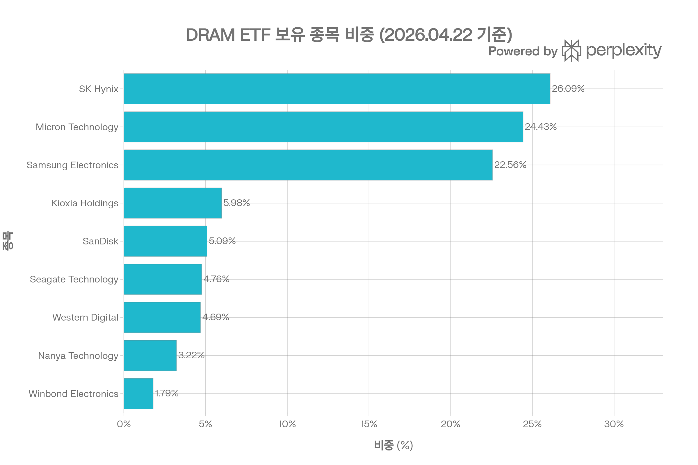
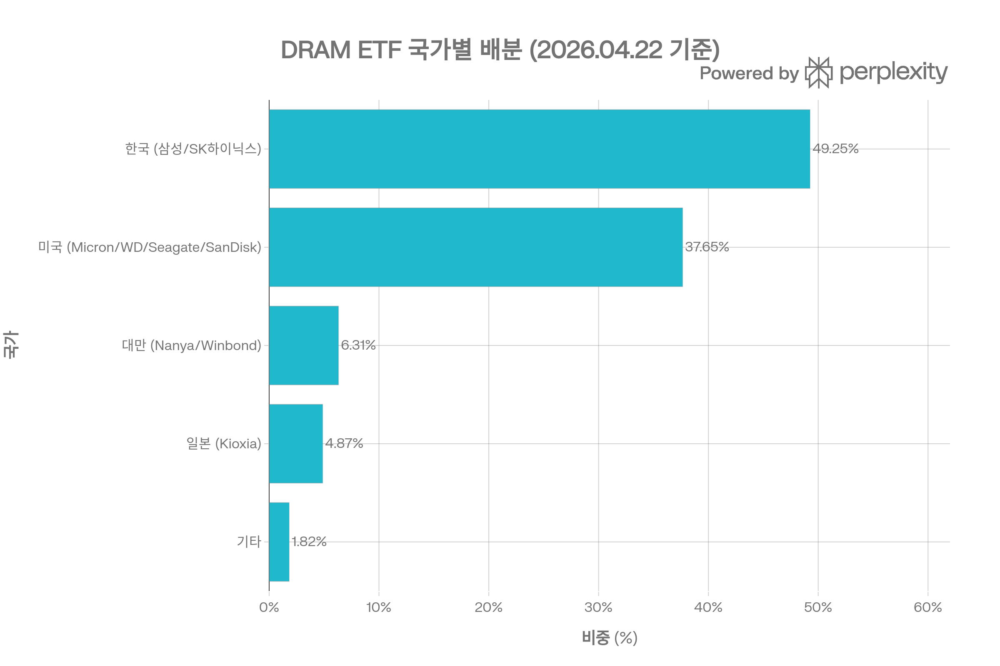
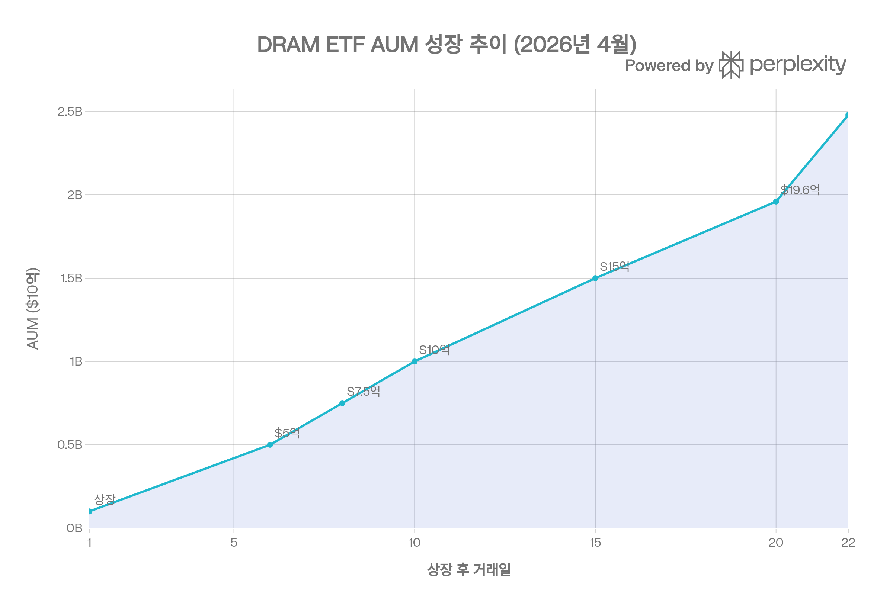
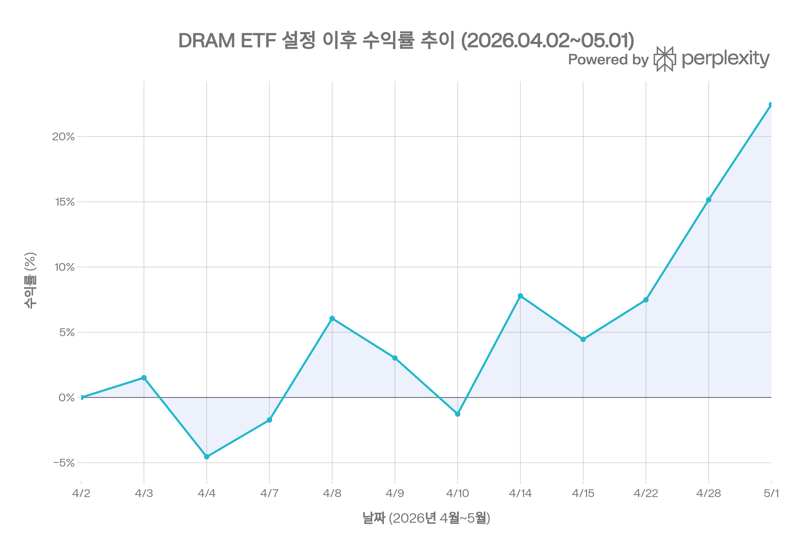

# DRAM (Roundhill Memory ETF)

DRAM은 Roundhill Investments가 운용하는 메모리 반도체 집중 ETF입니다. 이름 그대로 DRAM, HBM, NAND, 스토리지처럼 AI 인프라에서 병목으로 자주 언급되는 메모리 밸류체인에 초점을 맞춥니다.

기존 반도체 ETF가 NVIDIA, Broadcom, TSMC, ASML처럼 반도체 산업 전체에 넓게 투자한다면, DRAM은 훨씬 좁게 <strong>메모리 사이클과 AI 메모리 수요</strong>에 베팅하는 상품에 가깝습니다.

## 1. 기본 정보

| 항목 | 내용 |
| --- | --- |
| 티커 | DRAM |
| ETF명 | Roundhill Memory ETF |
| 운용사 | Roundhill Investments |
| 상장 거래소 | Cboe BZX |
| 상장일 | 2026년 4월 2일 |
| 운용 방식 | 액티브 ETF |
| 총 보수 | 0.65% |
| 투자 대상 | 글로벌 메모리 반도체 및 스토리지 기업 |
| 배당 성격 | 성장 테마형 ETF라 배당보다 가격 상승에 초점 |

공식 설명상 DRAM은 글로벌 메모리 칩 기업에 대한 정밀한 노출을 제공하는 것을 목표로 합니다. 특히 AI 데이터센터 확산으로 HBM, DRAM, NAND 수요가 커지는 흐름을 직접적으로 반영하려는 상품입니다.

## 2. 무엇에 투자하는 ETF인가

DRAM의 핵심은 메모리입니다.

- <strong>HBM</strong>: AI GPU와 AI 가속기에 붙는 고대역폭 메모리
- <strong>DRAM</strong>: CPU, GPU, 서버, PC, 모바일에 쓰이는 휘발성 메모리
- <strong>NAND / SSD</strong>: 데이터 저장 장치와 스토리지 인프라
- <strong>HDD / 스토리지</strong>: 대용량 데이터 저장 수요와 연결

AI 시대에는 계산 칩만 중요한 것이 아닙니다. GPU가 아무리 빨라도 데이터를 충분히 빠르게 공급하지 못하면 병목이 생깁니다. 그래서 HBM과 고성능 메모리는 AI 서버 성능을 좌우하는 핵심 부품으로 평가됩니다.

DRAM은 이 지점에 집중합니다. 즉, 이 ETF는 "AI 반도체 전체"보다는 <strong>AI 메모리 병목</strong>에 더 가까운 투자 상품입니다.

## 3. 포트폴리오 구조

DRAM은 일반적인 분산형 ETF가 아닙니다. 메모리 산업 자체가 소수 기업 중심으로 형성되어 있기 때문에, 포트폴리오도 자연스럽게 매우 집중됩니다.

대표적으로 자주 언급되는 핵심 기업은 다음과 같습니다.

| 기업 | 국가 | 역할 |
| --- | --- | --- |
| SK하이닉스 | 한국 | HBM과 DRAM 핵심 기업 |
| Micron Technology | 미국 | 미국 대표 메모리 기업 |
| 삼성전자 | 한국 | DRAM, NAND, HBM 주요 공급자 |
| Kioxia | 일본 | NAND 플래시 |
| Western Digital / SanDisk | 미국 | NAND, SSD, 스토리지 |
| Seagate | 미국 | HDD, 대용량 스토리지 |
| Nanya / Winbond | 대만 | DRAM 및 특수 메모리 |

DRAM의 투자 논리는 명확합니다. AI 인프라 투자 확대가 계속되고, HBM과 서버 메모리 수요가 강하게 유지된다면 메모리 기업들이 직접 수혜를 받을 수 있다는 관점입니다.

반대로 메모리 가격이 꺾이거나, HBM 공급 과잉 우려가 커지면 ETF 전체가 크게 흔들릴 수 있습니다.

## 4. 국가별 특징

DRAM ETF의 가장 큰 특징 중 하나는 한국 기업 비중입니다. SK하이닉스와 삼성전자가 메모리 시장에서 차지하는 위치가 크기 때문에, DRAM은 한국 메모리 산업에 대한 간접 노출이 큽니다.

이 구조는 장점과 리스크를 동시에 만듭니다.

- 장점: 미국 계좌에서 한국 메모리 대표 기업에 간접 접근 가능
- 단점: 원화, 한국 시장, 지정학, 개별 기업 이슈에 민감

특히 SK하이닉스와 삼성전자는 미국 시장에서 직접 사기 불편한 투자자에게는 DRAM이 우회 수단이 될 수 있습니다. 다만 이는 단순 미국 반도체 ETF와 다른 리스크를 가진다는 뜻이기도 합니다.

## 5. AUM과 시장 관심

DRAM은 출시 직후부터 시장의 관심을 크게 받았습니다. AI 반도체 랠리가 NVIDIA 중심에서 HBM, 메모리, 서버, 데이터센터 인프라로 확산되던 시점과 맞물렸기 때문입니다.

이런 빠른 자금 유입은 두 가지를 의미합니다.

- 시장이 AI 메모리 병목 테마를 강하게 인식하고 있음
- 동시에 단기 수급이 과열될 가능성도 있음

테마형 ETF는 보통 관심이 가장 뜨거울 때 출시되는 경우가 많습니다. 따라서 DRAM은 장기 구조적 테마는 분명하지만, 진입 시점에는 가격 과열 여부를 반드시 같이 봐야 합니다.

## 6. 성과를 볼 때 주의할 점

DRAM은 상장 이력이 짧습니다. 따라서 긴 기간의 성과 데이터로 운용 능력이나 하락장 방어력을 평가하기 어렵습니다.

특히 메모리 산업은 전형적인 사이클 산업입니다.

- 수요가 강하면 가격과 이익이 빠르게 좋아짐
- 공급이 늘면 가격이 급격히 꺾일 수 있음
- AI 수요와 일반 소비자 메모리 수요가 다르게 움직일 수 있음
- HBM은 강한데 범용 DRAM이나 NAND는 약한 구간도 가능

즉, DRAM ETF는 "반도체 장기 성장"보다 더 좁은 <strong>메모리 업황 사이클</strong>에 민감합니다.

## 7. 투자 포인트

DRAM을 좋게 볼 수 있는 이유는 명확합니다.

1. <strong>AI 서버의 메모리 수요 증가</strong>
   - 대형 AI 모델은 계산량뿐 아니라 메모리 대역폭과 용량을 크게 요구합니다.

2. <strong>HBM 병목</strong>
   - AI GPU 공급에서 HBM은 핵심 병목으로 자주 언급됩니다.

3. <strong>소수 기업 중심 시장</strong>
   - 메모리 시장은 SK하이닉스, 삼성전자, Micron처럼 소수 대형사가 주도합니다.

4. <strong>기존 반도체 ETF와 차별화</strong>
   - SOXX, SMH와 달리 NVIDIA 비중보다 메모리 기업 비중이 핵심입니다.

5. <strong>한국 메모리 기업 접근성</strong>
   - 미국 투자자 입장에서 SK하이닉스와 삼성전자 노출을 얻기 쉽습니다.

## 8. 주요 리스크

DRAM은 구조적으로 공격적인 ETF입니다.

| 리스크 | 설명 |
| --- | --- |
| 집중 리스크 | 보유 종목 수가 적고 상위 기업 비중이 높음 |
| 메모리 사이클 리스크 | 공급 과잉 시 가격과 이익이 빠르게 악화될 수 있음 |
| 한국 비중 리스크 | 원화, 한국 시장, 지정학 이슈에 민감 |
| 신생 ETF 리스크 | 장기 성과와 하락장 운용 이력이 부족 |
| 테마 과열 리스크 | AI/HBM 기대가 가격에 선반영됐을 수 있음 |
| 비용 부담 | 0.65% 보수는 대형 패시브 반도체 ETF보다 높음 |

특히 이 ETF는 방어적인 장기 코어 ETF라기보다, 메모리 반도체 테마에 강하게 베팅하는 위성형 상품에 가깝습니다.

## 9. 경쟁 ETF와 비교

| ETF | 핵심 성격 | DRAM과의 차이 |
| --- | --- | --- |
| DRAM | 메모리 반도체 집중 | HBM, DRAM, NAND에 직접 집중 |
| SMH | 대형 반도체 | NVIDIA, TSMC, Broadcom 등 대형주 중심 |
| SOXX | 광범위 반도체 | 미국 반도체 대표주에 분산 |
| CHPS | AI 반도체 | AI 칩 설계, 장비, 파운드리 등 폭넓은 AI 반도체 |
| CHPX | AI 반도체 + 양자 | AI 반도체와 양자컴퓨팅을 함께 반영 |
| SOXL | 반도체 3배 레버리지 | 단기 트레이딩 성격이 강함 |

DRAM의 핵심 차별점은 NVIDIA 중심이 아니라는 점입니다. AI 반도체 테마를 사고 싶지만 GPU 설계사보다 <strong>HBM과 메모리 공급망</strong>에 집중하고 싶을 때 고려할 수 있는 상품입니다.

## 10. 어떤 투자자에게 맞을까

DRAM이 맞을 수 있는 투자자:

- AI 인프라 중에서도 메모리 병목에 집중하고 싶은 투자자
- SK하이닉스, 삼성전자, Micron에 한 번에 노출되고 싶은 투자자
- SOXX, SMH보다 더 좁은 테마 ETF를 원하는 투자자
- 포트폴리오의 일부 위성 비중으로 공격적인 반도체 테마를 담고 싶은 투자자

주의가 필요한 투자자:

- 안정적인 분산 ETF를 원하는 투자자
- 배당이나 낮은 변동성을 중시하는 투자자
- 반도체 업황 사이클을 따라가기 어려운 투자자
- 단기 급등 후 추격 매수 리스크를 피하고 싶은 투자자

## 11. 결론

DRAM은 AI 시대의 핵심 병목 중 하나인 <strong>메모리</strong>에 집중하는 ETF입니다. HBM, DRAM, NAND, 스토리지 기업에 직접적으로 노출되기 때문에 AI 인프라 투자가 메모리 기업 실적으로 이어진다고 보는 투자자에게는 매우 선명한 상품입니다.

다만 선명한 만큼 리스크도 큽니다. 종목 수가 적고, 한국 메모리 기업 비중이 높으며, 메모리 사이클에 크게 흔들릴 수 있습니다. 따라서 DRAM은 포트폴리오의 중심축보다는 AI 반도체 테마를 보강하는 위성형 ETF로 보는 편이 더 현실적입니다.

요약하면, DRAM은 <strong>"AI 반도체를 사고 싶다"보다 더 구체적으로 "AI 메모리 병목에 투자하고 싶다"는 관점의 ETF</strong>입니다.

## 참고 자료

- [Roundhill - Roundhill Memory ETF (DRAM)](https://www.roundhillinvestments.com/etf/dram/)
- [Roundhill DRAM Factsheet](https://www.roundhillinvestments.com/assets/pdfs/dram_factsheet.pdf)
- [StockAnalysis - DRAM ETF Overview](https://stockanalysis.com/etf/dram/)
