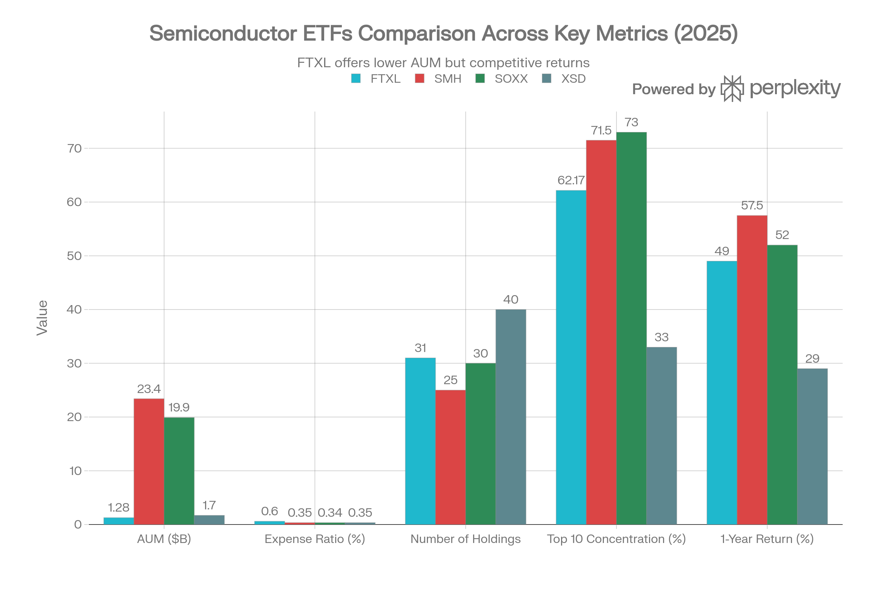
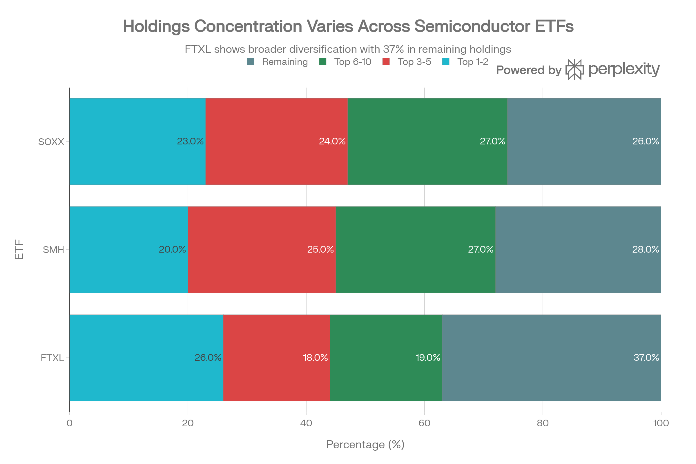

## 요약

> <strong>분석 기준일:</strong> 2026년 4월 15일  
> <strong>데이터 출처:</strong> First Trust Advisors, Market Data, ETF Database, Morningstar, Digrin 등

***
## ETF 분류

| 항목 | 내용 |
|------|------|
| <strong>최종 폴더</strong> | `ETF/Semiconductor/FTXL` |
| <strong>대분류</strong> | 테마 |
| <strong>하위 분류</strong> | 반도체 |
| <strong>핵심 전략</strong> | Nasdaq US Smart Semiconductor Index 추종 |
| <strong>운용 방식</strong> | 패시브 |
| <strong>레버리지·인버스 여부</strong> | 아니오 |
| <strong>옵션 인컴 전략 여부</strong> | 아니오 |

FTXL은 명칭에 `Nasdaq`이 포함되어 있지만 대표지수 ETF가 아니라 반도체 기업에 집중 투자하는 <strong>반도체 테마 ETF</strong>입니다. 따라서 실제 보유 종목과 추종 지수의 산업 노출을 기준으로 `Semiconductor` 폴더에 분류합니다.

***
## 1. 기본 정보
<strong>FTXL</strong>은 First Trust Advisors L.P.가 운용하는 반도체 섹터 집중 ETF로, 독자적인 팩터 가중 방식을 채택한 스마트 베타(Smart Beta) ETF입니다.[1][2]

| 항목 | 내용 |
|------|------|
| 정식 명칭 | First Trust Nasdaq Semiconductor ETF |
| 티커 | FTXL (NASDAQ) |
| 설정일 | 2016년 9월 20일 |
| 운용 기간 | 약 9년 (2016년\~현재) |
| 운용사 | First Trust Advisors L.P. |
| 상장거래소 | NASDAQ |
| 추종 지수 | Nasdaq US Smart Semiconductor™ Index (NQSSSE) |
| 현재 주가 | $180.35 (2026.04.15 기준) |
| 순자산 규모(AUM) | 약 $4억 7,500만 달러 |
| 총 보수비율(TER) | 0.60% |
| 펀드 매니저 | Erik Russo |
| CUSIP | US33738R8117 |

- <strong>순자산 규모(AUM):</strong> 약 $4.75억 달러[3][4]
- <strong>52주 최저/최고:</strong> $64.62 / $180.84[2]
- <strong>PE 비율:</strong> 41.08 (EPS $4.39 기준)[1]

***
## 2. 추종 지수 — Nasdaq US Smart Semiconductor™ Index
FTXL이 추종하는 <strong>Nasdaq US Smart Semiconductor™ Index(NQSSSE)</strong>는 단순 시가총액 가중 방식이 아닌 <strong>팩터 스크리닝(Factor Screening)</strong> 기반으로 구성됩니다.[5][6]
### 지수 구성 방법론
- <strong>유동성(Liquidity) 기반 선별:</strong> 미국 Nasdaq 상장 반도체 기업 중 3개월 평균 일일 거래량 상위 30개 종목을 선별[7]
- <strong>3가지 팩터 가중:</strong> 변동성(Volatility), 가치(Value), 성장(Growth) 팩터 조합으로 종목별 가중치 산출[5][6]
- <strong>리밸런싱 주기:</strong> 정기적(분기 또는 반기) 리밸런싱으로 팩터 반영[5]
- <strong>결과적 특성:</strong> 메가캡 단일 종목 집중도를 낮추고 중소형 반도체 종목에도 상대적으로 높은 비중 부여[8]

이러한 팩터 방식은 AI, 데이터센터, 전기차, 산업자동화 등 광범위한 반도체 가치 사슬에 노출을 제공합니다.[8]

***
## 2. 추종 성과 지표
### 추적오차(Tracking Error) 및 추적 차이(Tracking Difference)
FTXL은 패시브 인덱스 ETF로서 기본적으로 추종 지수 수익률에서 비용만큼 차감된 성과를 추구합니다. 0.60%의 TER이 추적 차이의 주요 요인이며, 팩터 기반 지수 특성상 일반 시가총액 가중 ETF보다 추적오차가 다소 높을 수 있습니다.[9][10]

| 지표 | 수치 |
|------|------|
| TER 기반 추적 차이 예상 | 연간 약 -0.60% |
| 포트폴리오 회전율 | 19% (연간)[11] |
| NAV 대비 프리미엄/디스카운트 | +0.07% \~ +0.12% 수준 (매우 낮음)[7] |
| NAV (2026.04.13 기준) | $174.09[1] |
| 시장가격 (2026.04.10 기준) | $174.29[1] |

<strong>NAV 괴리율 분석:</strong> FTXL의 NAV 대비 시장 가격 괴리율은 통상 0.07\~0.12% 수준의 소폭 프리미엄을 유지하며, 이는 반도체 섹터 ETF로서 비교적 양호한 괴리율 관리 수준입니다. 하지만 거래량이 상대적으로 낮아 변동성 확대 시 괴리율이 커질 위험이 있습니다.[12][7]

***
## 3. 비용 구조
### 총 보수 및 비용
FTXL의 <strong>총 보수비율(TER)은 0.60%</strong>로, 동일 반도체 섹터 내 경쟁 ETF 대비 높은 편입니다. 이는 팩터 기반 스마트 베타 전략 적용에 따른 추가 비용을 반영합니다.[1][12][13]
### 경쟁 ETF 비용 비교

| ETF | 운용사 | 추종 지수 | TER | AUM |
|-----|--------|----------|-----|-----|
| <strong>FTXL</strong> | First Trust | Nasdaq US Smart Semiconductor | <strong>0.60%</strong> | \~$4.75억 |
| SOXX | iShares (BlackRock) | PHLX Semiconductor Sector | 0.34%[14] | \~$250.8억 |
| SMH | VanEck | MVIS US Listed Semiconductor 25 | 0.35%[14] | \~$521.6억 |
| XSD | State Street SPDR | S&P Semiconductor Select Industry | 0.35%[15] | \~$19.4억 |
FTXL의 0.60% 비용은 SOXX·SMH의 약 1.76배 수준입니다. 그러나 팩터 전략이 실제로 초과 성과를 창출할 경우, 비용 차이를 상쇄할 수 있다는 점에서 단순 비용만으로 비교하기 어렵습니다.[12][11]

- <strong>포트폴리오 회전율:</strong> 19% — SOXX(27%)보다 낮은 수준으로, 거래 비용 측면에서 유리[11]
- <strong>호가 스프레드:</strong> 소규모 AUM과 낮은 거래량으로 인해 SOXX·SMH 대비 스프레드가 상대적으로 넓음[12]

***
## 4. 유동성 평가

FTXL은 반도체 섹터 ETF 중 <strong>유동성이 상대적으로 제한적인</strong> 편입니다.

| 유동성 지표 | FTXL | SOXX | SMH |
|------------|------|------|-----|
| 일평균 거래량 (3개월) | 약 197,336주 | 약 748만주 | 약 904만주 |
| AUM 규모 | \~$4.75억 | \~$250억 | \~$521억 |
| 프리미엄/디스카운트 | \~0.07\~0.12% | 매우 낮음 | 매우 낮음 |
- <strong>FTXL의 일평균 거래량(약 197,336주)은 SMH(약 9,036,600주)의 약 2.2%에 불과합니다</strong>. 이는 기관투자자 입장에서 대규모 포지션 진입/청산 시 비용 부담이 될 수 있습니다.[12]
- 소규모 투자자나 장기 보유 목적의 개인 투자자에게는 유동성 문제가 실질적 제약이 되기 어렵지만, 대규모 자금 운용 시 마켓임팩트를 감안해야 합니다.[12]
- <strong>유동성 안정성:</strong> 2020년 이후 꾸준한 성장세이나, 경쟁 ETF 대비 거래량 성장 속도가 느린 편입니다.[2]

***
## 5. 포트폴리오 구성
### 상위 10대 보유 종목 (2026년 4월 기준)
| 순위 | 티커 | 종목명 | 비중 |
|------|------|--------|------|
| 1 | INTC | Intel Corporation | 9.59% |
| 2 | AVGO | Broadcom Inc. | 8.17% |
| 3 | MU | Micron Technology, Inc. | 7.74% |
| 4 | NVDA | NVIDIA Corporation | 7.60% |
| 5 | QCOM | QUALCOMM Incorporated | 6.39% |
| 6 | MRVL | Marvell Technology, Inc. | 5.61% |
| 7 | AMD | Advanced Micro Devices, Inc. | 4.37% |
| 8 | KLAC | KLA Corporation | 4.04% |
| 9 | LRCX | Lam Research Corporation | 3.99% |
| 10 | AMKR | Amkor Technology, Inc. | 3.77% |

- <strong>상위 10종목 집중도:</strong> 약 61.3% — SMH(상위 1\~2종목이 30\~40% 차지)보다 분산된 구조[8]
- <strong>총 보유 종목 수:</strong> 34개 종목 (현금 제외)[2]
- <strong>미국 반도체 기업 100% 집중:</strong> 해외 반도체 기업(TSMC, ASML 등)은 포함되지 않음[16]
### 섹터별 배분
FTXL은 <strong>반도체 단일 섹터(100%)</strong> ETF로, 내부적으로 반도체 밸류체인 전반에 걸쳐 분산됩니다:[16]

- <strong>반도체 설계(Fabless):</strong> NVDA, AMD, QCOM, MRVL 등
- <strong>종합 반도체(IDM):</strong> INTC, TXN 등
- <strong>메모리:</strong> MU
- <strong>반도체 장비:</strong> KLAC, LRCX, AMAT, TER
- <strong>아날로그/혼합신호:</strong> ADI, SWKS, MPWR
- <strong>후공정/패키징:</strong> AMKR
### 리밸런싱 주기
지수 방법론에 따라 정기적으로 리밸런싱하며, 팩터 점수 변화에 따라 종목 및 가중치가 조정됩니다. 연간 회전율 19%는 분기 리밸런싱을 시사합니다.[5][6][11]

***
## 6. 성과 분석
### 기간별 수익률
| 기간 | FTXL | SOXX | SMH |
|------|------|------|-----|
| 1개월 | +17.21%[17] | - | - |
| 3개월 | +27.18%[17] | - | - |
| 6개월 | +10.17%[17] | - | - |
| 1년 | -3.22%[17] | 약 -10% | 약 -10% |
| 3년 (연환산) | +22.83%[17] | +22.9%[18] | +35.9%[18] |
| 5년 (연환산) | +17.52%[17] | +21.6%[18] | +29.6%[18] |
> <strong>주요 성과 포인트</strong>
> - 2026년 YTD(연초 이후): <strong>+21.1%</strong> 로 경쟁 ETF 중 최상위 성과[12]
> - 2026년 1월 기준 1년 수익률: <strong>+78.13%</strong> (AI 반도체 사이클 최정점)[2]
> - 3년 성과는 SOXX와 유사하지만, 5년 성과는 SMH(+29.6%)에 비해 다소 낮음[18]
### 벤치마크 대비 분석
FTXL의 팩터 전략(유동성+가치+성장)은 특정 시장 국면에서 강점을 발휘합니다. 2026년처럼 중소형 반도체 주가 상승하는 환경에서 FTXL은 메가캡 중심 ETF(SMH)를 상회하며, 반면 NVIDIA 등 단일 메가캡이 시장을 주도할 때는 성과가 상대적으로 뒤처질 수 있습니다.[12][15]
### 주요 리스크 지표
| 지표 | 수치 |
|------|------|
| 베타 (3년) | 1.41[2] |
| 표준편차 (3년 연환산) | 33.97%[2] |
| 1년 변동성 (연환산) | 약 44.25% |
| 최대 낙폭 (MDD, 전체 이력) | <strong>-44.16%</strong> (2022년 하락 사이클)[19] |
| 샤프 비율 (All-Time) | 0.77\~0.84[20][19] |
| 임플라이드 변동성 | 42.76%[21] |

- <strong>베타 1.41</strong>은 시장(S&P 500) 대비 1.41배 변동성을 의미하며, 반도체 섹터의 고베타 특성을 반영합니다[2]
- <strong>최대 낙폭 -44.16%</strong>는 2021\~2022년 반도체 하락 사이클에서 발생했으며, 이는 섹터 집중 투자에 따른 내재적 리스크입니다[19]

***
## 7. 배당 정보
FTXL은 <strong>분기 배당</strong> 지급 구조이나, 배당 수익률이 매우 낮아 성장형 ETF에 가깝습니다.[22]

| 배당 지표 | 내용 |
|----------|------|
| 배당 수익률 | 0.20% (현재)[4] |
| 배당 지급 주기 | 분기별 (3, 6, 9, 12월)[22] |
| 최근 배당금 | $0.01/주 (2026.04 기준)[23] |
| 페이아웃 비율 | 약 11.44\~12.80%[22][23] |
| 3년 배당 성장률 | 약 30%[23] |
| 5년 배당 성장률 | 약 19.3%[23] |
배당금은 분기별로 변동성이 크며($0.0073 \~ $0.1867/주), 포트폴리오 내 반도체 기업들의 배당 정책에 연동됩니다. 배당보다는 <strong>자본 차익(Capital Gain)</strong> 위주의 투자 상품으로 분류됩니다.[22][23]

***
## 8. 리스크 요소
### 베타 및 상관계수
- <strong>베타 1.41:</strong> 시장 전체 대비 높은 민감도, 반도체 업황 변화에 즉각 반응[2]
- <strong>SOXX와 상관계수 0.96:</strong> 두 ETF는 거의 동일하게 움직이나, 종목 구성 차이로 인한 성과 차이가 발생[14]
- <strong>시장 전반과의 상관:</strong> 반도체 섹터 특성상 경기 사이클과 높은 상관관계[8]
### 주요 리스크 항목
1. <strong>섹터 집중도 리스크:</strong> 100% 반도체 단일 섹터 노출로, 업황 하락 시 분산 효과 없음[1]
2. <strong>유동성 리스크:</strong> 일평균 거래량이 SOXX/SMH 대비 현저히 낮아, 대규모 포지션 조정 시 매도 어려움[12]
3. <strong>메가캡 소외 리스크:</strong> 팩터 가중으로 NVIDIA 등 단일 종목 비중이 타 ETF보다 낮아, 이들 주가 상승 시 상대적 언더퍼폼 가능[15]
4. <strong>팩터 리스크:</strong> 팩터 전략은 특정 시장 국면에서 역풍을 맞을 수 있음[1]
5. <strong>미국 반도체 한정:</strong> TSMC, ASML 등 해외 우량 반도체 기업 미포함으로 글로벌 다각화 부재[16]
6. <strong>비용 불이익:</strong> 경쟁 ETF(SOXX, SMH) 대비 0.26%p 높은 TER은 장기 복리 효과에서 불리[14]
7. <strong>기술 진부화 리스크:</strong> 반도체 기업들의 단기 제품 수명 주기, 치열한 경쟁[1]
8. <strong>반도체 경기 사이클:</strong> 2022년처럼 약 -44%의 대폭 낙폭 가능[19]

***
## 9. 경쟁 ETF 종합 비교
| 항목 | FTXL | SOXX | SMH | XSD |
|------|------|------|-----|-----|
| 운용사 | First Trust | iShares | VanEck | State Street |
| 설정일 | 2016 | 2001 | 2011 | 2006 |
| AUM | \~$4.75억 | \~$250억 | \~$521억 | \~$19억 |
| TER | 0.60% | 0.34% | 0.35% | 0.35% |
| 종목 수 | 34개 | \~30개 | 25개 | \~40개 |
| 전략 | 팩터 가중(유동성+가치+성장) | 시가총액 가중 | 시가총액 가중 | 동일 가중 |
| 일평균 거래량 | \~197K | \~748만 | \~904만 | \~3.8만 |
| 3년 연환산 | +22.83% | +22.9% | +35.9% | \~+17.9% |
| 5년 연환산 | +17.52% | +21.6% | +29.6% | \~+18.5% |
| 베타 | 1.41 | \~1.3 | \~1.4 | \~1.3 |

<strong>핵심 차별점:</strong>
- FTXL은 <strong>유동성 + 팩터 가중</strong>이라는 독특한 방법론으로 메가캡 집중을 완화[7]
- 2026년 YTD 성과에서 FTXL(+21.1%)이 SOXX(+16.9%), SMH(+12.9%)를 앞선 것은 팩터 전략 효과 입증[12]
- 그러나 비용(0.60%)이 가장 높고 유동성이 가장 낮다는 구조적 한계 존재[14][12]

***
## 10. 투자 포인트 종합
### 투자 매력 요소 (Bullish)
- 팩터 기반 스마트 베타 전략으로 <strong>분산도 개선</strong> — 메가캡 편중 리스크 완화[8]
- AI/데이터센터/전기차 구조적 성장 수혜로 반도체 장기 성장 모멘텀 향유[8]
- 2026년 YTD +21.1%로 경쟁 ETF 중 최상위 성과[12]
- 분기 리밸런싱으로 팩터 트렌드 변화 적극 반영[5]
### 투자 주의 요소 (Bearish)
- <strong>0.60% TER</strong>은 장기 투자 시 비용 부담이 상당히 축적됨[14]
- <strong>일평균 거래량 \~197K주</strong>로 SOXX/SMH 대비 유동성 현저히 낮음[12]
- <strong>MDD -44.16%</strong>는 반도체 하락 사이클 시 극심한 손실 가능성 내포[19]
- 5년 누적 성과는 SMH 대비 열위 — 강한 메가캡 환경에서는 성과 저하[18]
- 순수 미국 반도체만 포함, 글로벌 반도체 리더(TSMC 등) 미포함[16]
### 투자 적합 대상
- 반도체 섹터에 집중하되, 메가캡(NVDA, TSM) 과집중을 피하고 싶은 투자자
- 팩터 기반 스마트 베타 전략에 관심 있는 투자자
- 소액으로 34개 미국 반도체 종목에 분산 투자를 원하는 장기 투자자
- 단, 높은 비용, 낮은 유동성, 섹터 집중 리스크를 감수할 수 있는 투자자

> ⚠️ <strong>본 보고서는 투자 권유가 아니며, 투자 결정 전 전문가 상담과 추가 리서치를 권장합니다.</strong>
