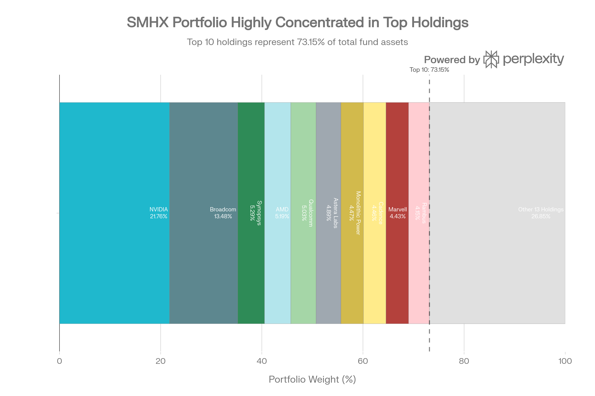
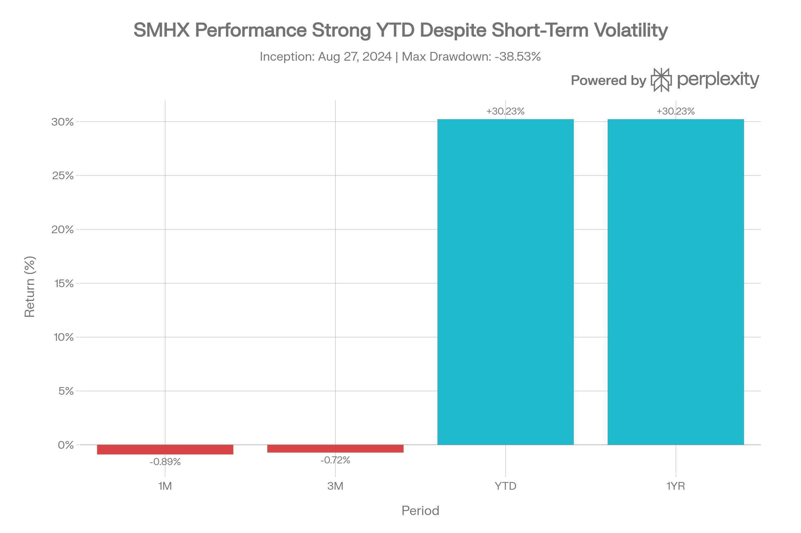
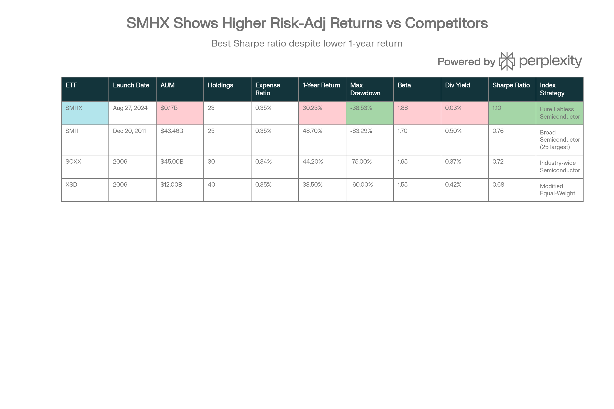

# VanEck Fabless Semiconductor ETF (SMHX): 종합 분석 보고서

## ETF 분류

| 항목 | 내용 |
|---|---|
| 최종 폴더 | `ETF/Semiconductor/Fabless/SMHX` |
| 대분류 | 테마 |
| 하위 분류 | 반도체 / 팹리스 |
| 핵심 전략 | MarketVector US Listed Fabless Semiconductor Index를 추종해 반도체 설계 중심의 팹리스 기업에 집중 투자 |
| 운용 방식 | 패시브 팹리스 반도체 테마 ETF |
| 레버리지/인버스 | 없음 |
| 옵션 인컴 여부 | 없음 |
| 분류 판단 | 광범위 반도체 ETF가 아니라 제조를 외주하고 설계에 집중하는 팹리스 반도체 기업 노출이 핵심이므로 `ETF/Semiconductor/Fabless`로 분류 |

***

### 개요 및 펀드 구조

VanEck Fabless Semiconductor ETF (SMHX)는 2024년 8월 27일에 출시된 새로운 세대의 전문화된 반도체 ETF로, 순수 팹리스(fabless) 반도체 설계 회사들에 집중 투자하는 유일한 ETF입니다. 현재 약 \$170-173M의 자산 규모를 보유하고 있으며, MarketVector US Listed Fabless Semiconductor Index(MVSMHXTR)를 추종합니다.[^1][^2][^3]

**핵심 특성**
SMHX는 세계 반도체 산업의 복잡한 가치사슬 중 특정 부분—설계에만 집중하고 제조는 외주하는 기업들—을 대상으로 합니다. 이 집중 전략은 NVIDIA, Broadcom, Synopsys, AMD 같은 AI 중심의 반도체 설계 리더들에 대한 노출을 제공합니다. 펀드는 23개의 순수 팹리스 기업을 보유하고 있으며, 현재가 기준으로 \$39-40 범위에서 거래되고 있습니다.[^4][^5][^6][^7]

### 포트폴리오 구성 및 농축도 분석

SMHX Portfolio Composition: Top 10 Holdings Represent 73.15% of Fund

SMHX의 포트폴리오는 높은 농축도를 특징으로 합니다. 상위 10대 종목이 전체 자산의 73.15%를 차지하며, NVIDIA만 21.76%를 차지하고 있습니다. Broadcom(13.48%), Synopsys(5.29%), AMD(5.19%), Qualcomm(5.03%)이 그 뒤를 따릅니다. 이러한 농축도 구조는 팹리스 반도체 산업의 실제 시장 현황을 반영하는 동시에, 투자자들에게 상당한 집중 위험(concentration risk)을 노출시킵니다.[^4][^2]

**지역 분포** 측면에서 SMHX는 미국 회사 중심으로 구성되어 있으며(미국 89.86%), ARM Holdings를 통한 영국 노출(3.73%), 그리고 대만 지역의 제한적 노출(2.07%)이 있습니다. 이러한 구성은 지정학적 위험, 특히 미국-중국 칩 전쟁과 관련된 규제 변화에 취약할 수 있습니다.[^2]

### 성과 분석

SMHX Performance and Risk Metrics (as of December 31, 2025)

SMHX는 출시 이후 인상적인 수익률을 기록했습니다. 2025년 누적 기준으로(NAV 기준) 30.23% 수익률을 기록했으며, 출시 이후 약 17개월 동안 35.57%의 누적 수익률을 달성했습니다. 최근 성과는 분기별로 더욱 강했는데, 2025년 11월 30일 기준 1년 수익률은 39.48%에 달했습니다.[^2]

그러나 단기 변동성이 상당합니다. 월간 기준으로 -0.89%, 3개월 기준으로 -0.72%의 수익률을 기록했으며, 52주 범위는 \$18.46에서 \$42.60으로 광범위합니다. 이러한 변동성은 팹리스 반도체 섹터의 높은 성장률과 AI 중심의 사이클적 특성을 반영합니다.[^6][^8]

**상대적 성과 평가**: SMHX는 동일 시기 광범위한 반도체 ETF인 SMH의 48.7% 수익률에 비해 낮은 수익률을 보였습니다. 이는 SMHX의 더 좁은 초점이 최근 AI 사이클에서 SMH의 광범위한 노출을 따라잡지 못했음을 시사합니다. 그러나 최대 낙폭(maximum drawdown) 기준으로 SMHX는 -38.53%로 SMH의 -83.29%보다 훨씬 낮으며, 이는 더 나은 위험 조정 성과를 나타냅니다.[^9][^10]

### 비용 및 유동성 특성

SMHX는 0.35%의 경쟁력 있는 순 비용 비율(net expense ratio)을 제시합니다. 이는 SOXX의 0.34%보다 1 basis point만 높으며, SMH, XSD와 동일합니다. VanEck은 2026년 2월 1일까지 신규 발행 비용을 부담하기로 약정했으므로, 실질적 운영 비용은 현재 공시된 수치보다 낮을 수 있습니다.[^9][^2][^11]

**유동성 지표**는 자산 규모에도 불구하고 양호합니다. 일일 평균 거래량은 87,714-137,570주로, 일일 평균 달러 거래량은 약 \$3-5M입니다. 매수호가-매도호가 스프레드는 0.01%로 매우 협소하며, NAV 프리미엄/디스카운트는 0.03%로 미미합니다. 이는 소규모 ETF로서는 예외적으로 우수한 거래 조건을 나타냅니다.[^12][^13][^14][^6]

### 위험 특성 분석

| 위험 지표 | SMHX | 범주 평균 | 해석 |
| :-- | :-- | :-- | :-- |
| **베타 (Beta)** | 1.88-1.95 | ~1.40 | S\&P 500보다 약 90% 더 변동성 높음[^5][^6] |
| **표준편차** | 21.47% | 명시되지 않음 | 팹리스 섹터의 높은 변동성 반영[^15] |
| **샤프 비율** | 1.10 | 0.71 | 위험 조정 수익에서 54% 우수[^15] |
| **R-제곱** | 54.24% | 71.38% | 독립적 움직임이 더 많음[^15] |
| **최대 낙폭** | -38.53% | SMH: -83.29% | 하방 위험이 훨씬 낮음[^10] |
| **SPY 상관계수** | 0.79 | ~0.85 | 광범위 시장과 중간 정도 연관[^5] |

높은 베타(1.88-1.95)는 SMHX가 시장 침체 시 초과 손실 위험에 직면함을 의미합니다. 그러나 샤프 비율(1.10)이 범주 평균(0.71)을 크게 초과하는 것은 더 높은 수익률이 취한 위험을 정당화한다는 점을 시사합니다.[^15]

### 배당 정책 및 현금 흐름

SMHX는 매우 제한적인 배당 정책을 운영합니다. 배당 수익률은 연 0.03%이며, 최근 배당금은 2024년 12월 23일의 배당 기준일에 주당 \$0.0111입니다. 이는 연간 지급되는 단일 분배이며, 배당 성장률 데이터는 아직 새로운 펀드이므로 제한적입니다.[^16]

0.03%의 배당 수익률은 SMHX가 순수 성장 지향적 투자임을 명확히 합니다. 이는 배당 소득을 원하는 투자자에게 부적절하며, SMH의 0.5% 또는 SOXX의 0.37%와 같은 경쟁 펀드보다 훨씬 낮습니다. 팹리스 기업들은 역사적으로 R\&D에 현금을 재투자하는 경향이 있기 때문에 이는 산업 특성을 반영합니다.[^10]

### 시장 맥락 및 산업 전망

팹리스 반도체 산업은 강력한 성장 궤도에 있습니다. 팹리스 반도체 시장은 2025년 \$4.34B에서 2034년 \$10.17B로 확대되어 9.92% CAGR을 기록할 것으로 예상됩니다. 더욱 주목할 것은 칩 설계 AI 시장으로, \$1.6B(2024)에서 \$12.8B(2033)으로 급성장하며 25.7% CAGR을 기록할 것으로 전망됩니다.[^17][^18]

이러한 성장은 여러 요인에 의해 촉진됩니다. 첫째, 현대 반도체의 복잡성 증가는 자동화된 AI 기반 설계 도구에 대한 수요를 크게 증가시키고 있습니다. 둘째, 자율주행(ADAS), 엣지 AI, IoT 같은 분야의 AI 칩 수요 증가는 설계 주기를 가속화할 필요성을 만들고 있습니다. 셋째, 지정학적 공급망 취약성은 팹리스 모델의 유연성을 가치 있게 만들고 있습니다.[^17]

SMHX의 포트폴리오는 이러한 추세의 최전선에 있는 회사들로 구성되어 있습니다. 예를 들어 Astera Labs는 AI 데이터센터용 고속 상호연결 솔루션을 제공하며, ARM은 엣지 AI 처리용 최적화된 CPU 아키텍처를 설계하고, Synopsys와 Cadence는 AI 반도체 설계 자동화 소프트웨어를 공급합니다.[^3]

### 경쟁 포지셔닝 및 차별화

SMHX vs. Competitor Semiconductor ETFs: Comprehensive Metrics Comparison

SMHX는 반도체 ETF 생태계에서 고유한 위치를 차지하고 있습니다. 광범위한 반도체 ETF(SMH, SOXX)와 달리, SMHX는 순수 팹리스 설계 회사에만 집중합니다. 이는 두 가지 중요한 영향을 미칩니다.[^19]

**강점**: (1) AI 칩 설계에서 더 깊은 노출, (2) 제조 시설과 복잡한 공급망의 지정학적 위험 회피, (3) 설계 자동화 소프트웨어 회사(ARM, Synopsys, Cadence)에 대한 차별화된 접근. SMHX의 상위 10개 종목 중 일부는 설계 소프트웨어에 집중하는데, 이는 SMH와 SOXX에서 과소 대표되는 영역입니다.[^19]

**약점**: (1) 적은 역사(17개월)로 인한 성과 추적 기록 부족, (2) 소규모 펀드(\$170M AUM)로 인한 청산 위험, (3) NVIDIA 농축도(21.76%)로 인한 단일 기업 위험. SMH는 \$43.46B AUM과 더 긴 거래 이력을 가지고 있어, 보수적 투자자들에게 더 적합할 수 있습니다.[^9]

**다양성 트레이드오프**: XSD의 40개 종목 및 수정된 등가중치 구조는 더 광범위한 분산을 제공하지만, SMHX의 집중된 구조는 팹리스 섹터 상승 사이클에서 더 높은 수익을 제공할 수 있습니다.[^20]

### 펀드 자금 흐름 및 기관 수용

흥미로운 신호는 펀드 자금 흐름입니다. SMHX는 출시 이후 1년간 \$118.18M의 순 자금 유입을 기록했으며, 이는 펀드의 \$170M 기초 자산의 약 70%에 해당합니다. 이는 기관 및 소매 투자자들의 팹리스 반도체 노출에 대한 강한 수요를 나타냅니다.[^21]

2024년 8월 출시 1주년을 기념할 때, VanEck은 SMHX가 \$100M 이상의 자산을 초과했다고 공시했으며, 현재 수치는 자금 유입이 계속되고 있음을 시사합니다. 이는 초기 ETF로서의 수용이 기존 벤치마크 주도의 펀드 대비 현저히 긍정적임을 암시합니다.[^3]

### 투자 위험 및 고려사항

**농축도 위험**: NVIDIA만으로 21.76%의 가중치는 개별 기업 성과에 대한 과도한 노출을 의미합니다. NVIDIA의 주가가 10% 하락하면, 모든 것이 동일하다면 SMHX는 약 2.2% 손실을 입을 수 있습니다.

**산업 사이클 위험**: 팹리스 반도체 기업들은 고도의 사이클적 특성을 보입니다. AI 투자 주기가 조정되거나 예상보다 느리면, SMHX의 높은 베타(1.88-1.95)는 광범위한 시장 침체 시 초과 손실을 증폭시킬 것입니다.[^19]

**신규 펀드 위험**: 17개월의 거래 이력만으로는 여러 시장 사이클을 통한 성과를 입증하기에 불충분합니다. 최악의 시나리오에서, 낮은 AUM(\$170M)은 청산 위험을 내포합니다(비록 VanEck의 규모와 평판이 이를 완화시키지만).

**지정학적 노출**: 미국 회사 중심(89.86%)이지만, 일부 종목(특히 QUALCOMM, AMD)은 중국 시장에 대한 상당한 노출을 가지고 있습니다. 수출 제한이 강화되면 실적에 영향을 미칠 수 있습니다.

**AI 거품 위험**: 칩 설계 AI 시장의 25.7% CAGR 전망은 낙관적이지만, 현실화되지 않으면 평가 압축 위험이 있습니다.[^17]

### 최종 평가 및 투자 권장안

SMHX는 팹리스 반도체 설계 섹터에 대한 집중된, 고성장 노출을 원하는 공격적 투자자에게 적합한 전문화된 ETF입니다. 다음과 같은 투자 프로필을 가진 투자자들에게 권장됩니다:

**적합한 투자자**:

- AI 기반 칩 설계 추세에 강한 확신을 가진 장기 투자자
- 포트폴리오에서 높은 변동성을 수용할 수 있는 역량을 가진 자
- 팹리스 섹터 상승장에서 극대화된 노출을 원하는 투자자
- 기존 광범위한 반도체 ETF의 다각화를 원하는 자

**부적합한 투자자**:

- 배당 소득이 필요한 보수적 투자자
- 높은 변동성을 피하려는 투자자
- 여러 시장 사이클을 통한 실적 추적 기록이 필요한 보수적 기관
- 팹리스 섹터의 사이클적 위험에 노출되고 싶지 않은 자

**포트폴리오 활용 전략**: 이전 분석 자료에 제시된 통합 반도체 전략(예: FTXL 30% + XSD 40% + VTI 30%)에서 SMHX를 추가할 때는 매우 제한적이고 신중한 할당(2-5%)이 권장됩니다. 이는 포트폴리오의 고성장 핵심 노출을 보강하면서 농축도 위험을 제어합니다.

**결론**: SMHX는 AI 반도체 설계 혁신의 최전선에 정위된 특별한 도구입니다. 팹리스 반도체 산업의 장기 성장 전망(9.92% CAGR)과 칩 설계 AI 시장의 급성장(25.7% CAGR)은 이 ETF의 기본 사례를 지지합니다. 그러나 높은 농축도, 높은 베타, 신규 펀드 상태는 신중한 포지션 규모 지정과 위험 관리를 요구합니다. 이전 보고서들(SETM, REMX, QTUM)에서 본 것처럼, VanEck의 테마별 ETF는 틈새 시장 노출을 위한 도구로 최적이며, SMHX도 이 범주에 속합니다.[^17][^18]

---
[^22][^23][^24][^25][^26][^27][^28][^29][^30][^31][^32][^33][^34][^35][^36][^37][^38][^39][^40][^41][^42]

⁂

[^1]: https://www.vaneck.com/us/en/investments/fabless-semiconductor-etf-smhx/

[^2]: https://www.vaneck.com/us/en/investments/fabless-semiconductor-etf-smhx-fact-sheet.pdf

[^3]: https://finance.yahoo.com/news/100-million-reasons-watch-vaneck-120000852.html

[^4]: https://stockanalysis.com/etf/smhx/holdings/

[^5]: https://marketchameleon.com/Overview/SMHX/Summary/

[^6]: https://public.com/stocks/smhx

[^7]: https://swingtradebot.com/etf-comparison/SMHX-vs-SMH

[^8]: https://robinhood.com/us/en/stocks/SMHX/

[^9]: https://www.etfrc.com/SMH

[^10]: https://portfolioslab.com/tools/stock-comparison/SMHX/SMH

[^11]: https://money.usnews.com/investing/articles/best-semiconductor-etfs-to-buy

[^12]: https://kr.tradingview.com/symbols/NASDAQ-SMHX/

[^13]: https://markets.ft.com/data/etfs/tearsheet/holdings?s=SMHX%3ANMQ%3AUSD

[^14]: https://seekingalpha.com/symbol/SMHX

[^15]: https://markets.ft.com/data/etfs/tearsheet/risk?s=SMHX%3ANMQ%3AUSD

[^16]: https://stockanalysis.com/etf/smhx/dividend/

[^17]: https://marketintelo.com/report/chip-design-ai-market

[^18]: https://www.precedenceresearch.com/semiconductor-fabless-market

[^19]: https://www.youtube.com/watch?v=mnx71E-8TRQ

[^20]: https://finance.yahoo.com/news/smh-vs-xsd-semiconductor-etf-025325977.html

[^21]: https://kr.tradingview.com/symbols/NASDAQ-SMHX/analysis/

[^22]: QTUM (Defiance Quantum ETF).md

[^23]: SETM (Sprott Critical Materials ETF).md

[^24]: REMX (VanEck Rare Earth, Strategic Metals ETF).md

[^25]: https://kr.investing.com/etfs/smhx

[^26]: https://kr.investing.com/etfs/smhx-candlestick

[^27]: https://invest.deepsearch.com/etf/SMHX/

[^28]: https://markets.ft.com/data/etfs/tearsheet/summary?s=SMHX%3ANMQ%3AUSD

[^29]: https://www.trackinsight.com/en/fund/SMHX

[^30]: https://stockanalysis.com/etf/smhx/

[^31]: https://www.poems.com.sg/etf-screener/NASDAQ-SMHX/

[^32]: https://finance.yahoo.com/quote/SMHX/performance/

[^33]: https://fintel.io/ko/sfo/us/smhx

[^34]: https://finance.yahoo.com/quote/SMHX/

[^35]: https://dqydj.com/etf-drawdown-calculator/

[^36]: https://unusualwhales.com/stock/SMHX/dividends

[^37]: https://www.reddit.com/r/ETFs/comments/1od54u9/thoughts_on_smh/

[^38]: https://www.investing.com/etfs/smhx-dividends

[^39]: https://www.marketvector.com/rulebooks/download/MVSMHX_Index_Guide.pdf

[^40]: https://www.businesswire.com/news/home/20240829746051/en/MarketVector-Expands-Leadership-in-the-Semiconductor-Sector-Licensing-Innovative-Fabless-Semiconductor-Index-to-VanEck

[^41]: https://www.mckinsey.com/industries/semiconductors/our-insights/hiding-in-plain-sight-the-underestimated-size-of-the-semiconductor-industry

[^42]: https://www.tipranks.com/etf/smhx/similar-etfs
