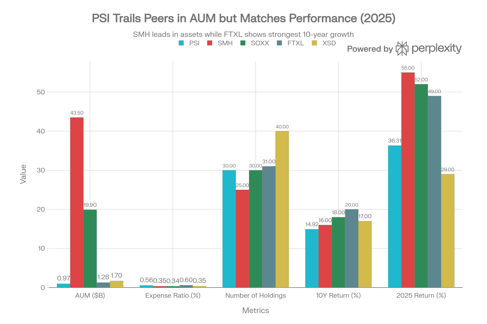
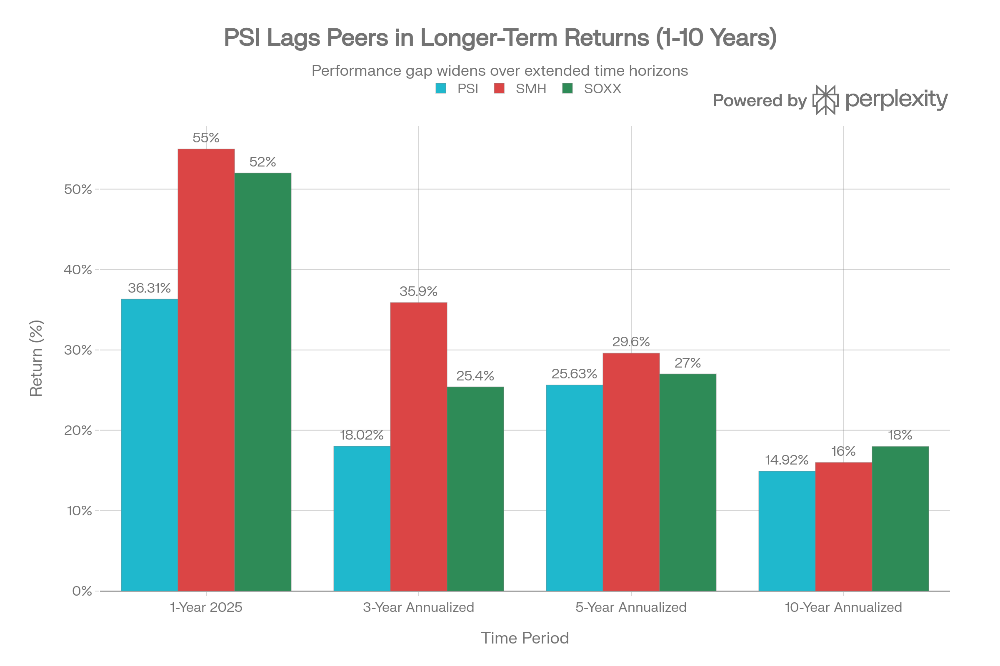

# PSI (Invesco Semiconductors ETF) 종합 분석 보고서

## 요약

PSI는 2005년 출범한 Invesco의 역사 깊은 반도체 전문 ETF로, 동적 세미콘덕터 인텔리덱스(Dynamic Semiconductor Intellidex Index)를 추적한다. \$970M 규모의 중소형 펀드로 30개 종목에 수정된 동일 가중치 방식으로 투자한다. 2025년 36.31% 우수한 수익률을 기록했으나, 10년 기준 14.92% 수익률로 SMH(16%), SOXX(18%)에 뒤진다. 0.56% 높은 수수료와 시가총액 가중 방식의 경쟁사 대비 구조적 성과 부진이 주요 이슈이다.

***

## ETF 분류

| 항목 | 내용 |
|---|---|
| 최종 폴더 | `ETF/Semiconductor/PSI` |
| 대분류 | 테마 |
| 하위 분류 | 반도체 |
| 핵심 전략 | Dynamic Semiconductor Intellidex Index를 추종해 미국 반도체 기업에 수정 동일가중 방식으로 투자 |
| 운용 방식 | 패시브 반도체 테마 ETF |
| 레버리지/인버스 | 없음 |
| 옵션 인컴 여부 | 없음 |
| 분류 판단 | 일반 기술 섹터 전체가 아니라 반도체 산업에 특화된 노출이 핵심이므로 기존 반도체 테마 폴더인 `ETF/Semiconductor`로 분류 |

***

## 1. 기본 현황

| 항목 | 내용 |
| :-- | :-- |
| <strong>펀드명</strong> | Invesco Semiconductors ETF |
| <strong>티커</strong> | PSI |
| <strong>거래소</strong> | NYSE Arca |
| <strong>출범일</strong> | 2005년 6월 23일 (20.6년 운영) |
| <strong>현재 가격</strong> | \$61.70-89.66 (변동폭 큼) |
| <strong>자산규모</strong> | \$970.45M - \$1.00B |
| <strong>보유 종목</strong> | 30-32개 |
| <strong>연간 수수료</strong> | 0.56% |
| <strong>배당 수익률</strong> | 0.13% - 0.33% |
| <strong>지수</strong> | Dynamic Semiconductor Intellidex Index |
| <strong>베타</strong> | 1.50 (높은 변동성) |

PSI는 CHPX(신규 3.5개월)보다 20년 이상 오래된 입증된 펀드로, SMH(\$43.5B), SOXX(\$19.9B) 대비 1/40-50 규모의 중소형 펀드이다. FTXL(\$1.28B)과 유사한 규모이나 2005년부터 운영되어 수년 더 역사가 길다.

***

## 2. 성과 분석

### 근래 수익률

| 기간 | 수익률 |
| :-- | :-- |
| <strong>2025 (YTD)</strong> | +36.31% |
| <strong>2024</strong> | +17.24% |
| <strong>2023</strong> | +48.83% |
| <strong>2022</strong> | -34.31% |
| <strong>2021</strong> | +46.56% |
| <strong>1-Year</strong> | +36.31% |
| <strong>3-Year (연)</strong> | +18.02% |
| <strong>5-Year (연)</strong> | +25.63% |
| <strong>10-Year (연)</strong> | +14.92% |
| <strong>20+년 (연)</strong> | \~13.96% |

### 경쟁 펀드와의 장기 비교

| 펀드 | 10년 | 5년 | 3년 |
| :-- | :-- | :-- | :-- |
| <strong>SMH</strong> | \~16% | 29.6% | 35.9% |
| <strong>SOXX</strong> | \~18% | \~27% | 25.4% |
| <strong>PSI</strong> | 14.92% | 25.63% | 18.02% |
| <strong>FTXL</strong> | \~20% | 23.9% | 11.6% |
| <strong>XSD</strong> | \~17% | \~24% | \~15% |

PSI vs Major Semiconductor ETFs - Long-Term Metrics Comparison

PSI는 <strong>장기 성과 면에서 일관되게 뒤진다</strong>. 10년 기준 SMH 대비 1.08pp, 3년 기준 17.88pp 뒤진다. 특히 3년 성과 격차(18.02% vs SMH 35.9%)가 극심하여, SMH가 이 기간 NVIDIA 급등으로 이득을 본 반면 PSI는 균형 추구로 이득을 놓친 것으로 보인다.

PSI vs SMH vs SOXX - Multi-Period Performance Comparison

### 성과 부진의 원인

1. <strong>균형 가중치의 대가</strong>: PSI는 수정된 동일 가중치로 NVIDIA(4.70%)에만 할당한 반면, SMH는 NVIDIA 20% 이상 할당. 2023-2025 AI 붐 동안 이는 큰 성과 차이를 만듦.
2. <strong>팩터 모멘텀의 시차</strong>: 가격 모멘텀을 고려한 팩터 선별이 시장 변화에 늦게 반응
3. <strong>5년 기준 수익률 약세</strong>: 5년도 25.63%로 SOXX 27%, SMH 29.6%에 뒤짐

***

## 3. 포트폴리오 구성 분석

<strong>상위 10대 종목</strong> (비중순, 혼합 데이터)

| 순번 | 회사명 | 티커 | 비중* | 사업 영역 |
| :-- | :-- | :-- | :-- | :-- |
| 1 | Micron Technology | MU | 5.87% | DRAM/HBM 메모리 |
| 2 | Lam Research | LRCX | 5.24% | 반도체 제조 장비 |
| 3 | KLA | KLAC | 4.93% | 검사 장비 |
| 4 | Qualcomm | QCOM | 4.77% | 모바일/네트워크 칩 |
| 5 | Intel | INTC | 4.75% | CPU |
| 6 | NVIDIA | NVDA | 4.70% | AI GPU (저비중!) |
| 7 | AMD | AMD | 4.58% | CPU/GPU |
| 8 | Broadcom | AVGO | 4.22% | 네트워킹 |
| 9 | Photronics | PLAB | 3.69% | 포토마스크 |
| 10 | SiTime | SITM | 3.17% | 타이밍 솔루션 |

*데이터 출처 간 편차 있음 (Dec 2025 vs Aug 2025)

<strong>포트폴리오 특성</strong>

- <strong>상위 10개 비중</strong>: \~45-46% (상대적으로 낮음)
- <strong>상위 2개 (MU+LRCX)</strong>: \~11% (극히 낮음)
- <strong>장비/부품 비중</strong>: 약 40% (설계/제조 균형)

<strong>PSI의 차별화</strong>: NVIDIA 극도의 저비중(4.70% vs SMH 20%+)이 가장 큰 특징. 이는 펀더멘탈 가중치 방식의 의도된 결과로, 가격 모멘텀, 가치 점수 등에서 NVIDIA가 낮게 평가되었다는 뜻이다.

***

## 4. 비용 및 유동성 분석

<strong>비용 구조</strong>

| 항목 | PSI | SMH | SOXX | FTXL | XSD |
| :-- | :-- | :-- | :-- | :-- | :-- |
| <strong>TER</strong> | 0.56% | 0.35% | 0.34% | 0.60% | 0.35% |
| <strong>차이</strong> | SMH 대비 +21bp | - | - | - | - |

PSI의 0.56% 수수료는 <strong>경쟁 다수(SMH, SOXX, XSD)보다 0.21-22 포인트 높다</strong>. \$100,000 투자 시 연간 \$210-220 추가 손실. 25년 보유 시 복리 손실은 약 \$50,000에 달할 수 있다.

<strong>배당 특성</strong>

- <strong>배당 수익률</strong>: 0.13%-0.33% (극히 낮음)
- <strong>분배 주기</strong>: 분기(4회/년)
- <strong>TTM 배당</strong>: \$0.076-0.084
- <strong>배당 성장</strong>: 1년 기준 -32.56% (급락)
- <strong>최근 분기</strong>: Q2 2025 \$0.04226, Q1 2025 \$0.00514 (불규칙)

배당은 거의 없는 수준이며, 분기별 편차가 극심하다. 성장주 특성.

<strong>유동성 평가</strong>

| 지표 | 수치 | 평가 |
| :-- | :-- | :-- |
| <strong>일평균 거래량</strong> | \~17,400주 (\~\$1.1M) | 보통 |
| <strong>AUM</strong> | \$970M-\$1.0B | 적절 |
| <strong>거래소</strong> | NYSE Arca | 유동 |

PSI는 유동성 면에서 양호하다. CHPX(\$10M)의 100배 이상 규모이고, 일일 거래량도 충분하다. 다만 SMH의 수백만 주 거래량에 비해서는 현저히 낮다.

***

## 5. 인덱스 방법론 (Dynamic Semiconductor Intellidex Index)

<strong>핵심 특징</strong>: "스마트" 팩터 기반 + 수정된 동일 가중치

<strong>5가지 선별 요소 (Superfactors)</strong>

1. <strong>가격 모멘텀</strong> (Price Momentum): 최근 3/6/9/12개월 평균 가격 상승률
2. <strong>실적 모멘텀</strong> (Earnings Momentum): 최근 분기/연간 이익 증가 추세
3. <strong>품질</strong> (Quality): 수익성, ROA, 자산 효율성
4. <strong>경영 활동</strong> (Management Action): 주식 매입, 내부자 거래, 기업 활동
5. <strong>가치</strong> (Value): P/E, P/B, 배당 수익률

<strong>구성 프로세스</strong>

1. <strong>모델 스코어링</strong>: 각 반도체 기업을 5가지 요소로 점수화
2. <strong>상위 선별</strong>: 점수 상위 회사들 선정
3. <strong>수정된 동일 가중치 할당</strong>:
    - <strong>대형 반도체</strong> (\~8개): 인덱스의 40%, 각 평균 2.5%
    - <strong>중소형 반도체</strong> (\~22개): 인덱스의 60%, 각 평균 2.7%
4. <strong>결과</strong>: 약 30개 종목, 대형주 집중도를 피함

<strong>재조정</strong>: 분기 (2월, 5월, 8월, 11월)

<strong>장점</strong>

- 수익성과 가치 기반 선별로 펀더멘탈 강한 회사 우선
- 메가캡 (NVIDIA) 편중 회피
- 중소형 보석 기업 포함 가능

<strong>단점</strong>

- 최고 성과 기업 (NVIDIA, Tesla 같은) 저평가
- 복잡한 팩터 모델로 추적 오차 발생 (\~6%)
- 높은 재조정 빈도로 회전율 증가

***

## 6. 경쟁 펀드 비교

### SMH (VanEck Semiconductor ETF) vs PSI

| 항목 | SMH | PSI |
| :-- | :-- | :-- |
| <strong>자산규모</strong> | \$43.5B | \$970M |
| <strong>수수료</strong> | 0.35% | 0.56% |
| <strong>보유 종목</strong> | 25개 | 30개 |
| <strong>상위 10 비중</strong> | 71.5% | \~46% |
| <strong>NVIDIA 비중</strong> | 20%+ | 4.70% |
| <strong>3년 수익률</strong> | 35.9% | 18.02% |
| <strong>10년 수익률</strong> | \~16% | 14.92% |
| <strong>가중 방식</strong> | 시가총액 | 수정된 동일 가중 |

<strong>결론</strong>: SMH가 명백히 우수. 규모, 비용, 성과 모두 SMH 압승. SMH는 NVIDIA 같은 최고 성과 기업에 베팅했고 대성공.

### SOXX (iShares Semiconductor ETF) vs PSI

| 항목 | SOXX | PSI |
| :-- | :-- | :-- |
| <strong>자산규모</strong> | \$19.9B | \$970M |
| <strong>수수료</strong> | 0.34% | 0.56% |
| <strong>보유 종목</strong> | \~30개 | 30개 |
| <strong>3년 수익률</strong> | 25.4% | 18.02% |
| <strong>10년 수익률</strong> | \~18% | 14.92% |
| <strong>설정년도</strong> | 오래 (역사) | 2005년 |

SOXX도 PSI를 능가. 낮은 수수료와 시가총액 가중 방식의 이점.

### FTXL (First Trust Nasdaq Semiconductor) vs PSI

| 항목 | FTXL | PSI |
| :-- | :-- | :-- |
| <strong>자산규모</strong> | \$1.28B | \$970M |
| <strong>수수료</strong> | 0.60% | 0.56% |
| <strong>보유 종목</strong> | 31개 | 30개 |
| <strong>가중 방식</strong> | Nasdaq 팩터 | Dynamic Intellidex 팩터 |
| <strong>10년 수익률</strong> | \~20% | 14.92% |
| <strong>특징</strong> | Intel 10.71% 과다 | 균형 추구 |

FTXL이 PSI보다 우수한 10년 성과 (20% vs 14.92%). 두 펀드 모두 팩터 가중이지만 결과는 FTXL이 나음.

***

## 7. 위험 분석

### 1. 장기 성과 부진 위험 ★★★ 심각

- <strong>3년</strong>: SMH 대비 -17.88pp (18.02% vs 35.9%)
- <strong>10년</strong>: SMH 대비 -1.08pp (14.92% vs 16%)
- <strong>원인</strong>: 균형 추구로 NVIDIA 저비중, 최고 성과 기업 회피
- <strong>구조적 문제</strong>: 팩터 모멘텀 방식이 시장 트렌드 변화에 늦게 반응

### 2. 높은 수수료 + 추적 오차 ★★★

- <strong>수수료</strong>: 0.56% (경쟁사 대비 +21bp)
- <strong>추적 오차</strong>: 펀드 vs 지수 약 6% 차이 (성과 미흡)
- <strong>총 손실</strong>: 기금 비용 + 관리 미흡 = 복합 손실

### 3. 높은 베타(변동성) ★★

- <strong>베타</strong>: 1.50 (시장 대비 50% 변동성 증대)
- <strong>2022</strong>: -34.31% 급락 (시장 평균 이상 하락)
- <strong>변동성</strong>: 반도체 섹터의 고유 성질, 금리 민감성 높음

### 4. Intel 비중 증가 위험 ★

- <strong>Intel 비중</strong>: 약 4.75% (팩터 가중에서 상대적 고평가)
- <strong>Intel 약세</strong>: 공정 기술 경쟁력 낙후
- <strong>위험</strong>: 추가 하락 시 PSI 성과 부담

### 5. 반도체 사이클 위험 ★★

- <strong>역사적 패턴</strong>: 3-4년 호황/부진 사이클
- <strong>2023-2025</strong>: 회복기 (48.83%, 17.24%, 36.31%)
- <strong>2026-2027</strong>: 조정 가능성, 메모리칩 과잉공급

### 6. NVIDIA 저비중의 대가 ★★

- <strong>PSI</strong>: NVIDIA 4.70%
- <strong>SMH</strong>: NVIDIA 20%+
- <strong>2025 AI 붐</strong>: PSI는 이득을 최소화한 대형 기회 손실
- <strong>향후</strong>: AI 지속 시 계속 언더퍼포밍 위험

### 7. 팩터 모멘텀의 시차 위험 ★

- <strong>추세 후행</strong>: 가격 모멘텀 기반 선별은 이미 상승한 주식을 추적
- <strong>반전 시</strong>: 모멘텀 약화 시 그 회사를 배제하는 지연 발생
- <strong>성과</strong>: 결과적으로 "타이밍" 실패

***

## 8. 투자 논리 검증

### 긍정 요인

1. <strong>20년 이상의 입증된 운영 기록</strong>
    - 2005년부터 운영, 다양한 시장 사이클 경험
    - 펀드 청산 위험 무관
2. <strong>합리적인 펀드 규모와 유동성</strong>
    - \$970M 충분한 규모 (CHPX의 100배)
    - 일일 거래량 충분, 스프레드 합리
3. <strong>2025년 우수한 성과</strong>
    - 36.31% 수익률 (반도체 섹터 호황)
    - 기술주 선호 투자자에게 좋은 리턴
4. <strong>균형 잡힌 포트폴리오 접근</strong>
    - 30개 종목으로 광범위
    - 장비사 포함으로 반도체 가치사슬 전범위 커버

### 부정 요인

1. <strong>높은 수수료 + 추적 오차</strong>
    - 0.56% 수수료는 경쟁사보다 60% 비쌈
    - 지수 대비 6% 추적 오차 (이중 손실)
    - 장기 복리 손실 누적
2. <strong>장기 성과 부진 (3-10년)</strong>
    - SMH 대비 3년 -18pp, 10년 -1pp 뒤침
    - 팩터 가중이 최고 성과 기업 회피
3. <strong>NVIDIA 극도의 저비중</strong>
    - 4.70% 비중은 의도적 저평가
    - AI 시대 핵심 수혜 기업 활용 미흡
4. <strong>메타 2025 후 약세 리스크</strong>
    - AI 초기 투자 완료 후 성장 둔화 가능
    - 금리 상승 환경에서 고성장주 조정

***

## 9. 한국 투자자 고려사항

<strong>거래 환경</strong>

- <strong>NYSE Arca 상장</strong>: 한국 증권사를 통한 해외거래 가능
- <strong>거래 수수료</strong>: 보통 0.25-0.5%
- <strong>환율 위험</strong>: 원/달러 변동 노출
- <strong>세금</strong>: 배당금/자본이득 이중 과세

<strong>투자 대안 비교</strong>

| 상품 | 장점 | 단점 |
| :-- | :-- | :-- |
| <strong>PSI 직접 구매</strong> | 역사, 유동성 | 높은 수수료 (0.56%) |
| <strong>SMH 직접 구매</strong> | 우수한 성과, 낮은 수수료 | 환율 위험 |
| <strong>국내 반도체 ETF</strong> | 원화거래, 높은 유동성 | 0.70-0.80% 고수수료 |
| <strong>국내 펀드</strong> | 액티브 관리 | 1.0-1.5% 극히 높은 수수료 |

<strong>권고</strong>: PSI보다 SMH 구매 권장. 수수료와 성과 모두 우수함.

***

## 10. 최종 평가 및 투자 권고

### 종합 점수: <strong>5.8 / 10</strong>

| 항목 | 점수 | 코멘트 |
| :-- | :-- | :-- |
| <strong>수익 잠재력</strong> | 6/10 | 반도체 성장성 우수하나 성과 부진 |
| <strong>비용 효율</strong> | 3/10 | 0.56% 높은 수수료 + 6% 추적 오차 |
| <strong>포트폴리오 품질</strong> | 6/10 | 균형 잡혔으나 핵심 노출 부족 |
| <strong>유동성</strong> | 7/10 | 충분한 규모, 거래 가능 |
| <strong>위험 관리</strong> | 4/10 | 베타 1.50 높음, 팩터 위험 |
| <strong>혁신성</strong> | 5/10 | 팩터 가중은 기존, 성과 입증 부족 |
| <strong>안정성</strong> | 8/10 | 20년 운영, 청산 위험 없음 |
| <strong>성과 vs 경쟁</strong> | 4/10 | SMH 대비 지속적 언더퍼포밍 |

### 투자 권고

#### 1. 일반 투자자

- <strong>권고</strong>: <strong>비추천</strong> (SMH/SOXX 우선)
- <strong>이유</strong>: 높은 수수료(0.56%)와 추적 오차(6%)의 이중 부담, 장기 성과 부진

#### 2. 반도체 팬 / 장기 투자자 (5년+)

- <strong>권고</strong>: <strong>중립(Hold)</strong> - SMH 선택
- <strong>PSI 선택 불가피 사유</strong>:
    - SMH 이미 최대한 보유
    - 중형 반도체 기업 추가 노출 원함
    - 팩터 기반 접근 신뢰

#### 3. 가치 투자자

- <strong>권고</strong>: <strong>소액 검토</strong> (2-3%, 저점 매입)
- <strong>이유</strong>: 수정된 동일 가중이 저평가 기업 포함 가능

#### 4. 국내 투자자

- <strong>권고</strong>: <strong>국내 반도체 ETF 우선</strong>
    - KODEX/TIGER 반도체 (0.70-0.80% 수수료)
    - PSI는 0.56% 내부 + 0.25-0.5% 거래 + 환율 리스크 = 복합 손실

***

## 11. 결론

PSI는 <strong>20년 운영 역사와 충분한 유동성을 갖춘 합리적인 반도체 펀드</strong>이나, <strong>높은 수수료와 추적 오차의 이중 부담으로 SMH/SOXX라는 명백히 우수한 대안에 밀린다</strong>.

<strong>강점</strong>: 장기 운영 기록, 팩터 기반 선별의 논리성, 유동성

<strong>약점</strong>: 0.56% 높은 수수료, 6% 추적 오차, 3년 성과 -18pp 부진, NVIDIA 저비중(4.70%)

<strong>최종 권고</strong>:

- <strong>SMH가 선택 가능하면 SMH 선택</strong>
- PSI는 <strong>특별한 이유(팩터 투자 신념, 추가 다각화)가 있을 때만 고려</strong>, 소액 배팅
- <strong>일반 투자자</strong>: CHPX, FTXL, XSD 보다는 낫지만 SMH/SOXX에 비해 비효율적

PSI는 "나쁜" 펀드는 아니지만, "최고"는 결코 아니다. 역사와 안정성 추구 투자자에게나 합리적 선택지이다.
[^1][^10][^11][^12][^13][^14][^15][^16][^17][^18][^19][^2][^20][^21][^22][^23][^24][^25][^26][^27][^28][^29][^3][^30][^31][^32][^33][^4][^5][^6][^7][^8][^9]

⁂

[^1]: QTUM (Defiance Quantum ETF).md

[^2]: SETM (Sprott Critical Materials ETF).md

[^3]: REMX (VanEck Rare Earth, Strategic Metals ETF).md

[^4]: https://www.invesco.com/us/en/financial-products/etfs/invesco-semiconductors-etf.html

[^5]: https://finance.yahoo.com/quote/PSI/

[^6]: https://kr.investing.com/etfs/powershares-dynamic-semiconductors

[^7]: https://www.invesco.com/us-rest/contentdetail?contentId=172407c649400410VgnVCM10000046f1bf0aRCRD

[^8]: https://markets.ft.com/data/etfs/tearsheet/summary?s=PSI%3APCQ%3AUSD

[^9]: https://stockanalysis.com/etf/psi/holdings/

[^10]: https://uk.investing.com/etfs/powershares-dynamic-semiconductors

[^11]: https://etfdb.com/etf/PSI/

[^12]: https://kr.benzinga.com/quote/PSI/holdings

[^13]: https://kr.tradingview.com/news/zacks:7161c4d66094b:0-strategic-semiconductor-etf-picks-as-china-s-inflation-hits-three-year-high/

[^14]: https://kr.tradingview.com/symbols/BIVA-PSI/analysis/

[^15]: https://stockanalysis.com/etf/psi/

[^16]: https://www.sumgrowth.com/etf-profile/invest-in-PSI-etf.html

[^17]: https://global.morningstar.com/en-ca/investments/etfs/0P00002DDF/quote

[^18]: https://www.zacks.com/funds/etf/PSI/holding

[^19]: https://www.bankrate.com/investing/best-semiconductor-etfs/

[^20]: https://money.usnews.com/investing/articles/best-semiconductor-etfs-to-buy

[^21]: https://blog.naver.com/PostView.naver?blogId=jae0choi\&logNo=222244693182\&parentCategoryNo=\&categoryNo=44\&viewDate=\&isShowPopularPosts=true\&from=search

[^22]: https://finance.yahoo.com/news/zacks-analyst-blog-highlights-xsd-090300174.html

[^23]: https://www.moomoo.com/au/learn/detail-semiconductor-etfs-surge-comparing-the-top-10-117239-240770101

[^24]: https://www.ice.com/publicdocs/data/Intellidex_Index_Family_Methodology.pdf

[^25]: https://stockanalysis.com/etf/psi/dividend/

[^26]: https://www.nerdwallet.com/investing/learn/semiconductor-etfs

[^27]: https://www.ice.com/publicdocs/data/Intellidex_Index_Series_Methodology.pdf

[^28]: https://www.digrin.com/stocks/detail/PSI/

[^29]: https://www.tradingview.com/news/zacks:8bb18d1ce094b:0-here-s-why-semiconductor-etfs-are-hitting-52-week-highs/

[^30]: https://www.nyse.com/publicdocs/data/Intellidex_Index_Series_Methodology.pdf

[^31]: https://www.wisesheets.io/PSI.TO/dividend-history

[^32]: https://www.investing.com/academy/etfs/best-semiconductor-etfs-to-watch/

[^33]: https://etfdb.com/index/dynamic-semiconductors-intellidex-index/
